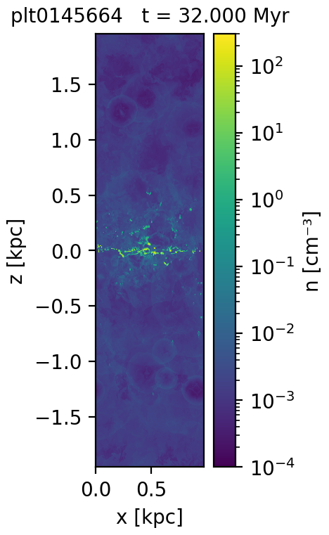
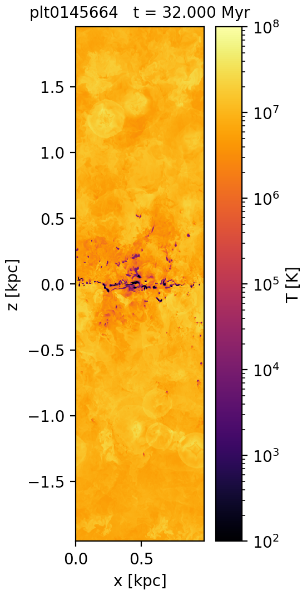
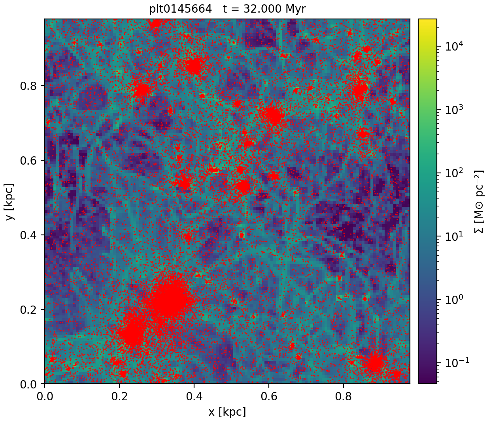
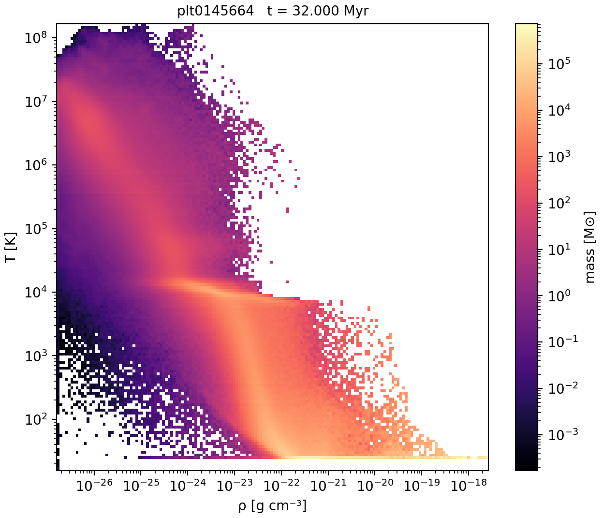
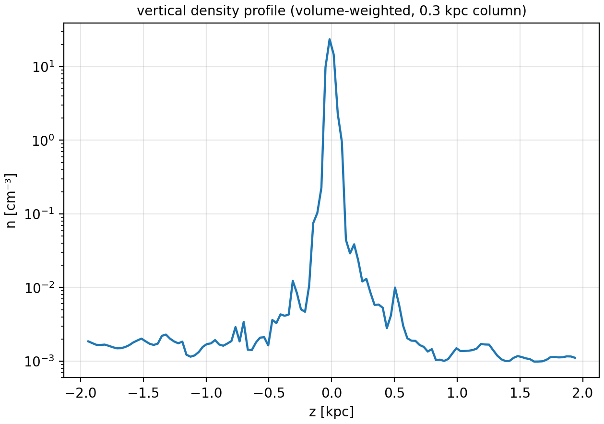
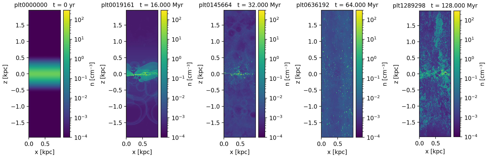
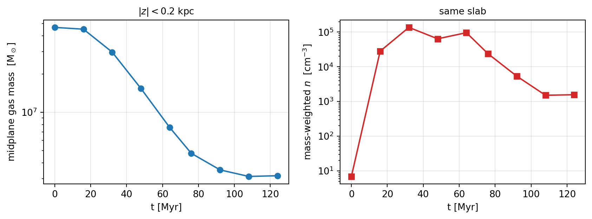
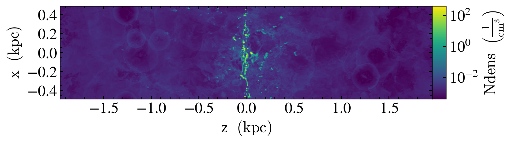

# An AMReX/BoxLib frontend for Mera.jl, a Quokka layer on top of it, and `jamr`

*Branch: `multicode`. Written against Quokka production data on OLCF Andes.*

Two things were asked for and both are done:

1. **A frontend for the AMReX/BoxLib plotfile container, plus a Quokka layer that depends on
   it** — the same split yt uses (`QuokkaDataset` is a subclass of `AMReXDataset`). Quokka
   data now flows through Mera's whole code-blind analysis layer: `getvar`, `projection`,
   `slice`, `profile`, `phase`, `subregion`, `filterdata`, `savedata`/`loaddata`.
2. **`jamr`** — an executable for quick processing and visualisation from the shell, modelled
   on `~/softwares/quokka/quokka/scripts/python/quick_plot`, but reading through Mera so the
   same command works on Quokka, RAMSES, Athena++, FLASH, PLUTO and GADGET output.

Everything below was run on the production dataset at
`/autofs/nccs-svm1_home2/chongchong/Projects-cloud/2026-quokka-outflow/hpc/run2.v2/sigma50-box4kpc/run1`
— a 512×512×2048 Quokka box, 33 GB per plotfile, 34 plotfiles spanning 0–128 Myr.

---

## Contents

- [What was added](#what-was-added)
- [How to run it](#how-to-run-it)
- [Demos](#demos) — every figure in this report, with the command that made it
- [Validation against yt](#validation-against-yt)
- [What I discovered](#what-i-discovered)
- [Design notes](#design-notes)
- [Tests](#tests)
- [Limitations and what I would do next](#limitations-and-what-i-would-do-next)

---

## What was added

| File | Lines | What it is |
|---|---:|---|
| `src/read_data/AMReX/reader_amrex.jl` | 1314 | The AMReX/BoxLib **container**: `Header`, `Level_L/Cell_H`, FAB blobs, particle records, AMR levels, leaf extraction, geometry mapping, field specification, `gethydro_amrex`, `getparticles_amrex` |
| `src/read_data/AMReX/reader_quokka.jl` | 394 | The **Quokka layer**: `metadata.yaml` (units), the component-name table, radiation groups and passive scalars, `Fields.yaml` particle dimensions, detection |
| `scripts/jamr` | 1041 | The command-line tool |
| `test/fixtures_amrex.jl` | 202 | A synthetic AMReX plotfile **writer** (the test fixture) |
| `test/76_amrex_reader_tests.jl` | 398 | 96 assertions on the reader |
| `test/77_jamr_cli_tests.jl` | 221 | 85 assertions on the CLI |
| `docs/src/amrex_reader.md` | 283 | User documentation |
| `scripts/validation/yt_covering_grid.py` | 57 | Dumps a yt covering grid — the reference half of the cross-check |
| `scripts/validation/compare_amrex_vs_yt.jl` | 79 | Compares Mera against that dump, cell by cell |

Plus small edits to existing files: the two readers are registered in
`src/read_data/register_readers.jl`, exported from `src/Mera.jl`, added to the cross-reader
contract test (`test/59_multicode_contract_tests.jl`), and the reader registry gained one
capability flag (below).

`Mera.capability_matrix()` now reports:

```
| Code (`getinfo` key)              | simcode  | getinfo | gethydro | getparticles | … |
| RAMSES (native AMR) (:ramses)     | RAMSES   |    ✓    |    ✓     |      ✓       |   |
| AMReX / BoxLib plotfile (:amrex)  | AMReX    |    ✓    |    ✓     |      ✓       | — |
| Quokka (AMReX plotfile) (:quokka) | Quokka   |    ✓    |    ✓     |      ✓       | — |
| Athena++ (.athdf) (:athena)       | Athena++ |    ✓    |    ✓     |      —       | — |
| …                                                                                    |
```

### The one change to shared code

`gethydro` used to refuse `vars=` for every non-RAMSES frontend, because none of them could
read fewer columns than the file holds. AMReX can: the components of a FAB are contiguous
blocks, so reading one of eight fields really does read one eighth of the bytes. Rather than
special-case it, I added a `select_vars` flag to `register_reader!`. A reader that sets it
receives the user's `vars`; the ones that cannot honour it still refuse rather than silently
returning everything. This is what makes `jamr slice -f rho` on a 33 GB plotfile affordable.

---

## How to run it

### Environment

The Julia environment used here (Andes login node):

```bash
source ~/rc/julia.rc                                     # module load Core/25.04 julia/1.11.0
export LD_LIBRARY_PATH="$(dirname $(which julia))/../lib/julia:$LD_LIBRARY_PATH"
export JULIA_NUM_THREADS=16
export MERA_DEV=$HOME/.julia/environments/mera-amrex      # a scratch env, see the note below
julia --project=$MERA_DEV
```

> **Note on the environment.** The repository's committed `Manifest.toml` pins
> `ArrayInterface v3.1.32`, which fails to precompile on Julia 1.11
> (`too many parameters for type AbstractTriangular`), so `julia --project=.` cannot load
> Mera on this machine at all. I did **not** rewrite the tracked manifest — that is a
> separate decision — and worked in a side environment instead:
>
> ```bash
> julia --project=$MERA_DEV -e '
>   using Pkg
>   Pkg.develop(path="'$PWD'")
>   Pkg.add("PyPlot")'
> ```
>
> Two more environment quirks worth recording, both unrelated to this work:
> `LD_LIBRARY_PATH` puts `/sw/andes/gcc/9.3.0/lib64` ahead of Julia's own, so HDF5's artifact
> fails with `GFORTRAN_10 not found` until Julia's `lib/julia` is prepended (the `export`
> above); and `PyCall` was configured against a Python without matplotlib, fixed with
> `PYTHON=/ccs/home/chongchong/softwares/post-processing/yt/.venv/bin/python julia --project=$MERA_DEV -e 'using Pkg; Pkg.build("PyCall")'`.

### From Julia

```julia
using Mera

run = "/autofs/nccs-svm1_home2/chongchong/Projects-cloud/2026-quokka-outflow/hpc/run2.v2/sigma50-box4kpc/run1"

info = getinfo(145664, run)              # auto-detects Quokka; finds run/plt0145664
gas  = gethydro(info; vars=[:rho, :temperature],
                xrange=[0.0, 0.125], yrange=[0.0, 0.125], zrange=[0.4375, 0.5625])
prt  = getparticles(info)                # StochasticStellarPop_particles

msum(gas, :Msol)
projection(gas, :sd, :Msol_pc2)
```

`getinfo` prints what it found and — importantly — how each column was obtained:

```
Code: Quokka   (HyperCLaw-V1.1)
output: 145664  time: 1.00985e15 [code units]
domain: 512×512×2048 cells on level 11, AMReX levels 0:0 ⇒ Mera levels 11:11
        x 0.0 … 3.018e21   y 0.0 … 3.018e21   z -6.036e21 … 6.036e21  [code units]
boxlen (enclosing cube) = 1.2072e22   boxes/level: 128
NOTE: non-cubic domain — the data spans x=(0.0, 0.25) y=(0.0, 0.25) z=(0.0, 1.0) of Mera's box
variables: (rho, Etot, vx, vy, vz, scalar_0, temperature, gpot, p)
  · pressure :p derived as (γ-1)·e_int  [e_int = gasEnergy − ½ρv², γ=1.66667]
  · temperature :temperature read from the stored field "temperature"
particles "StochasticStellarPop_particles": 193445  (x, y, z, mass, vx, …, evolution_stage)
Quokka version: 25.03   units: unit_length=1.0 cm, unit_mass=1.0 g, unit_time=1.0 s  (⇒ code units are CGS)
radiation groups: 0   passive scalars: 1
```

### The `jamr` executable

`scripts/jamr` has a `#!/usr/bin/env julia` line and activates the repository's project when
Mera is not already on the load path. On this machine, with the side environment, a two-line
wrapper is the practical way to invoke it:

```bash
cat > ~/bin/jamr <<'EOF'
#!/bin/bash
source ~/rc/julia.rc
export LD_LIBRARY_PATH="$(dirname $(which julia))/../lib/julia:$LD_LIBRARY_PATH"
export JULIA_NUM_THREADS=${JULIA_NUM_THREADS:-16}
exec julia --project=$HOME/.julia/environments/mera-amrex \
     /autofs/nccs-svm1_home2/chongchong/softwares/post-processing/Mera.jl/scripts/jamr "$@"
EOF
chmod +x ~/bin/jamr
jamr --help
```

```
jamr <command> [options] <plotfile-or-run-directory> ...

COMMANDS
  info      what a snapshot contains: fields, domain, AMR levels, particles, and where
            each Mera column came from (stored vs. derived).  --fields adds per-component
            extrema, read from the level indices without touching cell data.
  list      one line per snapshot in a run directory: number, time, base resolution.
  slice     a single cutting plane through the volume.
  proj      a line-of-sight projection.
  phase     a 2-D mass-weighted histogram of two fields (default ρ–T).
  profile   a 1-D binned profile of a field against a coordinate.
  stats     per-snapshot reductions to the terminal, and to CSV with --csv.
```

---

## Demos

All commands below are exactly as run, against
`R=/autofs/nccs-svm1_home2/chongchong/Projects-cloud/2026-quokka-outflow/hpc/run2.v2/sigma50-box4kpc/run1`.

### 1. What is in a snapshot

```bash
jamr info --fields $R/plt0145664
```

Prints the block quoted above, plus a per-column provenance table and the global extremum of
every stored component — the latter read from the per-FAB min/max tables AMReX writes at the
end of each `Cell_H`, so **no cell data is touched** (2.3 ms on the 33 GB plotfile):

```
column provenance:
  :Etot          stored: gasEnergy
  :gpot          stored: gpot
  :p             (γ-1)·e_int with e_int = gasEnergy − ½ρv², γ=1.66667
  :rho           stored: gasDensity
  :scalar_0      stored: scalar_0
  :temperature   stored: temperature  [kelvin, ground truth]
  :vx            stored: x-GasMomentum / density

stored-component extrema (from the level indices, no cell data read):
  gasDensity               5.000000e-28     2.689107e-18
  gasEnergy                3.325882e-15     7.991448e-06
  gpot                    -2.899357e+14    -1.291912e+10
  scalar_0                 1.464320e-40     5.166191e-21
  temperature              1.576046e+01     1.689201e+08
  x-GasMomentum           -1.501877e-12     2.455768e-12
```

```bash
jamr list $R
```

```
snapshot                     output       time [Myr]  cells (level 0)
plt0000000                        0                0        536870912
plt0001228                     1228          4.00193        536870912
…
plt1289298                  1289298              128        536870912
```

### 2. Edge-on density slice

```bash
jamr slice -f n --direction y --axis-unit kpc -o figures $R/plt0145664
```



*4 kpc of a stratified ISM patch at t = 32 Myr: the cold, dense midplane and the
supernova-blown cavities above and below it. `n = ρ/(μ·m_u)` with `--mu` (default 1.0).*

**51 s, and it reads 2.1 million of the 537 million cells.** A cutting plane needs one cell
along the line of sight, so `jamr` narrows the load to a slab half a coarse cell wide on each
side of the plane before asking Mera for anything, and asks only for `gasDensity`:

```
[Mera]: AMReX plt0145664 → 64/128 boxes, 2097152 leaf cells in the requested range, 1/8 stored components read
```

### 3. Temperature slice

```bash
jamr slice -f T --direction y --axis-unit kpc --cmap inferno --zlim 1e2 1e8 -o figures $R/plt0145664
```



*The same cut in temperature. This run **does** store a `temperature` component, so it is used
as ground truth — see [Temperature](#temperature-is-not-a-quokka-field) below for what happens
when a run does not.*

### 4. Face-on surface density with star particles

```bash
jamr proj -f sd --direction z --depth 1_kpc --axis-unit kpc --res 512 \
     --particles StochasticStellarPop_particles --p-size 6 -o figures $R/plt0145664
```



*Gas surface density through a 1 kpc slab, with all 193 445 stochastic stellar-population
particles over-plotted. The clusters sit on the dense filaments, as they should. Particle
positions come from the AMReX particle container and are placed in the same coordinates as the
gas.*

### 5. Phase diagram

```bash
jamr phase -f rho --yfield T --depth 0.4_kpc --bins 160 -o figures $R/plt0145664
```



*Mass-weighted ρ–T diagram of the midplane slab. The three ISM phases are all there: the cold
floor near 15 K, the 10⁴ K warm branch with the thermally unstable ridge above it, and the hot
supernova-heated gas along a nearly isobaric track to 10⁸ K.*

### 6. Vertical profile

```bash
jamr profile -f n --xvar z --weight volume --width 0.3_kpc --axis-unit kpc --bins 120 \
     --title "vertical density profile (volume-weighted, 0.3 kpc column)" -o figures $R/plt0145664
```



*Volume-weighted `n(z)` through a 0.3 kpc-wide column: ~20 cm⁻³ at the midplane falling to
~10⁻³ cm⁻³ in the halo.*

### 7. Batch: a time sequence

```bash
jamr slice -f n -d y --axis-unit kpc --zlim 1e-4 3e2 \
     --outputs 0,19161,145664,636192,1289298 --figsize 4 -o figures $R
```



*t = 0, 16, 32, 64, 128 Myr. The smooth initial stratified disc breaks up, supernovae carve
bubbles, and by 128 Myr a cold fountain reaches ±2 kpc. One command, five snapshots; `--outputs`
also takes ranges (`10:20,35`), and `--every N` / `--max-snapshots N` / `--first-only` thin a
whole run directory.*

### 8. Numbers, not pictures

```bash
jamr stats -f n --depth 0.4_kpc --every 4 --csv midplane_stats.csv $R
```

```
snapshot                    time[Myr]     mass[Msol]            min            max   mean(mass-w)
plt0000000                          0    4.64913e+07       0.671759        9.85904        6.94509
plt0019161                         16    4.50044e+07    0.000964663    1.91467e+06        28119.4
plt0145664                    32.0001    2.96941e+07    0.000964663    1.61942e+06         136244
plt0380849                         48    1.53647e+07    0.000964663         870123        63932.6
plt0636192                         64     7.5826e+06    0.000964663    1.01159e+06          95974
plt0783280                    76.0001    4.75092e+06    0.000964663         238465        23839.3
plt0958105                    92.0001    3.51997e+06    0.000964663         183877        5377.31
plt1130213                        108    3.12481e+06    0.000964663        90602.8        1513.21
plt1269207                        124    3.16582e+06    0.000964663          51080         1566.1
```



*Gas mass within |z| < 0.2 kpc drops by 15× over 124 Myr as the outflow and star formation
drain the midplane. The CSV is at
[`assets/amrex_quokka/midplane_stats.csv`](assets/amrex_quokka/midplane_stats.csv); the figure
was made from it with a four-line matplotlib script.*

### 9. The same thing from Julia

Nothing in `jamr` is privileged — it is a thin layer over the public API:

```julia
using Mera
run  = "…/sigma50-box4kpc/run1"
info = getinfo(145664, run)

e    = amrex_extent(info)                       # the data's own bounds inside Mera's box
gas  = gethydro(info; vars=[:rho], xrange=e[1:2], yrange=e[3:4], zrange=[0.45, 0.55])
p    = projection(gas, :sd, :Msol_pc2; res=512, xrange=e[1:2], yrange=e[3:4],
                  center=[0.,0.,0.], range_unit=:standard)
p.maps[:sd]                                      # a 512×512 map

prt  = getparticles(info; ptype="StochasticStellarPop_particles")
sum(Mera.select(prt.data, :mass)) / info.constants.Msol    # 1.82e7 M⊙ of stars
```

---

## Validation against yt

yt's `yt/frontends/amrex` was the reference implementation. The check is not "the pictures look
similar" — it is **cell for cell against yt's covering grid**.

Both halves are in the repository, so the check is repeatable:

**Reference** — [`scripts/validation/yt_covering_grid.py`](scripts/validation/yt_covering_grid.py)
dumps a dense covering grid to raw float64:

```bash
/ccs/home/chongchong/softwares/post-processing/yt/.venv/bin/python \
    scripts/validation/yt_covering_grid.py \
    $R/plt0145664 ref_prod \
    gasDensity,x-GasMomentum,gasEnergy,temperature,gpot,scalar_0 \
    '[0.0, 0.0, -7.545e20]' '[256,256,256]'
```

**Comparison** — [`scripts/validation/compare_amrex_vs_yt.jl`](scripts/validation/compare_amrex_vs_yt.jl)
loads the same window through Mera and compares each cell (exits non-zero on any mismatch):

```bash
julia --project=$MERA_DEV scripts/validation/compare_amrex_vs_yt.jl ref_prod $R 145664
```

```
window (box-normalised) x=[0.0, 0.125] y=[0.0, 0.125] z=[0.4375, 0.5625]
[Mera]: AMReX plt0145664 → 4/128 boxes, 16777216 leaf cells in the requested range, 8/8 stored components read
cells = 16777216 (expect 16777216)
gasDensity         max |Δ|/|ref| = 0.000e+00   mismatching cells = 0
x-GasMomentum      max |Δ|/|ref| = 2.211e-16   mismatching cells = 0
gasEnergy          max |Δ|/|ref| = 0.000e+00   mismatching cells = 0
temperature        max |Δ|/|ref| = 0.000e+00   mismatching cells = 0
gpot               max |Δ|/|ref| = 0.000e+00   mismatching cells = 0
scalar_0           max |Δ|/|ref| = 0.000e+00   mismatching cells = 0

ALL FIELDS MATCH yt EXACTLY
```

16.7 million cells, six components, **bit-identical**. The momentum differs in the last bit
only because Mera stores velocity and the comparison multiplies back by ρ. The same check on
the small Quokka test plotfile (`~/softwares/quokka/quokka/tests/plt0000002`, 64³, 10
components including radiation) is likewise exact.

**Particles**, all 193 445 of them, against `ds.all_data()`:

| quantity | yt | Mera |
|---|---|---|
| `particle_mass` sum | 3.6260110368e+40 | 3.626011036785897e40 |
| `particle_vx` sum | 1.4900523512e+10 | 1.49005235123053e10 |
| `particle_birth_time` sum | 1.4267810621e+20 | 1.4267810620709955e20 |
| `particle_id` sum | 4.0427580340e+09 | 4.042758034e9 |
| `particle_evolution_stage` sum | 1.5202300000e+05 | 152023.0 |
| `particle_position_z` min | −6.0180382818e+21 | 1.7961718234e+19 (+ `domain_left_edge` = −6.018e21 ✓) |
| `particle_luminosity_0` | NaN | NaN (faithfully) |

**Visual cross-check** — the same y-slice through yt (`yt.SlicePlot(ds, "y", ndens)`):



Same structures, same values. yt's y-slice puts z horizontal and x vertical, and labels the
axes relative to the plot centre; `jamr` keeps the natural axis order (x, z) and labels them in
the simulation's own absolute coordinates. Both are conventions, not disagreements.

---

## What I discovered

### Temperature is not a Quokka field

This was the single most consequential thing to get right. Quokka's hydro solver carries no
temperature — it is a property of the EOS and the cooling module — so **most Quokka runs write
none**. The production run here happens to write one; the Quokka test problems in
`~/softwares/quokka/quokka/tests/plt0000002` do not.

`:temperature` is therefore resolved by an explicit cascade, and the branch taken is recorded:

1. **a stored `temperature` / `gasTemperature` component** — ground truth, in kelvin;
2. **else the stored internal energy density**: `T = (γ−1)·e_int/ρ · μ·m_u/k_B`;
3. **else the total energy minus the kinetic term** (and the magnetic term `B²/8π` when the run
   stores a field), then as (2).

Branches 2 and 3 need a mean molecular weight, which no plotfile records. It is the `mu`
keyword (atomic mass units, default `1.0`), and every log line says so:

```
  · temperature :temperature derived as (γ-1)·e_int/ρ · μ·m_u/k_B
    [e_int = stored: gasInternalEnergy, γ=1.66667, μ=1.0 amu — an ASSUMPTION; set it with mu=…]
```

`amrex_provenance(info)` returns the same statement programmatically, so a script can record
what its temperatures actually mean. `--mu` on the command line does the same thing, and the
tests pin that `T(μ=2.5) == 2.5·T(μ=1)` exactly.

### Where I did not follow yt

The instruction was to treat yt's Quokka frontend as a soft reference. Three places where I
read the plotfile instead:

**`Fields.yaml` is alphabetical; the `Header` is in storage order.** Quokka writes each
particle container's component *dimensions* to `<ptype>/Fields.yaml` with its keys sorted
alphabetically, while the container `Header` lists the components in the order they are stored.
For `StochasticStellarPop_particles` the two orders are completely different:

```
Header (storage order):   mass, vx, vy, vz, birth_time, death_time, birth_x, …, luminosity_0
Fields.yaml (alphabetical): birth_time, birth_x, birth_y, birth_z, death_density, death_time, …
```

yt replaces the header names with the YAML key list by position, and exposes the result as
`ds.parameters['particle_info'][ptype]['fields']` — so anyone reading `ds.parameters` sees
`mass` where the file stores `birth_time`. (yt's own `field_list` is unaffected: it is built
from the header, and the unit lookup happens to re-key by name.) Mera matches **by name**, and
strips a trailing group index so `luminosity_0` finds the YAML entry `luminosity`. That also
fixes a smaller yt consequence: `luminosity_0` gets no unit annotation there at all, because
neither `particle_luminosity` nor `luminosity` is in the field list.

**The base integer components.** A container written without the checkpoint flag stores *no*
integer components — not the `(id, cpu)` pair and not the declared extras. The header's
`is_checkpoint` byte is what decides, and it is read from the file rather than passed in (yt's
`AMReXParticleHeader` takes an `is_checkpoint` argument that it then ignores; the production
containers set the flag even though they are plotfiles).

**Conserved vs. primitive.** yt exposes `("boxlib", "x-GasMomentum")` and derives velocity in a
field function. Mera's analysis layer is written against primitives, so the translation is done
at read time and stated per column: `:vx` is `"stored: x-GasMomentum / density"`, `:p` is
`"(γ-1)·e_int with e_int = gasEnergy − ½ρv²"`. Every raw component is *also* exposed under its
own name (`:Etot`, `:scalar_0`, `:gpot`, `:Erad_0`), so nothing is hidden.

### Two facts about the data worth writing down

**The domain is not cubic and does not start at the origin.** 512×512×2048 cells, `x, y ∈
[0, 3.018e21]` cm, `z ∈ [−6.036e21, 6.036e21]` cm. Mera's coordinate system is a cube with
`2^level` cells per side, so the domain is padded to a 2048³ cube (`levelmin = 11`,
`boxlen = 3.91 kpc`) of which the data occupies `x, y ∈ [0, 0.25]`, `z ∈ [0, 1]`; and Mera's
origin sits at `domain_left_edge`, so `getvar(:z)` runs 0…1.21e22 rather than ±6.04e21. Both
facts are printed by `getinfo`, exposed as `amrex_extent(info)` and `amrex_domain(info)`, and
handled automatically by `jamr` (default frame = the data, axis labels = the simulation's own
coordinates).

**`Cell_H` carries free extrema.** After the `FabOnDisk` map, AMReX writes a per-FAB min and
max for every component. `amrex_extrema(info)` reads them: the global range of all 8 components
of the 33 GB plotfile in **2.3 ms**, with no cell data read. Useful for colour limits and for
sanity-checking a run before committing to a load.

**Units.** `metadata.yaml` records `unit_length`, `unit_mass`, `unit_time`. This run writes
`1, 1, 1` — the data is CGS. The Quokka *test* problems write `.nan` for all three, which is
how a dimensionless run spells "no units"; that is read as 1, never propagated as NaN.

### Performance on the production box

| operation | cells read | wall time |
|---|---:|---|
| `getinfo` (metadata only) | 0 | 3.9 s (incl. compilation) |
| `amrex_extrema` (all 8 component ranges) | 0 | 2.3 ms |
| 256³ window, 2 of 8 components | 1.7e7 (4/128 boxes) | 10 s |
| `jamr slice` (one plane, 1 component) | 2.1e6 (64/128 boxes) | 51 s |
| `jamr proj` 1 kpc slab + 193k particles | 1.4e8 (48/128 boxes) | 102 s |
| `jamr phase` 0.4 kpc slab, 2 components | 5.5e7 (16/128 boxes) | 75 s |
| yt covering grid, 256³, 6 components (reference) | 1.7e7 | 158 s |

16 threads on an Andes login node, Lustre. Most of the win is not the reader being fast — it is
the reader being asked for less.

---

## Design notes

### The layering

`reader_amrex.jl` knows the **container** and nothing about physics: how to parse a `Header`,
how to find a FAB and its endianness, how AMR levels map onto Mera's, which coarse cells a
finer level covers, how a particle record is laid out. `reader_quokka.jl` knows **Quokka**: the
component names, `metadata.yaml`, `Fields.yaml`, and detection. A second AMReX application
(Castro, Nyx, WarpX) needs only a name table — `AMREX_VARMAP` has a starter set of the common
Castro/MAESTRO spellings, and `getinfo_amrex(…; varmap=…)` takes a custom one.

### `AMReXFieldSpec`: deciding what to read before reading it

What a plotfile stores and what an analysis wants are different lists. Rather than read
everything and derive afterwards, each output column declares the FAB components it needs and a
closure that builds it:

```julia
struct AMReXFieldSpec
    outputs::Vector{Symbol}
    deps::Dict{Symbol,Vector{Int}}        # column → 0-based FAB component indices
    compute::Dict{Symbol,Function}        # column → Dict{Int,Vector{Float64}} -> Vector{Float64}
    provenance::Dict{Symbol,String}       # column → how it was obtained, in words
    notes::Vector{String}
end
```

`gethydro` unions the `deps` of the requested columns, reads exactly those, and calls the
closures. That is what makes `vars=[:rho]` read one eighth of the file and
`vars=[:temperature]` read whatever the cascade happens to need. `provenance` is the same
mechanism's by-product: a derived column can never be mistaken for a stored one, because the
thing that computes it also names itself.

### Leaf extraction

The AMR hierarchy is flattened to leaf cells — a coarse cell is dropped when a box on the next
finer level covers it — because that is what Mera's analysis layer expects and what makes a
spatial window an exact, hole-free filter. The covering test is done per box, against the
coarsened index ranges of the finer level's boxes, so nothing dense is allocated over a whole
level.

The property the tests pin is not the leaf *count* but the **volume identity**: Σ (cell
volume) == domain volume. That is exactly what "no gaps and no double counting" means, and it
is what a projection or a mass sum depends on.

### Window selection

A window prunes twice. Boxes whose bounding box misses it are never opened; and within a box
that does intersect, the leaf mask is intersected with the same cell-centre test Mera's
`_external_keep` uses, so the output columns are sized to the cells that survive. Before that
second step, a 256³ window of the production box allocated for 100 million rows and kept 17
million; after it, it allocates 17 million (6.4 GiB → 2.1 GiB, 15 s → 10 s).

### `jamr`

Written as `module JAMR` with a `main(argv)`, running itself only when it *is* the program — so
the tests `include` it and call its functions directly. PyPlot is imported lazily (so `info`,
`list` and `stats` work on a machine with no matplotlib) and the plotting commands are
dispatched through `invokelatest`, which is what makes the freshly-imported bindings callable.

Three decisions worth naming:

* **The default frame is the data, not the box.** Framing a 512×512×2048 run on Mera's padded
  cube would put it in a corner of a mostly empty image.
* **Axes are labelled in the simulation's own coordinates.** Mera measures from
  `domain_left_edge`; `jamr` adds it back, so the midplane of this run reads z = 0, not
  z = 1.96 kpc.
* **A slice loads a slab, not a column.** Without that, `jamr slice` on the production box read
  all 537 million cells to keep 262 144 of them, and was killed for memory. It now reads a slab
  half a coarse cell wide on each side of the plane.

---

## Tests

```bash
julia --project=$MERA_DEV -e 'using Mera, Test; include("test/76_amrex_reader_tests.jl")'
julia --project=$MERA_DEV -e 'using Mera, Test; include("test/77_jamr_cli_tests.jl")'
julia --project=$MERA_DEV -e 'using Mera, Test; cd("test"); include("59_multicode_contract_tests.jl")'
```

```
AMReX / Quokka frontend |   96     96  37.7s
jamr CLI                |   85     85  51.2s
multi-code reader contract (data-free) |   75     75  1m09s
  PLUTO (uniform)                      |   14     14
  Athena++ (AMR)                       |   14     14
  FLASH (AMR)                          |   14     14
  Quokka (AMReX plotfile, AMR)         |   14     14
  AMReX / BoxLib (AMR)                 |   14     14
```

All three are **data-free** and run in CI: no public multi-level AMReX dataset ships with Mera,
and the Quokka runs available here are single-level and tens of GB, so
`test/fixtures_amrex.jl` **writes** plotfiles — byte-for-byte in AMReX's format, including the
`FAB ((8, (64 11 52 …)))` preamble and the per-FAB min/max tables. That is the only way to
exercise refinement ratios, the level mapping and leaf extraction at all.

The reader fixture is deliberately awkward: 16×8×32 base cells (non-cubic, so Mera pads to a
32³ cube) on a domain anchored at `(−1, 2, 0)` (so the origin is offset), with a level-1 patch.
Every cell value is an analytic function of its centre, so a one-cell indexing error shows up
as a value mismatch rather than as a subtle bias.

What is pinned: the container parse; the geometry mapping and the padded-cube extent; leaf
extraction as the volume identity; `vars=` returning the same numbers as a full read; a
load-time window agreeing cell-for-cell with the same cut applied afterwards; all three
branches of the temperature cascade including the `B²/8π` term and the μ scaling; the particle
record layout with and without the checkpoint flag; `Fields.yaml` matched by name; the YAML
subset parser; and — via the contract test — that both new readers satisfy the same invariants
as PLUTO, Athena++ and FLASH, right down to the `savedata`/`loaddata` Mera-file round-trip.

The CLI tests cover argument parsing, the unit conversion in the window arithmetic (a
`--width 1_kpc` read in the wrong direction silently selects nothing — that bug existed and is
now pinned), field-name resolution against the data at hand, which columns a request implies,
and the rendering path end to end when matplotlib is present.

---

## Limitations and what I would do next

**Scope of the reader.** 3-D Cartesian plotfiles with cubic cells. 1-D/2-D and non-Cartesian
`coord_sys` are refused with a clear message rather than approximated — Mera's level convention
has no third axis to put a 2-D run on. Checkpoints (`chkNNNNN/`) are not read. Face-centred
`fc_vars/` datasets and WarpX raw fields are not read (the component names are handled; the
directory layout is not).

**No real AMR data was available.** Every Quokka run on this machine is single-level, so the
multi-level path is exercised only by the synthetic fixture and by the contract test. The
fixture covers refinement ratios, the level mapping and leaf extraction, but a real multi-level
Quokka or Castro plotfile would be worth running through it — I would expect the covered-cell
logic to be right (it is a pure index computation, checked against a volume identity) and the
per-level I/O scheduling to want tuning.

**Reading less than a whole FAB.** Components are contiguous, so column selection is cheap.
Cells within a component are `i`-fastest, which means a contiguous *k*-range is also contiguous
on disk — a z-slab could be read without touching the rest of the box. That would make
`jamr slice -d z` roughly a factor of the box's z-extent cheaper. Not done; the current slab
restriction already avoids the pathological case.

**The `Manifest.toml` problem.** The tracked manifest cannot be instantiated on Julia 1.11
(`ArrayInterface v3.1.32`). Everything here runs in a side environment. Updating the manifest
is a repository-level decision I did not take unilaterally, but it will have to be taken before
anyone can run `julia --project=.` on a current Julia.

**μ is one number.** The reconstructed temperature uses a single mean molecular weight for the
whole box. A run with a cooling module that tracks ionisation could do better, and Quokka's
`scalar_N` fields are where that state would live — but the mapping from scalars to species is
problem-specific and not recorded in the plotfile, so it needs a per-problem hook rather than a
guess.
