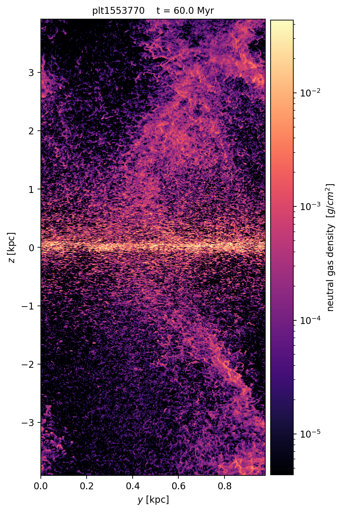

# Neutral-gas column density from a 583 GB Quokka plotfile

*Branch: `quokka-frontend`. Written and run against production data on OLCF Andes.*

The task: an x-direction projection of neutral gas density on
`hpc/run2.v2/sigma50-1pc/run1/plt1553770`, with neutral gas defined by electron fraction
`x_e < 0.05`, and with the processed image cached so that re-colouring the figure does not
mean re-reading the plotfile.

It is done, it agrees with yt to within one floating-point ulp, and it takes **3 minutes
50 seconds** on one node — or **12 minutes on a single core**, against yt's six.

---

## Contents

- [Files](#files)
- [Two routes: standalone and through Mera](#two-routes-standalone-and-through-mera)
- [What "neutral" means here](#what-neutral-means-here)
- [How to run it](#how-to-run-it)
- [The figure](#the-figure)
- [Validation against yt](#validation-against-yt)
- [Benchmark](#benchmark)
- [A thread-safety bug in `amrex_project`](#a-thread-safety-bug-in-amrex_project)
- [Two things worth knowing](#two-things-worth-knowing)
- [Limits](#limits)

---

## Files

| Path | What it is |
| --- | --- |
| `scripts/quokka_neutral_projection.jl` | The projection. Streams the plotfile, writes the HDF5 cache. Needs only `HDF5`. |
| `scripts/quokka_neutral_projection.sh` | Launcher — pins the Andes julia and the `libgfortran` that `HDF5_jll` needs. |
| `scripts/render_projection.py` | Renders a cache to a figure. Needs only `h5py`, `numpy`, `matplotlib`. |
| `scripts/quokka_neutral_projection_mera.jl` | The same projection through Mera's Quokka frontend (`getinfo` + `amrex_foreach_box`). |
| `scripts/quokka_neutral_projection_mera.sh` | Its launcher — uses `$MERA_DEV`, since `--project=.` cannot load Mera. |

Outputs from the production run:

```
raw-slices/run2.v2/sigma50-1pc/proj-nx1024/cache-mera/
    plt1553770-neutral-gas-density-proj-x.h5     65 MB, 8192 x 1024 float64
    plt1553770-neutral-gas-density-proj-x.png
```

Written to a **new** `cache-mera/` directory, so nothing under the existing `cache/`
(the yt results) was touched. The two figures in this report are copies under
`assets/neutral_projection/`.

---

## Two routes: standalone and through Mera

There are two scripts computing the same number, and both are kept on purpose.

`quokka_neutral_projection.jl` parses the AMReX container itself. It was written first,
because `julia --project=.` cannot load Mera at all on this machine — the tracked
`Manifest.toml` pins `ArrayInterface v3.1.32`, which fails to precompile on Julia 1.11
(`too many parameters for type AbstractTriangular`) and takes `Images`, and therefore
Mera, down with it. It needs only `HDF5`, streams z-slabs, and reuses preallocated buffers
so the projection loop allocates nothing.

`quokka_neutral_projection_mera.jl` goes through the frontend, in the side environment
`AMREX_QUOKKA_REPORT.md` documents (`--project=$MERA_DEV`, which has this checkout
`Pkg.develop`ed into it). `getinfo` detects Quokka and reads `metadata.yaml`;
`amrex_foreach_box` streams the plotfile a box at a time; and the kernel gets Mera
*columns* — `:rho, :Etot, :vx, :vy, :vz, :temperature` — rather than FAB component
indices. `AMReXFieldSpec` works out that those six columns need six of the eight stored
components, which is the same saving the standalone script hand-picks, but derived rather
than hard-coded.

It deliberately does **not** call `amrex_project`, the frontend's own projection, which
would be the natural choice. See [the thread-safety bug](#a-thread-safety-bug-in-amrex_project).

| | standalone | through Mera |
|---|---|---|
| dependencies | `HDF5` | Mera (needs `$MERA_DEV`) |
| production run, 1 node | **229.7 s** (32 threads) | 294.9 s (16 workers) |
| peak memory | ~8 GB | ~30 GB |
| AMR levels | single only | single only (see the bug) |
| agreement with yt | 1.17e-15 | 1.57e-15 |

Mera's reader materialises whole components per box and then the derived columns on top —
about 1.6 GB per box per worker on this plotfile, so ~820 GB of allocation churn over 512
boxes, against a standalone loop that allocates nothing. That is most of the 1.3× and all
of the memory difference. What it buys is that the physics is written against named
columns instead of component indices, and that the same script would work on any AMReX
code Mera has a name table for.

---

## What "neutral" means here

Quokka stores no ionisation state, so `x_e` is reconstructed from the GRACKLE temperature
and the EOS, following `findings.md` lines 217–241:

```
e_int = e_tot − ½ρv²                    v = p/ρ, from the stored momenta
T/μ   = (γ−1) e_int m_u / (ρ k_B)
1/μ   = (T/μ) / T
x_e   = (1/μ − Y/4) / X − 1             metals dropped; 1 He per 10 H → X = 10/14, Y = 4/14
```

and a cell counts as neutral when `x_e < 0.05`. The image is the line integral

```
Σ_neutral(y, z) = ∫ ρ · [x_e < 0.05] dx        [g/cm²]
```

Cells with `T ≤ 0` fall back to `1/μ = X + Y/4`, i.e. `x_e = 0` (neutral), and a `NaN`
`x_e` counts as ionised. Both match the yt reference exactly.

The six stored components the formula needs — `gasDensity`, `gasEnergy`, the three
`GasMomentum`s and `temperature` — are the only ones read. `scalar_0` and `gpot` are
skipped, which is 25% of the file never transferred: **384 GiB read out of 513 GiB stored**.

---

## How to run it

Compute the cache (once per snapshot). On a compute node, because it moves 384 GiB:

```bash
PLT=/autofs/nccs-svm1_home2/chongchong/Projects-cloud/2026-quokka-outflow/hpc/run2.v2/sigma50-1pc/run1/plt1553770
OUT=.../raw-slices/run2.v2/sigma50-1pc/proj-nx1024/cache-mera/plt1553770-neutral-gas-density-proj-x.h5

srun -A ast236 -p batch -N 1 -n 1 -c 32 --exclusive -t 1:00:00 \
  bash -c "JULIA_THREADS=32 scripts/quokka_neutral_projection.sh $PLT --nx 1024 --out $OUT"
```

The Mera route is the same command shape, in the side environment:

```bash
srun -A ast236 -p batch -N 1 -n 1 -c 32 --exclusive -t 1:00:00 \
  bash -c "JULIA_THREADS=32 scripts/quokka_neutral_projection_mera.sh $PLT \
           --nx 1024 --threads 16 --out ${OUT%.h5}-mera.h5"
```

Then render — as many times as you like, from the cache, in about a minute each:

```bash
python scripts/render_projection.py $OUT -o fig.png --cmap magma   --aspect auto --dyn-range 1e4
python scripts/render_projection.py $OUT -o fig.png --cmap cividis --zlim 1 --vmin 1e-5 --vmax 1e-1
```

Re-running the Julia script on an existing cache exits in a few seconds without touching
the plotfile; pass `--force` to actually recompute. So the intended loop is: compute once,
render often.

`--cmap`, `--vmin`/`--vmax`, `--zlim`, `--aspect`, `--linear` and `--dyn-range` control the
render; `--axis x|y|z`, `--xe-max`, `--chunk-mb` and `--progress` control the compute.
Both scripts take `--help`.

---

## The figure



`plt1553770`, t = 60.0 Myr, the whole box: 0.978 kpc across in y, ±3.91 kpc in z, at the
native 1024 × 8192 pixels. Drawn with `--aspect auto`, because the box is 8:1 and at equal
aspect it is an unreadable sliver — `assets/neutral_projection/plt1553770_neutral_proj_x.png`
is the same data to scale.

The neutral disk is the bright band at z = 0; the two filaments reaching ±3 kpc are
entrained neutral gas in the outflow, and the fine texture between them is individual
surviving neutral cells along otherwise ionised sightlines. 62.7% of pixels have some
neutral gas along them, and the peak column is 7.588 g/cm².

---

## Validation against yt

The project already had yt-produced caches for both simulations, so this is a direct
comparison of the same quantity on the same data, not a sanity check.

| | `sigma50-box4kpc` `plt0007269`, nx=256 | `sigma50-1pc` `plt1553770`, nx=1024 |
| --- | --- | --- |
| max relative difference | 9.96e-14 | **1.17e-15** |
| 99.9th pct relative difference | 9.95e-14 | 4.64e-16 |
| pixels differing by > 1e-9 | 0 of 33 619 | 0 of 5 257 377 |
| zero / non-zero pattern | identical | identical |
| total Σ over the image | agrees to 5e-14 | agrees to all 10 printed digits |

The Mera route was then checked against **both**, on the production plotfile:

| `quokka_neutral_projection_mera.jl`, 16 workers | vs yt | vs standalone |
| --- | --- | --- |
| max relative difference | 1.57e-15 | 1.31e-15 |
| pixels differing by > 1e-9 | 0 of 5 257 377 | 0 of 5 257 377 |
| zero / non-zero pattern | identical | identical |
| total Σ | identical to 10 printed digits | identical to 10 printed digits |

Three independent implementations — yt's Python, a hand-rolled AMReX reader, and Mera's
frontend — agreeing to one ulp on 5.26 million pixels.

At nx=1024 each pixel is one sightline of 1024 cells summed in a different order than yt
sums it, and the difference is a single ulp. At nx=256 four cells share a pixel, so there
is a little more reassociation, and the difference is still 1e-13.

The HDF5 cache is written in the same format
`code/exe/dump_weighted_projection.py` writes (dataset `image`, attribute
`metadata_json`, same keys, same `bounds`/`buff_size`/`units`), so the existing render step
reads these files unchanged and `render_projection.py` reads yt's files unchanged.

---

## Benchmark

### Headline

The reference, from the task description:

```
bash ./code/exe/slc-bash-new.sh sigma50-1pc dump-plt --nx 1024 --num-jobs 2 --snapshots 1553770 2225980
```

≈ 12 h wall for two snapshots run in parallel on one core each, two fields per snapshot —
**≈ 6 h of single-core time per snapshot per field**.

| | yt | this script | speed-up |
| --- | ---: | ---: | ---: |
| wall clock, 1 Andes node (32 threads) | — | **229.7 s** | **94×** |
| wall clock, 1 core | ≈ 6 h | **731.5 s** | **29.5×** |
| core-time | 6.0 core-h | 0.20 core-h (1 thread) · 2.04 core-h (32) | 29.5× · 2.9× |
| bytes read | 384 GiB | 384 GiB | — |

Both rows are the same snapshot, the same field, the same nx=1024 image.

The single-core row is the fair algorithmic comparison, and it is the one to quote:
**12 minutes instead of 6 hours on one core**. The 32-thread row buys another 3.2× of wall
clock by saturating the filesystem, and it is the one to use when you want the answer now.

Note the core-time column: at 32 threads most of those cores are blocked on Lustre, so if
you are processing a queue of snapshots and care about allocation rather than latency, run
*several snapshots concurrently with a few threads each* rather than one snapshot with 32.
The scaling table below is what that trade-off looks like.

The 32-thread and 1-thread images differ by 5.6e-17 — one ulp, from the order in which the
thread-private accumulators are summed. The result does not depend on the thread count.

### Thread scaling

Five `sigma50-box4kpc` snapshots (24 GiB read each), one per thread count, so every run
reads cold from Lustre rather than out of the page cache the previous run just filled:

| threads | time | throughput | speed-up |
| ---: | ---: | ---: | ---: |
| 1 | 53.7 s | 0.45 GiB/s | 1.0× |
| 4 | 16.0 s | 1.50 GiB/s | 3.4× |
| 8 | 12.7 s | 1.89 GiB/s | 4.2× |
| 16 | 10.1 s | 2.38 GiB/s | 5.3× |
| 32 | 14.2 s | 1.68 GiB/s | 3.8× |

Scaling stops at 16 threads and 32 is slightly *worse*, which is the interesting part: the
job is bound by the filesystem, not by the CPU. See the striping note below — those files
sit on a single OST, and ~2.4 GiB/s is that OST's ceiling, not the code's.

### Where the time goes

Running the same 24 GiB snapshot twice on one core on a fresh node — once cold, once with
the file already in the page cache — separates the two costs:

| | time | |
| --- | ---: | --- |
| cold, from Lustre | 47.0 s | 0.51 GiB/s |
| warm, from page cache | **6.7 s** | 3.56 GiB/s — this is the arithmetic |
| ⇒ waiting on disk | 40.3 s | **86% of the single-thread time** |

So the kernel processes 5.4e8 cells in 6.7 s, about **80 M cells/s on one core**. Scaled to
the production plotfile that is ≈ 107 s of arithmetic inside the measured 731.5 s — the
other 625 s is Lustre, and 107 + 625 lands on 732 s, which is a satisfying way to confirm
that nothing else is going on.

That is the whole story of the speed-up. yt reads the same six components, so its IO floor
is the same ~10 minutes; the remaining ~5 h 50 m of its six hours was per-cell work in
Python. This kernel does that work in under two minutes because it is a single fused pass
with no temporaries, where yt materialises roughly a dozen 134 MB intermediates per grid
(`velocity_x`, `velocity_y`, `velocity_z`, the kinetic term, `T_over_mu_qed`, …) and walks
each of them separately.

### Peak memory

`threads × 6 × chunk-mb` for the read buffers plus `threads × Np0 × Np1 × 8` for the
private accumulators — about 8 GB at 32 threads and nx=1024, against 250 GB on the node.
Nothing here scales with plotfile size, so the same command works on a 5 TB snapshot.

---

## A thread-safety bug in `amrex_project`

Writing the Mera version was supposed to be a straight call to `amrex_project`, the
frontend's own streaming projection. It is not usable with more than one thread.

**What happens.** Two identical 16-worker runs over `plt1553770` disagreed with yt on
**15** and on **81** pixels — and the two sets of bad pixels had **no overlap at all**.
Every difference was a *loss*: a whole cell's contribution to a pixel missing, not a
perturbed value. Totals came out low by 4.9e-7 and 1.4e-6 relative.

**What it is not.** Three explanations were tested and ruled out:

* *Not rounding near the threshold.* The dropped cells have `x_e` between −0.012 and
  −0.020, nowhere near the 0.05 cut. No rounding could reclassify them.
* *Not FMA contraction* in `e_int = E_tot − ½ρv²`, even though that difference is
  catastrophically cancelled (`e_int/E_tot` down to 7e-5 in these cells). Recomputing with
  and without `fma` flips nothing.
* *Not the accumulator slot registry.* Instrumenting it shows exactly 16 distinct tasks
  claiming 16 slots, with the `min(slot, nthr)` clamp never engaging — and replacing the
  registry with `task_local_storage` did **not** fix it.

**Where it is.** `amrex_foreach_box` is sound: a caller that streams with it and
accumulates into its own `task_local_storage` buffers reproduces yt exactly at 16 threads,
on both the 24 GiB test case (three runs bit-identical) and the full 384 GiB production
plotfile (0 of 5 257 377 pixels wrong). The defect is in `amrex_project`'s own
accumulation. Beyond that I could not localise it, and I did not ship a guessed fix.

**Workaround, and what is shipped.** `max_threads = 1` is exact — 0 of 5 257 377 pixels
wrong, identical totals — at 830.6 s against 294.9 s. `quokka_neutral_projection_mera.jl`
therefore uses `amrex_foreach_box` plus its own accumulator, which costs the level-aware
pixel mapping (so it, like the standalone script, handles a single uniform level only).
`amrex_project` now carries a `!!! warning` saying all of this.

**Reproducer**, about 30 s a run on the login node:

```bash
P=.../hpc/run2.v2/sigma50-box4kpc/run1/plt0007269
for k in a b c; do
  JULIA_THREADS=32 scripts/quokka_neutral_projection_mera.sh $P --nx 256 \
      --threads 16 --out /tmp/rep_$k.h5 --force
done   # then diff the images; they should be identical and are not
```

Fixing this is worthwhile: the conservative per-level pixel mapping in `amrex_project` is
the part neither of my scripts has, and it is what would make this work on refined
plotfiles.

---

## Two things worth knowing

**Boltzmann's constant is not the modern one.** Quokka's `metadata.yaml` reports
`k_B = 1.3806488e-16`, and `unyt` — hence yt — carries the same older CODATA value. Using
the current `1.380649e-16` instead shifts `1/μ` by 8e-7 relative. That is meaningless
almost everywhere, but the ambient halo medium holds a great many cells in an *identical*
thermodynamic state sitting exactly on `x_e = 0.05`, and they all flip together: with the
modern constant, 25 pixels of the box4kpc image gained exactly one cell of column each.
The script uses the simulation's own value. If you ever compare `x_e`-thresholded
quantities across tools, check this first.

**The plotfiles are striped for writing, not for reading.** `lfs getstripe` shows a
progressive layout in which everything below 128 GiB lives on a *single* OST, and only the
tail beyond that is spread over 8. The whole 33 GB box4kpc plotfile is therefore on one
OST, and 128 GiB of the 513 GiB `sigma50-1pc` file is too — which is exactly why the
scaling table plateaus. An `lfs setstripe -c 8` (or more) on the run's output directory
before the next production run would raise this ceiling for every reader, yt included,
at no cost to the writer.

---

## Limits

- **Single level only**, in *both* scripts. These are uniform-grid TallBox runs
  (`finest_level = 0`); the standalone script errors clearly rather than silently
  mis-handling a refined plotfile. The Mera script inherits the restriction only because
  it had to do its own accumulation — `amrex_project` already has the conservative
  per-level mapping, and once it is thread-safe that limitation goes away.
- **Full-domain bounds.** There is no `--center`/`--width`; the projection always covers
  the whole box. The reference run used full bounds too, so this matched what was needed.
- **`--nx` must tile the domain.** Cells per pixel has to be an integer power of two along
  both transverse axes, or the single normalisation at the end would be wrong for some
  pixels; the script checks and refuses otherwise. `--nx 1024` on this box is 1:1.
- **8-byte reals** are assumed for the FAB data (checked, not assumed silently). Both
  endiannesses are handled.
