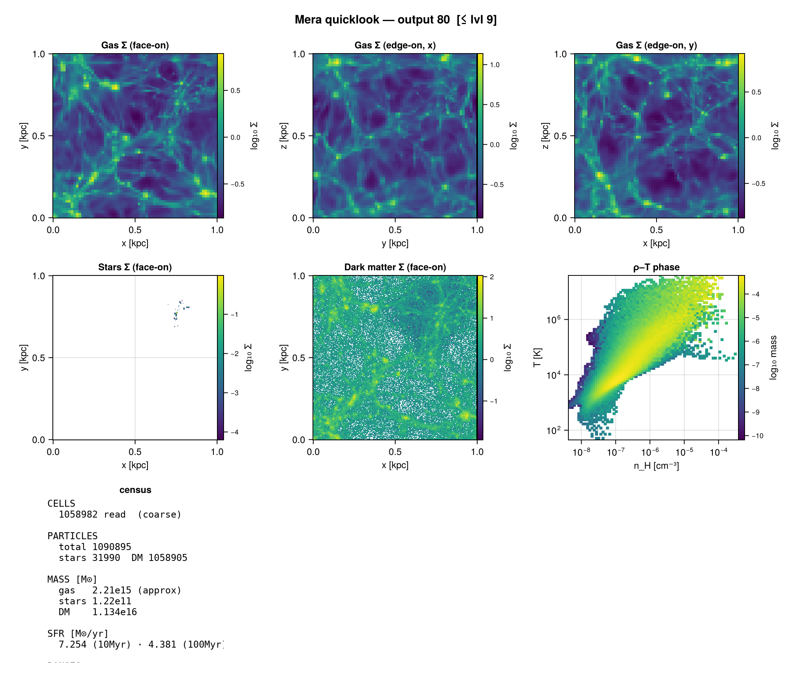
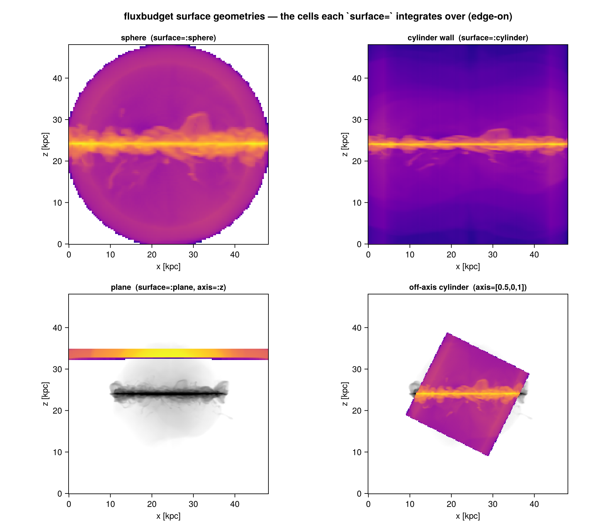
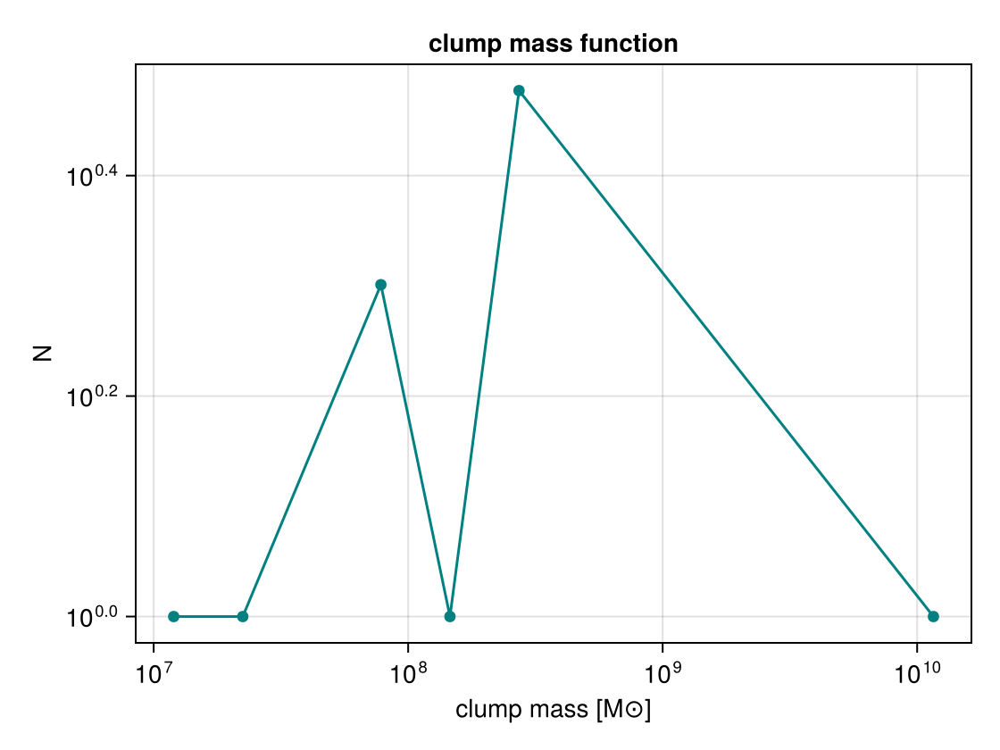
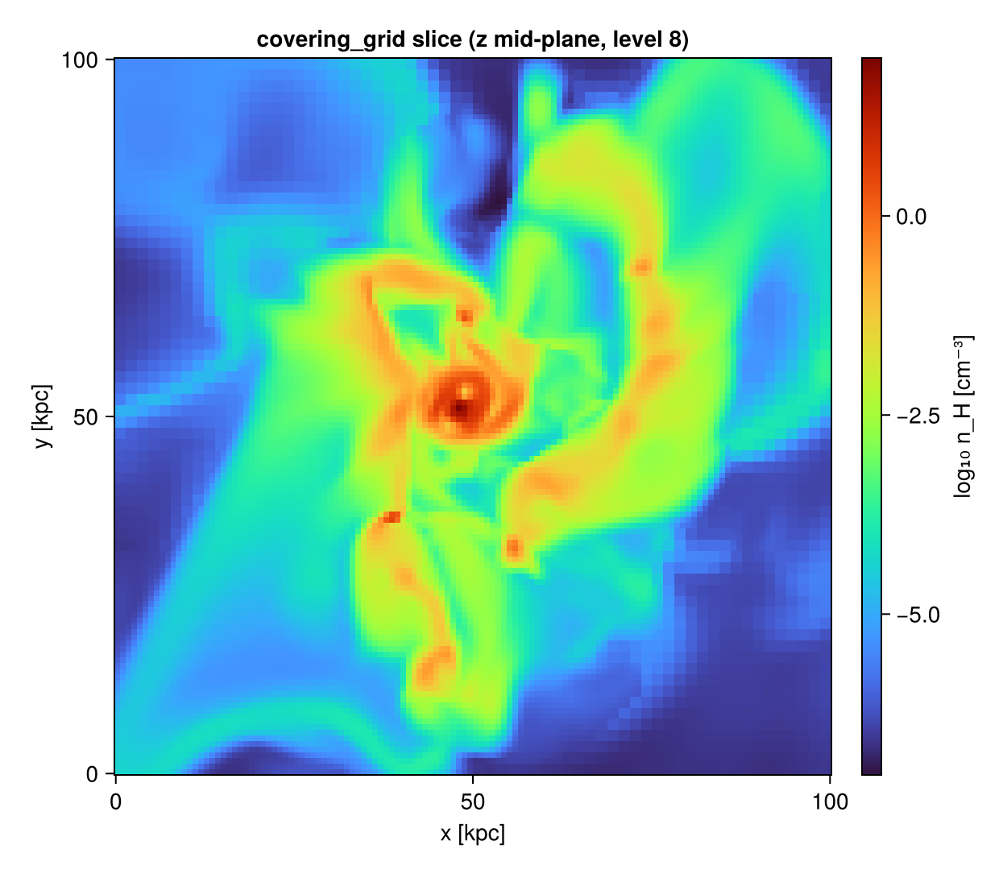
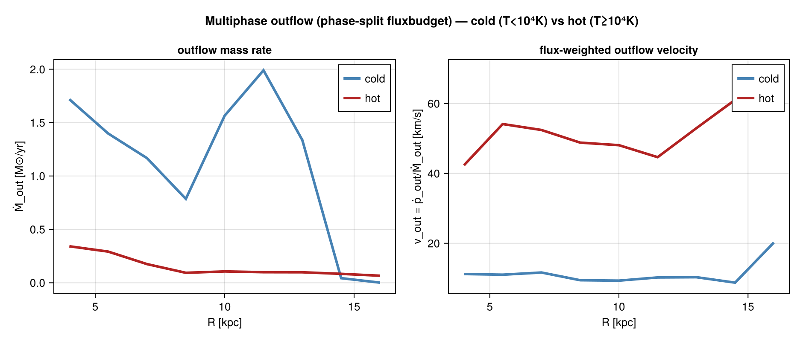
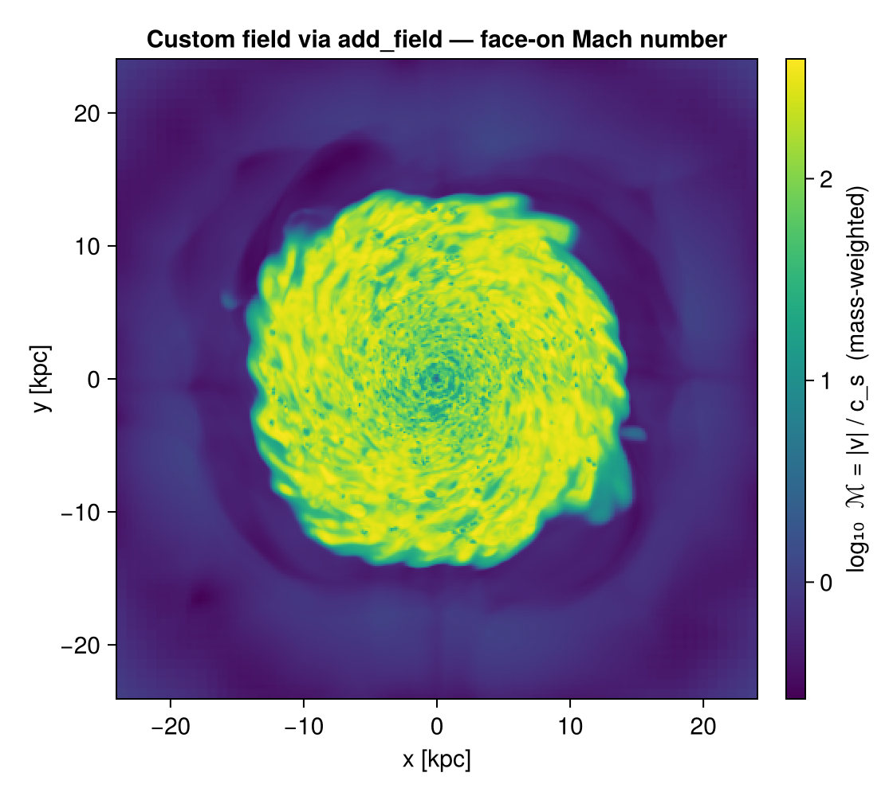
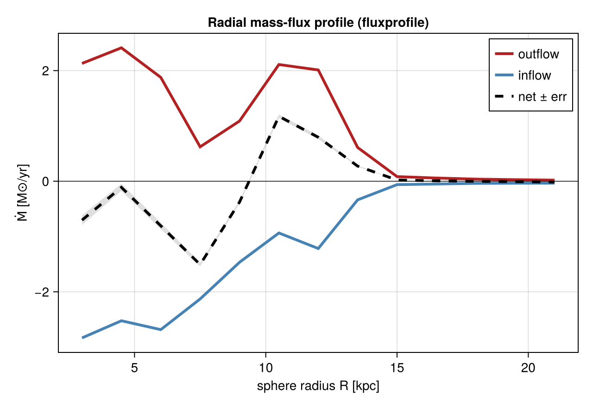
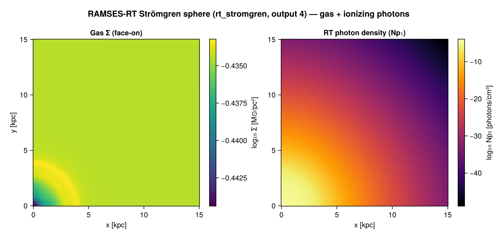

# MERA.jl

**Analyze RAMSES simulations at scale — in pure Julia.**

[](https://github.com/ManuelBehrendt/Mera.jl/releases)
[](https://manuelbehrendt.github.io/Mera.jl/stable/)
[](https://zenodo.org/badge/latestdoi/229728152)
[](https://codecov.io/gh/ManuelBehrendt/Mera.jl)
[](https://github.com/JuliaTesting/Aqua.jl)

**MERA** reads and analyzes [RAMSES](https://github.com/ramses-organisation/ramses) astrophysical
simulation output natively in Julia. It loads multi-resolution AMR grids, particles, gravity, clumps
and radiative-transfer fields into memory-efficient tables, computes 100+ physics-derived quantities
on demand, and provides conservation-correct projections, profiles, flux budgets and structure
finding — all through one unified, multiple-dispatch API.

*Coverage is measured by the maintainer on a local run (the RAMSES test datasets are too large for
GitHub Actions) and uploaded to Codecov via `scripts/run_local_coverage.sh`; see **Testing** below.*

## Why MERA?

- **Julia-native** — compiled-language performance in a single, introspectable code path; no Python/C
  two-language barrier for custom, performance-sensitive analyses.
- **RAMSES-native** — direct binary reading of AMR outputs with automatic unit conversion and full
  multi-level support; load only what you need with spatial and refinement-level filtering.
- **Conservation-correct** — projections and covering grids conserve mass to machine precision with
  proper per-level cell volumes; flux budgets through surfaces split inflow/outflow explicitly.
- **Multi-threaded by default** — `gethydro()` and `projection()` use all available cores
  automatically; benchmarking guides included for system tuning.
- **100+ derived quantities** — temperature, sound speed, Mach numbers (incl. Alfvén/fast/slow),
  Jeans length/mass, virial parameter, cylindrical/spherical velocities, specific angular momentum,
  kinetic/thermal energy and more — all via one `getvar()` interface, extensible with `add_field()`.

## First look: a one-call dashboard

```julia
using Mera
quicklook(80; path="/path/to/simulation")
```



*One call: mass-weighted gas Σ (face-on + two edge-on views), stellar and dark-matter surface
density, the ρ–T phase diagram, and a census of cell/particle counts, component masses and SFR.*

## 30-second quickstart

```julia
using Mera

# 1. read simulation metadata
info = getinfo(output=100, path="/path/to/ramses/output")

# 2. load gas (multi-threaded), restricted to a physical sub-box about the box centre
gas = gethydro(info, lmax=10,
               xrange=[-10., 10.], yrange=[-10., 10.], zrange=[-5., 5.],
               center=[:bc], range_unit=:kpc)

# 3. mass-conserving surface-density projection
proj = projection(gas, :sd, :Msol_pc2; direction=:z, pxsize=[10., :pc])

# 4. plot with your favourite backend
using CairoMakie
heatmap(log10.(proj.maps[:sd]), colormap=:inferno)
```

## Core capabilities

### Loading & filtering
- **`getinfo`** — simulation metadata (box size, time/redshift, grid structure, units)
- **`gethydro` / `getparticles` / `getgravity` / `getrt` / `getclumps`** — load each data type, with
  optional spatial subregioning and refinement-level capping
- **`subregion` / `shellregion`** — extract cuboid / sphere / cylinder / shell selections that preserve AMR structure

### Projections & grids
- **`projection`** — mass-conserving 2-D maps of any quantity, on- or off-axis (arbitrary line of
  sight, face-on/edge-on, angular-momentum-aligned), with hole-free footprint deposition
- **`covering_grid` / `slice`** — resample AMR onto a dense uniform grid for FFTs, power spectra,
  volume rendering or ML inputs (with a memory estimator that refuses to over-allocate)

### Profiles & phase diagrams
- **`profile`** — weighted 1-D profiles of any quantity vs. any axis (radius, height, density…), with
  per-bin mean/std/sem/quantiles/extrema/shape-moments, equal-count binning and bootstrap CIs; works
  on 3-D data **or** on a projected 2-D map
- **`phase`** — 2-D weighted histograms (the classic ρ–T diagram, position–velocity, …)

### Structure finding (7 pluggable algorithms)
`clumpfind` exposes one verb backed by interchangeable finders sharing one neighbour-search,
boundedness, validation and catalogue pipeline:
`DensityWatershed`, `Dendrogram`, `GraphSegFinder`, `HDBSCANFinder`, `PhaseSpaceFoF`,
`PersistenceFinder` (plus the default friends-of-friends). Gravitational boundedness uses a
Barnes–Hut self-potential, SUBFIND-style unbinding and tidal (Hill-radius) truncation.

### Flux budgets
- **`fluxbudget` / `fluxprofile` / `fluxtimeseries`** — conservation-correct inflow/outflow of mass,
  momentum, energy and metals through spheres, cylinders, planes or angular-momentum-aligned
  surfaces, optionally split by gas phase, with sampling/bootstrap uncertainties and a surface map of
  where gas enters and leaves.

### Derived fields & extensions
- **`getvar`** — 100+ derived quantities by name (`:T`, `:cs`, `:mach`, `:jeanslength`,
  `:vr_cylinder`, `:ekin`, `:escape_speed`, …); `list_fields(:hydro; builtin=true)` lists them all
- **`add_field`** — register a custom derived field once; it then works inside `projection`, `profile`, `phase`
- **`getvar_requirements`** — query the raw variables a derived field needs (drives selective I/O)

### Star formation, reports, export
- **`sfr` / `sfr_snapshot`** — star-formation history and current/time-averaged SFR from stellar ages
- **`report`** — composable first-look dashboard (projection / profile / phase / SFR cards) with cost estimates
- **`export_vtk`** — write AMR cells / particles to VTK for ParaView/VisIt
- **`savedata` / `loaddata`** — compressed MERA-file archive (LZ4/Zlib/Bzip2): smaller and faster to read than raw RAMSES

## A taste of the features

| Feature | Use case | Figure |
|---|---|---|
| Flux budgets | inflow/outflow through surfaces (winds, accretion) |  |
| Clump catalogs | star-forming clouds, halo substructure, dense cores |  |
| Covering grids | FFTs, power spectra, ML inputs |  |
| Phase diagrams | gas thermodynamics, phase structure |  |
| Derived fields | temperature, Mach, Jeans, angular momentum |  |
| Profiles | radial density, SFR, metallicity |  |
| Radiative transfer | Strömgren sphere, ionization fronts |  |

## Installation

```julia
using Pkg
Pkg.add("Mera")
```

**Requirements**: Julia 1.10+ (1.11+ recommended). **Platforms**: macOS (incl. Apple Silicon), Linux.

## One name, many types — multiple dispatch

The same verbs work across gas, particles, clumps and gravity — Julia picks the right method:

```julia
getvar(gas,       :mass)   # cell mass (ρ × volume)
getvar(particles, :mass)   # particle mass
getvar(clumps,    :mass)   # clump total mass

projection(gas, :sd)              # gas surface density
profile(gas, :r_cylinder, :T)     # radial temperature profile
phase(gas, :rho, :T)              # ρ–T phase diagram
```

Write the analysis once; it works on every data type.

## How MERA compares

- **vs. `yt`** — a Julia-native code path (no Python/Cython split) for custom, auditable analyses; a
  first-class, conservation-checked **flux budget** (yt offers only marching-cubes isocontour flux);
  and a **pluggable clump/halo finder** with several modern algorithms behind one interface.
- **vs. `pynbody`** — direct RAMSES AMR reading, multi-threaded out of the box, and research-grade
  derived physics (spherical/cylindrical velocities, Jeans/virial, magnetosonic Mach, tidal truncation).
- **vs. hand-written scripts** — conservation treated as a *tested* property (a data-free oracle suite
  checks weighted statistics, projection/covering-grid mass conservation, and the flux estimator
  against the analytic surface integral on every release).

## Documentation

- **[Stable documentation & API reference](https://manuelbehrendt.github.io/Mera.jl/stable/)**
- **[Tutorials](https://github.com/ManuelBehrendt/Notebooks/tree/master/Mera-Docs)** — step-by-step Jupyter notebooks
- In the REPL, `?getvar` shows the docstring and `getvar()` (no args) prints the full derived-quantity catalogue

## Roadmap

MERA is actively developed and its priorities are driven by user needs. Have a feature request, a
RAMSES variant to support, or a gap to report? Please
[open an issue](https://github.com/ManuelBehrendt/Mera.jl/issues) or start a
[discussion](https://github.com/ManuelBehrendt/Mera.jl/discussions) — contributions and ideas are welcome.

## Testing

MERA ships a tiered suite: data-free **smoke/oracle** tests that run on the full CI Julia matrix
(1.10 / 1.11 / 1.12), and **data-backed** integration tests run locally against real RAMSES output.

```bash
# smoke/oracle tests only (what CI runs)
MERA_SMOKE_ONLY=1 julia --project -e 'using Pkg; Pkg.test("Mera")'

# full suite (requires the RAMSES test data)
MERA_TEST_DATA=/path/to/Mera-Tests julia --project -e 'using Pkg; Pkg.test("Mera")'
```

## Get involved

- **Cite & star** — if MERA helps your research, please cite the
  [Zenodo DOI](https://zenodo.org/badge/latestdoi/229728152) and ⭐ the
  [repository](https://github.com/ManuelBehrendt/Mera.jl); it helps measure impact and sustain development.
- **Ask** — [Discussions](https://github.com/ManuelBehrendt/Mera.jl/discussions) for questions and show-and-tell.
- **Report / request** — [Issues](https://github.com/ManuelBehrendt/Mera.jl/issues) for bugs and feature requests.
- **Contribute** — see [CONTRIBUTING.md](CONTRIBUTING.md); bug reports, docs fixes, examples and new
  algorithms are all welcome.

## License

MIT — see [LICENSE.md](LICENSE.md).

---

**Get started:** [manuelbehrendt.github.io/Mera.jl](https://manuelbehrendt.github.io/Mera.jl/stable/) ·
**Questions?** [open a discussion](https://github.com/ManuelBehrendt/Mera.jl/discussions)
