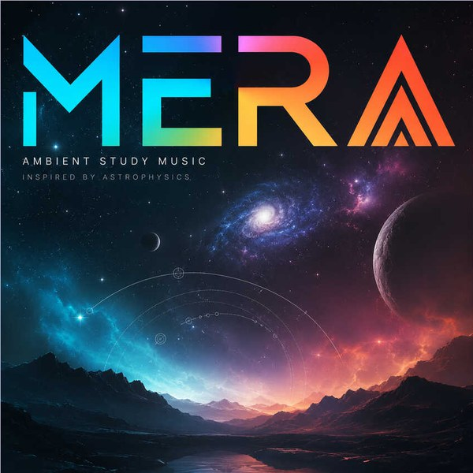

# MERA.jl

**Analyze RAMSES simulations at scale — in pure Julia.**

[](https://github.com/ManuelBehrendt/Mera.jl/releases)
[](https://github.com/ManuelBehrendt/Mera.jl/actions/workflows/CI.yml)
[](https://manuelbehrendt.github.io/Mera.jl/stable/)
[](https://zenodo.org/badge/latestdoi/229728152)
[](https://codecov.io/gh/ManuelBehrendt/Mera.jl?flags[0]=ci-smoke)
[](https://codecov.io/gh/ManuelBehrendt/Mera.jl?flags[0]=local-full)
[](https://github.com/JuliaTesting/Aqua.jl)

<sub>Two coverage figures, because they measure different things: **CI tests** are what a GitHub
runner can execute without simulation data, while **full suite** adds the integration tests that
read real RAMSES output on the maintainer's machine. See
[the two coverage numbers](#the-two-coverage-numbers).</sub>

**MERA** reads and analyzes astrophysical simulation output natively in Julia. Built for
[RAMSES](https://github.com/ramses-organisation/ramses) — multi-resolution AMR grids, particles,
gravity, clumps and radiative-transfer fields loaded into memory-efficient tables — and now reading
**AREPO, GADGET, PLUTO, Athena++, FLASH** and **Chombo** through the same API. It computes 140+
physics-derived quantities on demand and provides conservation-correct projections, profiles, flux
budgets and structure finding — all through one unified, multiple-dispatch API.

Coverage is deepest for RAMSES, which is the only code with gravity, radiative-transfer and clump
support. The others provide gas; AREPO and GADGET additionally provide particles and SUBFIND halo
catalogues.

*Coverage is measured by the maintainer on a local run (the RAMSES test datasets are too large for
GitHub Actions) and uploaded to Codecov via `scripts/run_local_coverage.sh`; see **Testing** below.*

## Why MERA?

- **Julia-native** — compiled-language performance in a single, introspectable code path; no Python/C
  two-language barrier for custom, performance-sensitive analyses.
- **RAMSES-native** — direct binary reading of AMR outputs with automatic unit conversion and full
  multi-level support; load only what you need with spatial and refinement-level filtering.
- **Conservation-correct** — projections and covering grids conserve mass to machine precision with
  proper per-level cell volumes; flux budgets through surfaces split inflow/outflow explicitly.
- **Multi-threaded by default** — `gethydro()` and `projection()` use all available cores
  automatically; benchmarking guides included for system tuning.
- **100+ derived quantities** — temperature, sound speed, Mach numbers (incl. Alfvén/fast/slow),
  Jeans length/mass, virial parameter, cylindrical/spherical velocities, specific angular momentum,
  kinetic/thermal energy and more — all via one `getvar()` interface, extensible with `add_field()`.

## Try it without any data

`synthetic_clumps()` builds real Mera objects in memory, so this runs on a fresh install:

```julia
using Mera
F   = synthetic_clumps()          # 51,514 gas cells + 2,438 particles, 8 known clumps
gas = F.gas
projection(gas, :sd, :Msol_pc2)   # a 128x128 surface-density map
```

Every verb in this README works on `gas` exactly as it does on a real snapshot. First call
takes ~10 s while Julia compiles; later calls are instant.

## First look

With a simulation on disk, one call summarises it — box and refinement levels, time and
redshift, particle and cell counts, component masses, SFR, and the density and temperature
ranges — as a text census:

```julia
using Mera
q = quicklook(80; path="/path/to/simulation")
```

Add a Makie backend to turn that into the dashboard: mass-weighted gas Σ (face-on plus two
edge-on views), stellar and dark-matter surface density, and the ρ–T phase diagram.

```julia
using CairoMakie
fig = quicklookplot(q)
```

## 30-second quickstart

```julia
using Mera

# 1. read simulation metadata
info = getinfo(output=100, path="/path/to/ramses/output")

# 2. load gas (multi-threaded), restricted to a physical sub-box about the box centre
gas = gethydro(info, lmax=10,
               xrange=[-10., 10.], yrange=[-10., 10.], zrange=[-5., 5.],
               center=[:bc], range_unit=:kpc)

# 3. mass-conserving surface-density projection
proj = projection(gas, :sd, :Msol_pc2; direction=:z, pxsize=[10., :pc])

# 4. plot with your favourite backend
using CairoMakie
heatmap(log10.(proj.maps[:sd]), colormap=:inferno)
```

## Core capabilities

### Loading & filtering
- **`getinfo`** — simulation metadata (box size, time/redshift, grid structure, units)
- **`gethydro` / `getparticles` / `getgravity` / `getrt` / `getclumps`** — load each data type, with
  optional spatial subregioning and refinement-level capping
- **`subregion` / `shellregion`** — extract cuboid / sphere / cylinder / shell selections that preserve AMR structure

### Projections & grids
- **`projection`** — mass-conserving 2-D maps of any quantity, on- or off-axis (arbitrary line of
  sight, face-on/edge-on, angular-momentum-aligned), with hole-free footprint deposition
- **`covering_grid` / `slice`** — resample AMR onto a dense uniform grid for FFTs, power spectra,
  volume rendering or ML inputs (with a memory estimator that refuses to over-allocate)

### Profiles & phase diagrams
- **`profile`** — weighted 1-D profiles of any quantity vs. any axis (radius, height, density…), with
  per-bin mean/std/sem/quantiles/extrema/shape-moments, equal-count binning and bootstrap CIs; works
  on 3-D data **or** on a projected 2-D map
- **`phase`** — 2-D weighted histograms (the classic ρ–T diagram, position–velocity, …)

### Structure finding (7 pluggable algorithms)
`clumpfind` exposes one verb backed by interchangeable finders sharing one neighbour-search,
boundedness, validation and catalogue pipeline:
`DensityWatershed`, `Dendrogram`, `GraphSegFinder`, `HDBSCANFinder`, `PhaseSpaceFoF`,
`PersistenceFinder` (plus the default friends-of-friends). Gravitational boundedness uses a
Barnes–Hut self-potential, SUBFIND-style unbinding and tidal (Hill-radius) truncation.

### Flux budgets
- **`fluxbudget` / `fluxprofile` / `fluxtimeseries`** — conservation-correct inflow/outflow of mass,
  momentum, energy and metals through spheres, cylinders, planes or angular-momentum-aligned
  surfaces, optionally split by gas phase, with sampling/bootstrap uncertainties and a surface map of
  where gas enters and leaves.

### Derived fields & extensions
- **`getvar`** — 100+ derived quantities by name (`:T`, `:cs`, `:mach`, `:jeanslength`,
  `:vr_cylinder`, `:ekin`, `:escape_speed`, …); `list_fields(:hydro; builtin=true)` lists them all
- **`add_field`** — register a custom derived field once; it then works inside `projection`, `profile`, `phase`
- **`getvar_requirements`** — query the raw variables a derived field needs (drives selective I/O)

### Star formation, reports, export
- **`sfr` / `sfr_snapshot`** — star-formation history and current/time-averaged SFR from stellar ages
- **`report`** — composable first-look dashboard (projection / profile / phase / SFR cards) with cost estimates
- **`export_vtk`** — write AMR cells / particles to VTK for ParaView/VisIt
- **`savedata` / `loaddata`** — compressed MERA-file archive (LZ4/Zlib/Bzip2): smaller and faster to read than raw RAMSES

## A taste of the features

| Feature | Use case |
|---|---|
| Flux budgets | inflow/outflow through surfaces (winds, accretion) |
| Clump catalogs | star-forming clouds, halo substructure, dense cores |
| Covering grids | FFTs, power spectra, ML inputs |
| Phase diagrams | gas thermodynamics, phase structure |
| Derived fields | temperature, Mach, Jeans, angular momentum |
| Profiles | radial density, SFR, metallicity |
| Radiative transfer | Strömgren sphere, ionization fronts |

See the [documentation](https://manuelbehrendt.github.io/Mera.jl/stable/) for worked examples and figures.

## Installation

```julia
using Pkg
Pkg.add("Mera")
```

**Requirements**: Julia 1.10 or newer — **1.12+ recommended**, for the faster compiler and the
current GC. **Platforms**: macOS (incl. Apple Silicon), Linux, Windows.

**Tested on every push**: Julia 1.10 (the minimum supported), 1.11 and 1.12 on Linux, macOS **and
Windows** — every supported version on every supported platform, nine jobs. CI runners have no
access to simulation data, so they run the data-free
tiers — the synthetic-HDF5 reader contracts, the reader registry, the IO layer and the mera-file
round-trips. The full suite runs against real snapshots locally.

## One name, many types — multiple dispatch

The same verbs work across gas, particles, clumps and gravity — Julia picks the right method:

```julia
getvar(gas,       :mass)   # cell mass (ρ × volume)
getvar(particles, :mass)   # particle mass
getvar(clumps,    :mass)   # clump total mass

projection(gas, :sd)              # gas surface density
profile(gas, :r_cylinder, :T)     # radial temperature profile
phase(gas, :rho, :T)              # ρ–T phase diagram
```

Write the analysis once; it works on every data type.

## How MERA compares

- **vs. `yt`** — a Julia-native code path (no Python/Cython split) for custom, auditable analyses; a
  first-class, conservation-checked **flux budget** (yt offers only marching-cubes isocontour flux);
  and a **pluggable clump/halo finder** with several modern algorithms behind one interface.
- **vs. `pynbody`** — direct RAMSES AMR reading, multi-threaded out of the box, and research-grade
  derived physics (spherical/cylindrical velocities, Jeans/virial, magnetosonic Mach, tidal truncation).
- **vs. hand-written scripts** — conservation treated as a *tested* property (a data-free oracle suite
  checks weighted statistics, projection/covering-grid mass conservation, and the flux estimator
  against the analytic surface integral on every release).

## Documentation

- **[Stable documentation & API reference](https://manuelbehrendt.github.io/Mera.jl/stable/)**
- **New here?** Start with the Getting Started track: [First Steps](https://manuelbehrendt.github.io/Mera.jl/stable/00_multi_FirstSteps/),
  [Coming from Other Tools](https://manuelbehrendt.github.io/Mera.jl/stable/switching_to_mera/), and
  [Julia for Simulation Analysis](https://manuelbehrendt.github.io/Mera.jl/stable/julia_for_simulation_analysis/)
- **[Tutorials](https://github.com/ManuelBehrendt/Notebooks/tree/master/Mera-Docs)** — step-by-step Jupyter notebooks
- In the REPL, `?getvar` shows the docstring and `getvar()` (no args) prints the full derived-quantity catalogue

## Roadmap

MERA is actively developed and its priorities are driven by user needs. Have a feature request, a
RAMSES variant to support, or a gap to report? Please
[open an issue](https://github.com/ManuelBehrendt/Mera.jl/issues) or start a
[discussion](https://github.com/ManuelBehrendt/Mera.jl/discussions) — contributions and ideas are welcome.

## Testing

MERA ships a tiered suite: data-free **smoke/oracle** tests that run on the full CI Julia matrix
(1.10 / 1.11 / 1.12), and **data-backed** integration tests run locally against real RAMSES output.

The data-free tier needs **no simulation data at all**, and includes every analytic correctness
oracle: conservation, the surface-integral budget, weighted statistics and structure-finder
profiles. [`test/README.md`](test/README.md) documents the tiers, what "synthetic"
means in each, and which simulation backs which test.

```bash
# smoke/oracle tests only (what CI runs)
MERA_SMOKE_ONLY=1 julia --project -e 'using Pkg; Pkg.test("Mera")'

# full suite (requires the RAMSES test data)
MERA_TEST_DATA=/path/to/Mera-Tests julia --project -e 'using Pkg; Pkg.test("Mera")'
```

### The two coverage numbers

The badges above report two different measurements, not one number twice.

| badge | what it covers | where it runs | when |
|---|---|---|---|
| **coverage: CI** | the data-free tier only | GitHub Actions | every push |
| **coverage: full** | the whole suite, data-backed tier included | maintainer's machine, with the simulation data mounted | before a release, uploaded by `scripts/run_local_coverage.sh` |

Measured on 2026-08-27: the full suite covers **85.9%**, meaning 13 593 of 15 826 lines across 85
source files, while the CI tests alone cover **31%**. The data-free tier that CI runs is 1 677
assertions in about 2.5 minutes; with the simulation data present the same tier takes roughly 12
minutes, because a few of its files opportunistically read every dataset they can find.

They differ because the data-backed tier reads real RAMSES output, and that data is far larger than
a hosted runner can hold. The readers, projections, region selection and mera-file round trips are
therefore exercised only in the second number.

The gap is closing. The public test simulations are published as release assets, and
`.github/workflows/fixtures.yml` downloads them so the physics oracles and the RAMSES reference
checks run on GitHub as well. What stays local is only what depends on simulations that are not
published.

## Ambient Study Music

Written alongside Mera: **Ambient Study Music**, eighteen tracks named after astronomical objects,
inspired by astrophysics.

<p align="center">
  
</p>

<p align="center">
  <a href="https://open.spotify.com/album/4WiGfc2nQAj02jeJRY0dTn">Spotify</a>
  &nbsp;·&nbsp;
  <a href="https://music.apple.com/de/album/ambient-study-music/6805943329?l=en-GB">Apple Music</a>
  &nbsp;·&nbsp;
  <a href="https://youtube.com/playlist?list=OLAK5uy_mlavbfbMJji-L-Z49pyTUVQtP7aWr_MqM">YouTube</a>
</p>

## Get involved

- **Cite & star** — if MERA helps your research, please cite the
  [Zenodo DOI](https://zenodo.org/badge/latestdoi/229728152) and ⭐ the
  [repository](https://github.com/ManuelBehrendt/Mera.jl); it helps measure impact and sustain development.
- **Ask** — [Discussions](https://github.com/ManuelBehrendt/Mera.jl/discussions) for questions and show-and-tell.
- **Report / request** — [Issues](https://github.com/ManuelBehrendt/Mera.jl/issues) for bugs and feature requests.
- **Contribute** — see [CONTRIBUTING.md](CONTRIBUTING.md); bug reports, docs fixes, examples and new
  algorithms are all welcome.

## License

MIT — see [LICENSE](LICENSE).

---

**Get started:** [manuelbehrendt.github.io/Mera.jl](https://manuelbehrendt.github.io/Mera.jl/stable/) ·
**Questions?** [open a discussion](https://github.com/ManuelBehrendt/Mera.jl/discussions)
