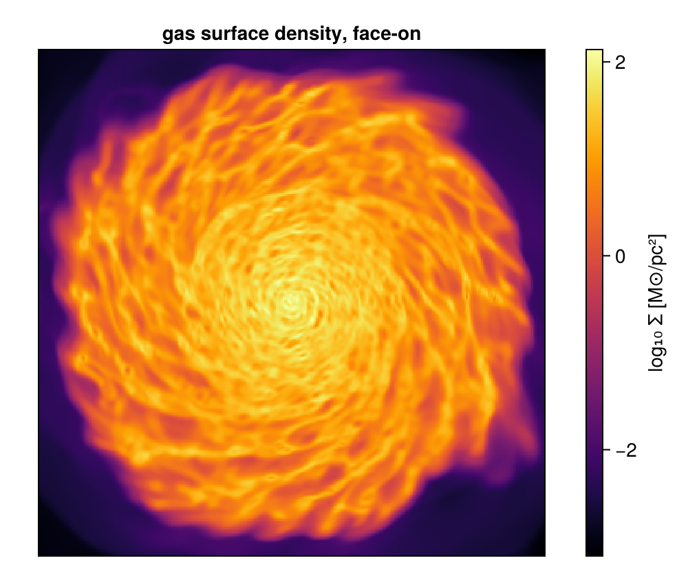

```@raw html
<!-- GENERATED FILE. Do not edit this markdown.
     Source notebook: 00_multi_FirstSteps.ipynb
     Regenerate with: MERA_DIR=<repo checkout> ./render_docs.sh
     Any edit here is lost the next time the docs are rendered. -->
```

# First Steps with Mera.jl

!!! tip "Run it yourself"
    This page is also an executable **Jupyter notebook**: [open / download `00_multi_FirstSteps.ipynb`](https://github.com/ManuelBehrendt/Notebooks/blob/master/Mera-Docs/version_1.1/00_multi_FirstSteps.ipynb). The notebooks run end-to-end and double as part of Mera's test suite.


This notebook introduces the essential concepts and workflow for inspecting, loading, and analyzing RAMSES simulation outputs using Mera.jl.

## Learning Objectives
- How to load and inspect RAMSES simulation outputs
- Understanding simulation metadata and data structure
- Working with physical units and scaling factors
- Accessing physical constants
- Basic data exploration techniques
- Best practices for memory management and workflow organization

## Getting Started

### Package Import and Setup
Start by importing the Mera package. Mera.jl provides a comprehensive interface for RAMSES data analysis, supporting hydro, gravity, particle, and clump data types.

```julia
using Mera
pkgversion(Mera)
```

```
[ Info: Precompiling Mera [02f895e8-fdb1-4346-8fe6-c721699f5126](cache misses: include_dependency fsize change (1), dep missing source (1), mismatched flags (6))
[ Info: Precompiling Mera [02f895e8-fdb1-4346-8fe6-c721699f5126] (cache misses: include_dependency fsize change (2), dep missing source (2), mismatched flags (12))
SYSTEM: caught exception of type :MethodError while trying to print a failed Task notice; giving up
*__   __ _______ ______   _______
SYSTEM: caught exception of type :MethodError while trying to print a failed Task notice; giving up
SYSTEM: caught exception of type :MethodError while trying to print a failed Task notice; giving up
|  |_|  |       |    _ | |   _   |
|       |    ___|   | || |  |_|  |
|       |   |___|   |_||_|       |
|       |    ___|    __  |       |
| ||_|| |   |___|   |  | |   _   |
|_|   |_|_______|___|  |_|__| |__|
Mera v1.8.0 | Julia 1.12.7 | 4 threads
SYSTEM: caught exception of type :MethodError while trying to print a failed Task notice; giving up
```

```
v"1.8.0"
```

```julia
# Example-data root. Point this at your own simulation folder, or set the
# MERA_EXAMPLES environment variable; every path below is built from it.
MERA_EXAMPLES = get(ENV, "MERA_EXAMPLES", "/Volumes/FASTStorage/Simulations/Mera-Tests");

info = getinfo(300, "$MERA_EXAMPLES/RAMSES/mw_L10"); # output=300 in given path
```

```
[Mera]: 2026-08-31T13:18:12.034
Code: RAMSES
output [300] summary:
mtime: 2023-04-09T05:34:09
ctime: 2025-06-21T18:31:24.020
=======================================================
simulation time: 445.89 [Myr]
boxlen: 48.0 [kpc]
ncpu: 640
ndim: 3
cosmological:  false
-------------------------------------------------------
amr:           true
level(s): 6 - 10 --> cellsize(s): 750.0 [pc] - 46.88 [pc]
-------------------------------------------------------
hydro:         true
hydro-variables:  7  --> (:rho, :vx, :vy, :vz, :p, :scalar_00, :scalar_01)
hydro-descriptor: (:density, :velocity_x, :velocity_y, :velocity_z, :pressure, :scalar_00, :scalar_01)
γ: 1.6667
-------------------------------------------------------
gravity:       true
gravity-variables: (:epot, :ax, :ay, :az)
-------------------------------------------------------
particles:     true
- Nstars:   5.445150e+05
particle-variables: 7  --> (:vx, :vy, :vz, :mass, :family, :tag, :birth)
particle-descriptor: (:position_x, :position_y, :position_z, :velocity_x, :velocity_y, :velocity_z, :mass, :identity, :levelp, :family, :tag, :birth_time)
-------------------------------------------------------
rt:            false
clumps:           false
-------------------------------------------------------
namelist-file: ("&COOLING_PARAMS", "&SF_PARAMS", "&AMR_PARAMS", "&BOUNDARY_PARAMS", "&OUTPUT_PARAMS", "&POISSON_PARAMS", "&RUN_PARAMS", "&FEEDBACK_PARAMS", "&HYDRO_PARAMS", "&INIT_PARAMS", "&REFINE_PARAMS")
-------------------------------------------------------
timer-file:       true
compilation-file: false
makefile:         true
patchfile:        true
=======================================================
```

## Hands-On Tutorial

This section provides a step-by-step walkthrough of loading and exploring a real simulation dataset, demonstrating the core concepts in practice.

### Loading Simulation Metadata

The `getinfo()` function is your entry point to any RAMSES simulation analysis. You can select simulation outputs in several ways using multiple dispatch:

```julia
# Load specific output number
info = getinfo(300, "path/to/simulation")

# Load latest available output (default)
info = getinfo("path/to/simulation")

# Load with additional options
info = getinfo(250, "path", verbose=false)
```

Let's load a specific simulation output to explore its structure:

### Understanding the InfoType Object

The `getinfo` function returns an `InfoType` object - a comprehensive container holding all simulation metadata and parameters. This composite type provides structured access to:

- **Simulation parameters** (time, redshift, cosmology)
- **Grid information** (AMR levels, box size, resolution)
- **File organization** (CPU count, data types present)
- **Physical units** (scaling factors and constants)
- **Variable descriptors** (field names and types)

Let's examine the object type:

### Exploring InfoType Structure

The `InfoType` object organizes simulation data into logical groups through its fields and sub-fields. Use `viewfields()` to get a hierarchical overview of available data, which is essential for understanding what information you can access from your simulation.

### Field Exploration Examples

For programmatic access to field names (useful for scripting and automation), you can use `propertynames()` and `viewfields()`:

```julia
# Explore the InfoType structure
println("=== InfoType Object Exploration ===")
viewfields(info)

println("\n=== Scaling Factors Available ===")
viewfields(info.scale)

println("\n=== Physical Constants Available ===")
viewfields(info.constants)

# Get field names programmatically
println("\n=== Programmatic Field Access ===")
scale_fields = propertynames(info.scale)
constant_fields = propertynames(info.constants)

println("Number of scaling factors: $(length(scale_fields))")
println("Number of physical constants: $(length(constant_fields))")
println("First 5 scaling factors: $(scale_fields[1:5])")
println("First 5 constants: $(constant_fields[1:5])")
```

```
=== InfoType Object Exploration ===
output	= 300
path	= /Volumes/FASTStorage/Simulations/Mera-Tests/RAMSES/mw_L10
fnames ==> subfields: (:output, :info, :amr, :hydro, :hydro_descriptor, :gravity, :particles, :part_descriptor, :rt, :rt_descriptor, :rt_descriptor_v0, :clumps, :sinks, :timer, :header, :namelist, :compilation, :makefile, :patchfile)
simcode	= RAMSES
mtime	= 2023-04-09T05:34:09
ctime	= 2025-06-21T18:31:24.020
ncpu	= 640
ndim	= 3
levelmin	= 6
levelmax	= 10
boxlen	= 48.0
time	= 29.9031937665063
aexp	= 1.0
H0	= 1.0
omega_m	= 1.0
omega_l	= 0.0
omega_k	= 0.0
omega_b	= 0.045
unit_l	= 3.085677581282e21
unit_d	= 6.76838218451376e-23
unit_m	= 1.9885499720830952e42
unit_v	= 6.557528732282063e6
unit_t	= 4.70554946422349e14
gamma	= 1.6667
hydro	= true
nvarh	= 7
nvarp	= 7
nvarrt	= 0
variable_list	= [:rho, :vx, :vy, :vz, :p, :scalar_00, :scalar_01]
gravity_variable_list	= [:epot, :ax, :ay, :az]
particles_variable_list	= [:vx, :vy, :vz, :mass, :family, :tag, :birth]
rt_variable_list	= Symbol[]
clumps_variable_list	= Symbol[]
sinks_variable_list	= Symbol[]
descriptor ==> subfields: (:hversion, :hydro, :htypes, :usehydro, :hydrofile, :pversion, :particles, :ptypes, :useparticles, :particlesfile, :gravity, :usegravity, :gravityfile, :rtversion, :rt, :rtPhotonGroups, :usert, :rtfile, :clumps, :useclumps, :clumpsfile, :sinks, :usesinks, :sinksfile)
amr	= true
gravity	= true
particles	= true
rt	= false
clumps	= false
sinks	= false
namelist	= true
namelist_content ==> dictionary: ("&COOLING_PARAMS", "&SF_PARAMS", "&AMR_PARAMS", "&BOUNDARY_PARAMS", "&OUTPUT_PARAMS", "&POISSON_PARAMS", "&RUN_PARAMS", "&FEEDBACK_PARAMS", "&HYDRO_PARAMS", "&INIT_PARAMS", "&REFINE_PARAMS")
headerfile	= true
makefile	= true
files_content ==> subfields: (:makefile, :timerfile, :patchfile)
timerfile	= true
compilationfile	= false
patchfile	= true
Narraysize	= 0
scale ==> subfields: (:Mpc, :kpc, :pc, :mpc, :ly, :Au, :km, :m, :cm, :mm, :μm, :Mpc3, :kpc3, :pc3, :mpc3, :ly3, :Au3, :km3, :m3, :cm3, :mm3, :μm3, :Msol_pc3, :Msun_pc3, :g_cm3, :Msol_pc2, :Msun_pc2, :g_cm2, :Gyr, :Myr, :yr, :s, :ms, :Msol, :Msun, :Mearth, :Mjupiter, :g, :km_s, :m_s, :cm_s, :nH, :erg, :g_cms2, :T_mu, :K_mu, :T, :K, :Ba, :g_cm_s2, :p_kB, :K_cm3, :erg_g_K, :keV_cm2, :erg_K, :J_K, :erg_cm3_K, :J_m3_K, :kB_per_particle, :J_s, :g_cm2_s, :kg_m2_s, :Gauss, :muG, :microG, :nG, :Tesla, :eV, :keV, :MeV, :erg_s, :Lsol, :Lsun, :cm_3, :pc_3, :n_e, :erg_g_s, :erg_cm3_s, :erg_cm2_s, :Jy, :mJy, :microJy, :atoms_cm2, :NH_cm2, :cm_s2, :m_s2, :km_s2, :pc_Myr2, :erg_g, :J_kg, :km2_s2, :u_grav, :erg_cell, :dyne, :s_2, :lambda_J, :M_J, :t_ff, :alpha_vir, :delta_rho, :a_mag, :v_esc, :ax, :ay, :az, :epot, :a_magnitude, :escape_speed, :gravitational_redshift, :gravitational_energy_density, :gravitational_binding_energy, :total_binding_energy, :specific_gravitational_energy, :gravitational_work, :jeans_length_gravity, :jeans_mass_gravity, :jeansmass, :freefall_time_gravity, :ekin, :etherm, :virial_parameter_local, :Fg, :poisson_source, :ar_cylinder, :aϕ_cylinder, :ar_sphere, :aθ_sphere, :aϕ_sphere, :r_cylinder, :r_sphere, :ϕ, :dimensionless, :rad, :deg)
grid_info ==> subfields: (:ngridmax, :nstep_coarse, :nx, :ny, :nz, :nlevelmax, :nboundary, :ngrid_current, :bound_key, :cpu_read)
part_info ==> subfields: (:eta_sn, :age_sn, :f_w, :Npart, :Ndm, :Nstars, :Nsinks, :Ncloud, :Ndebris, :Nother, :Nundefined, :other_tracer1, :debris_tracer, :cloud_tracer, :star_tracer, :other_tracer2, :gas_tracer)
compilation ==> subfields: (:compile_date, :patch_dir, :remote_repo, :local_branch, :last_commit)
constants ==> subfields: (:Au, :Mpc, :kpc, :pc, :mpc, :ly, :Msol, :Msun, :Mearth, :Mjupiter, :Rsol, :Rsun, :me, :mp, :mn, :mH, :amu, :NA, :c, :G, :kB, :k_B, :h, :hbar, :sigma_SB, :sigma_T, :alpha_fs, :R_gas, :eV, :keV, :MeV, :GeV, :Lsol, :Lsun, :m_u, :day, :hr, :min, :Gyr, :Myr, :yr)
=== Scaling Factors Available ===
[Mera]: Fields to scale from user/code units to selected units
=======================================================================
Mpc	= 0.0010000000000006482
kpc	= 1.0000000000006481
pc	= 1000.0000000006482
mpc	= 1.0000000000006482e6
ly	= 3261.5637769461323
Au	= 2.0626480623310105e23
km	= 3.0856775812820004e16
m	= 3.085677581282e19
cm	= 3.085677581282e21
mm	= 3.085677581282e22
μm	= 3.085677581282e25
Mpc3	= 1.0000000000019446e-9
kpc3	= 1.0000000000019444
pc3	= 1.0000000000019448e9
mpc3	= 1.0000000000019446e18
ly3	= 3.469585750743794e10
Au3	= 8.775571306099254e69
km3	= 2.9379989454983075e49
m3	= 2.9379989454983063e58
cm3	= 2.9379989454983065e64
mm3	= 2.937998945498306e67
μm3	= 2.937998945498306e76
Msol_pc3	= 0.9997234790001649
Msun_pc3	= 0.9997234790001649
g_cm3	= 6.76838218451376e-23
Msol_pc2	= 999.7234790008131
Msun_pc2	= 999.7234790008131
g_cm2	= 0.20885045168302602
Gyr	= 0.014910986463557083
Myr	= 14.910986463557084
yr	= 1.4910986463557083e7
s	= 4.70554946422349e14
ms	= 4.70554946422349e17
Msol	= 9.99723479002109e8
Msun	= 9.99723479002109e8
Mearth	= 3.329677459032007e14
Mjupiter	= 1.0476363431814971e12
g	= 1.9885499720830952e42
km_s	= 65.57528732282063
m_s	= 65575.28732282063
cm_s	= 6.557528732282063e6
nH	= 30.987773856809987
erg	= 8.551000140274429e55
g_cms2	= 2.9104844143584656e-9
T_mu	= 517017.45993377
K_mu	= 517017.45993377
T	= 680286.1314918026
K	= 680286.1314918026
Ba	= 2.910484414358466e-9
g_cm_s2	= 2.910484414358466e-9
p_kB	= 2.1080552800592083e7
K_cm3	= 2.1080552800592083e7
erg_g_K	= 1.0
keV_cm2	= 1.0
erg_K	= 1.9885499720830952e42
J_K	= 1.988549972083095e35
erg_cm3_K	= 6.76838218451376e-23
J_m3_K	= 6.76838218451376e-24
kB_per_particle	= 1.380649e-16
J_s	= 4.023715412864333e63
g_cm2_s	= 4.023715412864333e70
kg_m2_s	= 4.023715412864333e63
Gauss	= 0.00019124389093025845
muG	= 191.24389093025846
microG	= 191.24389093025846
nG	= 191243.89093025847
Tesla	= 1.9124389093025845e-8
eV	= 5.3371144971238105e67
keV	= 5.33711449712381e64
MeV	= 5.33711449712381e61
erg_s	= 1.8172160775884043e41
Lsol	= 4.747168436751317e7
Lsun	= 4.747168436751317e7
cm_3	= 3.4036771916893676e-65
pc_3	= 9.999999999980552e-10
n_e	= 30.987773856809987
erg_g_s	= 0.09138397843151959
erg_cm3_s	= 6.185216915658869e-24
erg_cm2_s	= 0.019085585172014773
Jy	= 8.98081650805659e35
mJy	= 8.980816508056591e38
microJy	= 8.98081650805659e41
atoms_cm2	= 1.2581352511025663e23
NH_cm2	= 1.2581352511025663e23
cm_s2	= 1.3935734353956443e-8
m_s2	= 1.3935734353956443e-10
km_s2	= 1.3935734353956443e-13
pc_Myr2	= 4.497666485038892
erg_g	= 4.30011830747048e13
J_kg	= 4.30011830747048e9
km2_s2	= 4300.1183074704795
u_grav	= 2.910484414358466e-9
erg_cell	= 8.55100014027443e55
dyne	= 2.7711904160517516e34
s_2	= 4.516263928056473e-30
lambda_J	= 3.085677581282e21
M_J	= 1.9885499720830952e42
t_ff	= 4.70554946422349e14
alpha_vir	= 1.0
delta_rho	= 1.0
a_mag	= 1.3935734353956443e-8
v_esc	= 6.557528732282063e6
ax	= 1.3935734353956443e-8
ay	= 1.3935734353956443e-8
az	= 1.3935734353956443e-8
epot	= 4.30011830747048e13
a_magnitude	= 1.3935734353956443e-8
escape_speed	= 6.557528732282063e6
gravitational_redshift	= 1.0
gravitational_energy_density	= 2.910484414358466e-9
gravitational_binding_energy	= 2.910484414358466e-9
total_binding_energy	= 8.55100014027443e55
specific_gravitational_energy	= 4.30011830747048e13
gravitational_work	= 8.551000140274429e55
jeans_length_gravity	= 3.085677581282e21
jeans_mass_gravity	= 1.9885499720830952e42
jeansmass	= 1.9885499720830952e42
freefall_time_gravity	= 4.70554946422349e14
ekin	= 8.551000140274429e55
etherm	= 8.551000140274429e55
virial_parameter_local	= 1.0
Fg	= 2.7711904160517516e34
poisson_source	= 4.5162639280564735e-30
ar_cylinder	= 1.3935734353956443e-8
aϕ_cylinder	= 1.3935734353956443e-8
ar_sphere	= 1.3935734353956443e-8
aθ_sphere	= 1.3935734353956443e-8
aϕ_sphere	= 1.3935734353956443e-8
r_cylinder	= 3.085677581282e21
r_sphere	= 3.085677581282e21
ϕ	= 1.0
dimensionless	= 1.0
rad	= 1.0
deg	= 57.29577951308232
=== Physical Constants Available ===
[Mera]: Constants given in cgs units
=========================================
Au	= 0.01495978707
Mpc	= 3.08567758128e24
kpc	= 3.08567758128e21
pc	= 3.08567758128e18
mpc	= 3.08567758128e15
ly	= 9.4607304725808e17
Msol	= 1.9891e33
Msun	= 1.9891e33
Mearth	= 5.9722e27
Mjupiter	= 1.89813e30
Rsol	= 6.96e10
Rsun	= 6.96e10
me	= 9.1093837015e-28
mp	= 1.67262192369e-24
mn	= 1.67492749804e-24
mH	= 1.66e-24
amu	= 1.6605390666e-24
NA	= 6.02214076e23
c	= 2.99792458e10
G	= 6.6743e-8
kB	= 1.380649e-16
k_B	= 1.380649e-16
h	= 6.62607015e-27
hbar	= 1.0545718176461565e-27
sigma_SB	= 5.670374419e-5
sigma_T	= 6.6524587321e-25
alpha_fs	= 0.0072973525693
R_gas	= 8.314462618e7
eV	= 1.602176634e-12
keV	= 1.602176634e-9
MeV	= 1.602176634e-6
GeV	= 0.001602176634
Lsol	= 3.828e33
Lsun	= 3.828e33
m_u	= 1.6605390666e-24
day	= 86400.0
hr	= 3600.0
min	= 60.0
Gyr	= 3.15576e16
Myr	= 3.15576e13
yr	= 3.15576e7
=== Programmatic Field Access ===
Number of scaling factors: 134
Number of physical constants: 41
First 5 scaling factors: (:Mpc, :kpc, :pc, :mpc, :ly)
First 5 constants: (:Au, :Mpc, :kpc, :pc, :mpc)
```

## Your first map

Metadata and units are the groundwork; this is the payoff. Load the gas, project it, and
look at the galaxy, three calls.

```julia
using CairoMakie

# a bounded read, cap the level and the box so only what you need is allocated
gas = gethydro(info, lmax=9, xrange=[-15,15], yrange=[-15,15], zrange=[-3,3],
               center=[:bc], range_unit=:kpc, verbose=false, show_progress=false)

p = projection(gas, :sd, :Msol_pc2, pxsize=[0.1, :kpc],
               center=[:bc], verbose=false, show_progress=false)

fig = Figure(size=(500, 420))
ax  = Axis(fig[1, 1], title="gas surface density, face-on", aspect=DataAspect())
hm  = heatmap!(ax, log10.(p.maps[:sd]), colormap=:inferno)
Colorbar(fig[1, 2], hm, label="log₁₀ Σ [M⊙/pc²]")
hidedecorations!(ax)
fig
```

```
[ Info: Precompiling MeraMakieExt [defab1b5-6ec5-5409-a2f4-69ec619b2a0e](cache misses: wrong dep version loaded (3), incompatible header (6))
[ Info: Precompiling MeraMakieExt [defab1b5-6ec5-5409-a2f4-69ec619b2a0e] (cache misses: wrong dep version loaded (6), incompatible header (12))
SYSTEM: caught exception of type :MethodError while trying to print a failed Task notice; giving up
[ Info: Mera v1.8.0
SYSTEM: caught exception of type :MethodError while trying to print a failed Task notice; giving up
SYSTEM: caught exception of type :MethodError while trying to print a failed Task notice; giving up
SYSTEM: caught exception of type :MethodError while trying to print a failed Task notice; giving up
```



## Units and constants

That map came out in M⊙/pc², not code units, because `projection` was given `:Msol_pc2`. Mera
stores everything in RAMSES code units and converts on request.

The full list of scaling factors, the physical constants, and how to inspect every field an
object carries, is a reference rather than a tutorial, so it lives on its own page:
**[Units, Scaling and Physical Constants](units_and_constants.md)**.

## Data Management and Storage

Now that you understand how to inspect and explore InfoType objects, let's move to practical aspects of managing simulation data. This section covers essential tools for understanding your data storage requirements and managing multiple simulation outputs.

### Storage Analysis

Understanding the disk space requirements of your simulation data is crucial for:
- **Planning data transfers** and storage allocation
- **Optimizing memory usage** during data loading
- **Selecting appropriate data subsets** for analysis
- **Monitoring storage costs** in cloud environments

The `storageoverview()` function provides detailed information about data usage of different components (amr, hydro, gravity, particles, clumps, etc.) and CPU files per component for a specific simulation output:

```julia
# Example: Analyze storage requirements
println("=== Storage Analysis ===")

# Get storage overview for the current simulation
storage_info = storageoverview(info)

println("Storage overview provides information about:")
println("- Data size for each component (hydro, gravity, particles, etc.)")
println("- Number of CPU files per component")
println("- Total disk space usage")
println("- Memory requirements for loading")
println()
println("Use this information to:")
println("✓ Plan data transfers and storage allocation")
println("✓ Optimize memory usage during analysis")
println("✓ Select appropriate data subsets")
println("✓ Monitor storage costs in cloud environments")
```

```
=== Storage Analysis ===
Overview of the used disc space for output: [300]
------------------------------------------------------
Folder:         5.68 GB 	<2.26 MB>/file
AMR-Files:      1.1 GB 	<1.75 MB>/file
Hydro-Files:    2.87 GB 	<4.58 MB>/file
Gravity-Files:  1.68 GB 	<2.69 MB>/file
Particle-Files: 38.56 MB 	<61.6 KB>/file
mtime: 2023-04-09T05:34:09
ctime: 2025-06-21T18:31:24.020
Storage overview provides information about:
- Data size for each component (hydro, gravity, particles, etc.)
- Number of CPU files per component
- Total disk space usage
- Memory requirements for loading
Use this information to:
✓ Plan data transfers and storage allocation
✓ Optimize memory usage during analysis
✓ Select appropriate data subsets
✓ Monitor storage costs in cloud environments
```

### Output Inventory and Management

When working with time-series data or parameter studies, you often need to analyze multiple simulation outputs. The `checkoutputs()` function helps you:

- **Inventory available outputs** - Find all valid simulation snapshots
- **Identify missing data** - Detect incomplete or corrupted outputs
- **Plan time-series analysis** - Understand temporal sampling
- **Validate data integrity** - Ensure consistent file structure

This is especially important for large simulations where outputs might be distributed across different storage systems or some snapshots might be incomplete.

#### Understanding Output Inventory Results

The `checkoutputs()` function returns a structured object containing:

- **`.outputs`** - Array of available (complete) simulation snapshots
- **`.miss`** - Array of missing or incomplete output numbers
- **Additional metadata** about the simulation directory structure

This information helps you understand:
- Which snapshots are available for analysis
- Whether there are gaps in your time series
- Data completeness percentage
- Potential issues with specific outputs

```julia
co = checkoutputs("$MERA_EXAMPLES/RAMSES/mw_L10/");
```

```
Outputs - existing: 1 betw. 300:300 - missing: 1
```

#### Analyzing Output Inventory

The `checkoutputs()` function returns a structured object that helps you understand your simulation data availability. Let's examine what it contains:

```julia
# Available (complete) outputs
println("Available outputs: $(length(co.outputs)) snapshots")
println("Output numbers: $(co.outputs)")

# Analyze temporal coverage
if length(co.outputs) > 1
    println("Output range: $(minimum(co.outputs)) to $(maximum(co.outputs))")
    output_gaps = diff(co.outputs)
    if any(output_gaps .> 1)
        println("Warning: Gaps detected in output sequence")
    else
        println("✓ Complete sequence (no gaps)")
    end
end
```

```
Available outputs: 1 snapshots
Output numbers: [300]
```

```julia
# Complete analysis of output inventory
println("=== Complete Output Analysis ===")

# Missing or incomplete outputs
println("Missing outputs: $(length(co.miss)) snapshots")
if length(co.miss) > 0
    println("Missing output numbers: $(co.miss)")
    println("⚠️  These outputs may be incomplete, corrupted, or not yet computed")
else
    println("✓ No missing outputs detected")
end

# Summary statistics
total_expected = length(co.outputs) + length(co.miss)
completeness = length(co.outputs) / total_expected * 100
println("\nData completeness: $(round(completeness, digits=1))%")

# Final summary
println("\n=== Output Inventory Summary ===")
println("✓ Available outputs: $(length(co.outputs))")
println("⚠️  Missing outputs: $(length(co.miss))")
println("📊 Completeness: $(round(completeness, digits=1))%")
```

```
=== Complete Output Analysis ===
Missing outputs: 1 snapshots
Missing output numbers: [301]
⚠️  These outputs may be incomplete, corrupted, or not yet computed
Data completeness: 50.0%
=== Output Inventory Summary ===
✓ Available outputs: 1
⚠️  Missing outputs: 1
📊 Completeness: 50.0%
```

## Function Quick Reference

Now that you have run the workflow, here is the same ground as a lookup table, the calls
you will reach for again, common problems, and where to go next.

This section provides a comprehensive reference of essential Mera.jl functions for getting started with simulation analysis.

### Core Simulation Information
```julia
# Load simulation metadata
info = getinfo(output_number, "path/to/simulation")
info = getinfo(300, "/path/to/sim")                    # Specific output
info = getinfo("/path/to/sim")                         # Latest output

# Get simulation time
time_myr = gettime(info, :Myr)                         # In Megayears
time_gyr = gettime(info, :Gyr)                         # In Gigayears

# Check simulation outputs and storage
co = checkoutputs("path/to/simulation")                # Check all outputs
storage = storageoverview(info)                        # Storage analysis
```

### Data Exploration and Structure
```julia
# Explore InfoType object structure
viewfields(info)                                       # InfoType structure
viewfields(info.scale)                                 # Scaling factors
viewfields(info.constants)                             # Physical constants
viewallfields(info)                                    # Complete hierarchy

# Get field names programmatically
propertynames(info.scale)                              # All scaling factors
propertynames(info.constants)                          # All constants
```

### Unit Conversion and Shortcuts
```julia
# Create shortcuts for frequent use
scale = info.scale                                     # Scaling factors
constants = info.constants                             # Physical constants

# Create standalone scaling and constants objects
scales = createscales(info)                            # Independent scale object
consts = createconstants()                         # Independent constants object

# Basic unit conversions
velocity_kms = velocity_code * scale.km_s              # Velocity to km/s
density_gcm3 = density_code * scale.g_cm3             # Density to g/cm³
mass_msol = mass_code * scale.Msol                     # Mass to solar masses
time_myr = sim_time * scale.Myr                       # Time to Megayears
```

### Configuration and File Access
```julia
# RAMSES configuration access
namelist_info = namelist(info)                         # Namelist parameters
make_info = makefile(info)                             # Compilation info
timer_info = timerfile(info)                           # Performance data
patch_info = patchfile(info)                           # AMR patch info
```

### Memory Management
```julia
# Clean up variables to free memory
variable_name = nothing                                # Clear specific variable
GC.gc()                                                # Force garbage collection
```

### Common Workflow Pattern
```julia
# Standard workflow for new simulation inspection
info = getinfo(300, "/path/to/simulation")             # Load metadata
println("Time: $(gettime(info, :Myr)) Myr")           # Check simulation time
scale = info.scale; constants = info.constants         # Create shortcuts
viewfields(info)                                       # Explore structure
co = checkoutputs("/path/to/simulation")               # Check all outputs
storage = storageoverview(info)                        # Analyze storage requirements
```

This quick reference covers the essential functions for getting started with Mera.jl simulation inspection and metadata exploration.

### Troubleshooting Common Issues
Here are some common issues and how to resolve them:
1. **Missing Files**
   - If `getinfo()` fails, verify all required output files of a snapshot (output folder) are present.
   - Use `checkoutputs()` to check output folder integrity.
2. **Memory Management**
   - For large datasets, use data selection and filtering.
   - Monitor memory usage when loading multiple outputs.
3. **Path Issues**
   - Use absolute or correct relative paths.
   - Check file permissions if access is denied.
4. **Version Mismatches**
   - Ensure your Mera version matches your RAMSES version.
   - Update packages as needed with `Pkg.update()`.

### Best Practices and Navigation Tips

1. **Organized Workflow**
   - Use `getinfo()` to understand your data.
   - Check available fields before accessing them.
   - Use clear variable names for different outputs.
2. **Memory Efficiency**
   - Create new variables only when needed.
   - Use shortcuts like `scale` and `constants` for frequently accessed unit conversions.
   - Clear unused variables with `GC.gc()`.
3. **Data Exploration**
   - Use `viewfields()` to discover available properties.
   - Check data types with `typeof()`.
   - Print small samples before processing large datasets.

These tips will help you work efficiently with RAMSES data in Mera.
