# 3. Clumps: Get Sub-Regions of The Loaded Data

## Learning Objectives

By the end of this tutorial, you will be able to:

- **Extract spatial sub-regions** from clump simulation data using geometric selections
- **Apply cuboid, cylindrical, and spherical filtering** to isolate specific regions of interest
- **Utilize shell regions** for hollow geometric selections with inner and outer boundaries
- **Combine multiple selection criteria** for complex spatial filtering operations
- **Perform inverse selections** to analyze data outside specified regions
- **Visualize selected regions** with comprehensive scatter plots and extent analysis

## Technical Foundation

### Clump Data Structure
Clumps in MERA represent identified overdense regions in simulations, containing:
- **Spatial coordinates** (x, y, z positions)
- **Physical properties** (mass, size, density characteristics)
- **Hierarchical relationships** (parent-child clump associations)
- **Temporal evolution** (formation and merger histories)

### Spatial Selection Functions

**Core Functions:**
- `subregion()` - Primary function for geometric sub-region extraction
- `shellregion()` - Specialized function for hollow region selections
- `getpositions()` - Extract position coordinates with unit conversion
- `getextent()` - Calculate spatial bounds and ranges

**Geometric Types:**
- `:cuboid` - Rectangular box selections with xrange, yrange, zrange
- `:cylinder` - Cylindrical selections with radius, height, and orientation
- `:sphere` - Spherical selections with radius from center point
- `:shell` - Hollow versions of geometric shapes with inner/outer boundaries

**Coordinate Systems:**
- **Standard notation** `[0:1]` - Normalized box coordinates (default)
- **Physical units** - Real length units (kpc, Mpc, pc, etc.)
- **Center references** - `:boxcenter`, or custom coordinates
- **Relative positioning** - Offsets from specified reference points

### Quick Reference

```julia
# Basic subregion extraction
subregion(clumps, :cuboid, xrange=[x1,x2], yrange=[y1,y2], zrange=[z1,z2])

# Physical units with custom center
subregion(clumps, :sphere, radius=10.0, center=[5.0, 5.0, 5.0], 
          range_unit=:kpc, center_unit=:kpc)

# Cylindrical selection
subregion(clumps, :cylinder, radius=5.0, height=20.0, 
          direction=:z, center=[:boxcenter])

# Shell regions (hollow selections)
shellregion(clumps, :sphere, radius=[5.0, 15.0], center=[:boxcenter])

# Position extraction and analysis
x, y, z = getpositions(clumps, :kpc, center=[:boxcenter])
rx, ry, rz = getextent(clumps, :kpc, center=[:boxcenter])

# Inverse selection (data outside region)
subregion(clumps, :cuboid, xrange=[x1,x2], inverse=true)
```

## Data Setup and Initialization


```julia
using Mera, PyPlot
info = getinfo(400, "/Volumes/FASTStorage/Simulations/Mera-Tests/manu_sim_sf_L14")
clumps = getclumps(info);
```

    [ Info: Precompiling Mera [02f895e8-fdb1-4346-8fe6-c721699f5126] (cache misses: include_dependency fsize change (2), wrong source (4), incompatible header (10), dep missing source (2))


    📦 Safe performance utilities loaded
    
    *__   __ _______ ______   _______ 
    |  |_|  |       |    _ | |   _   |
    |       |    ___|   | || |  |_|  |
    |       |   |___|   |_||_|       |
    |       |    ___|    __  |       |
    | ||_|| |   |___|   |  | |   _   |
    |_|   |_|_______|___|  |_|__| |__|
    
    era]: 2025-08-12T14:51:03.768
    
    Code: RAMSES
    output [400] summary:
    mtime: 2018-09-05T09:51:55
    ctime: 2025-06-29T20:06:45.267
    =======================================================
    simulation time: 594.98 [Myr]
    boxlen: 48.0 [kpc]
    ncpu: 2048
    ndim: 3
    -------------------------------------------------------
    amr:           true
    level(s): 6 - 14 --> cellsize(s): 750.0 [pc] - 2.93 [pc]
    -------------------------------------------------------
    hydro:         true
    hydro-variables:  7  --> (:rho, :vx, :vy, :vz, :p, :var6, :var7)
    hydro-descriptor: (:density, :velocity_x, :velocity_y, :velocity_z, :thermal_pressure, :passive_scalar_1, :passive_scalar_2)
    γ: 1.6667
    -------------------------------------------------------
    gravity:       true
    gravity-variables: (:epot, :ax, :ay, :az)
    -------------------------------------------------------
    particles:     true
    - Npart:    5.091500e+05 
    - Nstars:   5.066030e+05 
    - Ndm:      2.547000e+03 
    particle-variables: 5  --> (:vx, :vy, :vz, :mass, :birth)
    -------------------------------------------------------
    rt:            false
    -------------------------------------------------------
    clumps:           true
    clump-variables: (:index, :lev, :parent, :ncell, :peak_x, :peak_y, :peak_z, Symbol("rho-"), Symbol("rho+"), :rho_av, :mass_cl, :relevance)
    -------------------------------------------------------
    namelist-file:    false
    timer-file:       false
    compilation-file: true
    makefile:         true
    patchfile:        true
    =======================================================
    
    era]: Get clump data: 2025-08-12T14:51:07.458
    
    domain:
    xmin::xmax: 0.0 :: 1.0  	==> 0.0 [kpc] :: 48.0 [kpc]
    ymin::ymax: 0.0 :: 1.0  	==> 0.0 [kpc] :: 48.0 [kpc]
    zmin::zmax: 0.0 :: 1.0  	==> 0.0 [kpc] :: 48.0 [kpc]
    
    Read 12 colums: 
    [:index, :lev, :parent, :ncell, :peak_x, :peak_y, :peak_z, Symbol("rho-"), Symbol("rho+"), :rho_av, :mass_cl, :relevance]
    Memory used for data table :61.58203125 KB
    -------------------------------------------------------
    


## Cuboid Region Selection

Cuboid (rectangular box) selections are the most fundamental geometric filtering method, allowing precise control over data extraction in Cartesian coordinates. This approach is ideal for analyzing specific spatial volumes or comparing different regions within the simulation domain.

### Key Features:
- **Independent axis control** - Separate range specification for x, y, z dimensions
- **Flexible coordinate systems** - Standard `[0:1]` or physical units (kpc, Mpc, etc.)
- **Custom center references** - `:boxcenter`, or user-defined coordinates
- **Inverse selection capability** - Extract data outside the specified region

### Full Domain Visualization

Create scatter plots of the complete simulation box to understand the spatial distribution before applying regional selections.

Use the `getvar` function to extract the positions of the clumps relative to the box center. It returns a dictionary of arrays:


```julia
positions = getvar(clumps, [:x, :y, :z], :kpc, center=[:boxcenter], center_unit=:kpc) # units=[:kpc, :kpc, :kpc]
x, y, z = positions[:x], positions[:y], positions[:z]; # assign the three components of the dictionary to three arrays
```

Alternatively, use the `getposition` function to extract the positions of the clumps. It returns a tuple of the three components:


```julia
x, y, z = getpositions(clumps, :kpc, center=[:boxcenter], center_unit=:kpc); # assign the three components of the tuple to three arrays
```

Get the extent of the processed domain with respect to a given center. The returned tuple is useful declare the specific range of the plots. 


```julia
rx, ry, rz = getextent(clumps, :kpc,  center=[:boxcenter]);
```

### Cuboid Region: The red lines show the region that we want to cut-out as a sub-region from the full data:


```julia
figure(figsize=(15.5, 3.5))

subplot(1,3,1)
scatter(x,y)
plot([-4.,0.,0.,-4.,-4.],[-15.,-15.,15.,15.,-15.], color="red")
xlim(rx)
ylim(ry)
xlabel("x k[pc]")
ylabel("y [kpc]")


subplot(1,3,2)
scatter(x,z)
plot([-4.,0.,0.,-4.,-4.],[-2.,-2.,2.,2.,-2.], color="red")
xlim(rx)
ylim(rz)
xlabel("x [kpc]")
ylabel("z [kpc]")


subplot(1,3,3)
scatter(y,z)
plot([-15.,15.,15.,-15.,-15.],[-2.,-2.,2.,2.,-2.], color="red")
xlim(ry)
ylim(rz)
xlabel("y [kpc]")
ylabel("z [kpc]");
```


    

    


### Cuboid Region: Cutout the data assigned to the object `clumps`

Note: The selected regions can be given relative to a user given center or to the box corner `[0., 0., 0.]` by default. The user can choose between standard notation `[0:1]` (default) or physical length-units, defined in e.g. info.scale :


```julia
clumps_subregion = subregion( clumps, :cuboid,
                                    xrange=[-4., 0.], 
                                    yrange=[-15. ,15.], 
                                    zrange=[-2. ,2.],
                                    center=[:boxcenter],
                                    range_unit=:kpc);
```

    era]: 2025-08-12T14:51:11.412
    
    center: [0.5, 0.5, 0.5] ==> [24.0 [kpc] :: 24.0 [kpc] :: 24.0 [kpc]]
    
    domain:
    xmin::xmax: 0.4166667 :: 0.5  	==> 20.0 [kpc] :: 24.0 [kpc]
    ymin::ymax: 0.1875 :: 0.8125  	==> 9.0 [kpc] :: 39.0 [kpc]
    zmin::zmax: 0.4583333 :: 0.5416667  	==> 22.0 [kpc] :: 26.0 [kpc]
    
    Memory used for data table :29.33203125 KB
    -------------------------------------------------------
    


The function `subregion` creates a new object with the same type as the object created by the function `getclumps` :


```julia
typeof(clumps_subregion)
```


    ClumpDataType


### Cuboid Region: Scatter-Plots of the sub-region. 
The coordinates center is the center of the box by default:


```julia
x, y, z    = getpositions(clumps_subregion, :kpc, center=[:boxcenter]); # clump positions of the subregion
rx, ry, rz = getextent(clumps, :kpc, center=[:boxcenter] ); # extent of the box
```


```julia
figure(figsize=(15.5, 3.5))

subplot(1,3,1)
scatter(x,y)
plot([-4.,0.,0.,-4.,-4.],[-15.,-15.,15.,15.,-15.], color="red")
xlim(rx)
ylim(ry)
xlabel("x k[pc]")
ylabel("y [kpc]")


subplot(1,3,2)
scatter(x,z)
plot([-4.,0.,0.,-4.,-4.],[-2.,-2.,2.,2.,-2.], color="red")
xlim(rx)
ylim(rz)
xlabel("x [kpc]")
ylabel("z [kpc]")


subplot(1,3,3)
scatter(y,z)
plot([-15.,15.,15.,-15.,-15.],[-2.,-2.,2.,2.,-2.], color="red")
xlim(ry)
ylim(rz)
xlabel("y [kpc]")
ylabel("z [kpc]");
```


    
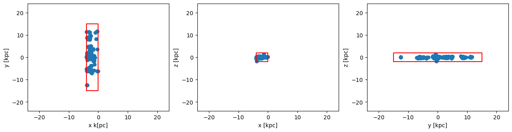
    


### Cuboid Region: Get the extent of the subregion data ranges


```julia
rx_sub, ry_sub, rz_sub = getextent(clumps_subregion, :kpc, center=[:boxcenter]); # extent of the subregion
```


```julia
figure(figsize=(15.5, 3.5))

subplot(1,3,1)
scatter(x,y)
xlim(rx_sub)
ylim(ry_sub)
xlabel("x [kpc]")
ylabel("y [kpc]")


subplot(1,3,2)
scatter(x,z)
xlim(rx_sub)
ylim(rz_sub)
xlabel("x [kpc]")
ylabel("z [kpc]")


subplot(1,3,3)
scatter(y,z)
xlim(ry_sub)
ylim(rz_sub)
xlabel("y [kpc]")
ylabel("z [kpc]");
```


    
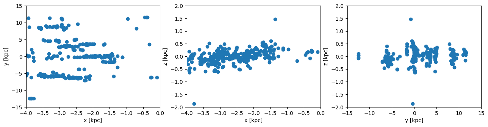
    


### Cuboid Region: Get the data outside of the selected region (inverse selection):


```julia
clumps_subregion = subregion( clumps, :cuboid,
                                    xrange=[-4., 0.], 
                                    yrange=[-15. ,15.], 
                                    zrange=[-2. ,2.],
                                    center=[:boxcenter],
                                    range_unit=:kpc,
                                    inverse=true);
```

    era]: 2025-08-12T14:51:12.118
    
    center: [0.5, 0.5, 0.5] ==> [24.0 [kpc] :: 24.0 [kpc] :: 24.0 [kpc]]
    
    domain:
    xmin::xmax: 0.4166667 :: 0.5  	==> 20.0 [kpc] :: 24.0 [kpc]
    ymin::ymax: 0.1875 :: 0.8125  	==> 9.0 [kpc] :: 39.0 [kpc]
    zmin::zmax: 0.4583333 :: 0.5416667  	==> 22.0 [kpc] :: 26.0 [kpc]
    
    Memory used for data table :33.45703125 KB
    -------------------------------------------------------
    


```julia
x, y, z    = getpositions(clumps_subregion, :kpc, center=[:boxcenter]);
rx_sub, ry_sub, rz_sub = getextent(clumps_subregion, :kpc, center=[:boxcenter]);
```


```julia
figure(figsize=(15.5, 3.5))

subplot(1,3,1)
scatter(x,y)
plot([-4.,0.,0.,-4.,-4.],[-15.,-15.,15.,15.,-15.], color="red")
xlim(rx_sub)
ylim(ry_sub)
xlabel("x [kpc]")
ylabel("y [kpc]")


subplot(1,3,2)
scatter(x,z)
plot([-4.,0.,0.,-4.,-4.],[-2.,-2.,2.,2.,-2.], color="red")
xlim(rx_sub)
ylim(rz_sub)
xlabel("x [kpc]")
ylabel("z [kpc]")


subplot(1,3,3)
scatter(y,z)
plot([-15.,15.,15.,-15.,-15.],[-2.,-2.,2.,2.,-2.], color="red")
xlim(ry_sub)
ylim(rz_sub)
xlabel("y [kpc]")
ylabel("z [kpc]");
```


    

    


## Cylindrical Region Selection

Cylindrical selections provide powerful tools for analyzing axially symmetric structures, rotating systems, or jet-like features in simulations. This geometric filter is particularly useful for studying disk galaxies, stellar jets, or any phenomena with preferred directional orientations.

### Key Features:
- **Axial symmetry** - Perfect for analyzing rotating or streaming systems
- **Directional control** - Specify cylinder axis orientation (x, y, z directions)
- **Height and radius control** - Independent specification of cylindrical dimensions
- **Offset positioning** - Center cylinder anywhere in the simulation domain
- **Physical unit compatibility** - Work directly with kpc, Mpc, or other length scales

Extract the the clump positions and the extent of the full box:


```julia
clumps  = getclumps(info);
x, y, z = getpositions(clumps, :kpc, center=[:boxcenter]);
rx, ry, rz = getextent(clumps, :kpc, center=[:boxcenter]);
```

    era]: Get clump data: 2025-08-12T14:51:12.270
    
    domain:
    xmin::xmax: 0.0 :: 1.0  	==> 0.0 [kpc] :: 48.0 [kpc]
    ymin::ymax: 0.0 :: 1.0  	==> 0.0 [kpc] :: 48.0 [kpc]
    zmin::zmax: 0.0 :: 1.0  	==> 0.0 [kpc] :: 48.0 [kpc]
    
    Read 12 colums: 
    [:index, :lev, :parent, :ncell, :peak_x, :peak_y, :peak_z, Symbol("rho-"), Symbol("rho+"), :rho_av, :mass_cl, :relevance]
    Memory used for data table :61.58203125 KB
    -------------------------------------------------------
    


### Cylindrical Region: The red lines show the region that we want to cut-out as a sub-region from the full data:


```julia
figure(figsize=(15.5, 3.5))
theta = range(-pi, stop=pi, length=100)

subplot(1,3,1)
scatter(x,y)
plot( 3. .* sin.(theta) .-11, 3 .* cos.(theta), color="red")
xlim(rx)
ylim(ry)
xlabel("x k[pc]")
ylabel("y [kpc]")


subplot(1,3,2)
scatter(x,z)
plot([-3.,3.,3.,-3.,-3.] .-11.,[-2.,-2.,2.,2.,-2.], color="red")
xlim(rx)
ylim(rz)
xlabel("x [kpc]")
ylabel("z [kpc]")


subplot(1,3,3)
scatter(y,z)
plot([-3.,3.,3.,-3.,-3.],[-2.,-2.,2.,2.,-2.], color="red")
xlim(ry)
ylim(rz)
xlabel("y [kpc]")
ylabel("z [kpc]");
```


    
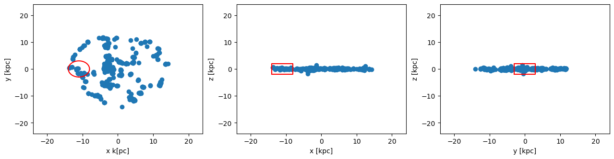
    


### Cylindrical Region: Cutout the data assigned to the object `clumps`
Select the ranges of the cylinder in the unit "kpc", relative to the given center [13., 24., 24.]. The height refers to both z-directions from the plane.


```julia
clumps_subregion = subregion( clumps, :cylinder,
                                radius=3., 
                                height=2.,
                                range_unit=:kpc, 
                                center=[(24. -11.), :bc, :bc]); # direction=:z, by default
```

    era]: 2025-08-12T14:51:13.049
    
    center: [0.2708333, 0.5, 0.5] ==> [13.0 [kpc] :: 24.0 [kpc] :: 24.0 [kpc]]
    
    domain:
    xmin::xmax: 0.2083333 :: 0.3333333  	==> 10.0 [kpc] :: 16.0 [kpc]
    ymin::ymax: 0.4375 :: 0.5625  	==> 21.0 [kpc] :: 27.0 [kpc]
    zmin::zmax: 0.4583333 :: 0.5416667  	==> 22.0 [kpc] :: 26.0 [kpc]
    
    Radius: 3.0 [kpc]
    Height: 2.0 [kpc]
    Memory used for data table :5.05078125 KB
    -------------------------------------------------------
    


Extract the the clump positions of the subregion and the extent of the full box:


```julia
x, y, z    = getpositions(clumps_subregion, :kpc, center=[:boxcenter])
rx, ry, rz = getextent(clumps, :kpc, center=[:boxcenter]);
```


```julia
figure(figsize=(15.5, 3.5))
theta = range(-pi, stop=pi, length=100)

subplot(1,3,1)
scatter(x,y)
plot( 3. .* sin.(theta) .-11, 3 .* cos.(theta), color="red")
xlim(rx)
ylim(ry)
xlabel("x k[pc]")
ylabel("y [kpc]")


subplot(1,3,2)
scatter(x,z)
plot([-3.,3.,3.,-3.,-3.] .-11.,[-2.,-2.,2.,2.,-2.], color="red")
xlim(rx)
ylim(rz)
xlabel("x [kpc]")
ylabel("z [kpc]")


subplot(1,3,3)
scatter(y,z)
plot([-3.,3.,3.,-3.,-3.],[-2.,-2.,2.,2.,-2.], color="red")
xlim(ry)
ylim(rz)
xlabel("y [kpc]")
ylabel("z [kpc]");
```


    
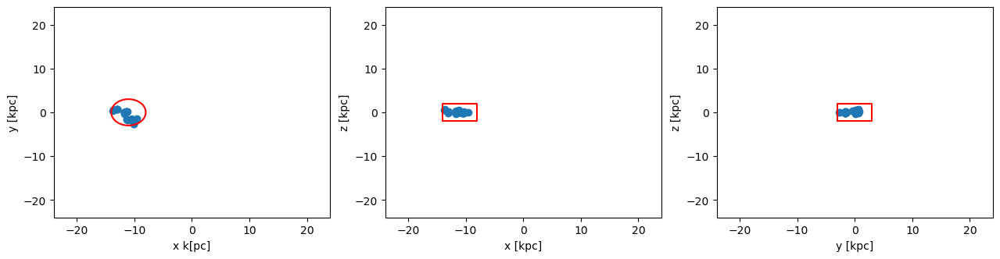
    


### Cylindrical Region: Scatter-Plot of the selected data range with respect to the center of the sub-region:


```julia
x, y, z    = getpositions(clumps_subregion, :kpc,
                            center=[ (24. -11.), :bc, :bc], 
                            center_unit=:kpc);
rx_sub, ry_sub, rz_sub = getextent(clumps_subregion, :kpc,
                                    center=[ (24. -11.), :bc, :bc], 
                                    center_unit=:kpc);
```


```julia
figure(figsize=(15.5, 3.5))
theta = range(-pi, stop=pi, length=100)

subplot(1,3,1)
scatter(x,y)
plot( 3. .* sin.(theta), 3 .* cos.(theta), color="red")
xlim(rx_sub)
ylim(ry_sub)
xlabel("kpc")
ylabel("kpc")


subplot(1,3,2)
scatter(x,z)
xlim(rx_sub)
ylim(rz_sub)
xlabel("kpc")
ylabel("kpc")


subplot(1,3,3)
scatter(y,z)
xlim(ry_sub)
ylim(rz_sub)
xlabel("kpc")
ylabel("kpc");
```


    
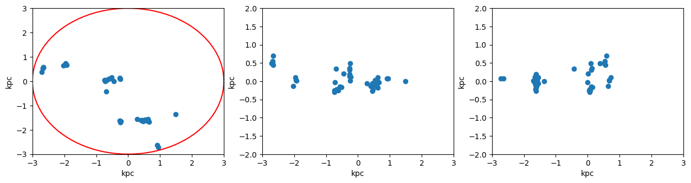
    


### Cylindrical Region: Get the data outside of the selected region (inverse selection):


```julia
clumps_subregion = subregion( clumps, :cylinder,
                            radius=3., 
                            height=2.,
                            range_unit=:kpc, 
                            center=[ (24. -11.),:bc,:bc],
                            inverse=true);
```

    era]: 2025-08-12T14:51:13.412
    
    center: [0.2708333, 0.5, 0.5] ==> [13.0 [kpc] :: 24.0 [kpc] :: 24.0 [kpc]]
    
    domain:
    xmin::xmax: 0.2083333 :: 0.3333333  	==> 10.0 [kpc] :: 16.0 [kpc]
    ymin::ymax: 0.4375 :: 0.5625  	==> 21.0 [kpc] :: 27.0 [kpc]
    zmin::zmax: 0.4583333 :: 0.5416667  	==> 22.0 [kpc] :: 26.0 [kpc]
    
    Radius: 3.0 [kpc]
    Height: 2.0 [kpc]
    Memory used for data table :57.73828125 KB
    -------------------------------------------------------
    


```julia
x, y, z    = getpositions(clumps_subregion, :kpc, center=[:boxcenter]);
rx_sub, ry_sub, rz_sub = getextent(clumps_subregion, :kpc, center=[:boxcenter]);
```


```julia
figure(figsize=(15.5, 3.5))
theta = range(-pi, stop=pi, length=100)

subplot(1,3,1)
scatter(x,y)
plot( 3. .* sin.(theta) .-11, 3 .* cos.(theta), color="red")
xlim(rx)
ylim(ry)
xlabel("x k[pc]")
ylabel("y [kpc]")


subplot(1,3,2)
scatter(x,z)
plot([-3.,3.,3.,-3.,-3.] .-11.,[-2.,-2.,2.,2.,-2.], color="red")
xlim(rx)
ylim(rz)
xlabel("x [kpc]")
ylabel("z [kpc]")


subplot(1,3,3)
scatter(y,z)
plot([-3.,3.,3.,-3.,-3.],[-2.,-2.,2.,2.,-2.], color="red")
xlim(ry)
ylim(rz)
xlabel("y [kpc]")
ylabel("z [kpc]");
```


    
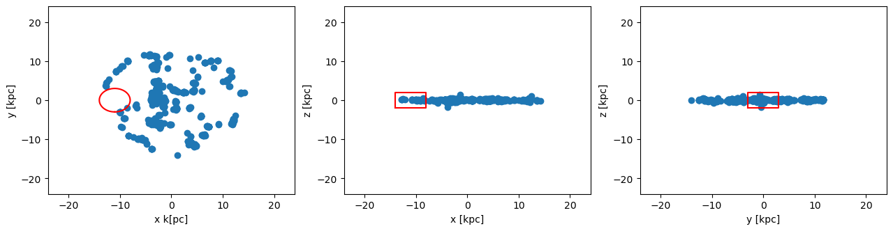
    


## Spherical Region Selection

Spherical selections excel at analyzing centrally concentrated structures, bound systems, or radially distributed phenomena. This isotropic geometric filter is ideal for studying galaxy halos, star-forming regions, or any system with spherical symmetry around a central point.

### Key Features:
- **Radial symmetry** - Perfect for centrally concentrated or bound systems
- **Single parameter control** - Specify only radius for complete region definition
- **Flexible center positioning** - Place sphere anywhere in simulation domain
- **Natural for bound objects** - Ideal for analyzing gravitationally bound structures
- **Scalable analysis** - Easy to vary radius for multi-scale investigations

Extract the the clump positions and the extent of the full box:


```julia
clumps  = getclumps(info);
x, y, z = getpositions(clumps, :kpc, center=[:boxcenter]);
rx, ry, rz = getextent(clumps, :kpc, center=[:boxcenter]);
```

    era]: Get clump data: 2025-08-12T14:51:13.559
    
    domain:
    xmin::xmax: 0.0 :: 1.0  	==> 0.0 [kpc] :: 48.0 [kpc]
    ymin::ymax: 0.0 :: 1.0  	==> 0.0 [kpc] :: 48.0 [kpc]
    zmin::zmax: 0.0 :: 1.0  	==> 0.0 [kpc] :: 48.0 [kpc]
    
    Read 12 colums: 
    [:index, :lev, :parent, :ncell, :peak_x, :peak_y, :peak_z, Symbol("rho-"), Symbol("rho+"), :rho_av, :mass_cl, :relevance]
    Memory used for data table :61.58203125 KB
    -------------------------------------------------------
    


### The red lines show the region that we want to cut-out as a sub-region from the full data:


```julia
figure(figsize=(15.5, 3.5))

theta = range(-pi, stop=pi, length=100)

subplot(1,3,1)
scatter(x,y)
plot( 10. .* sin.(theta) .-11., 10 .* cos.(theta), color="red")
xlim(rx)
ylim(ry)
xlabel("x [kpc]")
ylabel("y [kpc]")


subplot(1,3,2)
scatter(x,z)
plot( 10. .* sin.(theta) .-11., 10 .* cos.(theta), color="red")
xlim(rx)
ylim(rz)
xlabel("x [kpc]")
ylabel("z [kpc]")


subplot(1,3,3)
scatter(y,z)
plot( 10. .* sin.(theta) , 10 .* cos.(theta), color="red")
xlim(ry)
ylim(rz)
xlabel("y [kpc]")
ylabel("z [kpc]")
```


    
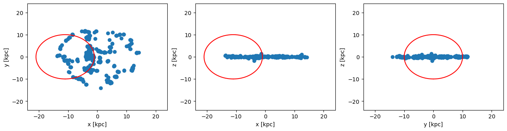
    


    PyObject Text(871.9411764705884, 0.5, 'z [kpc]')


### Spherical Region: Cutout the data assigned to the object `clumps`
Select the radius of the sphere in the unit "kpc", relative to the given center [13., 24., 24.]:


```julia
clumps_subregion = subregion( clumps, :sphere,
                                     radius=10.,
                                     range_unit=:kpc, 
                                     center=[ (24. -11.),:bc, :bc]);
```

    era]: 2025-08-12T14:51:14.162
    
    center: [0.2708333, 0.5, 0.5] ==> [13.0 [kpc] :: 24.0 [kpc] :: 24.0 [kpc]]
    
    domain:
    xmin::xmax: 0.0625 :: 0.4791667  	==> 3.0 [kpc] :: 23.0 [kpc]
    ymin::ymax: 0.2916667 :: 0.7083333  	==> 14.0 [kpc] :: 34.0 [kpc]
    zmin::zmax: 0.2916667 :: 0.7083333  	==> 14.0 [kpc] :: 34.0 [kpc]
    
    Radius: 10.0 [kpc]
    Memory used for data table :28.48828125 KB
    -------------------------------------------------------
    


```julia
x, y, z    = getpositions(clumps_subregion, :kpc, center=[:boxcenter]); # subregion
rx, ry, rz = getextent(clumps, :kpc, center=[:boxcenter]); # full box
```


```julia
figure(figsize=(15.5, 3.5))

theta = range(-pi, stop=pi, length=100)

subplot(1,3,1)
scatter(x,y)
plot( 10. .* sin.(theta) .-11., 10 .* cos.(theta), color="red")
xlim(rx)
ylim(ry)
xlabel("x [kpc]")
ylabel("y [kpc]")


subplot(1,3,2)
scatter(x,z)
plot( 10. .* sin.(theta) .-11., 10 .* cos.(theta), color="red")
xlim(rx)
ylim(rz)
xlabel("x [kpc]")
ylabel("z [kpc]")


subplot(1,3,3)
scatter(y,z)
plot( 10. .* sin.(theta) , 10 .* cos.(theta), color="red")
xlim(ry)
ylim(rz)
xlabel("y [kpc]")
ylabel("z [kpc]");
```


    
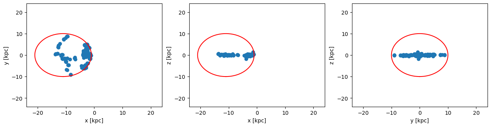
    


### Spherical Region: Scatter-Plot of the selected data range with respect to the center of the sub-region:


```julia
x, y, z    = getpositions(clumps_subregion, :kpc, 
                            center=[ (24. -11.), :bc, :bc], 
                            center_unit=:kpc); # subregion
rx_sub, ry_sub, rz_sub = getextent(clumps_subregion, :kpc, 
                            center=[(24. -11.), :bc, :bc], 
                            center_unit=:kpc); # subregion
```


```julia
figure(figsize=(15.5, 3.5))
theta = range(-pi, stop=pi, length=100)

subplot(1,3,1)
scatter(x,y)
plot( 10. .* sin.(theta), 10 .* cos.(theta), color="red")
xlim(rx_sub)
ylim(ry_sub)
xlabel("x [kpc]")
ylabel("y [kpc]")


subplot(1,3,2)
scatter(x,z)
plot( 10. .* sin.(theta), 10 .* cos.(theta), color="red")
xlim(rx_sub)
ylim(rz_sub)
xlabel("x [kpc]")
ylabel("z [kpc]")


subplot(1,3,3)
scatter(y,z)
plot( 10. .* sin.(theta), 10 .* cos.(theta), color="red")
xlim(ry_sub)
ylim(rz_sub)
xlabel("y [kpc]")
ylabel("z [kpc]");
```


    
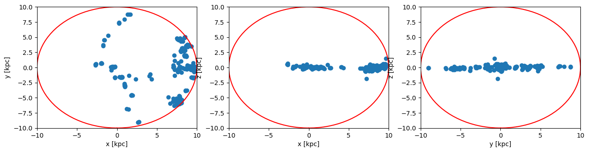
    


### Spherical Region: Get the data outside of the selected region (inverse selection):


```julia
clumps_subregion = subregion( clumps, :sphere,
                                     radius=10.,
                                     range_unit=:kpc, 
                                     center=[ (24. -11.),:bc,:bc],
                                     inverse=true);
```

    era]: 2025-08-12T14:51:14.417
    
    center: [0.2708333, 0.5, 0.5] ==> [13.0 [kpc] :: 24.0 [kpc] :: 24.0 [kpc]]
    
    domain:
    xmin::xmax: 0.0625 :: 0.4791667  	==> 3.0 [kpc] :: 23.0 [kpc]
    ymin::ymax: 0.2916667 :: 0.7083333  	==> 14.0 [kpc] :: 34.0 [kpc]
    zmin::zmax: 0.2916667 :: 0.7083333  	==> 14.0 [kpc] :: 34.0 [kpc]
    
    Radius: 10.0 [kpc]
    Memory used for data table :34.30078125 KB
    -------------------------------------------------------
    


```julia
x, y, z    = getpositions(clumps_subregion, :kpc, center=[:boxcenter]);
rx_sub, ry_sub, rz_sub = getextent(clumps_subregion, :kpc, center=[:boxcenter]);
```


```julia
figure(figsize=(15.5, 3.5))

theta = range(-pi, stop=pi, length=100)

subplot(1,3,1)
scatter(x,y)
plot( 10. .* sin.(theta) .-11., 10 .* cos.(theta), color="red")
xlim(rx)
ylim(ry)
xlabel("x [kpc]")
ylabel("y [kpc]")


subplot(1,3,2)
scatter(x,z)
plot( 10. .* sin.(theta) .-11., 10 .* cos.(theta), color="red")
xlim(rx)
ylim(rz)
xlabel("x [kpc]")
ylabel("z [kpc]")


subplot(1,3,3)
scatter(y,z)
plot( 10. .* sin.(theta) , 10 .* cos.(theta), color="red")
xlim(ry)
ylim(rz)
xlabel("y [kpc]")
ylabel("z [kpc]")
```


    

    


    PyObject Text(871.9411764705884, 0.5, 'z [kpc]')


## Advanced Selection Techniques

### Combined and Nested Regions

The spatial selection functions in MERA offer powerful composition capabilities, allowing you to create complex selection criteria by combining multiple geometric filters. This enables sophisticated analysis of irregular structures or multi-component systems.

### Key Composition Features:
- **Sequential application** - Apply multiple filters in sequence for intersection operations
- **Nested selections** - Create hierarchical spatial selections with different scales
- **Overlapping regions** - Analyze overlapping spatial domains simultaneously  
- **Boolean operations** - Combine regions with AND/OR logic through successive filtering

### Practical Applications:
- **Multi-scale analysis** - Study structures at different resolution scales
- **Complex geometries** - Approximate irregular shapes with geometric combinations
- **Comparative studies** - Analyze multiple regions with consistent methodologies
- **Hierarchical systems** - Study parent-child relationships in clump hierarchies

### The sub-region functions can be used in any combination with each other! (Combined with overlapping ranges or nested)

## Cylindrical Shell Selection

Cylindrical shells provide specialized tools for analyzing hollow cylindrical structures, disk-like systems with central cavities, or annular regions in rotating systems. This geometry is particularly valuable for studying galactic disks, accretion disk structures, or jet boundaries.

### Key Features:
- **Hollow geometry** - Excludes central cylindrical region for annular analysis
- **Inner/outer radius control** - Precise specification of shell thickness
- **Height specification** - Define cylindrical extent along rotation axis  
- **Directional flexibility** - Orient cylinder axis along any coordinate direction
- **Perfect for disk systems** - Ideal for analyzing galactic disk structures or rotating media

### Shell Region Applications:
- **Disk galaxy analysis** - Study stellar disk structure excluding central bulge
- **Accretion disk features** - Analyze disk material while avoiding central object
- **Jet boundary studies** - Examine material around jet axes
- **Ring structure analysis** - Investigate annular features in rotating systems

Extract the the clump positions and the extent of the full box:


```julia
clumps = getclumps(info);
x, y, z = getpositions(clumps, :kpc, center=[:boxcenter]);
rx, ry, rz = getextent(clumps, :kpc, center=[:boxcenter]);
```

    era]: Get clump data: 2025-08-12T14:51:14.552
    
    domain:
    xmin::xmax: 0.0 :: 1.0  	==> 0.0 [kpc] :: 48.0 [kpc]
    ymin::ymax: 0.0 :: 1.0  	==> 0.0 [kpc] :: 48.0 [kpc]
    zmin::zmax: 0.0 :: 1.0  	==> 0.0 [kpc] :: 48.0 [kpc]
    
    Read 12 colums: 
    [:index, :lev, :parent, :ncell, :peak_x, :peak_y, :peak_z, Symbol("rho-"), Symbol("rho+"), :rho_av, :mass_cl, :relevance]
    Memory used for data table :61.58203125 KB
    -------------------------------------------------------
    


### The red lines show the shell that we want to cut-out as a sub-region from the full data:


```julia
figure(figsize=(15.5, 3.5))
theta = range(-pi, stop=pi, length=100)

subplot(1,3,1)
scatter(x,y)
plot( 10. .* sin.(theta) , 10 .* cos.(theta), color="red")
plot( 5. .* sin.(theta) , 5. .* cos.(theta), color="red", ls="--")
xlim(rx)
ylim(ry)
xlabel("x k[pc]")
ylabel("y [kpc]")


subplot(1,3,2)
scatter(x,z)
plot([-10.,-10.,10.,10.,-10.], [-2.,2.,2.,-2.,-2.], color="red")
plot([-5.,-5,5.,5.,-5.], [-2.,2.,2.,-2.,-2.], color="red", ls="--")
xlim(rx)
ylim(rz)
xlabel("x [kpc]")
ylabel("z [kpc]")


subplot(1,3,3)
scatter(y,z)
plot([-10.,-10.,10.,10.,-10.], [-2.,2.,2.,-2.,-2.], color="red")
plot([-5.,-5,5.,5.,-5.], [-2.,2.,2.,-2.,-2.], color="red",ls = "--")
xlim(ry)
ylim(rz)
xlabel("y [kpc]")
ylabel("z [kpc]");
```


    
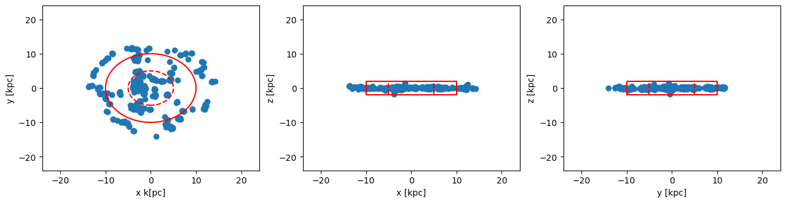
    


### Cylindrical Shell: 
Pass the height of the cylinder and the inner/outer radius of the shell in the unit "kpc", relative to the box center [24., 24., 24.]:


```julia
clumps_subregion = shellregion( clumps, :cylinder,
                                         radius=[5.,10.], 
                                         height=2., 
                                         range_unit=:kpc, 
                                         center=[:boxcenter]);
```

    era]: 2025-08-12T14:51:15.261
    
    center: [0.5, 0.5, 0.5] ==> [24.0 [kpc] :: 24.0 [kpc] :: 24.0 [kpc]]
    
    domain:
    xmin::xmax: 0.2916667 :: 0.7083333  	==> 14.0 [kpc] :: 34.0 [kpc]
    ymin::ymax: 0.2916667 :: 0.7083333  	==> 14.0 [kpc] :: 34.0 [kpc]
    zmin::zmax: 0.4583333 :: 0.5416667  	==> 22.0 [kpc] :: 26.0 [kpc]
    
    Inner radius: 5.0 [kpc]
    Outer radius: 10.0 [kpc]
    Radius diff: 5.0 [kpc]
    Height: 2.0 [kpc]
    Memory used for data table :18.36328125 KB
    -------------------------------------------------------
    


```julia
x, y, z    = getpositions(clumps_subregion, :kpc, center=[:boxcenter]); # shellregion
rx, ry, rz = getextent(clumps, :kpc, center=[:boxcenter]); # full box
```


```julia
figure(figsize=(15.5, 3.5))
theta = range(-pi, stop=pi, length=100)

subplot(1,3,1)
scatter(x,y)
plot( 10. .* sin.(theta) , 10 .* cos.(theta), color="red")
plot( 5. .* sin.(theta) , 5. .* cos.(theta), color="red", ls="--")
xlim(rx)
ylim(ry)
xlabel("x k[pc]")
ylabel("y [kpc]")


subplot(1,3,2)
scatter(x,z)
plot([-10.,-10.,10.,10.,-10.], [-2.,2.,2.,-2.,-2.], color="red")
plot([-5.,-5,5.,5.,-5.], [-2.,2.,2.,-2.,-2.], color="red", ls="--")
xlim(rx)
ylim(rz)
xlabel("x [kpc]")
ylabel("z [kpc]")


subplot(1,3,3)
scatter(y,z)
plot([-10.,-10.,10.,10.,-10.], [-2.,2.,2.,-2.,-2.], color="red")
plot([-5.,-5,5.,5.,-5.], [-2.,2.,2.,-2.,-2.], color="red", ls="--")
xlim(ry)
ylim(rz)
xlabel("y [kpc]")
ylabel("z [kpc]");
```


    
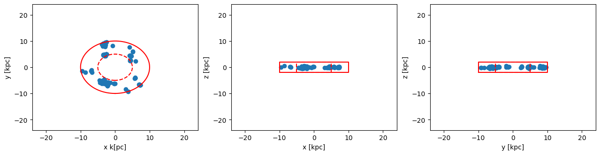
    


### Cylindrical Shell: Get the data outside of the selected shell-region (inverse selection):


```julia
clumps_subregion = shellregion( clumps, :cylinder,
                                         radius=[5.,10.], 
                                         height=2., 
                                         range_unit=:kpc, 
                                         center=[:boxcenter],
                                         inverse=true);
```

    era]: 2025-08-12T14:51:15.412
    
    center: [0.5, 0.5, 0.5] ==> [24.0 [kpc] :: 24.0 [kpc] :: 24.0 [kpc]]
    
    domain:
    xmin::xmax: 0.2916667 :: 0.7083333  	==> 14.0 [kpc] :: 34.0 [kpc]
    ymin::ymax: 0.2916667 :: 0.7083333  	==> 14.0 [kpc] :: 34.0 [kpc]
    zmin::zmax: 0.4583333 :: 0.5416667  	==> 22.0 [kpc] :: 26.0 [kpc]
    
    Inner radius: 5.0 [kpc]
    Outer radius: 10.0 [kpc]
    Radius diff: 5.0 [kpc]
    Height: 2.0 [kpc]
    Memory used for data table :44.42578125 KB
    -------------------------------------------------------
    


```julia
x, y, z    = getpositions(clumps_subregion, :kpc, center=[:boxcenter]); # shellregion
rx, ry, rz = getextent(clumps, :kpc, center=[:boxcenter]); # full box
```


```julia
figure(figsize=(15.5, 3.5))
theta = range(-pi, stop=pi, length=100)

subplot(1,3,1)
scatter(x,y)
plot( 10. .* sin.(theta) , 10 .* cos.(theta), color="red")
plot( 5. .* sin.(theta) , 5. .* cos.(theta), color="red", ls="--")
xlim(rx)
ylim(ry)
xlabel("x k[pc]")
ylabel("y [kpc]")


subplot(1,3,2)
scatter(x,z)
plot([-10.,-10.,10.,10.,-10.], [-2.,2.,2.,-2.,-2.], color="red")
plot([-5.,-5,5.,5.,-5.], [-2.,2.,2.,-2.,-2.], color="red", ls="--")
xlim(rx)
ylim(rz)
xlabel("x [kpc]")
ylabel("z [kpc]")


subplot(1,3,3)
scatter(y,z)
plot([-10.,-10.,10.,10.,-10.], [-2.,2.,2.,-2.,-2.], color="red")
plot([-5.,-5,5.,5.,-5.], [-2.,2.,2.,-2.,-2.], color="red", ls="--")
xlim(ry)
ylim(rz)
xlabel("y [kpc]")
ylabel("z [kpc]");
```


    
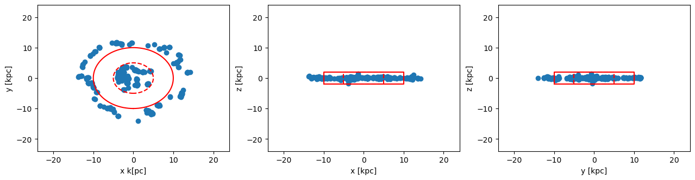
    


## Spherical Shell

Extract the the clump positions and the extent of the full box:


```julia
clumps  = getclumps(info);
x, y, z = getpositions(clumps, :kpc, center=[:boxcenter]);
rx, ry, rz = getextent(clumps, :kpc, center=[:boxcenter]);
```

    era]: Get clump data: 2025-08-12T14:51:15.552
    
    domain:
    xmin::xmax: 0.0 :: 1.0  	==> 0.0 [kpc] :: 48.0 [kpc]
    ymin::ymax: 0.0 :: 1.0  	==> 0.0 [kpc] :: 48.0 [kpc]
    zmin::zmax: 0.0 :: 1.0  	==> 0.0 [kpc] :: 48.0 [kpc]
    
    Read 12 colums: 
    [:index, :lev, :parent, :ncell, :peak_x, :peak_y, :peak_z, Symbol("rho-"), Symbol("rho+"), :rho_av, :mass_cl, :relevance]
    Memory used for data table :61.58203125 KB
    -------------------------------------------------------
    


### The red lines show the shell that we want to cut-out as a sub-region from the full data:


```julia
figure(figsize=(15.5, 3.5))
theta = range(-pi, stop=pi, length=100)

subplot(1,3,1)
scatter(x,y)
plot( 10. .* sin.(theta) , 10 .* cos.(theta), color="red")
plot( 5. .* sin.(theta) , 5. .* cos.(theta), color="red", ls="--")
xlim(rx)
ylim(ry)
xlabel("x k[pc]")
ylabel("y [kpc]")


subplot(1,3,2)
scatter(x,z)
plot( 10. .* sin.(theta) , 10 .* cos.(theta), color="red")
plot( 5. .* sin.(theta) , 5. .* cos.(theta), color="red", ls="--")
xlim(rx)
ylim(rz)
xlabel("x [kpc]")
ylabel("z [kpc]")


subplot(1,3,3)
scatter(y,z)
plot( 10. .* sin.(theta) , 10 .* cos.(theta), color="red")
plot( 5. .* sin.(theta) , 5. .* cos.(theta), color="red", ls="--")
xlim(ry)
ylim(rz)
xlabel("y [kpc]")
ylabel("z [kpc]");
```


    
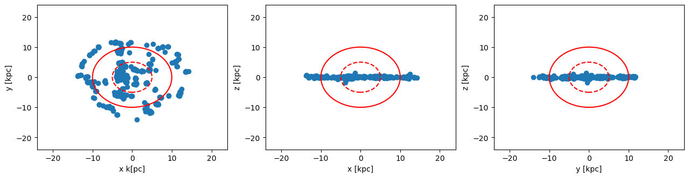
    


### Spherical Shell: 
Select the inner and outer radius of the spherical shell in unit "kpc", relative to the box center [24., 24., 24.]:


```julia
clumps_subregion = shellregion( clumps, :sphere,
                                radius=[5.,10.],
                                range_unit=:kpc, 
                                center=[:boxcenter]);
```

    era]: 2025-08-12T14:51:16.112
    
    center: [0.5, 0.5, 0.5] ==> [24.0 [kpc] :: 24.0 [kpc] :: 24.0 [kpc]]
    
    domain:
    xmin::xmax: 0.2916667 :: 0.7083333  	==> 14.0 [kpc] :: 34.0 [kpc]
    ymin::ymax: 0.2916667 :: 0.7083333  	==> 14.0 [kpc] :: 34.0 [kpc]
    zmin::zmax: 0.2916667 :: 0.7083333  	==> 14.0 [kpc] :: 34.0 [kpc]
    
    Inner radius: 5.0 [kpc]
    Outer radius: 10.0 [kpc]
    Radius diff: 5.0 [kpc]
    Memory used for data table :18.36328125 KB
    -------------------------------------------------------
    


```julia
x, y, z    = getpositions(clumps_subregion, :kpc, center=[:boxcenter]); # shellregion
rx, ry, rz = getextent(clumps, :kpc, center=[:boxcenter]); # full box
```


```julia
figure(figsize=(15.5, 3.5))
theta = range(-pi, stop=pi, length=100)

subplot(1,3,1)
scatter(x,y)
plot( 10. .* sin.(theta) , 10 .* cos.(theta), color="red")
plot( 5. .* sin.(theta) , 5. .* cos.(theta), color="red", ls="--")
xlim(rx)
ylim(ry)
xlabel("x k[pc]")
ylabel("y [kpc]")


subplot(1,3,2)
scatter(x,z)
plot( 10. .* sin.(theta) , 10 .* cos.(theta), color="red")
plot( 5. .* sin.(theta) , 5. .* cos.(theta), color="red", ls="--")
xlim(rx)
ylim(rz)
xlabel("x [kpc]")
ylabel("z [kpc]")


subplot(1,3,3)
scatter(y,z)
plot( 10. .* sin.(theta) , 10 .* cos.(theta), color="red")
plot( 5. .* sin.(theta) , 5. .* cos.(theta), color="red",  ls="--")
xlim(ry)
ylim(rz)
xlabel("y [kpc]")
ylabel("z [kpc]");
```


    
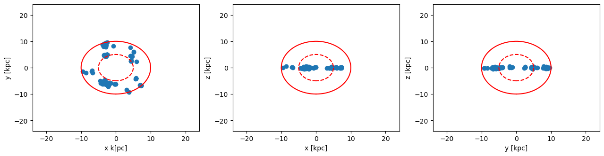
    


### Spherical Shell: Get the data outside of the selected shell-region (inverse selection):


```julia
clumps_subregion = shellregion( clumps, :sphere,
                                radius=[5.,10.],
                                range_unit=:kpc, 
                                center=[:boxcenter],
                                inverse=true);
```

    era]: 2025-08-12T14:51:16.294
    
    center: [0.5, 0.5, 0.5] ==> [24.0 [kpc] :: 24.0 [kpc] :: 24.0 [kpc]]
    
    domain:
    xmin::xmax: 0.2916667 :: 0.7083333  	==> 14.0 [kpc] :: 34.0 [kpc]
    ymin::ymax: 0.2916667 :: 0.7083333  	==> 14.0 [kpc] :: 34.0 [kpc]
    zmin::zmax: 0.2916667 :: 0.7083333  	==> 14.0 [kpc] :: 34.0 [kpc]
    
    Inner radius: 5.0 [kpc]
    Outer radius: 10.0 [kpc]
    Radius diff: 5.0 [kpc]
    Memory used for data table :44.42578125 KB
    -------------------------------------------------------
    


```julia
x, y, z    = getpositions(clumps_subregion, :kpc, center=[:boxcenter]); # shellregion
rx, ry, rz = getextent(clumps, :kpc, center=[:boxcenter] ); # full box
```


```julia
figure(figsize=(15.5, 3.5))
theta = range(-pi, stop=pi, length=100)

subplot(1,3,1)
scatter(x,y)
plot( 10. .* sin.(theta) , 10 .* cos.(theta), color="red")
plot( 5. .* sin.(theta) , 5. .* cos.(theta), color="red", ls="--")
xlim(rx)
ylim(ry)
xlabel("x k[pc]")
ylabel("y [kpc]")


subplot(1,3,2)
scatter(x,z)
plot( 10. .* sin.(theta) , 10 .* cos.(theta), color="red")
plot( 5. .* sin.(theta) , 5. .* cos.(theta), color="red", ls="--")
xlim(rx)
ylim(rz)
xlabel("x [kpc]")
ylabel("z [kpc]")


subplot(1,3,3)
scatter(y,z)
plot( 10. .* sin.(theta) , 10 .* cos.(theta), color="red")
plot( 5. .* sin.(theta) , 5. .* cos.(theta), color="red", ls="--")
xlim(ry)
ylim(rz)
xlabel("y [kpc]")
ylabel("z [kpc]");
```


    
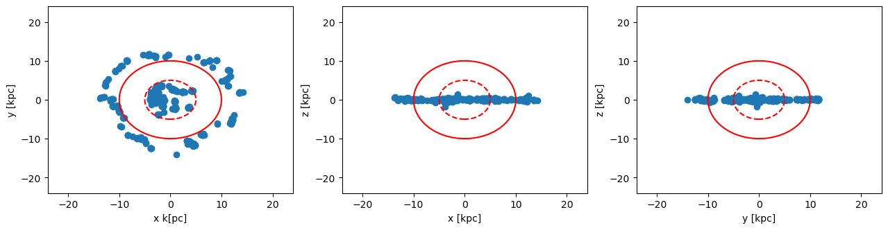
    


## Summary 
### Key Techniques Mastered

Through this comprehensive tutorial, you have gained expertise in advanced spatial selection techniques for clump analysis:

**Geometric Selection Methods:**
- **Cuboid regions** - Rectangular box selections with independent axis control
- **Cylindrical regions** - Axially symmetric selections for rotating systems
- **Spherical regions** - Radially symmetric selections for bound structures
- **Shell regions** - Hollow geometric selections with inner/outer boundaries

**Advanced Capabilities:**
- **Inverse selections** - Extract data outside specified regions
- **Combined filters** - Sequential application for complex geometries
- **Unit conversion** - Seamless work with physical units (kpc, Mpc, etc.)
- **Center references** - Flexible coordinate system positioning

**Coordinate System Flexibility:**
- **Standard notation** `[0:1]` - Normalized simulation coordinates
- **Physical units** - Real astronomical distances with automatic conversion
- **Custom centers** - User-defined reference points for analysis
- **Box-centered shortcuts** - Convenient `:boxcenter` positioning

### Practical Applications

These spatial selection techniques enable sophisticated clump analysis workflows:

**Scientific Use Cases:**
- **Hierarchical analysis** - Study clump structures at multiple scales
- **Environmental studies** - Analyze clump properties in different regions
- **Evolutionary tracking** - Follow clump development in specific volumes
- **Comparative analysis** - Contrast clump populations across regions

**Analysis Workflows:**
- **Multi-scale investigations** - Combine different geometric selections
- **Statistical studies** - Generate clean samples for population analysis
- **Visualization preparation** - Extract regions for focused plotting
- **Data reduction** - Manage memory by selecting relevant subsets

### Performance Considerations

**Memory Management:**
- Use spatial selections to reduce memory footprint for large simulations
- Apply filters early in analysis pipeline to optimize performance
- Combine geometric selections efficiently to minimize data processing

**Computational Efficiency:**
- Leverage inverse selections for excluding large regions
- Use appropriate coordinate systems for your analysis scale
- Consider shell regions for hollow structures to reduce data volume

### Integration with MERA Ecosystem

These spatial selection techniques integrate seamlessly with other MERA analysis functions:

**Compatible Functions:**
- `getpositions()` - Extract coordinates with unit conversion
- `getextent()` - Calculate spatial bounds and ranges  
- `dataoverview()` - Statistical analysis of selected regions
- `msum()`, `mmean()` - Statistical calculations on spatial subsets

**Workflow Integration:**
- Combine with loading functions for targeted data acquisition
- Chain with analysis functions for comprehensive studies
- Link with visualization tools for publication-quality figures


