# 3. Clumps: Get Sub-Regions of The Loaded Data

## Load the Data


```julia
using Mera, PyPlot
info = getinfo(400, "/Volumes/FASTStorage/Simulations/Mera-Tests/manu_sim_sf_L14")
clumps = getclumps(info);
```

    era]: 2025-06-30T00:04:35.351
    
    Code: RAMSES
    output [400] summary:
    mtime: 2018-09-05T09:51:55
    ctime: 2025-06-29T20:06:45.267
    =======================================================
    simulation time: 594.98 [Myr]
    boxlen: 48.0 [kpc]
    ncpu: 2048
    ndim: 3
    -------------------------------------------------------
    amr:           true
    level(s): 6 - 14 --> cellsize(s): 750.0 [pc] - 2.93 [pc]
    -------------------------------------------------------
    hydro:         true
    hydro-variables:  7  --> (:rho, :vx, :vy, :vz, :p, :var6, :var7)
    hydro-descriptor: (:density, :velocity_x, :velocity_y, :velocity_z, :thermal_pressure, :passive_scalar_1, :passive_scalar_2)
    γ: 1.6667
    -------------------------------------------------------
    gravity:       true
    gravity-variables: (:epot, :ax, :ay, :az)
    -------------------------------------------------------
    particles:     true
    - Npart:    5.091500e+05 
    - Nstars:   5.066030e+05 
    - Ndm:      2.547000e+03 
    particle-variables: 5  --> (:vx, :vy, :vz, :mass, :birth)
    -------------------------------------------------------
    rt:            false
    -------------------------------------------------------
    clumps:           true
    clump-variables: (:index, :lev, :parent, :ncell, :peak_x, :peak_y, :peak_z, Symbol("rho-"), Symbol("rho+"), :rho_av, :mass_cl, :relevance)
    -------------------------------------------------------
    namelist-file:    false
    timer-file:       false
    compilation-file: true
    makefile:         true
    patchfile:        true
    =======================================================
    
    era]: Get clump data: 2025-06-30T00:04:37.841
    
    domain:
    xmin::xmax: 0.0 :: 1.0  	==> 0.0 [kpc] :: 48.0 [kpc]
    ymin::ymax: 0.0 :: 1.0  	==> 0.0 [kpc] :: 48.0 [kpc]
    zmin::zmax: 0.0 :: 1.0  	==> 0.0 [kpc] :: 48.0 [kpc]
    
    Read 12 colums: 
    [:index, :lev, :parent, :ncell, :peak_x, :peak_y, :peak_z, Symbol("rho-"), Symbol("rho+"), :rho_av, :mass_cl, :relevance]
    Memory used for data table :61.58203125 KB
    -------------------------------------------------------
    


## Cuboid Region

### Create scatter plots of the full box:
Use the `getvar` function to extract the positions of the clumps relative to the box center. It returns a dictionary of arrays:


```julia
positions = getvar(clumps, [:x, :y, :z], :kpc, center=[:boxcenter], center_unit=:kpc) # units=[:kpc, :kpc, :kpc]
x, y, z = positions[:x], positions[:y], positions[:z]; # assign the three components of the dictionary to three arrays
```

Alternatively, use the `getposition` function to extract the positions of the clumps. It returns a tuple of the three components:


```julia
x, y, z = getpositions(clumps, :kpc, center=[:boxcenter], center_unit=:kpc); # assign the three components of the tuple to three arrays
```

Get the extent of the processed domain with respect to a given center. The returned tuple is useful declare the specific range of the plots. 


```julia
rx, ry, rz = getextent(clumps, :kpc,  center=[:boxcenter]);
```

#### Cuboid Region: The red lines show the region that we want to cut-out as a sub-region from the full data:


```julia
figure(figsize=(15.5, 3.5))

subplot(1,3,1)
scatter(x,y)
plot([-4.,0.,0.,-4.,-4.],[-15.,-15.,15.,15.,-15.], color="red")
xlim(rx)
ylim(ry)
xlabel("x k[pc]")
ylabel("y [kpc]")


subplot(1,3,2)
scatter(x,z)
plot([-4.,0.,0.,-4.,-4.],[-2.,-2.,2.,2.,-2.], color="red")
xlim(rx)
ylim(rz)
xlabel("x [kpc]")
ylabel("z [kpc]")


subplot(1,3,3)
scatter(y,z)
plot([-15.,15.,15.,-15.,-15.],[-2.,-2.,2.,2.,-2.], color="red")
xlim(ry)
ylim(rz)
xlabel("y [kpc]")
ylabel("z [kpc]");
```


    
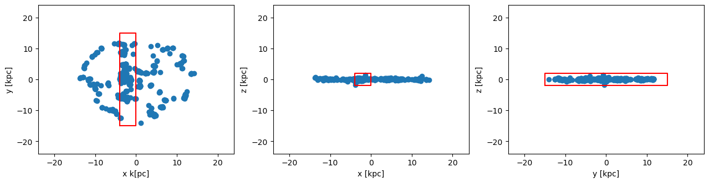
    


#### Cuboid Region: Cutout the data assigned to the object `clumps`

Note: The selected regions can be given relative to a user given center or to the box corner `[0., 0., 0.]` by default. The user can choose between standard notation `[0:1]` (default) or physical length-units, defined in e.g. info.scale :


```julia
clumps_subregion = subregion( clumps, :cuboid,
                                    xrange=[-4., 0.], 
                                    yrange=[-15. ,15.], 
                                    zrange=[-2. ,2.],
                                    center=[:boxcenter],
                                    range_unit=:kpc);
```

    era]: 2025-06-30T00:04:42.649
    
    center: [0.5, 0.5, 0.5] ==> [24.0 [kpc] :: 24.0 [kpc] :: 24.0 [kpc]]
    
    domain:
    xmin::xmax: 0.4166667 :: 0.5  	==> 20.0 [kpc] :: 24.0 [kpc]
    ymin::ymax: 0.1875 :: 0.8125  	==> 9.0 [kpc] :: 39.0 [kpc]
    zmin::zmax: 0.4583333 :: 0.5416667  	==> 22.0 [kpc] :: 26.0 [kpc]
    
    Memory used for data table :29.33203125 KB
    -------------------------------------------------------
    


The function `subregion` creates a new object with the same type as the object created by the function `getclumps` :


```julia
typeof(clumps_subregion)
```


    ClumpDataType


#### Cuboid Region: Scatter-Plots of the sub-region. 
The coordinates center is the center of the box by default:


```julia
x, y, z    = getpositions(clumps_subregion, :kpc, center=[:boxcenter]); # clump positions of the subregion
rx, ry, rz = getextent(clumps, :kpc, center=[:boxcenter] ); # extent of the box
```


```julia
figure(figsize=(15.5, 3.5))

subplot(1,3,1)
scatter(x,y)
plot([-4.,0.,0.,-4.,-4.],[-15.,-15.,15.,15.,-15.], color="red")
xlim(rx)
ylim(ry)
xlabel("x k[pc]")
ylabel("y [kpc]")


subplot(1,3,2)
scatter(x,z)
plot([-4.,0.,0.,-4.,-4.],[-2.,-2.,2.,2.,-2.], color="red")
xlim(rx)
ylim(rz)
xlabel("x [kpc]")
ylabel("z [kpc]")


subplot(1,3,3)
scatter(y,z)
plot([-15.,15.,15.,-15.,-15.],[-2.,-2.,2.,2.,-2.], color="red")
xlim(ry)
ylim(rz)
xlabel("y [kpc]")
ylabel("z [kpc]");
```


    
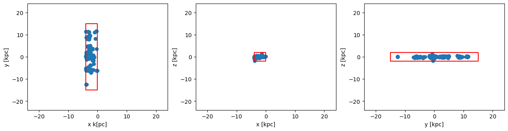
    


#### Cuboid Region: Get the extent of the subregion data ranges


```julia
rx_sub, ry_sub, rz_sub = getextent(clumps_subregion, :kpc, center=[:boxcenter]); # extent of the subregion
```


```julia
figure(figsize=(15.5, 3.5))

subplot(1,3,1)
scatter(x,y)
xlim(rx_sub)
ylim(ry_sub)
xlabel("x [kpc]")
ylabel("y [kpc]")


subplot(1,3,2)
scatter(x,z)
xlim(rx_sub)
ylim(rz_sub)
xlabel("x [kpc]")
ylabel("z [kpc]")


subplot(1,3,3)
scatter(y,z)
xlim(ry_sub)
ylim(rz_sub)
xlabel("y [kpc]")
ylabel("z [kpc]");
```


    
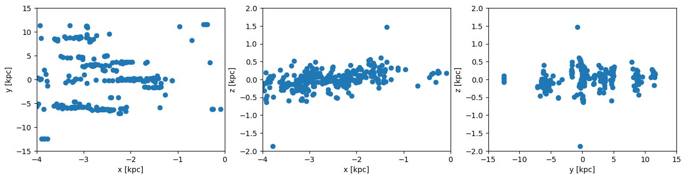
    


#### Cuboid Region: Get the data outside of the selected region (inverse selection):


```julia
clumps_subregion = subregion( clumps, :cuboid,
                                    xrange=[-4., 0.], 
                                    yrange=[-15. ,15.], 
                                    zrange=[-2. ,2.],
                                    center=[:boxcenter],
                                    range_unit=:kpc,
                                    inverse=true);
```

    era]: 2025-06-30T00:04:43.721
    
    center: [0.5, 0.5, 0.5] ==> [24.0 [kpc] :: 24.0 [kpc] :: 24.0 [kpc]]
    
    domain:
    xmin::xmax: 0.4166667 :: 0.5  	==> 20.0 [kpc] :: 24.0 [kpc]
    ymin::ymax: 0.1875 :: 0.8125  	==> 9.0 [kpc] :: 39.0 [kpc]
    zmin::zmax: 0.4583333 :: 0.5416667  	==> 22.0 [kpc] :: 26.0 [kpc]
    
    Memory used for data table :33.45703125 KB
    -------------------------------------------------------
    


```julia
x, y, z    = getpositions(clumps_subregion, :kpc, center=[:boxcenter]);
rx_sub, ry_sub, rz_sub = getextent(clumps_subregion, :kpc, center=[:boxcenter]);
```


```julia
figure(figsize=(15.5, 3.5))

subplot(1,3,1)
scatter(x,y)
plot([-4.,0.,0.,-4.,-4.],[-15.,-15.,15.,15.,-15.], color="red")
xlim(rx_sub)
ylim(ry_sub)
xlabel("x [kpc]")
ylabel("y [kpc]")


subplot(1,3,2)
scatter(x,z)
plot([-4.,0.,0.,-4.,-4.],[-2.,-2.,2.,2.,-2.], color="red")
xlim(rx_sub)
ylim(rz_sub)
xlabel("x [kpc]")
ylabel("z [kpc]")


subplot(1,3,3)
scatter(y,z)
plot([-15.,15.,15.,-15.,-15.],[-2.,-2.,2.,2.,-2.], color="red")
xlim(ry_sub)
ylim(rz_sub)
xlabel("y [kpc]")
ylabel("z [kpc]");
```


    
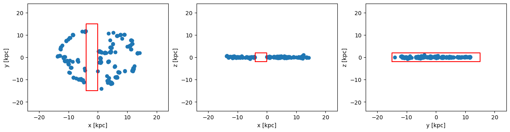
    


## Cylindrical Region

Extract the the clump positions and the extent of the full box:


```julia
clumps  = getclumps(info);
x, y, z = getpositions(clumps, :kpc, center=[:boxcenter]);
rx, ry, rz = getextent(clumps, :kpc, center=[:boxcenter]);
```

    era]: Get clump data: 2025-06-30T00:04:43.960
    
    domain:
    xmin::xmax: 0.0 :: 1.0  	==> 0.0 [kpc] :: 48.0 [kpc]
    ymin::ymax: 0.0 :: 1.0  	==> 0.0 [kpc] :: 48.0 [kpc]
    zmin::zmax: 0.0 :: 1.0  	==> 0.0 [kpc] :: 48.0 [kpc]
    
    Read 12 colums: 
    [:index, :lev, :parent, :ncell, :peak_x, :peak_y, :peak_z, Symbol("rho-"), Symbol("rho+"), :rho_av, :mass_cl, :relevance]
    Memory used for data table :61.58203125 KB
    -------------------------------------------------------
    


#### Cylindrical Region: The red lines show the region that we want to cut-out as a sub-region from the full data:


```julia
figure(figsize=(15.5, 3.5))
theta = range(-pi, stop=pi, length=100)

subplot(1,3,1)
scatter(x,y)
plot( 3. .* sin.(theta) .-11, 3 .* cos.(theta), color="red")
xlim(rx)
ylim(ry)
xlabel("x k[pc]")
ylabel("y [kpc]")


subplot(1,3,2)
scatter(x,z)
plot([-3.,3.,3.,-3.,-3.] .-11.,[-2.,-2.,2.,2.,-2.], color="red")
xlim(rx)
ylim(rz)
xlabel("x [kpc]")
ylabel("z [kpc]")


subplot(1,3,3)
scatter(y,z)
plot([-3.,3.,3.,-3.,-3.],[-2.,-2.,2.,2.,-2.], color="red")
xlim(ry)
ylim(rz)
xlabel("y [kpc]")
ylabel("z [kpc]");
```


    
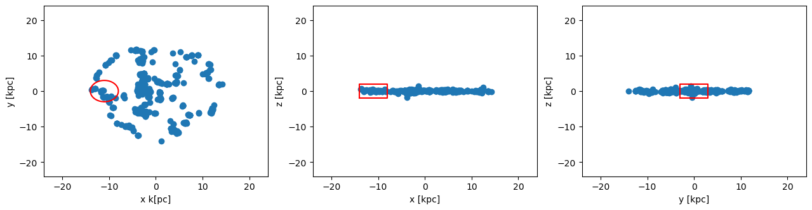
    


#### Cylindrical Region: Cutout the data assigned to the object `clumps`
Select the ranges of the cylinder in the unit "kpc", relative to the given center [13., 24., 24.]. The height refers to both z-directions from the plane.


```julia
clumps_subregion = subregion( clumps, :cylinder,
                                radius=3., 
                                height=2.,
                                range_unit=:kpc, 
                                center=[(24. -11.), :bc, :bc]); # direction=:z, by default
```

    era]: 2025-06-30T00:04:45.057
    
    center: [0.2708333, 0.5, 0.5] ==> [13.0 [kpc] :: 24.0 [kpc] :: 24.0 [kpc]]
    
    domain:
    xmin::xmax: 0.2083333 :: 0.3333333  	==> 10.0 [kpc] :: 16.0 [kpc]
    ymin::ymax: 0.4375 :: 0.5625  	==> 21.0 [kpc] :: 27.0 [kpc]
    zmin::zmax: 0.4583333 :: 0.5416667  	==> 22.0 [kpc] :: 26.0 [kpc]
    
    Radius: 3.0 [kpc]
    Height: 2.0 [kpc]
    Memory used for data table :5.05078125 KB
    -------------------------------------------------------
    


Extract the the clump positions of the subregion and the extent of the full box:


```julia
x, y, z    = getpositions(clumps_subregion, :kpc, center=[:boxcenter])
rx, ry, rz = getextent(clumps, :kpc, center=[:boxcenter]);
```


```julia
figure(figsize=(15.5, 3.5))
theta = range(-pi, stop=pi, length=100)

subplot(1,3,1)
scatter(x,y)
plot( 3. .* sin.(theta) .-11, 3 .* cos.(theta), color="red")
xlim(rx)
ylim(ry)
xlabel("x k[pc]")
ylabel("y [kpc]")


subplot(1,3,2)
scatter(x,z)
plot([-3.,3.,3.,-3.,-3.] .-11.,[-2.,-2.,2.,2.,-2.], color="red")
xlim(rx)
ylim(rz)
xlabel("x [kpc]")
ylabel("z [kpc]")


subplot(1,3,3)
scatter(y,z)
plot([-3.,3.,3.,-3.,-3.],[-2.,-2.,2.,2.,-2.], color="red")
xlim(ry)
ylim(rz)
xlabel("y [kpc]")
ylabel("z [kpc]");
```


    
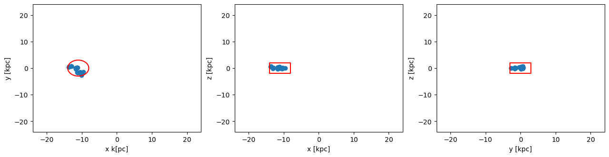
    


#### Cylindrical Region: Scatter-Plot of the selected data range with respect to the center of the sub-region:


```julia
x, y, z    = getpositions(clumps_subregion, :kpc,
                            center=[ (24. -11.), :bc, :bc], 
                            center_unit=:kpc);
rx_sub, ry_sub, rz_sub = getextent(clumps_subregion, :kpc,
                                    center=[ (24. -11.), :bc, :bc], 
                                    center_unit=:kpc);
```


```julia
figure(figsize=(15.5, 3.5))
theta = range(-pi, stop=pi, length=100)

subplot(1,3,1)
scatter(x,y)
plot( 3. .* sin.(theta), 3 .* cos.(theta), color="red")
xlim(rx_sub)
ylim(ry_sub)
xlabel("kpc")
ylabel("kpc")


subplot(1,3,2)
scatter(x,z)
xlim(rx_sub)
ylim(rz_sub)
xlabel("kpc")
ylabel("kpc")


subplot(1,3,3)
scatter(y,z)
xlim(ry_sub)
ylim(rz_sub)
xlabel("kpc")
ylabel("kpc");
```


    
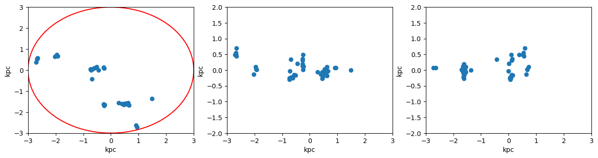
    


#### Cylindrical Region: Get the data outside of the selected region (inverse selection):


```julia
clumps_subregion = subregion( clumps, :cylinder,
                            radius=3., 
                            height=2.,
                            range_unit=:kpc, 
                            center=[ (24. -11.),:bc,:bc],
                            inverse=true);
```

    era]: 2025-06-30T00:04:45.691
    
    center: [0.2708333, 0.5, 0.5] ==> [13.0 [kpc] :: 24.0 [kpc] :: 24.0 [kpc]]
    
    domain:
    xmin::xmax: 0.2083333 :: 0.3333333  	==> 10.0 [kpc] :: 16.0 [kpc]
    ymin::ymax: 0.4375 :: 0.5625  	==> 21.0 [kpc] :: 27.0 [kpc]
    zmin::zmax: 0.4583333 :: 0.5416667  	==> 22.0 [kpc] :: 26.0 [kpc]
    
    Radius: 3.0 [kpc]
    Height: 2.0 [kpc]
    Memory used for data table :57.73828125 KB
    -------------------------------------------------------
    


```julia
x, y, z    = getpositions(clumps_subregion, :kpc, center=[:boxcenter]);
rx_sub, ry_sub, rz_sub = getextent(clumps_subregion, :kpc, center=[:boxcenter]);
```


```julia
figure(figsize=(15.5, 3.5))
theta = range(-pi, stop=pi, length=100)

subplot(1,3,1)
scatter(x,y)
plot( 3. .* sin.(theta) .-11, 3 .* cos.(theta), color="red")
xlim(rx)
ylim(ry)
xlabel("x k[pc]")
ylabel("y [kpc]")


subplot(1,3,2)
scatter(x,z)
plot([-3.,3.,3.,-3.,-3.] .-11.,[-2.,-2.,2.,2.,-2.], color="red")
xlim(rx)
ylim(rz)
xlabel("x [kpc]")
ylabel("z [kpc]")


subplot(1,3,3)
scatter(y,z)
plot([-3.,3.,3.,-3.,-3.],[-2.,-2.,2.,2.,-2.], color="red")
xlim(ry)
ylim(rz)
xlabel("y [kpc]")
ylabel("z [kpc]");
```


    
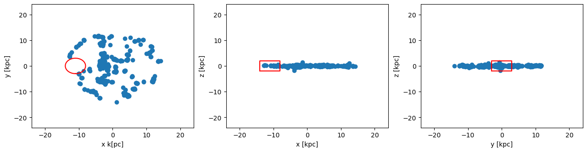
    


## Spherical Region

Extract the the clump positions and the extent of the full box:


```julia
clumps  = getclumps(info);
x, y, z = getpositions(clumps, :kpc, center=[:boxcenter]);
rx, ry, rz = getextent(clumps, :kpc, center=[:boxcenter]);
```

    era]: Get clump data: 2025-06-30T00:04:45.918
    
    domain:
    xmin::xmax: 0.0 :: 1.0  	==> 0.0 [kpc] :: 48.0 [kpc]
    ymin::ymax: 0.0 :: 1.0  	==> 0.0 [kpc] :: 48.0 [kpc]
    zmin::zmax: 0.0 :: 1.0  	==> 0.0 [kpc] :: 48.0 [kpc]
    
    Read 12 colums: 
    [:index, :lev, :parent, :ncell, :peak_x, :peak_y, :peak_z, Symbol("rho-"), Symbol("rho+"), :rho_av, :mass_cl, :relevance]
    Memory used for data table :61.58203125 KB
    -------------------------------------------------------
    


#### The red lines show the region that we want to cut-out as a sub-region from the full data:


```julia
figure(figsize=(15.5, 3.5))

theta = range(-pi, stop=pi, length=100)

subplot(1,3,1)
scatter(x,y)
plot( 10. .* sin.(theta) .-11., 10 .* cos.(theta), color="red")
xlim(rx)
ylim(ry)
xlabel("x [kpc]")
ylabel("y [kpc]")


subplot(1,3,2)
scatter(x,z)
plot( 10. .* sin.(theta) .-11., 10 .* cos.(theta), color="red")
xlim(rx)
ylim(rz)
xlabel("x [kpc]")
ylabel("z [kpc]")


subplot(1,3,3)
scatter(y,z)
plot( 10. .* sin.(theta) , 10 .* cos.(theta), color="red")
xlim(ry)
ylim(rz)
xlabel("y [kpc]")
ylabel("z [kpc]")
```


    
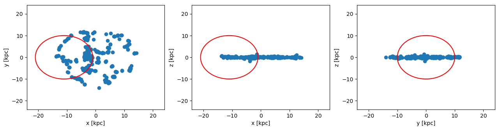
    


    PyObject Text(871.9411764705884, 0.5, 'z [kpc]')


#### Spherical Region: Cutout the data assigned to the object `clumps`
Select the radius of the sphere in the unit "kpc", relative to the given center [13., 24., 24.]:


```julia
clumps_subregion = subregion( clumps, :sphere,
                                     radius=10.,
                                     range_unit=:kpc, 
                                     center=[ (24. -11.),:bc, :bc]);
```

    era]: 2025-06-30T00:04:46.683
    
    center: [0.2708333, 0.5, 0.5] ==> [13.0 [kpc] :: 24.0 [kpc] :: 24.0 [kpc]]
    
    domain:
    xmin::xmax: 0.0625 :: 0.4791667  	==> 3.0 [kpc] :: 23.0 [kpc]
    ymin::ymax: 0.2916667 :: 0.7083333  	==> 14.0 [kpc] :: 34.0 [kpc]
    zmin::zmax: 0.2916667 :: 0.7083333  	==> 14.0 [kpc] :: 34.0 [kpc]
    
    Radius: 10.0 [kpc]
    Memory used for data table :28.48828125 KB
    -------------------------------------------------------
    


```julia
x, y, z    = getpositions(clumps_subregion, :kpc, center=[:boxcenter]); # subregion
rx, ry, rz = getextent(clumps, :kpc, center=[:boxcenter]); # full box
```


```julia
figure(figsize=(15.5, 3.5))

theta = range(-pi, stop=pi, length=100)

subplot(1,3,1)
scatter(x,y)
plot( 10. .* sin.(theta) .-11., 10 .* cos.(theta), color="red")
xlim(rx)
ylim(ry)
xlabel("x [kpc]")
ylabel("y [kpc]")


subplot(1,3,2)
scatter(x,z)
plot( 10. .* sin.(theta) .-11., 10 .* cos.(theta), color="red")
xlim(rx)
ylim(rz)
xlabel("x [kpc]")
ylabel("z [kpc]")


subplot(1,3,3)
scatter(y,z)
plot( 10. .* sin.(theta) , 10 .* cos.(theta), color="red")
xlim(ry)
ylim(rz)
xlabel("y [kpc]")
ylabel("z [kpc]");
```


    
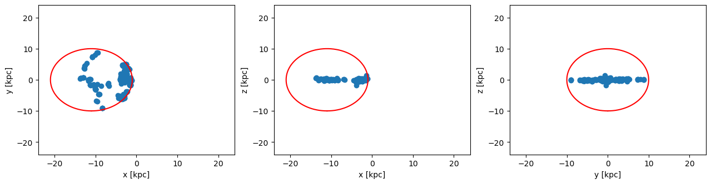
    


#### Spherical Region: Scatter-Plot of the selected data range with respect to the center of the sub-region:


```julia
x, y, z    = getpositions(clumps_subregion, :kpc, 
                            center=[ (24. -11.), :bc, :bc], 
                            center_unit=:kpc); # subregion
rx_sub, ry_sub, rz_sub = getextent(clumps_subregion, :kpc, 
                            center=[(24. -11.), :bc, :bc], 
                            center_unit=:kpc); # subregion
```


```julia
figure(figsize=(15.5, 3.5))
theta = range(-pi, stop=pi, length=100)

subplot(1,3,1)
scatter(x,y)
plot( 10. .* sin.(theta), 10 .* cos.(theta), color="red")
xlim(rx_sub)
ylim(ry_sub)
xlabel("x [kpc]")
ylabel("y [kpc]")


subplot(1,3,2)
scatter(x,z)
plot( 10. .* sin.(theta), 10 .* cos.(theta), color="red")
xlim(rx_sub)
ylim(rz_sub)
xlabel("x [kpc]")
ylabel("z [kpc]")


subplot(1,3,3)
scatter(y,z)
plot( 10. .* sin.(theta), 10 .* cos.(theta), color="red")
xlim(ry_sub)
ylim(rz_sub)
xlabel("y [kpc]")
ylabel("z [kpc]");
```


    
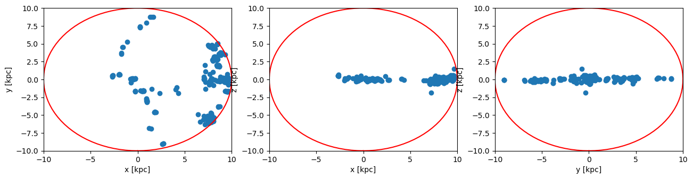
    


#### Spherical Region: Get the data outside of the selected region (inverse selection):


```julia
clumps_subregion = subregion( clumps, :sphere,
                                     radius=10.,
                                     range_unit=:kpc, 
                                     center=[ (24. -11.),:bc,:bc],
                                     inverse=true);
```

    era]: 2025-06-30T00:04:47.092
    
    center: [0.2708333, 0.5, 0.5] ==> [13.0 [kpc] :: 24.0 [kpc] :: 24.0 [kpc]]
    
    domain:
    xmin::xmax: 0.0625 :: 0.4791667  	==> 3.0 [kpc] :: 23.0 [kpc]
    ymin::ymax: 0.2916667 :: 0.7083333  	==> 14.0 [kpc] :: 34.0 [kpc]
    zmin::zmax: 0.2916667 :: 0.7083333  	==> 14.0 [kpc] :: 34.0 [kpc]
    
    Radius: 10.0 [kpc]
    Memory used for data table :34.30078125 KB
    -------------------------------------------------------
    


```julia
x, y, z    = getpositions(clumps_subregion, :kpc, center=[:boxcenter]);
rx_sub, ry_sub, rz_sub = getextent(clumps_subregion, :kpc, center=[:boxcenter]);
```


```julia
figure(figsize=(15.5, 3.5))

theta = range(-pi, stop=pi, length=100)

subplot(1,3,1)
scatter(x,y)
plot( 10. .* sin.(theta) .-11., 10 .* cos.(theta), color="red")
xlim(rx)
ylim(ry)
xlabel("x [kpc]")
ylabel("y [kpc]")


subplot(1,3,2)
scatter(x,z)
plot( 10. .* sin.(theta) .-11., 10 .* cos.(theta), color="red")
xlim(rx)
ylim(rz)
xlabel("x [kpc]")
ylabel("z [kpc]")


subplot(1,3,3)
scatter(y,z)
plot( 10. .* sin.(theta) , 10 .* cos.(theta), color="red")
xlim(ry)
ylim(rz)
xlabel("y [kpc]")
ylabel("z [kpc]")
```


    
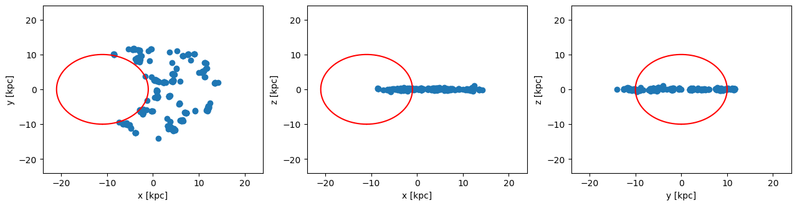
    


    PyObject Text(871.9411764705884, 0.5, 'z [kpc]')


## Combined/Nested/Shell Sub-Regions

#### The sub-region functions can be used in any combination with each other! (Combined with overlapping ranges or nested)

## Cylindrical Shell

Extract the the clump positions and the extent of the full box:


```julia
clumps = getclumps(info);
x, y, z = getpositions(clumps, :kpc, center=[:boxcenter]);
rx, ry, rz = getextent(clumps, :kpc, center=[:boxcenter]);
```

    era]: Get clump data: 2025-06-30T00:04:47.322
    
    domain:
    xmin::xmax: 0.0 :: 1.0  	==> 0.0 [kpc] :: 48.0 [kpc]
    ymin::ymax: 0.0 :: 1.0  	==> 0.0 [kpc] :: 48.0 [kpc]
    zmin::zmax: 0.0 :: 1.0  	==> 0.0 [kpc] :: 48.0 [kpc]
    
    Read 12 colums: 
    [:index, :lev, :parent, :ncell, :peak_x, :peak_y, :peak_z, Symbol("rho-"), Symbol("rho+"), :rho_av, :mass_cl, :relevance]
    Memory used for data table :61.58203125 KB
    -------------------------------------------------------
    


#### The red lines show the shell that we want to cut-out as a sub-region from the full data:


```julia
figure(figsize=(15.5, 3.5))
theta = range(-pi, stop=pi, length=100)

subplot(1,3,1)
scatter(x,y)
plot( 10. .* sin.(theta) , 10 .* cos.(theta), color="red")
plot( 5. .* sin.(theta) , 5. .* cos.(theta), color="red", ls="--")
xlim(rx)
ylim(ry)
xlabel("x k[pc]")
ylabel("y [kpc]")


subplot(1,3,2)
scatter(x,z)
plot([-10.,-10.,10.,10.,-10.], [-2.,2.,2.,-2.,-2.], color="red")
plot([-5.,-5,5.,5.,-5.], [-2.,2.,2.,-2.,-2.], color="red", ls="--")
xlim(rx)
ylim(rz)
xlabel("x [kpc]")
ylabel("z [kpc]")


subplot(1,3,3)
scatter(y,z)
plot([-10.,-10.,10.,10.,-10.], [-2.,2.,2.,-2.,-2.], color="red")
plot([-5.,-5,5.,5.,-5.], [-2.,2.,2.,-2.,-2.], color="red",ls = "--")
xlim(ry)
ylim(rz)
xlabel("y [kpc]")
ylabel("z [kpc]");
```


    
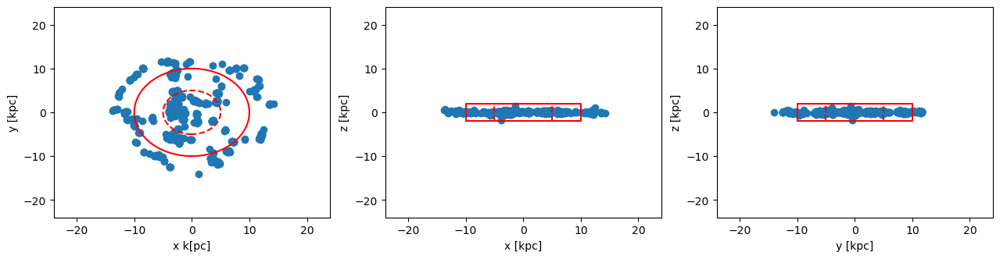
    


#### Cylindrical Shell: 
Pass the height of the cylinder and the inner/outer radius of the shell in the unit "kpc", relative to the box center [24., 24., 24.]:


```julia
clumps_subregion = shellregion( clumps, :cylinder,
                                         radius=[5.,10.], 
                                         height=2., 
                                         range_unit=:kpc, 
                                         center=[:boxcenter]);
```

    era]: 2025-06-30T00:04:48.122
    
    center: [0.5, 0.5, 0.5] ==> [24.0 [kpc] :: 24.0 [kpc] :: 24.0 [kpc]]
    
    domain:
    xmin::xmax: 0.2916667 :: 0.7083333  	==> 14.0 [kpc] :: 34.0 [kpc]
    ymin::ymax: 0.2916667 :: 0.7083333  	==> 14.0 [kpc] :: 34.0 [kpc]
    zmin::zmax: 0.4583333 :: 0.5416667  	==> 22.0 [kpc] :: 26.0 [kpc]
    
    Inner radius: 5.0 [kpc]
    Outer radius: 10.0 [kpc]
    Radius diff: 5.0 [kpc]
    Height: 2.0 [kpc]
    Memory used for data table :18.36328125 KB
    -------------------------------------------------------
    


```julia
x, y, z    = getpositions(clumps_subregion, :kpc, center=[:boxcenter]); # shellregion
rx, ry, rz = getextent(clumps, :kpc, center=[:boxcenter]); # full box
```


```julia
figure(figsize=(15.5, 3.5))
theta = range(-pi, stop=pi, length=100)

subplot(1,3,1)
scatter(x,y)
plot( 10. .* sin.(theta) , 10 .* cos.(theta), color="red")
plot( 5. .* sin.(theta) , 5. .* cos.(theta), color="red", ls="--")
xlim(rx)
ylim(ry)
xlabel("x k[pc]")
ylabel("y [kpc]")


subplot(1,3,2)
scatter(x,z)
plot([-10.,-10.,10.,10.,-10.], [-2.,2.,2.,-2.,-2.], color="red")
plot([-5.,-5,5.,5.,-5.], [-2.,2.,2.,-2.,-2.], color="red", ls="--")
xlim(rx)
ylim(rz)
xlabel("x [kpc]")
ylabel("z [kpc]")


subplot(1,3,3)
scatter(y,z)
plot([-10.,-10.,10.,10.,-10.], [-2.,2.,2.,-2.,-2.], color="red")
plot([-5.,-5,5.,5.,-5.], [-2.,2.,2.,-2.,-2.], color="red", ls="--")
xlim(ry)
ylim(rz)
xlabel("y [kpc]")
ylabel("z [kpc]");
```


    
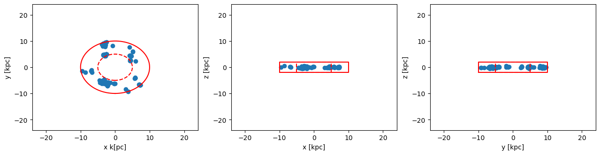
    


#### Cylindrical Shell: Get the data outside of the selected shell-region (inverse selection):


```julia
clumps_subregion = shellregion( clumps, :cylinder,
                                         radius=[5.,10.], 
                                         height=2., 
                                         range_unit=:kpc, 
                                         center=[:boxcenter],
                                         inverse=true);
```

    era]: 2025-06-30T00:04:48.400
    
    center: [0.5, 0.5, 0.5] ==> [24.0 [kpc] :: 24.0 [kpc] :: 24.0 [kpc]]
    
    domain:
    xmin::xmax: 0.2916667 :: 0.7083333  	==> 14.0 [kpc] :: 34.0 [kpc]
    ymin::ymax: 0.2916667 :: 0.7083333  	==> 14.0 [kpc] :: 34.0 [kpc]
    zmin::zmax: 0.4583333 :: 0.5416667  	==> 22.0 [kpc] :: 26.0 [kpc]
    
    Inner radius: 5.0 [kpc]
    Outer radius: 10.0 [kpc]
    Radius diff: 5.0 [kpc]
    Height: 2.0 [kpc]
    Memory used for data table :44.42578125 KB
    -------------------------------------------------------
    


```julia
x, y, z    = getpositions(clumps_subregion, :kpc, center=[:boxcenter]); # shellregion
rx, ry, rz = getextent(clumps, :kpc, center=[:boxcenter]); # full box
```


```julia
figure(figsize=(15.5, 3.5))
theta = range(-pi, stop=pi, length=100)

subplot(1,3,1)
scatter(x,y)
plot( 10. .* sin.(theta) , 10 .* cos.(theta), color="red")
plot( 5. .* sin.(theta) , 5. .* cos.(theta), color="red", ls="--")
xlim(rx)
ylim(ry)
xlabel("x k[pc]")
ylabel("y [kpc]")


subplot(1,3,2)
scatter(x,z)
plot([-10.,-10.,10.,10.,-10.], [-2.,2.,2.,-2.,-2.], color="red")
plot([-5.,-5,5.,5.,-5.], [-2.,2.,2.,-2.,-2.], color="red", ls="--")
xlim(rx)
ylim(rz)
xlabel("x [kpc]")
ylabel("z [kpc]")


subplot(1,3,3)
scatter(y,z)
plot([-10.,-10.,10.,10.,-10.], [-2.,2.,2.,-2.,-2.], color="red")
plot([-5.,-5,5.,5.,-5.], [-2.,2.,2.,-2.,-2.], color="red", ls="--")
xlim(ry)
ylim(rz)
xlabel("y [kpc]")
ylabel("z [kpc]");
```


    
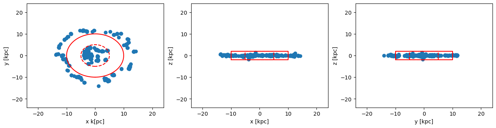
    


## Spherical Shell

Extract the the clump positions and the extent of the full box:


```julia
clumps  = getclumps(info);
x, y, z = getpositions(clumps, :kpc, center=[:boxcenter]);
rx, ry, rz = getextent(clumps, :kpc, center=[:boxcenter]);
```

    era]: Get clump data: 2025-06-30T00:04:48.630
    
    domain:
    xmin::xmax: 0.0 :: 1.0  	==> 0.0 [kpc] :: 48.0 [kpc]
    ymin::ymax: 0.0 :: 1.0  	==> 0.0 [kpc] :: 48.0 [kpc]
    zmin::zmax: 0.0 :: 1.0  	==> 0.0 [kpc] :: 48.0 [kpc]
    
    Read 12 colums: 
    [:index, :lev, :parent, :ncell, :peak_x, :peak_y, :peak_z, Symbol("rho-"), Symbol("rho+"), :rho_av, :mass_cl, :relevance]
    Memory used for data table :61.58203125 KB
    -------------------------------------------------------
    


#### The red lines show the shell that we want to cut-out as a sub-region from the full data:


```julia
figure(figsize=(15.5, 3.5))
theta = range(-pi, stop=pi, length=100)

subplot(1,3,1)
scatter(x,y)
plot( 10. .* sin.(theta) , 10 .* cos.(theta), color="red")
plot( 5. .* sin.(theta) , 5. .* cos.(theta), color="red", ls="--")
xlim(rx)
ylim(ry)
xlabel("x k[pc]")
ylabel("y [kpc]")


subplot(1,3,2)
scatter(x,z)
plot( 10. .* sin.(theta) , 10 .* cos.(theta), color="red")
plot( 5. .* sin.(theta) , 5. .* cos.(theta), color="red", ls="--")
xlim(rx)
ylim(rz)
xlabel("x [kpc]")
ylabel("z [kpc]")


subplot(1,3,3)
scatter(y,z)
plot( 10. .* sin.(theta) , 10 .* cos.(theta), color="red")
plot( 5. .* sin.(theta) , 5. .* cos.(theta), color="red", ls="--")
xlim(ry)
ylim(rz)
xlabel("y [kpc]")
ylabel("z [kpc]");
```


    
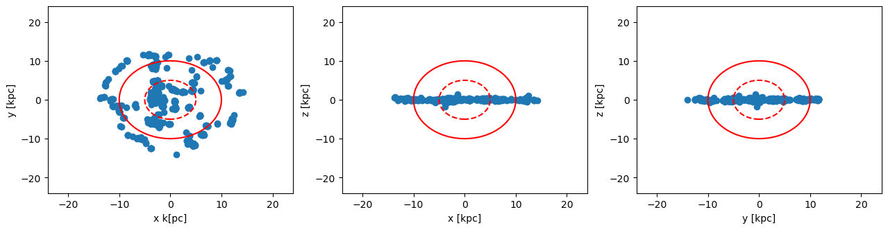
    


#### Spherical Shell: 
Select the inner and outer radius of the spherical shell in unit "kpc", relative to the box center [24., 24., 24.]:


```julia
clumps_subregion = shellregion( clumps, :sphere,
                                radius=[5.,10.],
                                range_unit=:kpc, 
                                center=[:boxcenter]);
```

    era]: 2025-06-30T00:04:49.339
    
    center: [0.5, 0.5, 0.5] ==> [24.0 [kpc] :: 24.0 [kpc] :: 24.0 [kpc]]
    
    domain:
    xmin::xmax: 0.2916667 :: 0.7083333  	==> 14.0 [kpc] :: 34.0 [kpc]
    ymin::ymax: 0.2916667 :: 0.7083333  	==> 14.0 [kpc] :: 34.0 [kpc]
    zmin::zmax: 0.2916667 :: 0.7083333  	==> 14.0 [kpc] :: 34.0 [kpc]
    
    Inner radius: 5.0 [kpc]
    Outer radius: 10.0 [kpc]
    Radius diff: 5.0 [kpc]
    Memory used for data table :18.36328125 KB
    -------------------------------------------------------
    


```julia
x, y, z    = getpositions(clumps_subregion, :kpc, center=[:boxcenter]); # shellregion
rx, ry, rz = getextent(clumps, :kpc, center=[:boxcenter]); # full box
```


```julia
figure(figsize=(15.5, 3.5))
theta = range(-pi, stop=pi, length=100)

subplot(1,3,1)
scatter(x,y)
plot( 10. .* sin.(theta) , 10 .* cos.(theta), color="red")
plot( 5. .* sin.(theta) , 5. .* cos.(theta), color="red", ls="--")
xlim(rx)
ylim(ry)
xlabel("x k[pc]")
ylabel("y [kpc]")


subplot(1,3,2)
scatter(x,z)
plot( 10. .* sin.(theta) , 10 .* cos.(theta), color="red")
plot( 5. .* sin.(theta) , 5. .* cos.(theta), color="red", ls="--")
xlim(rx)
ylim(rz)
xlabel("x [kpc]")
ylabel("z [kpc]")


subplot(1,3,3)
scatter(y,z)
plot( 10. .* sin.(theta) , 10 .* cos.(theta), color="red")
plot( 5. .* sin.(theta) , 5. .* cos.(theta), color="red",  ls="--")
xlim(ry)
ylim(rz)
xlabel("y [kpc]")
ylabel("z [kpc]");
```


    
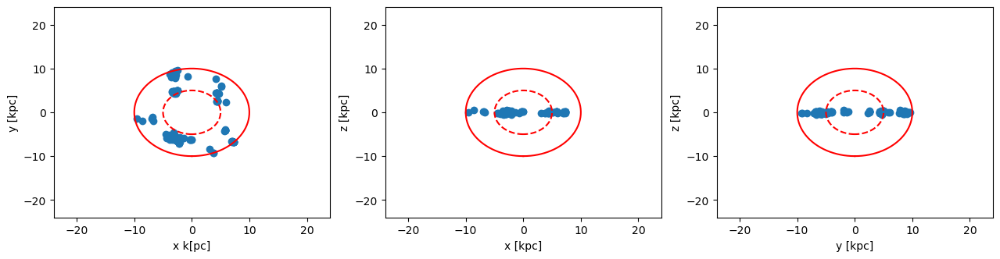
    


#### Spherical Shell: Get the data outside of the selected shell-region (inverse selection):


```julia
clumps_subregion = shellregion( clumps, :sphere,
                                radius=[5.,10.],
                                range_unit=:kpc, 
                                center=[:boxcenter],
                                inverse=true);
```

    era]: 2025-06-30T00:04:49.574
    
    center: [0.5, 0.5, 0.5] ==> [24.0 [kpc] :: 24.0 [kpc] :: 24.0 [kpc]]
    
    domain:
    xmin::xmax: 0.2916667 :: 0.7083333  	==> 14.0 [kpc] :: 34.0 [kpc]
    ymin::ymax: 0.2916667 :: 0.7083333  	==> 14.0 [kpc] :: 34.0 [kpc]
    zmin::zmax: 0.2916667 :: 0.7083333  	==> 14.0 [kpc] :: 34.0 [kpc]
    
    Inner radius: 5.0 [kpc]
    Outer radius: 10.0 [kpc]
    Radius diff: 5.0 [kpc]
    Memory used for data table :44.42578125 KB
    -------------------------------------------------------
    


```julia
x, y, z    = getpositions(clumps_subregion, :kpc, center=[:boxcenter]); # shellregion
rx, ry, rz = getextent(clumps, :kpc, center=[:boxcenter] ); # full box
```


```julia
figure(figsize=(15.5, 3.5))
theta = range(-pi, stop=pi, length=100)

subplot(1,3,1)
scatter(x,y)
plot( 10. .* sin.(theta) , 10 .* cos.(theta), color="red")
plot( 5. .* sin.(theta) , 5. .* cos.(theta), color="red", ls="--")
xlim(rx)
ylim(ry)
xlabel("x k[pc]")
ylabel("y [kpc]")


subplot(1,3,2)
scatter(x,z)
plot( 10. .* sin.(theta) , 10 .* cos.(theta), color="red")
plot( 5. .* sin.(theta) , 5. .* cos.(theta), color="red", ls="--")
xlim(rx)
ylim(rz)
xlabel("x [kpc]")
ylabel("z [kpc]")


subplot(1,3,3)
scatter(y,z)
plot( 10. .* sin.(theta) , 10 .* cos.(theta), color="red")
plot( 5. .* sin.(theta) , 5. .* cos.(theta), color="red", ls="--")
xlim(ry)
ylim(rz)
xlabel("y [kpc]")
ylabel("z [kpc]");
```


    
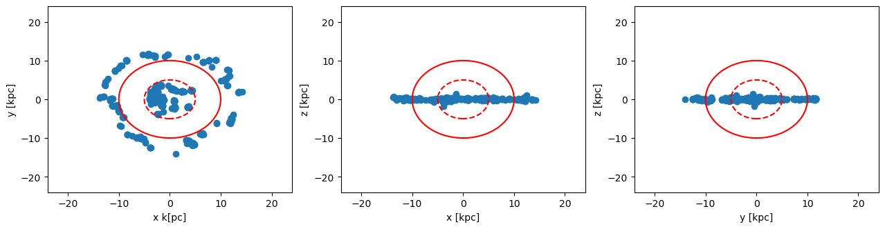
    


```julia

```
