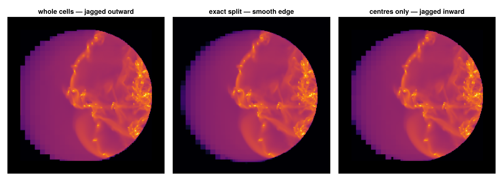
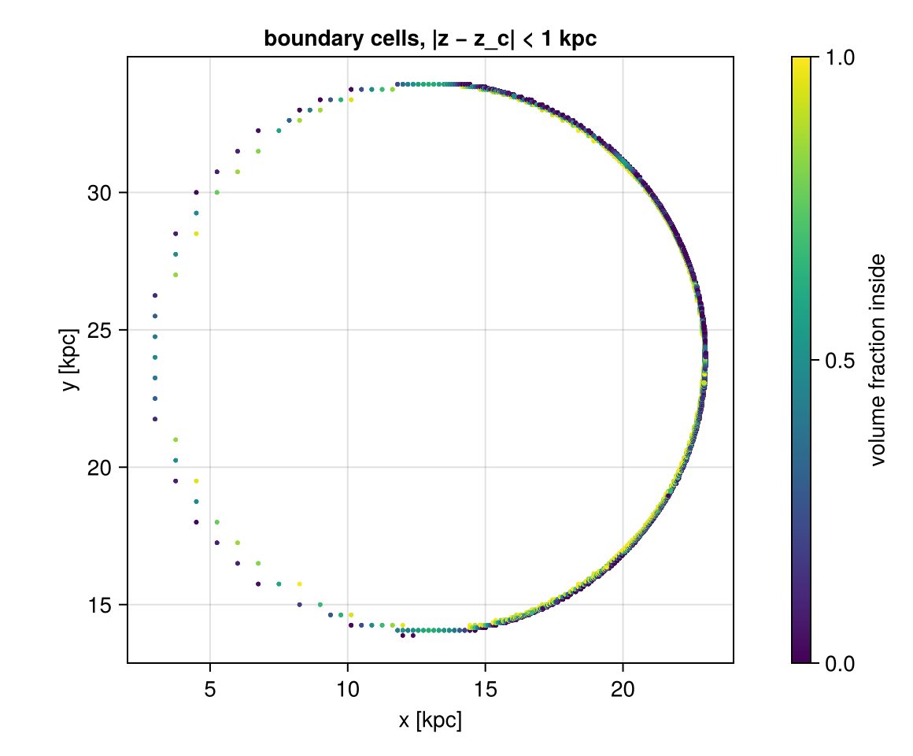
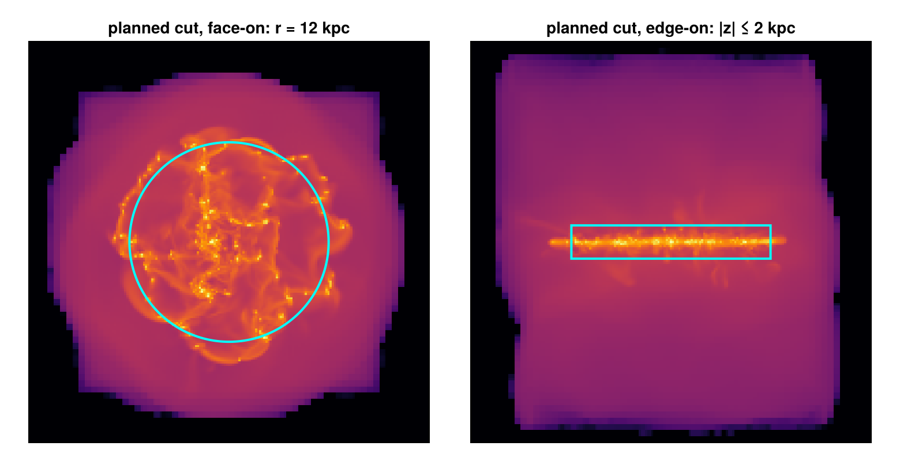
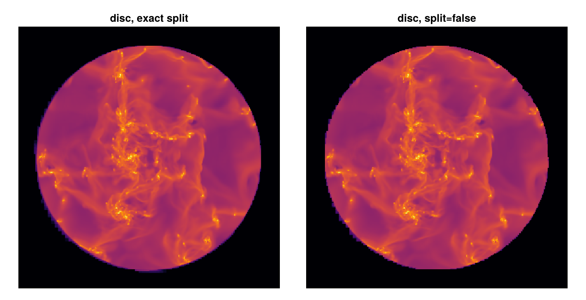
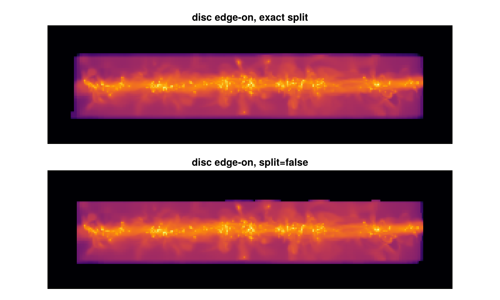
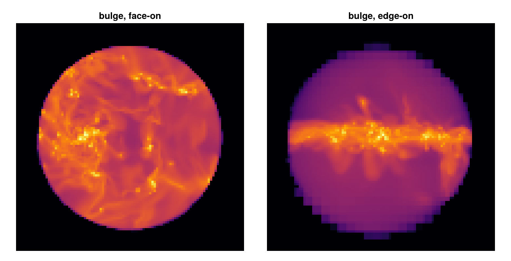
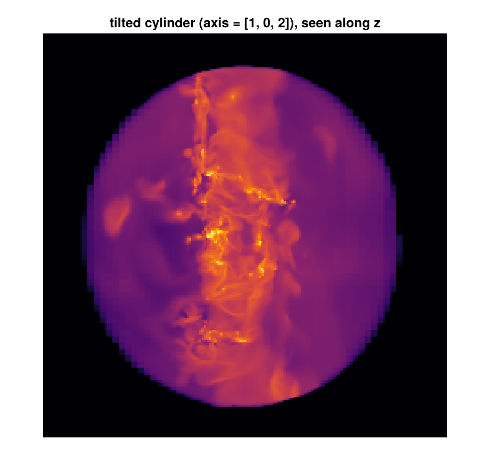

# 3. Hydro: Sub-Regions — Cutting Geometry out of AMR Data

!!! tip "Run it yourself"
    This page is also an executable **Jupyter notebook** — [open / download `03_hydro_Get_Subregions.ipynb`](https://github.com/ManuelBehrendt/Notebooks/blob/master/Mera-Docs/version_1/03_hydro_Get_Subregions.ipynb). The notebooks run end-to-end and double as part of Mera's test suite.


In this tutorial we dissect one simulated disc galaxy into its structural
components — bulge, disc, star-forming ring, and a surrounding envelope — and
assemble a gas **mass budget** for each. That sounds like bookkeeping, but on an
adaptive mesh it is a genuine measurement problem: every smooth boundary you draw
(a sphere, a cylinder, a shell) slices straight through AMR cells, and *what you
do with those sliced cells decides your number*.

There are three possible answers, and Mera implements all of them:

1. **Keep every intersecting cell whole** — an *upper bound* on mass and volume
   (the region grows a jagged, outward-bulging rim of over-counted cells).
2. **Keep only cells whose centre is inside** — a *lower bound* (the rim is now
   jagged inward; straddling material is thrown away).
3. **Split the boundary cells exactly** — each straddling cell carries a
   `:fraction` column giving the volume fraction that lies inside the region.
   Mass, volume, and projections then honour that fraction. This is the
   *measurement*; the first two are its error bracket.

We will quantify that bracket first, see it with our own eyes second, and then
put the exact-splitting machinery to work on the galaxy.

!!! warning "range_unit = :standard means box fractions"
    All spatial selection functions accept `range_unit=:standard`, in which
    coordinates and radii are **fractions of the box length** (0…1), *not*
    physical lengths. Forgetting this is the classic way to select an empty or
    absurdly large region. This tutorial uses `range_unit=:kpc` with explicit
    centres throughout.

**What tool for what job?**

| Goal | Tool |
|:--|:--|
| Carve a geometric shape, measured exactly | `Sphere`, `Cuboid`, `Cylinder` + `subregion` |
| Shells (rings, envelopes) | `SphericalShell`, `CylindricalShell` |
| Combine shapes | `∩`, `∪`, `\`, `!` (region algebra) |
| Quick whole-cell cuts, older scripts | classic `subregion(gas, :cuboid; ...)`, `shellregion` |
| Select by *value* (density, temperature, …) | [Masking & Filtering](05_multi_Masking_Filtering.md) |

This page covers the geometric tools; the value-space tools compose with them.

## Load the Simulated Galaxy

We load a single snapshot of a simulated disc galaxy in a 48 kpc box and read
only the density field (`:rho`) up to level 12 — everything in this tutorial
(surface density, mass, volume, cell size, `:fraction`) derives from it.
The box centre `[:bc]` sits at (24, 24, 24) kpc.

```julia
using Mera, CairoMakie
# Makie also exports geometric names (Sphere, Cylinder, ...) — state explicitly
# that we mean Mera's region types:
import Mera: Sphere, Cuboid, Cylinder, SphericalShell, CylindricalShell
CairoMakie.activate!()

info = getinfo(400, "/Volumes/FASTStorage/Simulations/Mera-Tests/RAMSES/manu_sim_sf_L14", verbose=false)
gas  = gethydro(info, :rho, lmax=12, smallr=1e-11, verbose=false, show_progress=false);

kpc = info.scale.kpc   # code length -> kpc
println("cells loaded : ", length(gas.data))
println("box size     : ", round(gas.boxlen * kpc, sigdigits=4), " kpc, centre [:bc] at (24, 24, 24) kpc")
```

```
*__   __ _______ ______   _______
|  |_|  |       |    _ | |   _   |
|       |    ___|   | || |  |_|  |
|       |   |___|   |_||_|       |
|       |    ___|    __  |       |
| ||_|| |   |___|   |  | |   _   |
|_|   |_|_______|___|  |_|__| |__|
Mera v1.8.0
cells loaded : 18966620
box size     : 48.0 kpc, centre [:bc] at (24, 24, 24) kpc
```

One plotting helper serves the whole notebook: `show_sd!` draws a
log-scaled surface-density panel in kpc coordinates (relative to the projection
centre), and `proj` wraps `projection` with the settings we reuse everywhere.
Boundary comparisons live or die on consistent rendering, so we define this once
and never vary it.

```julia
function show_sd!(ax, p; flo=1e-3)
    xs = range(p.cextent[1]*kpc, p.cextent[2]*kpc; length=size(p.maps[:sd], 1))
    ys = range(p.cextent[3]*kpc, p.cextent[4]*kpc; length=size(p.maps[:sd], 2))
    heatmap!(ax, xs, ys, log10.(max.(p.maps[:sd], flo)); colormap=:inferno)
    ax.aspect = DataAspect()
    hidedecorations!(ax)
    return ax
end

# same, but with FIXED axis limits (kpc, relative to the projection centre) so
# side-by-side panels compare fairly even when their data extents differ
function show_sd!(ax, p, lims; flo=1e-3)
    show_sd!(ax, p; flo=flo)
    limits!(ax, lims...)
    return ax
end

proj(data; kwargs...) = projection(data, :sd, :Msol_pc2;
                                   direction=:z, center=[:bc], range_unit=:kpc,   # ranges in kpc
                                   pxsize=[0.25, :kpc],
                                   verbose=false, show_progress=false, kwargs...)
```

```
proj (generic function with 1 method)
```

## One Sphere, Three Masses

Before any pictures, the numbers. We place a sphere of radius 10 kpc at
x = 13 kpc (off-centre, at box-centre height in y and z), so its surface sweeps
through regions of very different AMR refinement — exactly the situation where
boundary cells matter.

The classic symbol API gives us the two bounds: `cell=true` keeps every cell
whose *volume* intersects the sphere, `cell=false` keeps only cells whose
*centre* falls inside. The value-type `Sphere` region — applied with plain
`subregion(gas, region)` — splits the boundary cells exactly (`split=true` is
the default) and is our reference.

```julia
ctr = [13., :bc, :bc]   # x = 13 kpc; box centre in y and z

sph_whole  = subregion(gas, :sphere; radius=10., center=ctr, range_unit=:kpc,
                       cell=true,  verbose=false)   # whole intersecting cells
sph_centre = subregion(gas, :sphere; radius=10., center=ctr, range_unit=:kpc,
                       cell=false, verbose=false)   # centre-inside cells only
sph        = subregion(gas, Sphere(10.; center=ctr, range_unit=:kpc), verbose=false)  # exact split

m_upper = msum(sph_whole,  :Msol)
m_lower = msum(sph_centre, :Msol)
m_exact = msum(sph,        :Msol)

println("gas mass inside r = 10 kpc:")
println("  whole cells   (cell=true)  : ", round(m_upper, sigdigits=6), " Msol   +",
        round(100*(m_upper/m_exact - 1), sigdigits=3), " % vs split")
println("  centres only  (cell=false) : ", round(m_lower, sigdigits=6), " Msol   ",
        round(100*(m_lower/m_exact - 1), sigdigits=3), " % vs split")
println("  exact split   (:fraction)  : ", round(m_exact, sigdigits=6), " Msol   reference")
```

```
gas mass inside r = 10 kpc:
  whole cells   (cell=true)  : 1.199e10 Msol   +0.375 % vs split
  centres only  (cell=false) : 1.19454e10 Msol   0.00129 % vs split
  exact split   (:fraction)  : 1.19452e10 Msol   reference
```

The two classic modes bracket the split value from above and below. The
bracket width is set by the resolution of the cells the boundary happens to
cross — it shrinks as refinement increases, but at any finite resolution the
split value is the answer, and the bracket is its systematic uncertainty.

The same holds for volume, where we can check against an analytic truth: the
`:fraction`-weighted cell volumes of the split sphere must sum to
(4/3)πR³.

```julia
v_meas = sum(getvar(sph, :volume, :kpc3))
v_ana  = 4π/3 * 10.0^3

println("split-cell volume sum : ", round(v_meas, sigdigits=6), " kpc^3")
println("(4/3) π R^3           : ", round(v_ana,  sigdigits=6), " kpc^3")
println("deviation             : ", round(100*(v_meas/v_ana - 1), sigdigits=2), " %")
```

```
split-cell volume sum : 4244.5
 kpc^3
(4/3) π R^3           : 4188.79 kpc^3
deviation             : 1.3 %
```

## The Same Sphere, as Images

Now the pictures that explain the numbers. Because projections route mass
through the `:fraction`-aware machinery, a split region projects with an
*exact* circular edge — while the whole-cell selection bulges jaggedly outward
and the centre-only selection erodes jaggedly inward. We zoom to the sphere
with a 0.1 kpc pixel size so the rim cells are resolved.

```julia
zoom = (center=ctr, xrange=[-12, 12], yrange=[-12, 12], pxsize=[0.1, :kpc])

p_up = proj(sph_whole;  zoom...)
p_sp = proj(sph;        zoom...)
p_lo = proj(sph_centre; zoom...)

fig = Figure(size=(1050, 380))
L = (-12, 12, -12, 12)
show_sd!(Axis(fig[1, 1], title="whole cells — jagged outward", backgroundcolor=:black), p_up, L)
show_sd!(Axis(fig[1, 2], title="exact split — smooth edge", backgroundcolor=:black),    p_sp, L)
show_sd!(Axis(fig[1, 3], title="centres only — jagged inward", backgroundcolor=:black), p_lo, L)
fig
```



And here is what "exact splitting" means cell by cell. We take the
split sphere's *boundary* cells (those with `0 < fraction < 1`), restrict to a
thin slab of ±1 kpc around the mid-plane, and colour each cell centre by its
inside-fraction. The algebra literally weighs every straddling cell: cells
mostly inside carry fractions near 1, cells barely grazed carry fractions near
0, and their mass and volume enter every sum with exactly that weight.

```julia
x = getvar(sph, :x, :kpc)
y = getvar(sph, :y, :kpc)
z = getvar(sph, :z, :kpc)
f = Mera.select(sph.data, :fraction)

sel = (f .< 1.0) .& (abs.(z .- 24.) .< 1.)   # boundary cells in a thin mid-plane slab

fig = Figure(size=(580, 480))
ax  = Axis(fig[1, 1], title="boundary cells, |z − z_c| < 1 kpc",
           xlabel="x [kpc]", ylabel="y [kpc]", aspect=DataAspect())
sc  = scatter!(ax, x[sel], y[sel]; color=f[sel], colormap=:viridis,
               colorrange=(0, 1), markersize=4)
Colorbar(fig[1, 2], sc, label="volume fraction inside")
fig
```



## The Disc: a Cylinder

On to the galaxy itself. A rotating disc calls for a cylinder:
`Cylinder(12., 2.)` — radius 12 kpc and **half-height** 2 kpc (so the slab spans
|z| ≤ 2 kpc), centred on the box. Note two conventions once and for all: the
second argument is always the half-height, and the classic symbol form
`subregion(gas, :cylinder; ...)` only supports the z-axis (`direction=:x` or
`:y` raise errors) — the value-type `Cylinder` instead takes an arbitrary
`axis` vector, which we exploit later.

A habit worth copying: *draw the cut before you make it*. Because our figure
helper plots in kpc relative to the projection centre, we can overlay the
planned cylinder directly in data coordinates on full-box maps — a circle
face-on, a rectangle edge-on.

```julia
p_face = proj(gas)                 # full box, face-on (z)
p_edge = proj(gas; direction=:x)   # full box, edge-on

fig = Figure(size=(780, 400))
ax1 = Axis(fig[1, 1], title="planned cut, face-on: r = 12 kpc")
show_sd!(ax1, p_face)
arc!(ax1, Point2f(0, 0), 12., 0., 2π; color=:cyan, linewidth=2)

ax2 = Axis(fig[1, 2], title="planned cut, edge-on: |z| ≤ 2 kpc")
show_sd!(ax2, p_edge)
lines!(ax2, [-12., 12., 12., -12., -12.], [-2., -2., 2., 2., -2.];
       color=:cyan, linewidth=2)
fig
```



Extract it twice: once with exact splitting (the default) and once with
`split=false`, which keeps whole cells by the centre-inside test — the classic
behaviour, with no `:fraction` column.

```julia
disc_region = Cylinder(12., 2.; center=[:bc], range_unit=:kpc)   # radius, half-height

disc       = subregion(gas, disc_region, verbose=false)                # exact split
disc_whole = subregion(gas, disc_region; split=false, verbose=false)   # centre test

m_disc  = msum(disc,       :Msol)
m_discw = msum(disc_whole, :Msol)
println("disc gas mass (r < 12 kpc, |z| < 2 kpc):")
println("  exact split : ", round(m_disc,  sigdigits=6), " Msol")
println("  split=false : ", round(m_discw, sigdigits=6), " Msol   (",
        round(100*(m_discw/m_disc - 1), sigdigits=3), " %)")
```

```
disc gas mass (r < 12 kpc, |z| < 2 kpc):
  exact split : 2.282e10 Msol
  split=false : 2.28149e10 Msol   (-0.0225 %)
```

Face-on, the difference lives on the rim — the split cut has a clean
circle, the centre-tested cut a pixelated one.

```julia
p1 = proj(disc;       xrange=[-14, 14], yrange=[-14, 14], pxsize=[0.1, :kpc])
p2 = proj(disc_whole; xrange=[-14, 14], yrange=[-14, 14], pxsize=[0.1, :kpc])

fig = Figure(size=(780, 400))
show_sd!(Axis(fig[1, 1], title="disc, exact split"), p1)
show_sd!(Axis(fig[1, 2], title="disc, split=false"), p2)
fig
```



Edge-on, the same comparison shows the slab faces at z = ±2 kpc. The disc
mid-plane is highly refined, so the centre-tested surface is close to the exact
one here — the penalty of whole-cell selection is largest where the boundary
crosses *coarse* cells, as it did for the off-centre sphere above.

```julia
p3 = proj(disc;       direction=:x, yrange=[-14, 14], zrange=[-4, 4], pxsize=[0.1, :kpc])
p4 = proj(disc_whole; direction=:x, yrange=[-14, 14], zrange=[-4, 4], pxsize=[0.1, :kpc])

fig = Figure(size=(700, 420))
show_sd!(Axis(fig[1, 1], title="disc edge-on, exact split"), p3)
show_sd!(Axis(fig[2, 1], title="disc edge-on, split=false"), p4)
fig
```



## The Bulge: a Sphere

The inner 4 kpc host the densest gas — our stand-in for a bulge / inner-halo
component. A small `Sphere` at the box centre, split exactly:

```julia
bulge_region = Sphere(4.; center=[:bc], range_unit=:kpc)
bulge = subregion(gas, bulge_region, verbose=false)

m_bulge = msum(bulge, :Msol)
println("bulge gas mass (r < 4 kpc): ", round(m_bulge, sigdigits=6), " Msol")

pb1 = proj(bulge; xrange=[-5, 5], yrange=[-5, 5], pxsize=[0.1, :kpc])
pb2 = proj(bulge; direction=:x, yrange=[-5, 5], zrange=[-5, 5], pxsize=[0.1, :kpc])

fig = Figure(size=(780, 400))
show_sd!(Axis(fig[1, 1], title="bulge, face-on"), pb1)
show_sd!(Axis(fig[1, 2], title="bulge, edge-on"), pb2)
fig
```

```
bulge gas mass (r < 4 kpc): 5.91713e9
 Msol
```



Every region also defines its complement. With `inverse=true` the
selection flips — and so do the fractions (`fraction → 1 − fraction`), so a
boundary cell's material is shared *exactly* between a region and its inverse,
with nothing counted twice and nothing lost. Here is "everything but the
bulge", edge-on: the hole is real, and its wall is smooth.

```julia
antibulge = subregion(gas, bulge_region; inverse=true, verbose=false)

pa = proj(antibulge; direction=:x, yrange=[-10, 10], zrange=[-10, 10], pxsize=[0.1, :kpc])

fig = Figure(size=(480, 440))
show_sd!(Axis(fig[1, 1], title="everything but the bulge (inverse=true)"), pa)
fig
```


## The Star-Forming Ring: a Cylindrical Shell

Dense gas often organises into rings; ours sits between roughly 6 and 10 kpc.
`CylindricalShell(6., 10., 2.)` selects exactly that annulus within the ±2 kpc
slab (the inner radius must be smaller than the outer, and both must be
nonzero — the constructors guard against degenerate shells). A shell has *two*
boundary surfaces, so exact splitting pays off twice.

```julia
ring_region = CylindricalShell(6., 10., 2.; center=[:bc], range_unit=:kpc)

ring       = subregion(gas, ring_region, verbose=false)
ring_whole = subregion(gas, ring_region; split=false, verbose=false)

m_ring = msum(ring, :Msol)
println("ring gas mass (6 < r < 10 kpc, |z| < 2 kpc): ", round(m_ring, sigdigits=6), " Msol")

pr1 = proj(ring;       xrange=[-12, 12], yrange=[-12, 12], pxsize=[0.1, :kpc])
pr2 = proj(ring_whole; xrange=[-12, 12], yrange=[-12, 12], pxsize=[0.1, :kpc])

fig = Figure(size=(780, 400))
show_sd!(Axis(fig[1, 1], title="ring, exact split"), pr1)
show_sd!(Axis(fig[1, 2], title="ring, split=false"), pr2)
fig
```

```
ring gas mass (6 < r < 10 kpc, |z| < 2 kpc): 8.03124e9
 Msol
```


## The Envelope: a Spherical Shell

Outside the disc, a CGM-like envelope: `SphericalShell(10., 20.)` selects the
gas between 10 and 20 kpc from the centre. For contrast we also extract the
enclosed 10 kpc sphere — together the two partition everything inside 20 kpc,
and because both are split exactly, the cells on their shared surface at
r = 10 kpc are divided between them without double counting.

```julia
env_region = SphericalShell(10., 20.; center=[:bc], range_unit=:kpc)

env  = subregion(gas, env_region, verbose=false)
core = subregion(gas, Sphere(10.; center=[:bc], range_unit=:kpc), verbose=false)

m_env  = msum(env,  :Msol)
m_core = msum(core, :Msol)
println("envelope (10–20 kpc) : ", round(m_env,  sigdigits=6), " Msol")
println("enclosed  (< 10 kpc) : ", round(m_core, sigdigits=6), " Msol")

pe1 = proj(env;  direction=:x)
pe2 = proj(core; direction=:x)

fig = Figure(size=(780, 400))
show_sd!(Axis(fig[1, 1], title="envelope shell, edge-on"), pe1)
show_sd!(Axis(fig[1, 2], title="enclosed sphere, edge-on"), pe2)
fig
```

```
envelope (10–20 kpc) : 1.18102e10
 Msol
enclosed  (< 10 kpc) : 1.82097e10 Msol
```


## Region Algebra: Composing the Measurement

Regions are values, so they compose with the set operators `∩` (also `&`),
`∪` (also `|`), `\` (difference), and `!` (complement) — arbitrarily nested,
with different centres per part, and *all of it still splits boundary cells
exactly* (curved composite surfaces are sub-sampled per cell; `nsub` controls
how finely).

The scientifically honest "disc mass" excludes the bulge sitting in its
middle: `disc_region \ bulge_region`. One subtlety makes this a good example —
the bulge sphere (R = 4 kpc) pokes *above and below* the ±2 kpc slab, so the
right quantity to subtract from the disc is not the full bulge mass but the
mass of `disc ∩ bulge`. The algebra keeps that book for us:

```julia
clean_disc = subregion(gas, disc_region \ bulge_region, verbose=false)
overlap    = subregion(gas, disc_region ∩ bulge_region, verbose=false)

m_clean = msum(clean_disc, :Msol)
m_olap  = msum(overlap,    :Msol)

println("disc \\ bulge : ", round(m_clean, sigdigits=6), " Msol")
println("disc ∩ bulge : ", round(m_olap,  sigdigits=6), " Msol")
println("check  (disc \\ bulge) + (disc ∩ bulge) = ",
        round(m_clean + m_olap, sigdigits=6), "  vs  disc = ", round(m_disc, sigdigits=6))

pc1 = proj(clean_disc; xrange=[-14, 14], yrange=[-14, 14], pxsize=[0.1, :kpc])
pc2 = proj(clean_disc; direction=:x, yrange=[-14, 14], zrange=[-4, 4], pxsize=[0.1, :kpc])

fig = Figure(size=(700, 480))
show_sd!(Axis(fig[1, 1], title="disc \\ bulge, face-on"), pc1)
show_sd!(Axis(fig[2, 1], title="disc \\ bulge, edge-on — the lens-shaped bite"), pc2)
fig
```

```
disc \ bulge : 1.69171e10
 Msol
disc ∩ bulge : 5.90294e9 Msol
check  (disc \ bulge) + (disc ∩ bulge) = 2.282e10  vs  disc = 2.282e10
```


Nothing limits us to two parts. Below, a deliberately playful carve —
the disc unioned with an off-centre 5 kpc sphere (a "companion"), minus two
drilled holes — done in one line. Every piece may carry its own centre.

```julia
sculpture = (disc_region ∪ Sphere(5.; center=[33., :bc, :bc], range_unit=:kpc)) \
            (Sphere(2.5; center=[18., :bc, :bc], range_unit=:kpc) ∪
             Sphere(2.5; center=[30., :bc, :bc], range_unit=:kpc))

carve = subregion(gas, sculpture, verbose=false)
println("sculpture gas mass: ", round(msum(carve, :Msol), sigdigits=6), " Msol")

ps = proj(carve; xrange=[-16, 16], yrange=[-16, 16], pxsize=[0.1, :kpc])

fig = Figure(size=(520, 480))
show_sd!(Axis(fig[1, 1], title="(disc ∪ companion) \\ two holes"), ps)
fig
```

```
sculpture gas mass: 2.25593e10
 Msol
```


Because the fractions are exact, set identities hold *numerically*, not
just formally. Inclusion–exclusion for the disc A and the companion sphere B:

```julia
A = disc_region
B = Sphere(5.; center=[33., :bc, :bc], range_unit=:kpc)

volk(r) = sum(getvar(subregion(gas, r, verbose=false), :volume, :kpc3))

vA, vB, vAB, vAuB = volk(A), volk(B), volk(A ∩ B), volk(A ∪ B)
println("vol(A) + vol(B) − vol(A ∩ B) = ", round(vA + vB - vAB, sigdigits=6), " kpc^3")
println("vol(A ∪ B)                   = ", round(vAuB, sigdigits=6), " kpc^3")
```

```
vol(A) + vol(B) − vol(A ∩ B) = 2088.12
 kpc^3
vol(A ∪ B)                   = 2088.12 kpc^3
```

## Tilted Regions

Real discs rarely align with the grid. The value-type `Cylinder` (and
`CylindricalShell`) accept any 3-vector as `axis` — here a disc-like cylinder
tilted toward the x-axis. Only the value types can do this; the classic
`:cylinder` symbol form is strictly z-aligned. Viewed along z, the tilt shows
up as an ellipse with softened rims where the slab's faces cut the line of
sight obliquely. To *view along* the tilted axis rather than merely select
along it, see the off-axis projection tutorials
([Projections: Off-Axis](06_offaxis_Projection.md),
[Off-Axis Applications](11_multi_OffAxisProjection.md)).

```julia
tilt_region = Cylinder(10., 1.; axis=[1., 0., 2.], center=[:bc], range_unit=:kpc)
tilted = subregion(gas, tilt_region, verbose=false)

println("tilted-disc gas mass: ", round(msum(tilted, :Msol), sigdigits=6), " Msol")

pt = proj(tilted; xrange=[-12, 12], yrange=[-12, 12], pxsize=[0.1, :kpc])

fig = Figure(size=(520, 480))
show_sd!(Axis(fig[1, 1], title="tilted cylinder (axis = [1, 0, 2]), seen along z"), pt)
fig
```

```
tilted-disc gas mass: 5.5231e9
 Msol
```



## Reference: the Classic Symbol API

Everything above has a whole-cell counterpart in the original symbol-based
interface, which remains fully supported. It is the right tool for quick
exploratory cuts where a jagged rim is irrelevant, and it keeps older analysis
scripts working unchanged.

| Value type | Classic call |
|:--|:--|
| `Cuboid(xrange=…, yrange=…, zrange=…)` | `subregion(gas, :cuboid; xrange=…, yrange=…, zrange=…)` |
| `Sphere(R)` | `subregion(gas, :sphere; radius=R)` |
| `Cylinder(R, H)` | `subregion(gas, :cylinder; radius=R, height=H)` (z-axis only) |
| `SphericalShell(rin, rout)` | `shellregion(gas, :sphere; radius=[rin, rout])` |
| `CylindricalShell(rin, rout, H)` | `shellregion(gas, :cylinder; radius=[rin, rout], height=H)` |

Shared keywords: `center`, `range_unit`, `inverse=true` for the complement, and
`cell=true/false` to choose the whole-cell (intersecting-volume) or
centre-inside test — the upper/lower bracket from the start of this tutorial.
Two guards to know: radii and heights must be nonzero, and a sphere or cylinder
centre may not contain a literal `0.0` coordinate in these calls — give the
coordinate explicitly or use `:bc` forms. The hydro cylinder additionally
offers `smooth_boundary=true`, an intermediate edge softening predating exact
splitting. `get_filtered_ranges` recovers the bounding ranges of any cut, ready
to pass to `projection`.

```julia
cub_c = subregion(gas, :cuboid; xrange=[-12, 12], yrange=[-12, 12], zrange=[-2, 2],
                  center=[:bc], range_unit=:kpc, verbose=false)
sph_c = subregion(gas, :sphere; radius=10., center=[13., :bc, :bc], range_unit=:kpc,
                  cell=false, verbose=false)
cyl_c = subregion(gas, :cylinder; radius=12., height=2., center=[:bc], range_unit=:kpc,
                  verbose=false)
shl_c = shellregion(gas, :sphere; radius=[10., 20.], center=[:bc], range_unit=:kpc,
                    verbose=false)

xr, yr, zr = Mera.get_filtered_ranges(cyl_c)   # normalised [0,1] box fractions of the cut
println("classic cylinder mass : ", round(msum(cyl_c, :Msol), sigdigits=6),
        " Msol   (vs split disc: ", round(m_disc, sigdigits=6), ")")
println("cut spans x ∈ ", round.(xr .* (gas.boxlen * kpc), sigdigits=4), " kpc (absolute)")
```

```
classic cylinder mass : 2.29049e10
 Msol   (vs split disc: 2.282e10)
cut spans x ∈
[12.0, 36.0] kpc (absolute)
```

## Practical Guidance

**Which mode when.**

- *Exploring?* Whole-cell cuts (`cell=true`, or `split=false` on a value-type
  region) are the cheapest and guarantee you see all material near the region.
- *Need a strict subset* (e.g. as input to a further selection)? Centre-inside
  (`cell=false`) never includes outside material.
- *Measuring* a mass, volume, or profile? Use the value-type regions with the
  default `split=true` — the `:fraction` column makes `msum`,
  `getvar(:mass)`, `getvar(:volume)`, and projections exact at the boundary.

**Cost.** Exact splitting adds one pass over the boundary cells only; interior
cells are untouched. For composite regions with curved surfaces the per-cell
fraction is estimated by sub-sampling — raise `nsub` (default 8) if you need
tighter fractions on strongly curved composites, at proportional cost.

**Partitions are exact.** A region and its inverse share boundary cells via
complementary fractions, so they partition the box to numerical precision:

```julia
m_out = msum(antibulge, :Msol)
m_tot = msum(gas, :Msol)

println("bulge + everything-else : ", round(m_bulge + m_out, sigdigits=8), " Msol")
println("whole box               : ", round(m_tot,           sigdigits=8), " Msol")
```

```
bulge + everything-else : 3.0400672e10
 Msol
whole box               : 3.0400672e10 Msol
```

And the payoff — the mass budget of the galaxy we set out to dissect,
every entry measured with exact boundaries:

```julia
components = [
    ("bulge      — Sphere(4 kpc)",                        m_bulge),
    ("disc\\bulge — Cylinder(12, ±2 kpc) \\ Sphere(4)",   m_clean),
    ("ring       — CylindricalShell(6–10, ±2 kpc)",       m_ring),
    ("envelope   — SphericalShell(10–20 kpc)",            m_env),
]

println(rpad("component", 46), "gas mass [Msol]")
println("-"^62)
for (name, m) in components
    println(rpad(name, 46), round(m, sigdigits=5))
end
```

```
component                                     gas mass [Msol]
--------------------------------------------------------------
bulge      — Sphere(4 kpc)                    5.9171e9
disc\bulge — Cylinder(12, ±2 kpc) \ Sphere(4) 1.6917e10
ring       — CylindricalShell(6–10, ±2 kpc)   8.0312e9
envelope   — SphericalShell(10–20 kpc)        1.181e10
```

## Summary

- On an AMR grid, a region boundary is a *choice*: whole cells over-count,
  centre tests under-count, exact splitting (`:fraction`) measures. Quote the
  split value; the other two bracket its systematic uncertainty.
- Value-type regions (`Sphere`, `Cuboid`, `Cylinder`, `SphericalShell`,
  `CylindricalShell`) are applied with `subregion(gas, region)`, compose with
  `∩ ∪ \ !`, tilt via `axis`, invert with `inverse=true`, and keep all
  downstream quantities (`msum`, `getvar`, `projection`) boundary-exact.
- The classic `subregion`/`shellregion` symbol API remains the quick whole-cell
  workhorse and the compatibility path for existing scripts.

**Continue with:**

- [Masking & Filtering](05_multi_Masking_Filtering.md) — select by *value*
  (density, temperature, any derived quantity) and combine with these
  geometric regions.
- The sibling sub-region tutorials for
  [particles](03_particles_Get_Subregions.md),
  [gravity](03_gravity_Get_Subregions.md), and
  [clumps](03_clumps_Get_Subregions.md).
- [Projections: Off-Axis](06_offaxis_Projection.md) and
  [Off-Axis Applications](11_multi_OffAxisProjection.md) — view along a tilted
  region's axis.
