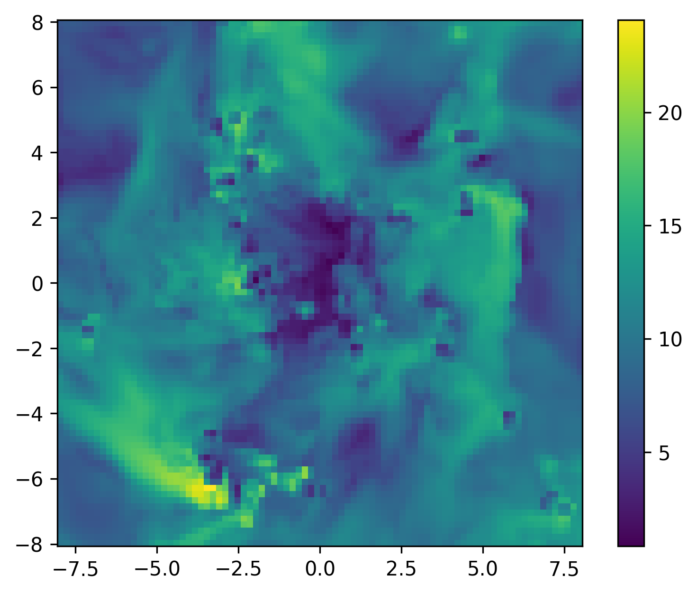

# Data Masking, Filtering, and Metaprogramming

!!! tip "Run it yourself"
    This page is also an executable **Jupyter notebook** — [open / download `05_multi_Masking_Filtering.ipynb`](https://github.com/ManuelBehrendt/Notebooks/blob/master/Mera-Docs/version_1/05_multi_Masking_Filtering.ipynb). The notebooks run end-to-end and double as part of Mera's test suite.


## Advanced Data Manipulation and Selection Techniques

### Tutorial Overview

This comprehensive tutorial explores the sophisticated data manipulation capabilities within **MERA.jl**, focusing on:
- **Data Selection & Extraction**: Advanced techniques for extracting specific variables and columns from complex astrophysical datasets
- **Conditional Filtering**: Multi-criteria filtering operations using both IndexedTables.jl and MERA's custom macros
- **Masking Operations**: Boolean array operations for selective data analysis without modifying source tables
- **Data Table Extension**: Adding computed variables and derived quantities to existing datasets
- **Metaprogramming**: Using MERA's pipeline macros (@filter, @apply, @where) for elegant data processing workflows

### Learning Objectives

By completing this tutorial, you will master:

1. **Data Selection Techniques**:
   - Extract single and multiple columns using IndexedTables and MERA functions
   - Understanding the difference between `select()`, `columns()`, and `getvar()` approaches
   - Working with named tuples and dictionaries for multi-variable extraction

2. **Advanced Filtering Operations**:
   - Single and multi-condition filtering using IndexedTables syntax
   - MERA's pipeline macros for streamlined data processing
   - Creating custom filtering functions for complex geometric conditions
   - Comparing performance between different filtering approaches

3. **Masking and Boolean Operations**:
   - Creating boolean masks for selective analysis
   - Combining multiple masks using logical operations
   - Applying masks to statistical functions without data modification
   - Understanding mask types: Array{Bool,1} vs BitArray{1}

4. **Data Table Extension**:
   - Adding computed columns using `transform()` and `insertcolsafter()`
   - Managing derived quantities with proper unit handling
   - Removing and modifying existing columns

5. **Metaprogramming Workflows**:
   - Using @filter macro for elegant condition-based filtering
   - Building complex filtering pipelines with @apply and @where
   - Creating reusable filtering expressions

### Technical Foundation

#### IndexedTables.jl Integration
MERA leverages **IndexedTables.jl** for high-performance data manipulation:
- **Memory Efficiency**: Column-oriented storage optimized for large datasets
- **Type Safety**: Strongly typed columns ensuring computational correctness
- **Performance**: Optimized operations for filtering and selection
- **Composability**: Chainable operations for complex data processing workflows

#### MERA's Custom Macros
The tutorial demonstrates MERA's specialized macros:
- **@filter**: Streamlined conditional filtering with automatic type handling
- **@apply**: Pipeline operator for chaining multiple filtering operations
- **@where**: Condition-based row selection with field reference transformation

#### Data Types and Structures
Key concepts covered:
- **DataSetType objects**: HydroDataType, PartDataType, ClumpDataType, GravDataType
- **Unit Management**: Automatic conversion between code units and physical units
- **Mask Types**: Boolean arrays for selective operations
- **Filtered Tables**: Creating new DataSetType objects from filtered data

## Data Loading and Environment Setup

### Overview

This section establishes our computational environment by loading simulation data from multiple physics modules. We'll work with:
- **Hydro data**: Gas properties (density, velocity, pressure)
- **Particle data**: Stellar and dark matter particles
- **Clump data**: Identified density structures
- **Simulation metadata**: Physical scales and units

### Data Loading Strategy

For this tutorial, we load data with specific constraints to optimize memory usage while maintaining sufficient complexity for filtering demonstrations:
- **Resolution limit**: `lmax=8` provides good spatial resolution without excessive memory usage
- **Small value handling**: `smallr=1e-5` prevents numerical issues with very low density regions
- **Multi-physics approach**: Loading all data types demonstrates cross-component filtering

```julia
using Mera
info = getinfo(400, "/Volumes/FASTStorage/Simulations/Mera-Tests/RAMSES/manu_sim_sf_L14");
gas       = gethydro(info, lmax=8, smallr=1e-5);
particles = getparticles(info)
clumps    = getclumps(info);
```

```
*__   __ _______ ______   _______
|  |_|  |       |    _ | |   _   |
|       |    ___|   | || |  |_|  |
|       |   |___|   |_||_|       |
|       |    ___|    __  |       |
| ||_|| |   |___|   |  | |   _   |
|_|   |_|_______|___|  |_|__| |__|
Mera v1.8.0
[Mera]: 2026-07-12T21:23:19.533
Code: RAMSES
output [400] summary:
mtime: 2018-09-05T09:51:55
ctime: 2025-06-29T20:06:45.267
=======================================================
simulation time: 594.98 [Myr]
boxlen: 48.0 [kpc]
ncpu: 2048
ndim: 3
cosmological:  false
-------------------------------------------------------
amr:           true
level(s):
6 - 14 --> cellsize(s): 750.0 [pc] - 2.93 [pc]
-------------------------------------------------------
hydro:         true
hydro-variables:
7  --> (:rho, :vx, :vy, :vz, :p, :passive_scalar_1, :passive_scalar_2)
hydro-descriptor: (:density, :velocity_x, :velocity_y, :velocity_z, :thermal_pressure, :passive_scalar_1, :passive_scalar_2)
γ: 1.6667
-------------------------------------------------------
gravity:       true
gravity-variables: (:epot, :ax, :ay, :az)
-------------------------------------------------------
particles:     true
- Npart:    5.091500e+05
- Nstars:   5.066030e+05
- Ndm:      2.547000e+03
particle-variables: 5  --> (:vx, :vy, :vz, :mass, :birth)
-------------------------------------------------------
rt:            false
-------------------------------------------------------
clumps:           true
clump-variables: (:index, :lev, :parent, :ncell, :peak_x, :peak_y, :peak_z, Symbol("rho-"), Symbol("rho+"), :rho_av, :mass_cl, :relevance)
-------------------------------------------------------
namelist-file:    false
timer-file:       false
compilation-file: true
makefile:         true
patchfile:        true
=======================================================
[Mera]: Get hydro data: 2026-07-12T21:23:22.246
Key vars=(:level, :cx, :cy, :cz)
Using var(s)=(1, 2, 3, 4, 5, 6, 7) = (:rho, :vx, :vy, :vz, :p, :passive_scalar_1, :passive_scalar_2)
domain:
xmin::xmax: 0.0 :: 1.0  	==> 0.0 [kpc] :: 48.0 [kpc]
ymin::ymax: 0.0 :: 1.0  	==> 0.0 [kpc] :: 48.0 [kpc]
zmin::zmax: 0.0 :: 1.0  	==> 0.0 [kpc] :: 48.0 [kpc]
📊 Processing Configuration:
   Total CPU files available: 2048
   Files to be processed: 2048
   Compute threads: 4
   GC threads: 4
Processing files: 100%|██████████████████████████████████████████████████| Time: 0:00:20 (10.25 ms/it)
✓ File processing complete! Combining results...
✓ Data combination complete!
Final data size: 849332 cells, 7 variables
Creating Table from 849332 cells with max 4 threads...
  Threading: 4 threads for 11 columns
  Max threads requested: 4
  Available threads: 4
  Using parallel processing with 4 threads
  Creating IndexedTable with 11 columns...
✓ Table created in 2.724 seconds
Memory used for data table :71.27991771697998
 MB
-------------------------------------------------------
[Mera]: Get particle data: 2026-07-12T21:23:52.263
Using threaded processing with 4 threads
Key vars=(:level, :x, :y, :z, :id)
Using var(s)=(1, 2, 3, 4, 5) = (:vx, :vy, :vz, :mass, :birth)
domain:
xmin::xmax: 0.0 :: 1.0  	==> 0.0 [kpc] :: 48.0 [kpc]
ymin::ymax: 0.0 :: 1.0  	==> 0.0 [kpc] :: 48.0 [kpc]
zmin::zmax: 0.0 :: 1.0  	==> 0.0 [kpc] :: 48.0 [kpc]
Processing 2048 CPU files using 4 threads
Mode: Threaded processing
Combining results from 4 thread(s)...
Found 5.089390e+05 particles
Memory used for data table :
34.94713020324707 MB
-------------------------------------------------------
[Mera]: Get clump data: 2026-07-12T21:23:54.896
domain:
xmin::xmax: 0.0 :: 1.0  	==> 0.0 [kpc] :: 48.0 [kpc]
ymin::ymax: 0.0 :: 1.0  	==> 0.0 [kpc] :: 48.0 [kpc]
zmin::zmax: 0.0 :: 1.0  	==> 0.0 [kpc] :: 48.0 [kpc]
Read 12 colums:
[:index, :lev, :parent, :ncell, :peak_x, :peak_y, :peak_z, Symbol("rho-"), Symbol("rho+"), :rho_av, :mass_cl, :relevance]
Memory used for data table :
61.58203125 KB
-------------------------------------------------------
```

## Quick Start

```julia
hot = filterdata(gas, Above(:T, 1e6, unit=:K), verbose=false)
```

```
HydroDataType(Table with 489608 rows, 11 columns:
Columns:
#   colname           type
─────────────────────────────
1   level             Int64
2   cx                Int64
3   cy                Int64
4   cz                Int64
5   rho               Float64
6   vx                Float64
7   vy                Float64
8   vz                Float64
9   p                 Float64
10  passive_scalar_1  Float64
11  passive_scalar_2  Float64, InfoType(400, "/Volumes/FASTStorage/Simulations/Mera-Tests/RAMSES/manu_sim_sf_L14", FileNamesType("/Volumes/FASTStorage/Simulations/Mera-Tests/RAMSES/manu_sim_sf_L14/output_00400", "/Volumes/FASTStorage/Simulations/Mera-Tests/RAMSES/manu_sim_sf_L14/output_00400/info_00400.txt", "/Volumes/FASTStorage/Simulations/Mera-Tests/RAMSES/manu_sim_sf_L14/output_00400/amr_00400.", "/Volumes/FASTStorage/Simulations/Mera-Tests/RAMSES/manu_sim_sf_L14/output_00400/hydro_00400.", "/Volumes/FASTStorage/Simulations/Mera-Tests/RAMSES/manu_sim_sf_L14/output_00400/hydro_file_descriptor.txt", "/Volumes/FASTStorage/Simulations/Mera-Tests/RAMSES/manu_sim_sf_L14/output_00400/grav_00400.", "/Volumes/FASTStorage/Simulations/Mera-Tests/RAMSES/manu_sim_sf_L14/output_00400/part_00400.", "/Volumes/FASTStorage/Simulations/Mera-Tests/RAMSES/manu_sim_sf_L14/output_00400/part_file_descriptor.txt", "/Volumes/FASTStorage/Simulations/Mera-Tests/RAMSES/manu_sim_sf_L14/output_00400/rt_00400.", "/Volumes/FASTStorage/Simulations/Mera-Tests/RAMSES/manu_sim_sf_L14/output_00400/rt_file_descriptor.txt", "/Volumes/FASTStorage/Simulations/Mera-Tests/RAMSES/manu_sim_sf_L14/output_00400/info_rt_00400.txt", "/Volumes/FASTStorage/Simulations/Mera-Tests/RAMSES/manu_sim_sf_L14/output_00400/clump_00400.", "/Volumes/FASTStorage/Simulations/Mera-Tests/RAMSES/manu_sim_sf_L14/output_00400/timer_00400.txt", "/Volumes/FASTStorage/Simulations/Mera-Tests/RAMSES/manu_sim_sf_L14/output_00400/header_00400.txt", "/Volumes/FASTStorage/Simulations/Mera-Tests/RAMSES/manu_sim_sf_L14/output_00400/namelist.txt", "/Volumes/FASTStorage/Simulations/Mera-Tests/RAMSES/manu_sim_sf_L14/output_00400/compilation.txt", "/Volumes/FASTStorage/Simulations/Mera-Tests/RAMSES/manu_sim_sf_L14/output_00400/makefile.txt", "/Volumes/FASTStorage/Simulations/Mera-Tests/RAMSES/manu_sim_sf_L14/output_00400/patches.txt"), "RAMSES", Dates.DateTime("2018-09-05T09:51:55"), Dates.DateTime("2025-06-29T20:06:45.267"), 2048, 3, 6, 14, 48.0, 39.9019537349027, 1.0, 1.0, 1.0, 0.0, 0.0, 0.0, 3.085677581282e21, 6.76838218451376e-23, 1.9885499720830952e42, 6.557528732282063e6, 4.70554946422349e14, 1.6667, true, 7, 5, 0, [:rho, :vx, :vy, :vz, :p, :passive_scalar_1, :passive_scalar_2], [:epot, :ax, :ay, :az], [:vx, :vy, :vz, :mass, :birth], Symbol[], [:index, :lev, :parent, :ncell, :peak_x, :peak_y, :peak_z, Symbol("rho-"), Symbol("rho+"), :rho_av, :mass_cl, :relevance], Symbol[], DescriptorType(0, [:density, :velocity_x, :velocity_y, :velocity_z, :thermal_pressure, :passive_scalar_1, :passive_scalar_2], String[], false, true, 0, [:vx, :vy, :vz, :mass, :birth], String[], false, false, [:epot, :ax, :ay, :az], false, false, 0, Dict{Any, Any}(), Dict{Any, Any}(), false, false, [:index, :lev, :parent, :ncell, :peak_x, :peak_y, :peak_z, Symbol("rho-"), Symbol("rho+"), :rho_av, :mass_cl, :relevance], false, false, Symbol[], false, false), true, true, true, false, true, false, false, Dict{Any, Any}(), true, true, Mera.FilesContentType(["#############################################################################", "# If you have problems with this makefile, contact Romain.Teyssier@gmail.com", "#############################################################################", "# Compilation time parameters", "NVECTOR = 64", "NDIM = 3", "NPRE = 8", "NVAR = 7", "NENER = 0", "SOLVER = hydro"  …  "write_patch.o: FORCE", "\t../utils/scripts/cr_write_patch.sh \$(PATCH)", "\t\$(F90) \$(FFLAGS) -c write_patch.f90 -o \$@", "%.o:%.f90", "\t\$(F90) \$(FFLAGS) -c \$^ -o \$@", "FORCE:", "#############################################################################", "clean :", "\trm *.o *.\$(MOD)", "#############################################################################"], [""], ["/hydra/u/manb/projects/new/sf_sim/patch/clfind_commons.f90", "module clfind_commons", "  use amr_commons, ONLY: qdp,dp", "  use sparse_matrix", "", "  integer::ntest,itest                                    !number of cells above threshold per CPU", "  integer::ivar_clump=1", "  integer::levelmax_clfind", "  integer::npeaks,npeaks_tot,npeaks_max", "  integer,allocatable,dimension(:)::npeaks_per_cpu"  …  "  !-----------------------------------------------------------------------", "  ! scale_T2 converts (P/rho) in user unit into (T/mu) in Kelvin", "    scale_T2 = mH/kB * scale_v**2", "", "  !-----------------------------------------------------------------------", "  ! scale_nH converts rho in user units into nH in H/cc", "    scale_nH = X/mH * scale_d", "", "  !-----------------------------------------------------------------------", "end subroutine units"]), false, true, true, 0, ScalesType003(0.0010000000000006482, 1.0000000000006481, 1000.0000000006482, 1.0000000000006482e6, 3261.5637769461323, 2.0626480623310105e23, 3.0856775812820004e16, 3.085677581282e19, 3.085677581282e21, 3.085677581282e22, 3.085677581282e25, 1.0000000000019446e-9, 1.0000000000019444, 1.0000000000019448e9, 1.0000000000019446e18, 3.469585750743794e10, 8.775571306099254e69, 2.9379989454983075e49, 2.9379989454983063e58, 2.9379989454983065e64, 2.937998945498306e67, 2.937998945498306e76, 0.9997234790001649, 0.9997234790001649, 6.76838218451376e-23, 999.7234790008131, 999.7234790008131, 0.20885045168302602, 0.014910986463557083, 14.910986463557084, 1.4910986463557083e7, 4.70554946422349e14, 4.70554946422349e17, 9.99723479002109e8, 9.99723479002109e8, 3.329677459032007e14, 1.0476363431814971e12, 1.9885499720830952e42, 65.57528732282063, 65575.28732282063, 6.557528732282063e6, 30.987773856809987, 8.551000140274429e55, 2.9104844143584656e-9, 517017.45993377, 517017.45993377, 680286.1314918026, 680286.1314918026, 2.910484414358466e-9, 2.910484414358466e-9, 2.1080552800592083e7, 2.1080552800592083e7, 3.114563011649217e29, 1.252773885965637e65, 6.193464189866091e71, 6.193464189866091e64, 2.1080552800592083e7, 2.1080552800592083e8, 1.380649e-16, 4.023715412864333e70, 4.023715412864333e70, 4.023715412864333e71, 0.00019124389093025845, 191.24389093025846, 191.24389093025846, 191243.89093025847, 1.9124389093025845e-8, 5.3371144971238105e67, 5.33711449712381e64, 5.33711449712381e61, 1.8172160775884043e41, 4.747168436751317e7, 4.747168436751317e7, 3.4036771916893676e-65, 1.158501842524895e-120, 30.987773856809987, 0.09138397843151959, 6.185216915658869e-24, 6.185216915658869e-24, 0.6185216915658869, 618.5216915658868, 618521.6915658868, 1.2581352511025663e23, 1.2581352511025663e23, 1.3935734353956443e-8, 1.3935734353956443e-10, 1.3935734353956443e-13, 3.09843657823729e-9, 4.30011830747048e13, 4.30011830747048e6, 4300.1183074704795, 2.910484414358466e-9, 8.55100014027443e55, 9.432237612943517e-31, 4.516263928056473e-30, 3.085677581282e21, 1.9885499720830952e42, 4.70554946422349e14, 1.0, 0.0, 5.0e-324, 0.0, 0.0, 5.0e-324, 5.0e-324, 0.0, 5.0e-324, 5.0e-324, 5.0e-324, 5.0e-324, 5.0e-324, 5.0e-324, 4.30011830747048e13, 0.0, 3.085677581282e21, 1.9885499720830952e42, 1.9885499720830952e42, 4.70554946422349e14, 8.551000140274429e55, 8.551000140274429e55, 1.0, 5.0e-324, 5.0e-324, 1.3935734353956443e-8, 1.3935734353956443e-8, 1.3935734353956443e-8, 1.3935734353956443e-8, 1.3935734353956443e-8, 3.085677581282e21, 3.085677581282e21, 1.0, 1.0, 1.0, 57.29577951308232), GridInfoType(1200000, 7630, 3, 3, 3, 14, 6, 13473, [0.0, 2.740022042216e12, 2.740022853184e12, 2.740036534312e12, 2.740037550776e12, 2.740037814264e12, 2.740110406912e12, 2.76075984576e12, 2.760793759232e12, 2.761840095808e12  …  3.2409825432832e13, 3.2418279623792e13, 3.2418279963392e13, 3.24182803258e13, 3.2418282766336e13, 3.2418286777096e13, 3.2428088131584e13, 3.243956719072e13, 3.2439568283848e13, 3.5184372088832e13], Bool[0, 0, 0, 0, 0, 0, 0, 0, 0, 0  …  0, 0, 0, 0, 0, 0, 0, 0, 0, 0]), PartInfoType(0.0, 0.6706464407596582, 0.0, 509150, 2547, 506603, 0, 0, 0, 0, 0, 0, 0, 0, 0, 0, 0), CompilationInfoType(" 09/07/16-23:52:44", " /hydra/u/manb/projects/new/sf_sim/patch", " ", " ", " "), PhysicalUnitsType002(0.01495978707, 3.08567758128e24, 3.08567758128e21, 3.08567758128e18, 3.08567758128e15, 9.4607304725808e17, 1.9891e33, 1.9891e33, 5.9722e27, 1.89813e30, 6.96e10, 6.96e10, 9.1093837015e-28, 1.67262192369e-24, 1.67492749804e-24, 1.66e-24, 1.6605390666e-24, 6.02214076e23, 2.99792458e10, 6.6743e-8, 1.380649e-16, 1.380649e-16, 6.62607015e-27, 1.0545718176461565e-27, 5.670374419e-5, 6.6524587321e-25, 0.0072973525693, 8.314462618e7, 1.602176634e-12, 1.602176634e-9, 1.602176634e-6, 0.001602176634, 3.828e33, 3.828e33, 1.6605390666e-24, 86400.0, 3600.0, 60.0, 3.15576e16, 3.15576e13, 3.15576e7)), 6, 8, 48.0, [0.0, 1.0, 0.0, 1.0, 0.0, 1.0], [1, 2, 3, 4, 5, 6, 7], Dict{Any, Any}(5 => :p, 4 => :vz, 6 => :passive_scalar_1, 7 => :passive_scalar_2, 2 => :vx, 3 => :vy, 1 => :rho), 1.0e-5, 0.0, ScalesType003(0.0010000000000006482, 1.0000000000006481, 1000.0000000006482, 1.0000000000006482e6, 3261.5637769461323, 2.0626480623310105e23, 3.0856775812820004e16, 3.085677581282e19, 3.085677581282e21, 3.085677581282e22, 3.085677581282e25, 1.0000000000019446e-9, 1.0000000000019444, 1.0000000000019448e9, 1.0000000000019446e18, 3.469585750743794e10, 8.775571306099254e69, 2.9379989454983075e49, 2.9379989454983063e58, 2.9379989454983065e64, 2.937998945498306e67, 2.937998945498306e76, 0.9997234790001649, 0.9997234790001649, 6.76838218451376e-23, 999.7234790008131, 999.7234790008131, 0.20885045168302602, 0.014910986463557083, 14.910986463557084, 1.4910986463557083e7, 4.70554946422349e14, 4.70554946422349e17, 9.99723479002109e8, 9.99723479002109e8, 3.329677459032007e14, 1.0476363431814971e12, 1.9885499720830952e42, 65.57528732282063, 65575.28732282063, 6.557528732282063e6, 30.987773856809987, 8.551000140274429e55, 2.9104844143584656e-9, 517017.45993377, 517017.45993377, 680286.1314918026, 680286.1314918026, 2.910484414358466e-9, 2.910484414358466e-9, 2.1080552800592083e7, 2.1080552800592083e7, 3.114563011649217e29, 1.252773885965637e65, 6.193464189866091e71, 6.193464189866091e64, 2.1080552800592083e7, 2.1080552800592083e8, 1.380649e-16, 4.023715412864333e70, 4.023715412864333e70, 4.023715412864333e71, 0.00019124389093025845, 191.24389093025846, 191.24389093025846, 191243.89093025847, 1.9124389093025845e-8, 5.3371144971238105e67, 5.33711449712381e64, 5.33711449712381e61, 1.8172160775884043e41, 4.747168436751317e7, 4.747168436751317e7, 3.4036771916893676e-65, 1.158501842524895e-120, 30.987773856809987, 0.09138397843151959, 6.185216915658869e-24, 6.185216915658869e-24, 0.6185216915658869, 618.5216915658868, 618521.6915658868, 1.2581352511025663e23, 1.2581352511025663e23, 1.3935734353956443e-8, 1.3935734353956443e-10, 1.3935734353956443e-13, 3.09843657823729e-9, 4.30011830747048e13, 4.30011830747048e6, 4300.1183074704795, 2.910484414358466e-9, 8.55100014027443e55, 9.432237612943517e-31, 4.516263928056473e-30, 3.085677581282e21, 1.9885499720830952e42, 4.70554946422349e14, 1.0, 0.0, 5.0e-324, 0.0, 0.0, 5.0e-324, 5.0e-324, 0.0, 5.0e-324, 5.0e-324, 5.0e-324, 5.0e-324, 5.0e-324, 5.0e-324, 4.30011830747048e13, 0.0, 3.085677581282e21, 1.9885499720830952e42, 1.9885499720830952e42, 4.70554946422349e14, 8.551000140274429e55, 8.551000140274429e55, 1.0, 5.0e-324, 5.0e-324, 1.3935734353956443e-8, 1.3935734353956443e-8, 1.3935734353956443e-8, 1.3935734353956443e-8, 1.3935734353956443e-8, 3.085677581282e21, 3.085677581282e21, 1.0, 1.0, 1.0, 57.29577951308232))
```

```julia
m = getmask(gas, Above(:T, 1e6, unit=:K))
```

```
849332-element BitVector:
 0
 0
 0
 0
 0
 0
 0
 0
 0
 0
 0
 0
 0
 ⋮
 0
 0
 0
 0
 1
 0
 0
 0
 0
 0
 0
 0
```

!!! tip "Which selection tool, when?"
    Mera has two orthogonal axes of selection, and this page covers the second:

    - **By place** — `subregion`/`shellregion` and the value-type regions
      ([sub-regions tutorial](03_hydro_Get_Subregions.md)): geometry, with
      fraction-split boundaries. Use for structural questions (disc, bulge,
      shells, composite carves).
    - **By state** — the filters and masks on this page: any stored *or
      derived* quantity (`:rho`, `:T`, Mach number, `:level`, percentiles, …),
      on the full box or on any object — **no region required**. Use for
      physical questions (phases, shocks, outflows, refinement census).

    They compose freely in either order — "cold gas inside the disc" is one
    `subregion` and one `filterdata` (see *Exact Geometric Regions × Value
    Filters* below). Within this page: `filterdata` returns a chainable object
    for repeated use; the `mask=` keyword applies a one-off boolean mask to a
    single computation without building anything.

## Data Selection from Tables

### Overview

Data selection is the foundation of all filtering and analysis operations in MERA. This section demonstrates multiple approaches to extract variables and columns from simulation datasets, each optimized for different use cases.

### Selection Methodologies

We'll explore three complementary approaches:

1. **IndexedTables.jl Functions** (`select`, `columns`):
   - Direct table operations with maximum performance
   - Returns raw arrays or new table structures
   - Ideal for bulk data extraction and preprocessing

2. **MERA Functions** (`getvar`):
   - Integrated unit conversion and derived quantity calculation
   - Handles physical units automatically
   - Supports filtered datasets and custom data types

3. **Hybrid Approaches**:
   - Combining both methods for optimal workflow
   - Performance comparison and selection criteria
   - Best practices for large dataset handling

### Key Concepts

- **Column-oriented access**: IndexedTables stores data by column for efficient selection
- **Type preservation**: All operations maintain proper data types
- **Memory efficiency**: Selection creates views when possible, not copies
- **Unit handling**: MERA functions automatically manage unit conversions

### Single Column/Variable Selection

#### Method Comparison: IndexedTables vs MERA

**IndexedTables Approach** (`select`):
- **Performance**: Maximum speed for raw data extraction
- **Output**: Vector{Float64} with data in code units
- **Use case**: When you need raw numerical data for custom calculations
- **Memory**: Most efficient, creates minimal overhead

**MERA Approach** (`getvar`):
- **Functionality**: Supports derived quantities and unit conversions
- **Output**: Vector with automatic unit conversion available
- **Use case**: When you need physical quantities or derived variables
- **Integration**: Seamlessly works with other MERA functions

##### By using IndexedTables or Mera functions

```julia
using Mera.IndexedTables
```

The data table is stored in the `data`-field of any `DataSetType`. Extract an existing column (variable):

```julia
select(gas.data, :rho) # IndexedTables
```

```
849332-element Vector{Float64}:
 1.0e-5
 1.0e-5
 1.0e-5
 1.0e-5
 1.0e-5
 1.0e-5
 1.0e-5
 1.0e-5
 1.0e-5
 1.0e-5
 1.0e-5
 1.0e-5
 1.0e-5
 ⋮
 0.00010967104288285959
 0.0001088040126114162
 0.00010915603617815434
 0.00010917096551347797
 0.00012465438542871006
 0.00011934527871880502
 0.00011294656300014925
 0.00011110068692986109
 0.00010901341218606515
 0.00010849404903183988
 0.00010900588395976569
 0.00010910219163333514
```

Pass the entire `DataSetType` (here `gas`) to the Mera function `getvar` to extract the selected variable or derived quantity from the data table.
Call `getvar()` to get a list of the predefined quantities.

```julia
getvar(gas, :rho) # MERA
```

```
849332-element Vector{Float64}:
 1.0e-5
 1.0e-5
 1.0e-5
 1.0e-5
 1.0e-5
 1.0e-5
 1.0e-5
 1.0e-5
 1.0e-5
 1.0e-5
 1.0e-5
 1.0e-5
 1.0e-5
 ⋮
 0.00010967104288285959
 0.0001088040126114162
 0.00010915603617815434
 0.00010917096551347797
 0.00012465438542871006
 0.00011934527871880502
 0.00011294656300014925
 0.00011110068692986109
 0.00010901341218606515
 0.00010849404903183988
 0.00010900588395976569
 0.00010910219163333514
```

### Select several columns

By selecting several columns a new data table is returned:

```julia
select(gas.data, (:rho, :level)) # IndexedTables
```

```
Table with 849332 rows, 2 columns:
rho          level
──────────────────
1.0e-5       6
1.0e-5       6
1.0e-5       6
1.0e-5       6
1.0e-5       6
1.0e-5       6
1.0e-5       6
1.0e-5       6
1.0e-5       6
1.0e-5       6
1.0e-5       6
1.0e-5       6
⋮
0.000108804  8
0.000109156  8
0.000109171  8
0.000124654  8
0.000119345  8
0.000112947  8
0.000111101  8
0.000109013  8
0.000108494  8
0.000109006  8
0.000109102  8
```

The getvar function returns a dictionary containing the extracted arrays:

```julia
getvar(gas, [:rho, :level]) # MERA
```

```
Dict{Any, Any} with 2 entries:
  :level => [6.0, 6.0, 6.0, 6.0, 6.0, 6.0, 6.0, 6.0, 6.0, 6.0  …  8.0, 8.0, 8.0…
  :rho   => [1.0e-5, 1.0e-5, 1.0e-5, 1.0e-5, 1.0e-5, 1.0e-5, 1.0e-5, 1.0e-5, 1.…
```

Select one or more columns and get a tuple of vectors:

```julia
vtuple = columns(gas.data, (:rho, :level)) # IndexedTables
```

```
(rho = [1.0e-5, 1.0e-5, 1.0e-5, 1.0e-5, 1.0e-5, 1.0e-5, 1.0e-5, 1.0e-5, 1.0e-5, 1.0e-5  …  0.00010915603617815434, 0.00010917096551347797, 0.00012465438542871006, 0.00011934527871880502, 0.00011294656300014925, 0.00011110068692986109, 0.00010901341218606515, 0.00010849404903183988, 0.00010900588395976569, 0.00010910219163333514], level = [6, 6, 6, 6, 6, 6, 6, 6, 6, 6  …  8, 8, 8, 8, 8, 8, 8, 8, 8, 8])
```

```julia
propertynames(vtuple)
```

```
(:rho, :level)
```

```julia
vtuple.rho
```

```
849332-element Vector{Float64}:
 1.0e-5
 1.0e-5
 1.0e-5
 1.0e-5
 1.0e-5
 1.0e-5
 1.0e-5
 1.0e-5
 1.0e-5
 1.0e-5
 1.0e-5
 1.0e-5
 1.0e-5
 ⋮
 0.00010967104288285959
 0.0001088040126114162
 0.00010915603617815434
 0.00010917096551347797
 0.00012465438542871006
 0.00011934527871880502
 0.00011294656300014925
 0.00011110068692986109
 0.00010901341218606515
 0.00010849404903183988
 0.00010900588395976569
 0.00010910219163333514
```

### Multiple Column Selection

#### Data Structure Comparison

**IndexedTables `select` Output**:
- Returns a new `Table` object with selected columns
- Maintains column relationships and indexing
- Efficient for subsequent filtering operations
- Memory overhead: Only stores references to selected columns

**IndexedTables `columns` Output**:
- Returns `NamedTuple` of vectors
- Direct access to individual arrays via dot notation
- Best for mathematical operations on multiple variables
- Memory: Slightly higher due to tuple structure

**MERA `getvar` Output**:
- Returns `Dictionary` with flexible key-value access
- Supports mixed units and derived quantities
- Ideal for complex analysis workflows
- Memory: Additional overhead for unit management

#### Use Case Guidelines

- **Table selection**: When maintaining relational structure for filtering
- **Column tuples**: For mathematical operations requiring multiple variables
- **Dictionary extraction**: When working with different units or derived quantities

## Filter by Condition

### With IndexedTables (example A)

Get all the data corresponding to cells/rows with level=6. Here, the variable `p` is used as placeholder for rows. A new IndexedTables data table is returend:

```julia
filtered_db = filter(p->p.level==6, gas.data ) # IndexedTables
# see the reduced row number
```

```
Table with 240956 rows, 11 columns:
Columns:
#   colname           type
─────────────────────────────
1   level             Int64
2   cx                Int64
3   cy                Int64
4   cz                Int64
5   rho               Float64
6   vx                Float64
7   vy                Float64
8   vz                Float64
9   p                 Float64
10  passive_scalar_1  Float64
11  passive_scalar_2  Float64
```

### With IndexedTables (example B)

Get all cells/rows with densities >= 3 Msol/pc^3. Since the data is given in code units, we need to convert from the given physical units:

```julia
density = 3. / gas.scale.Msol_pc3
filtered_db = filter(p->p.rho>= density, gas.data ) # IndexedTables
```

```
Table with 210 rows, 11 columns:
Columns:
#   colname           type
─────────────────────────────
1   level             Int64
2   cx                Int64
3   cy                Int64
4   cz                Int64
5   rho               Float64
6   vx                Float64
7   vy                Float64
8   vz                Float64
9   p                 Float64
10  passive_scalar_1  Float64
11  passive_scalar_2  Float64
```

### Unit Conversion in Filtering

**Critical Concept**: All data in MERA tables is stored in **code units**, not physical units.

**Before filtering**, always convert your physical threshold to code units:
```julia
# Convert physical density (3 Msol/pc³) to code units
density_physical = 3.0  # Msol/pc³
density_code = density_physical / gas.scale.Msol_pc3
```

**Why this matters**:
- Direct comparison with physical values will fail: `row.rho >= 3.0` (incorrect)
- Correct comparison uses code units: `row.rho >= density_code` (correct)
- MERA's `.scale` properties provide all necessary conversion factors

**Performance tip**: Pre-calculate conversion factors once, reuse in filter conditions.

### Get a Quantity/Variable from The Filtered Data Table

Calculate the mass for each cell and the sum:

```julia
mass_tot = getvar(gas, :mass, :Msol) # the full data table
sum(mass_tot)
```

```
3.0968754148332745e10
```

The same calculation is possible for the filtered data base which has to be passed together with the original object, here: `gas`

```julia
mass_filtered_tot = getvar(gas, :mass, :Msol, filtered_db=filtered_db) # the filtered data table
sum(mass_filtered_tot)
```

```
1.4862767967535206e10
```

## Create a New DataSetType from a Filtered Data Table
The macros @filter is created by Mera and are not included in IndexedTables.jl.

A new `DataSetType` can be constructed for the filtered data table that can be passed to the functions.

```julia
density = 3. /gas.scale.Msol_pc3
filtered_db = @filter gas.data :rho >= density
gas_new = construct_datatype(filtered_db, gas);
```

```julia
# Both are now of HydroDataType and include the same information about the simulation properties (besides the canged data table)
println( typeof(gas) )
println( typeof(gas_new) )
```

```
HydroDataType
HydroDataType
```

```julia
mass_filtered_tot = getvar(gas_new, :mass, :Msol)
sum(mass_filtered_tot)
```

```
1.4862767967535206e10
```

## Multi-Criteria Filtering

### Advanced Filtering Strategies

Multi-condition filtering enables sophisticated data selection by combining multiple criteria. This section demonstrates various approaches for handling complex geometric and physical constraints.

### Filtering Approaches Comparison

#### 1. **Sequential IndexedTables Filtering**
```julia
# Step-by-step refinement
filtered_db = filter(p->p.rho >= density, gas.data)
filtered_db = filter(row->geometric_condition(row), filtered_db)
```
**Advantages**: Clear logical flow, easy debugging, memory efficient
**Use case**: When conditions have different computational costs

#### 2. **Combined Condition Filtering**
```julia
# Single filter with compound condition
filtered_db = filter(row-> condition1 && condition2 && condition3, gas.data)
```
**Advantages**: Single pass through data, optimal performance
**Use case**: When all conditions have similar computational requirements

#### 3. **MERA Pipeline Macros**
```julia
# Elegant pipeline syntax
filtered_db = @apply gas.data begin
    @where :rho >= density
    @where geometric_condition
end
```
**Advantages**: Readable syntax, automatic optimization, extensible
**Use case**: Complex analysis workflows with many conditions

### Geometric Filtering Techniques

This section demonstrates **cylindrical selection** - a common astrophysical analysis pattern for studying disk galaxies, outflows, and rotating structures.

### With IndexedTables

Get the mass of all cells/rows with densities >= 3 Msol/pc^3 that is within the disk radius of 3 kpc and 2 kpc from the plane:

```julia
boxlen = info.boxlen
cv = boxlen/2. # box-center
density = 3. /gas.scale.Msol_pc3
radius  = 3. /gas.scale.kpc
height  = 2. /gas.scale.kpc

# filter cells/rows that contain rho greater equal density
filtered_db = filter(p->p.rho >= density, gas.data )

# filter cells/rows lower equal the defined radius and height
# (a cell's CENTRE is (cx - 0.5) * boxlen / 2^level — cx is the 1-based index on the level grid)
filtered_db = filter(row-> sqrt( ((row.cx - 0.5) * boxlen /2^row.level - cv)^2 + ((row.cy - 0.5) * boxlen /2^row.level - cv)^2) <= radius &&
                              abs((row.cz - 0.5) * boxlen /2^row.level - cv) <= height, filtered_db)

var_filtered = getvar(gas, :mass, filtered_db=filtered_db, unit=:Msol)
sum(var_filtered) # [Msol]
```

```
2.8123367512291036e9
```

### Use Pipeline Macros
The macros @apply and @where are created by Mera and are not included in IndexedTables.jl.

```julia
boxlen = info.boxlen
cv = boxlen/2.
density = 3. /gas.scale.Msol_pc3
radius  = 3. /gas.scale.kpc
height  = 2. /gas.scale.kpc

filtered_db = @apply gas.data begin
     @where :rho >= density
     @where sqrt( ((:cx - 0.5) * boxlen/2^:level - cv)^2 + ((:cy - 0.5) * boxlen/2^:level - cv)^2 ) <= radius
     @where abs((:cz - 0.5) * boxlen/2^:level -cv) <= height
end

var_filtered = getvar(gas, :mass, filtered_db=filtered_db, unit=:Msol)
sum(var_filtered) # [Msol]
```

```
2.8123367512291036e9
```

### External Functions With IndexedTables

```julia
boxlen = info.boxlen
function r(x,y,level,boxlen)
    return sqrt(((x - 0.5) * boxlen /2^level - boxlen/2.)^2 + ((y - 0.5) * boxlen /2^level - boxlen/2.)^2)
end

function h(z,level,boxlen)
    return abs((z - 0.5)  * boxlen /2^level - boxlen/2.)
end

density = 3. /gas.scale.Msol_pc3
radius  = 3. /gas.scale.kpc
height  = 2. /gas.scale.kpc

filtered_db = filter(row->  row.rho >= density &&
                            r(row.cx,row.cy, row.level, boxlen) <= radius &&
                            h(row.cz,row.level, boxlen) <= height,  gas.data)

var_filtered = getvar(gas, :mass, filtered_db=filtered_db, unit=:Msol)
sum(var_filtered) # [Msol]
```

```
2.8123367512291036e9
```

**Result Verification**: All methods produce identical filtered datasets (~2.75e9 Msol total mass), confirming implementation consistency.

### Compare With Predefined Functions

Compare the previous calculations with the predefined `subregion` function:
The `subregion` function takes the intersected cells of the range borders into account (default):

```julia
density = 3. /gas.scale.Msol_pc3 # in code units

sub_region = subregion(gas, :cylinder, radius=3., height=2., center=[:boxcenter], range_unit=:kpc, verbose=false ) # default: cell=true
filtered_db = @filter sub_region.data :rho >= density

var_filtered = getvar(gas, :mass, :Msol, filtered_db=filtered_db)
sum(var_filtered) # [Msol]
```

```
3.058897291918452e9
```

By setting the keyword `cell=false`, only the cell-centres within the defined region are taken into account (as in the calculations in the previous section).

```julia
density = 3. /gas.scale.Msol_pc3 # in code units

sub_region = subregion(gas, :cylinder, radius=3., height=2., center=[:boxcenter], range_unit=:kpc, cell=false, verbose=false )
filtered_db = @filter sub_region.data :rho >= density

var_filtered = getvar(gas, :mass, :Msol, filtered_db=filtered_db)
sum(var_filtered)
```

```
2.8123367512291036e9
```

## Value-Space Filtering: `filterdata` and `getmask`

```julia
# select by a DERIVED quantity (the hot halo, T > 1e6 K) — returns a chainable HydroDataType
hot = filterdata(gas, Above(:T, 1e6, unit=:K), verbose=false)
```

```
HydroDataType(Table with 489608 rows, 11 columns:
Columns:
#   colname           type
─────────────────────────────
1   level             Int64
2   cx                Int64
3   cy                Int64
4   cz                Int64
5   rho               Float64
6   vx                Float64
7   vy                Float64
8   vz                Float64
9   p                 Float64
10  passive_scalar_1  Float64
11  passive_scalar_2  Float64, InfoType(400, "/Volumes/FASTStorage/Simulations/Mera-Tests/RAMSES/manu_sim_sf_L14", FileNamesType("/Volumes/FASTStorage/Simulations/Mera-Tests/RAMSES/manu_sim_sf_L14/output_00400", "/Volumes/FASTStorage/Simulations/Mera-Tests/RAMSES/manu_sim_sf_L14/output_00400/info_00400.txt", "/Volumes/FASTStorage/Simulations/Mera-Tests/RAMSES/manu_sim_sf_L14/output_00400/amr_00400.", "/Volumes/FASTStorage/Simulations/Mera-Tests/RAMSES/manu_sim_sf_L14/output_00400/hydro_00400.", "/Volumes/FASTStorage/Simulations/Mera-Tests/RAMSES/manu_sim_sf_L14/output_00400/hydro_file_descriptor.txt", "/Volumes/FASTStorage/Simulations/Mera-Tests/RAMSES/manu_sim_sf_L14/output_00400/grav_00400.", "/Volumes/FASTStorage/Simulations/Mera-Tests/RAMSES/manu_sim_sf_L14/output_00400/part_00400.", "/Volumes/FASTStorage/Simulations/Mera-Tests/RAMSES/manu_sim_sf_L14/output_00400/part_file_descriptor.txt", "/Volumes/FASTStorage/Simulations/Mera-Tests/RAMSES/manu_sim_sf_L14/output_00400/rt_00400.", "/Volumes/FASTStorage/Simulations/Mera-Tests/RAMSES/manu_sim_sf_L14/output_00400/rt_file_descriptor.txt", "/Volumes/FASTStorage/Simulations/Mera-Tests/RAMSES/manu_sim_sf_L14/output_00400/info_rt_00400.txt", "/Volumes/FASTStorage/Simulations/Mera-Tests/RAMSES/manu_sim_sf_L14/output_00400/clump_00400.", "/Volumes/FASTStorage/Simulations/Mera-Tests/RAMSES/manu_sim_sf_L14/output_00400/timer_00400.txt", "/Volumes/FASTStorage/Simulations/Mera-Tests/RAMSES/manu_sim_sf_L14/output_00400/header_00400.txt", "/Volumes/FASTStorage/Simulations/Mera-Tests/RAMSES/manu_sim_sf_L14/output_00400/namelist.txt", "/Volumes/FASTStorage/Simulations/Mera-Tests/RAMSES/manu_sim_sf_L14/output_00400/compilation.txt", "/Volumes/FASTStorage/Simulations/Mera-Tests/RAMSES/manu_sim_sf_L14/output_00400/makefile.txt", "/Volumes/FASTStorage/Simulations/Mera-Tests/RAMSES/manu_sim_sf_L14/output_00400/patches.txt"), "RAMSES", Dates.DateTime("2018-09-05T09:51:55"), Dates.DateTime("2025-06-29T20:06:45.267"), 2048, 3, 6, 14, 48.0, 39.9019537349027, 1.0, 1.0, 1.0, 0.0, 0.0, 0.0, 3.085677581282e21, 6.76838218451376e-23, 1.9885499720830952e42, 6.557528732282063e6, 4.70554946422349e14, 1.6667, true, 7, 5, 0, [:rho, :vx, :vy, :vz, :p, :passive_scalar_1, :passive_scalar_2], [:epot, :ax, :ay, :az], [:vx, :vy, :vz, :mass, :birth], Symbol[], [:index, :lev, :parent, :ncell, :peak_x, :peak_y, :peak_z, Symbol("rho-"), Symbol("rho+"), :rho_av, :mass_cl, :relevance], Symbol[], DescriptorType(0, [:density, :velocity_x, :velocity_y, :velocity_z, :thermal_pressure, :passive_scalar_1, :passive_scalar_2], String[], false, true, 0, [:vx, :vy, :vz, :mass, :birth], String[], false, false, [:epot, :ax, :ay, :az], false, false, 0, Dict{Any, Any}(), Dict{Any, Any}(), false, false, [:index, :lev, :parent, :ncell, :peak_x, :peak_y, :peak_z, Symbol("rho-"), Symbol("rho+"), :rho_av, :mass_cl, :relevance], false, false, Symbol[], false, false), true, true, true, false, true, false, false, Dict{Any, Any}(), true, true, Mera.FilesContentType(["#############################################################################", "# If you have problems with this makefile, contact Romain.Teyssier@gmail.com", "#############################################################################", "# Compilation time parameters", "NVECTOR = 64", "NDIM = 3", "NPRE = 8", "NVAR = 7", "NENER = 0", "SOLVER = hydro"  …  "write_patch.o: FORCE", "\t../utils/scripts/cr_write_patch.sh \$(PATCH)", "\t\$(F90) \$(FFLAGS) -c write_patch.f90 -o \$@", "%.o:%.f90", "\t\$(F90) \$(FFLAGS) -c \$^ -o \$@", "FORCE:", "#############################################################################", "clean :", "\trm *.o *.\$(MOD)", "#############################################################################"], [""], ["/hydra/u/manb/projects/new/sf_sim/patch/clfind_commons.f90", "module clfind_commons", "  use amr_commons, ONLY: qdp,dp", "  use sparse_matrix", "", "  integer::ntest,itest                                    !number of cells above threshold per CPU", "  integer::ivar_clump=1", "  integer::levelmax_clfind", "  integer::npeaks,npeaks_tot,npeaks_max", "  integer,allocatable,dimension(:)::npeaks_per_cpu"  …  "  !-----------------------------------------------------------------------", "  ! scale_T2 converts (P/rho) in user unit into (T/mu) in Kelvin", "    scale_T2 = mH/kB * scale_v**2", "", "  !-----------------------------------------------------------------------", "  ! scale_nH converts rho in user units into nH in H/cc", "    scale_nH = X/mH * scale_d", "", "  !-----------------------------------------------------------------------", "end subroutine units"]), false, true, true, 0, ScalesType003(0.0010000000000006482, 1.0000000000006481, 1000.0000000006482, 1.0000000000006482e6, 3261.5637769461323, 2.0626480623310105e23, 3.0856775812820004e16, 3.085677581282e19, 3.085677581282e21, 3.085677581282e22, 3.085677581282e25, 1.0000000000019446e-9, 1.0000000000019444, 1.0000000000019448e9, 1.0000000000019446e18, 3.469585750743794e10, 8.775571306099254e69, 2.9379989454983075e49, 2.9379989454983063e58, 2.9379989454983065e64, 2.937998945498306e67, 2.937998945498306e76, 0.9997234790001649, 0.9997234790001649, 6.76838218451376e-23, 999.7234790008131, 999.7234790008131, 0.20885045168302602, 0.014910986463557083, 14.910986463557084, 1.4910986463557083e7, 4.70554946422349e14, 4.70554946422349e17, 9.99723479002109e8, 9.99723479002109e8, 3.329677459032007e14, 1.0476363431814971e12, 1.9885499720830952e42, 65.57528732282063, 65575.28732282063, 6.557528732282063e6, 30.987773856809987, 8.551000140274429e55, 2.9104844143584656e-9, 517017.45993377, 517017.45993377, 680286.1314918026, 680286.1314918026, 2.910484414358466e-9, 2.910484414358466e-9, 2.1080552800592083e7, 2.1080552800592083e7, 3.114563011649217e29, 1.252773885965637e65, 6.193464189866091e71, 6.193464189866091e64, 2.1080552800592083e7, 2.1080552800592083e8, 1.380649e-16, 4.023715412864333e70, 4.023715412864333e70, 4.023715412864333e71, 0.00019124389093025845, 191.24389093025846, 191.24389093025846, 191243.89093025847, 1.9124389093025845e-8, 5.3371144971238105e67, 5.33711449712381e64, 5.33711449712381e61, 1.8172160775884043e41, 4.747168436751317e7, 4.747168436751317e7, 3.4036771916893676e-65, 1.158501842524895e-120, 30.987773856809987, 0.09138397843151959, 6.185216915658869e-24, 6.185216915658869e-24, 0.6185216915658869, 618.5216915658868, 618521.6915658868, 1.2581352511025663e23, 1.2581352511025663e23, 1.3935734353956443e-8, 1.3935734353956443e-10, 1.3935734353956443e-13, 3.09843657823729e-9, 4.30011830747048e13, 4.30011830747048e6, 4300.1183074704795, 2.910484414358466e-9, 8.55100014027443e55, 9.432237612943517e-31, 4.516263928056473e-30, 3.085677581282e21, 1.9885499720830952e42, 4.70554946422349e14, 1.0, 0.0, 5.0e-324, 0.0, 0.0, 5.0e-324, 5.0e-324, 0.0, 5.0e-324, 5.0e-324, 5.0e-324, 5.0e-324, 5.0e-324, 5.0e-324, 4.30011830747048e13, 0.0, 3.085677581282e21, 1.9885499720830952e42, 1.9885499720830952e42, 4.70554946422349e14, 8.551000140274429e55, 8.551000140274429e55, 1.0, 5.0e-324, 5.0e-324, 1.3935734353956443e-8, 1.3935734353956443e-8, 1.3935734353956443e-8, 1.3935734353956443e-8, 1.3935734353956443e-8, 3.085677581282e21, 3.085677581282e21, 1.0, 1.0, 1.0, 57.29577951308232), GridInfoType(1200000, 7630, 3, 3, 3, 14, 6, 13473, [0.0, 2.740022042216e12, 2.740022853184e12, 2.740036534312e12, 2.740037550776e12, 2.740037814264e12, 2.740110406912e12, 2.76075984576e12, 2.760793759232e12, 2.761840095808e12  …  3.2409825432832e13, 3.2418279623792e13, 3.2418279963392e13, 3.24182803258e13, 3.2418282766336e13, 3.2418286777096e13, 3.2428088131584e13, 3.243956719072e13, 3.2439568283848e13, 3.5184372088832e13], Bool[0, 0, 0, 0, 0, 0, 0, 0, 0, 0  …  0, 0, 0, 0, 0, 0, 0, 0, 0, 0]), PartInfoType(0.0, 0.6706464407596582, 0.0, 509150, 2547, 506603, 0, 0, 0, 0, 0, 0, 0, 0, 0, 0, 0), CompilationInfoType(" 09/07/16-23:52:44", " /hydra/u/manb/projects/new/sf_sim/patch", " ", " ", " "), PhysicalUnitsType002(0.01495978707, 3.08567758128e24, 3.08567758128e21, 3.08567758128e18, 3.08567758128e15, 9.4607304725808e17, 1.9891e33, 1.9891e33, 5.9722e27, 1.89813e30, 6.96e10, 6.96e10, 9.1093837015e-28, 1.67262192369e-24, 1.67492749804e-24, 1.66e-24, 1.6605390666e-24, 6.02214076e23, 2.99792458e10, 6.6743e-8, 1.380649e-16, 1.380649e-16, 6.62607015e-27, 1.0545718176461565e-27, 5.670374419e-5, 6.6524587321e-25, 0.0072973525693, 8.314462618e7, 1.602176634e-12, 1.602176634e-9, 1.602176634e-6, 0.001602176634, 3.828e33, 3.828e33, 1.6605390666e-24, 86400.0, 3600.0, 60.0, 3.15576e16, 3.15576e13, 3.15576e7)), 6, 8, 48.0, [0.0, 1.0, 0.0, 1.0, 0.0, 1.0], [1, 2, 3, 4, 5, 6, 7], Dict{Any, Any}(5 => :p, 4 => :vz, 6 => :passive_scalar_1, 7 => :passive_scalar_2, 2 => :vx, 3 => :vy, 1 => :rho), 1.0e-5, 0.0, ScalesType003(0.0010000000000006482, 1.0000000000006481, 1000.0000000006482, 1.0000000000006482e6, 3261.5637769461323, 2.0626480623310105e23, 3.0856775812820004e16, 3.085677581282e19, 3.085677581282e21, 3.085677581282e22, 3.085677581282e25, 1.0000000000019446e-9, 1.0000000000019444, 1.0000000000019448e9, 1.0000000000019446e18, 3.469585750743794e10, 8.775571306099254e69, 2.9379989454983075e49, 2.9379989454983063e58, 2.9379989454983065e64, 2.937998945498306e67, 2.937998945498306e76, 0.9997234790001649, 0.9997234790001649, 6.76838218451376e-23, 999.7234790008131, 999.7234790008131, 0.20885045168302602, 0.014910986463557083, 14.910986463557084, 1.4910986463557083e7, 4.70554946422349e14, 4.70554946422349e17, 9.99723479002109e8, 9.99723479002109e8, 3.329677459032007e14, 1.0476363431814971e12, 1.9885499720830952e42, 65.57528732282063, 65575.28732282063, 6.557528732282063e6, 30.987773856809987, 8.551000140274429e55, 2.9104844143584656e-9, 517017.45993377, 517017.45993377, 680286.1314918026, 680286.1314918026, 2.910484414358466e-9, 2.910484414358466e-9, 2.1080552800592083e7, 2.1080552800592083e7, 3.114563011649217e29, 1.252773885965637e65, 6.193464189866091e71, 6.193464189866091e64, 2.1080552800592083e7, 2.1080552800592083e8, 1.380649e-16, 4.023715412864333e70, 4.023715412864333e70, 4.023715412864333e71, 0.00019124389093025845, 191.24389093025846, 191.24389093025846, 191243.89093025847, 1.9124389093025845e-8, 5.3371144971238105e67, 5.33711449712381e64, 5.33711449712381e61, 1.8172160775884043e41, 4.747168436751317e7, 4.747168436751317e7, 3.4036771916893676e-65, 1.158501842524895e-120, 30.987773856809987, 0.09138397843151959, 6.185216915658869e-24, 6.185216915658869e-24, 0.6185216915658869, 618.5216915658868, 618521.6915658868, 1.2581352511025663e23, 1.2581352511025663e23, 1.3935734353956443e-8, 1.3935734353956443e-10, 1.3935734353956443e-13, 3.09843657823729e-9, 4.30011830747048e13, 4.30011830747048e6, 4300.1183074704795, 2.910484414358466e-9, 8.55100014027443e55, 9.432237612943517e-31, 4.516263928056473e-30, 3.085677581282e21, 1.9885499720830952e42, 4.70554946422349e14, 1.0, 0.0, 5.0e-324, 0.0, 0.0, 5.0e-324, 5.0e-324, 0.0, 5.0e-324, 5.0e-324, 5.0e-324, 5.0e-324, 5.0e-324, 5.0e-324, 4.30011830747048e13, 0.0, 3.085677581282e21, 1.9885499720830952e42, 1.9885499720830952e42, 4.70554946422349e14, 8.551000140274429e55, 8.551000140274429e55, 1.0, 5.0e-324, 5.0e-324, 1.3935734353956443e-8, 1.3935734353956443e-8, 1.3935734353956443e-8, 1.3935734353956443e-8, 1.3935734353956443e-8, 3.085677581282e21, 3.085677581282e21, 1.0, 1.0, 1.0, 57.29577951308232))
```

```julia
# boolean algebra over several physical quantities: cold AND dense gas
cold_dense = filterdata(gas, Above(:rho, 1, unit=:nH) & Below(:T, 1e5, unit=:K), verbose=false)
```

```
HydroDataType(Table with 10080 rows, 11 columns:
Columns:
#   colname           type
─────────────────────────────
1   level             Int64
2   cx                Int64
3   cy                Int64
4   cz                Int64
5   rho               Float64
6   vx                Float64
7   vy                Float64
8   vz                Float64
9   p                 Float64
10  passive_scalar_1  Float64
11  passive_scalar_2  Float64, InfoType(400, "/Volumes/FASTStorage/Simulations/Mera-Tests/RAMSES/manu_sim_sf_L14", FileNamesType("/Volumes/FASTStorage/Simulations/Mera-Tests/RAMSES/manu_sim_sf_L14/output_00400", "/Volumes/FASTStorage/Simulations/Mera-Tests/RAMSES/manu_sim_sf_L14/output_00400/info_00400.txt", "/Volumes/FASTStorage/Simulations/Mera-Tests/RAMSES/manu_sim_sf_L14/output_00400/amr_00400.", "/Volumes/FASTStorage/Simulations/Mera-Tests/RAMSES/manu_sim_sf_L14/output_00400/hydro_00400.", "/Volumes/FASTStorage/Simulations/Mera-Tests/RAMSES/manu_sim_sf_L14/output_00400/hydro_file_descriptor.txt", "/Volumes/FASTStorage/Simulations/Mera-Tests/RAMSES/manu_sim_sf_L14/output_00400/grav_00400.", "/Volumes/FASTStorage/Simulations/Mera-Tests/RAMSES/manu_sim_sf_L14/output_00400/part_00400.", "/Volumes/FASTStorage/Simulations/Mera-Tests/RAMSES/manu_sim_sf_L14/output_00400/part_file_descriptor.txt", "/Volumes/FASTStorage/Simulations/Mera-Tests/RAMSES/manu_sim_sf_L14/output_00400/rt_00400.", "/Volumes/FASTStorage/Simulations/Mera-Tests/RAMSES/manu_sim_sf_L14/output_00400/rt_file_descriptor.txt", "/Volumes/FASTStorage/Simulations/Mera-Tests/RAMSES/manu_sim_sf_L14/output_00400/info_rt_00400.txt", "/Volumes/FASTStorage/Simulations/Mera-Tests/RAMSES/manu_sim_sf_L14/output_00400/clump_00400.", "/Volumes/FASTStorage/Simulations/Mera-Tests/RAMSES/manu_sim_sf_L14/output_00400/timer_00400.txt", "/Volumes/FASTStorage/Simulations/Mera-Tests/RAMSES/manu_sim_sf_L14/output_00400/header_00400.txt", "/Volumes/FASTStorage/Simulations/Mera-Tests/RAMSES/manu_sim_sf_L14/output_00400/namelist.txt", "/Volumes/FASTStorage/Simulations/Mera-Tests/RAMSES/manu_sim_sf_L14/output_00400/compilation.txt", "/Volumes/FASTStorage/Simulations/Mera-Tests/RAMSES/manu_sim_sf_L14/output_00400/makefile.txt", "/Volumes/FASTStorage/Simulations/Mera-Tests/RAMSES/manu_sim_sf_L14/output_00400/patches.txt"), "RAMSES", Dates.DateTime("2018-09-05T09:51:55"), Dates.DateTime("2025-06-29T20:06:45.267"), 2048, 3, 6, 14, 48.0, 39.9019537349027, 1.0, 1.0, 1.0, 0.0, 0.0, 0.0, 3.085677581282e21, 6.76838218451376e-23, 1.9885499720830952e42, 6.557528732282063e6, 4.70554946422349e14, 1.6667, true, 7, 5, 0, [:rho, :vx, :vy, :vz, :p, :passive_scalar_1, :passive_scalar_2], [:epot, :ax, :ay, :az], [:vx, :vy, :vz, :mass, :birth], Symbol[], [:index, :lev, :parent, :ncell, :peak_x, :peak_y, :peak_z, Symbol("rho-"), Symbol("rho+"), :rho_av, :mass_cl, :relevance], Symbol[], DescriptorType(0, [:density, :velocity_x, :velocity_y, :velocity_z, :thermal_pressure, :passive_scalar_1, :passive_scalar_2], String[], false, true, 0, [:vx, :vy, :vz, :mass, :birth], String[], false, false, [:epot, :ax, :ay, :az], false, false, 0, Dict{Any, Any}(), Dict{Any, Any}(), false, false, [:index, :lev, :parent, :ncell, :peak_x, :peak_y, :peak_z, Symbol("rho-"), Symbol("rho+"), :rho_av, :mass_cl, :relevance], false, false, Symbol[], false, false), true, true, true, false, true, false, false, Dict{Any, Any}(), true, true, Mera.FilesContentType(["#############################################################################", "# If you have problems with this makefile, contact Romain.Teyssier@gmail.com", "#############################################################################", "# Compilation time parameters", "NVECTOR = 64", "NDIM = 3", "NPRE = 8", "NVAR = 7", "NENER = 0", "SOLVER = hydro"  …  "write_patch.o: FORCE", "\t../utils/scripts/cr_write_patch.sh \$(PATCH)", "\t\$(F90) \$(FFLAGS) -c write_patch.f90 -o \$@", "%.o:%.f90", "\t\$(F90) \$(FFLAGS) -c \$^ -o \$@", "FORCE:", "#############################################################################", "clean :", "\trm *.o *.\$(MOD)", "#############################################################################"], [""], ["/hydra/u/manb/projects/new/sf_sim/patch/clfind_commons.f90", "module clfind_commons", "  use amr_commons, ONLY: qdp,dp", "  use sparse_matrix", "", "  integer::ntest,itest                                    !number of cells above threshold per CPU", "  integer::ivar_clump=1", "  integer::levelmax_clfind", "  integer::npeaks,npeaks_tot,npeaks_max", "  integer,allocatable,dimension(:)::npeaks_per_cpu"  …  "  !-----------------------------------------------------------------------", "  ! scale_T2 converts (P/rho) in user unit into (T/mu) in Kelvin", "    scale_T2 = mH/kB * scale_v**2", "", "  !-----------------------------------------------------------------------", "  ! scale_nH converts rho in user units into nH in H/cc", "    scale_nH = X/mH * scale_d", "", "  !-----------------------------------------------------------------------", "end subroutine units"]), false, true, true, 0, ScalesType003(0.0010000000000006482, 1.0000000000006481, 1000.0000000006482, 1.0000000000006482e6, 3261.5637769461323, 2.0626480623310105e23, 3.0856775812820004e16, 3.085677581282e19, 3.085677581282e21, 3.085677581282e22, 3.085677581282e25, 1.0000000000019446e-9, 1.0000000000019444, 1.0000000000019448e9, 1.0000000000019446e18, 3.469585750743794e10, 8.775571306099254e69, 2.9379989454983075e49, 2.9379989454983063e58, 2.9379989454983065e64, 2.937998945498306e67, 2.937998945498306e76, 0.9997234790001649, 0.9997234790001649, 6.76838218451376e-23, 999.7234790008131, 999.7234790008131, 0.20885045168302602, 0.014910986463557083, 14.910986463557084, 1.4910986463557083e7, 4.70554946422349e14, 4.70554946422349e17, 9.99723479002109e8, 9.99723479002109e8, 3.329677459032007e14, 1.0476363431814971e12, 1.9885499720830952e42, 65.57528732282063, 65575.28732282063, 6.557528732282063e6, 30.987773856809987, 8.551000140274429e55, 2.9104844143584656e-9, 517017.45993377, 517017.45993377, 680286.1314918026, 680286.1314918026, 2.910484414358466e-9, 2.910484414358466e-9, 2.1080552800592083e7, 2.1080552800592083e7, 3.114563011649217e29, 1.252773885965637e65, 6.193464189866091e71, 6.193464189866091e64, 2.1080552800592083e7, 2.1080552800592083e8, 1.380649e-16, 4.023715412864333e70, 4.023715412864333e70, 4.023715412864333e71, 0.00019124389093025845, 191.24389093025846, 191.24389093025846, 191243.89093025847, 1.9124389093025845e-8, 5.3371144971238105e67, 5.33711449712381e64, 5.33711449712381e61, 1.8172160775884043e41, 4.747168436751317e7, 4.747168436751317e7, 3.4036771916893676e-65, 1.158501842524895e-120, 30.987773856809987, 0.09138397843151959, 6.185216915658869e-24, 6.185216915658869e-24, 0.6185216915658869, 618.5216915658868, 618521.6915658868, 1.2581352511025663e23, 1.2581352511025663e23, 1.3935734353956443e-8, 1.3935734353956443e-10, 1.3935734353956443e-13, 3.09843657823729e-9, 4.30011830747048e13, 4.30011830747048e6, 4300.1183074704795, 2.910484414358466e-9, 8.55100014027443e55, 9.432237612943517e-31, 4.516263928056473e-30, 3.085677581282e21, 1.9885499720830952e42, 4.70554946422349e14, 1.0, 0.0, 5.0e-324, 0.0, 0.0, 5.0e-324, 5.0e-324, 0.0, 5.0e-324, 5.0e-324, 5.0e-324, 5.0e-324, 5.0e-324, 5.0e-324, 4.30011830747048e13, 0.0, 3.085677581282e21, 1.9885499720830952e42, 1.9885499720830952e42, 4.70554946422349e14, 8.551000140274429e55, 8.551000140274429e55, 1.0, 5.0e-324, 5.0e-324, 1.3935734353956443e-8, 1.3935734353956443e-8, 1.3935734353956443e-8, 1.3935734353956443e-8, 1.3935734353956443e-8, 3.085677581282e21, 3.085677581282e21, 1.0, 1.0, 1.0, 57.29577951308232), GridInfoType(1200000, 7630, 3, 3, 3, 14, 6, 13473, [0.0, 2.740022042216e12, 2.740022853184e12, 2.740036534312e12, 2.740037550776e12, 2.740037814264e12, 2.740110406912e12, 2.76075984576e12, 2.760793759232e12, 2.761840095808e12  …  3.2409825432832e13, 3.2418279623792e13, 3.2418279963392e13, 3.24182803258e13, 3.2418282766336e13, 3.2418286777096e13, 3.2428088131584e13, 3.243956719072e13, 3.2439568283848e13, 3.5184372088832e13], Bool[0, 0, 0, 0, 0, 0, 0, 0, 0, 0  …  0, 0, 0, 0, 0, 0, 0, 0, 0, 0]), PartInfoType(0.0, 0.6706464407596582, 0.0, 509150, 2547, 506603, 0, 0, 0, 0, 0, 0, 0, 0, 0, 0, 0), CompilationInfoType(" 09/07/16-23:52:44", " /hydra/u/manb/projects/new/sf_sim/patch", " ", " ", " "), PhysicalUnitsType002(0.01495978707, 3.08567758128e24, 3.08567758128e21, 3.08567758128e18, 3.08567758128e15, 9.4607304725808e17, 1.9891e33, 1.9891e33, 5.9722e27, 1.89813e30, 6.96e10, 6.96e10, 9.1093837015e-28, 1.67262192369e-24, 1.67492749804e-24, 1.66e-24, 1.6605390666e-24, 6.02214076e23, 2.99792458e10, 6.6743e-8, 1.380649e-16, 1.380649e-16, 6.62607015e-27, 1.0545718176461565e-27, 5.670374419e-5, 6.6524587321e-25, 0.0072973525693, 8.314462618e7, 1.602176634e-12, 1.602176634e-9, 1.602176634e-6, 0.001602176634, 3.828e33, 3.828e33, 1.6605390666e-24, 86400.0, 3600.0, 60.0, 3.15576e16, 3.15576e13, 3.15576e7)), 6, 8, 48.0, [0.0, 1.0, 0.0, 1.0, 0.0, 1.0], [1, 2, 3, 4, 5, 6, 7], Dict{Any, Any}(5 => :p, 4 => :vz, 6 => :passive_scalar_1, 7 => :passive_scalar_2, 2 => :vx, 3 => :vy, 1 => :rho), 1.0e-5, 0.0, ScalesType003(0.0010000000000006482, 1.0000000000006481, 1000.0000000006482, 1.0000000000006482e6, 3261.5637769461323, 2.0626480623310105e23, 3.0856775812820004e16, 3.085677581282e19, 3.085677581282e21, 3.085677581282e22, 3.085677581282e25, 1.0000000000019446e-9, 1.0000000000019444, 1.0000000000019448e9, 1.0000000000019446e18, 3.469585750743794e10, 8.775571306099254e69, 2.9379989454983075e49, 2.9379989454983063e58, 2.9379989454983065e64, 2.937998945498306e67, 2.937998945498306e76, 0.9997234790001649, 0.9997234790001649, 6.76838218451376e-23, 999.7234790008131, 999.7234790008131, 0.20885045168302602, 0.014910986463557083, 14.910986463557084, 1.4910986463557083e7, 4.70554946422349e14, 4.70554946422349e17, 9.99723479002109e8, 9.99723479002109e8, 3.329677459032007e14, 1.0476363431814971e12, 1.9885499720830952e42, 65.57528732282063, 65575.28732282063, 6.557528732282063e6, 30.987773856809987, 8.551000140274429e55, 2.9104844143584656e-9, 517017.45993377, 517017.45993377, 680286.1314918026, 680286.1314918026, 2.910484414358466e-9, 2.910484414358466e-9, 2.1080552800592083e7, 2.1080552800592083e7, 3.114563011649217e29, 1.252773885965637e65, 6.193464189866091e71, 6.193464189866091e64, 2.1080552800592083e7, 2.1080552800592083e8, 1.380649e-16, 4.023715412864333e70, 4.023715412864333e70, 4.023715412864333e71, 0.00019124389093025845, 191.24389093025846, 191.24389093025846, 191243.89093025847, 1.9124389093025845e-8, 5.3371144971238105e67, 5.33711449712381e64, 5.33711449712381e61, 1.8172160775884043e41, 4.747168436751317e7, 4.747168436751317e7, 3.4036771916893676e-65, 1.158501842524895e-120, 30.987773856809987, 0.09138397843151959, 6.185216915658869e-24, 6.185216915658869e-24, 0.6185216915658869, 618.5216915658868, 618521.6915658868, 1.2581352511025663e23, 1.2581352511025663e23, 1.3935734353956443e-8, 1.3935734353956443e-10, 1.3935734353956443e-13, 3.09843657823729e-9, 4.30011830747048e13, 4.30011830747048e6, 4300.1183074704795, 2.910484414358466e-9, 8.55100014027443e55, 9.432237612943517e-31, 4.516263928056473e-30, 3.085677581282e21, 1.9885499720830952e42, 4.70554946422349e14, 1.0, 0.0, 5.0e-324, 0.0, 0.0, 5.0e-324, 5.0e-324, 0.0, 5.0e-324, 5.0e-324, 5.0e-324, 5.0e-324, 5.0e-324, 5.0e-324, 4.30011830747048e13, 0.0, 3.085677581282e21, 1.9885499720830952e42, 1.9885499720830952e42, 4.70554946422349e14, 8.551000140274429e55, 8.551000140274429e55, 1.0, 5.0e-324, 5.0e-324, 1.3935734353956443e-8, 1.3935734353956443e-8, 1.3935734353956443e-8, 1.3935734353956443e-8, 1.3935734353956443e-8, 3.085677581282e21, 3.085677581282e21, 1.0, 1.0, 1.0, 57.29577951308232))
```

```julia
# a radially/kinematically confined slice (several positional conditions are AND-combined)
disc = filterdata(gas, InRange(:r_cylinder, 0, 15, unit=:kpc), Below(:vz, 50, unit=:km_s), verbose=false)
```

```
HydroDataType(Table with 18585 rows, 11 columns:
Columns:
#   colname           type
─────────────────────────────
1   level             Int64
2   cx                Int64
3   cy                Int64
4   cz                Int64
5   rho               Float64
6   vx                Float64
7   vy                Float64
8   vz                Float64
9   p                 Float64
10  passive_scalar_1  Float64
11  passive_scalar_2  Float64, InfoType(400, "/Volumes/FASTStorage/Simulations/Mera-Tests/RAMSES/manu_sim_sf_L14", FileNamesType("/Volumes/FASTStorage/Simulations/Mera-Tests/RAMSES/manu_sim_sf_L14/output_00400", "/Volumes/FASTStorage/Simulations/Mera-Tests/RAMSES/manu_sim_sf_L14/output_00400/info_00400.txt", "/Volumes/FASTStorage/Simulations/Mera-Tests/RAMSES/manu_sim_sf_L14/output_00400/amr_00400.", "/Volumes/FASTStorage/Simulations/Mera-Tests/RAMSES/manu_sim_sf_L14/output_00400/hydro_00400.", "/Volumes/FASTStorage/Simulations/Mera-Tests/RAMSES/manu_sim_sf_L14/output_00400/hydro_file_descriptor.txt", "/Volumes/FASTStorage/Simulations/Mera-Tests/RAMSES/manu_sim_sf_L14/output_00400/grav_00400.", "/Volumes/FASTStorage/Simulations/Mera-Tests/RAMSES/manu_sim_sf_L14/output_00400/part_00400.", "/Volumes/FASTStorage/Simulations/Mera-Tests/RAMSES/manu_sim_sf_L14/output_00400/part_file_descriptor.txt", "/Volumes/FASTStorage/Simulations/Mera-Tests/RAMSES/manu_sim_sf_L14/output_00400/rt_00400.", "/Volumes/FASTStorage/Simulations/Mera-Tests/RAMSES/manu_sim_sf_L14/output_00400/rt_file_descriptor.txt", "/Volumes/FASTStorage/Simulations/Mera-Tests/RAMSES/manu_sim_sf_L14/output_00400/info_rt_00400.txt", "/Volumes/FASTStorage/Simulations/Mera-Tests/RAMSES/manu_sim_sf_L14/output_00400/clump_00400.", "/Volumes/FASTStorage/Simulations/Mera-Tests/RAMSES/manu_sim_sf_L14/output_00400/timer_00400.txt", "/Volumes/FASTStorage/Simulations/Mera-Tests/RAMSES/manu_sim_sf_L14/output_00400/header_00400.txt", "/Volumes/FASTStorage/Simulations/Mera-Tests/RAMSES/manu_sim_sf_L14/output_00400/namelist.txt", "/Volumes/FASTStorage/Simulations/Mera-Tests/RAMSES/manu_sim_sf_L14/output_00400/compilation.txt", "/Volumes/FASTStorage/Simulations/Mera-Tests/RAMSES/manu_sim_sf_L14/output_00400/makefile.txt", "/Volumes/FASTStorage/Simulations/Mera-Tests/RAMSES/manu_sim_sf_L14/output_00400/patches.txt"), "RAMSES", Dates.DateTime("2018-09-05T09:51:55"), Dates.DateTime("2025-06-29T20:06:45.267"), 2048, 3, 6, 14, 48.0, 39.9019537349027, 1.0, 1.0, 1.0, 0.0, 0.0, 0.0, 3.085677581282e21, 6.76838218451376e-23, 1.9885499720830952e42, 6.557528732282063e6, 4.70554946422349e14, 1.6667, true, 7, 5, 0, [:rho, :vx, :vy, :vz, :p, :passive_scalar_1, :passive_scalar_2], [:epot, :ax, :ay, :az], [:vx, :vy, :vz, :mass, :birth], Symbol[], [:index, :lev, :parent, :ncell, :peak_x, :peak_y, :peak_z, Symbol("rho-"), Symbol("rho+"), :rho_av, :mass_cl, :relevance], Symbol[], DescriptorType(0, [:density, :velocity_x, :velocity_y, :velocity_z, :thermal_pressure, :passive_scalar_1, :passive_scalar_2], String[], false, true, 0, [:vx, :vy, :vz, :mass, :birth], String[], false, false, [:epot, :ax, :ay, :az], false, false, 0, Dict{Any, Any}(), Dict{Any, Any}(), false, false, [:index, :lev, :parent, :ncell, :peak_x, :peak_y, :peak_z, Symbol("rho-"), Symbol("rho+"), :rho_av, :mass_cl, :relevance], false, false, Symbol[], false, false), true, true, true, false, true, false, false, Dict{Any, Any}(), true, true, Mera.FilesContentType(["#############################################################################", "# If you have problems with this makefile, contact Romain.Teyssier@gmail.com", "#############################################################################", "# Compilation time parameters", "NVECTOR = 64", "NDIM = 3", "NPRE = 8", "NVAR = 7", "NENER = 0", "SOLVER = hydro"  …  "write_patch.o: FORCE", "\t../utils/scripts/cr_write_patch.sh \$(PATCH)", "\t\$(F90) \$(FFLAGS) -c write_patch.f90 -o \$@", "%.o:%.f90", "\t\$(F90) \$(FFLAGS) -c \$^ -o \$@", "FORCE:", "#############################################################################", "clean :", "\trm *.o *.\$(MOD)", "#############################################################################"], [""], ["/hydra/u/manb/projects/new/sf_sim/patch/clfind_commons.f90", "module clfind_commons", "  use amr_commons, ONLY: qdp,dp", "  use sparse_matrix", "", "  integer::ntest,itest                                    !number of cells above threshold per CPU", "  integer::ivar_clump=1", "  integer::levelmax_clfind", "  integer::npeaks,npeaks_tot,npeaks_max", "  integer,allocatable,dimension(:)::npeaks_per_cpu"  …  "  !-----------------------------------------------------------------------", "  ! scale_T2 converts (P/rho) in user unit into (T/mu) in Kelvin", "    scale_T2 = mH/kB * scale_v**2", "", "  !-----------------------------------------------------------------------", "  ! scale_nH converts rho in user units into nH in H/cc", "    scale_nH = X/mH * scale_d", "", "  !-----------------------------------------------------------------------", "end subroutine units"]), false, true, true, 0, ScalesType003(0.0010000000000006482, 1.0000000000006481, 1000.0000000006482, 1.0000000000006482e6, 3261.5637769461323, 2.0626480623310105e23, 3.0856775812820004e16, 3.085677581282e19, 3.085677581282e21, 3.085677581282e22, 3.085677581282e25, 1.0000000000019446e-9, 1.0000000000019444, 1.0000000000019448e9, 1.0000000000019446e18, 3.469585750743794e10, 8.775571306099254e69, 2.9379989454983075e49, 2.9379989454983063e58, 2.9379989454983065e64, 2.937998945498306e67, 2.937998945498306e76, 0.9997234790001649, 0.9997234790001649, 6.76838218451376e-23, 999.7234790008131, 999.7234790008131, 0.20885045168302602, 0.014910986463557083, 14.910986463557084, 1.4910986463557083e7, 4.70554946422349e14, 4.70554946422349e17, 9.99723479002109e8, 9.99723479002109e8, 3.329677459032007e14, 1.0476363431814971e12, 1.9885499720830952e42, 65.57528732282063, 65575.28732282063, 6.557528732282063e6, 30.987773856809987, 8.551000140274429e55, 2.9104844143584656e-9, 517017.45993377, 517017.45993377, 680286.1314918026, 680286.1314918026, 2.910484414358466e-9, 2.910484414358466e-9, 2.1080552800592083e7, 2.1080552800592083e7, 3.114563011649217e29, 1.252773885965637e65, 6.193464189866091e71, 6.193464189866091e64, 2.1080552800592083e7, 2.1080552800592083e8, 1.380649e-16, 4.023715412864333e70, 4.023715412864333e70, 4.023715412864333e71, 0.00019124389093025845, 191.24389093025846, 191.24389093025846, 191243.89093025847, 1.9124389093025845e-8, 5.3371144971238105e67, 5.33711449712381e64, 5.33711449712381e61, 1.8172160775884043e41, 4.747168436751317e7, 4.747168436751317e7, 3.4036771916893676e-65, 1.158501842524895e-120, 30.987773856809987, 0.09138397843151959, 6.185216915658869e-24, 6.185216915658869e-24, 0.6185216915658869, 618.5216915658868, 618521.6915658868, 1.2581352511025663e23, 1.2581352511025663e23, 1.3935734353956443e-8, 1.3935734353956443e-10, 1.3935734353956443e-13, 3.09843657823729e-9, 4.30011830747048e13, 4.30011830747048e6, 4300.1183074704795, 2.910484414358466e-9, 8.55100014027443e55, 9.432237612943517e-31, 4.516263928056473e-30, 3.085677581282e21, 1.9885499720830952e42, 4.70554946422349e14, 1.0, 0.0, 5.0e-324, 0.0, 0.0, 5.0e-324, 5.0e-324, 0.0, 5.0e-324, 5.0e-324, 5.0e-324, 5.0e-324, 5.0e-324, 5.0e-324, 4.30011830747048e13, 0.0, 3.085677581282e21, 1.9885499720830952e42, 1.9885499720830952e42, 4.70554946422349e14, 8.551000140274429e55, 8.551000140274429e55, 1.0, 5.0e-324, 5.0e-324, 1.3935734353956443e-8, 1.3935734353956443e-8, 1.3935734353956443e-8, 1.3935734353956443e-8, 1.3935734353956443e-8, 3.085677581282e21, 3.085677581282e21, 1.0, 1.0, 1.0, 57.29577951308232), GridInfoType(1200000, 7630, 3, 3, 3, 14, 6, 13473, [0.0, 2.740022042216e12, 2.740022853184e12, 2.740036534312e12, 2.740037550776e12, 2.740037814264e12, 2.740110406912e12, 2.76075984576e12, 2.760793759232e12, 2.761840095808e12  …  3.2409825432832e13, 3.2418279623792e13, 3.2418279963392e13, 3.24182803258e13, 3.2418282766336e13, 3.2418286777096e13, 3.2428088131584e13, 3.243956719072e13, 3.2439568283848e13, 3.5184372088832e13], Bool[0, 0, 0, 0, 0, 0, 0, 0, 0, 0  …  0, 0, 0, 0, 0, 0, 0, 0, 0, 0]), PartInfoType(0.0, 0.6706464407596582, 0.0, 509150, 2547, 506603, 0, 0, 0, 0, 0, 0, 0, 0, 0, 0, 0), CompilationInfoType(" 09/07/16-23:52:44", " /hydra/u/manb/projects/new/sf_sim/patch", " ", " ", " "), PhysicalUnitsType002(0.01495978707, 3.08567758128e24, 3.08567758128e21, 3.08567758128e18, 3.08567758128e15, 9.4607304725808e17, 1.9891e33, 1.9891e33, 5.9722e27, 1.89813e30, 6.96e10, 6.96e10, 9.1093837015e-28, 1.67262192369e-24, 1.67492749804e-24, 1.66e-24, 1.6605390666e-24, 6.02214076e23, 2.99792458e10, 6.6743e-8, 1.380649e-16, 1.380649e-16, 6.62607015e-27, 1.0545718176461565e-27, 5.670374419e-5, 6.6524587321e-25, 0.0072973525693, 8.314462618e7, 1.602176634e-12, 1.602176634e-9, 1.602176634e-6, 0.001602176634, 3.828e33, 3.828e33, 1.6605390666e-24, 86400.0, 3600.0, 60.0, 3.15576e16, 3.15576e13, 3.15576e7)), 6, 8, 48.0, [0.0, 1.0, 0.0, 1.0, 0.0, 1.0], [1, 2, 3, 4, 5, 6, 7], Dict{Any, Any}(5 => :p, 4 => :vz, 6 => :passive_scalar_1, 7 => :passive_scalar_2, 2 => :vx, 3 => :vy, 1 => :rho), 1.0e-5, 0.0, ScalesType003(0.0010000000000006482, 1.0000000000006481, 1000.0000000006482, 1.0000000000006482e6, 3261.5637769461323, 2.0626480623310105e23, 3.0856775812820004e16, 3.085677581282e19, 3.085677581282e21, 3.085677581282e22, 3.085677581282e25, 1.0000000000019446e-9, 1.0000000000019444, 1.0000000000019448e9, 1.0000000000019446e18, 3.469585750743794e10, 8.775571306099254e69, 2.9379989454983075e49, 2.9379989454983063e58, 2.9379989454983065e64, 2.937998945498306e67, 2.937998945498306e76, 0.9997234790001649, 0.9997234790001649, 6.76838218451376e-23, 999.7234790008131, 999.7234790008131, 0.20885045168302602, 0.014910986463557083, 14.910986463557084, 1.4910986463557083e7, 4.70554946422349e14, 4.70554946422349e17, 9.99723479002109e8, 9.99723479002109e8, 3.329677459032007e14, 1.0476363431814971e12, 1.9885499720830952e42, 65.57528732282063, 65575.28732282063, 6.557528732282063e6, 30.987773856809987, 8.551000140274429e55, 2.9104844143584656e-9, 517017.45993377, 517017.45993377, 680286.1314918026, 680286.1314918026, 2.910484414358466e-9, 2.910484414358466e-9, 2.1080552800592083e7, 2.1080552800592083e7, 3.114563011649217e29, 1.252773885965637e65, 6.193464189866091e71, 6.193464189866091e64, 2.1080552800592083e7, 2.1080552800592083e8, 1.380649e-16, 4.023715412864333e70, 4.023715412864333e70, 4.023715412864333e71, 0.00019124389093025845, 191.24389093025846, 191.24389093025846, 191243.89093025847, 1.9124389093025845e-8, 5.3371144971238105e67, 5.33711449712381e64, 5.33711449712381e61, 1.8172160775884043e41, 4.747168436751317e7, 4.747168436751317e7, 3.4036771916893676e-65, 1.158501842524895e-120, 30.987773856809987, 0.09138397843151959, 6.185216915658869e-24, 6.185216915658869e-24, 0.6185216915658869, 618.5216915658868, 618521.6915658868, 1.2581352511025663e23, 1.2581352511025663e23, 1.3935734353956443e-8, 1.3935734353956443e-10, 1.3935734353956443e-13, 3.09843657823729e-9, 4.30011830747048e13, 4.30011830747048e6, 4300.1183074704795, 2.910484414358466e-9, 8.55100014027443e55, 9.432237612943517e-31, 4.516263928056473e-30, 3.085677581282e21, 1.9885499720830952e42, 4.70554946422349e14, 1.0, 0.0, 5.0e-324, 0.0, 0.0, 5.0e-324, 5.0e-324, 0.0, 5.0e-324, 5.0e-324, 5.0e-324, 5.0e-324, 5.0e-324, 5.0e-324, 4.30011830747048e13, 0.0, 3.085677581282e21, 1.9885499720830952e42, 1.9885499720830952e42, 4.70554946422349e14, 8.551000140274429e55, 8.551000140274429e55, 1.0, 5.0e-324, 5.0e-324, 1.3935734353956443e-8, 1.3935734353956443e-8, 1.3935734353956443e-8, 1.3935734353956443e-8, 1.3935734353956443e-8, 3.085677581282e21, 3.085677581282e21, 1.0, 1.0, 1.0, 57.29577951308232))
```

```julia
# get just the boolean mask and reuse it via the `mask=` keyword (no data copy):
m = getmask(gas, Above(:T, 1e6, unit=:K))
```

```
849332-element BitVector:
 0
 0
 0
 0
 0
 0
 0
 0
 0
 0
 0
 0
 0
 ⋮
 0
 0
 0
 0
 1
 0
 0
 0
 0
 0
 0
 0
```

### Adaptive and discrete selectors

```julia
dense10 = filterdata(gas, AbovePercentile(:rho, 90), verbose=false)   # densest 10% of cells (adaptive)
```

```
HydroDataType(Table with 84934 rows, 11 columns:
Columns:
#   colname           type
─────────────────────────────
1   level             Int64
2   cx                Int64
3   cy                Int64
4   cz                Int64
5   rho               Float64
6   vx                Float64
7   vy                Float64
8   vz                Float64
9   p                 Float64
10  passive_scalar_1  Float64
11  passive_scalar_2  Float64, InfoType(400, "/Volumes/FASTStorage/Simulations/Mera-Tests/RAMSES/manu_sim_sf_L14", FileNamesType("/Volumes/FASTStorage/Simulations/Mera-Tests/RAMSES/manu_sim_sf_L14/output_00400", "/Volumes/FASTStorage/Simulations/Mera-Tests/RAMSES/manu_sim_sf_L14/output_00400/info_00400.txt", "/Volumes/FASTStorage/Simulations/Mera-Tests/RAMSES/manu_sim_sf_L14/output_00400/amr_00400.", "/Volumes/FASTStorage/Simulations/Mera-Tests/RAMSES/manu_sim_sf_L14/output_00400/hydro_00400.", "/Volumes/FASTStorage/Simulations/Mera-Tests/RAMSES/manu_sim_sf_L14/output_00400/hydro_file_descriptor.txt", "/Volumes/FASTStorage/Simulations/Mera-Tests/RAMSES/manu_sim_sf_L14/output_00400/grav_00400.", "/Volumes/FASTStorage/Simulations/Mera-Tests/RAMSES/manu_sim_sf_L14/output_00400/part_00400.", "/Volumes/FASTStorage/Simulations/Mera-Tests/RAMSES/manu_sim_sf_L14/output_00400/part_file_descriptor.txt", "/Volumes/FASTStorage/Simulations/Mera-Tests/RAMSES/manu_sim_sf_L14/output_00400/rt_00400.", "/Volumes/FASTStorage/Simulations/Mera-Tests/RAMSES/manu_sim_sf_L14/output_00400/rt_file_descriptor.txt", "/Volumes/FASTStorage/Simulations/Mera-Tests/RAMSES/manu_sim_sf_L14/output_00400/info_rt_00400.txt", "/Volumes/FASTStorage/Simulations/Mera-Tests/RAMSES/manu_sim_sf_L14/output_00400/clump_00400.", "/Volumes/FASTStorage/Simulations/Mera-Tests/RAMSES/manu_sim_sf_L14/output_00400/timer_00400.txt", "/Volumes/FASTStorage/Simulations/Mera-Tests/RAMSES/manu_sim_sf_L14/output_00400/header_00400.txt", "/Volumes/FASTStorage/Simulations/Mera-Tests/RAMSES/manu_sim_sf_L14/output_00400/namelist.txt", "/Volumes/FASTStorage/Simulations/Mera-Tests/RAMSES/manu_sim_sf_L14/output_00400/compilation.txt", "/Volumes/FASTStorage/Simulations/Mera-Tests/RAMSES/manu_sim_sf_L14/output_00400/makefile.txt", "/Volumes/FASTStorage/Simulations/Mera-Tests/RAMSES/manu_sim_sf_L14/output_00400/patches.txt"), "RAMSES", Dates.DateTime("2018-09-05T09:51:55"), Dates.DateTime("2025-06-29T20:06:45.267"), 2048, 3, 6, 14, 48.0, 39.9019537349027, 1.0, 1.0, 1.0, 0.0, 0.0, 0.0, 3.085677581282e21, 6.76838218451376e-23, 1.9885499720830952e42, 6.557528732282063e6, 4.70554946422349e14, 1.6667, true, 7, 5, 0, [:rho, :vx, :vy, :vz, :p, :passive_scalar_1, :passive_scalar_2], [:epot, :ax, :ay, :az], [:vx, :vy, :vz, :mass, :birth], Symbol[], [:index, :lev, :parent, :ncell, :peak_x, :peak_y, :peak_z, Symbol("rho-"), Symbol("rho+"), :rho_av, :mass_cl, :relevance], Symbol[], DescriptorType(0, [:density, :velocity_x, :velocity_y, :velocity_z, :thermal_pressure, :passive_scalar_1, :passive_scalar_2], String[], false, true, 0, [:vx, :vy, :vz, :mass, :birth], String[], false, false, [:epot, :ax, :ay, :az], false, false, 0, Dict{Any, Any}(), Dict{Any, Any}(), false, false, [:index, :lev, :parent, :ncell, :peak_x, :peak_y, :peak_z, Symbol("rho-"), Symbol("rho+"), :rho_av, :mass_cl, :relevance], false, false, Symbol[], false, false), true, true, true, false, true, false, false, Dict{Any, Any}(), true, true, Mera.FilesContentType(["#############################################################################", "# If you have problems with this makefile, contact Romain.Teyssier@gmail.com", "#############################################################################", "# Compilation time parameters", "NVECTOR = 64", "NDIM = 3", "NPRE = 8", "NVAR = 7", "NENER = 0", "SOLVER = hydro"  …  "write_patch.o: FORCE", "\t../utils/scripts/cr_write_patch.sh \$(PATCH)", "\t\$(F90) \$(FFLAGS) -c write_patch.f90 -o \$@", "%.o:%.f90", "\t\$(F90) \$(FFLAGS) -c \$^ -o \$@", "FORCE:", "#############################################################################", "clean :", "\trm *.o *.\$(MOD)", "#############################################################################"], [""], ["/hydra/u/manb/projects/new/sf_sim/patch/clfind_commons.f90", "module clfind_commons", "  use amr_commons, ONLY: qdp,dp", "  use sparse_matrix", "", "  integer::ntest,itest                                    !number of cells above threshold per CPU", "  integer::ivar_clump=1", "  integer::levelmax_clfind", "  integer::npeaks,npeaks_tot,npeaks_max", "  integer,allocatable,dimension(:)::npeaks_per_cpu"  …  "  !-----------------------------------------------------------------------", "  ! scale_T2 converts (P/rho) in user unit into (T/mu) in Kelvin", "    scale_T2 = mH/kB * scale_v**2", "", "  !-----------------------------------------------------------------------", "  ! scale_nH converts rho in user units into nH in H/cc", "    scale_nH = X/mH * scale_d", "", "  !-----------------------------------------------------------------------", "end subroutine units"]), false, true, true, 0, ScalesType003(0.0010000000000006482, 1.0000000000006481, 1000.0000000006482, 1.0000000000006482e6, 3261.5637769461323, 2.0626480623310105e23, 3.0856775812820004e16, 3.085677581282e19, 3.085677581282e21, 3.085677581282e22, 3.085677581282e25, 1.0000000000019446e-9, 1.0000000000019444, 1.0000000000019448e9, 1.0000000000019446e18, 3.469585750743794e10, 8.775571306099254e69, 2.9379989454983075e49, 2.9379989454983063e58, 2.9379989454983065e64, 2.937998945498306e67, 2.937998945498306e76, 0.9997234790001649, 0.9997234790001649, 6.76838218451376e-23, 999.7234790008131, 999.7234790008131, 0.20885045168302602, 0.014910986463557083, 14.910986463557084, 1.4910986463557083e7, 4.70554946422349e14, 4.70554946422349e17, 9.99723479002109e8, 9.99723479002109e8, 3.329677459032007e14, 1.0476363431814971e12, 1.9885499720830952e42, 65.57528732282063, 65575.28732282063, 6.557528732282063e6, 30.987773856809987, 8.551000140274429e55, 2.9104844143584656e-9, 517017.45993377, 517017.45993377, 680286.1314918026, 680286.1314918026, 2.910484414358466e-9, 2.910484414358466e-9, 2.1080552800592083e7, 2.1080552800592083e7, 3.114563011649217e29, 1.252773885965637e65, 6.193464189866091e71, 6.193464189866091e64, 2.1080552800592083e7, 2.1080552800592083e8, 1.380649e-16, 4.023715412864333e70, 4.023715412864333e70, 4.023715412864333e71, 0.00019124389093025845, 191.24389093025846, 191.24389093025846, 191243.89093025847, 1.9124389093025845e-8, 5.3371144971238105e67, 5.33711449712381e64, 5.33711449712381e61, 1.8172160775884043e41, 4.747168436751317e7, 4.747168436751317e7, 3.4036771916893676e-65, 1.158501842524895e-120, 30.987773856809987, 0.09138397843151959, 6.185216915658869e-24, 6.185216915658869e-24, 0.6185216915658869, 618.5216915658868, 618521.6915658868, 1.2581352511025663e23, 1.2581352511025663e23, 1.3935734353956443e-8, 1.3935734353956443e-10, 1.3935734353956443e-13, 3.09843657823729e-9, 4.30011830747048e13, 4.30011830747048e6, 4300.1183074704795, 2.910484414358466e-9, 8.55100014027443e55, 9.432237612943517e-31, 4.516263928056473e-30, 3.085677581282e21, 1.9885499720830952e42, 4.70554946422349e14, 1.0, 0.0, 5.0e-324, 0.0, 0.0, 5.0e-324, 5.0e-324, 0.0, 5.0e-324, 5.0e-324, 5.0e-324, 5.0e-324, 5.0e-324, 5.0e-324, 4.30011830747048e13, 0.0, 3.085677581282e21, 1.9885499720830952e42, 1.9885499720830952e42, 4.70554946422349e14, 8.551000140274429e55, 8.551000140274429e55, 1.0, 5.0e-324, 5.0e-324, 1.3935734353956443e-8, 1.3935734353956443e-8, 1.3935734353956443e-8, 1.3935734353956443e-8, 1.3935734353956443e-8, 3.085677581282e21, 3.085677581282e21, 1.0, 1.0, 1.0, 57.29577951308232), GridInfoType(1200000, 7630, 3, 3, 3, 14, 6, 13473, [0.0, 2.740022042216e12, 2.740022853184e12, 2.740036534312e12, 2.740037550776e12, 2.740037814264e12, 2.740110406912e12, 2.76075984576e12, 2.760793759232e12, 2.761840095808e12  …  3.2409825432832e13, 3.2418279623792e13, 3.2418279963392e13, 3.24182803258e13, 3.2418282766336e13, 3.2418286777096e13, 3.2428088131584e13, 3.243956719072e13, 3.2439568283848e13, 3.5184372088832e13], Bool[0, 0, 0, 0, 0, 0, 0, 0, 0, 0  …  0, 0, 0, 0, 0, 0, 0, 0, 0, 0]), PartInfoType(0.0, 0.6706464407596582, 0.0, 509150, 2547, 506603, 0, 0, 0, 0, 0, 0, 0, 0, 0, 0, 0), CompilationInfoType(" 09/07/16-23:52:44", " /hydra/u/manb/projects/new/sf_sim/patch", " ", " ", " "), PhysicalUnitsType002(0.01495978707, 3.08567758128e24, 3.08567758128e21, 3.08567758128e18, 3.08567758128e15, 9.4607304725808e17, 1.9891e33, 1.9891e33, 5.9722e27, 1.89813e30, 6.96e10, 6.96e10, 9.1093837015e-28, 1.67262192369e-24, 1.67492749804e-24, 1.66e-24, 1.6605390666e-24, 6.02214076e23, 2.99792458e10, 6.6743e-8, 1.380649e-16, 1.380649e-16, 6.62607015e-27, 1.0545718176461565e-27, 5.670374419e-5, 6.6524587321e-25, 0.0072973525693, 8.314462618e7, 1.602176634e-12, 1.602176634e-9, 1.602176634e-6, 0.001602176634, 3.828e33, 3.828e33, 1.6605390666e-24, 86400.0, 3600.0, 60.0, 3.15576e16, 3.15576e13, 3.15576e7)), 6, 8, 48.0, [0.0, 1.0, 0.0, 1.0, 0.0, 1.0], [1, 2, 3, 4, 5, 6, 7], Dict{Any, Any}(5 => :p, 4 => :vz, 6 => :passive_scalar_1, 7 => :passive_scalar_2, 2 => :vx, 3 => :vy, 1 => :rho), 1.0e-5, 0.0, ScalesType003(0.0010000000000006482, 1.0000000000006481, 1000.0000000006482, 1.0000000000006482e6, 3261.5637769461323, 2.0626480623310105e23, 3.0856775812820004e16, 3.085677581282e19, 3.085677581282e21, 3.085677581282e22, 3.085677581282e25, 1.0000000000019446e-9, 1.0000000000019444, 1.0000000000019448e9, 1.0000000000019446e18, 3.469585750743794e10, 8.775571306099254e69, 2.9379989454983075e49, 2.9379989454983063e58, 2.9379989454983065e64, 2.937998945498306e67, 2.937998945498306e76, 0.9997234790001649, 0.9997234790001649, 6.76838218451376e-23, 999.7234790008131, 999.7234790008131, 0.20885045168302602, 0.014910986463557083, 14.910986463557084, 1.4910986463557083e7, 4.70554946422349e14, 4.70554946422349e17, 9.99723479002109e8, 9.99723479002109e8, 3.329677459032007e14, 1.0476363431814971e12, 1.9885499720830952e42, 65.57528732282063, 65575.28732282063, 6.557528732282063e6, 30.987773856809987, 8.551000140274429e55, 2.9104844143584656e-9, 517017.45993377, 517017.45993377, 680286.1314918026, 680286.1314918026, 2.910484414358466e-9, 2.910484414358466e-9, 2.1080552800592083e7, 2.1080552800592083e7, 3.114563011649217e29, 1.252773885965637e65, 6.193464189866091e71, 6.193464189866091e64, 2.1080552800592083e7, 2.1080552800592083e8, 1.380649e-16, 4.023715412864333e70, 4.023715412864333e70, 4.023715412864333e71, 0.00019124389093025845, 191.24389093025846, 191.24389093025846, 191243.89093025847, 1.9124389093025845e-8, 5.3371144971238105e67, 5.33711449712381e64, 5.33711449712381e61, 1.8172160775884043e41, 4.747168436751317e7, 4.747168436751317e7, 3.4036771916893676e-65, 1.158501842524895e-120, 30.987773856809987, 0.09138397843151959, 6.185216915658869e-24, 6.185216915658869e-24, 0.6185216915658869, 618.5216915658868, 618521.6915658868, 1.2581352511025663e23, 1.2581352511025663e23, 1.3935734353956443e-8, 1.3935734353956443e-10, 1.3935734353956443e-13, 3.09843657823729e-9, 4.30011830747048e13, 4.30011830747048e6, 4300.1183074704795, 2.910484414358466e-9, 8.55100014027443e55, 9.432237612943517e-31, 4.516263928056473e-30, 3.085677581282e21, 1.9885499720830952e42, 4.70554946422349e14, 1.0, 0.0, 5.0e-324, 0.0, 0.0, 5.0e-324, 5.0e-324, 0.0, 5.0e-324, 5.0e-324, 5.0e-324, 5.0e-324, 5.0e-324, 5.0e-324, 4.30011830747048e13, 0.0, 3.085677581282e21, 1.9885499720830952e42, 1.9885499720830952e42, 4.70554946422349e14, 8.551000140274429e55, 8.551000140274429e55, 1.0, 5.0e-324, 5.0e-324, 1.3935734353956443e-8, 1.3935734353956443e-8, 1.3935734353956443e-8, 1.3935734353956443e-8, 1.3935734353956443e-8, 3.085677581282e21, 3.085677581282e21, 1.0, 1.0, 1.0, 57.29577951308232))
```

```julia
# finest-level cells in the top 1% by density
core = filterdata(gas, Equals(:level, gas.lmax) & AbovePercentile(:rho, 99), verbose=false)
```

```
HydroDataType(Table with 8494 rows, 11 columns:
Columns:
#   colname           type
─────────────────────────────
1   level             Int64
2   cx                Int64
3   cy                Int64
4   cz                Int64
5   rho               Float64
6   vx                Float64
7   vy                Float64
8   vz                Float64
9   p                 Float64
10  passive_scalar_1  Float64
11  passive_scalar_2  Float64, InfoType(400, "/Volumes/FASTStorage/Simulations/Mera-Tests/RAMSES/manu_sim_sf_L14", FileNamesType("/Volumes/FASTStorage/Simulations/Mera-Tests/RAMSES/manu_sim_sf_L14/output_00400", "/Volumes/FASTStorage/Simulations/Mera-Tests/RAMSES/manu_sim_sf_L14/output_00400/info_00400.txt", "/Volumes/FASTStorage/Simulations/Mera-Tests/RAMSES/manu_sim_sf_L14/output_00400/amr_00400.", "/Volumes/FASTStorage/Simulations/Mera-Tests/RAMSES/manu_sim_sf_L14/output_00400/hydro_00400.", "/Volumes/FASTStorage/Simulations/Mera-Tests/RAMSES/manu_sim_sf_L14/output_00400/hydro_file_descriptor.txt", "/Volumes/FASTStorage/Simulations/Mera-Tests/RAMSES/manu_sim_sf_L14/output_00400/grav_00400.", "/Volumes/FASTStorage/Simulations/Mera-Tests/RAMSES/manu_sim_sf_L14/output_00400/part_00400.", "/Volumes/FASTStorage/Simulations/Mera-Tests/RAMSES/manu_sim_sf_L14/output_00400/part_file_descriptor.txt", "/Volumes/FASTStorage/Simulations/Mera-Tests/RAMSES/manu_sim_sf_L14/output_00400/rt_00400.", "/Volumes/FASTStorage/Simulations/Mera-Tests/RAMSES/manu_sim_sf_L14/output_00400/rt_file_descriptor.txt", "/Volumes/FASTStorage/Simulations/Mera-Tests/RAMSES/manu_sim_sf_L14/output_00400/info_rt_00400.txt", "/Volumes/FASTStorage/Simulations/Mera-Tests/RAMSES/manu_sim_sf_L14/output_00400/clump_00400.", "/Volumes/FASTStorage/Simulations/Mera-Tests/RAMSES/manu_sim_sf_L14/output_00400/timer_00400.txt", "/Volumes/FASTStorage/Simulations/Mera-Tests/RAMSES/manu_sim_sf_L14/output_00400/header_00400.txt", "/Volumes/FASTStorage/Simulations/Mera-Tests/RAMSES/manu_sim_sf_L14/output_00400/namelist.txt", "/Volumes/FASTStorage/Simulations/Mera-Tests/RAMSES/manu_sim_sf_L14/output_00400/compilation.txt", "/Volumes/FASTStorage/Simulations/Mera-Tests/RAMSES/manu_sim_sf_L14/output_00400/makefile.txt", "/Volumes/FASTStorage/Simulations/Mera-Tests/RAMSES/manu_sim_sf_L14/output_00400/patches.txt"), "RAMSES", Dates.DateTime("2018-09-05T09:51:55"), Dates.DateTime("2025-06-29T20:06:45.267"), 2048, 3, 6, 14, 48.0, 39.9019537349027, 1.0, 1.0, 1.0, 0.0, 0.0, 0.0, 3.085677581282e21, 6.76838218451376e-23, 1.9885499720830952e42, 6.557528732282063e6, 4.70554946422349e14, 1.6667, true, 7, 5, 0, [:rho, :vx, :vy, :vz, :p, :passive_scalar_1, :passive_scalar_2], [:epot, :ax, :ay, :az], [:vx, :vy, :vz, :mass, :birth], Symbol[], [:index, :lev, :parent, :ncell, :peak_x, :peak_y, :peak_z, Symbol("rho-"), Symbol("rho+"), :rho_av, :mass_cl, :relevance], Symbol[], DescriptorType(0, [:density, :velocity_x, :velocity_y, :velocity_z, :thermal_pressure, :passive_scalar_1, :passive_scalar_2], String[], false, true, 0, [:vx, :vy, :vz, :mass, :birth], String[], false, false, [:epot, :ax, :ay, :az], false, false, 0, Dict{Any, Any}(), Dict{Any, Any}(), false, false, [:index, :lev, :parent, :ncell, :peak_x, :peak_y, :peak_z, Symbol("rho-"), Symbol("rho+"), :rho_av, :mass_cl, :relevance], false, false, Symbol[], false, false), true, true, true, false, true, false, false, Dict{Any, Any}(), true, true, Mera.FilesContentType(["#############################################################################", "# If you have problems with this makefile, contact Romain.Teyssier@gmail.com", "#############################################################################", "# Compilation time parameters", "NVECTOR = 64", "NDIM = 3", "NPRE = 8", "NVAR = 7", "NENER = 0", "SOLVER = hydro"  …  "write_patch.o: FORCE", "\t../utils/scripts/cr_write_patch.sh \$(PATCH)", "\t\$(F90) \$(FFLAGS) -c write_patch.f90 -o \$@", "%.o:%.f90", "\t\$(F90) \$(FFLAGS) -c \$^ -o \$@", "FORCE:", "#############################################################################", "clean :", "\trm *.o *.\$(MOD)", "#############################################################################"], [""], ["/hydra/u/manb/projects/new/sf_sim/patch/clfind_commons.f90", "module clfind_commons", "  use amr_commons, ONLY: qdp,dp", "  use sparse_matrix", "", "  integer::ntest,itest                                    !number of cells above threshold per CPU", "  integer::ivar_clump=1", "  integer::levelmax_clfind", "  integer::npeaks,npeaks_tot,npeaks_max", "  integer,allocatable,dimension(:)::npeaks_per_cpu"  …  "  !-----------------------------------------------------------------------", "  ! scale_T2 converts (P/rho) in user unit into (T/mu) in Kelvin", "    scale_T2 = mH/kB * scale_v**2", "", "  !-----------------------------------------------------------------------", "  ! scale_nH converts rho in user units into nH in H/cc", "    scale_nH = X/mH * scale_d", "", "  !-----------------------------------------------------------------------", "end subroutine units"]), false, true, true, 0, ScalesType003(0.0010000000000006482, 1.0000000000006481, 1000.0000000006482, 1.0000000000006482e6, 3261.5637769461323, 2.0626480623310105e23, 3.0856775812820004e16, 3.085677581282e19, 3.085677581282e21, 3.085677581282e22, 3.085677581282e25, 1.0000000000019446e-9, 1.0000000000019444, 1.0000000000019448e9, 1.0000000000019446e18, 3.469585750743794e10, 8.775571306099254e69, 2.9379989454983075e49, 2.9379989454983063e58, 2.9379989454983065e64, 2.937998945498306e67, 2.937998945498306e76, 0.9997234790001649, 0.9997234790001649, 6.76838218451376e-23, 999.7234790008131, 999.7234790008131, 0.20885045168302602, 0.014910986463557083, 14.910986463557084, 1.4910986463557083e7, 4.70554946422349e14, 4.70554946422349e17, 9.99723479002109e8, 9.99723479002109e8, 3.329677459032007e14, 1.0476363431814971e12, 1.9885499720830952e42, 65.57528732282063, 65575.28732282063, 6.557528732282063e6, 30.987773856809987, 8.551000140274429e55, 2.9104844143584656e-9, 517017.45993377, 517017.45993377, 680286.1314918026, 680286.1314918026, 2.910484414358466e-9, 2.910484414358466e-9, 2.1080552800592083e7, 2.1080552800592083e7, 3.114563011649217e29, 1.252773885965637e65, 6.193464189866091e71, 6.193464189866091e64, 2.1080552800592083e7, 2.1080552800592083e8, 1.380649e-16, 4.023715412864333e70, 4.023715412864333e70, 4.023715412864333e71, 0.00019124389093025845, 191.24389093025846, 191.24389093025846, 191243.89093025847, 1.9124389093025845e-8, 5.3371144971238105e67, 5.33711449712381e64, 5.33711449712381e61, 1.8172160775884043e41, 4.747168436751317e7, 4.747168436751317e7, 3.4036771916893676e-65, 1.158501842524895e-120, 30.987773856809987, 0.09138397843151959, 6.185216915658869e-24, 6.185216915658869e-24, 0.6185216915658869, 618.5216915658868, 618521.6915658868, 1.2581352511025663e23, 1.2581352511025663e23, 1.3935734353956443e-8, 1.3935734353956443e-10, 1.3935734353956443e-13, 3.09843657823729e-9, 4.30011830747048e13, 4.30011830747048e6, 4300.1183074704795, 2.910484414358466e-9, 8.55100014027443e55, 9.432237612943517e-31, 4.516263928056473e-30, 3.085677581282e21, 1.9885499720830952e42, 4.70554946422349e14, 1.0, 0.0, 5.0e-324, 0.0, 0.0, 5.0e-324, 5.0e-324, 0.0, 5.0e-324, 5.0e-324, 5.0e-324, 5.0e-324, 5.0e-324, 5.0e-324, 4.30011830747048e13, 0.0, 3.085677581282e21, 1.9885499720830952e42, 1.9885499720830952e42, 4.70554946422349e14, 8.551000140274429e55, 8.551000140274429e55, 1.0, 5.0e-324, 5.0e-324, 1.3935734353956443e-8, 1.3935734353956443e-8, 1.3935734353956443e-8, 1.3935734353956443e-8, 1.3935734353956443e-8, 3.085677581282e21, 3.085677581282e21, 1.0, 1.0, 1.0, 57.29577951308232), GridInfoType(1200000, 7630, 3, 3, 3, 14, 6, 13473, [0.0, 2.740022042216e12, 2.740022853184e12, 2.740036534312e12, 2.740037550776e12, 2.740037814264e12, 2.740110406912e12, 2.76075984576e12, 2.760793759232e12, 2.761840095808e12  …  3.2409825432832e13, 3.2418279623792e13, 3.2418279963392e13, 3.24182803258e13, 3.2418282766336e13, 3.2418286777096e13, 3.2428088131584e13, 3.243956719072e13, 3.2439568283848e13, 3.5184372088832e13], Bool[0, 0, 0, 0, 0, 0, 0, 0, 0, 0  …  0, 0, 0, 0, 0, 0, 0, 0, 0, 0]), PartInfoType(0.0, 0.6706464407596582, 0.0, 509150, 2547, 506603, 0, 0, 0, 0, 0, 0, 0, 0, 0, 0, 0), CompilationInfoType(" 09/07/16-23:52:44", " /hydra/u/manb/projects/new/sf_sim/patch", " ", " ", " "), PhysicalUnitsType002(0.01495978707, 3.08567758128e24, 3.08567758128e21, 3.08567758128e18, 3.08567758128e15, 9.4607304725808e17, 1.9891e33, 1.9891e33, 5.9722e27, 1.89813e30, 6.96e10, 6.96e10, 9.1093837015e-28, 1.67262192369e-24, 1.67492749804e-24, 1.66e-24, 1.6605390666e-24, 6.02214076e23, 2.99792458e10, 6.6743e-8, 1.380649e-16, 1.380649e-16, 6.62607015e-27, 1.0545718176461565e-27, 5.670374419e-5, 6.6524587321e-25, 0.0072973525693, 8.314462618e7, 1.602176634e-12, 1.602176634e-9, 1.602176634e-6, 0.001602176634, 3.828e33, 3.828e33, 1.6605390666e-24, 86400.0, 3600.0, 60.0, 3.15576e16, 3.15576e13, 3.15576e7)), 6, 8, 48.0, [0.0, 1.0, 0.0, 1.0, 0.0, 1.0], [1, 2, 3, 4, 5, 6, 7], Dict{Any, Any}(5 => :p, 4 => :vz, 6 => :passive_scalar_1, 7 => :passive_scalar_2, 2 => :vx, 3 => :vy, 1 => :rho), 1.0e-5, 0.0, ScalesType003(0.0010000000000006482, 1.0000000000006481, 1000.0000000006482, 1.0000000000006482e6, 3261.5637769461323, 2.0626480623310105e23, 3.0856775812820004e16, 3.085677581282e19, 3.085677581282e21, 3.085677581282e22, 3.085677581282e25, 1.0000000000019446e-9, 1.0000000000019444, 1.0000000000019448e9, 1.0000000000019446e18, 3.469585750743794e10, 8.775571306099254e69, 2.9379989454983075e49, 2.9379989454983063e58, 2.9379989454983065e64, 2.937998945498306e67, 2.937998945498306e76, 0.9997234790001649, 0.9997234790001649, 6.76838218451376e-23, 999.7234790008131, 999.7234790008131, 0.20885045168302602, 0.014910986463557083, 14.910986463557084, 1.4910986463557083e7, 4.70554946422349e14, 4.70554946422349e17, 9.99723479002109e8, 9.99723479002109e8, 3.329677459032007e14, 1.0476363431814971e12, 1.9885499720830952e42, 65.57528732282063, 65575.28732282063, 6.557528732282063e6, 30.987773856809987, 8.551000140274429e55, 2.9104844143584656e-9, 517017.45993377, 517017.45993377, 680286.1314918026, 680286.1314918026, 2.910484414358466e-9, 2.910484414358466e-9, 2.1080552800592083e7, 2.1080552800592083e7, 3.114563011649217e29, 1.252773885965637e65, 6.193464189866091e71, 6.193464189866091e64, 2.1080552800592083e7, 2.1080552800592083e8, 1.380649e-16, 4.023715412864333e70, 4.023715412864333e70, 4.023715412864333e71, 0.00019124389093025845, 191.24389093025846, 191.24389093025846, 191243.89093025847, 1.9124389093025845e-8, 5.3371144971238105e67, 5.33711449712381e64, 5.33711449712381e61, 1.8172160775884043e41, 4.747168436751317e7, 4.747168436751317e7, 3.4036771916893676e-65, 1.158501842524895e-120, 30.987773856809987, 0.09138397843151959, 6.185216915658869e-24, 6.185216915658869e-24, 0.6185216915658869, 618.5216915658868, 618521.6915658868, 1.2581352511025663e23, 1.2581352511025663e23, 1.3935734353956443e-8, 1.3935734353956443e-10, 1.3935734353956443e-13, 3.09843657823729e-9, 4.30011830747048e13, 4.30011830747048e6, 4300.1183074704795, 2.910484414358466e-9, 8.55100014027443e55, 9.432237612943517e-31, 4.516263928056473e-30, 3.085677581282e21, 1.9885499720830952e42, 4.70554946422349e14, 1.0, 0.0, 5.0e-324, 0.0, 0.0, 5.0e-324, 5.0e-324, 0.0, 5.0e-324, 5.0e-324, 5.0e-324, 5.0e-324, 5.0e-324, 5.0e-324, 4.30011830747048e13, 0.0, 3.085677581282e21, 1.9885499720830952e42, 1.9885499720830952e42, 4.70554946422349e14, 8.551000140274429e55, 8.551000140274429e55, 1.0, 5.0e-324, 5.0e-324, 1.3935734353956443e-8, 1.3935734353956443e-8, 1.3935734353956443e-8, 1.3935734353956443e-8, 1.3935734353956443e-8, 3.085677581282e21, 3.085677581282e21, 1.0, 1.0, 1.0, 57.29577951308232))
```

The `@filter` macro is also routed through this engine: on a Mera object it filters by a single comparison and returns a same-type object (in **code units** — use `filterdata` for unit-aware thresholds and compound conditions); on a raw table it keeps the classic per-row behaviour.

```julia
finest = @filter gas :level == gas.lmax    # Mera object → HydroDataType of the finest-level cells
```

```
HydroDataType(Table with 501568 rows, 11 columns:
Columns:
#   colname           type
─────────────────────────────
1   level             Int64
2   cx                Int64
3   cy                Int64
4   cz                Int64
5   rho               Float64
6   vx                Float64
7   vy                Float64
8   vz                Float64
9   p                 Float64
10  passive_scalar_1  Float64
11  passive_scalar_2  Float64, InfoType(400, "/Volumes/FASTStorage/Simulations/Mera-Tests/RAMSES/manu_sim_sf_L14", FileNamesType("/Volumes/FASTStorage/Simulations/Mera-Tests/RAMSES/manu_sim_sf_L14/output_00400", "/Volumes/FASTStorage/Simulations/Mera-Tests/RAMSES/manu_sim_sf_L14/output_00400/info_00400.txt", "/Volumes/FASTStorage/Simulations/Mera-Tests/RAMSES/manu_sim_sf_L14/output_00400/amr_00400.", "/Volumes/FASTStorage/Simulations/Mera-Tests/RAMSES/manu_sim_sf_L14/output_00400/hydro_00400.", "/Volumes/FASTStorage/Simulations/Mera-Tests/RAMSES/manu_sim_sf_L14/output_00400/hydro_file_descriptor.txt", "/Volumes/FASTStorage/Simulations/Mera-Tests/RAMSES/manu_sim_sf_L14/output_00400/grav_00400.", "/Volumes/FASTStorage/Simulations/Mera-Tests/RAMSES/manu_sim_sf_L14/output_00400/part_00400.", "/Volumes/FASTStorage/Simulations/Mera-Tests/RAMSES/manu_sim_sf_L14/output_00400/part_file_descriptor.txt", "/Volumes/FASTStorage/Simulations/Mera-Tests/RAMSES/manu_sim_sf_L14/output_00400/rt_00400.", "/Volumes/FASTStorage/Simulations/Mera-Tests/RAMSES/manu_sim_sf_L14/output_00400/rt_file_descriptor.txt", "/Volumes/FASTStorage/Simulations/Mera-Tests/RAMSES/manu_sim_sf_L14/output_00400/info_rt_00400.txt", "/Volumes/FASTStorage/Simulations/Mera-Tests/RAMSES/manu_sim_sf_L14/output_00400/clump_00400.", "/Volumes/FASTStorage/Simulations/Mera-Tests/RAMSES/manu_sim_sf_L14/output_00400/timer_00400.txt", "/Volumes/FASTStorage/Simulations/Mera-Tests/RAMSES/manu_sim_sf_L14/output_00400/header_00400.txt", "/Volumes/FASTStorage/Simulations/Mera-Tests/RAMSES/manu_sim_sf_L14/output_00400/namelist.txt", "/Volumes/FASTStorage/Simulations/Mera-Tests/RAMSES/manu_sim_sf_L14/output_00400/compilation.txt", "/Volumes/FASTStorage/Simulations/Mera-Tests/RAMSES/manu_sim_sf_L14/output_00400/makefile.txt", "/Volumes/FASTStorage/Simulations/Mera-Tests/RAMSES/manu_sim_sf_L14/output_00400/patches.txt"), "RAMSES", Dates.DateTime("2018-09-05T09:51:55"), Dates.DateTime("2025-06-29T20:06:45.267"), 2048, 3, 6, 14, 48.0, 39.9019537349027, 1.0, 1.0, 1.0, 0.0, 0.0, 0.0, 3.085677581282e21, 6.76838218451376e-23, 1.9885499720830952e42, 6.557528732282063e6, 4.70554946422349e14, 1.6667, true, 7, 5, 0, [:rho, :vx, :vy, :vz, :p, :passive_scalar_1, :passive_scalar_2], [:epot, :ax, :ay, :az], [:vx, :vy, :vz, :mass, :birth], Symbol[], [:index, :lev, :parent, :ncell, :peak_x, :peak_y, :peak_z, Symbol("rho-"), Symbol("rho+"), :rho_av, :mass_cl, :relevance], Symbol[], DescriptorType(0, [:density, :velocity_x, :velocity_y, :velocity_z, :thermal_pressure, :passive_scalar_1, :passive_scalar_2], String[], false, true, 0, [:vx, :vy, :vz, :mass, :birth], String[], false, false, [:epot, :ax, :ay, :az], false, false, 0, Dict{Any, Any}(), Dict{Any, Any}(), false, false, [:index, :lev, :parent, :ncell, :peak_x, :peak_y, :peak_z, Symbol("rho-"), Symbol("rho+"), :rho_av, :mass_cl, :relevance], false, false, Symbol[], false, false), true, true, true, false, true, false, false, Dict{Any, Any}(), true, true, Mera.FilesContentType(["#############################################################################", "# If you have problems with this makefile, contact Romain.Teyssier@gmail.com", "#############################################################################", "# Compilation time parameters", "NVECTOR = 64", "NDIM = 3", "NPRE = 8", "NVAR = 7", "NENER = 0", "SOLVER = hydro"  …  "write_patch.o: FORCE", "\t../utils/scripts/cr_write_patch.sh \$(PATCH)", "\t\$(F90) \$(FFLAGS) -c write_patch.f90 -o \$@", "%.o:%.f90", "\t\$(F90) \$(FFLAGS) -c \$^ -o \$@", "FORCE:", "#############################################################################", "clean :", "\trm *.o *.\$(MOD)", "#############################################################################"], [""], ["/hydra/u/manb/projects/new/sf_sim/patch/clfind_commons.f90", "module clfind_commons", "  use amr_commons, ONLY: qdp,dp", "  use sparse_matrix", "", "  integer::ntest,itest                                    !number of cells above threshold per CPU", "  integer::ivar_clump=1", "  integer::levelmax_clfind", "  integer::npeaks,npeaks_tot,npeaks_max", "  integer,allocatable,dimension(:)::npeaks_per_cpu"  …  "  !-----------------------------------------------------------------------", "  ! scale_T2 converts (P/rho) in user unit into (T/mu) in Kelvin", "    scale_T2 = mH/kB * scale_v**2", "", "  !-----------------------------------------------------------------------", "  ! scale_nH converts rho in user units into nH in H/cc", "    scale_nH = X/mH * scale_d", "", "  !-----------------------------------------------------------------------", "end subroutine units"]), false, true, true, 0, ScalesType003(0.0010000000000006482, 1.0000000000006481, 1000.0000000006482, 1.0000000000006482e6, 3261.5637769461323, 2.0626480623310105e23, 3.0856775812820004e16, 3.085677581282e19, 3.085677581282e21, 3.085677581282e22, 3.085677581282e25, 1.0000000000019446e-9, 1.0000000000019444, 1.0000000000019448e9, 1.0000000000019446e18, 3.469585750743794e10, 8.775571306099254e69, 2.9379989454983075e49, 2.9379989454983063e58, 2.9379989454983065e64, 2.937998945498306e67, 2.937998945498306e76, 0.9997234790001649, 0.9997234790001649, 6.76838218451376e-23, 999.7234790008131, 999.7234790008131, 0.20885045168302602, 0.014910986463557083, 14.910986463557084, 1.4910986463557083e7, 4.70554946422349e14, 4.70554946422349e17, 9.99723479002109e8, 9.99723479002109e8, 3.329677459032007e14, 1.0476363431814971e12, 1.9885499720830952e42, 65.57528732282063, 65575.28732282063, 6.557528732282063e6, 30.987773856809987, 8.551000140274429e55, 2.9104844143584656e-9, 517017.45993377, 517017.45993377, 680286.1314918026, 680286.1314918026, 2.910484414358466e-9, 2.910484414358466e-9, 2.1080552800592083e7, 2.1080552800592083e7, 3.114563011649217e29, 1.252773885965637e65, 6.193464189866091e71, 6.193464189866091e64, 2.1080552800592083e7, 2.1080552800592083e8, 1.380649e-16, 4.023715412864333e70, 4.023715412864333e70, 4.023715412864333e71, 0.00019124389093025845, 191.24389093025846, 191.24389093025846, 191243.89093025847, 1.9124389093025845e-8, 5.3371144971238105e67, 5.33711449712381e64, 5.33711449712381e61, 1.8172160775884043e41, 4.747168436751317e7, 4.747168436751317e7, 3.4036771916893676e-65, 1.158501842524895e-120, 30.987773856809987, 0.09138397843151959, 6.185216915658869e-24, 6.185216915658869e-24, 0.6185216915658869, 618.5216915658868, 618521.6915658868, 1.2581352511025663e23, 1.2581352511025663e23, 1.3935734353956443e-8, 1.3935734353956443e-10, 1.3935734353956443e-13, 3.09843657823729e-9, 4.30011830747048e13, 4.30011830747048e6, 4300.1183074704795, 2.910484414358466e-9, 8.55100014027443e55, 9.432237612943517e-31, 4.516263928056473e-30, 3.085677581282e21, 1.9885499720830952e42, 4.70554946422349e14, 1.0, 0.0, 5.0e-324, 0.0, 0.0, 5.0e-324, 5.0e-324, 0.0, 5.0e-324, 5.0e-324, 5.0e-324, 5.0e-324, 5.0e-324, 5.0e-324, 4.30011830747048e13, 0.0, 3.085677581282e21, 1.9885499720830952e42, 1.9885499720830952e42, 4.70554946422349e14, 8.551000140274429e55, 8.551000140274429e55, 1.0, 5.0e-324, 5.0e-324, 1.3935734353956443e-8, 1.3935734353956443e-8, 1.3935734353956443e-8, 1.3935734353956443e-8, 1.3935734353956443e-8, 3.085677581282e21, 3.085677581282e21, 1.0, 1.0, 1.0, 57.29577951308232), GridInfoType(1200000, 7630, 3, 3, 3, 14, 6, 13473, [0.0, 2.740022042216e12, 2.740022853184e12, 2.740036534312e12, 2.740037550776e12, 2.740037814264e12, 2.740110406912e12, 2.76075984576e12, 2.760793759232e12, 2.761840095808e12  …  3.2409825432832e13, 3.2418279623792e13, 3.2418279963392e13, 3.24182803258e13, 3.2418282766336e13, 3.2418286777096e13, 3.2428088131584e13, 3.243956719072e13, 3.2439568283848e13, 3.5184372088832e13], Bool[0, 0, 0, 0, 0, 0, 0, 0, 0, 0  …  0, 0, 0, 0, 0, 0, 0, 0, 0, 0]), PartInfoType(0.0, 0.6706464407596582, 0.0, 509150, 2547, 506603, 0, 0, 0, 0, 0, 0, 0, 0, 0, 0, 0), CompilationInfoType(" 09/07/16-23:52:44", " /hydra/u/manb/projects/new/sf_sim/patch", " ", " ", " "), PhysicalUnitsType002(0.01495978707, 3.08567758128e24, 3.08567758128e21, 3.08567758128e18, 3.08567758128e15, 9.4607304725808e17, 1.9891e33, 1.9891e33, 5.9722e27, 1.89813e30, 6.96e10, 6.96e10, 9.1093837015e-28, 1.67262192369e-24, 1.67492749804e-24, 1.66e-24, 1.6605390666e-24, 6.02214076e23, 2.99792458e10, 6.6743e-8, 1.380649e-16, 1.380649e-16, 6.62607015e-27, 1.0545718176461565e-27, 5.670374419e-5, 6.6524587321e-25, 0.0072973525693, 8.314462618e7, 1.602176634e-12, 1.602176634e-9, 1.602176634e-6, 0.001602176634, 3.828e33, 3.828e33, 1.6605390666e-24, 86400.0, 3600.0, 60.0, 3.15576e16, 3.15576e13, 3.15576e7)), 6, 8, 48.0, [0.0, 1.0, 0.0, 1.0, 0.0, 1.0], [1, 2, 3, 4, 5, 6, 7], Dict{Any, Any}(5 => :p, 4 => :vz, 6 => :passive_scalar_1, 7 => :passive_scalar_2, 2 => :vx, 3 => :vy, 1 => :rho), 1.0e-5, 0.0, ScalesType003(0.0010000000000006482, 1.0000000000006481, 1000.0000000006482, 1.0000000000006482e6, 3261.5637769461323, 2.0626480623310105e23, 3.0856775812820004e16, 3.085677581282e19, 3.085677581282e21, 3.085677581282e22, 3.085677581282e25, 1.0000000000019446e-9, 1.0000000000019444, 1.0000000000019448e9, 1.0000000000019446e18, 3.469585750743794e10, 8.775571306099254e69, 2.9379989454983075e49, 2.9379989454983063e58, 2.9379989454983065e64, 2.937998945498306e67, 2.937998945498306e76, 0.9997234790001649, 0.9997234790001649, 6.76838218451376e-23, 999.7234790008131, 999.7234790008131, 0.20885045168302602, 0.014910986463557083, 14.910986463557084, 1.4910986463557083e7, 4.70554946422349e14, 4.70554946422349e17, 9.99723479002109e8, 9.99723479002109e8, 3.329677459032007e14, 1.0476363431814971e12, 1.9885499720830952e42, 65.57528732282063, 65575.28732282063, 6.557528732282063e6, 30.987773856809987, 8.551000140274429e55, 2.9104844143584656e-9, 517017.45993377, 517017.45993377, 680286.1314918026, 680286.1314918026, 2.910484414358466e-9, 2.910484414358466e-9, 2.1080552800592083e7, 2.1080552800592083e7, 3.114563011649217e29, 1.252773885965637e65, 6.193464189866091e71, 6.193464189866091e64, 2.1080552800592083e7, 2.1080552800592083e8, 1.380649e-16, 4.023715412864333e70, 4.023715412864333e70, 4.023715412864333e71, 0.00019124389093025845, 191.24389093025846, 191.24389093025846, 191243.89093025847, 1.9124389093025845e-8, 5.3371144971238105e67, 5.33711449712381e64, 5.33711449712381e61, 1.8172160775884043e41, 4.747168436751317e7, 4.747168436751317e7, 3.4036771916893676e-65, 1.158501842524895e-120, 30.987773856809987, 0.09138397843151959, 6.185216915658869e-24, 6.185216915658869e-24, 0.6185216915658869, 618.5216915658868, 618521.6915658868, 1.2581352511025663e23, 1.2581352511025663e23, 1.3935734353956443e-8, 1.3935734353956443e-10, 1.3935734353956443e-13, 3.09843657823729e-9, 4.30011830747048e13, 4.30011830747048e6, 4300.1183074704795, 2.910484414358466e-9, 8.55100014027443e55, 9.432237612943517e-31, 4.516263928056473e-30, 3.085677581282e21, 1.9885499720830952e42, 4.70554946422349e14, 1.0, 0.0, 5.0e-324, 0.0, 0.0, 5.0e-324, 5.0e-324, 0.0, 5.0e-324, 5.0e-324, 5.0e-324, 5.0e-324, 5.0e-324, 5.0e-324, 4.30011830747048e13, 0.0, 3.085677581282e21, 1.9885499720830952e42, 1.9885499720830952e42, 4.70554946422349e14, 8.551000140274429e55, 8.551000140274429e55, 1.0, 5.0e-324, 5.0e-324, 1.3935734353956443e-8, 1.3935734353956443e-8, 1.3935734353956443e-8, 1.3935734353956443e-8, 1.3935734353956443e-8, 3.085677581282e21, 3.085677581282e21, 1.0, 1.0, 1.0, 57.29577951308232))
```

### Exact Geometric Regions × Value Filters

The value-type regions of the [sub-regions tutorial](03_hydro_Get_Subregions.md)
compose with everything on this page. `subregion(gas, region)` splits the
boundary cells (each rim cell carries its `:fraction` inside the region), and
**`filterdata` preserves that column** — so a value cut of a split region stays
exact at the *geometric* boundary: "cold gas inside the disc" carries no
whole-cell over/under-count at the disc's rim. And because the complement
condition `!` reuses the very same fractions, a phase decomposition inside a
region partitions its total exactly:

```julia
import Mera: Cylinder     # Mera's region type (plotting packages export a Cylinder too)

disc_reg = Cylinder(12., 2.; center=[:bc], range_unit=:kpc)   # radius, half-height [kpc]
disc = subregion(gas, disc_reg, verbose=false)                # split: rim cells carry :fraction

cold = filterdata(disc, Below(:T, 2e4, unit=:K), verbose=false)
rest = filterdata(disc, !Below(:T, 2e4, unit=:K), verbose=false)

m_c, m_r, m_d = msum(cold, :Msol), msum(rest, :Msol), msum(disc, :Msol)
println("cold (< 2e4 K) in the disc : ", round(m_c, sigdigits=5), " Msol")
println("rest (≥ 2e4 K) in the disc : ", round(m_r, sigdigits=5), " Msol")
println("cold + rest  vs  disc      : ", round(m_c + m_r, sigdigits=9), "  vs  ",
        round(m_d, sigdigits=9), " Msol")
```

```
cold (< 2e4 K) in the disc : 8.9066e9 Msol
rest (≥ 2e4 K) in the disc : 1.3963e10 Msol
cold + rest  vs  disc      : 2.28691723e10  vs  2.28691723e10 Msol
```

Two different boundaries appear in such a selection, and they behave
differently. The **geometric** edge is mathematically defined *inside* each
cell, so it can be subdivided at will: apply `refine_to=[length, unit]` at
`subregion` time (matched to a map's `pxsize`) and the filtered object inherits
the subdivided rim — any later projection of the cold gas renders a pixel-sharp
region edge. The **value** edge (the temperature iso-surface between cells) is
honestly cell-granular: the fields are piecewise constant, so no sub-cell
"fraction above the threshold" exists — refinement copies the parent value to
all children and the threshold decides identically for every one of them.

```julia
disc_px = subregion(gas, disc_reg; refine_to=[0.1, :kpc], verbose=false)
cold_px = filterdata(disc_px, Below(:T, 2e4, unit=:K), verbose=false)

fr = Mera.select(cold_px.data, :fraction)
cs = getvar(cold_px, :cellsize, :kpc)
println("largest straddling cell on the rim : ",
        round(maximum(cs[0.0 .< fr .< 1.0]), digits=3), " kpc   (map-ready)")
println("cold mass, refine_to vs plain      : ", round(msum(cold_px, :Msol) / m_c, digits=5))
```

```
largest straddling cell on the rim : 0.094
 kpc   (map-ready)
cold mass, refine_to vs plain      : 1.0
```

## Extend the Data Table
Add costum columns/variables to the data that can be automatically processed in some functions:
(note: to take advantage of the Mera unit management, store new data in code-units)

> **Simpler alternative — derived quantities.** If you only need a quantity for *analysis* (not a stored column), you usually don't have to add one. `getvar` computes many derived quantities directly — e.g. `getvar(gas, :mach)`, `:T`, `:vr`, `:r_cylinder`, `:cs`, … — and these are exactly what `filterdata`/`getmask`, `projection` and the statistics functions accept. To register your *own* reusable derived quantity by formula, use `add_field` (see the "Derived Fields & add_field" and "How Quantities Are Computed" docs). Materialising a column (below) is only needed when you want the values stored in the table.

```julia
# calculate the Mach number in each cell
mach = getvar(gas, :mach);
```

### Mach Number Calculation Example

**Physical Significance**: The Mach number (M = v/c_s) is crucial for understanding:
- **Turbulence characterization**: Subsonic (M < 1) vs supersonic (M > 1) flows
- **Shock wave identification**: High Mach regions indicate strong shocks
- **Star formation**: Turbulent support against gravitational collapse

**MERA Implementation**:
- `getvar(gas, :mach)` automatically calculates: M = |v| / c_s
- Handles pressure, density, and velocity conversion to sound speed
- Returns dimensionless quantity (no unit conversion needed)

**Integration Workflow**:
1. Calculate derived quantity using MERA functions
2. Add to table structure with meaningful name
3. Use in subsequent analysis (projections, filtering, statistics)

This example demonstrates how easily MERA integrates custom calculations into the standard analysis pipeline.

```julia
# add the extracted Mach number (1dim-array) to the data in the object "gas"
# the array has the same length and order (rows/cells) as in the data table
# push a column at the end of the table:
# transform(data-table, key => new-data)
gas.data = transform(gas.data, :mach => mach) # IndexedTables
```

```
Table with 849332 rows, 12 columns:
Columns:
#   colname           type
─────────────────────────────
1   level             Int64
2   cx                Int64
3   cy                Int64
4   cz                Int64
5   rho               Float64
6   vx                Float64
7   vy                Float64
8   vz                Float64
9   p                 Float64
10  passive_scalar_1  Float64
11  passive_scalar_2  Float64
12  mach              Float64
```

```julia
proj_z = projection(gas, :mach, xrange=[-8.,8.], yrange=[-8.,8.], zrange=[-2.,2.], center=[:boxcenter], range_unit=:kpc);
```

```
[Mera]: 2026-07-12T21:24:28.349
center: [0.5, 0.5, 0.5] ==> [24.0 [kpc] :: 24.0 [kpc] :: 24.0 [kpc]]
domain:
xmin::xmax: 0.3333333 :: 0.6666667  	==> 16.0 [kpc] :: 32.0 [kpc]
ymin::ymax: 0.3333333 :: 0.6666667  	==> 16.0 [kpc] :: 32.0 [kpc]
zmin::zmax: 0.4583333 :: 0.5416667  	==> 22.0 [kpc] :: 26.0 [kpc]
Selected var(s)=(:mach, :sd)
Weighting      = :mass
Effective resolution: 256^2
Map size: 86 x 86
Pixel size: 187.5 [pc]
Simulation min.: 187.5 [pc]
Available threads: 4
Requested max_threads: 4
Variables: 2 (mach, sd)
Processing mode: Variable-based parallel (2 threads)
```

```julia
using PyPlot
rc("figure", dpi=300); rc("savefig", dpi=300)
imshow( ( permutedims(proj_z.maps[:mach]) ), origin="lower", extent=proj_z.cextent)
colorbar();
```



Remove the column :mach from the table:

```julia
gas.data = select(gas.data, Not(:mach)) # select all columns, not :mach
```

```
Table with 849332 rows, 11 columns:
Columns:
#   colname           type
─────────────────────────────
1   level             Int64
2   cx                Int64
3   cy                Int64
4   cz                Int64
5   rho               Float64
6   vx                Float64
7   vy                Float64
8   vz                Float64
9   p                 Float64
10  passive_scalar_1  Float64
11  passive_scalar_2  Float64
```

## Data Table Extension and Modification

### Overview

Table extension allows you to add computed variables and derived quantities directly to your simulation datasets. This enables seamless integration of custom calculations with MERA's analysis functions.

### Extension Methodologies

#### 1. **Transform Method** (`transform`)
```julia
data_table = transform(data_table, :new_column => calculated_values)
```
- **Purpose**: Add columns to existing tables
- **Performance**: Optimized for large datasets
- **Memory**: Creates new table structure efficiently

#### 2. **Insert Method** (`insertcolsafter`)
```julia
data_table = insertcolsafter(data_table, position, :new_column => values)
```
- **Purpose**: Insert columns at specific positions
- **Control**: Precise column ordering
- **Use case**: When column order matters for downstream processing

### Best Practices for Table Extension

#### Unit Management
- **Store in code units**: Maintains consistency with existing data
- **Document physical meaning**: Use meaningful column names
- **Conversion factors**: Keep physical unit equivalents accessible

#### Data Validation
- **Array length**: New columns must match table row count
- **Data types**: Use appropriate numerical types (Float64, Int64)
- **Missing values**: Handle edge cases and undefined calculations

#### Memory Considerations
- **In-place operations**: When possible, use `transform` for efficiency
- **Temporary calculations**: Clean up intermediate arrays
- **Large datasets**: Consider computing on-demand vs storing all derived quantities

## Data Masking Operations

### Overview

**Masking** provides a powerful alternative to filtering that enables selective analysis without modifying the original dataset. Unlike filtering (which creates new tables), masking uses boolean arrays to mark which data points to include in calculations.

### Masking vs Filtering: Key Differences

| Aspect | Masking | Filtering |
|--------|---------|-----------|
| **Data modification** | Original table unchanged | Creates new table |
| **Memory usage** | Minimal (boolean array only) | Higher (duplicate data) |
| **Reversibility** | Easily reversible | Requires re-filtering |
| **Function support** | MERA functions with `mask=` parameter | Standard table operations |
| **Use case** | Statistical analysis, comparisons | Data preprocessing, subset analysis |

### Masking Methodology Overview

MERA supports three approaches for creating boolean masks:

#### 1. **External Function Approach**
- Custom functions for complex conditions
- Reusable logic for repeated analysis
- Best for sophisticated geometric or physical criteria

#### 2. **Inline Lambda Functions**
- Concise expressions for simple conditions
- Optimal performance for straightforward criteria
- Readable code for common filtering patterns

#### 3. **Array-based Operations**
- Direct mathematical operations on extracted arrays
- Highest performance for vectorized calculations
- Ideal for mathematical transformations

### Mask Types and Performance

- **Vector{Bool}**: Standard Julia boolean array (mutable)
- **BitArray{1}**: Compressed boolean storage (memory efficient)
- **Performance**: Both types work identically with MERA functions
- **Memory**: BitArray uses ~8x less memory for large datasets

```julia
function ftest(value)
    density = (4. / gas.scale.Msol_pc3)
    if value < density
        return true
     else
        return false
    end
end

mask_v1 = map(row->ftest(row.rho), gas.data);

println( length(mask_v1) )
println( typeof(mask_v1) )
```

```
849332
Vector{Bool}
```

#### Version 2: Short Syntax

##### Example 1

```julia
mask_v2 = map(row->row.rho < 4. / gas.scale.Msol_pc3, gas.data);

println( length(mask_v2) )
println( typeof(mask_v2) )
```

```
849332
Vector{Bool}
```

##### Example 2

```julia
mask_v2b = getvar(gas, :rho, :Msol_pc3) .> 1. ;

println( length(mask_v2b) )
println( typeof(mask_v2b) )
```

```
849332
BitVector
```

#### Version 3: Longer Syntax

```julia
rho_array = select(gas.data, :rho);
mask_v3 = rho_array .< 1. / gas.scale.Msol_pc3;

println( length(mask_v3) )
println( typeof(mask_v3) )
```

```
849332
BitVector
```

#### Combine Multiple Masks

```julia
# one composable condition replaces several hand-built masks:
# intermediate density AND warm-cool gas, in physical units
mask_tot = getmask(gas, InRange(:rho, 1e-2, 10, unit=:nH) & InRange(:Temperature, 1e3, 1e4, unit=:K))

println( length(mask_tot) )
println( typeof(mask_tot) )
```

```
849332
BitVector
```

### Some Functions With Masking Functionality
The masked rows are not considered in the calculations (mask-element = false ).

### MERA Functions with Masking Support

#### Comprehensive Function Coverage

MERA's masking system integrates seamlessly with statistical and analysis functions:

**Mass and Density Analysis**:
- `msum()`: Total mass calculations with selective inclusion
- `mass_weighted_mean()`: Density-weighted averages
- `volume_weighted_mean()`: Volume-weighted statistics

- `center_of_mass()`: COM calculations for selected regions
- `bulk_velocity()`: Mean velocity vectors
- `velocity_dispersion()`: Turbulent velocity measurements

- `angular_momentum()`: Rotational properties
- `projection()`: projection of properties
- `getvar()`

#### Masking Implementation Details

**Mask Application**: When `mask=mask_array` is provided:
1. **Element verification**: Mask length must match data table rows
2. **Automatic filtering**: Only `true` elements included in calculations
3. **Weight preservation**: Existing weighting schemes still apply
4. **Unit consistency**: Results maintain proper physical units

**Performance Optimization**: Masked functions avoid data copying:
- Original table remains unchanged in memory
- Boolean indexing provides efficient element selection
- Computational cost scales with number of `true` elements, not total data size

### Total Mass

```julia
mask = getmask(gas, Below(:rho, 1, unit=:Msol_pc3));
mtot_masked = msum(gas, :Msol, mask=mask)
mtot        = msum(gas, :Msol)
println()
println( "Gas Mtot masked: ", mtot_masked  , " Msol" )
println( "Gas Mtot:        ", mtot         , " Msol" )
println()
```

```
Gas Mtot masked:
1.3369189531333082e10 Msol
Gas Mtot:        3.0968754148332745e10 Msol
```

```julia
mask = getmask(particles, Below(:birth, 100, unit=:Myr));
mtot_masked = msum(particles, :Msol, mask=mask)
mtot        = msum(particles, :Msol)
println()
println( "Particles Mtot masked: ", mtot_masked , " Msol" )
println( "Particles Mtot:        ", mtot        , " Msol" )
println()
```

```
Particles Mtot masked:
1.4537556611888438e7 Msol
Particles Mtot:        5.804426008528429e9 Msol
```

```julia
mask = getmask(clumps, Below(:mass, 1e6, unit=:Msol));
mtot_masked = msum(clumps, :Msol, mask=mask)
mtot        = msum(clumps, :Msol)
println()
println( "Clumps Mtot masked:    ", mtot_masked , " Msol" )
println( "Clumps Mtot:           ", mtot        , " Msol" )
println()
```

```
Clumps Mtot masked:
2.926390055686605e7 Msol
Clumps Mtot:           1.3743280681841675e10 Msol
```

### Mask Creation Method Analysis

**Method Comparison for Same Condition** (ρ < 4 Msol/pc³):

| Method | Syntax | Performance | Memory Type | Use Case |
|--------|--------|-------------|-------------|-----------|
| External Function | `map(row->ftest(row.rho), data)` | Slower | Vector{Bool} | Complex logic, reusability |
| Lambda Expression | `map(row->row.rho < threshold, data)` | Fast | Vector{Bool} | Simple conditions |
| Array Operations | `getvar(...) .< threshold` | Fastest | BitArray{1} | Vectorized operations |

**When to Use Each**:
- **External functions**: Complex geometric conditions, reusable logic blocks
- **Lambda expressions**: Simple comparisons, table-based operations
- **Array operations**: Mathematical transformations, vectorized calculations

All three methods produce identical boolean results, differing only in implementation style and performance characteristics.

### Combining Multiple Masks

#### Boolean Logic Operations

**Mask Combination Operators**:
- **Element-wise AND** (`.&` or `.*`): Both conditions must be true
- **Element-wise OR** (`.│`): Either condition can be true
- **Element-wise NOT** (`.!`): Inverts boolean values
- **Multiplication** (`.*`): Alternative AND syntax (0×anything = 0, 1×1 = 1)

#### Multi-Physics Condition Example

This example creates a **complex thermodynamic selection**:
```julia
# Define individual conditions
mask_h = getvar(gas, :rho, :nH) .< 10.0    # Low density: < 10 cm⁻³
mask_l = getvar(gas, :rho, :nH) .> 1e-2    # Higher density: > 0.01 cm⁻³
mask_T1 = getvar(gas, :Temperature, :K) .< 1e4 # Cool gas: < 10⁴ K
mask_T2 = getvar(gas, :Temperature, :K) .> 1e3  # Warm gas: > 10³ K

# Combine all conditions
mask_tot = mask_h .* mask_l .* mask_T1 .* mask_T2
```

**Efficiency Note**: Using `.*` (element-wise multiplication) is computationally equivalent to `.&` but often more readable for multiple conditions.

```julia
mask = getmask(gas, Below(:rho, 100, unit=:nH));
com_gas_masked = center_of_mass(gas, :kpc, mask=mask)
com_gas        = center_of_mass(gas, :kpc)
println()
println( "Gas COM masked: ", com_gas_masked , " kpc" )
println( "Gas COM:        ", com_gas        , " kpc" )
println()
```

```
Gas COM masked:
(23.505448977165702, 23.89060278828501, 23.950948288181195) kpc
Gas COM:        (23.360663421304555, 23.827768103638498, 23.973285776149755) kpc
```

```julia
mask = getmask(particles, Below(:birth, 100, unit=:Myr));
com_particles_masked = center_of_mass(particles, :kpc, mask=mask)
com_particles        = center_of_mass(particles, :kpc)
println()
println( "Particles COM masked: ", com_particles_masked , " kpc" )
println( "Particles COM:        ", com_particles        , " kpc" )
println()
```

```
Particles COM masked:
(22.766374936557934, 24.817294529838456, 24.02006559565021) kpc
Particles COM:        (22.891354761211396, 24.17414728268034, 24.003205056545642) kpc
```

```julia
# calculate joint center-of-mass from gas and particles
mask1 = getmask(gas, Below(:rho, 100, unit=:nH));            # mask for the hydro data
mask2 = getmask(particles, Below(:birth, 100, unit=:Myr));  # mask for the particle data

println( "Joint COM (Gas + Particles) masked: ", center_of_mass([gas,particles], :kpc, mask=[mask1, mask2]) , " kpc" )
println( "Joint COM (Gas + Particles):        ", center_of_mass([gas,particles], :kpc) , " kpc" )
```

```
Joint COM (Gas + Particles) masked: (
23.504795021378197, 23.89142275407681, 23.951009445335) kpc
Joint COM (Gas + Particles):        (
23.286585862681243, 23.882441979830155, 23.978008354723023) kpc
```

```julia
mask = getmask(clumps, Below(:mass, 1e6, unit=:Msol));
com_clumps_masked = center_of_mass(clumps, mask=mask)
com_clumps        = center_of_mass(clumps)
println()
println( "Clumps COM masked:", com_clumps_masked .* clumps.scale.kpc, " kpc" )
println( "Clumps COM:       ", com_clumps        .* clumps.scale.kpc, " kpc" )
println()
```

```
Clumps COM masked:(22.97967662229681, 23.224479869848984, 24.110568064737457) kpc
Clumps COM:       (23.135765457064572, 23.741712325649264, 24.0050127185862) kpc
```

### Bulk-Velocity

```julia
mask = getmask(gas, Below(:rho, 100, unit=:nH));
bv_gas_masked = bulk_velocity(gas, :km_s, mask=mask)
bv_gas        = bulk_velocity(gas, :km_s)
println()
println( "Gas bulk velocity masked: ", bv_gas_masked , " km/s" )
println( "Gas bulk velocity:        ", bv_gas        , " km/s" )
println()
```

```
Gas bulk velocity masked:
(-0.04633670340113768, -6.609934798406887, -1.000280146674773) km/s
Gas bulk velocity:        (-1.1999253584798222, -10.678485153330127, -0.44038538452508885) km/s
```

```julia
mask = getmask(particles, Below(:birth, 100, unit=:Myr));
bv_particles_masked = bulk_velocity(particles, :km_s, mask=mask)
bv_particles        = bulk_velocity(particles, :km_s)
println()
println( "Particles bulk velocity masked: ", bv_particles_masked , " km/s" )
println( "Particles bulk velocity:        ", bv_particles        , " km/s" )
println()
```

```
Particles bulk velocity masked: (-27.70225411383651, -7.532075727552787, -1.3273993940211153) km/s
Particles bulk velocity:        (-11.623422700314567, -18.440572802490294, -0.32919277314175355) km/s
```

### Weighted Statistics

(It is also possible to use the mask within the `getvar` function)

```julia
maskgas   = getmask(gas, Below(:rho, 100, unit=:nH));
maskpart  = getmask(particles, Below(:birth, 100, unit=:Myr));
maskclump = getmask(clumps, Below(:mass, 1e7, unit=:Msol));

stats_gas_masked       = wstat( getvar(gas,       :vx,     :km_s), weight=getvar(gas,       :mass  ),  mask=maskgas);
stats_particles_masked = wstat( getvar(particles, :vx,     :km_s), weight=getvar(particles, :mass   ), mask=maskpart);
stats_clumps_masked    = wstat( getvar(clumps,    :peak_x, :kpc ), weight=getvar(clumps,    :mass_cl), mask=maskclump)  ;

println( "Gas        <vx>_cells masked      : ",  stats_gas_masked.mean,       " km/s (mass weighted)" )
println( "Particles  <vx>_particles masked  : ",  stats_particles_masked.mean, " km/s (mass weighted)" )
println( "Clumps <peak_x>_clumps masked     : ",  stats_clumps_masked.mean,    " kpc  (mass weighted)" )
println()
```

```
Gas        <vx>_cells masked      : -0.046336703401136776
 km/s (mass weighted)
Particles  <vx>_particles masked  : -27.70225411383651 km/s (mass weighted)
Clumps <peak_x>_clumps masked     : 22.907689025275953 kpc  (mass weighted)
```

```julia
stats_gas       = wstat( getvar(gas,       :vx,     :km_s), weight=getvar(gas,       :mass  ));
stats_particles = wstat( getvar(particles, :vx,     :km_s), weight=getvar(particles, :mass   ));
stats_clumps    = wstat( getvar(clumps,    :peak_x, :kpc ), weight=getvar(clumps,    :mass_cl))  ;

println( "Gas        <vx>_allcells     : ",  stats_gas.mean,       " km/s (mass weighted)" )
println( "Particles  <vx>_allparticles : ",  stats_particles.mean, " km/s (mass weighted)" )
println( "Clumps <peak_x>_allclumps    : ",  stats_clumps.mean,    " kpc  (mass weighted)" )
println()
```

```
Gas        <vx>_allcells     : -1.1999253584798235
 km/s (mass weighted)
Particles  <vx>_allparticles : -11.623422700314565 km/s (mass weighted)
Clumps <peak_x>_allclumps    : 23.135765457064576 kpc  (mass weighted)
```

## Tutorial Summary

### Key Concepts Mastered

This tutorial has covered the essential data manipulation techniques in MERA.jl:

#### Data Selection Mastery
- **IndexedTables methods**: `select()`, `columns()` for high-performance data extraction
- **MERA functions**: `getvar()` with automatic unit conversion and derived quantities
- **Performance trade-offs**: Speed vs functionality considerations for different use cases

#### Advanced Filtering Techniques
- **Single conditions**: Basic boolean filtering with proper unit conversion
- **Multi-criteria selection**: Complex geometric and physical constraints
- **Pipeline macros**: `@filter`, `@apply`, `@where` for elegant workflow design
- **Performance optimization**: Sequential vs combined filtering strategies

#### Masking Operations
- **Boolean array creation**: Three distinct approaches with performance characteristics
- **Mask combination**: Logical operations for complex multi-physics conditions
- **Function integration**: Seamless masking support across MERA's analysis suite
- **Memory efficiency**: Non-destructive analysis preserving original datasets

#### Data Extension and Modification
- **Table transformation**: Adding computed variables with `transform()` and `insertcolsafter()`
- **Derived quantities**: Integration of custom calculations into MERA workflows
- **Unit management**: Proper handling of code units vs physical quantities

### Key Takeaway

**Mastering data selection, filtering, and masking is fundamental to effective astrophysical data analysis.** These techniques enable you to focus computational resources on physically relevant subsets while maintaining flexibility to explore different selection criteria without data duplication.

The combination of IndexedTables' performance with MERA's domain-specific functionality provides a powerful toolkit for sophisticated astrophysical data analysis workflows.
