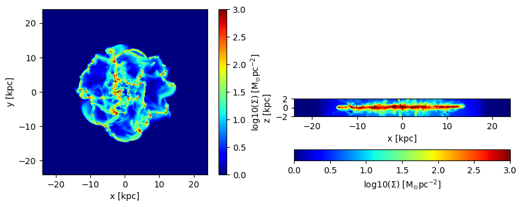
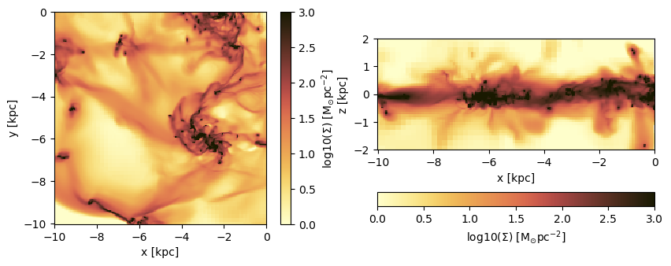
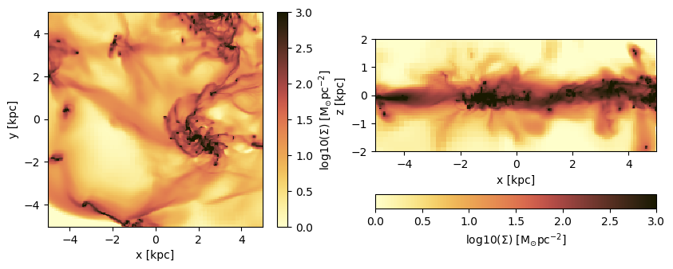
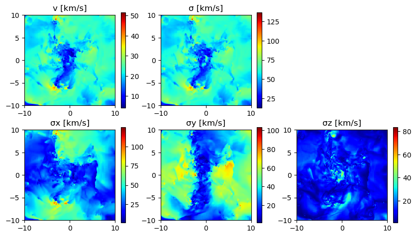
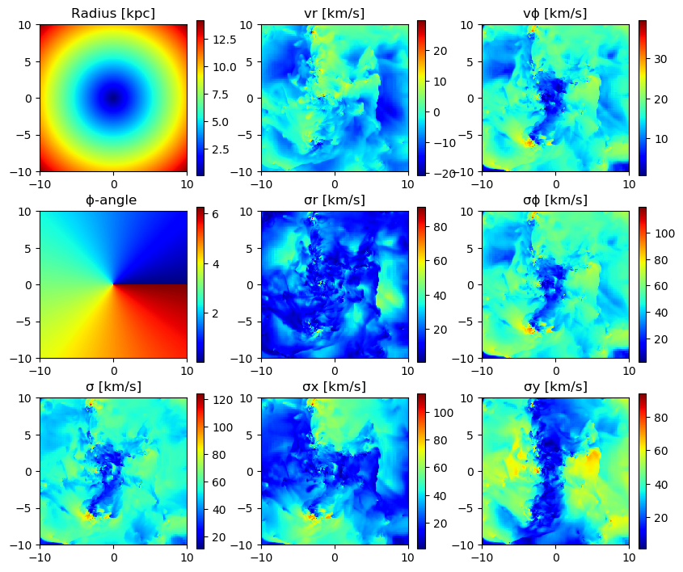
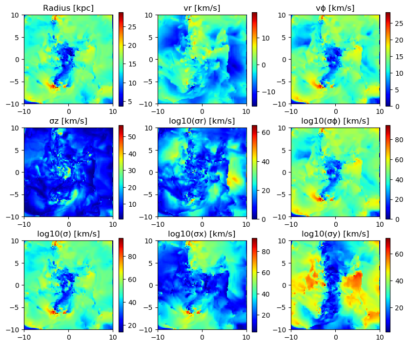
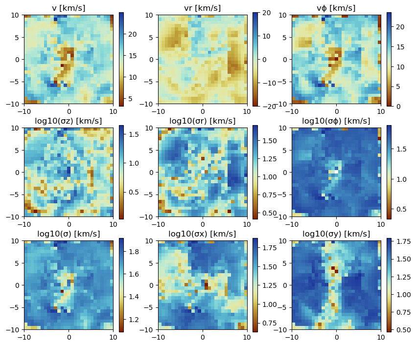
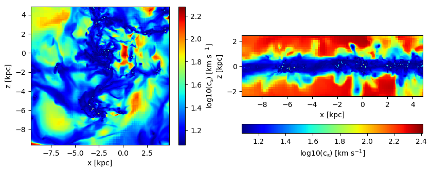
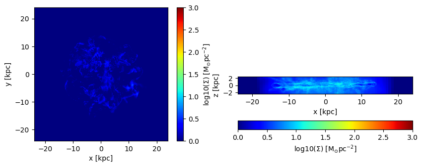

# 6. Hydro: Projections

## Load The Data


```julia
using Mera
info = getinfo(400, "../../testing/simulations/manu_sim_sf_L14");
gas  = gethydro(info, lmax=10, smallr=1e-5);
```

     [Mera]: 2020-02-12T20:11:29.898

    Code: RAMSES
    output [400] summary:
    mtime: 2018-09-05T09:51:55.041
    ctime: 2019-11-01T17:35:21.051
     =======================================================
    simulation time: 594.98 [Myr]
    boxlen: 48.0 [kpc]
    ncpu: 2048
    ndim: 3
    -------------------------------------------------------
    amr:           true
    level(s): 6 - 14 --> cellsize(s): 750.0 [pc] - 2.93 [pc]
    -------------------------------------------------------
    hydro:         true
    hydro-variables:  7  --> (:rho, :vx, :vy, :vz, :p, :var6, :var7)
    hydro-descriptor: (:density, :velocity_x, :velocity_y, :velocity_z, :thermal_pressure, :passive_scalar_1, :passive_scalar_2)
    γ: 1.6667
    -------------------------------------------------------
    gravity:       true
    gravity-variables: (:epot, :ax, :ay, :az)
    -------------------------------------------------------
    particles:     true
    - Npart:    5.091500e+05
    - Nstars:   5.066030e+05
    - Ndm:      2.547000e+03
    particle variables: (:vx, :vy, :vz, :mass, :birth)
    -------------------------------------------------------
    clumps:        true
    clump-variables: (:index, :lev, :parent, :ncell, :peak_x, :peak_y, :peak_z, Symbol("rho-"), Symbol("rho+"), :rho_av, :mass_cl, :relevance)
    -------------------------------------------------------
    namelist-file: false
    timer-file:       false
    compilation-file: true
    makefile:         true
    patchfile:        true
     =======================================================

     [Mera]: Get hydro data: 2020-02-12T20:11:31.804

    Key vars=(:level, :cx, :cy, :cz)
    Using var(s)=(1, 2, 3, 4, 5, 6, 7) = (:rho, :vx, :vy, :vz, :p, :var6, :var7)

    domain:
    xmin::xmax: 0.0 :: 1.0  	==> 0.0 [kpc] :: 48.0 [kpc]
    ymin::ymax: 0.0 :: 1.0  	==> 0.0 [kpc] :: 48.0 [kpc]
    zmin::zmax: 0.0 :: 1.0  	==> 0.0 [kpc] :: 48.0 [kpc]

    Reading data...


     100%|███████████████████████████████████████████████████| Time: 0:03:05


    Memory used for data table :409.5426664352417 MB
    -------------------------------------------------------


```julia
gas.data
```


    Table with 4879946 rows, 11 columns:
    Columns:
     #     colname    type
    ────────────────────
    1   level    Int64
    2   cx       Int64
    3   cy       Int64
    4   cz       Int64
    5   rho      Float64
    6   vx       Float64
    7   vy       Float64
    8   vz       Float64
    9   p        Float64
    10  var6     Float64
    11  var7     Float64


## Projection of Predefined Quantities

See the possible variables:


```julia
projection()
```

    Predefined vars for projections:
    ------------------------------------------------
    =====================[gas]:=====================
           -all the non derived hydro vars-
    :cpu, :level, :rho, :cx, :cy, :cz, :vx, :vy, :vz, :p, var6,...
    further possibilities: :rho, :density, :ρ
                  -derived hydro vars-
    :x, :y, :z
    :sd or :Σ or :surfacedensity
    :mass, :cellsize, :freefall_time
    :cs, :mach, :jeanslength, :jeansnumber

    ==================[particles]:==================
            all the non derived  vars:
    :cpu, :level, :id, :family, :tag
    :x, :y, :z, :vx, :vy, :vz, :mass, :birth, :metal....

                  -derived particle vars-
    :age

    ==============[gas or particles]:===============
    :v, :ekin
    squared => :vx2, :vy2, :vz2
    velocity dispersion => σx, σy, σz, σ

    related to a given center:
    ---------------------------
    :vr_cylinder, vr_sphere (radial components)
    :vϕ_cylinder, :vθ
    squared => :vr_cylinder2, :vϕ_cylinder2
    velocity dispersion => σr_cylinder, σϕ_cylinder

    2d maps (not projected):
    :r_cylinder
    :ϕ
    ------------------------------------------------


## Projection of a Single Quantity in Different Directions (z,y,x)

Here we project the surface density in the z-direction of the data within a particular vertical range (domain=[0:1]) onto a grid corresponding to the maximum loaded level.
Pass any object of `HydroDataType` (here: "gas") to the `projection`-function and select a variable by a Symbol (here: :sd = :surfacedensity = :Σ in Msol/pc^3)


```julia
proj_z = projection(gas, :sd, unit=:Msol_pc2, zrange=[0.45,0.55])
proj_z = projection(gas, :Σ,  unit=:Msol_pc2, zrange=[0.45,0.55], verbose=false)
proj_z = projection(gas, :surfacedensity, unit=:Msol_pc2, zrange=[0.45,0.55], verbose=false)
proj_z = projection(gas, :sd, :Msol_pc2, zrange=[0.45,0.55], verbose=false) # The keyword "unit" (singular) can be omit if the following order is preserved: data-object, quantity, unit.
proj_x = projection(gas, :sd, :Msol_pc2, direction = :x, zrange=[0.45,0.55], verbose=false); # Project the surface density in x-direction
```

     [Mera]: 2020-02-12T12:18:14.842

    domain:
    xmin::xmax: 0.0 :: 1.0  	==> 0.0 [kpc] :: 48.0 [kpc]
    ymin::ymax: 0.0 :: 1.0  	==> 0.0 [kpc] :: 48.0 [kpc]
    zmin::zmax: 0.45 :: 0.55  	==> 21.6 [kpc] :: 26.4 [kpc]

    Selected var(s)=(:sd,)


     100%|███████████████████████████████████████████████████| Time: 0:01:07
     100%|███████████████████████████████████████████████████| Time: 0:01:02
     100%|███████████████████████████████████████████████████| Time: 0:00:57
     100%|███████████████████████████████████████████████████| Time: 0:00:57
     100%|███████████████████████████████████████████████████| Time: 0:00:56


### Select a Range Related to a Center
See also in the documentation for: load data by selection


```julia
cv = (gas.boxlen / 2.) * gas.scale.kpc # provide the box-center in kpc
proj_z = projection(gas, :sd, :Msol_pc2,
                    xrange=[-10.,10.], yrange=[-10.,10.], zrange=[-2.,2.],
                    center=[cv,cv,cv], range_unit=:kpc);
```

     [Mera]: 2020-02-12T12:23:18.582

    center: [0.5, 0.5, 0.5] ==> [24.0 [kpc] :: 24.0 [kpc] :: 24.0 [kpc]]

    domain:
    xmin::xmax: 0.2916667 :: 0.7083333  	==> 14.0 [kpc] :: 34.0 [kpc]
    ymin::ymax: 0.2916667 :: 0.7083333  	==> 14.0 [kpc] :: 34.0 [kpc]
    zmin::zmax: 0.4583333 :: 0.5416667  	==> 22.0 [kpc] :: 26.0 [kpc]

    Selected var(s)=(:sd,)


     100%|███████████████████████████████████████████████████| Time: 0:00:55


Use the short notation for the box center :bc or :boxcenter for all dimensions (x,y,z):


```julia
proj_z = projection(gas, :sd, :Msol_pc2,  
                        xrange=[-10.,10.], yrange=[-10.,10.], zrange=[-2.,2.],
                        center=[:boxcenter], range_unit=:kpc);
```

     [Mera]: 2020-02-12T12:24:15.893

    center: [0.5, 0.5, 0.5] ==> [24.0 [kpc] :: 24.0 [kpc] :: 24.0 [kpc]]

    domain:
    xmin::xmax: 0.2916667 :: 0.7083333  	==> 14.0 [kpc] :: 34.0 [kpc]
    ymin::ymax: 0.2916667 :: 0.7083333  	==> 14.0 [kpc] :: 34.0 [kpc]
    zmin::zmax: 0.4583333 :: 0.5416667  	==> 22.0 [kpc] :: 26.0 [kpc]

    Selected var(s)=(:sd,)


     100%|███████████████████████████████████████████████████| Time: 0:00:53


```julia
proj_z = projection(gas, :sd, :Msol_pc2,  
                        xrange=[-10.,10.], yrange=[-10.,10.], zrange=[-2.,2.],
                        center=[:bc], range_unit=:kpc);
```

     [Mera]: 2020-02-12T12:25:09.001

    center: [0.5, 0.5, 0.5] ==> [24.0 [kpc] :: 24.0 [kpc] :: 24.0 [kpc]]

    domain:
    xmin::xmax: 0.2916667 :: 0.7083333  	==> 14.0 [kpc] :: 34.0 [kpc]
    ymin::ymax: 0.2916667 :: 0.7083333  	==> 14.0 [kpc] :: 34.0 [kpc]
    zmin::zmax: 0.4583333 :: 0.5416667  	==> 22.0 [kpc] :: 26.0 [kpc]

    Selected var(s)=(:sd,)


     100%|███████████████████████████████████████████████████| Time: 0:00:52


Use the box center notation for individual dimensions, here x,z:


```julia
proj_z = projection(gas, :sd, :Msol_pc2,  
                        xrange=[-10.,10.], yrange=[-10.,10.], zrange=[-2.,2.],
                        center=[:bc, 24., :bc], range_unit=:kpc);
```

     [Mera]: 2020-02-12T12:26:03.671

    center: [0.5, 0.5, 0.5] ==> [24.0 [kpc] :: 24.0 [kpc] :: 24.0 [kpc]]

    domain:
    xmin::xmax: 0.2916667 :: 0.7083333  	==> 14.0 [kpc] :: 34.0 [kpc]
    ymin::ymax: 0.2916667 :: 0.7083333  	==> 14.0 [kpc] :: 34.0 [kpc]
    zmin::zmax: 0.4583333 :: 0.5416667  	==> 22.0 [kpc] :: 26.0 [kpc]

    Selected var(s)=(:sd,)


     100%|███████████████████████████████████████████████████| Time: 0:00:53


### Get Multiple Quantities

Get several quantities with one function call by passing an array containing the selected variables (at least one entry). The keyword name for the units is now in plural.


```julia
proj1_x = projection(gas, [:sd], units=[:Msol_pc2],
                        direction = :x,
                        xrange=[-10.,10.],
                        yrange=[-10.,10.],
                        zrange=[-2.,2.],
                        center=[24.,24.,24.],
                        range_unit=:kpc);
```

     [Mera]: 2020-02-12T12:26:57.186

    center: [0.5, 0.5, 0.5] ==> [24.0 [kpc] :: 24.0 [kpc] :: 24.0 [kpc]]

    domain:
    xmin::xmax: 0.2916667 :: 0.7083333  	==> 14.0 [kpc] :: 34.0 [kpc]
    ymin::ymax: 0.2916667 :: 0.7083333  	==> 14.0 [kpc] :: 34.0 [kpc]
    zmin::zmax: 0.4583333 :: 0.5416667  	==> 22.0 [kpc] :: 26.0 [kpc]

    Selected var(s)=(:sd,)


     100%|███████████████████████████████████████████████████| Time: 0:00:53


Pass an array containing several quantities to process and their corresponding units:


```julia
proj1_z = projection(gas, [:sd, :vx], units=[:Msol_pc2, :km_s],
                        direction = :x,
                        xrange=[-10.,10.],
                        yrange=[-10.,10.],
                        zrange=[-2.,2.],
                        center=[24.,24.,24.],
                        range_unit=:kpc);
```

     [Mera]: 2020-02-12T12:27:50.658

    center: [0.5, 0.5, 0.5] ==> [24.0 [kpc] :: 24.0 [kpc] :: 24.0 [kpc]]

    domain:
    xmin::xmax: 0.2916667 :: 0.7083333  	==> 14.0 [kpc] :: 34.0 [kpc]
    ymin::ymax: 0.2916667 :: 0.7083333  	==> 14.0 [kpc] :: 34.0 [kpc]
    zmin::zmax: 0.4583333 :: 0.5416667  	==> 22.0 [kpc] :: 26.0 [kpc]

    Selected var(s)=(:sd, :vx)


     100%|███████████████████████████████████████████████████| Time: 0:00:59


The function can be called without any keywords by preserving the following order: dataobject, variables, units


```julia
proj1_z = projection(gas, [:sd , :vx], [:Msol_pc2, :km_s],
                        direction = :x,
                        xrange=[-10.,10.],
                        yrange=[-10.,10.],
                        zrange=[-2.,2.],
                        center=[24.,24.,24.],
                        range_unit=:kpc);
```

     [Mera]: 2020-02-12T12:28:49.928

    center: [0.5, 0.5, 0.5] ==> [24.0 [kpc] :: 24.0 [kpc] :: 24.0 [kpc]]

    domain:
    xmin::xmax: 0.2916667 :: 0.7083333  	==> 14.0 [kpc] :: 34.0 [kpc]
    ymin::ymax: 0.2916667 :: 0.7083333  	==> 14.0 [kpc] :: 34.0 [kpc]
    zmin::zmax: 0.4583333 :: 0.5416667  	==> 22.0 [kpc] :: 26.0 [kpc]

    Selected var(s)=(:sd, :vx)


     100%|███████████████████████████████████████████████████| Time: 0:00:56


If all selected variables should be of the same unit use the following arguments: dataobject, array of quantities, unit (no array needed)


```julia
projvel_z = projection(gas, [:vx, :vy, :vz], :km_s,
                        xrange=[-10.,10.],
                        yrange=[-10.,10.],
                        zrange=[-2.,2.],
                        center=[24.,24.,24.],
                        range_unit=:kpc);
```

     [Mera]: 2020-02-12T12:29:46.23

    center: [0.5, 0.5, 0.5] ==> [24.0 [kpc] :: 24.0 [kpc] :: 24.0 [kpc]]

    domain:
    xmin::xmax: 0.2916667 :: 0.7083333  	==> 14.0 [kpc] :: 34.0 [kpc]
    ymin::ymax: 0.2916667 :: 0.7083333  	==> 14.0 [kpc] :: 34.0 [kpc]
    zmin::zmax: 0.4583333 :: 0.5416667  	==> 22.0 [kpc] :: 26.0 [kpc]

    Selected var(s)=(:vx, :vy, :vz, :sd)


     100%|███████████████████████████████████████████████████| Time: 0:00:55


## Function Output

List the fields of the assigned object:


```julia
propertynames(proj1_z)
```


    (:maps, :maps_unit, :maps_lmax, :maps_mode, :lmax_projected, :lmin, :lmax, :ranges, :extent, :cextent, :ratio, :boxlen, :smallr, :smallc, :scale, :info)


The projected 2D maps are stored in a dictionary:


```julia
proj1_z.maps
```


    DataStructures.SortedDict{Any,Any,Base.Order.ForwardOrdering} with 2 entries:
      :sd => [2.42108 2.42108 … 3.06809 3.06809; 2.42108 2.42108 … 3.06809 3.06809;…
      :vx => [48.3311 48.3311 … 35.0161 35.0161; 48.3311 48.3311 … 35.0161 35.0161;…


The maps can be accessed by giving the name of the dictionary:


```julia
proj1_z.maps[:sd]
```


    428×86 Array{Float64,2}:
     2.42108  2.42108  2.42108  2.76423  …  3.80613  3.06809  3.06809  3.06809
     2.42108  2.42108  2.42108  2.76423     3.80613  3.06809  3.06809  3.06809
     2.43323  2.43323  2.43323  2.83905     3.77978  3.04769  3.04769  3.04769
     2.43323  2.43323  2.43323  2.83905     3.77978  3.04769  3.04769  3.04769
     2.43323  2.43323  2.43323  2.83612     3.77978  3.04769  3.04769  3.04769
     2.43323  2.43323  2.43323  2.83612  …  3.77978  3.04769  3.04769  3.04769
     2.61724  2.61724  2.61724  2.78421     3.38093  2.59978  2.59978  2.59978
     2.61724  2.61724  2.61724  2.78421     3.38093  2.59978  2.59978  2.59978
     2.61724  2.61724  2.61724  2.78048     3.38093  2.59978  2.59978  2.59978
     2.61724  2.61724  2.61724  2.78048     3.38093  2.59978  2.59978  2.59978
     2.65948  2.65948  2.65948  2.92033  …  3.26695  2.56391  2.56391  2.56391
     2.65948  2.65948  2.65948  2.92033     3.26695  2.56391  2.56391  2.56391
     2.65948  2.65948  2.65948  2.9154      3.26695  2.56391  2.56391  2.56391
     ⋮                                   ⋱                             ⋮      
     3.64783  3.62431  3.62431  3.69296     2.64986  2.58555  2.58555  2.58555
     3.64783  3.62431  3.62431  3.69296     2.64986  2.58555  2.58555  2.58555
     4.06584  4.06584  4.06584  4.25253     2.5403   2.54319  2.54319  2.54319
     4.06584  4.06584  4.06584  4.25253     2.5403   2.54319  2.54319  2.54319
     4.06584  4.06584  4.06584  4.36169  …  2.5403   2.54319  2.54319  2.54319
     4.06584  4.06584  4.06584  4.36169     2.5403   2.54319  2.54319  2.54319
     5.43946  5.43946  5.43946  5.56363     2.45995  2.45782  2.45782  2.45782
     5.43946  5.43946  5.43946  5.56363     2.45995  2.45782  2.45782  2.45782
     5.43946  5.43946  5.43946  5.39163     2.45995  2.45782  2.45782  2.45782
     5.43946  5.43946  5.43946  5.39163  …  2.45995  2.45782  2.45782  2.45782
     5.68876  5.68876  5.68876  5.8404      2.41942  2.43411  2.43411  2.43411
     5.68876  5.68876  5.68876  2.62535     2.41942  2.43411  2.43411  2.43411


The units of the maps are stored in:


```julia
proj1_z.maps_unit
```


    DataStructures.SortedDict{Any,Any,Base.Order.ForwardOrdering} with 2 entries:
      :sd => :Msol_pc2
      :vx => :km_s


Projections on a different grid size (see subject below):


```julia
proj1_z.maps_lmax
```


    DataStructures.SortedDict{Any,Any,Base.Order.ForwardOrdering} with 0 entries


The following fields are helpful for further calculations or plots.


```julia
proj1_z.ranges # normalized to the domain=[0:1]
```


    6-element Array{Float64,1}:
     0.29166666666647767
     0.7083333333328743
     0.29166666666647767
     0.7083333333328743
     0.4583333333330363
     0.5416666666663156


```julia
proj1_z.extent # ranges in code units
```


    4-element Array{Float64,1}:
     13.96875
     34.03125
     21.984375
     26.015625


```julia
proj1_z.cextent # ranges in code units relative to a given center (by default: box center)
```


    4-element Array{Float64,1}:
     -10.03125
      10.03125
      -2.015625
       2.015625


```julia
proj1_z.ratio # the ratio between the two ranges
```


    4.976744186046512


## Plot Maps with Python


```julia
proj_z = projection(gas, :sd, :Msol_pc2,
                    zrange=[-2.,2.], center=[:boxcenter], range_unit=:kpc,
                    verbose=false)
proj_x = projection(gas, :sd, :Msol_pc2,
                    zrange=[-2.,2.], center=[:boxcenter], range_unit=:kpc,
                    verbose=false,
                    direction = :x);
```

     100%|███████████████████████████████████████████████████| Time: 0:00:57
     100%|███████████████████████████████████████████████████| Time: 0:00:58


Python functions can be directly called in Julia, which gives the opportunity, e.g. to use the Matplotlib library.


```julia
using PyPlot
```


```julia
figure(figsize=(10, 3.5))
subplot(1,2,1)
im = imshow( log10.( permutedims(proj_z.maps[:sd])), cmap="jet", aspect=proj_z.ratio, origin="lower", extent=proj_z.cextent, vmin=0, vmax=3)
xlabel("x [kpc]")
ylabel("y [kpc]")
cb = colorbar(im, label=L"\mathrm{log10(\Sigma) \ [M_{\odot} pc^{-2}]}")

subplot(1,2,2)
im = imshow( log10.( permutedims(proj_x.maps[:sd])), cmap="jet", origin="lower", extent=proj_x.cextent, vmin=0, vmax=3)
xlabel("x [kpc]")
ylabel("z [kpc]")
cb = colorbar(im, label=L"\mathrm{log10(\Sigma) \ [M_{\odot} pc^{-2}]}",orientation="horizontal", pad=0.2);
```





Project a specific spatial range and plot the axes of the map relative to the box-center (given by keyword: data_center):


```julia
proj_z = projection(gas, :sd, :Msol_pc2,
                    xrange=[-10.,0.], yrange=[-10.,0.], zrange=[-2.,2.], center=[:boxcenter], range_unit=:kpc,
                    verbose=false,
                    data_center=[24.,24.,24.], data_center_unit=:kpc)
proj_x = projection(gas, :sd, :Msol_pc2,
                    xrange=[-10.,0.], yrange=[-10.,0.], zrange=[-2.,2.], center=[:boxcenter], range_unit=:kpc,
                    verbose=false,
                    data_center=[24.,24.,24.], data_center_unit=:kpc,
                    direction = :x);
```

     100%|███████████████████████████████████████████████████| Time: 0:00:50
     100%|███████████████████████████████████████████████████| Time: 0:00:50


```julia
figure(figsize=(10, 3.5))
subplot(1,2,1)
im = imshow( log10.( permutedims(proj_z.maps[:sd])), cmap="jet", aspect=proj_z.ratio, origin="lower", extent=proj_z.cextent, vmin=0, vmax=3)
xlabel("x [kpc]")
ylabel("y [kpc]")
cb = colorbar(im, label=L"\mathrm{log10(\Sigma) \ [M_{\odot} pc^{-2}]}")

subplot(1,2,2)
im = imshow( log10.( permutedims(proj_x.maps[:sd])), cmap="jet", origin="lower", extent=proj_x.cextent, vmin=0, vmax=3)
xlabel("x [kpc]")
ylabel("z [kpc]")
cb = colorbar(im, label=L"\mathrm{log10(\Sigma) \ [M_{\odot} pc^{-2}]}",orientation="horizontal", pad=0.2);
```





Plot the axes of the map relative to the map-center (given by keyword: data_center):


```julia
proj_z = projection(gas, :sd, :Msol_pc2,
                    xrange=[-10.,0.], yrange=[-10.,0.], zrange=[-2.,2.], center=[:boxcenter], range_unit=:kpc,
                    verbose=false,
                    data_center=[19.,19.,24.], data_center_unit=:kpc)
proj_x = projection(gas, :sd, :Msol_pc2,
                    xrange=[-10.,0.], yrange=[-10.,0.], zrange=[-2.,2.], center=[:boxcenter], range_unit=:kpc,
                    verbose=false,
                    data_center=[19.,19.,24.], data_center_unit=:kpc,
                    direction = :x);
```

     100%|███████████████████████████████████████████████████| Time: 0:00:52
     100%|███████████████████████████████████████████████████| Time: 0:00:49


```julia
figure(figsize=(10, 3.5))
subplot(1,2,1)
im = imshow( log10.( permutedims(proj_z.maps[:sd])), cmap="jet", aspect=proj_z.ratio, origin="lower", extent=proj_z.cextent, vmin=0, vmax=3)
xlabel("x [kpc]")
ylabel("y [kpc]")
cb = colorbar(im, label=L"\mathrm{log10(\Sigma) \ [M_{\odot} pc^{-2}]}")

subplot(1,2,2)
im = imshow( log10.( permutedims(proj_x.maps[:sd])), cmap="jet", origin="lower", extent=proj_x.cextent, vmin=0, vmax=3)
xlabel("x [kpc]")
ylabel("z [kpc]")
cb = colorbar(im, label=L"\mathrm{log10(\Sigma) \ [M_{\odot} pc^{-2}]}",orientation="horizontal", pad=0.2);
```





## Projections of Derived Kinematic Data

#### Use quantities in cartesian coordinates:

Project the following derived data
(mass weighted by default): The absolute value of the velocity :v, the velocity dispersion :σ in different directions. The Julia language supports Unicode characters and can be inserted by e.g. "\sigma + tab-key" leading to: **σ**.


```julia
proj_z = projection(gas, [:v, :σ, :σx, :σy, :σz], :km_s,
                    xrange=[-10.,10.], yrange=[-10.,10.], zrange=[-2.,2.],
                    center=[24.,24.,24.], range_unit=:kpc);
```

     [Mera]: 2020-02-12T19:57:41.744

    center: [0.5, 0.5, 0.5] ==> [24.0 [kpc] :: 24.0 [kpc] :: 24.0 [kpc]]

    domain:
    xmin::xmax: 0.2916667 :: 0.7083333  	==> 14.0 [kpc] :: 34.0 [kpc]
    ymin::ymax: 0.2916667 :: 0.7083333  	==> 14.0 [kpc] :: 34.0 [kpc]
    zmin::zmax: 0.4583333 :: 0.5416667  	==> 22.0 [kpc] :: 26.0 [kpc]

    Selected var(s)=(:v, :σ, :σx, :σy, :σz, :vx, :vx2, :vy, :vy2, :vz, :vz2, :v2, :sd)


     100%|███████████████████████████████████████████████████| Time: 0:01:09


For the velocity dispersion additional maps are created to created the mass-weighted quantity:
E. g.: σx = sqrt( <vx^2> - < vx >^2 )


```julia
proj_z.maps
```


    DataStructures.SortedDict{Any,Any,Base.Order.ForwardOrdering} with 13 entries:
      :sd  => [0.000525384 0.000525384 … 0.000463458 0.000334485; 0.000525384 0.000…
      :v   => [10.9033 10.9033 … 9.28165 8.34605; 10.9033 10.9033 … 9.28165 8.34605…
      :v2  => [0.245404 0.245404 … 0.193833 0.163449; 0.245404 0.245404 … 0.193833 …
      :vx  => [0.11951 0.11951 … -0.0700017 -0.0384127; 0.11951 0.11951 … -0.070001…
      :vx2 => [0.122347 0.122347 … 0.111339 0.0775909; 0.122347 0.122347 … 0.111339…
      :vy  => [0.0445661 0.0445661 … -0.00514768 -0.00554146; 0.0445661 0.0445661 ……
      :vy2 => [0.0331066 0.0331066 … 0.019046 0.018845; 0.0331066 0.0331066 … 0.019…
      :vz  => [-0.0999134 -0.0999134 … -0.0370643 -0.024236; -0.0999134 -0.0999134 …
      :vz2 => [0.0899502 0.0899502 … 0.0634475 0.0670127; 0.0899502 0.0899502 … 0.0…
      :σ   => [30.6004 30.6004 … 27.3378 25.1633; 30.6004 30.6004 … 27.3378 25.1633…
      :σx  => [21.5567 21.5567 … 21.3939 18.0916; 21.5567 21.5567 … 21.3939 18.0916…
      :σy  => [11.5681 11.5681 … 9.04357 8.99465; 11.5681 11.5681 … 9.04357 8.99465…
      :σz  => [18.5437 18.5437 … 16.3378 16.9008; 18.5437 18.5437 … 16.3378 16.9008…


```julia
proj_z.maps_unit
```


    DataStructures.SortedDict{Any,Any,Base.Order.ForwardOrdering} with 13 entries:
      :sd  => :standard
      :v   => :km_s
      :v2  => :standard
      :vx  => :standard
      :vx2 => :standard
      :vy  => :standard
      :vy2 => :standard
      :vz  => :standard
      :vz2 => :standard
      :σ   => :km_s
      :σx  => :km_s
      :σy  => :km_s
      :σz  => :km_s


```julia
usedmemory(proj_z);
```

    Memory used: 18.436 MB


```julia
figure(figsize=(10, 5.5))

subplot(2, 3, 1)
title("v [km/s]")
imshow( (permutedims(proj_z.maps[:v])  ), cmap="jet", origin="lower", extent=proj_z.cextent)
colorbar()


subplot(2, 3, 2)
title("σ [km/s]")
imshow( (permutedims(proj_z.maps[:σ])  ), cmap="jet", origin="lower", extent=proj_z.cextent)
colorbar()


subplot(2, 3, 4)
title("σx [km/s]")
imshow( (permutedims(proj_z.maps[:σx])   ), cmap="jet", origin="lower", extent=proj_z.cextent)
colorbar()


subplot(2, 3, 5)
title("σy [km/s]")
imshow( permutedims(proj_z.maps[:σy]) , cmap="jet", origin="lower", extent=proj_z.cextent)
colorbar()


subplot(2, 3, 6)
title("σz [km/s]")
imshow( permutedims(proj_z.maps[:σz]) , cmap="jet", origin="lower", extent=proj_z.cextent)
colorbar();

```





#### Use quantities in cylindrical coordinates:
#### Face-on disc (z-direction)
For the cylindrical or spherical components of a quantity, the center of the coordinate system is used (keywords: data_center = center default) and can be given with the keyword "data_center" and its units with "data_center_unit". Additionally, the quantities that are based on cartesian coordinates can be given.


```julia
proj_z = projection(gas, [:v, :σ, :σx, :σy, :ϕ, :r_cylinder, :vr_cylinder, :vϕ_cylinder, :σr_cylinder, :σϕ_cylinder],                    
                    units=[:km_s,:km_s,:km_s, :km_s, :standard, :kpc, :km_s, :km_s, :km_s, :km_s],
                    xrange=[-10.,10.], yrange=[-10.,10.], zrange=[-2.,2.],
                    center=[:boxcenter], range_unit=:kpc,
                    data_center=[24.,24.,24.],
                    data_center_unit=:kpc);
```

     [Mera]: 2020-02-12T19:59:04.806

    center: [0.5, 0.5, 0.5] ==> [24.0 [kpc] :: 24.0 [kpc] :: 24.0 [kpc]]

    domain:
    xmin::xmax: 0.2916667 :: 0.7083333  	==> 14.0 [kpc] :: 34.0 [kpc]
    ymin::ymax: 0.2916667 :: 0.7083333  	==> 14.0 [kpc] :: 34.0 [kpc]
    zmin::zmax: 0.4583333 :: 0.5416667  	==> 22.0 [kpc] :: 26.0 [kpc]

    Selected var(s)=(:v, :σ, :σx, :σy, :ϕ, :r_cylinder, :vr_cylinder, :vϕ_cylinder, :σr_cylinder, :σϕ_cylinder, :vx, :vx2, :vy, :vy2, :v2, :vr_cylinder2, :vϕ_cylinder2, :sd)


     100%|███████████████████████████████████████████████████| Time: 0:01:13


```julia
proj_z.maps
```


    DataStructures.SortedDict{Any,Any,Base.Order.ForwardOrdering} with 18 entries:
      :r_cylinder   => [14.0758 14.0427 … 14.1201 14.1534; 14.0427 14.0096 … 14.087…
      :sd           => [0.000525384 0.000525384 … 0.000463458 0.000334485; 0.000525…
      :v            => [8.72263 8.72263 … 7.42532 6.67684; 8.72263 8.72263 … 7.4253…
      :v2           => [0.196323 0.196323 … 0.155066 0.130759; 0.196323 0.196323 … …
      :vr_cylinder  => [-6.0864 -6.0864 … 2.38666 1.2034; -6.0864 -6.0864 … 2.38666…
      :vr_cylinder2 => [0.105049 0.105049 … 0.0620751 0.0537682; 0.105049 0.105049 …
      :vx           => [0.0956079 0.0956079 … -0.0560013 -0.0307302; 0.0956079 0.09…
      :vx2          => [0.097878 0.097878 … 0.0890713 0.0620727; 0.097878 0.097878 …
      :vy           => [0.0356529 0.0356529 … -0.00411814 -0.00443317; 0.0356529 0.…
      :vy2          => [0.0264853 0.0264853 … 0.0152368 0.015076; 0.0264853 0.02648…
      :vϕ_cylinder  => [2.78004 2.78004 … 3.22947 2.23274; 2.78004 2.78004 … 3.2294…
      :vϕ_cylinder2 => [0.0193141 0.0193141 … 0.042233 0.0233806; 0.0193141 0.01931…
      :σ            => [27.7151 27.7151 … 24.7319 22.753; 27.7151 27.7151 … 24.7319…
      :σr_cylinder  => [20.3637 20.3637 … 16.1627 15.1579; 20.3637 20.3637 … 16.162…
      :σx           => [19.5341 19.5341 … 19.2232 16.2129; 19.5341 19.5341 … 19.223…
      :σy           => [10.4127 10.4127 … 8.08995 8.04638; 10.4127 10.4127 … 8.0899…
      :σϕ_cylinder  => [8.67895 8.67895 … 13.0835 9.77518; 8.67895 8.67895 … 13.083…
      :ϕ            => [3.92699 3.92463 … 2.35306 2.35073; 3.92935 3.92699 … 2.3507…


```julia
proj_z.maps_unit
```


    DataStructures.SortedDict{Any,Any,Base.Order.ForwardOrdering} with 18 entries:
      :r_cylinder   => :kpc
      :sd           => :standard
      :v            => :km_s
      :v2           => :standard
      :vr_cylinder  => :km_s
      :vr_cylinder2 => :standard
      :vx           => :standard
      :vx2          => :standard
      :vy           => :standard
      :vy2          => :standard
      :vϕ_cylinder  => :km_s
      :vϕ_cylinder2 => :standard
      :σ            => :km_s
      :σr_cylinder  => :km_s
      :σx           => :km_s
      :σy           => :km_s
      :σϕ_cylinder  => :km_s
      :ϕ            => :radian


```julia
figure(figsize=(10, 8.5))

subplot(3, 3, 1)
title("Radius [kpc]")
imshow( permutedims(proj_z.maps[:r_cylinder]  ), cmap="jet", origin="lower", extent=proj_z.cextent)
colorbar()


subplot(3, 3, 2)
title("vr [km/s]")
imshow( permutedims(proj_z.maps[:vr_cylinder] ), cmap="jet", origin="lower", extent=proj_z.cextent)
colorbar()


subplot(3, 3, 3)
title("vϕ [km/s]")
imshow( permutedims(proj_z.maps[:vϕ_cylinder]  ), cmap="jet", origin="lower", extent=proj_z.cextent)
colorbar()


subplot(3, 3, 4)
title("ϕ-angle ")
imshow( permutedims(proj_z.maps[:ϕ]) , cmap="jet", origin="lower", extent=proj_z.cextent)
colorbar()


subplot(3, 3, 5)
title("σr [km/s]")
imshow( permutedims(proj_z.maps[:σr_cylinder]  ), cmap="jet", origin="lower", extent=proj_z.cextent)
colorbar()


subplot(3, 3, 6)
title("σϕ [km/s]")
imshow( permutedims(proj_z.maps[:σϕ_cylinder] ), cmap="jet", origin="lower", extent=proj_z.cextent)
colorbar()


subplot(3, 3, 7)
title("σ [km/s]")
imshow( permutedims(proj_z.maps[:σ]) , cmap="jet", origin="lower", extent=proj_z.cextent)
colorbar()


subplot(3, 3, 8)
title("σx [km/s]")
imshow( permutedims(proj_z.maps[:σx] ), cmap="jet", origin="lower", extent=proj_z.cextent)
colorbar()


subplot(3, 3, 9)
title("σy [km/s]")
imshow( permutedims(proj_z.maps[:σy] ), cmap="jet", origin="lower", extent=proj_z.cextent)
colorbar();
```





## Project on a Coarser Grid

The default is the projection on the maximum loaded grid level (always provided in the output). Choose a smaller level with the keyword `lmax` to project on a coarser grid in addition. Higher-resolution data is averaged within each coarser grid-cell (default: mass-weighted). By default, the data is assumed to be in the center of the simulation box.


```julia
proj_z = projection(gas, [:v, :σ, :σx, :σy, :σz, :vr_cylinder, :vϕ_cylinder, :σr_cylinder, :σϕ_cylinder],
                    :km_s,
                    xrange=[-10.,10.], yrange=[-10.,10.], zrange=[-2.,2.],
                    center=[:boxcenter], range_unit=:kpc,
                    lmax=8);
```

     [Mera]: 2020-02-12T15:43:52.006

    center: [0.5, 0.5, 0.5] ==> [24.0 [kpc] :: 24.0 [kpc] :: 24.0 [kpc]]

    domain:
    xmin::xmax: 0.2916667 :: 0.7083333  	==> 14.0 [kpc] :: 34.0 [kpc]
    ymin::ymax: 0.2916667 :: 0.7083333  	==> 14.0 [kpc] :: 34.0 [kpc]
    zmin::zmax: 0.4583333 :: 0.5416667  	==> 22.0 [kpc] :: 26.0 [kpc]

    Selected var(s)=(:v, :σ, :σx, :σy, :σz, :vr_cylinder, :vϕ_cylinder, :σr_cylinder, :σϕ_cylinder, :vx, :vx2, :vy, :vy2, :vz, :vz2, :v2, :vr_cylinder2, :vϕ_cylinder2, :sd)


     100%|███████████████████████████████████████████████████| Time: 0:01:10


    remap from:
    level 10 => 8
    cellsize 46.88 [pc] => 187.5 [pc]
    pixels (428, 428) => (107, 107)


The projection onto the maximum loaded grid is always provided:


```julia
proj_z.maps_lmax
```


    DataStructures.SortedDict{Any,Any,Base.Order.ForwardOrdering} with 19 entries:
      :sd           => [0.000525384 0.000545269 … 0.000475553 0.000334485; 0.000532…
      :v            => [7.26886 7.32994 … 7.73366 5.56403; 7.30578 7.37137 … 8.9885…
      :v2           => [0.163603 0.166415 … 0.210983 0.108966; 0.166587 0.168972 … …
      :vr_cylinder  => [-5.072 -4.65663 … 2.60367 1.00283; -5.02593 -4.4874 … 2.140…
      :vr_cylinder2 => [0.0875409 0.0826628 … 0.0646939 0.0448068; 0.0884293 0.0811…
      :vx           => [0.0796732 0.0788819 … -0.0691436 -0.0256085; 0.0809557 0.07…
      :vx2          => [0.081565 0.0804544 … 0.136752 0.0517273; 0.0845953 0.082583…
      :vy           => [0.0297108 0.0211165 … -0.0132175 -0.0036943; 0.0278214 0.01…
      :vy2          => [0.022071 0.0251372 … 0.0168816 0.0125634; 0.0229327 0.02711…
      :vz           => [-0.0666089 -0.0671458 … -0.0188721 -0.0161574; -0.0657326 -…
      :vz2          => [0.0599668 0.0608235 … 0.0573498 0.0446751; 0.0590593 0.0592…
      :vϕ_cylinder  => [2.3167 2.65081 … 3.9351 1.86062; 2.49477 2.91954 … 5.93535 …
      :vϕ_cylinder2 => [0.0160951 0.0229288 … 0.0889397 0.0194838; 0.0190986 0.0284…
      :σ            => [25.5083 25.727 … 29.1109 20.9191; 25.7482 25.928 … 33.7281 …
      :σr_cylinder  => [18.7273 18.2695 … 16.4746 13.8445; 18.8414 18.1389 … 13.727…
      :σx           => [17.9845 17.8664 … 23.8221 14.8194; 18.319 18.1022 … 25.8056…
      :σy           => [9.54527 10.3042 … 8.47594 7.3461; 9.7614 10.7401 … 15.0491 …
      :σz           => [15.4527 15.5615 … 15.655 13.8198; 15.3422 15.3681 … 16.8782…
      :σϕ_cylinder  => [7.99022 9.56921 … 19.1564 8.96219; 8.7122 10.678 … 26.5011 …


```julia
proj_z.maps_unit
```


    DataStructures.SortedDict{Any,Any,Base.Order.ForwardOrdering} with 19 entries:
      :sd           => :standard
      :v            => :km_s
      :v2           => :standard
      :vr_cylinder  => :km_s
      :vr_cylinder2 => :standard
      :vx           => :standard
      :vx2          => :standard
      :vy           => :standard
      :vy2          => :standard
      :vz           => :standard
      :vz2          => :standard
      :vϕ_cylinder  => :km_s
      :vϕ_cylinder2 => :standard
      :σ            => :km_s
      :σr_cylinder  => :km_s
      :σx           => :km_s
      :σy           => :km_s
      :σz           => :km_s
      :σϕ_cylinder  => :km_s


The projection onto a coarser grid (fieldname: `maps_lmax`) is stored in a dictionary into the field `maps_lmax`:


```julia
proj_z.lmax_projected
```


    8


```julia
proj_z.maps_lmax
```


    DataStructures.SortedDict{Any,Any,Base.Order.ForwardOrdering} with 19 entries:
      :sd           => [0.000525384 0.000545269 … 0.000475553 0.000334485; 0.000532…
      :v            => [7.26886 7.32994 … 7.73366 5.56403; 7.30578 7.37137 … 8.9885…
      :v2           => [0.163603 0.166415 … 0.210983 0.108966; 0.166587 0.168972 … …
      :vr_cylinder  => [-5.072 -4.65663 … 2.60367 1.00283; -5.02593 -4.4874 … 2.140…
      :vr_cylinder2 => [0.0875409 0.0826628 … 0.0646939 0.0448068; 0.0884293 0.0811…
      :vx           => [0.0796732 0.0788819 … -0.0691436 -0.0256085; 0.0809557 0.07…
      :vx2          => [0.081565 0.0804544 … 0.136752 0.0517273; 0.0845953 0.082583…
      :vy           => [0.0297108 0.0211165 … -0.0132175 -0.0036943; 0.0278214 0.01…
      :vy2          => [0.022071 0.0251372 … 0.0168816 0.0125634; 0.0229327 0.02711…
      :vz           => [-0.0666089 -0.0671458 … -0.0188721 -0.0161574; -0.0657326 -…
      :vz2          => [0.0599668 0.0608235 … 0.0573498 0.0446751; 0.0590593 0.0592…
      :vϕ_cylinder  => [2.3167 2.65081 … 3.9351 1.86062; 2.49477 2.91954 … 5.93535 …
      :vϕ_cylinder2 => [0.0160951 0.0229288 … 0.0889397 0.0194838; 0.0190986 0.0284…
      :σ            => [25.5083 25.727 … 29.1109 20.9191; 25.7482 25.928 … 33.7281 …
      :σr_cylinder  => [18.7273 18.2695 … 16.4746 13.8445; 18.8414 18.1389 … 13.727…
      :σx           => [17.9845 17.8664 … 23.8221 14.8194; 18.319 18.1022 … 25.8056…
      :σy           => [9.54527 10.3042 … 8.47594 7.3461; 9.7614 10.7401 … 15.0491 …
      :σz           => [15.4527 15.5615 … 15.655 13.8198; 15.3422 15.3681 … 16.8782…
      :σϕ_cylinder  => [7.99022 9.56921 … 19.1564 8.96219; 8.7122 10.678 … 26.5011 …


```julia
figure(figsize=(10, 8.5))

subplot(3, 3, 1)
title("Radius [kpc]")
imshow( permutedims(proj_z.maps_lmax[:v]  ), cmap="jet", origin="lower", extent=proj_z.cextent)
colorbar()


subplot(3, 3, 2)
title("vr [km/s]")
imshow( permutedims(proj_z.maps_lmax[:vr_cylinder] ), cmap="jet", origin="lower", extent=proj_z.cextent)
colorbar()


subplot(3, 3, 3)
title("vϕ [km/s]")
imshow( permutedims(proj_z.maps_lmax[:vϕ_cylinder]  ), cmap="jet", origin="lower", extent=proj_z.cextent)
colorbar()


subplot(3, 3, 4)
title("σz [km/s]")
imshow( (permutedims(proj_z.maps_lmax[:σz]) ), cmap="jet", origin="lower", extent=proj_z.cextent)
colorbar()


subplot(3, 3, 5)
title("σr [km/s]")
imshow( permutedims(proj_z.maps_lmax[:σr_cylinder]  ), cmap="jet", origin="lower", extent=proj_z.cextent)
colorbar()


subplot(3, 3, 6)
title("σϕ [km/s]")
imshow( permutedims(proj_z.maps_lmax[:σϕ_cylinder] ), cmap="jet", origin="lower", extent=proj_z.cextent)
colorbar()


subplot(3, 3, 7)
title("σ [km/s]")
imshow( permutedims(proj_z.maps_lmax[:σ]) , cmap="jet", origin="lower", extent=proj_z.cextent)
colorbar()


subplot(3, 3, 8)
title("σx [km/s]")
imshow( permutedims(proj_z.maps_lmax[:σx]  ), cmap="jet", origin="lower", extent=proj_z.cextent)
colorbar()


subplot(3, 3, 9)
title("σy [km/s]")
imshow( permutedims(proj_z.maps_lmax[:σy] ), cmap="jet", origin="lower", extent=proj_z.cextent)
colorbar();
```





## Remap a Projected Data onto a Coarser Grid

Pass the object with the projected data to the function `remap` and the level of the coarser grid:


```julia
proj_zlmax = remap(proj_z, 6, weighting=:mass);
```


    remap from:
    level 10 => 6
    cellsize 46.88 [pc] => 750.0 [pc]
    pixels (428, 428) => (27, 27)


```julia
figure(figsize=(10, 8.5))

subplot(3, 3, 1)
title("Radius [kpc]")
imshow( permutedims(proj_zlmax.maps_lmax[:v]  ), cmap="jet", origin="lower", extent=proj_zlmax.cextent)
colorbar()


subplot(3, 3, 2)
title("vr [km/s]")
imshow( permutedims(proj_zlmax.maps_lmax[:vr_cylinder] ), cmap="jet", origin="lower", extent=proj_zlmax.cextent)
colorbar()


subplot(3, 3, 3)
title("vϕ [km/s]")
imshow( permutedims(proj_zlmax.maps_lmax[:vϕ_cylinder]  ), cmap="jet", origin="lower", extent=proj_zlmax.cextent)
colorbar()


subplot(3, 3, 4)
title("log10(σz) [km/s]")
imshow( log10.(permutedims(proj_zlmax.maps_lmax[:σz]) ), cmap="jet", origin="lower", extent=proj_zlmax.cextent)
colorbar()


subplot(3, 3, 5)
title("log10(σr) [km/s]")
imshow( log10.(permutedims(proj_zlmax.maps_lmax[:σr_cylinder]  )), cmap="jet", origin="lower", extent=proj_zlmax.cextent)
colorbar()


subplot(3, 3, 6)
title("log10(σϕ) [km/s]")
imshow( log10.(permutedims(proj_zlmax.maps_lmax[:σϕ_cylinder] )), cmap="jet", origin="lower", extent=proj_zlmax.cextent)
colorbar()


subplot(3, 3, 7)
title("log10(σ) [km/s]")
imshow( log10.(permutedims(proj_zlmax.maps_lmax[:σ]) ), cmap="jet", origin="lower", extent=proj_zlmax.cextent)
colorbar()


subplot(3, 3, 8)
title("log10(σx) [km/s]")
imshow( log10.(permutedims(proj_zlmax.maps_lmax[:σx]  )), cmap="jet", origin="lower", extent=proj_zlmax.cextent)
colorbar()


subplot(3, 3, 9)
title("log10(σy) [km/s]")
imshow( log10.(permutedims(proj_zlmax.maps_lmax[:σy] )), cmap="jet", origin="lower", extent=proj_zlmax.cextent)
colorbar();
```





## Projection of Thermal Data

The the sound speed is calculated from the loaded adiabatic index (from the hydro files):


```julia
proj_z = projection(gas, :cs, :km_s, zrange=[0.45,0.55], xrange=[0.3, 0.6], yrange=[0.3, 0.6])
proj_x = projection(gas, :cs, :km_s, zrange=[0.45,0.55], xrange=[0.3, 0.6], yrange=[0.3, 0.6], direction=:x);
```

     [Mera]: 2020-02-12T12:40:08.958

    domain:
    xmin::xmax: 0.3 :: 0.6  	==> 14.4 [kpc] :: 28.8 [kpc]
    ymin::ymax: 0.3 :: 0.6  	==> 14.4 [kpc] :: 28.8 [kpc]
    zmin::zmax: 0.45 :: 0.55  	==> 21.6 [kpc] :: 26.4 [kpc]

    Selected var(s)=(:cs, :sd)


     100%|███████████████████████████████████████████████████| Time: 0:00:54


     [Mera]: 2020-02-12T12:41:03.584

    domain:
    xmin::xmax: 0.3 :: 0.6  	==> 14.4 [kpc] :: 28.8 [kpc]
    ymin::ymax: 0.3 :: 0.6  	==> 14.4 [kpc] :: 28.8 [kpc]
    zmin::zmax: 0.45 :: 0.55  	==> 21.6 [kpc] :: 26.4 [kpc]

    Selected var(s)=(:cs, :sd)


     100%|███████████████████████████████████████████████████| Time: 0:00:52


```julia
figure(figsize=(10, 3.5))

subplot(1, 2, 1)
im = imshow( log10.(permutedims(proj_z.maps[:cs])   ), cmap="jet", origin="lower", extent=proj_z.cextent)
xlabel("x [kpc]")
ylabel("z [kpc]")
cb = colorbar(im, label=L"\mathrm{log10(c_s) \ [km \ s^{-1}]}")


subplot(1, 2, 2)
im = imshow( log10.(permutedims(proj_x.maps[:cs]) ), cmap="jet", origin="lower", extent=proj_x.cextent)
xlabel("x [kpc]")
ylabel("z [kpc]")
cb = colorbar(im, label=L"\mathrm{log10(c_s) \ [km \ s^{-1}]}",orientation="horizontal", pad=0.2);

```





Change the adiabatic index in the field `gas.info.gamma` to use a different value in the projection calculation.

## Projection of Masked Data

Mask higher densities by creating a Bool-array where the lower density cells correspond to false entries:


```julia
density = 2e-3 / gas.scale.Msol_pc3
mask = map(row->row.rho < density, gas.data);
```

Pass the mask to the projection function:


```julia
proj_z = projection(gas, :sd, :Msol_pc2, zrange=[0.45,0.55], mask=mask)
proj_x = projection(gas, :sd, :Msol_pc2, zrange=[0.45,0.55], mask=mask, direction=:x);
```

     [Mera]: 2020-02-12T12:42:06.938

    domain:
    xmin::xmax: 0.0 :: 1.0  	==> 0.0 [kpc] :: 48.0 [kpc]
    ymin::ymax: 0.0 :: 1.0  	==> 0.0 [kpc] :: 48.0 [kpc]
    zmin::zmax: 0.45 :: 0.55  	==> 21.6 [kpc] :: 26.4 [kpc]

    Selected var(s)=(:sd,)

    :mask provided by function


     100%|███████████████████████████████████████████████████| Time: 0:01:44


     [Mera]: 2020-02-12T12:43:53.735 

    domain:
    xmin::xmax: 0.0 :: 1.0  	==> 0.0 [kpc] :: 48.0 [kpc]
    ymin::ymax: 0.0 :: 1.0  	==> 0.0 [kpc] :: 48.0 [kpc]
    zmin::zmax: 0.45 :: 0.55  	==> 21.6 [kpc] :: 26.4 [kpc]

    Selected var(s)=(:sd,)

    :mask provided by function


     100%|███████████████████████████████████████████████████| Time: 0:01:43


```julia
figure(figsize=(10, 3.5))
subplot(1,2,1)
im = imshow( log10.( permutedims(proj_z.maps[:sd])), cmap="jet", aspect=proj_z.ratio, origin="lower", extent=proj_z.cextent, vmin=0, vmax=3)
xlabel("x [kpc]")
ylabel("y [kpc]")
cb = colorbar(im, label=L"\mathrm{log10(\Sigma) \ [M_{\odot} pc^{-2}]}")

subplot(1,2,2)
im = imshow( log10.( permutedims(proj_x.maps[:sd])), cmap="jet", origin="lower", extent=proj_x.cextent, vmin=0, vmax=3)
xlabel("x [kpc]")
ylabel("z [kpc]")
cb = colorbar(im, label=L"\mathrm{log10(\Sigma) \ [M_{\odot} pc^{-2}]}",orientation="horizontal", pad=0.2);
```



