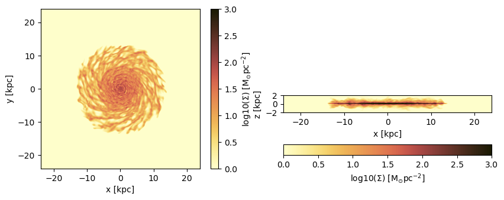
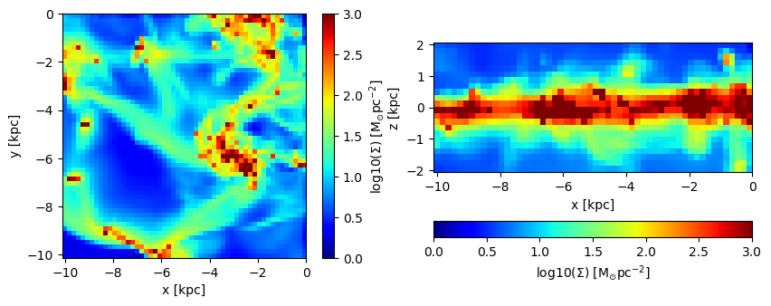
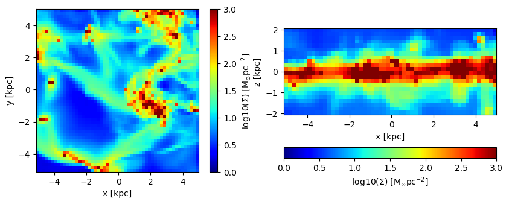
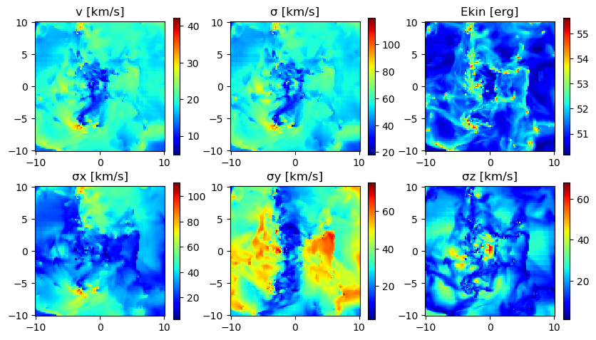
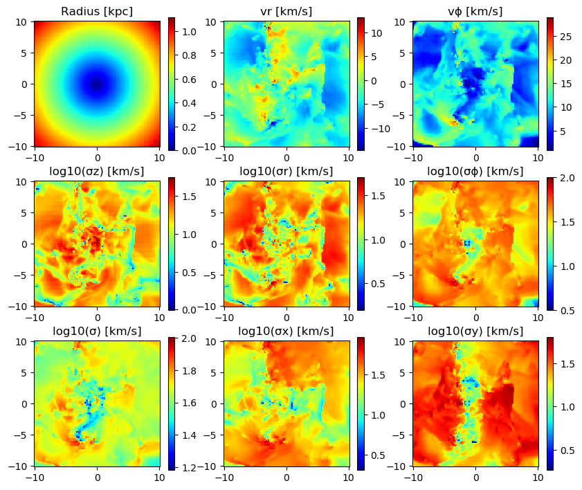
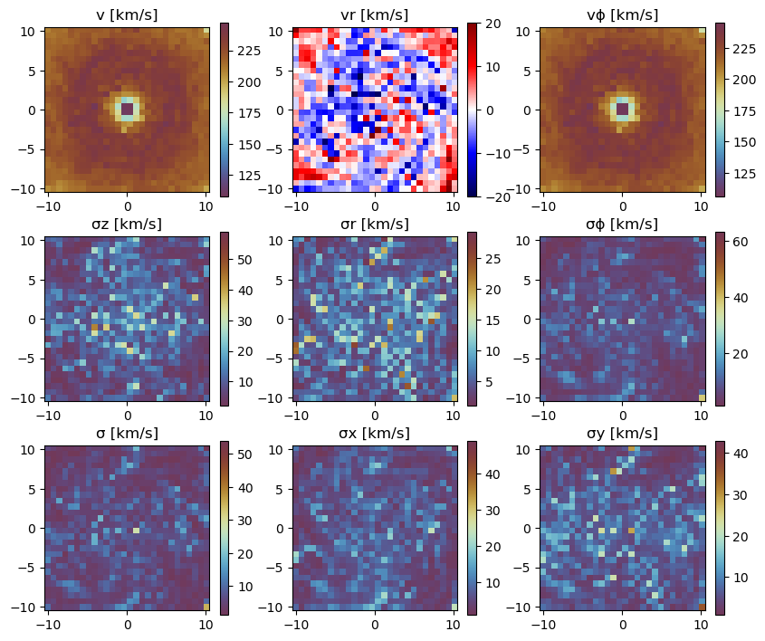
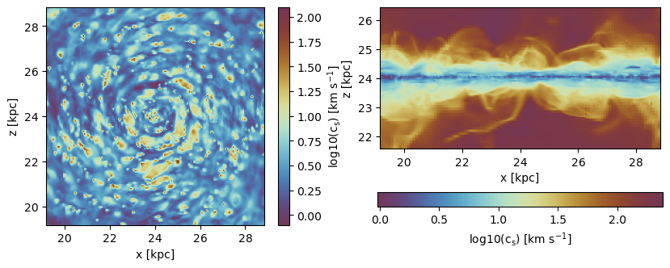
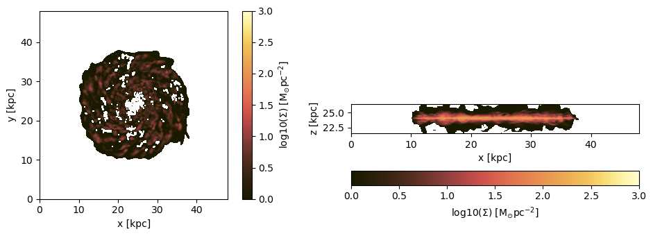

# 6. Hydro: Projections

## Load The Data


```julia
using Mera
info = getinfo(300,  "/Volumes/FASTStorage/Simulations/Mera-Tests/mw_L10");
gas  = gethydro(info, lmax=10); 
```

    era]: 2025-06-30T11:34:59.304
    
    Code: RAMSES
    output [300] summary:
    mtime: 2023-04-09T05:34:09
    ctime: 2025-06-21T18:31:24.020
    =======================================================
    simulation time: 445.89 [Myr]
    boxlen: 48.0 [kpc]
    ncpu: 640
    ndim: 3
    -------------------------------------------------------
    amr:           true
    level(s): 6 - 10 --> cellsize(s): 750.0 [pc] - 46.88 [pc]
    -------------------------------------------------------
    hydro:         true
    hydro-variables:  7  --> (:rho, :vx, :vy, :vz, :p, :var6, :var7)
    hydro-descriptor: (:density, :velocity_x, :velocity_y, :velocity_z, :pressure, :scalar_00, :scalar_01)
    γ: 1.6667
    -------------------------------------------------------
    gravity:       true
    gravity-variables: (:epot, :ax, :ay, :az)
    -------------------------------------------------------
    particles:     true
    - Nstars:   5.445150e+05 
    particle-variables: 7  --> (:vx, :vy, :vz, :mass, :family, :tag, :birth)
    particle-descriptor: (:position_x, :position_y, :position_z, :velocity_x, :velocity_y, :velocity_z, :mass, :identity, :levelp, :family, :tag, :birth_time)
    -------------------------------------------------------
    rt:            false
    clumps:           false
    -------------------------------------------------------
    namelist-file: ("&COOLING_PARAMS", "&SF_PARAMS", "&AMR_PARAMS", "&BOUNDARY_PARAMS", "&OUTPUT_PARAMS", "&POISSON_PARAMS", "&RUN_PARAMS", "&FEEDBACK_PARAMS", "&HYDRO_PARAMS", "&INIT_PARAMS", "&REFINE_PARAMS")
    -------------------------------------------------------
    timer-file:       true
    compilation-file: false
    makefile:         true
    patchfile:        true
    =======================================================
    
    era]: Get hydro data: 2025-06-30T11:35:00.460
    
    Key vars=(:level, :cx, :cy, :cz)
    Using var(s)=(1, 2, 3, 4, 5, 6, 7) = (:rho, :vx, :vy, :vz, :p, :var6, :var7) 
    
    domain:
    xmin::xmax: 0.0 :: 1.0  	==> 0.0 [kpc] :: 48.0 [kpc]
    ymin::ymax: 0.0 :: 1.0  	==> 0.0 [kpc] :: 48.0 [kpc]
    zmin::zmax: 0.0 :: 1.0  	==> 0.0 [kpc] :: 48.0 [kpc]
    
    Reading data...


    Progress: 100%|█████████████████████████████████████████| Time: 0:01:00


    Memory used for data table :2.321086215786636 GB
    -------------------------------------------------------
    


```julia
gas.data
```


    Table with 28320979 rows, 11 columns:
    Columns:
    #   colname  type
    ────────────────────
    1   level    Int64
    2   cx       Int64
    3   cy       Int64
    4   cz       Int64
    5   rho      Float64
    6   vx       Float64
    7   vy       Float64
    8   vz       Float64
    9   p        Float64
    10  var6     Float64
    11  var7     Float64


## Projection of Predefined Quantities

See the possible variables:


```julia
projection()
```

    Predefined vars for projections:
    ------------------------------------------------
    =====================[gas]:=====================
           -all the non derived hydro vars-
    :cpu, :level, :rho, :cx, :cy, :cz, :vx, :vy, :vz, :p, var6,...
    further possibilities: :rho, :density, :ρ
                  -derived hydro vars-
    :x, :y, :z
    :sd or :Σ or :surfacedensity
    :mass, :cellsize, :freefall_time
    :cs, :mach, :machx, :machy, :machz, :jeanslength, :jeansnumber
    :t, :Temp, :Temperature with p/rho
    
    ==================[particles]:==================
            all the non derived  vars:
    :cpu, :level, :id, :family, :tag 
    :x, :y, :z, :vx, :vy, :vz, :mass, :birth, :metal....
    
                  -derived particle vars-
    :age
    
    ==============[gas or particles]:===============
    :v, :ekin
    squared => :vx2, :vy2, :vz2
    velocity dispersion => σx, σy, σz, σ
    
    related to a given center:
    ---------------------------
    :vr_cylinder, vr_sphere (radial components)
    :vϕ_cylinder, :vθ
    squared => :vr_cylinder2, :vϕ_cylinder2
    velocity dispersion => σr_cylinder, σϕ_cylinder 
    
    2d maps (not projected) => :r_cylinder, :ϕ
    
    ------------------------------------------------
    


## Projection of a Single Quantity in Different Directions (z,y,x)

Here we project the surface density in the z-direction of the data within a particular vertical range (domain=[0:1]) onto a grid corresponding to the maximum loaded level. 
Pass any object of `HydroDataType` (here: "gas") to the `projection`-function and select a variable by a Symbol (here: :sd = :surfacedensity = :Σ in Msol/pc^3)


```julia
proj_z = projection(gas, :sd, unit=:Msol_pc2, zrange=[0.45,0.55])
proj_z = projection(gas, :sd, :Msol_pc2, zrange=[0.45,0.55], verbose=false) # The keyword "unit" (singular) can be omit if the following order is preserved: data-object, quantity, unit.
proj_x = projection(gas, :sd, :Msol_pc2, direction = :x, zrange=[0.45,0.55], verbose=false); # Project the surface density in x-direction
```

    era]: 2025-06-30T11:36:07.788
    
    domain:
    xmin::xmax: 0.0 :: 1.0  	==> 0.0 [kpc] :: 48.0 [kpc]
    ymin::ymax: 0.0 :: 1.0  	==> 0.0 [kpc] :: 48.0 [kpc]
    zmin::zmax: 0.45 :: 0.55  	==> 21.6 [kpc] :: 26.4 [kpc]
    
    Selected var(s)=(:sd,) 
    Weighting      = :mass
    
    Effective resolution: 1024^2
    Map size: 1024 x 1024
    Pixel size: 46.875 [pc]
    Simulation min.: 46.875 [pc]
    


### Select a Range Related to a Center
See also in the documentation for: load data by selection


```julia
cv = (gas.boxlen / 2.) * gas.scale.kpc # provide the box-center in kpc
proj_z = projection(gas, :sd, :Msol_pc2, 
                    xrange=[-10.,10.], yrange=[-10.,10.], zrange=[-2.,2.], 
                    center=[cv,cv,cv], range_unit=:kpc);
```

    era]: 2025-06-30T11:36:14.260
    
    center: [0.5, 0.5, 0.5] ==> [24.0 [kpc] :: 24.0 [kpc] :: 24.0 [kpc]]
    
    domain:
    xmin::xmax: 0.2916667 :: 0.7083333  	==> 14.0 [kpc] :: 34.0 [kpc]
    ymin::ymax: 0.2916667 :: 0.7083333  	==> 14.0 [kpc] :: 34.0 [kpc]
    zmin::zmax: 0.4583333 :: 0.5416667  	==> 22.0 [kpc] :: 26.0 [kpc]
    
    Selected var(s)=(:sd,) 
    Weighting      = :mass
    
    Effective resolution: 1024^2
    Map size: 428 x 428
    Pixel size: 46.875 [pc]
    Simulation min.: 46.875 [pc]
    


Use the short notation for the box center :bc or :boxcenter for all dimensions (x,y,z):


```julia
proj_z = projection(gas, :sd, :Msol_pc2,  
                        xrange=[-10.,10.], yrange=[-10.,10.], zrange=[-2.,2.], 
                        center=[:boxcenter], range_unit=:kpc);
```

    era]: 2025-06-30T11:36:16.030
    
    center: [0.5, 0.5, 0.5] ==> [24.0 [kpc] :: 24.0 [kpc] :: 24.0 [kpc]]
    
    domain:
    xmin::xmax: 0.2916667 :: 0.7083333  	==> 14.0 [kpc] :: 34.0 [kpc]
    ymin::ymax: 0.2916667 :: 0.7083333  	==> 14.0 [kpc] :: 34.0 [kpc]
    zmin::zmax: 0.4583333 :: 0.5416667  	==> 22.0 [kpc] :: 26.0 [kpc]
    
    Selected var(s)=(:sd,) 
    Weighting      = :mass
    
    Effective resolution: 1024^2
    Map size: 428 x 428
    Pixel size: 46.875 [pc]
    Simulation min.: 46.875 [pc]
    


```julia
proj_z = projection(gas, :sd, :Msol_pc2,  
                        xrange=[-10.,10.], yrange=[-10.,10.], zrange=[-2.,2.], 
                        center=[:bc], range_unit=:kpc);
```

    era]: 2025-06-30T11:36:17.768
    
    center: [0.5, 0.5, 0.5] ==> [24.0 [kpc] :: 24.0 [kpc] :: 24.0 [kpc]]
    
    domain:
    xmin::xmax: 0.2916667 :: 0.7083333  	==> 14.0 [kpc] :: 34.0 [kpc]
    ymin::ymax: 0.2916667 :: 0.7083333  	==> 14.0 [kpc] :: 34.0 [kpc]
    zmin::zmax: 0.4583333 :: 0.5416667  	==> 22.0 [kpc] :: 26.0 [kpc]
    
    Selected var(s)=(:sd,) 
    Weighting      = :mass
    
    Effective resolution: 1024^2
    Map size: 428 x 428
    Pixel size: 46.875 [pc]
    Simulation min.: 46.875 [pc]
    


Use the box center notation for individual dimensions, here x,z:


```julia
proj_z = projection(gas, :sd, :Msol_pc2,  
                        xrange=[-10.,10.], yrange=[-10.,10.], zrange=[-2.,2.], 
                        center=[:bc, 24., :bc], range_unit=:kpc);
```

    era]: 2025-06-30T11:36:20.157
    
    center: [0.5, 0.5, 0.5] ==> [24.0 [kpc] :: 24.0 [kpc] :: 24.0 [kpc]]
    
    domain:
    xmin::xmax: 0.2916667 :: 0.7083333  	==> 14.0 [kpc] :: 34.0 [kpc]
    ymin::ymax: 0.2916667 :: 0.7083333  	==> 14.0 [kpc] :: 34.0 [kpc]
    zmin::zmax: 0.4583333 :: 0.5416667  	==> 22.0 [kpc] :: 26.0 [kpc]
    
    Selected var(s)=(:sd,) 
    Weighting      = :mass
    
    Effective resolution: 1024^2
    Map size: 428 x 428
    Pixel size: 46.875 [pc]
    Simulation min.: 46.875 [pc]
    


### Get Multiple Quantities

Get several quantities with one function call by passing an array containing the selected variables (at least one entry). The keyword name for the units is now in plural.


```julia
proj1_x = projection(gas, [:sd], units=[:Msol_pc2], 
                        direction = :x, 
                        xrange=[-10.,10.], 
                        yrange=[-10.,10.], 
                        zrange=[-2.,2.], 
                        center=[24.,24.,24.], 
                        range_unit=:kpc);
```

    era]: 2025-06-30T11:36:21.883
    
    center: [0.5, 0.5, 0.5] ==> [24.0 [kpc] :: 24.0 [kpc] :: 24.0 [kpc]]
    
    domain:
    xmin::xmax: 0.2916667 :: 0.7083333  	==> 14.0 [kpc] :: 34.0 [kpc]
    ymin::ymax: 0.2916667 :: 0.7083333  	==> 14.0 [kpc] :: 34.0 [kpc]
    zmin::zmax: 0.4583333 :: 0.5416667  	==> 22.0 [kpc] :: 26.0 [kpc]
    
    Selected var(s)=(:sd,) 
    Weighting      = :mass
    
    Effective resolution: 1024^2
    Map size: 428 x 86
    Pixel size: 46.875 [pc]
    Simulation min.: 46.875 [pc]
    


Pass an array containing several quantities to process and their corresponding units:


```julia
proj1_z = projection(gas, [:sd, :vx], units=[:Msol_pc2, :km_s], 
                        direction = :x,
                        xrange=[-10.,10.], 
                        yrange=[-10.,10.], 
                        zrange=[-2.,2.], 
                        center=[24.,24.,24.], 
                        range_unit=:kpc);
```

    era]: 2025-06-30T11:36:24.320
    
    center: [0.5, 0.5, 0.5] ==> [24.0 [kpc] :: 24.0 [kpc] :: 24.0 [kpc]]
    
    domain:
    xmin::xmax: 0.2916667 :: 0.7083333  	==> 14.0 [kpc] :: 34.0 [kpc]
    ymin::ymax: 0.2916667 :: 0.7083333  	==> 14.0 [kpc] :: 34.0 [kpc]
    zmin::zmax: 0.4583333 :: 0.5416667  	==> 22.0 [kpc] :: 26.0 [kpc]
    
    Selected var(s)=(:sd, :vx) 
    Weighting      = :mass
    
    Effective resolution: 1024^2
    Map size: 428 x 86
    Pixel size: 46.875 [pc]
    Simulation min.: 46.875 [pc]
    


The function can be called without any keywords by preserving the following order: dataobject, variables, units


```julia
proj1_z = projection(gas, [:sd , :vx], [:Msol_pc2, :km_s], 
                        direction = :x,
                        xrange=[-10.,10.], 
                        yrange=[-10.,10.], 
                        zrange=[-2.,2.], 
                        center=[24.,24.,24.], 
                        range_unit=:kpc);
```

    era]: 2025-06-30T11:36:26.941
    
    center: [0.5, 0.5, 0.5] ==> [24.0 [kpc] :: 24.0 [kpc] :: 24.0 [kpc]]
    
    domain:
    xmin::xmax: 0.2916667 :: 0.7083333  	==> 14.0 [kpc] :: 34.0 [kpc]
    ymin::ymax: 0.2916667 :: 0.7083333  	==> 14.0 [kpc] :: 34.0 [kpc]
    zmin::zmax: 0.4583333 :: 0.5416667  	==> 22.0 [kpc] :: 26.0 [kpc]
    
    Selected var(s)=(:sd, :vx) 
    Weighting      = :mass
    
    Effective resolution: 1024^2
    Map size: 428 x 86
    Pixel size: 46.875 [pc]
    Simulation min.: 46.875 [pc]
    


If all selected variables should be of the same unit use the following arguments: dataobject, array of quantities, unit (no array needed)


```julia
projvel_z = projection(gas, [:vx, :vy, :vz], :km_s, 
                        xrange=[-10.,10.], 
                        yrange=[-10.,10.], 
                        zrange=[-2.,2.], 
                        center=[24.,24.,24.], 
                        range_unit=:kpc);
```

    era]: 2025-06-30T11:36:29.503
    
    center: [0.5, 0.5, 0.5] ==> [24.0 [kpc] :: 24.0 [kpc] :: 24.0 [kpc]]
    
    domain:
    xmin::xmax: 0.2916667 :: 0.7083333  	==> 14.0 [kpc] :: 34.0 [kpc]
    ymin::ymax: 0.2916667 :: 0.7083333  	==> 14.0 [kpc] :: 34.0 [kpc]
    zmin::zmax: 0.4583333 :: 0.5416667  	==> 22.0 [kpc] :: 26.0 [kpc]
    
    Selected var(s)=(:vx, :vy, :vz, :sd) 
    Weighting      = :mass
    
    Effective resolution: 1024^2
    Map size: 428 x 428
    Pixel size: 46.875 [pc]
    Simulation min.: 46.875 [pc]
    


## Function Output

List the fields of the assigned object:


```julia
propertynames(proj1_z)
```


    (:maps, :maps_unit, :maps_lmax, :maps_weight, :maps_mode, :lmax_projected, :lmin, :lmax, :ranges, :extent, :cextent, :ratio, :effres, :pixsize, :boxlen, :smallr, :smallc, :scale, :info)


The projected 2D maps are stored in a dictionary:


```julia
proj1_z.maps
```


    DataStructures.SortedDict{Any, Any, Base.Order.ForwardOrdering} with 2 entries:
      :sd => [0.140277 0.140277 … 0.101278 0.101278; 0.140277 0.140277 … 0.101278 0…
      :vx => [77.1704 77.1704 … 129.681 129.681; 77.1704 77.1704 … 129.681 129.681;…


The maps can be accessed by giving the name of the dictionary:


```julia
proj1_z.maps[:sd]
```


    428×86 Matrix{Float64}:
     0.140277   0.140277   0.129794   …  0.343855   0.101278   0.101278
     0.140277   0.140277   0.129794      0.343855   0.101278   0.101278
     0.137395   0.137395   0.136911      0.281761   0.0723861  0.0723861
     0.137395   0.137395   0.136911      0.281761   0.0723861  0.0723861
     0.111983   0.111983   0.136992      0.202348   0.051991   0.051991
     0.111983   0.111983   0.136992   …  0.202348   0.051991   0.051991
     0.0716589  0.0716589  0.122821      0.124959   0.0443155  0.0443155
     0.0716589  0.0716589  0.122821      0.124959   0.0443155  0.0443155
     0.0542019  0.0542019  0.0880136     0.0762129  0.0425661  0.0425661
     0.0542019  0.0542019  0.0880136     0.0762129  0.0425661  0.0425661
     0.0525677  0.0525677  0.0667757  …  0.0554828  0.0435821  0.0435821
     0.0525677  0.0525677  0.0667757     0.0554828  0.0435821  0.0435821
     0.0550184  0.0550184  0.0604652     0.0506024  0.0440759  0.0440759
     ⋮                                ⋱                        ⋮
     0.34605    0.34605    0.436999      0.640066   0.634126   0.634126
     0.34605    0.34605    0.436999      0.640066   0.634126   0.634126
     0.286503   0.286503   0.39705       0.658142   0.639295   0.639295
     0.286503   0.286503   0.39705       0.658142   0.639295   0.639295
     0.199275   0.199275   0.302888   …  0.667026   0.640109   0.640109
     0.199275   0.199275   0.302888      0.667026   0.640109   0.640109
     0.128232   0.128232   0.211891      0.656377   0.612723   0.612723
     0.128232   0.128232   0.211891      0.656377   0.612723   0.612723
     0.0817203  0.0817203  0.132222      0.631934   0.558517   0.558517
     0.0817203  0.0817203  0.132222   …  0.631934   0.558517   0.558517
     0.056342   0.056342   0.0796691     0.567965   0.484554   0.484554
     0.056342   0.056342   0.0796691     0.567965   0.484554   0.484554


The units of the maps are stored in:


```julia
proj1_z.maps_unit
```


    DataStructures.SortedDict{Any, Any, Base.Order.ForwardOrdering} with 2 entries:
      :sd => :Msol_pc2
      :vx => :km_s


Projections on a different grid size (see subject below):


```julia
proj1_z.maps_lmax
```


    DataStructures.SortedDict{Any, Any, Base.Order.ForwardOrdering}()


The following fields are helpful for further calculations or plots.


```julia
proj1_z.ranges # normalized to the domain=[0:1]
```


    6-element Vector{Float64}:
     0.29166666666647767
     0.7083333333328743
     0.29166666666647767
     0.7083333333328743
     0.4583333333330363
     0.5416666666663156


```julia
proj1_z.extent # ranges in code units
```


    4-element Vector{Float64}:
     13.96875
     34.03125
     21.984375
     26.015625


```julia
proj1_z.cextent # ranges in code units relative to a given center (by default: box center)
```


    4-element Vector{Float64}:
     -10.031250000015556
      10.031249999984444
      -2.0156250000155556
       2.0156249999844444


```julia
proj1_z.ratio # the ratio between the two ranges
```


    4.976744186046512


## Plot Maps with Python


```julia
proj_z = projection(gas, :sd, :Msol_pc2, 
                    zrange=[-2.,2.], center=[:boxcenter], range_unit=:kpc,
                    verbose=false) 
proj_x = projection(gas, :sd, :Msol_pc2, 
                    zrange=[-2.,2.], center=[:boxcenter], range_unit=:kpc,
                    verbose=false, 
                    direction = :x);
```

Python functions can be directly called in Julia, which gives the opportunity, e.g. to use the Matplotlib library.


```julia
using PyPlot
using ColorSchemes
cmap3 = ColorMap(ColorSchemes.Blues.colors)
cmap = ColorMap(ColorSchemes.lajolla.colors) # See http://www.fabiocrameri.ch/colourmaps.php
cmap2 = ColorMap(reverse(ColorSchemes.romaO.colors))

```


    

    


```julia
figure(figsize=(10, 3.5))
subplot(1,2,1)
im = imshow( log10.( permutedims(proj_z.maps[:sd])), cmap=cmap, aspect=proj_z.ratio, origin="lower", extent=proj_z.cextent, vmin=0, vmax=3)
xlabel("x [kpc]")
ylabel("y [kpc]")
cb = colorbar(im, label=L"\mathrm{log10(\Sigma) \ [M_{\odot} pc^{-2}]}")

subplot(1,2,2)
im = imshow( log10.( permutedims(proj_x.maps[:sd])), cmap=cmap, origin="lower", extent=proj_x.cextent, vmin=0, vmax=3)
xlabel("x [kpc]")
ylabel("z [kpc]")
cb = colorbar(im, label=L"\mathrm{log10(\Sigma) \ [M_{\odot} pc^{-2}]}",orientation="horizontal", pad=0.2);
```


    

    


Project a specific spatial range and plot the axes of the map relative to the box-center (given by keyword: data_center):


```julia
proj_z = projection(gas, :sd, :Msol_pc2, 
                    xrange=[-10.,0.], yrange=[-10.,0.], zrange=[-2.,2.], center=[:boxcenter], range_unit=:kpc,
                    verbose=false, 
                    data_center=[24.,24.,24.], data_center_unit=:kpc) 
proj_x = projection(gas, :sd, :Msol_pc2, 
                    xrange=[-10.,0.], yrange=[-10.,0.], zrange=[-2.,2.], center=[:boxcenter], range_unit=:kpc,
                    verbose=false, 
                    data_center=[24.,24.,24.], data_center_unit=:kpc, 
                    direction = :x);
```


```julia
figure(figsize=(10, 3.5))
subplot(1,2,1)
im = imshow( log10.( permutedims(proj_z.maps[:sd])), cmap=cmap, aspect=proj_z.ratio, origin="lower", extent=proj_z.cextent, vmin=0, vmax=3)
xlabel("x [kpc]")
ylabel("y [kpc]")
cb = colorbar(im, label=L"\mathrm{log10(\Sigma) \ [M_{\odot} pc^{-2}]}")

subplot(1,2,2)
im = imshow( log10.( permutedims(proj_x.maps[:sd])), cmap=cmap, origin="lower", extent=proj_x.cextent, vmin=0, vmax=3)
xlabel("x [kpc]")
ylabel("z [kpc]")
cb = colorbar(im, label=L"\mathrm{log10(\Sigma) \ [M_{\odot} pc^{-2}]}",orientation="horizontal", pad=0.2);
```


    

    


Plot the axes of the map relative to the map-center (given by keyword: data_center):


```julia
proj_z = projection(gas, :sd, :Msol_pc2, 
                    xrange=[-10.,0.], yrange=[-10.,0.], zrange=[-2.,2.], center=[:boxcenter], range_unit=:kpc,
                    verbose=false, 
                    data_center=[19.,19.,24.], data_center_unit=:kpc) 
proj_x = projection(gas, :sd, :Msol_pc2, 
                    xrange=[-10.,0.], yrange=[-10.,0.], zrange=[-2.,2.], center=[:boxcenter], range_unit=:kpc,
                    verbose=false, 
                    data_center=[19.,19.,24.], data_center_unit=:kpc, 
                    direction = :x);
```


```julia
figure(figsize=(10, 3.5))
subplot(1,2,1)
im = imshow( log10.( permutedims(proj_z.maps[:sd])), cmap=cmap, aspect=proj_z.ratio, origin="lower", extent=proj_z.cextent, vmin=0, vmax=3)
xlabel("x [kpc]")
ylabel("y [kpc]")
cb = colorbar(im, label=L"\mathrm{log10(\Sigma) \ [M_{\odot} pc^{-2}]}")

subplot(1,2,2)
im = imshow( log10.( permutedims(proj_x.maps[:sd])), cmap=cmap, origin="lower", extent=proj_x.cextent, vmin=0, vmax=3)
xlabel("x [kpc]")
ylabel("z [kpc]")
cb = colorbar(im, label=L"\mathrm{log10(\Sigma) \ [M_{\odot} pc^{-2}]}",orientation="horizontal", pad=0.2);
```


    

    


## Projections of Derived Kinematic Data

#### Use quantities in cartesian coordinates:

Project the following derived data
(mass weighted by default): The absolute value of the velocity :v, the velocity dispersion :σ in different directions. The Julia language supports Unicode characters and can be inserted by e.g. "\sigma + tab-key" leading to: **σ**.


```julia
proj_z = projection(gas, [:v, :σ, :σx, :σy, :σz], :km_s, 
                    xrange=[-10.,10.], yrange=[-10.,10.], zrange=[-2.,2.], 
                    center=[24.,24.,24.], range_unit=:kpc);
```

    era]: 2025-06-30T11:36:44.533
    
    center: [0.5, 0.5, 0.5] ==> [24.0 [kpc] :: 24.0 [kpc] :: 24.0 [kpc]]
    
    domain:
    xmin::xmax: 0.2916667 :: 0.7083333  	==> 14.0 [kpc] :: 34.0 [kpc]
    ymin::ymax: 0.2916667 :: 0.7083333  	==> 14.0 [kpc] :: 34.0 [kpc]
    zmin::zmax: 0.4583333 :: 0.5416667  	==> 22.0 [kpc] :: 26.0 [kpc]
    
    Selected var(s)=(:v, :σ, :σx, :σy, :σz, :vx, :vx2, :vy, :vy2, :vz, :vz2, :v2, :sd) 
    Weighting      = :mass
    
    Effective resolution: 1024^2
    Map size: 428 x 428
    Pixel size: 46.875 [pc]
    Simulation min.: 46.875 [pc]
    


For the velocity dispersion additional maps are created to created the mass-weighted quantity:
E. g.: σx = sqrt( <vx^2> - < vx >^2 )


```julia
proj_z.maps
```


    DataStructures.SortedDict{Any, Any, Base.Order.ForwardOrdering} with 13 entries:
      :sd  => [6.72622e-5 6.72622e-5 … 0.000160722 0.000160722; 6.72622e-5 6.72622e…
      :v   => [199.636 199.636 … 206.345 206.345; 199.636 199.636 … 206.345 206.345…
      :v2  => [9.49526 9.49526 … 9.94811 9.94811; 9.49526 9.49526 … 9.94811 9.94811…
      :vx  => [2.19766 2.19766 … -2.43625 -2.43625; 2.19766 2.19766 … -2.43625 -2.4…
      :vx2 => [4.96452 4.96452 … 6.02999 6.02999; 4.96452 4.96452 … 6.02999 6.02999…
      :vy  => [-2.08913 -2.08913 … -1.95508 -1.95508; -2.08913 -2.08913 … -1.95508 …
      :vy2 => [4.50785 4.50785 … 3.87093 3.87093; 4.50785 4.50785 … 3.87093 3.87093…
      :vz  => [-0.00773906 -0.00773906 … 0.139107 0.139107; -0.00773906 -0.00773906…
      :vz2 => [0.0228872 0.0228872 … 0.0472034 0.0472034; 0.0228872 0.0228872 … 0.0…
      :σ   => [31.244 31.244 … 14.1307 14.1307; 31.244 31.244 … 14.1307 14.1307; … …
      :σx  => [24.078 24.078 … 20.1775 20.1775; 24.078 24.078 … 20.1775 20.1775; … …
      :σy  => [24.8311 24.8311 … 14.4541 14.4541; 24.8311 24.8311 … 14.4541 14.4541…
      :σz  => [9.90758 9.90758 … 10.9439 10.9439; 9.90758 9.90758 … 10.9439 10.9439…


```julia
proj_z.maps_unit
```


    DataStructures.SortedDict{Any, Any, Base.Order.ForwardOrdering} with 13 entries:
      :sd  => :standard
      :v   => :km_s
      :v2  => :standard
      :vx  => :standard
      :vx2 => :standard
      :vy  => :standard
      :vy2 => :standard
      :vz  => :standard
      :vz2 => :standard
      :σ   => :km_s
      :σx  => :km_s
      :σy  => :km_s
      :σz  => :km_s


```julia
usedmemory(proj_z);
```

    Memory used: 19.595 MB


```julia
figure(figsize=(10, 5.5))

subplot(2, 3, 1)
title("v [km/s]")
imshow( (permutedims(proj_z.maps[:v])  ), cmap=cmap2, origin="lower", extent=proj_z.cextent)
colorbar()


subplot(2, 3, 2)
title("σ [km/s]")
imshow( (permutedims(proj_z.maps[:σ])  ), cmap=cmap2, origin="lower", extent=proj_z.cextent)
colorbar()


subplot(2, 3, 4)
title("σx [km/s]")
imshow( (permutedims(proj_z.maps[:σx])   ), cmap=cmap2, origin="lower", extent=proj_z.cextent)
colorbar()


subplot(2, 3, 5)
title("σy [km/s]")
imshow( permutedims(proj_z.maps[:σy]) , cmap=cmap2, origin="lower", extent=proj_z.cextent)
colorbar()


subplot(2, 3, 6)
title("σz [km/s]")
imshow( permutedims(proj_z.maps[:σz]) , cmap=cmap2, origin="lower", extent=proj_z.cextent)
colorbar();

```


    

    


#### Use quantities in cylindrical coordinates:
#### Face-on disc (z-direction)
For the cylindrical or spherical components of a quantity, the center of the coordinate system is used (keywords: data_center = center default) and can be given with the keyword "data_center" and its units with "data_center_unit". Additionally, the quantities that are based on cartesian coordinates can be given.


```julia
proj_z = projection(gas, [:v, :σ, :σx, :σy, :ϕ, :r_cylinder, :vr_cylinder, :vϕ_cylinder, :σr_cylinder, :σϕ_cylinder],                    
                    units=[:km_s,:km_s,:km_s, :km_s, :standard, :kpc, :km_s, :km_s, :km_s, :km_s], 
                    xrange=[-10.,10.], yrange=[-10.,10.], zrange=[-2.,2.],
                    center=[:boxcenter], range_unit=:kpc,
                    data_center=[24.,24.,24.],
                    data_center_unit=:kpc); 
```

    era]: 2025-06-30T11:36:47.734
    
    center: [0.5, 0.5, 0.5] ==> [24.0 [kpc] :: 24.0 [kpc] :: 24.0 [kpc]]
    
    domain:
    xmin::xmax: 0.2916667 :: 0.7083333  	==> 14.0 [kpc] :: 34.0 [kpc]
    ymin::ymax: 0.2916667 :: 0.7083333  	==> 14.0 [kpc] :: 34.0 [kpc]
    zmin::zmax: 0.4583333 :: 0.5416667  	==> 22.0 [kpc] :: 26.0 [kpc]
    
    Selected var(s)=(:v, :σ, :σx, :σy, :ϕ, :r_cylinder, :vr_cylinder, :vϕ_cylinder, :σr_cylinder, :σϕ_cylinder, :vx, :vx2, :vy, :vy2, :v2, :vr_cylinder2, :vϕ_cylinder2, :sd) 
    Weighting      = :mass
    
    Effective resolution: 1024^2
    Map size: 428 x 428
    Pixel size: 46.875 [pc]
    Simulation min.: 46.875 [pc]
    


```julia
proj_z.maps
```


    DataStructures.SortedDict{Any, Any, Base.Order.ForwardOrdering} with 18 entries:
      :r_cylinder   => [14.0758 14.0427 … 14.1201 14.1534; 14.0427 14.0096 … 14.087…
      :sd           => [6.72622e-5 6.72622e-5 … 0.000160722 0.000160722; 6.72622e-5…
      :v            => [199.636 199.636 … 206.345 206.345; 199.636 199.636 … 206.34…
      :v2           => [9.49526 9.49526 … 9.94811 9.94811; 9.49526 9.49526 … 9.9481…
      :vr_cylinder  => [-5.03238 -5.03238 … 21.3971 21.3971; -5.03238 -5.03238 … 21…
      :vr_cylinder2 => [0.0148288 0.0148288 … 0.163113 0.163113; 0.0148288 0.014828…
      :vx           => [2.19766 2.19766 … -2.43625 -2.43625; 2.19766 2.19766 … -2.4…
      :vx2          => [4.96452 4.96452 … 6.02999 6.02999; 4.96452 4.96452 … 6.0299…
      :vy           => [-2.08913 -2.08913 … -1.95508 -1.95508; -2.08913 -2.08913 … …
      :vy2          => [4.50785 4.50785 … 3.87093 3.87093; 4.50785 4.50785 … 3.8709…
      :vϕ_cylinder  => [198.773 198.773 … 203.718 203.718; 198.773 198.773 … 203.71…
      :vϕ_cylinder2 => [9.45754 9.45754 … 9.7378 9.7378; 9.45754 9.45754 … 9.7378 9…
      :σ            => [31.244 31.244 … 14.1307 14.1307; 31.244 31.244 … 14.1307 14…
      :σr_cylinder  => [6.20005 6.20005 … 15.6067 15.6067; 6.20005 6.20005 … 15.606…
      :σx           => [24.078 24.078 … 20.1775 20.1775; 24.078 24.078 … 20.1775 20…
      :σy           => [24.8311 24.8311 … 14.4541 14.4541; 24.8311 24.8311 … 14.454…
      :σϕ_cylinder  => [34.0278 34.0278 … 19.3093 19.3093; 34.0278 34.0278 … 19.309…
      :ϕ            => [3.92699 3.92463 … 2.35306 2.35073; 3.92935 3.92699 … 2.3507…


```julia
proj_z.maps_unit
```


    DataStructures.SortedDict{Any, Any, Base.Order.ForwardOrdering} with 18 entries:
      :r_cylinder   => :kpc
      :sd           => :standard
      :v            => :km_s
      :v2           => :standard
      :vr_cylinder  => :km_s
      :vr_cylinder2 => :standard
      :vx           => :standard
      :vx2          => :standard
      :vy           => :standard
      :vy2          => :standard
      :vϕ_cylinder  => :km_s
      :vϕ_cylinder2 => :standard
      :σ            => :km_s
      :σr_cylinder  => :km_s
      :σx           => :km_s
      :σy           => :km_s
      :σϕ_cylinder  => :km_s
      :ϕ            => :radian


```julia
figure(figsize=(10, 8.5))

subplot(3, 3, 1)
title("Radius [kpc]")
imshow( permutedims(proj_z.maps[:r_cylinder]  ), cmap=cmap2, origin="lower", extent=proj_z.cextent)
colorbar()


subplot(3, 3, 2)
title("vr [km/s]")
imshow( permutedims(proj_z.maps[:vr_cylinder] ), cmap="seismic", origin="lower", extent=proj_z.cextent, vmin=-20.,vmax=20.)
colorbar()


subplot(3, 3, 3)
title("vϕ [km/s]")
imshow( permutedims(proj_z.maps[:vϕ_cylinder]  ), cmap=cmap2, origin="lower", extent=proj_z.cextent)
colorbar()


subplot(3, 3, 4)
title("ϕ-angle ")
imshow( permutedims(proj_z.maps[:ϕ]) , cmap=cmap2, origin="lower", extent=proj_z.cextent)
colorbar()


subplot(3, 3, 5)
title("σr [km/s]")
imshow( permutedims(proj_z.maps[:σr_cylinder]  ), cmap=cmap2, origin="lower", extent=proj_z.cextent)
colorbar()


subplot(3, 3, 6)
title("σϕ [km/s]")
imshow( permutedims(proj_z.maps[:σϕ_cylinder] ), cmap=cmap2, origin="lower", extent=proj_z.cextent)
colorbar()


subplot(3, 3, 7)
title("σ [km/s]")
imshow( permutedims(proj_z.maps[:σ]) , cmap=cmap2, origin="lower", extent=proj_z.cextent)
colorbar()


subplot(3, 3, 8)
title("σx [km/s]")
imshow( permutedims(proj_z.maps[:σx] ), cmap=cmap2, origin="lower", extent=proj_z.cextent)
colorbar()


subplot(3, 3, 9)
title("σy [km/s]")
imshow( permutedims(proj_z.maps[:σy] ), cmap=cmap2, origin="lower", extent=proj_z.cextent)
colorbar();
```


    

    


## Project on a Coarser Grid

### lmax
The default is the projection on the maximum loaded grid level (always provided in the output). Choose a smaller/larger level with the keyword `lmax` (independend on the maximum level of the simulation) to project on a coarser/finer grid. By default, the data is assumed to be in the center of the simulation box.


```julia
proj_z = projection(gas, [:v, :σ, :σx, :σy, :σz, :vr_cylinder, :vϕ_cylinder, :σr_cylinder, :σϕ_cylinder], 
                    :km_s,
                    xrange=[-10.,10.], yrange=[-10.,10.], zrange=[-2.,2.],
                    center=[:boxcenter], range_unit=:kpc,
                    lmax=6); 
```

    era]: 2025-06-30T11:37:04.163
    
    center: [0.5, 0.5, 0.5] ==> [24.0 [kpc] :: 24.0 [kpc] :: 24.0 [kpc]]
    
    domain:
    xmin::xmax: 0.2916667 :: 0.7083333  	==> 14.0 [kpc] :: 34.0 [kpc]
    ymin::ymax: 0.2916667 :: 0.7083333  	==> 14.0 [kpc] :: 34.0 [kpc]
    zmin::zmax: 0.4583333 :: 0.5416667  	==> 22.0 [kpc] :: 26.0 [kpc]
    
    Selected var(s)=(:v, :σ, :σx, :σy, :σz, :vr_cylinder, :vϕ_cylinder, :σr_cylinder, :σϕ_cylinder, :vx, :vx2, :vy, :vy2, :vz, :vz2, :v2, :vr_cylinder2, :vϕ_cylinder2, :sd) 
    Weighting      = :mass
    
    Effective resolution: 64^2
    Map size: 28 x 28
    Pixel size: 750.0 [pc]
    Simulation min.: 46.875 [pc]
    


```julia
# this corresponds to an effective resolution of:
proj_z.effres
```


    64


```julia
figure(figsize=(10, 8.5))

subplot(3, 3, 1)
title("v [km/s]")
imshow( permutedims(proj_z.maps[:v]  ), cmap=cmap2, origin="lower", extent=proj_z.cextent)
colorbar()


subplot(3, 3, 2)
title("vr [km/s]")
imshow( permutedims(proj_z.maps[:vr_cylinder] ), cmap="seismic", origin="lower", extent=proj_z.cextent, vmin=-20.,vmax=20.)
colorbar()


subplot(3, 3, 3)
title("vϕ [km/s]")
imshow( permutedims(proj_z.maps[:vϕ_cylinder]  ), cmap=cmap2, origin="lower", extent=proj_z.cextent)
colorbar()


subplot(3, 3, 4)
title("σz [km/s]")
imshow( permutedims(proj_z.maps[:σz] ), cmap=cmap2, origin="lower", extent=proj_z.cextent)
colorbar()


subplot(3, 3, 5)
title("σr [km/s]")
imshow( permutedims(proj_z.maps[:σr_cylinder]  ), cmap=cmap2, origin="lower", extent=proj_z.cextent)
colorbar()


subplot(3, 3, 6)
title("σϕ [km/s]")
imshow( permutedims(proj_z.maps[:σϕ_cylinder] ), cmap=cmap2, origin="lower", extent=proj_z.cextent)
colorbar()


subplot(3, 3, 7)
title("σ [km/s]")
imshow( permutedims(proj_z.maps[:σ]) , cmap=cmap2, origin="lower", extent=proj_z.cextent)
colorbar()


subplot(3, 3, 8)
title("σx [km/s]")
imshow( permutedims(proj_z.maps[:σx]  ), cmap=cmap2, origin="lower", extent=proj_z.cextent)
colorbar()


subplot(3, 3, 9)
title("σy [km/s]")
imshow( permutedims(proj_z.maps[:σy] ), cmap=cmap2, origin="lower", extent=proj_z.cextent)
colorbar();
```


    

    


### res
Choose the effective resolution (related to the full box) of the projected grid:


```julia
proj_z = projection(gas, [:v, :σ, :σx, :σy, :σz, :vr_cylinder, :vϕ_cylinder, :σr_cylinder, :σϕ_cylinder], 
                    :km_s,
                    xrange=[-10.,10.], yrange=[-10.,10.], zrange=[-2.,2.],
                    center=[:boxcenter], range_unit=:kpc,
                    res=100); 
```

    era]: 2025-06-30T11:37:20.496
    
    center: [0.5, 0.5, 0.5] ==> [24.0 [kpc] :: 24.0 [kpc] :: 24.0 [kpc]]
    
    domain:
    xmin::xmax: 0.2916667 :: 0.7083333  	==> 14.0 [kpc] :: 34.0 [kpc]
    ymin::ymax: 0.2916667 :: 0.7083333  	==> 14.0 [kpc] :: 34.0 [kpc]
    zmin::zmax: 0.4583333 :: 0.5416667  	==> 22.0 [kpc] :: 26.0 [kpc]
    
    Selected var(s)=(:v, :σ, :σx, :σy, :σz, :vr_cylinder, :vϕ_cylinder, :σr_cylinder, :σϕ_cylinder, :vx, :vx2, :vy, :vy2, :vz, :vz2, :v2, :vr_cylinder2, :vϕ_cylinder2, :sd) 
    Weighting      = :mass
    
    Effective resolution: 100^2
    Map size: 42 x 42
    Pixel size: 480.0 [pc]
    Simulation min.: 46.875 [pc]
    


### pxsize
Choose the pixel size in a physical unit, e.g. pixel-size=100 pc. The data is projected to a grid with a pixel-size that is closest to the given number, but not larger:


```julia
proj_z = projection(gas, [:v, :σ, :σx, :σy, :σz, :vr_cylinder, :vϕ_cylinder, :σr_cylinder, :σϕ_cylinder], 
                    :km_s,
                    xrange=[-10.,10.], yrange=[-10.,10.], zrange=[-2.,2.],
                    center=[:boxcenter], range_unit=:kpc,
                    pxsize=[100., :pc]); 
```

    era]: 2025-06-30T11:37:35.957
    
    center: [0.5, 0.5, 0.5] ==> [24.0 [kpc] :: 24.0 [kpc] :: 24.0 [kpc]]
    
    domain:
    xmin::xmax: 0.2916667 :: 0.7083333  	==> 14.0 [kpc] :: 34.0 [kpc]
    ymin::ymax: 0.2916667 :: 0.7083333  	==> 14.0 [kpc] :: 34.0 [kpc]
    zmin::zmax: 0.4583333 :: 0.5416667  	==> 22.0 [kpc] :: 26.0 [kpc]
    
    Selected var(s)=(:v, :σ, :σx, :σy, :σz, :vr_cylinder, :vϕ_cylinder, :σr_cylinder, :σϕ_cylinder, :vx, :vx2, :vy, :vy2, :vz, :vz2, :v2, :vr_cylinder2, :vϕ_cylinder2, :sd) 
    Weighting      = :mass
    
    Effective resolution: 481^2
    Map size: 201 x 201
    Pixel size: 99.792 [pc]
    Simulation min.: 46.875 [pc]
    


```julia

```

## Projection of Thermal Data

The the sound speed is calculated from the loaded adiabatic index (from the hydro files):


```julia
proj_z = projection(gas, :cs, :km_s, zrange=[0.45,0.55], xrange=[0.4, 0.6], yrange=[0.4, 0.6])
proj_x = projection(gas, :cs, :km_s, zrange=[0.45,0.55], xrange=[0.4, 0.6], yrange=[0.4, 0.6], direction=:x);
```

    era]: 2025-06-30T11:37:51.385
    
    domain:
    xmin::xmax: 0.4 :: 0.6  	==> 19.2 [kpc] :: 28.8 [kpc]
    ymin::ymax: 0.4 :: 0.6  	==> 19.2 [kpc] :: 28.8 [kpc]
    zmin::zmax: 0.45 :: 0.55  	==> 21.6 [kpc] :: 26.4 [kpc]
    
    Selected var(s)=(:cs, :sd) 
    Weighting      = :mass
    
    Effective resolution: 1024^2
    Map size: 206 x 206
    Pixel size: 46.875 [pc]
    Simulation min.: 46.875 [pc]
    
    era]: 2025-06-30T11:37:53.419
    
    domain:
    xmin::xmax: 0.4 :: 0.6  	==> 19.2 [kpc] :: 28.8 [kpc]
    ymin::ymax: 0.4 :: 0.6  	==> 19.2 [kpc] :: 28.8 [kpc]
    zmin::zmax: 0.45 :: 0.55  	==> 21.6 [kpc] :: 26.4 [kpc]
    
    Selected var(s)=(:cs, :sd) 
    Weighting      = :mass
    
    Effective resolution: 1024^2
    Map size: 206 x 104
    Pixel size: 46.875 [pc]
    Simulation min.: 46.875 [pc]
    


```julia
figure(figsize=(10, 3.5))

subplot(1, 2, 1)
im = imshow( log10.(permutedims(proj_z.maps[:cs])   ), cmap=cmap2, origin="lower", extent=proj_z.cextent)
xlabel("x [kpc]")
ylabel("z [kpc]")
cb = colorbar(im, label=L"\mathrm{log10(c_s) \ [km \ s^{-1}]}")


subplot(1, 2, 2)
im = imshow( log10.(permutedims(proj_x.maps[:cs]) ), cmap=cmap2, origin="lower", extent=proj_x.cextent)
xlabel("x [kpc]")
ylabel("z [kpc]")
cb = colorbar(im, label=L"\mathrm{log10(c_s) \ [km \ s^{-1}]}",orientation="horizontal", pad=0.2);

```


    

    


Change the adiabatic index in the field `gas.info.gamma` to use a different value in the projection calculation.

## Projection of Masked Data

Mask higher densities by creating a Bool-array where the lower density cells correspond to false entries:


```julia
#density = 4e-3 / gas.scale.Msol_pc3
#mask = map(row->row.rho < density, gas.data);

mask_nH = getvar(gas, :rho, :nH) .< 1. # cm-3
mask_T = getvar(gas, :Temperature, :K) .< 1e4 # K

mask_tot = mask_nH .* mask_T;
```

Pass the mask to the projection function:


```julia
proj_z = projection(gas, :sd, :Msol_pc2, zrange=[0.45,0.55], mask=mask_tot)
proj_x = projection(gas, :sd, :Msol_pc2, zrange=[0.45,0.55], mask=mask_tot, direction=:x);
```

    era]: 2025-06-30T11:37:56.328
    
    domain:
    xmin::xmax: 0.0 :: 1.0  	==> 0.0 [kpc] :: 48.0 [kpc]
    ymin::ymax: 0.0 :: 1.0  	==> 0.0 [kpc] :: 48.0 [kpc]
    zmin::zmax: 0.45 :: 0.55  	==> 21.6 [kpc] :: 26.4 [kpc]
    
    Selected var(s)=(:sd,) 
    Weighting      = :mass
    
    Effective resolution: 1024^2
    Map size: 1024 x 1024
    Pixel size: 46.875 [pc]
    Simulation min.: 46.875 [pc]
    
    :mask provided by function
    
    era]: 2025-06-30T11:37:57.947
    
    domain:
    xmin::xmax: 0.0 :: 1.0  	==> 0.0 [kpc] :: 48.0 [kpc]
    ymin::ymax: 0.0 :: 1.0  	==> 0.0 [kpc] :: 48.0 [kpc]
    zmin::zmax: 0.45 :: 0.55  	==> 21.6 [kpc] :: 26.4 [kpc]
    
    Selected var(s)=(:sd,) 
    Weighting      = :mass
    
    Effective resolution: 1024^2
    Map size: 1024 x 104
    Pixel size: 46.875 [pc]
    Simulation min.: 46.875 [pc]
    
    :mask provided by function
    


```julia
figure(figsize=(10, 3.5))
subplot(1,2,1)
im = imshow( log10.( permutedims(proj_z.maps[:sd])), cmap=cmap, aspect=proj_z.ratio, origin="lower", extent=proj_z.cextent, vmin=0, vmax=3)
xlabel("x [kpc]")
ylabel("y [kpc]")
cb = colorbar(im, label=L"\mathrm{log10(\Sigma) \ [M_{\odot} pc^{-2}]}")

subplot(1,2,2)
im = imshow( log10.( permutedims(proj_x.maps[:sd])), cmap=cmap, origin="lower", extent=proj_x.cextent, vmin=0, vmax=3)
xlabel("x [kpc]")
ylabel("z [kpc]")
cb = colorbar(im, label=L"\mathrm{log10(\Sigma) \ [M_{\odot} pc^{-2}]}",orientation="horizontal", pad=0.2);
tight_layout()
```


    

    


```julia

```

## Weighting - Integration
By default, the data is weighted by mass, except for the surface density. Choose different weightings, e.g., volume:


```julia
proj_z = projection(gas, :cs, :km_s, weighting=[:volume]);
```

    era]: 2025-06-30T11:37:58.999
    
    domain:
    xmin::xmax: 0.0 :: 1.0  	==> 0.0 [kpc] :: 48.0 [kpc]
    ymin::ymax: 0.0 :: 1.0  	==> 0.0 [kpc] :: 48.0 [kpc]
    zmin::zmax: 0.0 :: 1.0  	==> 0.0 [kpc] :: 48.0 [kpc]
    
    Selected var(s)=(:cs,) 
    Weighting      = :volume
    
    Effective resolution: 1024^2
    Map size: 1024 x 1024
    Pixel size: 46.875 [pc]
    Simulation min.: 46.875 [pc]
    


Any quantity that is predefined (see: projection(), getvar()) or is part of the data-table can be selected. Furthermore, a unit can be given, e.g., for volume with cm3:


```julia
proj_z = projection(gas, :cs, :km_s, weighting=[:volume, :cm3]);
```

    era]: 2025-06-30T11:38:03.015
    
    domain:
    xmin::xmax: 0.0 :: 1.0  	==> 0.0 [kpc] :: 48.0 [kpc]
    ymin::ymax: 0.0 :: 1.0  	==> 0.0 [kpc] :: 48.0 [kpc]
    zmin::zmax: 0.0 :: 1.0  	==> 0.0 [kpc] :: 48.0 [kpc]
    
    Selected var(s)=(:cs,) 
    Weighting      = :volume
    
    Effective resolution: 1024^2
    Map size: 1024 x 1024
    Pixel size: 46.875 [pc]
    Simulation min.: 46.875 [pc]
    


```julia

```


```julia

```
