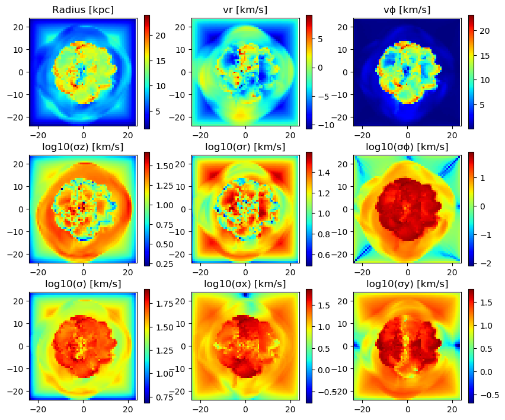
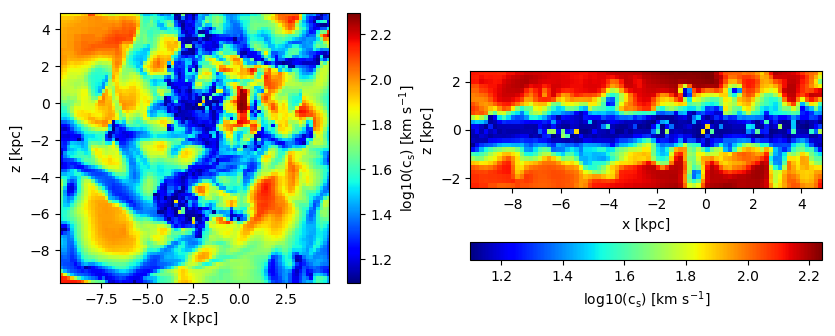

# 6. Hydro: Projections

## Load The Data


```julia
using Mera
info = getinfo(400, "../../testing/simulations/manu_sim_sf_L14");
gas  = gethydro(info, lmax=8, smallr=1e-5); 
```

    [Mera]: 2020-01-18T15:08:34.469
    
    Code: RAMSES
    output [400] summary:
    mtime: 2018-09-05T09:51:55.041
    ctime: 2019-11-01T17:35:21.051
    =======================================================
    simulation time: 594.98 [Myr]
    boxlen: 48.0 [kpc]
    ncpu: 2048
    ndim: 3
    -------------------------------------------------------
    amr:           true
    level(s): 6 - 14 --> cellsize(s): 750.0 [pc] - 2.93 [pc]
    -------------------------------------------------------
    hydro:         true
    hydro-variables:  7  --> (:rho, :vx, :vy, :vz, :p, :var6, :var7)
    hydro-descriptor: (:density, :velocity_x, :velocity_y, :velocity_z, :thermal_pressure, :passive_scalar_1, :passive_scalar_2)
    γ: 1.6667
    -------------------------------------------------------
    gravity:       true
    gravity-variables: (:epot, :ax, :ay, :az)
    -------------------------------------------------------
    particles:     true
    - Npart:    5.091500e+05 
    - Nstars:   5.066030e+05 
    - Ndm:      2.547000e+03 
    particle variables: (:vx, :vy, :vz, :mass, :birth)
    -------------------------------------------------------
    clumps:        true
    clump-variables: (:index, :lev, :parent, :ncell, :peak_x, :peak_y, :peak_z, Symbol("rho-"), Symbol("rho+"), :rho_av, :mass_cl, :relevance)
    -------------------------------------------------------
    namelist-file: false
    timer-file:       false
    compilation-file: true
    makefile:         true
    patchfile:        true
    =======================================================
    
    [Mera]: Get hydro data: 2020-01-18T15:08:35.58
    
    Key vars=(:level, :cx, :cy, :cz)
    Using var(s)=(1, 2, 3, 4, 5, 6, 7) = (:rho, :vx, :vy, :vz, :p, :var6, :var7) 
    
    domain:
    xmin::xmax: 0.0 :: 1.0  	==> 0.0 [kpc] :: 48.0 [kpc]
    ymin::ymax: 0.0 :: 1.0  	==> 0.0 [kpc] :: 48.0 [kpc]
    zmin::zmax: 0.0 :: 1.0  	==> 0.0 [kpc] :: 48.0 [kpc]
    
    Reading data...


    100%|███████████████████████████████████████████████████| Time: 0:02:40


    Memory used for data table :71.28007793426514 MB
    -------------------------------------------------------
    


```julia
gas.data
```


    Table with 849332 rows, 11 columns:
    Columns:
    #   colname  type
    ────────────────────
    1   level    Int64
    2   cx       Int64
    3   cy       Int64
    4   cz       Int64
    5   rho      Float64
    6   vx       Float64
    7   vy       Float64
    8   vz       Float64
    9   p        Float64
    10  var6     Float64
    11  var7     Float64


## Projection of Predefined Quantities

See the possible variables:


```julia
projection()
```

    Predefined vars for projections:
    ------------------------------------------------
    =====================[gas]:=====================
           -all the non derived hydro vars-
    :cpu, :level, :rho, :cx, :cy, :cz, :vx, :vy, :vz, :p, var6,...
    further possibilities: :rho, :density, :ρ
                  -derived hydro vars-
    :x, :y, :z
    :sd or :Σ or :surfacedensity
    :mass, :cellsize, :freefall_time
    :cs, :mach, :jeanslength, :jeansnumber
    
    ==================[particles]:==================
            all the non derived  vars:
    :cpu, :level, :id, :family, :tag 
    :x, :y, :z, :vx, :vy, :vz, :mass, :birth, :metal....
    
                  -derived particle vars-
    :age
    
    ==============[gas or particles]:===============
    :v, :ekin
    squared => :vx2, :vy2, :vz2
    velocity dispersion => σx, σy, σz, σ
    
    related to a given center:
    ---------------------------
    :vr_cylinder, vr_sphere (radial components)
    :vϕ_cylinder, :vθ
    squared => :vr_cylinder2, :vϕ_cylinder2
    velocity dispersion => σr_cylinder, σϕ_cylinder 
    
    2d maps:
    :r_cylinder, :r_sphere
    :ϕ, :θ
    ------------------------------------------------
    


## Projection of a Single Quantity in Different Directions (z,y,x)

Here we project the surface density in the z-direction of the data within a particular vertical range (domain=[0:1]) onto a grid corresponding to the maximum loaded level. 
Pass any object of *HydroDataType* (here: "gas") to the *projection*-function and select a variable by a Symbol (here: :sd = :surfacedensity = :Σ in Msol/pc^3)


```julia
proj_z = projection(gas, :sd, unit=:Msol_pc2, zrange=[0.45,0.55])
proj_z = projection(gas, :Σ,  unit=:Msol_pc2, zrange=[0.45,0.55], verbose=false)
proj_z = projection(gas, :surfacedensity, unit=:Msol_pc2, zrange=[0.45,0.55], verbose=false)
proj_z = projection(gas, :sd, :Msol_pc2, zrange=[0.45,0.55], verbose=false) # The keyword "unit" (singular) can be omit if the following order is preserved: data-object, quantity, unit.
proj_x = projection(gas, :sd, :Msol_pc2, direction = :x, zrange=[0.45,0.55], verbose=false); # Project the surface density in x-direction
```

    [Mera]: 2020-01-18T15:11:18.57
    
    domain:
    xmin::xmax: 0.0 :: 1.0  	==> 0.0 [kpc] :: 48.0 [kpc]
    ymin::ymax: 0.0 :: 1.0  	==> 0.0 [kpc] :: 48.0 [kpc]
    zmin::zmax: 0.45 :: 0.55  	==> 21.6 [kpc] :: 26.4 [kpc]
    
    Selected var(s)=(:sd,) 
    


    100%|███████████████████████████████████████████████████| Time: 0:00:07
    100%|███████████████████████████████████████████████████| Time: 0:00:07
    100%|███████████████████████████████████████████████████| Time: 0:00:07
    100%|███████████████████████████████████████████████████| Time: 0:00:07
    100%|███████████████████████████████████████████████████| Time: 0:00:07


### Select a Range Related to a Center
See also in the documentation for: load data by selection


```julia
cv = (gas.boxlen / 2.) * gas.scale.kpc # provide the box-center in kpc
proj_z = projection(gas, :sd, :Msol_pc2, 
                    xrange=[-10.,10.], yrange=[-10.,10.], zrange=[-2.,2.], 
                    center=[cv,cv,cv], range_unit=:kpc);
```

    [Mera]: 2020-01-18T15:11:55.919
    
    center: [0.5, 0.5, 0.5] ==> [24.0 [kpc] :: 24.0 [kpc] :: 24.0 [kpc]]
    
    domain:
    xmin::xmax: 0.2916667 :: 0.7083333  	==> 14.0 [kpc] :: 34.0 [kpc]
    ymin::ymax: 0.2916667 :: 0.7083333  	==> 14.0 [kpc] :: 34.0 [kpc]
    zmin::zmax: 0.4583333 :: 0.5416667  	==> 22.0 [kpc] :: 26.0 [kpc]
    
    Selected var(s)=(:sd,) 
    


    100%|███████████████████████████████████████████████████| Time: 0:00:07


Use the short notation for the box center :bc or :boxcenter for all dimensions (x,y,z):


```julia
proj_z = projection(gas, :sd, :Msol_pc2,  
                        xrange=[-10.,10.], yrange=[-10.,10.], zrange=[-2.,2.], 
                        center=[:boxcenter], range_unit=:kpc);
```

    [Mera]: 2020-01-18T15:12:04.997
    
    center: [0.5, 0.5, 0.5] ==> [24.0 [kpc] :: 24.0 [kpc] :: 24.0 [kpc]]
    
    domain:
    xmin::xmax: 0.2916667 :: 0.7083333  	==> 14.0 [kpc] :: 34.0 [kpc]
    ymin::ymax: 0.2916667 :: 0.7083333  	==> 14.0 [kpc] :: 34.0 [kpc]
    zmin::zmax: 0.4583333 :: 0.5416667  	==> 22.0 [kpc] :: 26.0 [kpc]
    
    Selected var(s)=(:sd,) 
    


    100%|███████████████████████████████████████████████████| Time: 0:00:07


```julia
proj_z = projection(gas, :sd, :Msol_pc2,  
                        xrange=[-10.,10.], yrange=[-10.,10.], zrange=[-2.,2.], 
                        center=[:bc], range_unit=:kpc);
```

    [Mera]: 2020-01-18T15:12:12.293
    
    center: [0.5, 0.5, 0.5] ==> [24.0 [kpc] :: 24.0 [kpc] :: 24.0 [kpc]]
    
    domain:
    xmin::xmax: 0.2916667 :: 0.7083333  	==> 14.0 [kpc] :: 34.0 [kpc]
    ymin::ymax: 0.2916667 :: 0.7083333  	==> 14.0 [kpc] :: 34.0 [kpc]
    zmin::zmax: 0.4583333 :: 0.5416667  	==> 22.0 [kpc] :: 26.0 [kpc]
    
    Selected var(s)=(:sd,) 
    


    100%|███████████████████████████████████████████████████| Time: 0:00:07


Use the box center notation for individual dimensions, here x,z:


```julia
proj_z = projection(gas, :sd, :Msol_pc2,  
                        xrange=[-10.,10.], yrange=[-10.,10.], zrange=[-2.,2.], 
                        center=[:bc, 24., :bc], range_unit=:kpc);
```

    [Mera]: 2020-01-18T15:12:21.673
    
    center: [0.5, 0.5, 0.5] ==> [24.0 [kpc] :: 24.0 [kpc] :: 24.0 [kpc]]
    
    domain:
    xmin::xmax: 0.2916667 :: 0.7083333  	==> 14.0 [kpc] :: 34.0 [kpc]
    ymin::ymax: 0.2916667 :: 0.7083333  	==> 14.0 [kpc] :: 34.0 [kpc]
    zmin::zmax: 0.4583333 :: 0.5416667  	==> 22.0 [kpc] :: 26.0 [kpc]
    
    Selected var(s)=(:sd,) 
    


    100%|███████████████████████████████████████████████████| Time: 0:00:08


### Get Multiple Quantities

Get several quantities with one function call by passing an array containing the selected variables (at least one entry). The keyword name for the units is now in plural.


```julia
proj1_x = projection(gas, [:sd], units=[:Msol_pc2], 
                        direction = :x, 
                        xrange=[-10.,10.], 
                        yrange=[-10.,10.], 
                        zrange=[-2.,2.], 
                        center=[24.,24.,24.], 
                        range_unit=:kpc);
```

    [Mera]: 2020-01-18T15:12:29.949
    
    center: [0.5, 0.5, 0.5] ==> [24.0 [kpc] :: 24.0 [kpc] :: 24.0 [kpc]]
    
    domain:
    xmin::xmax: 0.2916667 :: 0.7083333  	==> 14.0 [kpc] :: 34.0 [kpc]
    ymin::ymax: 0.2916667 :: 0.7083333  	==> 14.0 [kpc] :: 34.0 [kpc]
    zmin::zmax: 0.4583333 :: 0.5416667  	==> 22.0 [kpc] :: 26.0 [kpc]
    
    Selected var(s)=(:sd,) 
    


    100%|███████████████████████████████████████████████████| Time: 0:00:07


Pass an array containing several quantities to process and their corresponding units:


```julia
proj1_z = projection(gas, [:sd, :vx], units=[:Msol_pc2, :km_s], 
                        direction = :x,
                        xrange=[-10.,10.], 
                        yrange=[-10.,10.], 
                        zrange=[-2.,2.], 
                        center=[24.,24.,24.], 
                        range_unit=:kpc);
```

    [Mera]: 2020-01-18T15:12:37.284
    
    center: [0.5, 0.5, 0.5] ==> [24.0 [kpc] :: 24.0 [kpc] :: 24.0 [kpc]]
    
    domain:
    xmin::xmax: 0.2916667 :: 0.7083333  	==> 14.0 [kpc] :: 34.0 [kpc]
    ymin::ymax: 0.2916667 :: 0.7083333  	==> 14.0 [kpc] :: 34.0 [kpc]
    zmin::zmax: 0.4583333 :: 0.5416667  	==> 22.0 [kpc] :: 26.0 [kpc]
    
    Selected var(s)=(:sd, :vx) 
    


    100%|███████████████████████████████████████████████████| Time: 0:00:07


The function can be called without any keywords by preserving the following order: dataobject, variables, units


```julia
proj1_z = projection(gas, [:sd , :vx], [:Msol_pc2, :km_s], 
                        direction = :x,
                        xrange=[-10.,10.], 
                        yrange=[-10.,10.], 
                        zrange=[-2.,2.], 
                        center=[24.,24.,24.], 
                        range_unit=:kpc);
```

    [Mera]: 2020-01-18T15:12:45.261
    
    center: [0.5, 0.5, 0.5] ==> [24.0 [kpc] :: 24.0 [kpc] :: 24.0 [kpc]]
    
    domain:
    xmin::xmax: 0.2916667 :: 0.7083333  	==> 14.0 [kpc] :: 34.0 [kpc]
    ymin::ymax: 0.2916667 :: 0.7083333  	==> 14.0 [kpc] :: 34.0 [kpc]
    zmin::zmax: 0.4583333 :: 0.5416667  	==> 22.0 [kpc] :: 26.0 [kpc]
    
    Selected var(s)=(:sd, :vx) 
    


    100%|███████████████████████████████████████████████████| Time: 0:00:07


If all selected variables should be of the same unit use the following arguments: dataobject, array of quantities, unit (no array needed)


```julia
projvel_z = projection(gas, [:vx, :vy, :vz], :km_s, 
                        xrange=[-10.,10.], 
                        yrange=[-10.,10.], 
                        zrange=[-2.,2.], 
                        center=[24.,24.,24.], 
                        range_unit=:kpc);
```

    [Mera]: 2020-01-18T15:12:52.943
    
    center: [0.5, 0.5, 0.5] ==> [24.0 [kpc] :: 24.0 [kpc] :: 24.0 [kpc]]
    
    domain:
    xmin::xmax: 0.2916667 :: 0.7083333  	==> 14.0 [kpc] :: 34.0 [kpc]
    ymin::ymax: 0.2916667 :: 0.7083333  	==> 14.0 [kpc] :: 34.0 [kpc]
    zmin::zmax: 0.4583333 :: 0.5416667  	==> 22.0 [kpc] :: 26.0 [kpc]
    
    Selected var(s)=(:vx, :vy, :vz) 
    


    100%|███████████████████████████████████████████████████| Time: 0:00:07


## Function Output

List the fields of the assigned object:


```julia
propertynames(proj1_z)
```


    (:maps, :maps_unit, :maps_lmax, :maps_mode, :lmax_projected, :lmin, :lmax, :ranges, :extent, :cextent, :ratio, :boxlen, :smallr, :smallc, :scale, :info)


The projected 2D maps are stored in a dictionary:


```julia
proj1_z.maps
```


    DataStructures.SortedDict{Any,Any,Base.Order.ForwardOrdering} with 2 entries:
      :sd => [3.41304 3.79026 … 5.05903 4.35383; 3.42519 3.8684 … 5.03267 4.33342; …
      :vx => [37.4988 44.3912 … 40.7083 31.5865; 37.3742 44.8575 … 38.406 29.3552; …


The maps can be accessed by giving the name of the dictionary:


```julia
proj1_z.maps[:sd]
```


    108×22 Array{Float64,2}:
      3.41304   3.79026   4.58832   6.62656  …   5.4227   5.05903  4.35383 
      3.42519   3.8684    4.35844   5.92802      5.48012  5.03267  4.33342 
      3.75334   3.92684   4.33235   5.82553      4.98692  4.67298  3.92754 
      3.79558   4.07959   4.61505   6.58258      4.71411  4.559    3.89166 
      4.04036   4.21199   5.04493   7.4712       4.05309  3.9339   3.49951 
      4.06839   4.27542   5.19802   7.32505  …   3.81878  3.72175  3.407   
      4.16328   4.25251   5.02169   6.84524      3.41664  3.34393  3.22185 
      4.15831   4.17994   4.67111   6.00046      3.20065  3.15183  3.14183 
      4.19452   4.09408   4.30201   5.04866      3.18082  3.12108  3.07015 
      4.22359   4.06706   4.14675   4.49345      3.30449  3.23708  3.17577 
      4.5021    4.3285    4.3901    4.60863  …   3.51295  3.47991  3.39161 
      5.26515   5.52363   5.77249   6.27596      3.62226  3.6605   3.62263 
      6.79922   7.95452   8.49358   8.9781       3.62573  3.74174  3.82403 
      ⋮                                      ⋱            ⋮                
      4.14087   4.42076   5.07769   5.54657      7.73506  5.63327  4.57449 
      4.23928   4.70825   6.00913   6.14972      8.69169  6.34754  4.77639 
      4.3696    5.23925   7.55349   7.34335     10.3635   7.7637   5.53666 
      5.00949   6.90318   9.64387   8.86466     10.0675   8.75295  7.64666 
      7.04287   9.75658  10.6711    9.44826  …   7.4416   7.44904  7.83329 
     10.2357   10.7533   10.1945    9.69192      5.253    5.38864  6.14179 
     12.0502   10.2076    8.1298    8.05313      4.49275  4.14643  4.16303 
     10.8051    6.90193   5.45612   6.10778      4.26789  3.87758  3.76836 
      4.77035   4.69102   4.97486   9.06971      3.98933  3.71412  3.61733 
      5.07124   5.38552   6.71678  11.4934   …   3.72241  3.60248  3.57498 
      6.38706   6.64159   8.74087  14.0105       3.50962  3.46535  3.42887 
      5.2565    6.71252   8.51887   5.96163      2.95032  2.93103  0.873021


The units of the maps are stored in:


```julia
proj1_z.maps_unit
```


    DataStructures.SortedDict{Any,Any,Base.Order.ForwardOrdering} with 2 entries:
      :sd => :Msol_pc2
      :vx => :km_s


Projections on a different grid size (see subject below):


```julia
proj1_z.maps_lmax
```


    DataStructures.SortedDict{Any,Any,Base.Order.ForwardOrdering} with 0 entries


The following fields are helpful for further calculations or plots.


```julia
proj1_z.ranges # normalized to the domain=[0:1]
```


    6-element Array{Float64,1}:
     0.29166666666647767
     0.7083333333328743 
     0.29166666666647767
     0.7083333333328743 
     0.4583333333330363 
     0.5416666666663156 


```julia
proj1_z.extent # ranges in code units
```


    4-element Array{Float64,1}:
     13.875 
     34.125 
     21.9375
     26.0625


```julia
proj1_z.cextent # ranges in code units relative to a given center (by default: box center)
```


    4-element Array{Float64,1}:
     -10.125 
      10.125 
      -2.0625
       2.0625


```julia
proj1_z.ratio # the ratio between the two ranges
```


    4.909090909090909


## Plot Maps with Python


```julia
proj_z = projection(gas, :sd, :Msol_pc2, 
                    zrange=[-2.,2.], center=[:boxcenter], range_unit=:kpc,
                    verbose=false) 
proj_x = projection(gas, :sd, :Msol_pc2, 
                    zrange=[-2.,2.], center=[:boxcenter], range_unit=:kpc,
                    verbose=false, 
                    direction = :x);
```

    100%|███████████████████████████████████████████████████| Time: 0:00:07
    100%|███████████████████████████████████████████████████| Time: 0:00:07


Python functions can be directly called in Julia, which gives the opportunity, e.g. to use the Matplotlib library.


```julia
using PyPlot
```


```julia
figure(figsize=(10, 3.5))
subplot(1,2,1)
im = imshow( log10.( permutedims(proj_z.maps[:sd])), cmap="jet", aspect=proj_z.ratio, origin="lower", extent=proj_z.cextent, vmin=0, vmax=3)
xlabel("x [kpc]")
ylabel("y [kpc]")
cb = colorbar(im, label=L"\mathrm{log10(\Sigma) \ [M_{\odot} pc^{-2}]}")

subplot(1,2,2)
im = imshow( log10.( permutedims(proj_x.maps[:sd])), cmap="jet", origin="lower", extent=proj_x.cextent, vmin=0, vmax=3)
xlabel("x [kpc]")
ylabel("z [kpc]")
cb = colorbar(im, label=L"\mathrm{log10(\Sigma) \ [M_{\odot} pc^{-2}]}",orientation="horizontal", pad=0.2);
```


Project a specific spatial range and plot the axes of the map relative to the box-center (given by keyword: data_center):


```julia
proj_z = projection(gas, :sd, :Msol_pc2, 
                    xrange=[-10.,0.], yrange=[-10.,0.], zrange=[-2.,2.], center=[:boxcenter], range_unit=:kpc,
                    verbose=false, 
                    data_center=[24.,24.,24.], data_center_units=:kpc) 
proj_x = projection(gas, :sd, :Msol_pc2, 
                    xrange=[-10.,0.], yrange=[-10.,0.], zrange=[-2.,2.], center=[:boxcenter], range_unit=:kpc,
                    verbose=false, 
                    data_center=[24.,24.,24.], data_center_units=:kpc, 
                    direction = :x);
```

    100%|███████████████████████████████████████████████████| Time: 0:00:07
    100%|███████████████████████████████████████████████████| Time: 0:00:07


```julia
figure(figsize=(10, 3.5))
subplot(1,2,1)
im = imshow( log10.( permutedims(proj_z.maps[:sd])), cmap="jet", aspect=proj_z.ratio, origin="lower", extent=proj_z.cextent, vmin=0, vmax=3)
xlabel("x [kpc]")
ylabel("y [kpc]")
cb = colorbar(im, label=L"\mathrm{log10(\Sigma) \ [M_{\odot} pc^{-2}]}")

subplot(1,2,2)
im = imshow( log10.( permutedims(proj_x.maps[:sd])), cmap="jet", origin="lower", extent=proj_x.cextent, vmin=0, vmax=3)
xlabel("x [kpc]")
ylabel("z [kpc]")
cb = colorbar(im, label=L"\mathrm{log10(\Sigma) \ [M_{\odot} pc^{-2}]}",orientation="horizontal", pad=0.2);
```


Plot the axes of the map relative to the map-center (given by keyword: data_center):


```julia
proj_z = projection(gas, :sd, :Msol_pc2, 
                    xrange=[-10.,0.], yrange=[-10.,0.], zrange=[-2.,2.], center=[:boxcenter], range_unit=:kpc,
                    verbose=false, 
                    data_center=[19.,19.,24.], data_center_units=:kpc) 
proj_x = projection(gas, :sd, :Msol_pc2, 
                    xrange=[-10.,0.], yrange=[-10.,0.], zrange=[-2.,2.], center=[:boxcenter], range_unit=:kpc,
                    verbose=false, 
                    data_center=[19.,19.,24.], data_center_units=:kpc, 
                    direction = :x);
```

    100%|███████████████████████████████████████████████████| Time: 0:00:07
    100%|███████████████████████████████████████████████████| Time: 0:00:07


```julia
figure(figsize=(10, 3.5))
subplot(1,2,1)
im = imshow( log10.( permutedims(proj_z.maps[:sd])), cmap="jet", aspect=proj_z.ratio, origin="lower", extent=proj_z.cextent, vmin=0, vmax=3)
xlabel("x [kpc]")
ylabel("y [kpc]")
cb = colorbar(im, label=L"\mathrm{log10(\Sigma) \ [M_{\odot} pc^{-2}]}")

subplot(1,2,2)
im = imshow( log10.( permutedims(proj_x.maps[:sd])), cmap="jet", origin="lower", extent=proj_x.cextent, vmin=0, vmax=3)
xlabel("x [kpc]")
ylabel("z [kpc]")
cb = colorbar(im, label=L"\mathrm{log10(\Sigma) \ [M_{\odot} pc^{-2}]}",orientation="horizontal", pad=0.2);
```


## Projections of Derived Kinematic Data

#### Use quantities in cartesian coordinates:

Project the following derived data
(mass weighted by default): The absolute value of the velocity :v, the velocity dispersion :σ in different directions and the kinetic energy :ekin. The Julia language supports Unicode characters and can be inserted by e.g. "\sigma + tab-key" leading to: **σ**.


```julia
proj_z = projection(gas, [:v, :σ, :σx, :σy, :σz, :ekin], 
                    units=[:km_s,:km_s,:km_s,:km_s,:km_s,:erg], 
                    xrange=[-10.,10.], yrange=[-10.,10.], zrange=[-2.,2.], 
                    center=[24.,24.,24.], range_unit=:kpc);
```

    [Mera]: 2020-01-18T15:16:25.265
    
    center: [0.5, 0.5, 0.5] ==> [24.0 [kpc] :: 24.0 [kpc] :: 24.0 [kpc]]
    
    domain:
    xmin::xmax: 0.2916667 :: 0.7083333  	==> 14.0 [kpc] :: 34.0 [kpc]
    ymin::ymax: 0.2916667 :: 0.7083333  	==> 14.0 [kpc] :: 34.0 [kpc]
    zmin::zmax: 0.4583333 :: 0.5416667  	==> 22.0 [kpc] :: 26.0 [kpc]
    
    Selected var(s)=(:v, :σ, :σx, :σy, :σz, :ekin, :vx, :vx2, :vy, :vy2, :vz, :vz2, :v2) 
    


    100%|███████████████████████████████████████████████████| Time: 0:00:09


For the velocity dispersion additional maps are created to created the mass-weighted quantity:
E. g.: σx = sqrt( <vx^2> - < vx >^2 )


```julia
proj_z.maps
```


    DataStructures.SortedDict{Any,Any,Base.Order.ForwardOrdering} with 13 entries:
      :ekin => [2.65858e50 2.632e50 … 2.93381e50 3.55173e50; 2.64932e50 2.6216e50 ……
      :v    => [13.3484 13.3335 … 10.9609 11.4885; 13.3488 13.3437 … 11.2252 11.749…
      :v2   => [0.503883 0.501959 … 0.282731 0.301694; 0.50395 0.502152 … 0.298908 …
      :vx   => [0.0707961 0.0708645 … 0.0215716 0.0195887; 0.0714122 0.0715563 … 0.…
      :vx2  => [0.100943 0.100598 … 0.0903844 0.0820385; 0.102117 0.101763 … 0.0997…
      :vy   => [-0.00501161 -0.00784631 … -0.0448822 -0.0376356; -0.00556005 -0.008…
      :vy2  => [0.146789 0.146733 … 0.045766 0.0457492; 0.146679 0.146881 … 0.04982…
      :vz   => [0.00684248 0.00563032 … -0.0232444 -0.0299772; 0.00681873 0.0055302…
      :vz2  => [0.256151 0.254628 … 0.14658 0.173906; 0.255155 0.253508 … 0.149376 …
      :σ    => [44.5934 44.5051 … 33.1004 34.137; 44.5966 44.5113 … 34.049 34.9288;…
      :σx   => [20.3104 20.2729 … 19.6637 18.7383; 20.4251 20.3857 … 20.6827 20.059…
      :σy   => [25.1217 25.1139 … 13.7163 13.8071; 25.1118 25.1252 … 14.2807 13.661…
      :σz   => [33.1855 33.0877 … 25.0597 27.2755; 33.1209 33.0149 … 25.2913 27.521…


```julia
proj_z.maps_unit
```


    DataStructures.SortedDict{Any,Any,Base.Order.ForwardOrdering} with 13 entries:
      :ekin => :erg
      :v    => :km_s
      :v2   => :standard
      :vx   => :standard
      :vx2  => :standard
      :vy   => :standard
      :vy2  => :standard
      :vz   => :standard
      :vz2  => :standard
      :σ    => :km_s
      :σx   => :km_s
      :σy   => :km_s
      :σz   => :km_s


```julia
usedmemory(proj_z);
```

    Memory used: 1.184 MB


```julia
figure(figsize=(10, 5.5))

subplot(2, 3, 1)
title("v [km/s]")
imshow( (permutedims(proj_z.maps[:v])  ), cmap="jet", origin="lower", extent=proj_z.cextent)
colorbar()


subplot(2, 3, 2)
title("σ [km/s]")
imshow( (permutedims(proj_z.maps[:σ])  ), cmap="jet", origin="lower", extent=proj_z.cextent)
colorbar()


subplot(2, 3, 3)
title("Ekin [erg]")
imshow( log10.(permutedims(proj_z.maps[:ekin]) ), cmap="jet", origin="lower", extent=proj_z.cextent)
colorbar()


subplot(2, 3, 4)
title("σx [km/s]")
imshow( (permutedims(proj_z.maps[:σx])   ), cmap="jet", origin="lower", extent=proj_z.cextent)
colorbar()


subplot(2, 3, 5)
title("σy [km/s]")
imshow( (permutedims(proj_z.maps[:σy])  ), cmap="jet", origin="lower", extent=proj_z.cextent)
colorbar()


subplot(2, 3, 6)
title("σz [km/s]")
imshow( (permutedims(proj_z.maps[:σz])  ), cmap="jet", origin="lower", extent=proj_z.cextent)
colorbar();

```


#### Use quantities in cylindrical coordinates:
#### Face-on disc (z-direction)
For the cylindrical or spherical components of a quantity, the center of the coordinate system is used (box center by default) and can be given with the keyword "data_center" and its units with "data_center_units". Additionally, the quantities that are based on cartesian coordinates can be given.


```julia
proj_z = projection(gas, [:v, :σ, :σx, :σy, :σz, :r_cylinder, :vr_cylinder, :vϕ_cylinder, :σr_cylinder, :σϕ_cylinder],                    
                    units=[:km_s,:km_s,:km_s, :km_s, :km_s, :kpc, :km_s, :km_s, :km_s, :km_s], 
                    xrange=[-10.,10.], yrange=[-10.,10.], zrange=[-2.,2.], 
                    center=[:boxcenter], range_unit=:kpc,
                    data_center=[24.,24.,24.],
                    data_center_units=:kpc); 
```

    [Mera]: 2020-01-18T15:16:36.27
    
    center: [0.5, 0.5, 0.5] ==> [24.0 [kpc] :: 24.0 [kpc] :: 24.0 [kpc]]
    
    domain:
    xmin::xmax: 0.2916667 :: 0.7083333  	==> 14.0 [kpc] :: 34.0 [kpc]
    ymin::ymax: 0.2916667 :: 0.7083333  	==> 14.0 [kpc] :: 34.0 [kpc]
    zmin::zmax: 0.4583333 :: 0.5416667  	==> 22.0 [kpc] :: 26.0 [kpc]
    
    Selected var(s)=(:v, :σ, :σx, :σy, :σz, :r_cylinder, :vr_cylinder, :vϕ_cylinder, :σr_cylinder, :σϕ_cylinder, :vx, :vx2, :vy, :vy2, :vz, :vz2, :v2, :vr_cylinder2, :vϕ_cylinder2) 
    


    100%|███████████████████████████████████████████████████| Time: 0:00:08


```julia
proj_z.maps
```


    DataStructures.SortedDict{Any,Any,Base.Order.ForwardOrdering} with 19 entries:
      :r_cylinder   => [1.06451 1.06268 … 1.09511 1.10016; 1.06263 1.06066 … 1.0930…
      :v            => [9.24122 9.23086 … 7.58832 7.95356; 9.24149 9.23794 … 7.7713…
      :v2           => [0.348842 0.34751 … 0.195737 0.208865; 0.348889 0.347644 … 0…
      :vr_cylinder  => [-2.11178 -2.02825 … -2.13688 -1.84536; -2.10926 -2.01534 … …
      :vr_cylinder2 => [0.138301 0.136398 … 0.0764481 0.0766472; 0.13832 0.136153 ……
      :vx           => [0.0490127 0.04906 … 0.0149342 0.0135614; 0.0494392 0.049539…
      :vx2          => [0.0698834 0.0696447 … 0.0625738 0.0567959; 0.0706963 0.0704…
      :vy           => [-0.00346958 -0.00543206 … -0.0310723 -0.0260554; -0.0038492…
      :vy2          => [0.101623 0.101585 … 0.0316842 0.0316725; 0.101547 0.101687 …
      :vz           => [0.0047371 0.00389791 … -0.0160923 -0.0207535; 0.00472066 0.…
      :vz2          => [0.177336 0.176281 … 0.101479 0.120396; 0.176645 0.175505 … …
      :vϕ_cylinder  => [2.43354 2.51936 … 1.48024 1.44416; 2.47903 2.57878 … 1.8123…
      :vϕ_cylinder2 => [0.0332058 0.0348317 … 0.01781 0.0118212; 0.0339236 0.035985…
      :σ            => [37.612 37.5383 … 28.0019 28.8944; 37.6146 37.5442 … 28.8003…
      :σr_cylinder  => [24.295 24.1332 … 18.0047 18.0606; 24.297 24.1125 … 17.6875 …
      :σx           => [17.0346 17.0038 … 16.3742 15.6025; 17.1316 17.0996 … 17.215…
      :σy           => [20.9031 20.8974 … 11.4932 11.5445; 20.895 20.9071 … 11.9743…
      :σz           => [27.6128 27.5311 … 20.8628 22.7127; 27.559 27.4706 … 21.0572…
      :σϕ_cylinder  => [11.699 11.9764 … 8.62518 6.98191; 11.8207 12.1693 … 11.1685…


```julia
proj_z.maps_unit
```


    DataStructures.SortedDict{Any,Any,Base.Order.ForwardOrdering} with 19 entries:
      :r_cylinder   => :kpc
      :v            => :km_s
      :v2           => :standard
      :vr_cylinder  => :km_s
      :vr_cylinder2 => :standard
      :vx           => :standard
      :vx2          => :standard
      :vy           => :standard
      :vy2          => :standard
      :vz           => :standard
      :vz2          => :standard
      :vϕ_cylinder  => :km_s
      :vϕ_cylinder2 => :standard
      :σ            => :km_s
      :σr_cylinder  => :km_s
      :σx           => :km_s
      :σy           => :km_s
      :σz           => :km_s
      :σϕ_cylinder  => :km_s


```julia
figure(figsize=(10, 8.5))

subplot(3, 3, 1)
title("Radius [kpc]")
imshow( permutedims(proj_z.maps[:r_cylinder]  ), cmap="jet", origin="lower", extent=proj_z.cextent)
colorbar()


subplot(3, 3, 2)
title("vr [km/s]")
imshow( permutedims(proj_z.maps[:vr_cylinder] ), cmap="jet", origin="lower", extent=proj_z.cextent)
colorbar()


subplot(3, 3, 3)
title("vϕ [km/s]")
imshow( permutedims(proj_z.maps[:vϕ_cylinder]  ), cmap="jet", origin="lower", extent=proj_z.cextent)
colorbar()


subplot(3, 3, 4)
title("log10(σz) [km/s]")
imshow( log10.(permutedims(proj_z.maps[:σz]) ), cmap="jet", origin="lower", extent=proj_z.cextent)
colorbar()


subplot(3, 3, 5)
title("log10(σr) [km/s]")
imshow( log10.(permutedims(proj_z.maps[:σr_cylinder]  )), cmap="jet", origin="lower", extent=proj_z.cextent)
colorbar()


subplot(3, 3, 6)
title("log10(σϕ) [km/s]")
imshow( log10.(permutedims(proj_z.maps[:σϕ_cylinder] )), cmap="jet", origin="lower", extent=proj_z.cextent)
colorbar()


subplot(3, 3, 7)
title("log10(σ) [km/s]")
imshow( log10.(permutedims(proj_z.maps[:σ]) ), cmap="jet", origin="lower", extent=proj_z.cextent)
colorbar()


subplot(3, 3, 8)
title("log10(σx) [km/s]")
imshow( log10.(permutedims(proj_z.maps[:σx]  )), cmap="jet", origin="lower", extent=proj_z.cextent)
colorbar()


subplot(3, 3, 9)
title("log10(σy) [km/s]")
imshow( log10.(permutedims(proj_z.maps[:σy] )), cmap="jet", origin="lower", extent=proj_z.cextent)
colorbar();
```


## Project on a Coarser Grid

The default is the projection on the maximum loaded grid level (always provided in the output). Choose a smaller level with the keyword *lmax* to project on a coarser grid in addition. Higher-resolution data is averaged within each coarser grid-cell (default: mass-weighted). By default, the data is assumed to be in the center of the simulation box.


```julia
proj_z = projection(gas, [:v, :σ, :σx, :σy, :σz, :vr_cylinder, :vϕ_cylinder, :σr_cylinder, :σϕ_cylinder], :km_s,
                    lmax=6,  zrange=[0.45,0.55]); 
```

    [Mera]: 2020-01-18T15:17:17.547
    
    domain:
    xmin::xmax: 0.0 :: 1.0  	==> 0.0 [kpc] :: 48.0 [kpc]
    ymin::ymax: 0.0 :: 1.0  	==> 0.0 [kpc] :: 48.0 [kpc]
    zmin::zmax: 0.45 :: 0.55  	==> 21.6 [kpc] :: 26.4 [kpc]
    
    Selected var(s)=(:v, :σ, :σx, :σy, :σz, :vr_cylinder, :vϕ_cylinder, :σr_cylinder, :σϕ_cylinder, :vx, :vx2, :vy, :vy2, :vz, :vz2, :v2, :vr_cylinder2, :vϕ_cylinder2) 
    


    100%|███████████████████████████████████████████████████| Time: 0:00:09


    
    remap from:
    level 8 => 6
    cellsize 187.5 [pc] => 750.0 [pc]
    pixels (256, 256) => (64, 64)


The projection onto the maximum loaded grid is always provided:


```julia
proj_z.maps
```


    DataStructures.SortedDict{Any,Any,Base.Order.ForwardOrdering} with 18 entries:
      :v            => [1.45493 1.45493 … 1.45508 NaN; 1.45493 1.45493 … 1.45508 Na…
      :v2           => [0.00592088 0.00592088 … 0.00592213 NaN; 0.00592088 0.005920…
      :vr_cylinder  => [-1.27153 -1.27153 … -1.27142 NaN; -1.27153 -1.27153 … -1.27…
      :vr_cylinder2 => [0.0045722 0.0045722 … 0.00457137 NaN; 0.0045722 0.0045722 ……
      :vx           => [0.0136854 0.0136854 … 0.0136877 NaN; 0.0136854 0.0136854 … …
      :vx2          => [0.00227755 0.00227755 … 0.00227826 NaN; 0.00227755 0.002277…
      :vy           => [0.0137367 0.0137367 … -0.0137348 NaN; 0.0137367 0.0137367 ……
      :vy2          => [0.00229466 0.00229466 … 0.00229403 NaN; 0.00229466 0.002294…
      :vz           => [-5.1412e-7 -5.1412e-7 … -4.61778e-7 NaN; -5.1412e-7 -5.1412…
      :vz2          => [0.00134866 0.00134866 … 0.00134985 NaN; 0.00134866 0.001348…
      :vϕ_cylinder  => [0.00237745 0.00237745 … 0.0179973 NaN; 0.00237745 0.0023774…
      :vϕ_cylinder2 => [1.60248e-8 1.60248e-8 … 9.15099e-7 NaN; 1.60248e-8 1.60248e…
      :σ            => [4.83153 4.83153 … 4.83204 NaN; 4.83153 4.83153 … 4.83204 Na…
      :σr_cylinder  => [4.24785 4.24785 … 4.24746 NaN; 4.24785 4.24785 … 4.24746 Na…
      :σx           => [2.99806 2.99806 … 2.99852 NaN; 2.99806 2.99806 … 2.99852 Na…
      :σy           => [3.0093 3.0093 … 3.00889 NaN; 3.0093 3.0093 … 3.00889 NaN; ……
      :σz           => [2.4082 2.4082 … 2.40925 NaN; 2.4082 2.4082 … 2.40925 NaN; ……
      :σϕ_cylinder  => [0.00795337 0.00795337 … 0.0600927 NaN; 0.00795337 0.0079533…


```julia
proj_z.maps_unit
```


    DataStructures.SortedDict{Any,Any,Base.Order.ForwardOrdering} with 18 entries:
      :v            => :km_s
      :v2           => :standard
      :vr_cylinder  => :km_s
      :vr_cylinder2 => :standard
      :vx           => :standard
      :vx2          => :standard
      :vy           => :standard
      :vy2          => :standard
      :vz           => :standard
      :vz2          => :standard
      :vϕ_cylinder  => :km_s
      :vϕ_cylinder2 => :standard
      :σ            => :km_s
      :σr_cylinder  => :km_s
      :σx           => :km_s
      :σy           => :km_s
      :σz           => :km_s
      :σϕ_cylinder  => :km_s


The projection onto a coarser grid (fieldname: *maps_lmax*) is stored in a dictionary into the field *maps_lmax*:


```julia
proj_z.lmax_projected
```


    6


```julia
proj_z.maps_lmax
```


    DataStructures.SortedDict{Any,Any,Base.Order.ForwardOrdering} with 18 entries:
      :v            => [1.45493 1.87334 … 1.87313 NaN; 1.87091 2.42919 … 2.42952 Na…
      :v2           => [0.00592088 0.00982492 … 0.00982265 NaN; 0.00979928 0.016551…
      :vr_cylinder  => [-1.27153 -1.66497 … -1.66897 NaN; -1.66344 -2.23754 … -2.23…
      :vr_cylinder2 => [0.0045722 0.00784368 … 0.00788119 NaN; 0.00782895 0.014182 …
      :vx           => [0.0136854 0.015308 … 0.0153094 NaN; 0.0206079 0.0240852 … 0…
      :vx2          => [0.00227755 0.00285321 … 0.0028537 NaN; 0.00516422 0.0070659…
      :vy           => [0.0137367 0.0206923 … -0.020684 NaN; 0.0153571 0.0241701 … …
      :vy2          => [0.00229466 0.00520689 … 0.00520263 NaN; 0.00287151 0.007116…
      :vz           => [-5.1412e-7 -5.65146e-7 … -4.75473e-7 NaN; -5.64381e-7 -6.09…
      :vz2          => [0.00134866 0.00176482 … 0.00176632 NaN; 0.00176354 0.002369…
      :vϕ_cylinder  => [0.00237745 0.276995 … 0.249209 NaN; 0.270778 0.00393435 … 0…
      :vϕ_cylinder2 => [1.60248e-8 0.000216426 … 0.00017514 NaN; 0.00020678 4.452e-…
      :σ            => [4.83153 6.22406 … 6.22334 NaN; 6.21593 8.07909 … 8.0802 NaN…
      :σr_cylinder  => [4.24785 5.56387 … 5.57715 NaN; 5.55863 7.48182 … 7.48154 Na…
      :σx           => [2.99806 3.35581 … 3.3561 NaN; 4.51448 5.28108 … 5.28352 NaN…
      :σy           => [3.0093 4.53311 … 4.53125 NaN; 3.36656 5.2998 … 5.29815 NaN;…
      :σz           => [2.4082 2.7548 … 2.75597 NaN; 2.7538 3.1919 … 3.19357 NaN; ……
      :σϕ_cylinder  => [0.00795337 0.924084 … 0.831274 NaN; 0.90325 0.0132651 … 0.1…


```julia
figure(figsize=(10, 8.5))

subplot(3, 3, 1)
title("Radius [kpc]")
imshow( permutedims(proj_z.maps_lmax[:v]  ), cmap="jet", origin="lower", extent=proj_z.cextent)
colorbar()


subplot(3, 3, 2)
title("vr [km/s]")
imshow( permutedims(proj_z.maps_lmax[:vr_cylinder] ), cmap="jet", origin="lower", extent=proj_z.cextent)
colorbar()


subplot(3, 3, 3)
title("vϕ [km/s]")
imshow( permutedims(proj_z.maps_lmax[:vϕ_cylinder]  ), cmap="jet", origin="lower", extent=proj_z.cextent)
colorbar()


subplot(3, 3, 4)
title("log10(σz) [km/s]")
imshow( log10.(permutedims(proj_z.maps_lmax[:σz]) ), cmap="jet", origin="lower", extent=proj_z.cextent)
colorbar()


subplot(3, 3, 5)
title("log10(σr) [km/s]")
imshow( log10.(permutedims(proj_z.maps_lmax[:σr_cylinder]  )), cmap="jet", origin="lower", extent=proj_z.cextent)
colorbar()


subplot(3, 3, 6)
title("log10(σϕ) [km/s]")
imshow( log10.(permutedims(proj_z.maps_lmax[:σϕ_cylinder] )), cmap="jet", origin="lower", extent=proj_z.cextent)
colorbar()


subplot(3, 3, 7)
title("log10(σ) [km/s]")
imshow( log10.(permutedims(proj_z.maps_lmax[:σ]) ), cmap="jet", origin="lower", extent=proj_z.cextent)
colorbar()


subplot(3, 3, 8)
title("log10(σx) [km/s]")
imshow( log10.(permutedims(proj_z.maps_lmax[:σx]  )), cmap="jet", origin="lower", extent=proj_z.cextent)
colorbar()


subplot(3, 3, 9)
title("log10(σy) [km/s]")
imshow( log10.(permutedims(proj_z.maps_lmax[:σy] )), cmap="jet", origin="lower", extent=proj_z.cextent)
colorbar();
```





## Remap a Projected Data onto a Coarser Grid

Pass the object with the projected data to the function *remap* and the level of the coarser grid:


```julia
proj_zlmax4 = remap(proj_z, 4);
```

    [Mera]: 2020-01-18T15:17:28.913
    
    
    remap from:
    level 8 => 4
    cellsize 187.5 [pc] => 3.0 [kpc]
    pixels (256, 256) => (16, 16)


```julia
figure(figsize=(10, 8.5))

subplot(3, 3, 1)
title("Radius [kpc]")
imshow( permutedims(proj_zlmax4.maps_lmax[:v]  ), cmap="jet", origin="lower", extent=proj_zlmax4.cextent)
colorbar()


subplot(3, 3, 2)
title("vr [km/s]")
imshow( permutedims(proj_zlmax4.maps_lmax[:vr_cylinder] ), cmap="jet", origin="lower", extent=proj_zlmax4.cextent)
colorbar()


subplot(3, 3, 3)
title("vϕ [km/s]")
imshow( permutedims(proj_zlmax4.maps_lmax[:vϕ_cylinder]  ), cmap="jet", origin="lower", extent=proj_zlmax4.cextent)
colorbar()


subplot(3, 3, 4)
title("log10(σz) [km/s]")
imshow( log10.(permutedims(proj_zlmax4.maps_lmax[:σz]) ), cmap="jet", origin="lower", extent=proj_zlmax4.cextent)
colorbar()


subplot(3, 3, 5)
title("log10(σr) [km/s]")
imshow( log10.(permutedims(proj_zlmax4.maps_lmax[:σr_cylinder]  )), cmap="jet", origin="lower", extent=proj_zlmax4.cextent)
colorbar()


subplot(3, 3, 6)
title("log10(σϕ) [km/s]")
imshow( log10.(permutedims(proj_zlmax4.maps_lmax[:σϕ_cylinder] )), cmap="jet", origin="lower", extent=proj_zlmax4.cextent)
colorbar()


subplot(3, 3, 7)
title("log10(σ) [km/s]")
imshow( log10.(permutedims(proj_zlmax4.maps_lmax[:σ]) ), cmap="jet", origin="lower", extent=proj_zlmax4.cextent)
colorbar()


subplot(3, 3, 8)
title("log10(σx) [km/s]")
imshow( log10.(permutedims(proj_zlmax4.maps_lmax[:σx]  )), cmap="jet", origin="lower", extent=proj_zlmax4.cextent)
colorbar()


subplot(3, 3, 9)
title("log10(σy) [km/s]")
imshow( log10.(permutedims(proj_zlmax4.maps_lmax[:σy] )), cmap="jet", origin="lower", extent=proj_zlmax4.cextent)
colorbar();
```


```julia

```

## Projection of Thermal Data

The the sound speed is calculated from the loaded adiabatic index (from the hydro files):


```julia
proj_z = projection(gas, :cs, :km_s, zrange=[0.45,0.55], xrange=[0.3, 0.6], yrange=[0.3, 0.6])
proj_x = projection(gas, :cs, :km_s, zrange=[0.45,0.55], xrange=[0.3, 0.6], yrange=[0.3, 0.6], direction=:x);
```

    [Mera]: 2020-01-18T15:17:30.935
    
    domain:
    xmin::xmax: 0.3 :: 0.6  	==> 14.4 [kpc] :: 28.8 [kpc]
    ymin::ymax: 0.3 :: 0.6  	==> 14.4 [kpc] :: 28.8 [kpc]
    zmin::zmax: 0.45 :: 0.55  	==> 21.6 [kpc] :: 26.4 [kpc]
    
    Selected var(s)=(:cs,) 
    


    100%|███████████████████████████████████████████████████| Time: 0:00:08


    [Mera]: 2020-01-18T15:17:39.183
    
    domain:
    xmin::xmax: 0.3 :: 0.6  	==> 14.4 [kpc] :: 28.8 [kpc]
    ymin::ymax: 0.3 :: 0.6  	==> 14.4 [kpc] :: 28.8 [kpc]
    zmin::zmax: 0.45 :: 0.55  	==> 21.6 [kpc] :: 26.4 [kpc]
    
    Selected var(s)=(:cs,) 
    


    100%|███████████████████████████████████████████████████| Time: 0:00:08


```julia
figure(figsize=(10, 3.5))

subplot(1, 2, 1)
im = imshow( log10.(permutedims(proj_z.maps[:cs])   ), cmap="jet", origin="lower", extent=proj_z.cextent)
xlabel("x [kpc]")
ylabel("z [kpc]")
cb = colorbar(im, label=L"\mathrm{log10(c_s) \ [km \ s^{-1}]}")


subplot(1, 2, 2)
im = imshow( log10.(permutedims(proj_x.maps[:cs]) ), cmap="jet", origin="lower", extent=proj_x.cextent)
xlabel("x [kpc]")
ylabel("z [kpc]")
cb = colorbar(im, label=L"\mathrm{log10(c_s) \ [km \ s^{-1}]}",orientation="horizontal", pad=0.2);

```





Change the adiabatic index in the field *gas.info.gamma* to use a different value in the projection calculation.

## Projection of Masked Data

## Projection of Costumized/Derived Data


```julia

```


```julia

```
