# Off-axis Projection

!!! tip "Run it yourself"
    This page is also an executable **Jupyter notebook** — [open / download `06_offaxis_Projection.ipynb`](https://github.com/ManuelBehrendt/Notebooks/blob/master/Mera-Docs/version_1/06_offaxis_Projection.ipynb). The notebooks run end-to-end and double as part of Mera's test suite.


!!! tip "New to off-axis projection?"
    Start with the runnable walk-through — [Projection basics](11_multi_OffAxisProjection.md) —
    then come back here for the reference details. The notebook series is: basics →
    [validation](13_multi_OffAxis_Validation.md) → [advanced features](14_multi_OffAxis_Features.md).

Mera can project hydro, RT, gravity and particle data along **any line of sight**, not
just the coordinate axes `:x` / `:y` / `:z`. The same `projection` function is used — you
simply specify the viewing direction. The axis-aligned path is unchanged when no off-axis
option is given.

Off-axis maps can also be dropped straight into a composable [First-Look Report](report.md)
(e.g. `ProjectionCard(:hydro, :sd; direction=:edgeon)`) alongside phases, profiles and scalars.

An off-axis projection is an **orthographic** (parallel) projection: the observer is
effectively at infinity, so all lines of sight are parallel. Each cell is carried along the
line of sight onto the image plane and accumulated there. The viewing direction is free — it
need not align with a box axis — which is what makes it *off-axis*.


```julia
using Mera, CairoMakie
CairoMakie.activate!()

base = get(ENV, "MERA_TEST_DATA", "/Volumes/FASTStorage/Simulations/Mera-Tests")
info = getinfo(100, joinpath(base, "RAMSES/spiral_clumps"))
gas  = gethydro(info, verbose=false, show_progress=false)

println("threads available    : ", Threads.nthreads())
println("cells loaded         : ", length(gas.data))
println("box length [kpc]     : ", round(info.boxlen * info.scale.kpc, digits=2))
```

```
*__   __ _______ ______   _______
|  |_|  |       |    _ | |   _   |
|       |    ___|   | || |  |_|  |
|       |   |___|   |_||_|       |
|       |    ___|    __  |       |
| ||_|| |   |___|   |  | |   _   |
|_|   |_|_______|___|  |_|__| |__|
Mera v1.8.0
[Mera]: 2026-07-03T10:17:02.768
Code: RAMSES
output [100] summary:
mtime:
2023-05-12T22:47:36.638
ctime: 2025-06-21T18:31:55.533
=======================================================
simulation time: 148.08 [Myr]
boxlen: 100.0 [kpc]
ncpu: 4
ndim: 3
cosmological:  false
-------------------------------------------------------
amr:           true
level(s): 3 - 7 --> cellsize(s): 12.5 [kpc] - 781.25 [pc]
-------------------------------------------------------
hydro:         true
hydro-variables:
6  --> (:rho, :vx, :vy, :vz, :p, :metallicity)
hydro-descriptor: (:density, :velocity_x, :velocity_y, :velocity_z, :pressure, :metallicity)
γ: 1.6667
-------------------------------------------------------
gravity:       true
gravity-variables: (:epot, :ax, :ay, :az)
-------------------------------------------------------
particles:     true
- Nstars:   4.138950e+05
- Ndm:      3.997000e+04
particle-variables: 8  --> (:vx, :vy, :vz, :mass, :family, :tag, :birth, :metals)
particle-descriptor: (:position_x, :position_y, :position_z, :velocity_x, :velocity_y, :velocity_z, :mass, :identity, :levelp, :family, :tag, :birth_time, :metallicity)
-------------------------------------------------------
rt:            false
-------------------------------------------------------
clumps:           true
clump-variables: (:index, :lev, :parent, :ncell, :peak_x, :peak_y, :peak_z, Symbol("rho-"), Symbol("rho+"), :rho_av, :mass_cl, :relevance)
-------------------------------------------------------
namelist-file: (
"&COOLING_PARAMS", "&SF_PARAMS", "&AMR_PARAMS", "&BOUNDARY_PARAMS", "&OUTPUT_PARAMS", "&POISSON_PARAMS", "&UNITS_PARAMS", "&RUN_PARAMS", "&CLUMPFIND_PARAMS", "&FEEDBACK_PARAMS", "&HYDRO_PARAMS", "&DICE_PARAMS", "&INIT_PARAMS", "&REFINE_PARAMS")
-------------------------------------------------------
timer-file:       true
compilation-file: true
makefile:         true
patchfile:        true
=======================================================
threads available    : 4
cells loaded         : 590311
box length [kpc]     : 100.0
```

A small helper to show a 2D map with physical axes and a colourbar — reused throughout.

```julia
function showmap(M, ext_kpc; title="", clabel="log10 Sigma [Msol/pc^2]",
                 logscale=true, cmap=:inferno, crange=nothing)
    A = logscale ? log10.(replace(M, 0.0 => NaN)) : Float64.(M)
    xs = range(ext_kpc[1], ext_kpc[2], length=size(A,1))
    ys = range(ext_kpc[3], ext_kpc[4], length=size(A,2))
    fig = Figure(size=(560, 470))
    ax  = Axis(fig[1,1], aspect=DataAspect(), title=title, xlabel="x' [kpc]", ylabel="y' [kpc]")
    hm  = crange === nothing ?
        heatmap!(ax, xs, ys, A, colormap=cmap, nan_color=:black) :
        heatmap!(ax, xs, ys, A, colormap=cmap, nan_color=:black, colorrange=crange)
    Colorbar(fig[1,2], hm, label=clabel)
    fig
end
```

```
showmap (generic function with 1 method)
```

## How the camera basis is built (the math)

Whatever way you specify the view, Mera reduces it to a single unit **line-of-sight** vector
`ŵ` and then builds a right-handed orthonormal **camera basis** `(r̂, û, ŵ)`: image x
(`r̂`, stored as `cam_right`), image y (`û`, stored as `up`), and the viewing direction
(`ŵ`, stored as `los`). The construction is *deterministic*, so the same view always produces
the same image orientation:

1. **Line of sight.** `ŵ = los / ‖los‖`, where `los` comes from the explicit vector, the
   `theta`/`phi` form `[sinθ cosφ, sinθ sinφ, cosθ]`, or the inclination/azimuth tilt of the
   reference axis.
2. **Up-vector.** An explicit `up` is used as-is (unless it is (anti)parallel to `ŵ`).
   Otherwise Mera picks the **world axis least parallel to `ŵ`** (ties broken in `x < y < z`
   order) and Gram–Schmidt-orthogonalises it against `ŵ`:

   ```math
   \hat{u}_0 = \frac{\hat{a} - (\hat{a}\cdot\hat{w})\,\hat{w}}
                    {\lVert\,\hat{a} - (\hat{a}\cdot\hat{w})\,\hat{w}\,\rVert}.
   ```

   This is always perpendicular to `ŵ` and fully reproducible (no random tie-break).
3. **Right and up.**

   ```math
   \hat{r} = \frac{\hat{u}_0 \times \hat{w}}{\lVert \hat{u}_0 \times \hat{w}\rVert},
   \qquad
   \hat{u} = \hat{w} \times \hat{r},
   ```

   so the frame is right-handed with `r̂ × û = ŵ`.
4. **Image roll.** `position_angle` (the camera roll) rotates `(r̂, û)` *together* about `ŵ` —
   it changes the on-sky image orientation, not the line of sight:

   ```math
   \hat{r}' = \cos\rho\,\hat{r} + \sin\rho\,\hat{u},
   \qquad
   \hat{u}' = -\sin\rho\,\hat{r} + \cos\rho\,\hat{u}.
   ```

A vector `v` (e.g. a velocity) decomposes onto this frame by projection: its line-of-sight
component is `v·ŵ` (this is `:vlos`), and its image-plane components are `v·r̂` and `v·û`. A
position `p` maps the same way,

```math
p \;\longmapsto\; \big((p-c)\cdot\hat{r},\; (p-c)\cdot\hat{u},\; (p-c)\cdot\hat{w}\big)
\;=\; R\,(p-c), \qquad R = [\,\hat{r}\;\hat{u}\;\hat{w}\,]^{\mathsf{T}},
```

where `c` fixes the image origin (the projection centre); the third component `(p-c)·ŵ` is the
line-of-sight depth used for slab selection. As a convention check, `los=[0,0,1]` with
`up=[0,1,0]` gives `r̂=[1,0,0]`, `û=[0,1,0]` — the off-axis path then reduces exactly to the
axis-aligned `direction=:z` mapping (image x → simulation x, image y → simulation y). The basis
travels on the result as `m.cam_right`, `m.up`, `m.los` (see *Camera metadata on the result*
below).

```julia
cam = projection(gas, :sd, :Msol_pc2; los=[0,0,1], center=[:bc],
                 binning=:overlap, range_unit=:kpc, pxsize=[0.3, :kpc],
                 verbose=false, show_progress=false)

println("line of sight    w     = ", round.(cam.los,       digits=3))
println("camera right (image x) = ", round.(cam.cam_right, digits=3))
println("camera up    (image y) = ", round.(cam.up,        digits=3))
println("projection centre      = ", round.(cam.center,    digits=3))
println("direction tag          = ", cam.direction)
@show size(cam.maps[:sd])
showmap(cam.maps[:sd], getextent(cam, :kpc); title="los=[0,0,1]  (reduces to direction=:z)")
```

```
line of sight    w     =
[0.0, 0.0, 1.0]
camera right (image x) = [0.0, -1.0, 0.0]
camera up    (image y) = [1.0, 0.0, -0.0]
projection centre      = [0.5, 0.5, 0.5]
direction tag          = offaxis
size(cam.maps[:sd]) =
(344, 344)
```

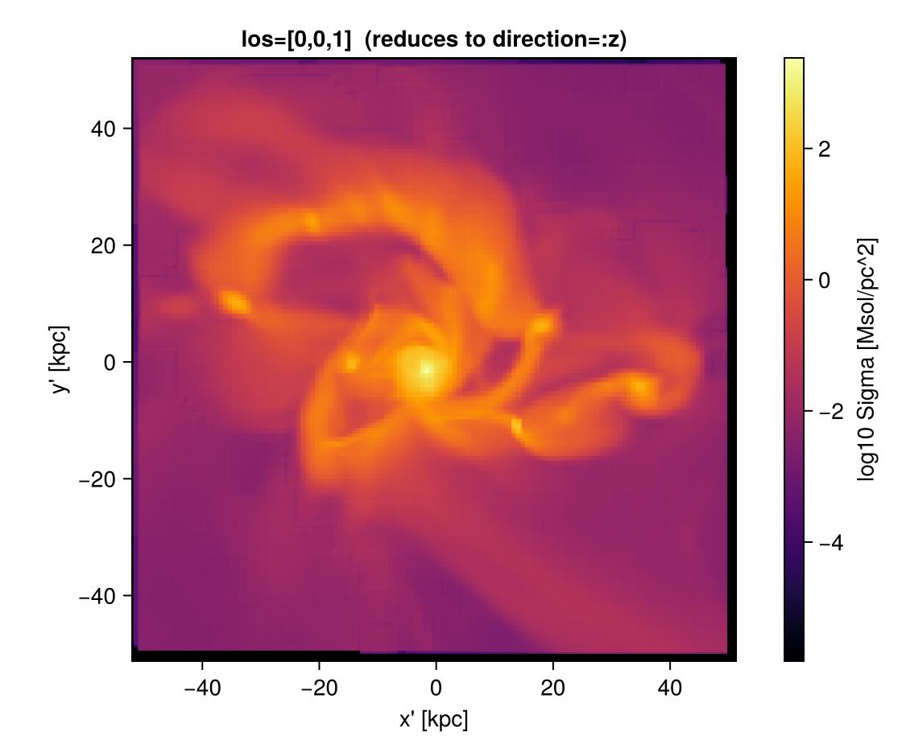

## Specifying the view

The everyday way to choose a view is **inclination** and **azimuth** — exactly how you would
describe tilting an object in front of a camera. All angles are in **degrees by default**
(`angle_unit=:rad` to switch).

- **`inclination`** — tilt away from the reference axis: `0°` looks straight down the axis,
  `90°` looks perpendicular to it.
- **`azimuth`** — rotate the *viewing direction* around the reference axis. (Not to be
  confused with `position_angle`, which rolls the *image* about the line of sight — see below.)
- **`axis`** — the reference axis the angles are measured from. Default `:z` (the box vertical),
  so **no disk is assumed** — this works for clouds, filaments, the cosmic web, anything. For a
  rotating disk set `axis=:angmom` to measure inclination from the object's own spin axis **L**
  (then `inclination=0` is face-on and `90°` is edge-on), or give any vector, e.g. `axis=[1,0,1]`.

!!! note "What is the inclination measured against?"
    `inclination`/`azimuth` are angles relative to the reference `axis` — so their meaning
    depends on that reference, which you choose:

    * **`axis=:z` (default)** is the box vertical, an *arbitrary* direction relative to the
      object. `inclination` is then the tilt from the box vertical — it equals a galaxy's true
      inclination only if its disk happens to be aligned with `z`. This default assumes
      **nothing** about the contents, so it is the right choice for clouds, filaments or the
      cosmic web, where there is no preferred plane.
    * **`axis=:angmom`** (and the shortcuts `direction=:faceon`/`:edgeon`) measure from the
      object's **own angular momentum `L`**, computed from the data. The view then follows the
      disk *however it is tilted in the box* — it is not tied to the box axes. This is only a
      meaningful "disk normal" for a **rotating disk**.

    `L` is computed about `center`, so **center on the object** (its centre of mass): only then
    does `L` reduce to the true spin (the bulk-motion contribution `(Σ m·r)×v_bulk` cancels).
    Off-centre, `L` — and hence "face-on" — is contaminated by the object's orbital motion.

```julia
m = projection(gas, :sd, :Msol_pc2; inclination=60, azimuth=30, axis=:angmom,
               center=[:bc], binning=:overlap, range_unit=:kpc, pxsize=[0.3, :kpc],
               verbose=false, show_progress=false)
println("map size             : ", size(m.maps[:sd]))
println("line of sight w      : ", round.(m.los, digits=3))
showmap(m.maps[:sd], getextent(m, :kpc); title="inclination 60 deg, azimuth 30 deg (axis=:angmom)")
```

```
map size             : (
473, 533)
line of sight w      : [0.743, -0.422, -0.52]
```

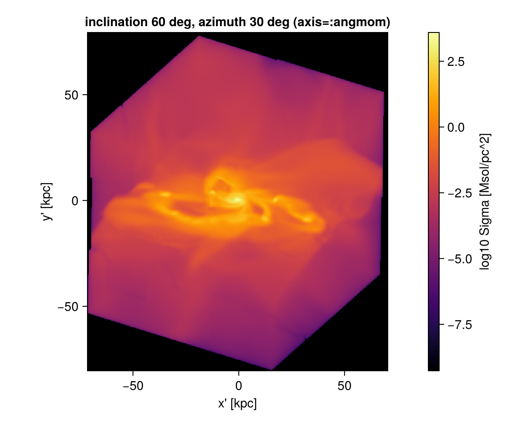

## Gallery: inclination & azimuth

**One galaxy** (`spiral_clumps`), surface density `:sd` with the accurate `binning=:overlap`,
oriented entirely through `inclination`/`azimuth` measured from the disk's own spin axis
(`axis=:angmom`). Every panel uses the same square field of view and pixel count, so they are
directly comparable — only the camera changes, the data do not.

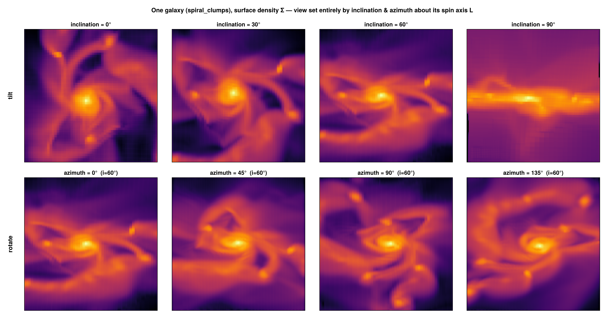

**Top row — inclination only.** Tilt from `i = 0°` (face-on) to `90°` (edge-on) — the clumpy
spiral flattens into a thin disk:

**Bottom row — azimuth at fixed `i = 60°`.** Spin the same tilted disk around its axis
(`azimuth = 0°, 45°, 90°, 135°`):

```julia
fig = Figure(size=(1500, 420))
for (k, i) in enumerate((0, 30, 60, 90))
    p = projection(gas, :sd, :Msol_pc2; inclination=i, axis=:angmom, binning=:overlap,
                   center=[:bc], xrange=[-22,22], yrange=[-22,22], range_unit=:kpc,
                   pxsize=[0.3, :kpc], verbose=false, show_progress=false)
    # :sd is a surface density; multiply by pixel area to recover a mass total per panel
    A = log10.(replace(p.maps[:sd], 0.0 => NaN)); e = getextent(p, :kpc)
    ax = Axis(fig[1,k], aspect=DataAspect(), title="i = $(i) deg"); hidedecorations!(ax)
    heatmap!(ax, range(e[1],e[2],length=size(A,1)), range(e[3],e[4],length=size(A,2)),
             A, colormap=:inferno, nan_color=:black)
end
fig
```

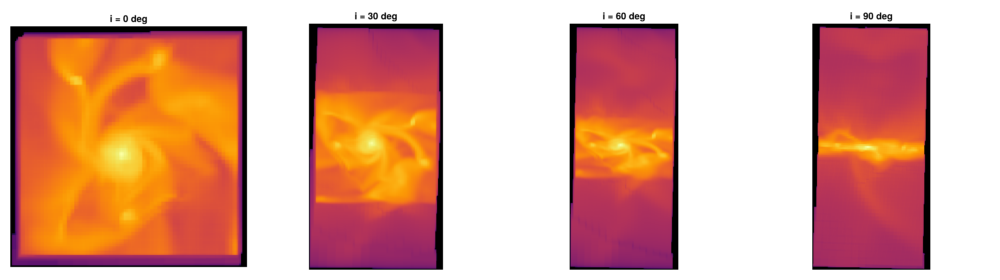

### Other ways to set the view

All of these remain available — pick whichever fits:

Give **exactly one** line-of-sight specifier — combining two (e.g. `los` *and* `inclination`)
raises an error rather than silently picking one, so a wrong figure can't slip through.

| Option | Meaning |
|---|---|
| `inclination`, `azimuth`, `axis` | tilt from a reference axis (recommended; see above) |
| `direction = :faceon` | look **along** the gas/particle spin **L** (disk face-on) |
| `direction = :edgeon` | look **perpendicular** to **L**, camera up along **L** (disk edge-on) |
| `los = [lx, ly, lz]` | explicit line-of-sight vector (need not be normalized) |
| `theta`, `phi` | spherical angles about the box axes, `los = [sinθcosφ, sinθsinφ, cosθ]` |

Two **modifiers** combine with any of the above:

| Modifier | Meaning |
|---|---|
| `position_angle` | image **roll** about the line of sight (the on-sky position angle / camera roll) — leaves the line of sight unchanged, rotates the image |
| `up = [ux, uy, uz]` | explicit camera up-vector (in-plane orientation); by default chosen automatically (reference axis kept pointing up) |

`direction=:faceon`/`:edgeon` are the quick disk shortcuts (`= inclination 0°/90°` with
`axis=:angmom`); they take no `axis` of their own. **Pixel size: prefer `pxsize=[size, :unit]`**
(a physical pixel size, e.g. `pxsize=[50, :pc]` or `pxsize=[0.3, :kpc]`) so resolution means the
same thing regardless of field of view; `res` (a raw pixel count) also works. This applies to
`projection` and `rotation_sequence` alike.

```julia
fo = projection(gas, :sd, :Msol_pc2, direction=:faceon, center=[:bc], binning=:overlap,
                range_unit=:kpc, pxsize=[0.3, :kpc], verbose=false, show_progress=false)
eo = projection(gas, :sd, :Msol_pc2, direction=:edgeon, center=[:bc], binning=:overlap,
                range_unit=:kpc, pxsize=[0.3, :kpc], verbose=false, show_progress=false)

println(":faceon  los = ", round.(fo.los, digits=3), "   up = ", round.(fo.up, digits=3))
println(":edgeon  los = ", round.(eo.los, digits=3), "   up = ", round.(eo.up, digits=3))

fig = Figure(size=(1050, 470))
for (k, (p, t)) in enumerate(((fo, "direction=:faceon"), (eo, "direction=:edgeon")))
    A = log10.(replace(p.maps[:sd], 0.0 => NaN)); e = getextent(p, :kpc)
    ax = Axis(fig[1,k], aspect=DataAspect(), title=t, xlabel="x' [kpc]", ylabel="y' [kpc]")
    heatmap!(ax, range(e[1],e[2],length=size(A,1)), range(e[3],e[4],length=size(A,2)),
             A, colormap=:inferno, nan_color=:black)
end
fig
```

```
:faceon  los = [-0.014, 0.022, -1.0]   up = [1.0, 0.0, -0.014]
:edgeon  los = [1.0, 0.0, -0.014]   up = [-0.014, 0.022, -1.0]
```

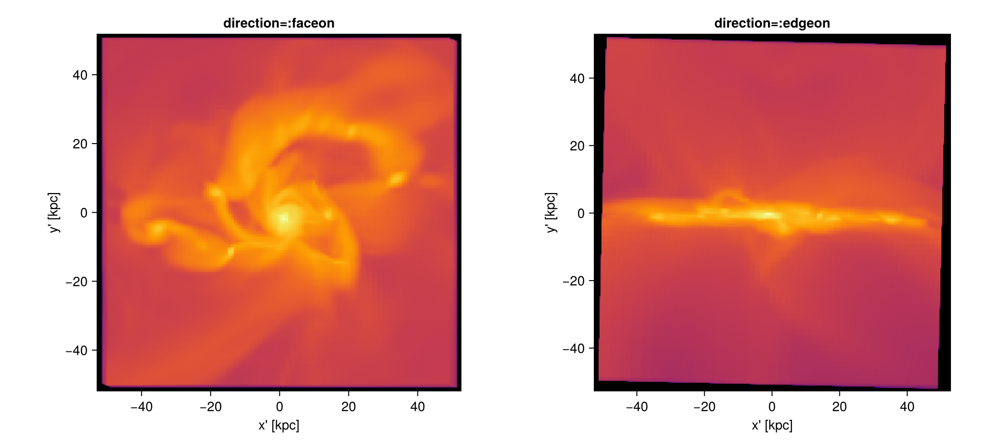

!!! warning "Center on the object for `:faceon`/`:edgeon`/`axis=:angmom`"
    These use the gas/particle angular momentum `L`, which is computed **about `center`**. They
    are only correct if `center` is the object's centre (its centre of mass) — only then does `L`
    reduce to the true spin (the bulk-motion term cancels). The `center=[:bc]` (box centre) used
    in these examples is right only when the object sits at the box centre; otherwise pass the
    object's coordinates. See the note above on what the inclination is measured against.

```julia
# explicit line-of-sight vector + an image roll (position angle leaves the los unchanged)
pr = projection(gas, :sd, :Msol_pc2, los=[1,1,1], position_angle=30, center=[:bc],
                binning=:overlap, range_unit=:kpc, pxsize=[0.3, :kpc],
                verbose=false, show_progress=false)
println("los=[1,1,1] normalized -> ", round.(pr.los, digits=3))
showmap(pr.maps[:sd], getextent(pr, :kpc); title="los=[1,1,1], position_angle=30 deg")
```

```
los=[1,1,1] normalized -> [0.577, 0.577, 0.577]
```

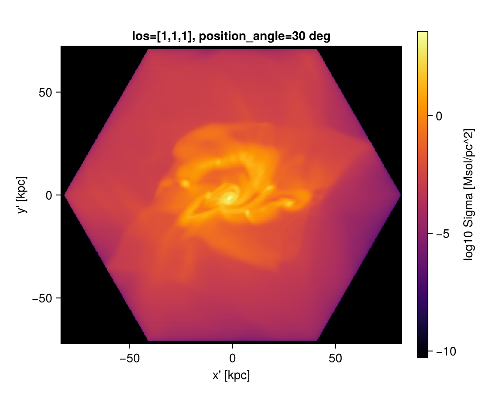

## Binning modes: fast preview vs. accurate

The rotated cells are deposited onto the camera-plane pixel grid with one of four schemes
(keyword `binning`). `:cic`/`:ngp` are the standard nearest-grid-point / cloud-in-cell
particle-mesh assignment (Hockney & Eastwood 1988); `:overlap`/`:exact` are footprint methods:

| `binning` | speed | description |
|---|---|---|
| `:overlap` (default) | accurate, parallel | per-cell **footprint supersampling** (`ns = ceil(cellsize/pixel)` sub-points/axis, capped at `nmax=64`): AMR-aligned, no moiré/holes, converges to `:exact`, usually *faster* than it. `nmax` tunes the quality/speed cap. |
| `:exact` | exact, parallel | **analytic box-spline footprint**: integrates the line-of-sight column (chord length through the cube) over each pixel exactly — the reference for fidelity |
| `:cic` | fast | bilinear deposit of each cell centre — smooth but **speckles/moiré on coarse AMR cells**; fast preview only |
| `:ngp` | fastest | nearest-pixel deposit of each cell centre — sharp preview |

The default `:overlap` (and `:exact`) are AMR-aligned and free of the cell-grid moiré that point
deposits (`:cic`/`:ngp`) leave on coarse cells; use `:cic` only for a quick preview.

### How each AMR cell is treated

Each cell is an axis-aligned cube of side `s = boxlen / 2^ℓ`. The pipeline rotates the cube into the
camera frame `(r̂, û, ŵ)` — `build_camera_basis` (`src/functions/projection/projection.jl`) — projects
its centre to image coordinates `x_cam = r̂·r`, `y_cam = û·r`, then deposits its **projected shadow**
onto the pixel grid. Because the camera basis is orthonormal the rotation preserves volume, which is
the geometric root of the conservation property. The four `binning` kernels differ only in *how* the
shadow is spread across pixels — and every one is a *partition of unity* (the per-cell shares sum to 1),
so the projected total equals the cell total at any angle and any pixel size.


* **`:ngp` / `:cic`** treat the cell as its *centre point* — one nearest pixel, or a 4-pixel bilinear
  stencil. Fast, but a coarse cell that should shadow many pixels collapses to a point (speckle/moiré).
  `deposit_rotated_cells_to_grid!`.
* **`:overlap`** splits the cube into `n³` regularly-spaced sub-points (`n = ⌈cellsize/pixel⌉`, capped
  at `nmax`), each CIC-deposited carrying `weight/n³`. As `n` grows it converges to the true cube
  shadow; a finest-level cell (`n=1`) reduces to plain CIC. `deposit_rotated_cells_overlap!`.
* **`:exact`** integrates the exact line-of-sight chord `L(x,y)` over each pixel analytically (the
  box-spline footprint `M_Ξ`, coloured above by `L`): no sampling, no `nmax` cap. The cube shadow is
  cut at its kink lines into convex pieces where `L` is affine and integrated in closed form.
  `deposit_rotated_cells_exact!` (see the next subsection for the math).

```julia
fig = Figure(size=(1500, 440))
for (k, b) in enumerate((:ngp, :cic, :overlap, :exact))
    p = projection(gas, :sd, :Msol_pc2; los=[1,1,1], binning=b, center=[:bc],
                   range_unit=:kpc, pxsize=[0.2, :kpc], verbose=false, show_progress=false)
    A = log10.(replace(p.maps[:sd], 0.0 => NaN))
    ax = Axis(fig[1,k], aspect=DataAspect(), title="binning = :$(b)"); hidedecorations!(ax)
    heatmap!(ax, A, colormap=:inferno, nan_color=:black)
end
fig
```

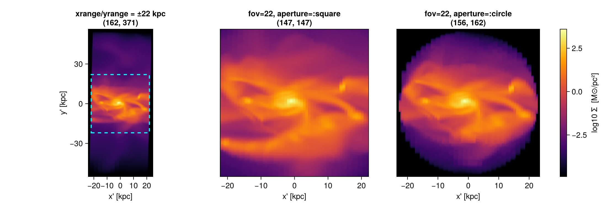

`:overlap` and `:exact` are thread-parallel; control the thread count with `max_threads`.

#### `:exact` — the analytic box-spline footprint

For an orthographic projection the line-of-sight column of a uniform cube is its **X-ray
transform**: the integral, over each pixel, of the chord length `L(x,y)` the sightline cuts
through the axis-aligned cube.

*Why a box spline.* Let the camera basis be `(r, u, ŵ)` (right, up, line of sight). A cube of
side `s` has three edge vectors `s·ê₁, s·ê₂, s·ê₃`; their projections onto the image plane are
the columns of the `2×3` matrix

```
Ξ = s · [ r·ê₁  r·ê₂  r·ê₃ ]
        [ u·ê₁  u·ê₂  u·ê₃ ]
```

The projected column density is the convolution of the three 1-D box functions along the
columns `ξ₁, ξ₂, ξ₃` of `Ξ` — i.e. **the box spline `M_Ξ`** (de Boor, Höllig & Riemenschneider
1993). Its support is the zonotope `ξ₁ ⊕ ξ₂ ⊕ ξ₃` — a hexagon (the cube's shadow) — and it is
piecewise-linear with `∫ M_Ξ = s³` (the cell volume), which is exactly why the deposit conserves
mass. `:exact` integrates `M_Ξ` over each pixel **analytically** (cutting the hexagon at its kink
lines into pieces where `L` is affine, then integrating each piece in closed form), so it is
exact to machine precision, has **no `nmax` cap**, and reduces to the exact area-overlap binner
when `ŵ` is a box axis (then two columns of `Ξ` are axis-aligned and the hexagon collapses to the
cell's square). `:overlap` is a convergent `n³` sampling of this same footprint; `:exact` is its
limit. Cost is `O(covered pixels)` per cell.


Concretely (`_oa_pixel_integral!`): the pixel∩footprint polygon is Sutherland–Hodgman-clipped
(`_oa_clip!`) and split by the kink lines into convex pieces; on each, the entering face (argmax `tmin`)
and exiting face (argmin `tmax`) are fixed, so `L` is affine and `∫∫ = area · L(centroid)`
(`_oa_affine_integral`) is exact — at most 6 splits for a cube, `O(covered pixels)` per cell, no `nmax`
cap. A per-cell renormalisation makes the shares a partition of unity, so the total is conserved to
machine precision.

References: de Boor, Höllig & Riemenschneider, *Box Splines* (Springer 1993); Westover, *Footprint
Evaluation for Volume Rendering* (SIGGRAPH 1990). Among **AMR** tools an analytic off-axis cell
footprint is, to our knowledge, uncommon — yt ray-casts and most others resample to a uniform
grid; SPH codes (SPLASH) integrate analytic kernels for particles rather than cells.

### How the methods differ — and why it is *not* visible in the conserved total

All three modes conserve the projected **total** to machine precision — that is a
partition-of-unity property of the deposit (every cell distributes its full weight across
pixels; Hockney & Eastwood 1988), proven in the
[Conservation page](offaxis_conservation_proof.md). Conservation is *necessary but not
sufficient*: it says nothing about **where** the mass lands.

`:cic`/`:ngp` deposit each cell at its **rotated centre**. When the map out-resolves the data —
i.e. a cell's projected shadow is larger than a pixel — a coarse cell illuminates only one pixel
(`:ngp`) or a 2×2 stencil (`:cic`) and leaves the rest of its true footprint **empty**.
`:overlap`/`:exact` fill the cell's rotated footprint instead. The figure below shows the same
off-axis view of a uniform-grid galaxy at high resolution: `:ngp` is a sparse lattice of lit
pixels, `:cic` is speckled, while `:overlap` and `:exact` are smooth and hole-free —
**yet all four sum to the identical total.**

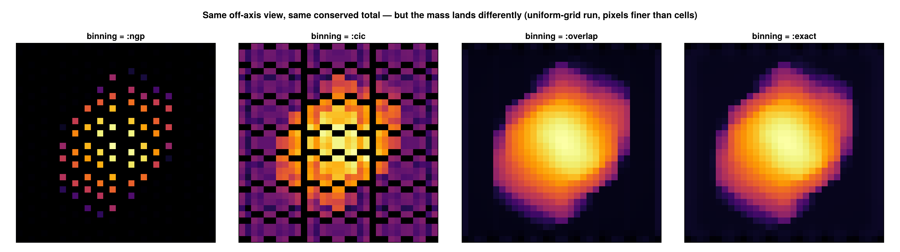

The discrepancy **grows** as the pixel size drops below the cell size and **vanishes** when
pixels are larger than cells (then all coincide). This is verified quantitatively in
`test/35_offaxis_accuracy_tests.jl` (empty-pixel fraction and L1 difference vs. resolution).

**When to use which:**

| Situation | Recommended `binning` |
|---|---|
| default — correct, AMR-aligned | **`:overlap`** (or `:exact`) |
| interactive exploration, quick look | `:cic` or `:ngp` (preview) |
| map resolution ≲ data resolution (pixels ≥ cells) | any — they agree |
| publication figures, pixels finer than cells (zoom-ins, coarse AMR regions) | **`:exact`** or **`:overlap`** |
| quantitative per-pixel column / optical-depth work | **`:exact`** |

**Performance.** `:cic`/`:ngp` cost ~one deposit per cell. `:overlap` costs ~`n³` sub-deposits
per cell, where `n = ⌈cellsize/pixel⌉` is capped at `nmax` (default 64): it converges to `:exact`
and is artifact-free for cells up to ~64 px, and is often *faster* than `:exact` (dense threaded
supersampling vs. per-cell polygon integration). `:exact` costs `O(covered pixels)` per cell with
no cap; for finest-level cells (shadow ≤ pixel) both reduce to a `:cic` stencil at no extra cost.
All four are **mass-conserving**. Use `:cic` only for quick iteration; `:exact`/`:overlap`
otherwise.

```julia
Mtot = sum(getvar(gas, :mass, :Msol))
println("ground truth  sum(getvar mass)  [Msol] = ", Mtot)
for b in (:ngp, :cic, :overlap, :exact)
    p = projection(gas, :mass, :Msol; los=[1,1,1], binning=b, center=[:bc],
                   pxsize=[0.2, :kpc], verbose=false, show_progress=false)
    s = sum(p.maps[:mass])
    println(rpad("binning=:$(b)", 18), "map sum = ", s,
            "   relerr = ", abs(s - Mtot) / Mtot)
end
```

```
ground truth  sum(getvar mass)  [Msol] = 2.1129541669444336e10
binning=:ngp
map sum = 2.1129541669444336e10   relerr = 0.0
binning=:cic      map sum = 2.1129541669444336e10   relerr = 0.0
binning=:overlap  map sum = 2.112954166944434e10   relerr = 1.8053857131891677e-16
binning=:exact    map sum = 2.112954166944429e10   relerr = 2.166462855827001e-15
```

## Accuracy of off-axis projection

Projecting an adaptively-refined mesh along a tilted line of sight is harder than along a box
axis, and there are a few *generic* accuracy pitfalls worth understanding — they apply to any
off-axis projector, and Mera is designed to avoid them:

- **Sampling vs. integration.** A tilted sightline can be evaluated by *sampling* interpolated
  values at points along the ray, or by *integrating* each cell's actual contribution. Point
  sampling is fast but its error depends on the angle and on how the sample spacing compares to
  the cell size, and it does not in general conserve the projected total. Mera integrates the
  exact line-of-sight column of every cell analytically (`binning=:exact`, the box-spline
  footprint), so the projected total is conserved to machine precision at *any* angle — see the
  [Conservation Proof](offaxis_conservation_proof.md).

- **Coarse-cell footprint coverage.** When the map is finer than the data, a cell's projected
  shadow spans many pixels. Depositing only at the cell *centre* (`:cic`/`:ngp`) leaves the rest
  of that shadow empty — the speckled "holes" you see at high resolution. The footprint modes
  (`:overlap`, `:exact`) fill the whole rotated shadow, so a coarse cell illuminates every pixel
  it actually covers. `:exact` is hole-free at every resolution.

- **Pixel-vs-cell aliasing.** As the pixel size drops below the cell size the centre-deposit and
  footprint results diverge; as it rises above the cell size they converge. `:exact` removes the
  aliasing by construction (it integrates the cell over the pixel rather than sampling it).

- **Depth / slab selection.** A thin line-of-sight slab (via `zrange`) is selected by cell
  membership along the viewing direction, so a slab edge is resolved to about one cell size; the
  *full* column (no `zrange`) is what conserves the total exactly. Choose the full column when an
  exact budget matters, and a slab only when you deliberately want a thin cut.

- **Resampling.** Re-gridding AMR onto a uniform mesh before projecting is convenient but loses
  information at refinement boundaries and is not exactly conservative. Mera projects the native
  cells directly, so no intermediate resampling step is involved.

These properties are not just asserted — they are checked on real data in the test suite
(`test/33`–`test/35`: exactness of the footprint, conservation across angle × pixel size ×
binning, and hole-free coverage). The practical upshot: use `:cic` for fast exploration, and
`:exact` (or `:overlap`) whenever the numbers, not just the picture, need to be trusted.

## Supported variables

Off-axis views support the standard hydro/RT/gravity/particle fields, `:sd` and `:mass`, and you
can request **several at once** — the result holds one map per variable:

```julia
mv = projection(gas, [:sd, :vx, :T], [:Msol_pc2, :km_s, :K];
                inclination=35, axis=:angmom, center=[:bc], binning=:overlap,
                range_unit=:kpc, pxsize=[0.3, :kpc], verbose=false, show_progress=false)
println("maps returned : ", collect(keys(mv.maps)))
for v in (:sd, :vx, :T)
    println(rpad(String(v), 4), " extrema = ", extrema(filter(isfinite, mv.maps[v])))
end

e = getextent(mv, :kpc); fig = Figure(size=(1450, 440))
for (k, (v, cm, lab, lg)) in enumerate(((:sd, :inferno, "log10 Sigma", true),
                                        (:vx, :balance, "vx [km/s]", false),
                                        (:T,  :viridis, "log10 T", true)))
    A = lg ? log10.(replace(mv.maps[v], 0.0 => NaN)) : mv.maps[v]
    ax = Axis(fig[1,2k-1], aspect=DataAspect(), title=String(v))
    hm = heatmap!(ax, range(e[1],e[2],length=size(A,1)), range(e[3],e[4],length=size(A,2)),
                  A, colormap=cm, nan_color=:black)
    Colorbar(fig[1,2k], hm, label=lab); hidedecorations!(ax)
end
fig
```

```
maps returned : Any
[:T, :sd, :vx]
sd   extrema = (0.0, 2827.7041211772107)
vx   extrema = (-2399.6880068444048, 608.7106924361965)
T    extrema = (0.0, 6.859898060886285e7)
```

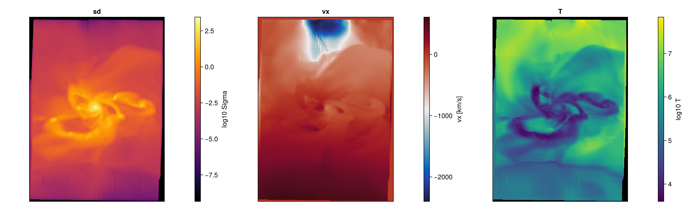

A single inclined projection call yields the surface density, the mass-weighted line-of-sight-axis
velocity component, and the mass-weighted temperature — all sharing the same geometry:

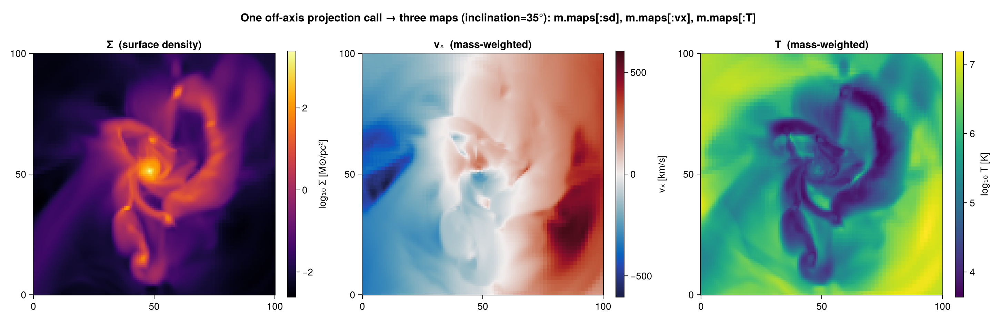

Map-only quantities whose definition is tied to the projection axis — `:r_cylinder`,
`:r_sphere`, `:ϕ`, and the velocity dispersions `:σx`/`:σy`/`:σz`/`:σ`/`:σr_cylinder`/`:σϕ_cylinder`
— require an axis-aligned `direction=:x/:y/:z`.

## Particles and gravity

The same options work for **particle data** (stars, dark matter) and for the combined
hydro+gravity interface — using the particles' own angular momentum for `axis=:angmom` /
`:faceon` / `:edgeon`:

```julia
part = getparticles(info, verbose=false, show_progress=false)
ps = projection(part, :sd, :Msol_pc2; direction=:edgeon, center=[:bc],
                range_unit=:kpc, pxsize=[0.3, :kpc], verbose=false, show_progress=false)
println("stellar particles   : ", length(part.data))
println("particle map size   : ", size(ps.maps[:sd]))
showmap(ps.maps[:sd], getextent(ps, :kpc);
        title="stellar surface density, edge-on")
```

```
stellar particles   : 453200
particle map size   : (342, 343)
```

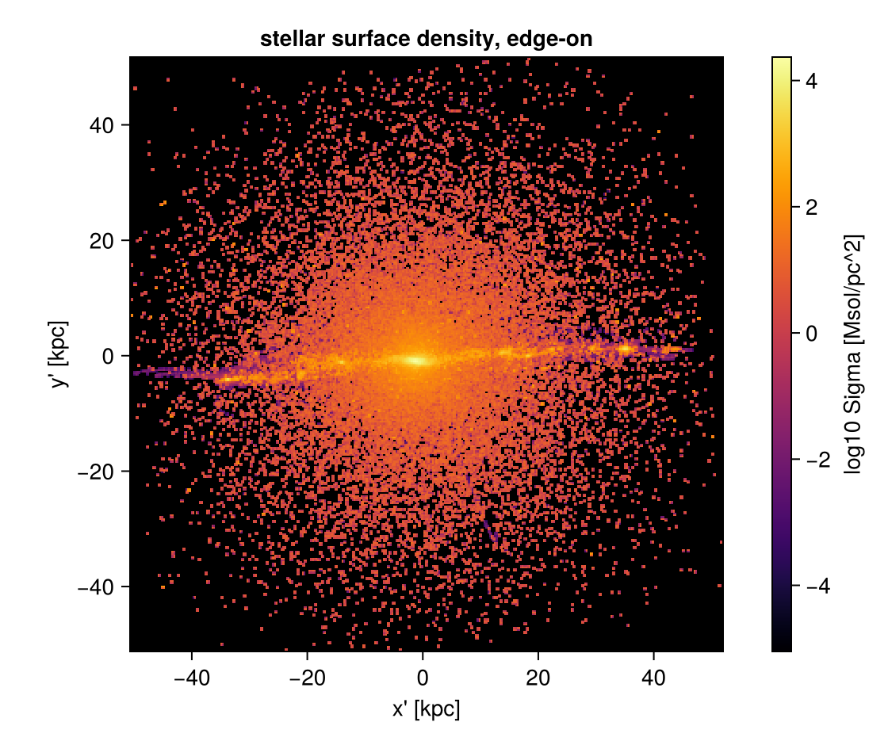

The stellar disk of a galaxy, viewed off-axis from face-on to edge-on (spiral structure flattens
into a thin disk; the sparse outskirts show individual stellar particles):

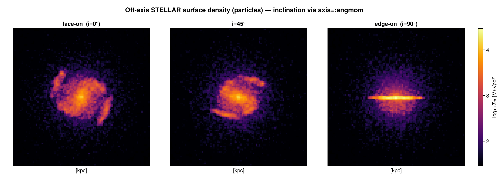

Particles are points (no cell footprint), so for particles `binning=:overlap` falls back to
`:cic`.

```julia
# off-axis gravitational potential on the hydro grid (combined hydro + gravity), face-on
grav = getgravity(info, verbose=false, show_progress=false)
pe = projection(gas, grav, :epot; direction=:faceon, center=[:bc], binning=:overlap,
                range_unit=:kpc, pxsize=[0.3, :kpc], verbose=false, show_progress=false)
println("epot map extrema    : ", extrema(filter(isfinite, pe.maps[:epot])))
showmap(pe.maps[:epot], getextent(pe, :kpc);
        title="gravitational potential, face-on", clabel="Phi", logscale=false, cmap=:viridis)
```

```
epot map extrema    : (-0.5326800611083272, 0.0)
```

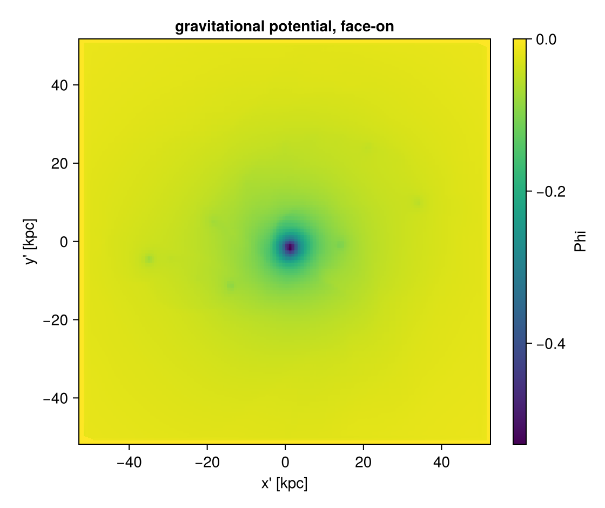

The off-axis gravitational potential of the same galaxy (mass-weighted `:epot`), face-on and
edge-on — the central potential well is round seen face-on and flattened along the disk edge-on:

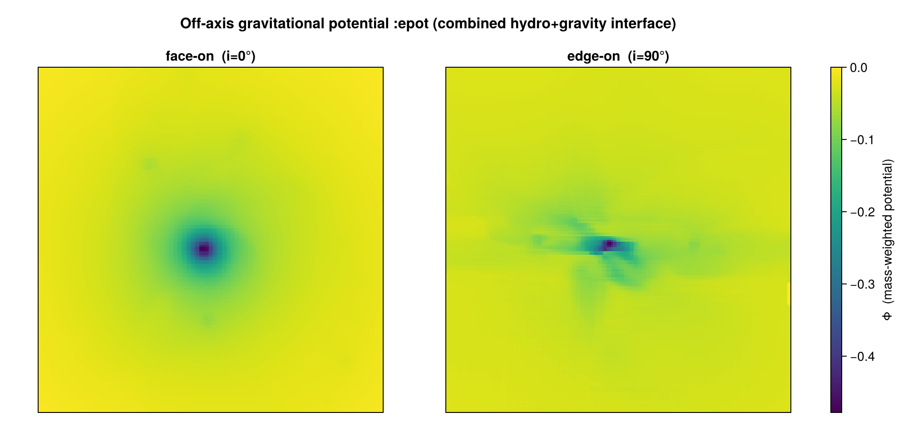

## Field of view and depth

* When `xrange`/`yrange` are left at their defaults the camera-plane extent is the **rotated
  bounding box** of the selected cells (the whole object is visible). Setting `xrange`/`yrange`
  defines a camera-plane window instead.
* When `zrange` is narrowed it acts as a **line-of-sight depth slab** along the viewing
  direction; the default (full box) includes all selected cells.
* The pixel size is set via `pxsize=[size, :unit]` (preferred) or as `boxlen/res`, identical to the
  axis-aligned path.

## A complete example

Load → project off-axis → access the map → plot → save:

```julia
m = projection(gas, :sd, :Msol_pc2; direction=:faceon, binning=:overlap,
               center=[:bc], range_unit=:kpc, pxsize=[0.3, :kpc],
               verbose=false, show_progress=false)

img = log10.(replace(m.maps[:sd], 0.0 => NaN))   # the 2D map (Msol/pc^2), log-scaled
ext = getextent(m, :kpc)                  # physical extent of the map [kpc]
println("map array size      : ", size(img))
println("physical extent kpc : ", round.(ext, digits=2))

fig = Figure(size=(560, 470))
ax  = Axis(fig[1,1], aspect=DataAspect(), xlabel="x' [kpc]", ylabel="y' [kpc]")
hm  = heatmap!(ax, range(ext[1], ext[2], length=size(img,1)),
                   range(ext[3], ext[4], length=size(img,2)), img,
                   colormap=:inferno, nan_color=:black)
Colorbar(fig[1,2], hm, label="log10 Sigma [Msol/pc^2]")
fig
```

```
map array size      : (351, 347)
physical extent kpc : [-52.19, 52.9, -51.3, 52.59]
```

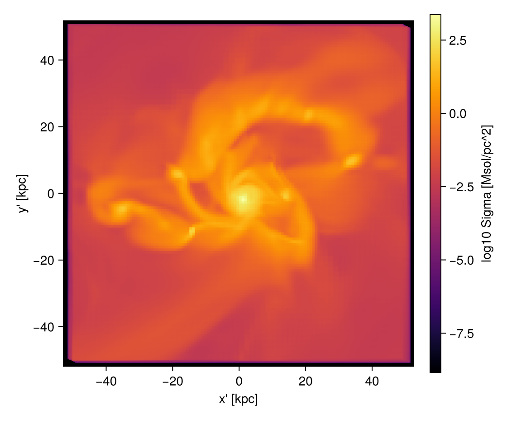

For the shared keywords (`center`, `range_unit`, `xrange`/`yrange`/`zrange`, `res`/`pxsize`,
`weighting`, `mode`) see the axis-aligned [hydro projection](06_hydro_Projection.md) and
[particle projection](06_particles_Projection.md) tutorials — off-axis adds only the
view-orientation keywords documented here.

## Kinematics & synthetic observations

Because the camera knows the viewing direction `ŵ`, Mera can turn an off-axis projection into the
quantities an observer actually measures: line-of-sight velocity/dispersion maps, off-axis cutting
planes, and orbit movies.

!!! note "Column integral, emission+absorption and FITS export ship separately"
    The off-axis **column integral** (`∫ q dl`), the **emission+absorption** radiative-transfer
    mock image, and **FITS export** now live in an in-development module
    (`MeraOffAxisSynthObs` / `MeraFITS`, `dev/offaxis_synthobs/`) that ships **separately** from
    the released Mera package. Likewise, line-of-sight PPV cubes, per-pixel spectra, moment maps,
    position–velocity diagrams and `mock_observe` (beam/PSF convolution + per-pixel noise) live in
    a separate in-development module. The projection quantities `:vlos`/`:σlos` and the tools
    documented below remain part of Mera.

**Line-of-sight velocity and dispersion** — `:vlos = v·ŵ` (mass-weighted), and `:σlos` =
√(⟨v²⟩−⟨v⟩²) along the same direction. Unlike the axis-tied `:σx`/`:σy`/`:σz`, these are defined
for *any* line of sight:

```julia
win = (center=[:bc], xrange=[-15,15], yrange=[-15,15], range_unit=:kpc, pxsize=[0.15,:kpc])
pv = projection(gas, :vlos, :km_s; direction=:edgeon, win..., verbose=false, show_progress=false)
ps = projection(gas, :σlos, :km_s; direction=:edgeon, win..., verbose=false, show_progress=false)
ext = getextent(pv, :kpc)
fig = Figure(size=(1050,430))
v = pv.maps[:vlos]; vl = maximum(abs.(filter(isfinite, v)))*0.9
ax1 = Axis(fig[1,1], aspect=DataAspect(), title="v_LOS [km/s] (edge-on)", xlabel="x' [kpc]", ylabel="y' [kpc]")
h1 = heatmap!(ax1, range(ext[1],ext[2],length=size(v,1)), range(ext[3],ext[4],length=size(v,2)), v;
              colormap=:balance, colorrange=(-vl,vl), nan_color=:black); Colorbar(fig[1,2], h1)
s = ps.maps[:σlos]
ax2 = Axis(fig[1,3], aspect=DataAspect(), title="σ_LOS [km/s]", xlabel="x' [kpc]")
h2 = heatmap!(ax2, range(ext[1],ext[2],length=size(s,1)), range(ext[3],ext[4],length=size(s,2)), s;
              colormap=:viridis, nan_color=:black); Colorbar(fig[1,4], h2)
fig
```

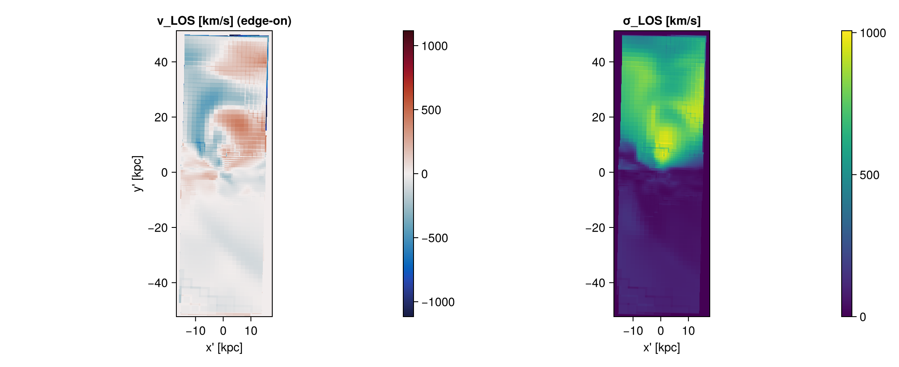

These build directly on the line-of-sight depth/velocity that the off-axis camera already
computes; the deposit uses the conservative CIC scheme (Hockney & Eastwood 1988), so the maps
conserve the total mass.

### Off-axis cutting plane

[`slice`](@ref) with any off-axis view keyword (`los`/`inclination`/`direction=:edgeon`/…) returns an
off-axis **cutting plane** (the field *on* the plane, not integrated through it). Each pixel gets the
value of the cell the plane passes through (a nearest-cell sample — resolution-dependent, not
mass-conserving), so reach for [`projection`](@ref) when you need a conserved column. (`offaxis_slice`
is the equivalent explicit name; axis-aligned keywords instead give the covering-grid cut.)

```julia
swin = (center=[:bc], xrange=[-15,15], yrange=[-15,15], range_unit=:kpc, pxsize=[0.12,:kpc])
sf = slice(gas, :rho, :nH; direction=:faceon, swin..., verbose=false)
se = slice(gas, :rho, :nH; direction=:edgeon, swin..., verbose=false)
si = slice(gas, :rho, :nH; inclination=60, azimuth=30, axis=:angmom, swin..., verbose=false)
fig = Figure(size=(1500,440))
for (k,(sl,t)) in enumerate(((sf,"face-on (midplane)"),(se,"edge-on (vertical cut)"),(si,"inclined 60 deg")))
    ax = Axis(fig[1,k], aspect=DataAspect(), title="$t  nH"); hidedecorations!(ax, label=false)
    ex = sl.extent .* gas.scale.kpc
    heatmap!(ax, range(ex[1],ex[2],length=size(sl.map,1)), range(ex[3],ex[4],length=size(sl.map,2)),
             log10.(map(x-> x>0 ? Float64(x) : NaN, sl.map)); colormap=:inferno, nan_color=:black)
end
fig
```

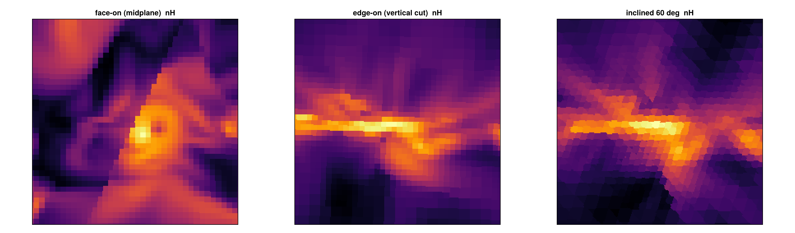

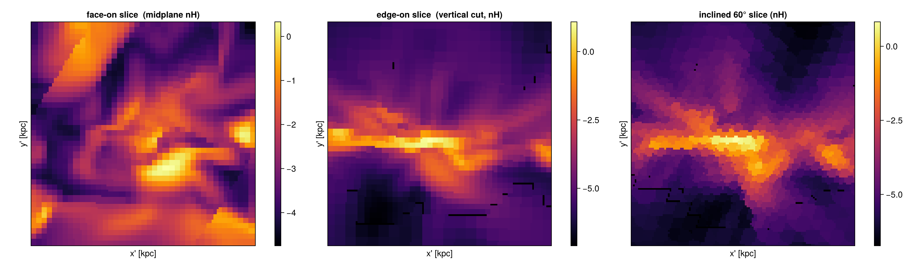

Pass an `xrange`/`yrange` window (as above) so the frame fills; without one the auto-fit frame is
the bounding box of the rotated view and its corners — where the plane∩box polygon has no cell —
come back `NaN` (expected geometry, shown black). The few black specks in the thin edge-on cut are
the inherent sub-percent nearest-cell gaps at AMR refinement boundaries.

!!! note "Why inclined slices show tilted, non-square cells"
    A slice is the **intersection of the camera plane with each cubic cell**, so each cell is drawn
    as that intersection. Cut **face-on** a cube gives a square; cut **at an angle** it gives a
    polygon (a parallelogram, or a hexagon in general), elongated along the tilt direction — a pixel
    belongs to a cell when `|x'·r̂ₖ + y'·ûₖ − cellₖ| ≤ ½·cellsize` on all three axes `k`, i.e. the
    intersection of three tilted slabs. So the tilted, elongated blocks in an inclined slice are the
    **true shape of the cut, not an artefact**; they are largest for the coarse, low-density cells
    and shrink with refinement (the dense, finely-refined midplane looks smooth). For a smooth,
    resolution-independent map use [`projection`](@ref) (a line-of-sight integral) instead of a slice.

Not line-of-sight specific, but often used alongside projections: `profile` (1D) and `phase` (2D
weighted histograms, e.g. density–temperature) are general reductions over any field — see
[Profiles & Phase Diagrams](profiles_phase.md).

### Orbit movies

[`rotation_sequence`](@ref) renders an angle sweep with **one shared field of view**, so frames
don't jitter (a plain per-angle `projection` recomputes the extent each frame). It returns a vector
of map objects — one per angle — ready to assemble into a montage or animate:

```julia
frames = rotation_sequence(gas, :sd, :Msol_pc2; sweep=:azimuth, angles=0:60:300, inclination=55,
                           axis=:angmom, center=[:bc], pxsize=[0.25,:kpc], aperture=:square, verbose=false)
fig = Figure(size=(1500,280))
for (k,f) in enumerate(frames)
    ax = Axis(fig[1,k], aspect=DataAspect(), title="azimuth $((k-1)*60) deg"); hidedecorations!(ax)
    heatmap!(ax, log10.(map(x-> x>0 ? Float64(x) : NaN, f.maps[:sd])); colormap=:inferno, nan_color=:black)
end
fig
# animate to a GIF:
#   record(Figure(), "orbit.gif", eachindex(frames); framerate=8) do k
#       heatmap!(Axis(current_figure()[1,1]), log10.(frames[k].maps[:sd]); colormap=:inferno); end
```

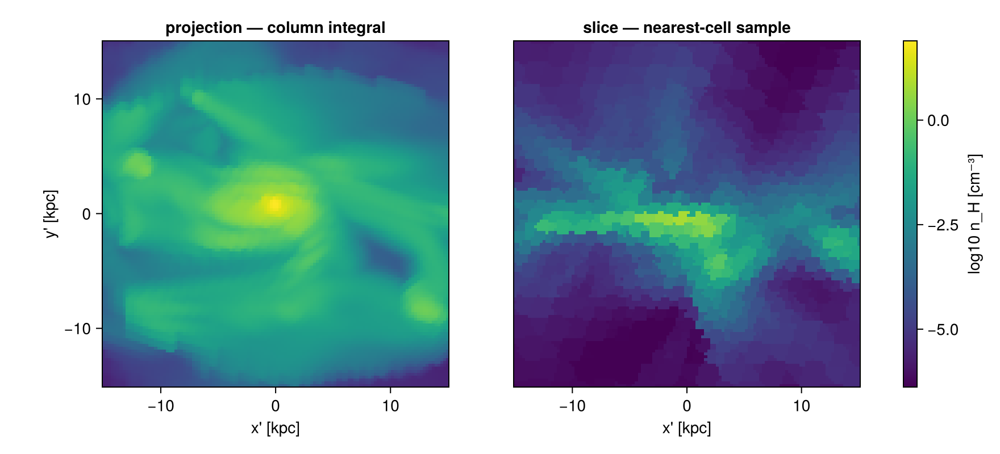

`record` chooses the format from the extension — `"orbit.mp4"` writes an H.264 video (smaller and
higher quality; a fine sweep like `angles=0:10:350` stays a few hundred kB vs several MB as a GIF),
`"orbit.gif"` an animated GIF. `compression` (0–51, lower = better) tunes mp4 quality, `framerate`
the speed. No extra packages — CairoMakie ships the encoder.

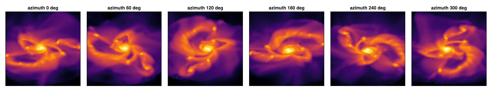

```@raw html
<video src="../assets/offaxis/orbit_movie.mp4" autoplay loop muted playsinline width="420"></video>
```

*Orbit movie (mp4) — azimuth sweep at 55° inclination;* [GIF version](assets/offaxis/orbit_movie.gif).

Each frame is a `projection` of the chosen quantity (here `:sd`) at that viewing angle. The off-axis
camera is **orthographic** (parallel rays) — there is no perspective, so "moving the camera away"
does nothing; the only control over what is in frame is the **`fov`** (omit it to auto-fit the galaxy
— the mass-enclosed 99% radius — or set it explicitly to zoom in). Because each frame fills the
image, a **larger `fov` shows the same galaxy smaller**:

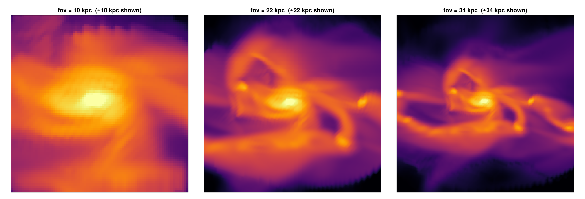

(With `aperture=:square` the FOV is bounded by the box — the √2·`fov` selection sphere must fit — so
to zoom out further than this use `aperture=:circle`, which allows a larger `fov`.)

The FOV must be **rotation-invariant** or the frame would breathe with angle, so a sphere of
radius `fov` is used; `aperture` picks how it is framed:

| `aperture` | frame | corners |
|---|---|---|
| `:circle` (default) | the sphere → a **circular aperture** | empty (no data beyond radius `fov`) |
| `:square` | a √2·`fov` sphere cropped to the `±fov` square → a **full rectangular frame** | filled (no data dropped inside) |

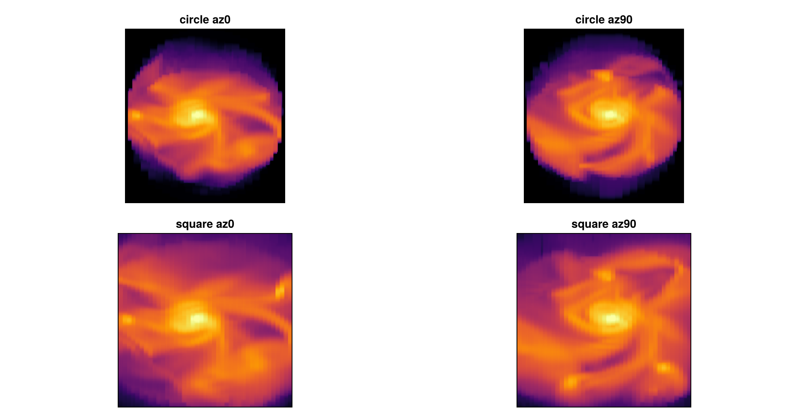

`sweep` can also be `:inclination` (tip from face-on to edge-on) or `:position_angle` (roll the camera).

### Orbit movies work for any projectable data type

`rotation_sequence` (and `slice`, and the off-axis `projection`) work on **hydro**,
**particles** (stars/DM) and **RT** alike. Caveats: particles use `axis=:angmom` like hydro; **RT**
has no velocity, so use a fixed `axis=:z` (or pass `hydro_data=`) instead of `:angmom`; **gravity** is
projected via the combined `projection(hydro, gravity, …)` form, so it isn't taken directly by
`rotation_sequence`. Here is an orbit of the **stars** (particle surface density):

```julia
parts = getparticles(info, verbose=false, show_progress=false)   # the star/DM particles
sframes = rotation_sequence(parts, :sd, :Msol_pc2; sweep=:azimuth, angles=0:90:270, inclination=55,
                            axis=:angmom, center=[:bc], pxsize=[0.4,:kpc], aperture=:square, verbose=false)
fig = Figure(size=(1100,300))
for (k,f) in enumerate(sframes)
    ax = Axis(fig[1,k], aspect=DataAspect(), title="stars, azimuth $((k-1)*90) deg"); hidedecorations!(ax)
    heatmap!(ax, log10.(map(v-> v>0 ? Float64(v) : NaN, f.maps[:sd])); colormap=:bone, nan_color=:black)
end
fig
```

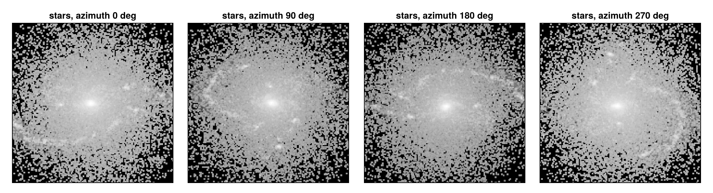

## RT (radiative-transfer) data

Off-axis projection works on **any** grid field — including **RT** photon fields. RT data has no
velocity or mass, so it cannot derive the disk's angular momentum: `:faceon`/`:edgeon` won't work
on RT alone — give an explicit `los=[…]` (or pass `hydro_data=` to borrow the orientation). Here we
load the Strömgren-sphere RT test and project the group-1 photon density `:Np1` along a tilted LOS.

```julia
infoRT = getinfo(joinpath(base, "RAMSES/rt_stromgren"), verbose=false)
rt = getrt(infoRT, verbose=false, show_progress=false)
println("RT groups available: ", infoRT.rt_variable_list)
pr = projection(rt, :Np1; los=[1,1,1], center=[:bc], verbose=false, show_progress=false)   # off-axis RT
showmap(pr.maps[:Np1], getextent(pr, :kpc); title="RT photon density Np1 (los=[1,1,1])", clabel="log10 Np1")
```

```
RT groups available:
[:Np1, :Fx1, :Fy1, :Fz1, :Np2, :Fx2, :Fy2, :Fz2, :Np3, :Fx3, :Fy3, :Fz3]
```

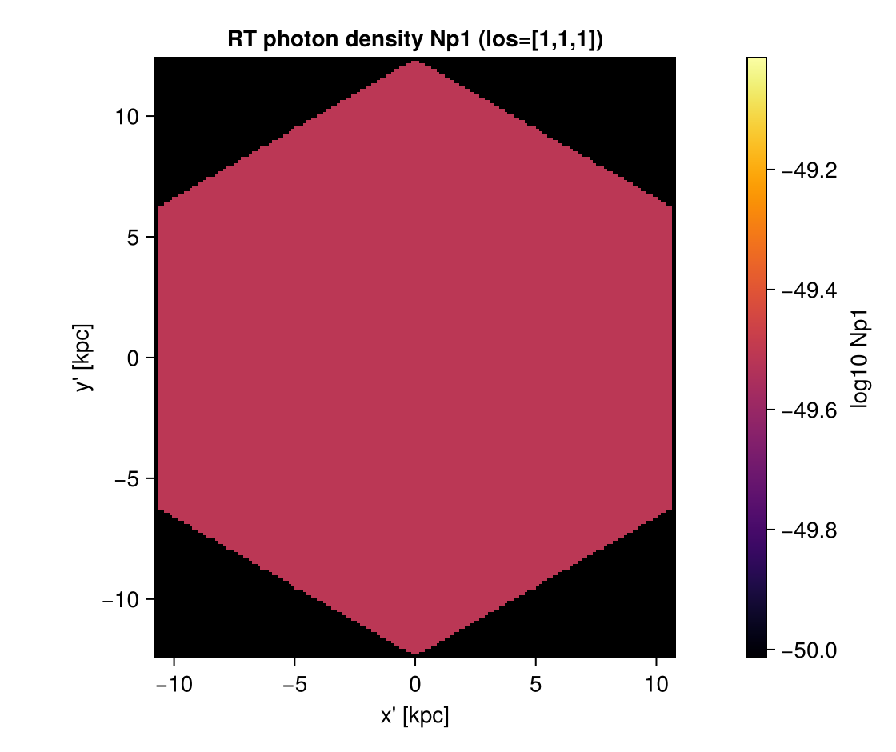

## Parallelization

The accurate `:overlap` deposit is **multi-threaded**: the cells are split into contiguous chunks,
each accumulated into its own thread-local grid and summed at the end (a partition that keeps the
result independent of the chunking, verified in `test/35_offaxis_accuracy_tests.jl`). To use it,
start Julia with several threads and the deposit scales automatically; `max_threads` caps how many
are used for a given call:

**Strong scaling.** The figure below is produced by exactly the benchmark that follows — time one
off-axis `:overlap` projection (`pxsize=[0.2, :kpc]`, a 500² map) of the `gas` loaded above at increasing thread counts
(start Julia with `julia -t N`), taking the best of 3 runs per count:

```julia
nts = collect(1:Threads.nthreads())
proj1(nt) = projection(gas, :sd, :Msol_pc2; los=[1,1,1], center=[:bc], pxsize=[0.2, :kpc],
                       binning=:overlap, max_threads=nt, verbose=false, show_progress=false)
proj1(1)                                              # warm up (compile)
times   = [ @elapsed proj1(nt) for nt in nts ]
speedup = times[1] ./ times
fig = Figure(size=(560,420))
ax  = Axis(fig[1,1], xlabel="threads", ylabel="speed-up", title="off-axis projection thread scaling")
lines!(ax, nts, Float64.(nts), linestyle=:dash, color=:gray, label="ideal")
scatterlines!(ax, nts, speedup, label="measured")
axislegend(ax, position=:lt)
fig
```

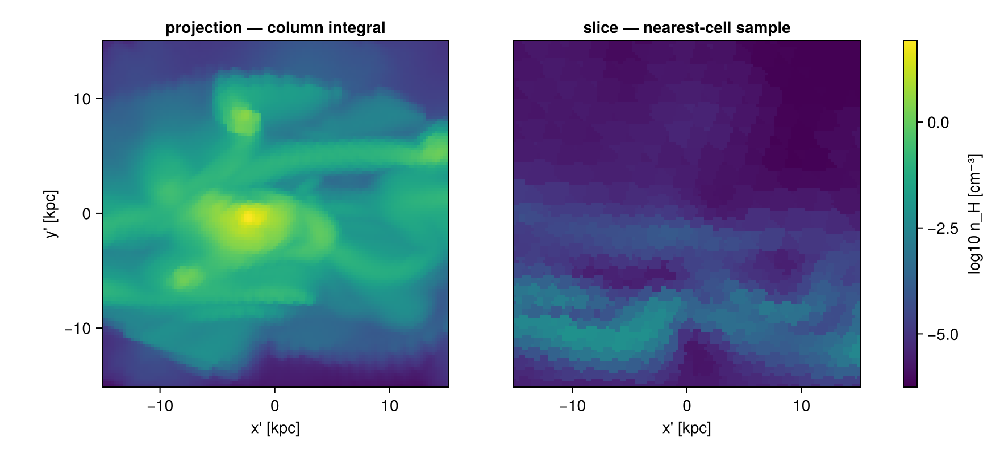

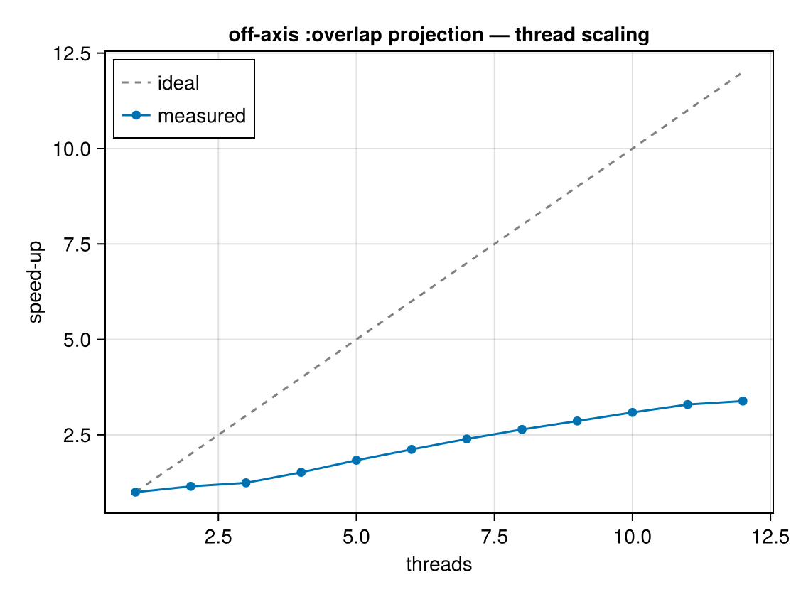

On `spiral_clumps` (a small 590k-cell AMR galaxy) this gives ≈1.2× / 1.5× / 2.6× / 3.4× on 2 / 4 / 8 /
12 threads (your numbers depend on the machine and problem size). It falls short of the ideal linear
line because the per-cell value/coordinate setup (`getvar`) runs serially — an Amdahl ceiling, not a
deposit inefficiency — and a small box has relatively little deposit work to amortise it; a larger box
or higher `res` scales better. `:cic`/`:ngp` previews are already cheap and run serially. For
**animations** (many frames) the bigger lever is parallelism *across frames*:
[`rotation_sequence`](@ref)`(…; parallel_frames=true)` runs the frames concurrently (each projection
single-threaded), ≈1.5–2× on top. For a single high-resolution publication frame, `:overlap` with all
threads is the fast path.

## Overlay the AMR grid — `gridoverlay`

`gridoverlay` returns the AMR cell-boundary line segments at a chosen refinement `level`, viewed
through the **same off-axis camera** as the projection (it takes the identical `los`/`inclination`/
`direction`/`center`/range keywords). Draw them over the map with the `gridoverlay!(ax, go)` Makie
helper (or `linesegments!`).
`level=:max` shows the finest cells (densest), a coarser level or `:min` the base grid. Here we
overlay the finest grid on a zoomed face-on map, so the net traces the refined disk.

```julia
gwin = (center=[:bc], xrange=[-8,8], yrange=[-8,8], range_unit=:kpc)
mg = projection(gas, :sd, :Msol_pc2; direction=:faceon, gwin..., pxsize=[0.15,:kpc], verbose=false, show_progress=false)
go = gridoverlay(gas; level=:max, direction=:faceon, gwin..., unit=:kpc)   # AMR cell edges, same camera
ext = getextent(mg, :kpc)
fig = Figure(size=(580,520))
ax  = Axis(fig[1,1], aspect=DataAspect(), title="off-axis Sigma + AMR grid (lmax)", xlabel="x' [kpc]", ylabel="y' [kpc]")
heatmap!(ax, range(ext[1],ext[2],length=size(mg.maps[:sd],1)), range(ext[3],ext[4],length=size(mg.maps[:sd],2)),
         log10.(replace(mg.maps[:sd], 0.0=>NaN)); colormap=:inferno, nan_color=:black)
gridoverlay!(ax, go; color=(:cyan, 0.35))
fig
```


## Camera metadata on the result

The returned `AMRMapsType` / `PartMapsType` stores the camera basis used:

```julia
println("direction  : ", m.direction)
println("los   (w)  : ", round.(m.los,       digits=4))
println("up         : ", round.(m.up,        digits=4))
println("cam_right  : ", round.(m.cam_right, digits=4))
println("center     : ", round.(m.center,    digits=4))
```

```
direction  : offaxis
los   (w)  : [-0.0144, 0.0222, -0.9997]
up         : [0.9999, 0.0003, -0.0143]
cam_right  : [0.0, 0.9998, 0.0222]
center     : [0.5, 0.5, 0.5]
```

## Troubleshooting

| Symptom | Likely cause / fix |
|---|---|
| edge-on looks face-on (or vice-versa) | `L` is wrong — `center` is not on the object; pass the object's centre so `:faceon`/`:edgeon`/`axis=:angmom` use the true spin |
| image looks rotated / upside-down | set the orientation with `up=[..]` or `position_angle=` |
| speckled / holey map (sparse dots) | the map out-resolves the data with `:cic`/`:ngp`; use `binning=:overlap` (or a coarser `res`) |
| `ArgumentError: ambiguous off-axis view` | you gave two line-of-sight specifiers; keep exactly one |
| error on `:r_cylinder`/`:ϕ`/`:σ*` | these are axis-only; use `direction=:x/:y/:z` |

## Conventions & caveats

- **Orientation (`up` vs `position_angle`).** The camera "up" is chosen in this order: an
  explicit `up=[..]` wins; otherwise `inclination`/`azimuth`, `:faceon`/`:edgeon` and
  `axis=:angmom` set a sensible up-hint (the reference axis kept upright); otherwise a
  *deterministic* auto-up (the world axis least parallel to the line of sight). `position_angle`
  then rolls the final image about the line of sight. For ordinary use prefer `position_angle`
  to rotate the frame and leave `up` unset.
- **Orthographic only.** Off-axis projection is a *parallel* (orthographic) projection — the
  observer is at infinity, all sightlines are parallel. There is no perspective/pinhole camera
  and no observer-in-the-box all-sky view (those are separate, planned capabilities).
- **LOS-depth slab is a cell-centre cut.** A `zrange`/thickness selection keeps cells whose
  *centre* lies in the slab (it does not clip a cell straddling the slab face). The projected
  *total* is conserved to machine precision for a full column; for a thin slab the slab edge is
  accurate to ~one cell size. Use the full column (no `zrange`) when exact conservation matters.
- **Pixel-grid origin.** The off-axis path defines its own centred pixel grid (image x =
  `cam_right`, y = `cam_up`, origin at the projection centre). It agrees with the axis-aligned
  `direction=:x/:y/:z` path in the conserved **total**, but is not byte-identical pixel-for-pixel
  (a sub-pixel origin convention differs); within the off-axis path, `:overlap` and `:exact`
  share the grid and agree per pixel.

## References

The off-axis deposit builds on standard particle-mesh assignment and on the analytic projection
of a box (the box-spline / X-ray transform):

- R. W. Hockney & J. W. Eastwood, *Computer Simulation Using Particles*, McGraw-Hill (1988) —
  NGP/CIC/TSC assignment and the partition-of-unity (mass-conserving) property.
- C. de Boor, K. Höllig & S. Riemenschneider, *Box Splines*, Applied Mathematical Sciences 98,
  Springer (1993) — the projection of a hypercube is a box spline (the `:exact` footprint).
- L. Westover, *Footprint Evaluation for Volume Rendering*, SIGGRAPH (1990) — view-invariant
  orthographic footprints / splatting, the rendering analogue of the analytic deposit.

For comparison, established off-axis tools differ in approach: yt (Turk et al. 2011, ApJS 192, 9)
ray-casts an AMR-KD-tree for off-axis views; SPLASH (Price 2007, PASA 24, 159) and other SPH
tools splat analytic smoothing kernels. Among AMR tools, an *analytic* off-axis cell footprint
(Mera's `:exact`) is, to our knowledge, uncommon — most resample to a uniform grid or ray-cast.
