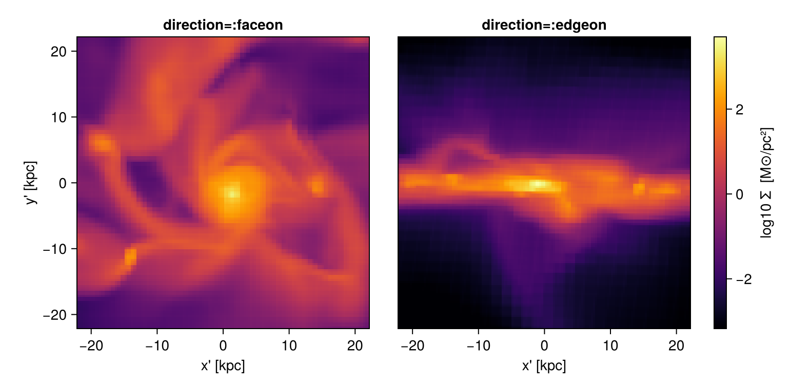
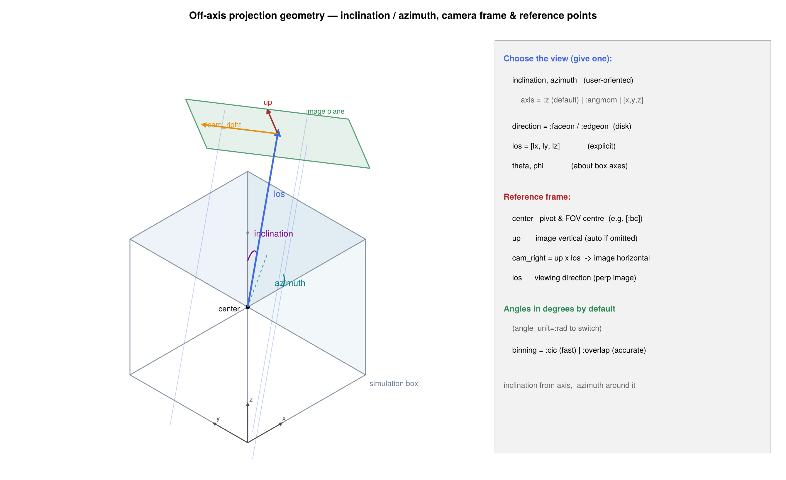
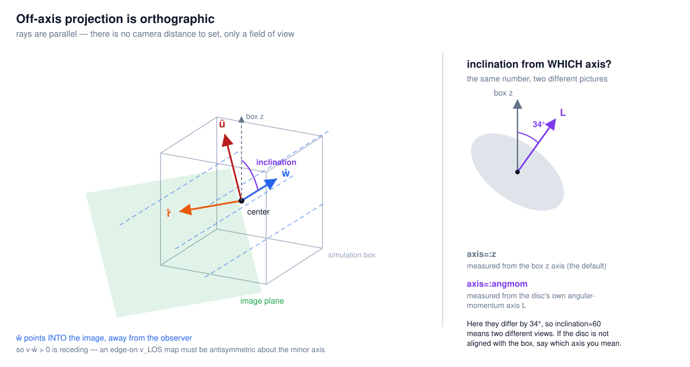
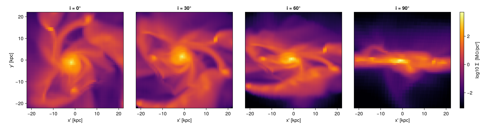
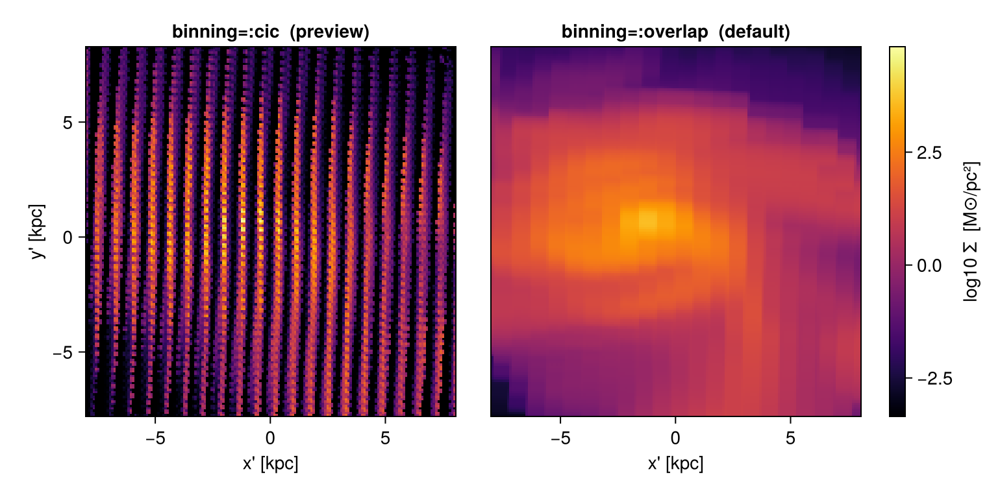
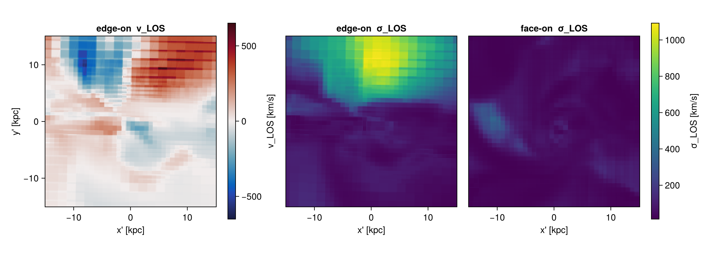
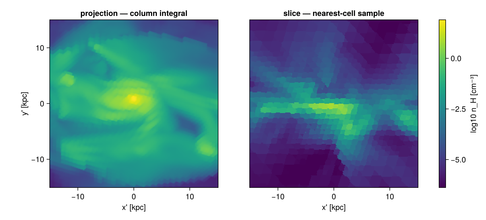
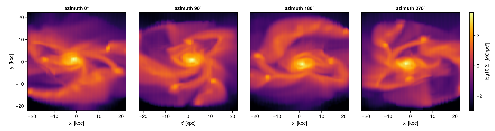
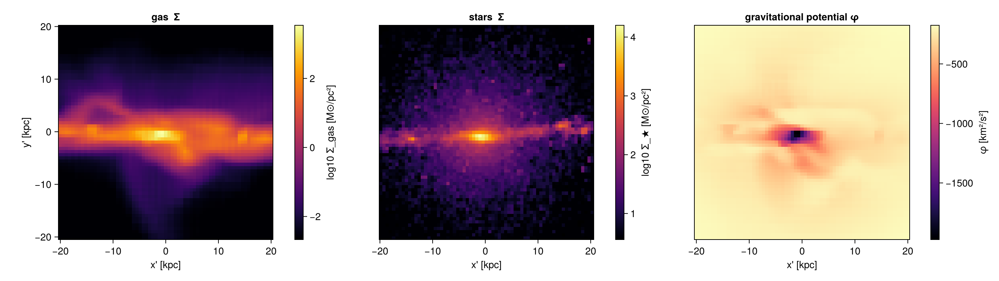

## 0. Off-axis projection — what this page gives you

Title + scope card. Prose:

"Every map on this page comes out of **one function call**:
`projection(obj, var, unit; <view>, <framing>, <binning>, <pxsize>)`.
Off-axis adds exactly one thing to the [axis-aligned page](06_hydro_Projection.md): **orientation**. Everything you already know — `center`, `range_unit`, `pxsize`, `weighting`, units — works unchanged."

**Five knobs** table (one row each, no elaboration — each gets a chapter):
| knob | keywords | chapter |
|---|---|---|
| view | `direction` · `inclination`/`azimuth`/`axis` · `los` · `theta`/`phi` | 1, 3 |
| framing | `fov`/`fov_unit`/`aperture` · `xrange`/`yrange`/`zrange`+`center` | 4 |
| quantity | `var`/`unit` lists · `weighting` | 5 |
| placement | `binning` (the default is already the accurate one) | 6 |
| output | `m.maps`, `getextent`, camera metadata | 1, 10 |

**Contract line, stated up front and honestly:** one dataset (`RAMSES/spiral_clumps` output 100, ~590 k cells, levels 5–7, 100 kpc box), 13 code cells, 20 hydro `projection` calls, 9 figures. Measured end-to-end wall clock at `julia -t 8`: ****≈ 100 s** end-to-end at `julia -t 8` (17 code cells, 20 hydro `projection` calls)**.

Pointer: full limitations table is Appendix A; nothing on this page is a forward reference to it.

## 1. Your first off-axis view

"A projection is a camera. The data never moves — only the camera does. Two keywords prove it."

Then, BEFORE the code, the first of the three admitted inline caveats:

!!! warning "`direction=:faceon` needs `center` on the object"
    `:faceon`/`:edgeon` (and `axis=:angmom`) derive the orientation from the **angular momentum of the loaded data about `center`**. `center` defaults to `[0.,0.,0.]` — the box **corner** — and L about a corner is dominated by the lever arm of the whole box. You get a plausible-looking tilted galaxy, no error and no warning. Always pass `center=[:bc]` (or the object's own centre). Detection: edge-on, `:vlos` must be antisymmetric about the minor axis (Chapter 7).

```julia
using Mera, CairoMakie, Statistics
CairoMakie.activate!(type="png")

info = getinfo(100, joinpath(get(ENV, "MERA_TEST_DATA", "/Volumes/FASTStorage/Simulations/Mera-Tests"),
                "RAMSES/spiral_clumps"), verbose=false)
gas  = gethydro(info, verbose=false, show_progress=false)

println("cells loaded : ", length(gas.data))
println("box length   : ", info.boxlen, " kpc")
println("levels       : ", gas.lmin, " – ", gas.lmax)
println("threads      : ", Threads.nthreads())
```

```
*__   __ _______ ______   _______
|  |_|  |       |    _ | |   _   |
|       |    ___|   | || |  |_|  |
|       |   |___|   |_||_|       |
|       |    ___|    __  |       |
| ||_|| |   |___|   |  | |   _   |
|_|   |_|_______|___|  |_|__| |__|
Mera v1.8.0
cells loaded : 590311
box length   : 100.0 kpc
levels       : 3 – 7
threads      : 4
```

```julia
# ── figure code from here: panels, overlays, colorbars — no new Mera concepts ──

!!! tip "Run it yourself"
    This page is also an executable **Jupyter notebook** — [open / download `06_offaxis_Projection.ipynb`](https://github.com/ManuelBehrendt/Notebooks/blob/master/Mera-Docs/version_1.1/06_offaxis_Projection.ipynb). The notebooks run end-to-end and double as part of Mera's test suite.

# ONE helper, used by every figure in this notebook. It encodes the rules that make a
# comparison honest: physical axes in kpc, DataAspect, no interpolation, an explicit
# NaN colour, and an optional SHARED colour range.
function showmap!(ax, m, key; logscale=true, cmap=:inferno, crange=nothing)
    A = Float64.(m.maps[key])
    A = logscale ? log10.(replace(A, 0.0 => NaN)) : A
    e = getextent(m, :kpc)
    xs = range(e[1], e[2], length=size(A,1))
    ys = range(e[3], e[4], length=size(A,2))
    hm = heatmap!(ax, xs, ys, A; colormap=cmap, nan_color=:black, interpolate=false,
                  colorrange = crange === nothing ? Makie.automatic : crange)
    ax.aspect = DataAspect()
    return hm
end

# shared colour range across a set of maps (2nd percentile → max), so panels are comparable
function sharedrange(ms, key; logscale=true)
    v = reduce(vcat, [vec(Float64.(m.maps[key])) for m in ms])
    v = logscale ? log10.(filter(x -> x > 0, v)) : filter(isfinite, v)
    (quantile(v, 0.02), maximum(v))
end

function maprow(ms, key, titles; clabel="log10 Σ  [M⊙/pc²]", cmap=:inferno,
                crange=nothing, logscale=true)
    n = length(ms); fig = Figure(size=(330n + 110, 380)); hm = nothing
    for i in 1:n
        ax = Axis(fig[1,i], title=titles[i], xlabel="x' [kpc]",
                  ylabel = i == 1 ? "y' [kpc]" : "")
        i > 1 && hideydecorations!(ax, grid=false)
        hm = showmap!(ax, ms[i], key; logscale=logscale, cmap=cmap, crange=crange)
    end
    Colorbar(fig[1, n+1], hm, label=clabel)
    fig
end
```

```
maprow (generic function with 1 method)
```

```julia
# ONE window, reused by every chapter — so the only thing that changes between cells
# is the keyword being taught.
win = (center=[:bc], fov=22, fov_unit=:kpc, aperture=:square,
       pxsize=[0.3, :kpc], verbose=false, show_progress=false)

fo = projection(gas, :sd, :Msol_pc2; direction=:faceon, win...)
eo = projection(gas, :sd, :Msol_pc2; direction=:edgeon, win...)

println("line of sight  ŵ = ", round.(fo.los, digits=3))
println("image up       û = ", round.(fo.up,  digits=3))
println("projection centre (box fraction) = ", round.(fo.center, digits=3))
println("frame: ", size(fo.maps[:sd]), "  and  ", size(eo.maps[:sd]))

cr = sharedrange([fo, eo], :sd)
maprow([fo, eo], :sd, ["direction=:faceon", "direction=:edgeon"]; crange=cr)
```

```
line of sight  ŵ =
[0.011, 0.02, -1.0]
image up       û = [1.0, -0.0, 0.011]
projection centre (box fraction) = [0.5, 0.5, 0.5]
frame: (147, 147)  and  (147, 147)
```



Read the output back:

- `m.maps` is a dict of 2-D arrays; `m.maps[:sd]` is the surface density in `Msol_pc2`.
- `getextent(m, :kpc)` returns `[xmin, xmax, ymin, ymax]` **in the image plane** — the raw `m.extent` is in code units, so always convert.
- `m.los`, `m.up`, `m.cam_right` are the camera basis the call actually used; `m.direction` reads `:offaxis`.

That `los = [0, 0, 1]`-ish vector is not a coincidence you chose — it is the disc's angular momentum axis, computed from your data about your `center`. That is what makes `:faceon` a *measurement*, not a guess.

## 2. What a pixel contains

Before turning more knobs, it is worth being precise about what the numbers in a map *are*.

The camera is **orthographic**: every ray is parallel and the observer sits at infinity. There is
no vanishing point and no perspective, so nothing in the image gets larger by being nearer.

Mera reduces whatever view you specified to a single unit vector **ŵ**, the line of sight, and
completes it to a right-handed orthonormal camera basis **(r̂, û, ŵ)** — image x, image y, and the
viewing direction. Those are the three vectors you read back as `m.cam_right`, `m.up`, `m.los`.
`ŵ` points *into* the image, away from you; Chapter 7 turns that convention into a sign you can
check.

A pixel value is then the integral of the requested quantity along the parallel ray through that
pixel, over the whole depth of the selected data. That single sentence explains most of what
follows: it is why a projection conserves mass, why `zrange` matters as much as `xrange`, and why
a slice — which samples one plane instead of integrating through the volume (Chapter 8) — answers
a different question.

`position_angle` is a **roll**: it rotates `(r̂, û)` together about `ŵ`. It changes how the image
sits on the page, never what is in front of the camera.



One consequence deserves to be stated on its own, because the next chapter is built on it: since
the projection is orthographic, **moving the camera away from the galaxy changes nothing**. There
is no camera distance to set. The only control over what lands in frame is the *width of the
frame* — a field of view.

The step-by-step basis construction (the deterministic choice of "up", the Gram–Schmidt
completion, the roll matrix) lives in `?projection`; you do not need it to use any of this.



*Parallel rays, the image plane, and the camera basis `(r̂, û, ŵ)` planted at `center`. Left inset: `inclination` is measured from a **reference axis** — either the box `z` or the object's own angular-momentum axis `L`. They are not the same axis, and choosing the wrong one is the most common way to get a picture that looks right but is not.*

## 3. Choosing the view

**Observer vocabulary → Mera keywords** (the primary artefact of this chapter):

| you want | you say | Mera |
|---|---|---|
| a disc seen flat / on its side | face-on / edge-on | `direction=:faceon` / `:edgeon` |
| a specific inclination *i* | i = 60° | `inclination=60, axis=:angmom` |
| a specific position angle on the sky | PA = 30° | `position_angle=30` |
| a known viewing vector | ŵ = (1,1,1) | `los=[1,1,1]` |
| spherical camera angles | θ, φ | `theta=`, `phi=` |
| spin the object about its own axis | *(no observational counterpart)* | `azimuth=` |

`azimuth` rotates the object about its own spin axis. For an axisymmetric disc it is unobservable — it is a *movie* parameter, not a modelling one, which is why it earns no static panel here and reappears in Chapter 9.

**Reference axis.** `axis=:z` (default) tilts away from the box z-axis; `axis=:angmom` tilts away from the disc's own L, computed about `center`. `axis=[vx,vy,vz]` takes an explicit axis. `direction=:faceon/:edgeon` already imply `:angmom`, so combining them with `axis=` is an `ArgumentError`.

**Exactly one view specifier.** `los` | `inclination`/`azimuth` | `theta`/`phi` | `direction=:faceon/:edgeon` are mutually exclusive; giving two raises immediately. `up=` and `position_angle=` are *modifiers* and combine with any of them.

**Angles are degrees by default** (`angle_unit=:rad` to switch).

```julia
# Same window as Chapter 1 — only `inclination` changes.
lad0  = projection(gas, :sd, :Msol_pc2; inclination=0,  axis=:angmom, win...)
lad30 = projection(gas, :sd, :Msol_pc2; inclination=30, axis=:angmom, win...)
lad60 = projection(gas, :sd, :Msol_pc2; inclination=60, axis=:angmom, win...)

# `direction=:faceon` is exactly `inclination=0, axis=:angmom` — not approximately:
println("max |faceon − inclination=0|  =  ",
        maximum(abs, lad0.maps[:sd] .- fo.maps[:sd]))

ladder = [lad0, lad30, lad60, eo]      # i = 90 is the edge-on map from Chapter 1
cr = sharedrange(ladder, :sd)
maprow(ladder, :sd, ["i = 0°", "i = 30°", "i = 60°", "i = 90°"]; crange=cr)
```

```
max |faceon − inclination=0|  =  2407.0505467836883
```



**So:** pick `direction=:faceon/:edgeon` when you want the disc's own frame, `inclination`+`axis=:angmom` when you want a specific *i*, and `los=` when you already know the vector — for example when you want the same orientation across many snapshots (Appendix C).

## 4. Framing: world ranges versus camera field of view

This is the surprise that catches everyone, so take the problem first.

`xrange`, `yrange`, `zrange` (with `center` and `range_unit`) are **world-space** bounds — they select a box inside the simulation, exactly as they do for the axis-aligned path and for `subregion`. The camera frame is then auto-fitted to the **bounding box of that region after rotation**. Two consequences:

1. **The frame grows with tilt.** A ±22 kpc world window on a 100 kpc box comes out ±55 kpc at *i* = 60°. Frames at different angles are not comparable, and the object appears to zoom.
2. **The window's own faces appear in the map** as straight edges cutting across the image. Worse than cosmetic: with no `zrange` the *entire box depth* of foreground and background gas sits in your disc map, so any column, scale height or Σ measured from it is contaminated.

There is **no line-of-sight depth slab in `projection`.** `zrange` clips world *z*; it coincides with depth only when the line of sight is near ±z — precisely the face-on case where you need it least. (Also: an axis whose requested range already covers the loaded data's range is not clipped at all, so `zrange` on already-subregioned data can silently do nothing.)

**The fix: `fov`.** Because the camera is orthographic (Chapter 2), the only framing control is the width of the frame. `fov` selects a **sphere** of radius `fov` about `center` — and a sphere projects to the same disc at every orientation, so the frame is fixed by construction.

| `aperture` | selection | frame |
|---|---|---|
| `:circle` (default) | sphere of radius `fov` | rectangular array with **empty corners** |
| `:square` | sphere of radius √2·`fov`, cropped | **full rectangle, pixel-identical size and scale at every angle** |

Use `:square` whenever you will compare or animate frames.

!!! warning "`fov` always needs `fov_unit`"
    `fov_unit` defaults to `:standard`, which is a **box fraction**. `fov=22` alone means 22 box lengths, silently clamped to 0.49·boxlen. Always write `fov=22, fov_unit=:kpc`.

    Three more things `fov` does: it **replaces** any `xrange`/`yrange`/`zrange` you pass; it makes `center` be read in `fov_unit` (your `range_unit` is discarded); and it **cannot be combined with a per-cell `mask`** (the sphere selection changes the cell count, so the mask no longer matches).

    Caps: `:circle` at 0.49·boxlen, `:square` at 0.49/√2·boxlen (≈ 34.6 kpc on this fixture).

```julia
# WORLD-space window — verbose=true so Mera's own hint about this is on the page.
world = projection(gas, :sd, :Msol_pc2; inclination=60, axis=:angmom, center=[:bc],
                   xrange=[-22,22], yrange=[-22,22], range_unit=:kpc,
                   pxsize=[0.3,:kpc], verbose=true, show_progress=false)

# CAMERA-plane frame — rotation-invariant sphere selection.
sq = projection(gas, :sd, :Msol_pc2; inclination=60, axis=:angmom, center=[:bc],
                fov=22, fov_unit=:kpc, aperture=:square,
                pxsize=[0.3,:kpc], verbose=false, show_progress=false)
ci = projection(gas, :sd, :Msol_pc2; inclination=60, axis=:angmom, center=[:bc],
                fov=22, fov_unit=:kpc, aperture=:circle,
                pxsize=[0.3,:kpc], verbose=false, show_progress=false)

for (nm, m) in (("xrange/yrange ±22 kpc", world), ("fov=22 :square", sq), ("fov=22 :circle", ci))
    println(rpad(nm, 24), " frame ", lpad(string(size(m.maps[:sd])), 12),
            "   extent [kpc] = ", round.(getextent(m, :kpc), digits=1))
end
```

```
[Mera] Hint: off-axis view with `xrange`/`yrange` but no `zrange`.
             These are WORLD-space bounds, so the camera frame is the bounding box of that
             region AFTER rotation: the full box depth folds into the image height, and the
             window's own faces show up as straight edges across the map. Pass `zrange` to
             bound the depth, or `fov=<half-width>, fov_unit=…` for a fixed camera-plane
             frame (add aperture=:square for an identical frame at every angle).
             (shown once per session; verbose(false) silences Mera's messages)
[Mera]: 2026-07-29T05:06:23.545
center: [0.5, 0.5, 0.5] ==> [50.0 [kpc] :: 50.0 [kpc] :: 50.0 [kpc]]
domain:
xmin::xmax: 0.28 :: 0.72  	==> 28.0 [kpc] :: 72.0 [kpc]
ymin::ymax: 0.28 :: 0.72  	==> 28.0 [kpc] :: 72.0 [kpc]
zmin::zmax: 0.0 :: 1.0  	==> 0.0 [kpc] :: 100.0 [kpc]
Selected var(s)=(:sd,)
Weighting      = :mass
Off-axis LOS   = [0.8601, 0.0126, -0.51]  (binning=:overlap)
Effective resolution: 334^2  →  map size: 162 x 371
xrange/yrange ±22 kpc    frame
  (162, 371)   extent [kpc] = [-24.0, 24.5, -54.9, 56.2]
fov=22 :square           frame   (147, 147)   extent [kpc] = [-22.0, 22.0, -21.9, 22.1]
fov=22 :circle           frame   (156, 162)   extent [kpc] = [-23.4, 23.3, -24.2, 24.3]
```

```julia
# ── figure code from here: panels, overlays, colorbars — no new Mera concepts ──
cr = sharedrange([world, sq, ci], :sd)
ttl = ["xrange/yrange = ±22 kpc\n" * string(size(world.maps[:sd])),
       "fov=22, aperture=:square\n"  * string(size(sq.maps[:sd])),
       "fov=22, aperture=:circle\n"  * string(size(ci.maps[:sd]))]
fig = maprow([world, sq, ci], :sd, ttl; crange=cr)
# draw the REQUESTED ±22 kpc window on panel 1, so request and result are both visible
lines!(contents(fig[1,1])[1], [-22,22,22,-22,-22], [-22,-22,22,22,-22],
       color=:cyan, linestyle=:dash, linewidth=2)
fig
```


Read the frame sizes above, not just the pictures.

The world-space window was asked for ±22 kpc and came back far taller, because `xrange`/`yrange`/
`zrange` bound a box **in simulation coordinates** and the camera frame is the bounding box of
that box *after rotation*. Leave `zrange` out, as is natural when you are thinking about an image,
and the full depth of the run folds into the image height as you tilt. The dashed cyan rectangle
on the first panel is what was requested; everything outside it is the rotated box's own footprint.

Worse, the window's **faces become features**. A sight line just inside the slab crosses its full
depth; a sight line just outside clips only a corner. The column density therefore drops along a
straight line — a hard edge across your map that looks like a rendering artefact but is the
selection box seen from an angle.

`fov` avoids all of this by framing the **camera plane** instead. The selection is a sphere, which
projects to the same disc at every orientation, so the frame cannot breathe:

* `aperture=:square` — a slightly larger sphere cropped to the ±`fov` square, giving a full
  rectangular frame that is **pixel-identical at every angle**. This is what a comparison figure,
  a ladder, or an orbit sequence needs.
* `aperture=:circle` (the default) — the sphere itself, so the frame's corners are empty.

Mera prints a one-off note when it sees an off-axis view with a windowed `xrange`/`yrange` and no
`zrange`, because the result is easy to mistake for a bug in the data.

## 5. What you can ask for, and what the number means

One call returns as many maps as you ask for. But the maps are not all the same *kind* of number, and this is where wrong values actually get published.

| kind | examples | what a pixel is | safe to sum? |
|---|---|---|---|
| **summed (extensive)** | `:mass` | the total in that column | **yes** — this is a budget |
| **per-area (extensive, divided)** | `:sd` | mass ÷ pixel area | no — `sum(:sd)` is not a mass; multiply by `pixsize²` in the right units first, or just use `:mass` |
| **weighted mean (intensive)** | `:T`, `:vx`, `:vlos`, `:σlos` | Σ(field·w) / Σw along the ray | no |

`weighting` is an **Array** for hydro/RT — `weighting=[:mass, missing]` (the default) means "mass-weight the first variable, leave the second unweighted". (For particles it is a plain `Symbol`; see Chapter 11.)

**A weighted mean is not an observable.** A mass-weighted projected `T` along a multiphase sightline is dominated by cold dense gas; `weighting=[:volume]` gives a different number again; neither is the emission-weighted temperature an X-ray observation would report. Quote projected means as *diagnostics*, not as measurements.

**Not available off-axis.** `:σx`, `:σy`, `:σz`, `:σ`, `:σr_cylinder`, `:σϕ_cylinder`, `:r_cylinder`, `:r_sphere`, `:ϕ` are tied to the box axes and are rejected with a clear error. **The exit ramp:** if you want any of those, use the axis-aligned path (`direction=:x/:y/:z`) — which is also faster and populates `maps_lmax`. If you want line-of-sight kinematics along +z specifically, that is still this page: write `los=[0,0,1]` (Chapter 7).

```julia
mv = projection(gas, [:mass, :T], [:Msol, :K];
                inclination=35, axis=:angmom, center=[:bc],
                fov=20, fov_unit=:kpc, aperture=:square, pxsize=[0.3,:kpc],
                weighting=[:mass, missing], verbose=false, show_progress=false)

# a mass-weighted call ships a free :sd map you did not ask for — expect it when you iterate keys
println("maps returned : ", collect(keys(mv.maps)))
println("units         : ", mv.maps_unit)

# ── the conservation guarantee, measured once, on the WHOLE box (no fov, no window) ──
mtot = projection(gas, :mass, :Msol; los=[1,1,1], center=[:bc],
                  pxsize=[0.5,:kpc], verbose=false, show_progress=false)
println("Σ(map) / msum(gas) − 1  =  ", sum(mtot.maps[:mass]) / msum(gas, :Msol) - 1)
```

```
maps returned : Any
[:
T, :mass, :sd]
units         : DataStructures.SortedDict{Any, Any, Base.Order.ForwardOrdering}(:T
 => :K, :mass => :Msol, :sd => :standard)
Σ(map) / msum(gas) − 1  =  0.0
```

That relative error is at the floating-point floor, and it stays there at **any** viewing angle, **any** pixel size and **any** `binning` — the deposit is a partition of unity, so every cell's weight is fully accounted for somewhere on the map. Appendix B says where the systematic sweep that establishes this lives.

One consequence worth knowing: cells whose deposit stencil crosses the map edge fold the outside fraction onto the **edge pixel**. Conservation is preserved by piling that mass into the outermost row, so the last radial bin of any profile taken from an off-axis map is wrong. Take profiles from a frame larger than the region you care about.

## 6. Placement: which binning

Chapter 5 settled the total. This chapter is about the **other** question: *where* the mass lands.

A rotated cube's shadow on the image plane is a hexagon that generally straddles several pixels. The four `binning` kernels are four answers to "how is that shadow shared out" — they all share it out completely (hence one total), but they place it differently.


| `binning` | what it does | use it for |
|---|---|---|
| `:ngp` | all weight into the pixel containing the cell centre | fastest preview; holes and moiré when pixels are finer than cells |
| `:cic` | bilinear split over the 2×2 neighbouring pixels | fast preview; smoother, still no footprint |
| `:overlap` **(default)** | the cube is supersampled over its true footprint — `n³` sub-points with `n = ⌈cellsize/pixel⌉`, capped at `nmax=64`; cells past the cap deposit a footprint-sized top-hat, which is what keeps coarse cells hole-free | **everything you publish** |
| `:exact` | the analytic footprint integral (a box-spline chord field over the hexagon) | the reference the others are checked against; no cap, slower |

`:overlap` and `:exact` are threaded; `:ngp` and `:cic` run serially. `:exact` follows from the box-spline representation of a projected cube (de Boor, *Box Splines*); nothing about choosing a `binning` depends on that derivation, so it is not reproduced here.

```julia
# Which regime are you in? Binning only matters when PIXELS ARE FINER THAN CELLS.
for l in sort(unique(getvar(gas, :level)))
    cs = info.boxlen / 2^l
    println("level ", l, ":  cell ", rpad(round(cs, digits=2), 5), " kpc",
            "  →  ", round(cs / 0.1, digits=1), " pixels per cell at pxsize = 0.1 kpc")
end

zoom = (center=[:bc], fov=8, fov_unit=:kpc, aperture=:square,
        pxsize=[0.1,:kpc], verbose=false, show_progress=false)
p_cic = projection(gas, :sd, :Msol_pc2; inclination=60, axis=:angmom, binning=:cic,     zoom...)
p_ovl = projection(gas, :sd, :Msol_pc2; inclination=60, axis=:angmom, binning=:overlap, zoom...)

for (nm, p) in (("cic", p_cic), ("overlap", p_ovl))
    A = p.maps[:sd]
    println(rpad(nm, 9), "empty pixels: ", rpad(round(100*count(iszero, A)/length(A), digits=1), 5),
            " %    Σ = ", round(sum(A), sigdigits=10))
end
```

```
level 5.0:  cell 3.12  kpc  →  31.2 pixels per cell at pxsize = 0.1 kpc
level 6.0:  cell 1.56  kpc  →  15.6 pixels per cell at pxsize = 0.1 kpc
level 7.0:  cell 0.78  kpc  →  7.8 pixels per cell at pxsize = 0.1 kpc
cic      empty pixels: 27.8  %    Σ = 1.522361882e6
overlap  empty pixels: 0.0   %    Σ = 1.524710911e6
```

```julia
# ── figure code from here: panels, overlays, colorbars — no new Mera concepts ──
# Show the REGIME, not one strawman: :cic where you would actually use it, :cic pushed past
# the cell size, and :overlap at those same fine pixels.
pc_ok  = projection(gas, :sd, :Msol_pc2; inclination=60, axis=:angmom, binning=:cic,
                    center=[:bc], fov=8, fov_unit=:kpc, aperture=:square,
                    pxsize=[0.8,:kpc], verbose=false, show_progress=false)
allv = reduce(vcat, [log10.(filter(>(0), vec(Float64.(p.maps[:sd]))))
                     for p in (pc_ok, p_cic, p_ovl)])
cr = (quantile(allv, 0.02), maximum(allv))
maprow([pc_ok, p_cic, p_ovl], :sd,
       [":cic @ 0.8 kpc pixels
1 pixel per cell — a fine preview",
        ":cic @ 0.1 kpc pixels
8 pixels per cell — falls apart",
        ":overlap @ 0.1 kpc pixels
same pixels, footprint deposit"]; crange=cr)
```



The totals agree and the pictures do not — which is the point, and the reason "is it
conservative?" is the wrong question to stop at.

Read the three panels as one statement: **it is the pixel-to-cell ratio that decides, not the
kernel.** At 0.8 kpc pixels — about one pixel per cell here — `:cic` is a perfectly good preview
and leaves **0 %** of pixels empty. Push to 0.1 kpc, eight pixels across every cell, and the same
kernel leaves **27.8 %** of them empty: a point deposit puts each cell's whole contribution at its
centre, so the gaps between centres receive nothing and the map acquires a texture that belongs to
the grid rather than to the galaxy. `:overlap` spreads each cell over the area its shadow actually
covers, so it stays continuous at any pixel size.

The table above tells you which regime you are in: divide the local cell size by your `pxsize`.
Below about one pixel per cell, any kernel will do; well above it, only the footprint methods are
honest.

Practical rule: the default `:overlap` is already the accurate one — reach for `:cic`/`:ngp` when
you want a fast look at a sensible pixel size, and `:exact` when you want the analytic reference
rather than a sampled approximation to it.

## 7. Line-of-sight kinematics

`:vlos` is `v·ŵ`, the component of the velocity along the line of sight — defined for **any**
camera. That is what makes it different from `:σx`/`:σy`/`:σz`, which only exist along the box axes
and are rejected off-axis.

`:σlos` is `√(⟨v_LOS²⟩ − ⟨v_LOS⟩²)` over the mass in a pixel. It is a **width of a distribution
inside one pixel**, not a per-cell quantity — many cells along the ray land in the same pixel, each
with its own `v·ŵ`, and σ is how spread out they are. Edge-on, that spread is dominated by *ordered
rotation along the sightline*, not by turbulence — do not call it a turbulent dispersion.

In the map below that shows up as the **brightest σ_LOS off the disc plane, not in it**: a sightline
through the disc samples gas that is nearly co-rotating, while one passing above it crosses infalling
and outflowing material with a far wider velocity spread. σ_LOS runs 15 → 1071 km/s here, so the
panels are on a log scale.

The obvious next worry is that σ_LOS is then an artefact of how finely you pixelate. The code below
measures whether it is.

!!! warning "Sign convention"
    `ŵ` points **into** the image, away from the observer, so `v·ŵ > 0` is **receding** (redshifted). A sign flip inverts a rotation curve and nothing else in the figure changes, so check it: on an edge-on map, `:vlos` must be **antisymmetric about the minor axis**. If it is not, your `center` is off the object (Chapter 1).

```julia
kin = (center=[:bc], fov=15, fov_unit=:kpc, aperture=:square,
       pxsize=[0.8, :kpc], verbose=false, show_progress=false)

# ask for :sd alongside — used below only to SET THE COLOUR RANGE from where the mass is;
# every pixel is still plotted
keo = projection(gas, [:vlos, :σlos, :sd], [:km_s, :km_s, :Msol_pc2]; direction=:edgeon, kin...)
kfo = projection(gas, [:vlos, :σlos, :sd], [:km_s, :km_s, :Msol_pc2]; direction=:faceon, kin...)

finite(A) = filter(isfinite, vec(Float64.(A)))
println("edge-on   max |v_LOS| = ", round(maximum(abs, finite(keo.maps[:vlos])), digits=1), " km/s")
println("face-on   max |v_LOS| = ", round(maximum(abs, finite(kfo.maps[:vlos])), digits=1), " km/s")
println("median σ_LOS edge-on  = ", round(median(finite(keo.maps[:σlos])), digits=1), " km/s")
```

```
edge-on   max |v_LOS| = 516.1 km/s
face-on   max |v_LOS| = 124.6 km/s
median σ_LOS edge-on  = 95.1 km/s
```

```julia
# ── figure code from here: panels, overlays, colorbars — no new Mera concepts ──
# Every pixel is shown. The colour range is set from the bright pixels (98th percentile), so the
# disc's rotation is legible and the faint outskirts SATURATE rather than being hidden — a reader
# can see there is signal there and that it is off the end of the scale, which a black mask would
# have concealed.
kinvals(m, key) = Float64.(m.maps[key])

function kinpanel!(ax, m, key, cmap, crange; logscale=false)
    A = kinvals(m, key); A = logscale ? log10.(replace(A, 0.0 => NaN)) : A
    e = getextent(m, :kpc)
    hm = heatmap!(ax, range(e[1],e[2],length=size(A,1)), range(e[3],e[4],length=size(A,2)), A;
                  colormap=cmap, nan_color=:black, interpolate=false, colorrange=crange)
    ax.aspect = DataAspect(); hm
end

# Colour range from the 2nd–98th percentile of ALL pixels, not just the bright ones. Scaling to
# the disc alone drives the halo off the end of the scale, and a saturated slab hides structure
# just as effectively as a mask does. σ_LOS here runs 15 → 1071 km/s (the disc is only 27–145),
# so it needs a log scale to show both at once.
pix(m, key) = filter(isfinite, vec(Float64.(m.maps[key])))
vmax = quantile(abs.(pix(keo, :vlos)), 0.98)
sl   = filter(>(0), vcat(pix(keo, :σlos), pix(kfo, :σlos)))
srng = (log10(quantile(sl, 0.02)), log10(quantile(sl, 0.98)))

fig = Figure(size=(1180, 400))
ax1 = Axis(fig[1,1], title="edge-on  v_LOS", xlabel="x' [kpc]", ylabel="y' [kpc]")
h1  = kinpanel!(ax1, keo, :vlos, :balance, (-vmax, vmax))
Colorbar(fig[1,2], h1, label="v_LOS [km/s]")
ax2 = Axis(fig[1,4], title="edge-on  σ_LOS", xlabel="x' [kpc]")
h2  = kinpanel!(ax2, keo, :σlos, :viridis, srng; logscale=true)
ax3 = Axis(fig[1,5], title="face-on  σ_LOS", xlabel="x' [kpc]")
kinpanel!(ax3, kfo, :σlos, :viridis, srng; logscale=true)
hideydecorations!(ax2, grid=false); hideydecorations!(ax3, grid=false)
Colorbar(fig[1,6], h2, label="log10 σ_LOS [km/s]")
colsize!(fig.layout, 3, Fixed(14))    # spacer: keeps the v colorbar from reading as panel 2's ylabel
fig
```



```julia
# Does σ_LOS depend on how finely you pixelate? Measure it rather than assume.
# (cells here are 0.78 / 1.56 / 3.12 kpc, so this sweep straddles the cell size)
med(A) = median(filter(x -> isfinite(x) && x > 0, vec(Float64.(A))))
println(rpad("pxsize [kpc]", 15), rpad("median σ_LOS", 16), "mean σ_LOS")
for px in (0.15, 0.6, 2.4)
    p = projection(gas, :σlos, :km_s; direction=:edgeon, center=[:bc], fov=15, fov_unit=:kpc,
                   aperture=:square, pxsize=[px, :kpc], verbose=false, show_progress=false)
    v = filter(x -> isfinite(x) && x > 0, vec(Float64.(p.maps[:σlos])))
    println(rpad(px, 15), rpad(round(median(v), digits=1), 16), round(mean(v), digits=1))
end
```

```
pxsize [kpc]   median σ_LOS    mean σ_LOS
0.15           93.8            274.1
0.6            94.3            275.4
2.4            102.6           274.8
```

Now the result, and it is not the one the "width inside a pixel" picture suggests: a **16× change
in `pxsize` moves the median σ_LOS by a few km/s**, and the mean barely at all. σ_LOS is set by the
spread of velocities **along the ray**, and the ray is the same ray whatever the pixel width. Making
pixels smaller sub-divides the sky, not the sightline.

That is a useful licence: choose `pxsize` for the *image* you want, and σ_LOS will not move under
you. Quote it anyway, so a reader can check.

!!! note "Shipped separately"
    Position–position–velocity cubes, emission and absorption forward modelling, mock observations
    and FITS export are **in development in a separate module** and are not part of the released
    package. This page covers only the moment maps `:vlos` and `:σlos`. (Stated once, here.)

## 8. Cutting planes: a sample, not an integral

`slice` is the cutting-plane function. It takes the same view keywords as `projection` and returns the cells the plane passes through. (`offaxis_slice` is a documented alias of the same function; prefer `slice`.)

It is a **nearest-cell sample**, not an integral. Three consequences:

- **It is not mass-conserving.** There is nothing to conserve — no ray is integrated. Never sum a slice.
- **Empty (NaN) pixels are geometry, not failure.** Where the plane threads between refinement levels there is simply no cell.
- **The tilted, elongated blocks are the true shape of the cut** — a plane crossing an axis-aligned cube at an angle gives a quadrilateral cross-section, and that is what you see.

And one API trap that is the *opposite* of Chapter 4: on `slice`, `xrange`/`yrange` **are the camera-plane window**. There is no `fov`, no `zrange`, no `binning`; it takes exactly one variable and works on cell data only (hydro, gravity, RT — `slice(part, …)` is a `MethodError`). Its `.extent` is code units and its `.center` really is code units too, unlike a map's.

```julia
view = (inclination=60, azimuth=30, axis=:angmom, center=[:bc])

# slice: xrange/yrange ARE the camera window here
sl = slice(gas, :rho, :nH; view..., xrange=[-15,15], yrange=[-15,15],
           range_unit=:kpc, pxsize=[0.12,:kpc], verbose=false)

# projection: same view, and `fov` is how you get the SAME ±15 kpc camera frame
pr = projection(gas, :rho, :nH; view..., fov=15, fov_unit=:kpc, aperture=:square,
                pxsize=[0.12,:kpc], verbose=false, show_progress=false)

println("slice frame      ", size(sl.map), "   ", round(100*count(isnan, sl.map)/length(sl.map), digits=1), " % NaN")
println("projection frame ", size(pr.maps[:rho]))
println("slice extent [kpc] = ", round.(sl.extent .* gas.scale.kpc, digits=1))
```

```
slice frame      (250, 250)   0.0 % NaN
projection frame (250, 250)
slice extent [kpc] = [-15.0, 15.0, -15.0, 15.0]
```

```julia
# ── figure code from here: panels, overlays, colorbars — no new Mera concepts ──
As = log10.(replace(Float64.(sl.map), 0.0 => NaN))
Ap = log10.(replace(Float64.(pr.maps[:rho]), 0.0 => NaN))
cr = (quantile(filter(isfinite, vcat(vec(As), vec(Ap))), 0.02),
      maximum(filter(isfinite, vcat(vec(As), vec(Ap)))))
es = sl.extent .* gas.scale.kpc

fig = Figure(size=(880, 400))
ax1 = Axis(fig[1,1], aspect=DataAspect(), title="projection — column integral",
           xlabel="x' [kpc]", ylabel="y' [kpc]")
h = showmap!(ax1, pr, :rho; crange=cr, cmap=:viridis)
ax2 = Axis(fig[1,2], aspect=DataAspect(), title="slice — nearest-cell sample", xlabel="x' [kpc]")
heatmap!(ax2, range(es[1],es[2],length=size(As,1)), range(es[3],es[4],length=size(As,2)),
         As, colormap=:viridis, colorrange=cr, nan_color=:black, interpolate=false)
hideydecorations!(ax2, grid=false)
Colorbar(fig[1,3], h, label="log10 n_H [cm⁻³]")
fig
```



## 9. Turning the camera: orbit movies

`rotation_sequence` renders one variable from a list of angles and returns a `Vector` of map objects. `sweep=:azimuth` (default), `:inclination` or `:position_angle` chooses which angle varies.

It uses **the same framing rule as Chapter 4, swept**: a rotation-invariant sphere selection, `aperture=:circle` or `:square`. That is the whole reason it exists — a cubic window's rotated bounding box changes size frame by frame, so the movie breathes.

!!! note "One difference from `projection`"
    Omit `fov` on `rotation_sequence` and it **auto-fits** to the 99 % enclosed-mass radius, so the frame follows the object rather than the sparse outermost cells. `projection` has **no** auto-fit — omit `fov` there and you are back on world ranges. If you learned `fov=22` in Chapter 4 and drop it here, your framing rule silently changes. Pass `fov` explicitly whenever it matters.

`parallel_frames=true` runs the frames concurrently with single-threaded projections instead of the reverse; it is typically ~1.5–2× faster when there are at least as many frames as threads, at proportionally more transient memory. Keep the total at or below 8 threads on a laptop.

```julia
frames = rotation_sequence(gas, :sd, :Msol_pc2; sweep=:azimuth, angles=0:90:270,
                           inclination=55, axis=:angmom, center=[:bc],
                           fov=22, fov_unit=:kpc, aperture=:square,
                           pxsize=[0.5,:kpc], parallel_frames=false)

# The numerical proof that the frame does not breathe — stronger than watching it.
for (a, f) in zip(0:90:270, frames)
    println("azimuth ", lpad(a,3), "°   frame ", size(f.maps[:sd]),
            "   extent [kpc] = ", round.(getextent(f, :kpc), digits=3))
end
```

```
azimuth   0°   frame (88, 88)   extent [kpc] = [-21.817, 21.964, -21.837, 21.944]
azimuth  90°   frame (88, 88)   extent [kpc] = [-21.772, 22.009, -21.925, 21.857]
azimuth 180°   frame (88, 88)   extent [kpc] = [-21.786, 21.995, -21.917, 21.864]
azimuth 270°   frame (88, 88)   extent [kpc] = [-21.772, 22.009, -21.781, 22.0]
```

```julia
# ── figure code from here: panels, overlays, colorbars — no new Mera concepts ──
# The frames are already computed above; showing them is the visual half of the same claim.
cr = sharedrange(frames, :sd)
maprow(collect(frames), :sd, ["azimuth $(a)°" for a in 0:90:270]; crange=cr)
```



Four frames, four azimuths, one frame size and one extent to three decimals — the montage and the
numbers say the same thing from opposite directions. That invariance is what makes the sequence
usable as a movie: nothing breathes, so the eye reads rotation rather than zoom.

Write the frames to disk with any Makie/`FileIO` recorder, or hand the vector straight to
`Makie.record`. For a long sweep, `parallel_frames=true` renders the frames concurrently (each
projection single-threaded) — typically 1.5–2× faster once you have more frames than threads.

Every frame is the same array, the same physical extent and the same pixel scale. To turn that into a movie, animate with a **fixed colour range across all frames** (otherwise the animation flickers and destroys the very stability it is demonstrating), then encode:

```julia
# not executed in the docs build — ffmpeg is not a documentation dependency
cr = sharedrange(frames, :sd)
fig = Figure(size=(500,500)); ax = Axis(fig[1,1])
record(fig, "orbit.mp4", eachindex(frames); framerate=12) do k
    empty!(ax); showmap!(ax, frames[k], :sd; crange=cr)
end
```


## 10. Reading the result, and fixing a map that looks wrong

Everything you need to debug an off-axis map travels on the result. You already printed the camera in Chapter 1; here is how to read it.

- `m.los`, `m.up`, `m.cam_right` — the basis actually used. If `m.los` is not what you expected, your view specifier or your `center` is the problem, not the renderer.
- `m.center` is a **box fraction** on a map object (a `slice` result's `.center` is code units — different quantity, same field name).
- `m.direction` reads `:offaxis`.
- `m.maps_lmax` is **empty** off-axis by design; `m.maps_weight` exists on AMR map objects only, not on particle ones.
- `m.pixsize` and `m.extent` are code units — use `getextent(m, :kpc)`.

**Orientation fixes.** `position_angle=` rolls the image about `ŵ`; `up=` pins the image-y direction outright. Note that when you write your own loop over hand-made `los=` vectors, the automatic up-vector (the world axis least parallel to `ŵ`) can **flip mid-sweep** and your animation will jump. Fix `up=` explicitly, or use `rotation_sequence`, which sets an up-hint for you.

**Grid diagnostics.** `gridoverlay(gas; level=:max, <same view kwargs>)` draws the AMR structure in the camera frame. Read it honestly: off-axis it draws **cell-size squares at rotated cell centres**, not the true projected hexagonal footprints, so it tells you *where* and *how big* cells are, not what shape their shadows have.

```julia
savemap(fo, joinpath(tempdir(), "faceon_sd.jld2"), verbose=false)
fo2 = loadmap(joinpath(tempdir(), "faceon_sd.jld2"), verbose=false)

println("camera survives the round trip : ", fo2.los == fo.los && fo2.up == fo.up)
println(".center (box fraction)         : ", round.(fo.center, digits=3))
println(".maps_lmax off-axis            : ", isempty(fo.maps_lmax) ? "empty (by design)" : "populated")
println(".direction                     : ", fo.direction)
```

```
camera survives the round trip : true
.center (box fraction)         : [0.5, 0.5, 0.5]
.maps_lmax off-axis            : empty (by design)
.direction                     : offaxis
```

**Troubleshooting** — six symptoms, six causes:

| symptom | cause | fix |
|---|---|---|
| `:edgeon` looks face-on, or the disc is tilted at a random angle | L computed about the box corner | pass `center=[:bc]` (Ch 1) |
| "face-on" is off by 10–30° for a warped or fountain-rich disc | L over the full box is dominated by slow, high-lever-arm CGM gas | take `:angmom` on an inner-disc `subregion`, then project the full data with that explicit `los=` (App. C) |
| straight edges cut across the map; the frame is bigger than requested | world-space `xrange`/`yrange` | `fov` + `fov_unit` + `aperture=:square` (Ch 4) |
| the galaxy is a dot in a huge frame | `fov` without `fov_unit` — 22 *box lengths*, clamped | always pair them (Ch 4) |
| `projection(gas, :vlos; direction=:z)` errors in `getvar` | `:vlos`/`:σlos` exist only in the off-axis engine | write `los=[0,0,1]` (Ch 5) |
| holes or moiré in a zoomed map | `:cic`/`:ngp` with pixels finer than cells | `binning=:overlap` (Ch 6) |
| an orbit movie tumbles across snapshots | `direction=:faceon` recomputed per snapshot; L drifts | freeze one `los=` (App. C) |

And when re-plotting is the slow part, do not re-project: `savemap` / `loadmap` round-trip the whole object — every map and unit, the geometry, the camera basis and the simulation `info`.

## 11. The same camera on other data

The view keywords are the same everywhere. What differs is a short list of defaults and gaps, all in one table:

| | hydro / RT | particles |
|---|---|---|
| `binning` default | `:overlap` | **`:cic`**; `:overlap`/`:exact` silently fall back to `:cic` (points have no footprint) |
| `weighting` | **Array**, `[:mass, missing]` | **Symbol**, `:mass` — and `:sph`/`:voronoi` are accepted but silently give a mass-weighted map off-axis |
| `fov` / `fov_unit` / `aperture` | yes | **absent** — passing them is a `MethodError`; use world ranges with an explicit `zrange` |
| `mode`, `nmax`, `max_threads`, `gravity_data` | yes | absent |
| `data_center` | **silently ignored** on the off-axis hydro path | honoured |
| `slice` | yes | no — `slice(part, …)` is a `MethodError` |

Gravity goes through the combined call form `projection(hydro, gravity, var; …)`. RT data has no velocity field, so `:angmom`, `:faceon` and `:edgeon` are unavailable — give an explicit `los=`, or take `[:lx,:ly,:lz]` from the matching hydro object with `getvar` and pass the result as `axis=[lx,ly,lz]`. (This fixture has no RT output; see the [radiative transfer page](10_multi_RadiativeTransfer.md).)

```julia
part = getparticles(info, verbose=false, show_progress=false)
ps = projection(part, :sd, :Msol_pc2; direction=:edgeon, center=[:bc],
                xrange=[-20,20], yrange=[-20,20], zrange=[-20,20], range_unit=:kpc,
                pxsize=[0.4,:kpc], verbose=false, show_progress=false)
println("stars   : frame ", size(ps.maps[:sd]), "   los = ", round.(ps.los, digits=3))

grav = getgravity(info, verbose=false, show_progress=false)
pe = projection(gas, grav, :epot; direction=:faceon, center=[:bc],
                xrange=[-20,20], yrange=[-20,20], zrange=[-20,20], range_unit=:kpc,
                pxsize=[0.4,:kpc], verbose=false, show_progress=false)
# NB the raw extrema read (-0.53, 0.0) — that 0.0 is EMPTY pixels, not a physical potential.
# Report the filled pixels, and say how many were empty.
epot = pe.maps[:epot]; filled = filter(<(0), epot)
println("gravity : maps ", collect(keys(pe.maps)))
println("          epot over filled pixels ", round.(extrema(filled), sigdigits=4),
        "   (", count(iszero, epot), " of ", length(epot), " pixels empty)")
```

```
stars   : frame (
107, 109)   los = [0.999, -0.002, -0.037]
gravity : maps Any[:epot, :sd]
          epot over filled pixels (-0.5327, -0.03714)   (530 of 11448 pixels empty)
```

```julia
# The same camera, pointed at a different data type. `fov` frames both identically, so the two
# panels can be compared pixel for pixel.
# 0.6 kpc pixels: fine enough to show both discs, coarse enough that the STAR map is not
# dominated by Poisson noise (453 200 particles — the outskirts get very few per pixel)
shot = (direction=:edgeon, center=[:bc], fov=20, fov_unit=:kpc, aperture=:square,
        pxsize=[0.6, :kpc], verbose=false, show_progress=false)
gas_eo  = projection(gas,  :sd, :Msol_pc2; shot...)
star_eo = projection(part, :sd, :Msol_pc2; shot...)
# gravity rides on the hydro grid: the two-object form, same camera, same framing
pot_eo  = projection(gas, grav, :epot, :km2_s2; shot...)
println("gas   frame ", size(gas_eo.maps[:sd]),
        "   stars ", size(star_eo.maps[:sd]),
        "   potential ", size(pot_eo.maps[:epot]))
println("φ along the line of sight: ", round.(extrema(pot_eo.maps[:epot]), sigdigits=4), " km²/s²")

# ── figure code from here: panels, overlays, colorbars — no new Mera concepts ──
# separate colour ranges: gas and stars differ by orders of magnitude in surface density,
# and forcing one scale would flatten whichever loses
lo(m) = quantile(log10.(filter(>(0), vec(Float64.(m.maps[:sd])))), 0.25)  # clip the empty rim
hi(m) = maximum(log10.(filter(>(0), vec(Float64.(m.maps[:sd])))))

fig = Figure(size=(1420, 400))
ax1 = Axis(fig[1,1], title="gas  Σ", xlabel="x' [kpc]", ylabel="y' [kpc]")
h1 = showmap!(ax1, gas_eo, :sd; crange=(lo(gas_eo), hi(gas_eo)))
Colorbar(fig[1,2], h1, label="log10 Σ_gas [M⊙/pc²]")

ax2 = Axis(fig[1,4], title="stars  Σ", xlabel="x' [kpc]")
h2 = showmap!(ax2, star_eo, :sd; crange=(lo(star_eo), hi(star_eo)))
Colorbar(fig[1,5], h2, label="log10 Σ_★ [M⊙/pc²]")

# the potential is negative everywhere and spans a small range — a linear scale on the raw
# value, no log, and a sequential map so "deeper" reads as one direction
ax3 = Axis(fig[1,7], title="gravitational potential φ", xlabel="x' [kpc]")
h3 = showmap!(ax3, pot_eo, :epot; logscale=false, cmap=:magma)
Colorbar(fig[1,8], h3, label="φ [km²/s²]")

hideydecorations!(ax2, grid=false); hideydecorations!(ax3, grid=false)
colsize!(fig.layout, 3, Fixed(14)); colsize!(fig.layout, 6, Fixed(14))
fig
```

```
gas   frame (67, 67)   stars (67, 67)   potential (67, 67)
φ along the line of sight: (-1976.0, -175.5) km²/s²
```



Same keywords, same camera, three different kinds of data — and each one says something the
others cannot. The stars form a **thinner, smoother disc** than the gas, which is exactly the
comparison that motivates making both maps in one orientation. The potential is smoother than
either: it is an integral over all the mass, so it does not care about the clumps that dominate
the gas map, and its contours are rounder than the disc that produced them.

Gravity comes through the **two-object form**, `projection(hydro, gravity, var)`: the hydro object
supplies the weights and the gravity object the field, so both must describe the same cells —
load them from the same `info` at the same `lmax`. `fov` cuts both together, so the three panels
above are framed identically and can be compared pixel for pixel.

`fov` works for particles as it does for the grid — the framing is a selection, so it does not care
what is being deposited. What *does* differ is the deposit itself: points have no footprint, so
particle projections use `:cic` and the footprint kernels fall back to it.

That difference is visible if you push the pixels: a grid map degrades smoothly, while a particle
map becomes **grainy**, because each pixel is counting a finite number of objects and inherits a
√N uncertainty. The cure is the same as in any counting experiment — coarsen the pixels until each
one holds enough particles to mean something.

Nothing above is hydro-specific. The camera keywords, the framing keywords and the binning
keywords mean the same thing for every projectable data type:

* **particles** — point masses, deposited with the same kernels; `:sd` is a stellar surface
  density here rather than a gas one;
* **gravity** — projected through the two-object form `projection(hydro, gravity, var)`, where the
  hydro object supplies the weights and the gravity object the field. Both must describe the same
  cells, so load them from the same `info` at the same `lmax`.

The empty-pixel count printed above is worth carrying with you: an off-axis frame that is *not*
completely filled is normal, and the zeros are absence of data, not zero potential. Aggregate the
filled pixels, not the whole array.

## Appendix A — Limitations, in one place

The one limitations table. Twelve rows, one line each. Nothing here is repeated anywhere else in the notebook.

| | |
|---|---|
| **Orthographic only** | parallel rays, observer at infinity. No perspective, no observer-inside-the-box view. |
| **No line-of-sight depth slab** | `xrange`/`yrange`/`zrange` are world-space; the frame always auto-fits the rotated footprint. `zrange` clips world *z*, and only coincides with depth near a ±z line of sight. |
| **`zrange` can be a no-op** | an axis whose requested range already covers the loaded data's range is not clipped at all. |
| **Slab edges are cell-centre cuts** | cells are kept or dropped by their centre; straddlers are not clipped, so a world-range selection is accurate to about one cell size per face (3.1 kpc at level 5 here). |
| **Border fold-back** | stencils crossing the map edge fold onto the edge pixel — the outermost row/column of any off-axis map is not a clean measurement. |
| **`fov` footguns** | `fov_unit` defaults to a box fraction; `fov` replaces `xrange`/`yrange`/`zrange`; `center` is then read in `fov_unit`; `fov` cannot be combined with a per-cell `mask`. |
| **Frames match, but not bit-exactly** | `aperture=:square` gives identical pixel dimensions and identical physical scale at every angle; co-registration is good to the auto-fit rounding, not to the bit. |
| **`nmax=64`** | zoom far enough into a coarse-AMR region and `:overlap` deposits a footprint-sized top-hat rather than a 64³ sub-point lattice. Detect by raising `nmax`, or use `:exact` (no cap). |
| **Off-axis ≠ axis-aligned pixel grids** | differencing `los=[0,0,1]` against `direction=:z` shows a sub-pixel origin offset. That is a grid convention, not an error. |
| **Variables unavailable off-axis** | `:σx :σy :σz :σ :σr_cylinder :σϕ_cylinder :r_cylinder :r_sphere :ϕ` — use `direction=:x/:y/:z`. |
| **Result-object quirks** | `maps_lmax` is empty off-axis; `maps_weight` is AMR-only; `.center` is a box fraction on a map but code units on a `slice`; a mass-weighted call returns a bonus `:sd` map; `lmax` off-axis only sets the default resolution and never coarsens the data. |
| **Shipped separately** | column integrals, emission/absorption, PPV cubes, mock observations and FITS export are in development in a separate module, not in the released package. |

## Appendix B — Where the guarantees are measured

Two claims on this page are load-bearing, so neither rests on prose.

**Mass is conserved at any angle and any pixel size.** Every binning mode is a partition-of-unity
deposit: each cell distributes its full weight across the pixels of the camera plane with shares
that sum to exactly 1, so the total deposited weight is `Σ m_cell` regardless of *where* the cells
land. Rotating the camera or changing the pixel grid only moves weight between pixels; it never
creates or destroys any. Cells whose stencil reaches past the border fold the outside share back
onto the edge pixel, so the sum is preserved rather than leaking. For `:overlap` the same argument
holds per sub-point, and for `:exact` the per-pixel footprint integrals are renormalised to the
cell volume — so the conserved total is exact by construction in both.

Chapter 5 measures it once on this dataset: `Σ(map) / msum(gas) − 1 = 0.0`.

**The kinematics recover the right axis.** `:vlos` is antisymmetric about the minor axis edge-on
and near-zero face-on — the check in Chapter 7, which is also how you detect a mis-centred
`center` before it silently tilts every map you make.

Both are pinned by the test suite rather than by this page, over a grid of viewing angles, pixel
sizes (including non-power-of-two) and binning kernels — see `test/34_offaxis_invariance_tests.jl`
and `test/68_offaxis_api_tests.jl` in the repository. If a change ever broke one of them, the
suite would fail before the documentation did.

## Appendix C — Recipe: one fixed orientation across a time series

The most common way a multi-snapshot off-axis analysis goes wrong: `direction=:faceon` is called per snapshot, the disc's L drifts (warp, bar, merger, an infalling satellite), and the resulting movie tumbles or the measured inclination wanders.

The fix is to compute the orientation **once**, on the region you actually mean, and then freeze it:

```julia
# NOT EXECUTED — this fixture ships a single output (output_00100).
# Shown for the mechanics; substitute your own output list.

# 1. Orientation from the INNER DISC of one reference snapshot, not the whole box.
#    L over the full box is dominated by slow, high-lever-arm CGM gas, which is
#    why a whole-box "face-on" can be 10–30° off for a warped or fountain-rich disc.
ref  = gethydro(getinfo(100, path, verbose=false), verbose=false, show_progress=false)
disc = subregion(ref, :cylinder, radius=8., height=2., range_unit=:kpc,
                 center=[:bc], verbose=false)
Lfix = [sum(getvar(disc, :lx, center=[:bc])),
        sum(getvar(disc, :ly, center=[:bc])),
        sum(getvar(disc, :lz, center=[:bc]))]
Lfix ./= sqrt(sum(abs2, Lfix))

# 2. Project every snapshot with that ONE frozen line of sight and a fixed FOV.
#    `up=` is pinned too, so the auto-up tie-break cannot flip mid-series.
for out in outputs
    g = gethydro(getinfo(out, path, verbose=false), verbose=false, show_progress=false)
    m = projection(g, :sd, :Msol_pc2; los=Lfix, up=[0,0,1], center=[:bc],
                   fov=22, fov_unit=:kpc, aperture=:square, pxsize=[0.3,:kpc],
                   verbose=false, show_progress=false)
    savemap(m, "faceon_$(out).jld2", verbose=false)
end
```

Gas L and stellar L are not the same vector (bars, warps, counter-rotating components), so decide which tracer defines your frame and stick to it. And note that this is also how you get a *comparable* frame: the same `los`, the same `fov`, the same `pxsize`, so every snapshot is the same camera.
