# 6. Particles: Projections

## Load The Data


```julia
using Mera
info = getinfo(400, "../../testing/simulations/manu_sim_sf_L14");
particles  = getparticles(info);
```

     [Mera]: 2020-02-18T23:09:51.793

    Code: RAMSES
    output [400] summary:
    mtime: 2018-09-05T09:51:55.041
    ctime: 2019-11-01T17:35:21.051
     =======================================================
    simulation time: 594.98 [Myr]
    boxlen: 48.0 [kpc]
    ncpu: 2048
    ndim: 3
    -------------------------------------------------------
    amr:           true
    level(s): 6 - 14 --> cellsize(s): 750.0 [pc] - 2.93 [pc]
    -------------------------------------------------------
    hydro:         true
    hydro-variables:  7  --> (:rho, :vx, :vy, :vz, :p, :var6, :var7)
    hydro-descriptor: (:density, :velocity_x, :velocity_y, :velocity_z, :thermal_pressure, :passive_scalar_1, :passive_scalar_2)
    γ: 1.6667
    -------------------------------------------------------
    gravity:       true
    gravity-variables: (:epot, :ax, :ay, :az)
    -------------------------------------------------------
    particles:     true
    - Npart:    5.091500e+05
    - Nstars:   5.066030e+05
    - Ndm:      2.547000e+03
    particle variables: (:vx, :vy, :vz, :mass, :birth)
    -------------------------------------------------------
    clumps:        true
    clump-variables: (:index, :lev, :parent, :ncell, :peak_x, :peak_y, :peak_z, Symbol("rho-"), Symbol("rho+"), :rho_av, :mass_cl, :relevance)
    -------------------------------------------------------
    namelist-file: false
    timer-file:       false
    compilation-file: true
    makefile:         true
    patchfile:        true
     =======================================================

     [Mera]: Get particle data: 2020-02-18T23:10:01.886

    Key vars=(:level, :x, :y, :z, :id)
    Using var(s)=(1, 2, 3, 4, 5) = (:vx, :vy, :vz, :mass, :birth)

    domain:
    xmin::xmax: 0.0 :: 1.0  	==> 0.0 [kpc] :: 48.0 [kpc]
    ymin::ymax: 0.0 :: 1.0  	==> 0.0 [kpc] :: 48.0 [kpc]
    zmin::zmax: 0.0 :: 1.0  	==> 0.0 [kpc] :: 48.0 [kpc]


     Reading data...100%|████████████████████████████████████| Time: 0:00:04


    Found 5.089390e+05 particles
    Memory used for data table :34.947275161743164 MB
    -------------------------------------------------------


```julia
particles.data
```


    Table with 508939 rows, 10 columns:
    Columns:
     #     colname    type
    ────────────────────
    1   level    Int32
    2   x        Float64
    3   y        Float64
    4   z        Float64
    5   id       Int32
    6   vx       Float64
    7   vy       Float64
    8   vz       Float64
    9   mass     Float64
    10  birth    Float64


## Projection of Predefined Quantities

See the possible variables:


```julia
projection()
```

    Predefined vars for projections:
    ------------------------------------------------
    =====================[gas]:=====================
           -all the non derived hydro vars-
    :cpu, :level, :rho, :cx, :cy, :cz, :vx, :vy, :vz, :p, var6,...
    further possibilities: :rho, :density, :ρ
                  -derived hydro vars-
    :x, :y, :z
    :sd or :Σ or :surfacedensity
    :mass, :cellsize, :freefall_time
    :cs, :mach, :jeanslength, :jeansnumber

    ==================[particles]:==================
            all the non derived  vars:
    :cpu, :level, :id, :family, :tag
    :x, :y, :z, :vx, :vy, :vz, :mass, :birth, :metal....

                  -derived particle vars-
    :age

    ==============[gas or particles]:===============
    :v, :ekin
    squared => :vx2, :vy2, :vz2
    velocity dispersion => σx, σy, σz, σ

    related to a given center:
    ---------------------------
    :vr_cylinder, vr_sphere (radial components)
    :vϕ_cylinder, :vθ
    squared => :vr_cylinder2, :vϕ_cylinder2
    velocity dispersion => σr_cylinder, σϕ_cylinder

    2d maps (not projected):
    :r_cylinder
    :ϕ
    ------------------------------------------------


## Projection of a Single Quantity in Different Directions (z,y,x)

Here we project the surface density in the z-direction of the data within a particular vertical range (domain=[0:1]) on a grid corresponding to level=9.
Pass any object of *PartDataType* (here: "particles") to the *projection*-function and select a variable by a Symbol (here: :sd = :surfacedensity = :Σ in Msol/pc^3)


```julia
proj_z = projection(particles, :sd, unit=:Msol_pc2, lmax=9, zrange=[0.45,0.55])
proj_z = projection(particles, :Σ,  unit=:Msol_pc2, lmax=9, zrange=[0.45,0.55], verbose=false)
proj_z = projection(particles, :surfacedensity, unit=:Msol_pc2, lmax=9,zrange=[0.45,0.55], verbose=false)
proj_z = projection(particles, :sd, :Msol_pc2, lmax=9, zrange=[0.45,0.55], verbose=false) # The keyword "unit" (singular) can be omit if the following order is preserved: data-object, quantity, unit.
proj_x = projection(particles, :sd, :Msol_pc2, lmax=9, direction = :x, zrange=[0.45,0.55], verbose=false); # Project the surface density in x-direction
```

     [Mera]: 2020-02-12T20:07:42.33

    center: [0.5, 0.5, 0.5] ==> [24.0 [kpc] :: 24.0 [kpc] :: 24.0 [kpc]]

    domain:
    xmin::xmax: 0.0 :: 1.0  	==> 0.0 [kpc] :: 48.0 [kpc]
    ymin::ymax: 0.0 :: 1.0  	==> 0.0 [kpc] :: 48.0 [kpc]
    zmin::zmax: 0.95 :: 1.0  	==> 45.6 [kpc] :: 48.0 [kpc]

    Map data on given lmax: 9
    xrange: 1 513
    yrange: 1 513
    zrange: 487 513
    pixel-size: 93.75 [pc]


### Select a Range Related to a Center
See also in the documentation for: load data by selection


```julia
cv = (particles.boxlen / 2.) * particles.scale.kpc # provide the box-center in kpc
proj_z = projection(particles, :sd, :Msol_pc2, lmax=9,
                    xrange=[-10.,10.], yrange=[-10.,10.], zrange=[-2.,2.],
                    center=[cv,cv,cv], range_unit=:kpc);
```

     [Mera]: 2020-02-12T20:07:45.187

    center: [0.5, 0.5, 0.5] ==> [24.0 [kpc] :: 24.0 [kpc] :: 24.0 [kpc]]

    domain:
    xmin::xmax: 0.2916667 :: 0.7083333  	==> 14.0 [kpc] :: 34.0 [kpc]
    ymin::ymax: 0.2916667 :: 0.7083333  	==> 14.0 [kpc] :: 34.0 [kpc]
    zmin::zmax: 0.4583333 :: 0.5416667  	==> 22.0 [kpc] :: 26.0 [kpc]

    Map data on given lmax: 9
    xrange: 150 364
    yrange: 150 364
    zrange: 235 279
    pixel-size: 93.75 [pc]


Use the short notation for the box center :bc or :boxcenter for all dimensions (x,y,z):


```julia
proj_z = projection(particles, :sd, :Msol_pc2, lmax=9,
                        xrange=[-10.,10.], yrange=[-10.,10.], zrange=[-2.,2.],
                        center=[:boxcenter], range_unit=:kpc);
```

     [Mera]: 2020-02-12T20:07:46.718

    center: [0.5, 0.5, 0.5] ==> [24.0 [kpc] :: 24.0 [kpc] :: 24.0 [kpc]]

    domain:
    xmin::xmax: 0.2916667 :: 0.7083333  	==> 14.0 [kpc] :: 34.0 [kpc]
    ymin::ymax: 0.2916667 :: 0.7083333  	==> 14.0 [kpc] :: 34.0 [kpc]
    zmin::zmax: 0.4583333 :: 0.5416667  	==> 22.0 [kpc] :: 26.0 [kpc]

    Map data on given lmax: 9
    xrange: 150 364
    yrange: 150 364
    zrange: 235 279
    pixel-size: 93.75 [pc]


```julia
proj_z = projection(particles, :sd, :Msol_pc2, lmax=9,
                        xrange=[-10.,10.], yrange=[-10.,10.], zrange=[-2.,2.],
                        center=[:bc], range_unit=:kpc);
```

     [Mera]: 2020-02-12T20:07:46.818

    center: [0.5, 0.5, 0.5] ==> [24.0 [kpc] :: 24.0 [kpc] :: 24.0 [kpc]]

    domain:
    xmin::xmax: 0.2916667 :: 0.7083333  	==> 14.0 [kpc] :: 34.0 [kpc]
    ymin::ymax: 0.2916667 :: 0.7083333  	==> 14.0 [kpc] :: 34.0 [kpc]
    zmin::zmax: 0.4583333 :: 0.5416667  	==> 22.0 [kpc] :: 26.0 [kpc]

    Map data on given lmax: 9
    xrange: 150 364
    yrange: 150 364
    zrange: 235 279
    pixel-size: 93.75 [pc]


Use the box center notation for individual dimensions, here x,z:


```julia
proj_z = projection(particles, :sd, :Msol_pc2, lmax=9,
                        xrange=[-10.,10.], yrange=[-10.,10.], zrange=[-2.,2.],
                        center=[:bc, 24., :bc], range_unit=:kpc);
```

     [Mera]: 2020-02-12T20:07:48.695

    center: [0.5, 0.5, 0.5] ==> [24.0 [kpc] :: 24.0 [kpc] :: 24.0 [kpc]]

    domain:
    xmin::xmax: 0.2916667 :: 0.7083333  	==> 14.0 [kpc] :: 34.0 [kpc]
    ymin::ymax: 0.2916667 :: 0.7083333  	==> 14.0 [kpc] :: 34.0 [kpc]
    zmin::zmax: 0.4583333 :: 0.5416667  	==> 22.0 [kpc] :: 26.0 [kpc]

    Map data on given lmax: 9
    xrange: 150 364
    yrange: 150 364
    zrange: 235 279
    pixel-size: 93.75 [pc]


### Get Multiple Quantities

Get several quantities with one function call by passing an array containing the selected variables (at least one entry). The keyword name for the units is now in plural.


```julia
proj1_x = projection(particles, [:sd], units=[:Msol_pc2], lmax=9,
                        direction = :x,
                        xrange=[-10.,10.],
                        yrange=[-10.,10.],
                        zrange=[-2.,2.],
                        center=[24.,24.,24.],
                        range_unit=:kpc);
```

     [Mera]: 2020-02-12T20:07:49.018

    center: [0.5, 0.5, 0.5] ==> [24.0 [kpc] :: 24.0 [kpc] :: 24.0 [kpc]]

    domain:
    xmin::xmax: 0.2916667 :: 0.7083333  	==> 14.0 [kpc] :: 34.0 [kpc]
    ymin::ymax: 0.2916667 :: 0.7083333  	==> 14.0 [kpc] :: 34.0 [kpc]
    zmin::zmax: 0.4583333 :: 0.5416667  	==> 22.0 [kpc] :: 26.0 [kpc]

    Map data on given lmax: 9
    xrange: 150 364
    yrange: 150 364
    zrange: 235 279
    pixel-size: 93.75 [pc]


Pass an array containing several quantities to process and their corresponding units:


```julia
proj1_z = projection(particles, [:sd, :vx], units=[:Msol_pc2, :km_s], lmax=9,
                        direction = :x,
                        xrange=[-10.,10.],
                        yrange=[-10.,10.],
                        zrange=[-2.,2.],
                        center=[24.,24.,24.],
                        range_unit=:kpc);
```

     [Mera]: 2020-02-12T20:07:49.132

    center: [0.5, 0.5, 0.5] ==> [24.0 [kpc] :: 24.0 [kpc] :: 24.0 [kpc]]

    domain:
    xmin::xmax: 0.2916667 :: 0.7083333  	==> 14.0 [kpc] :: 34.0 [kpc]
    ymin::ymax: 0.2916667 :: 0.7083333  	==> 14.0 [kpc] :: 34.0 [kpc]
    zmin::zmax: 0.4583333 :: 0.5416667  	==> 22.0 [kpc] :: 26.0 [kpc]

    Map data on given lmax: 9
    xrange: 150 364
    yrange: 150 364
    zrange: 235 279
    pixel-size: 93.75 [pc]


The function can be called without any keywords by preserving the following order: dataobject, variables, units


```julia
proj1_z = projection(particles, [:sd , :vx], [:Msol_pc2, :km_s], lmax=9,
                        direction = :x,
                        xrange=[-10.,10.],
                        yrange=[-10.,10.],
                        zrange=[-2.,2.],
                        center=[24.,24.,24.],
                        range_unit=:kpc);
```

     [Mera]: 2020-02-12T20:07:50.02

    center: [0.5, 0.5, 0.5] ==> [24.0 [kpc] :: 24.0 [kpc] :: 24.0 [kpc]]

    domain:
    xmin::xmax: 0.2916667 :: 0.7083333  	==> 14.0 [kpc] :: 34.0 [kpc]
    ymin::ymax: 0.2916667 :: 0.7083333  	==> 14.0 [kpc] :: 34.0 [kpc]
    zmin::zmax: 0.4583333 :: 0.5416667  	==> 22.0 [kpc] :: 26.0 [kpc]

    Map data on given lmax: 9
    xrange: 150 364
    yrange: 150 364
    zrange: 235 279
    pixel-size: 93.75 [pc]


If all selected variables should be of the same unit use the following arguments: dataobject, array of quantities, unit (no array needed)


```julia
projvel_z = projection(particles, [:vx, :vy, :vz], :km_s, lmax=9,
                        xrange=[-10.,10.],
                        yrange=[-10.,10.],
                        zrange=[-2.,2.],
                        center=[24.,24.,24.],
                        range_unit=:kpc);
```

     [Mera]: 2020-02-12T20:07:50.259

    center: [0.5, 0.5, 0.5] ==> [24.0 [kpc] :: 24.0 [kpc] :: 24.0 [kpc]]

    domain:
    xmin::xmax: 0.2916667 :: 0.7083333  	==> 14.0 [kpc] :: 34.0 [kpc]
    ymin::ymax: 0.2916667 :: 0.7083333  	==> 14.0 [kpc] :: 34.0 [kpc]
    zmin::zmax: 0.4583333 :: 0.5416667  	==> 22.0 [kpc] :: 26.0 [kpc]

    Map data on given lmax: 9
    xrange: 150 364
    yrange: 150 364
    zrange: 235 279
    pixel-size: 93.75 [pc]


## Function Output

List the fields of the assigned object:


```julia
propertynames(proj1_z)
```


    (:maps, :maps_unit, :maps_lmax, :maps_mode, :lmax_projected, :lmin, :lmax, :ref_time, :ranges, :extent, :cextent, :ratio, :boxlen, :scale, :info)


The projected 2D maps are stored in a dictionary:


```julia
proj1_z.maps
```


    DataStructures.SortedDict{Any,Any,Base.Order.ForwardOrdering} with 2 entries:
      :sd => [1.29223 1.29223 … 1.29223 0.0; 2.58445 1.29223 … 0.0 0.0; … ; 3.87668…
      :vx => [178.738 143.611 … 131.468 NaN; 96.6932 154.086 … NaN NaN; … ; -189.97…


The maps can be accessed by giving the name of the dictionary:


```julia
proj1_z.maps[:sd]
```


    214×44 Array{Float64,2}:
      1.29223  1.29223  1.29223   1.29223  …  0.0      1.29223  1.29223  0.0
      2.58445  1.29223  2.58445   2.58445     1.29223  1.29223  0.0      0.0
      0.0      1.29223  3.87668   2.58445     1.29223  0.0      0.0      0.0
      1.29223  1.29223  2.58445   1.29223     0.0      1.29223  0.0      0.0
      0.0      0.0      1.29223   2.58445     1.29223  0.0      1.29223  0.0
      2.58445  2.58445  3.87668   1.29223  …  0.0      0.0      0.0      0.0
      0.0      2.58445  0.0       2.58445     2.58445  0.0      0.0      0.0
      1.29223  1.29223  6.46114   3.87668     3.87668  0.0      0.0      0.0
      0.0      1.29223  1.29223   1.29223     0.0      2.58445  0.0      0.0
      1.29223  2.58445  1.29223   3.87668     5.16891  2.58445  0.0      0.0
      1.29223  0.0      1.29223   7.75336  …  0.0      2.58445  0.0      0.0
      2.58445  2.58445  2.58445   3.87668     6.46114  0.0      1.29223  0.0
      2.58445  2.58445  5.16891   0.0         0.0      2.58445  0.0      0.0
      ⋮                                    ⋱  ⋮                             
      3.87668  3.87668  5.16891   2.58445     5.16891  3.87668  0.0      0.0
      1.29223  6.46114  2.58445   5.16891     3.87668  2.58445  2.58445  0.0
      5.16891  7.75336  3.87668   6.46114     3.87668  2.58445  3.87668  0.0
     11.63     7.75336  5.16891   5.16891  …  7.75336  5.16891  1.29223  0.0
      1.29223  3.87668  3.87668   2.58445     2.58445  1.29223  0.0      0.0
      5.16891  3.87668  3.87668  11.63        2.58445  3.87668  0.0      0.0
      2.58445  6.46114  6.46114   6.46114     5.16891  2.58445  1.29223  0.0
      2.58445  3.87668  3.87668  10.3378      9.04559  2.58445  0.0      0.0
      5.16891  6.46114  7.75336   9.04559  …  3.87668  2.58445  0.0      0.0
      3.87668  3.87668  0.0       6.46114     9.04559  6.46114  0.0      0.0
      3.87668  5.16891  5.16891   1.29223     2.58445  3.87668  0.0      0.0
      0.0      0.0      0.0       0.0         0.0      0.0      0.0      0.0


The units of the maps are stored in:


```julia
proj1_z.maps_unit
```


    DataStructures.SortedDict{Any,Any,Base.Order.ForwardOrdering} with 2 entries:
      :sd => :Msol_pc2
      :vx => :km_s


The following fields are helpful for further calculations or plots.


```julia
proj1_z.ranges # normalized to the domain=[0:1]
```


    6-element Array{Float64,1}:
     0.29166666666647767
     0.7083333333328743
     0.29166666666647767
     0.7083333333328743
     0.4583333333330363
     0.5416666666663156


```julia
proj1_z.extent # ranges in code units
```


    4-element Array{Float64,1}:
     13.96875
     34.03125
     21.9375
     26.0625


```julia
proj1_z.cextent # ranges in code units relative to a given center (by default: box center)
```


    4-element Array{Float64,1}:
     -10.031250000015554
      10.031249999984446
      -2.062500000015554
       2.062499999984446


```julia
proj1_z.ratio # the ratio between the two ranges
```


    4.863636363636363


## Plot Maps with Python


```julia
proj_z = projection(particles, :sd, :Msol_pc2, lmax=9,
                    zrange=[-2.,2.], center=[:boxcenter], range_unit=:kpc,
                    verbose=false)
proj_x = projection(particles, :sd, :Msol_pc2, lmax=9,
                    zrange=[-2.,2.], center=[:boxcenter], range_unit=:kpc,
                    verbose=false,
                    direction = :x);
```

Python functions can be directly called in Julia, which gives the opportunity, e.g. to use the Matplotlib library.


```julia
using PyPlot
using ColorSchemes
cmap = ColorMap(ColorSchemes.lajolla.colors) # See http://www.fabiocrameri.ch/colourmaps.php
cmap2 = ColorMap(ColorSchemes.roma.colors)
```


```julia
figure(figsize=(10, 3.5))
subplot(1,2,1)
im = imshow( log10.( permutedims(proj_z.maps[:sd])), cmap=cmap, aspect=proj_z.ratio, origin="lower", extent=proj_z.cextent, vmin=0, vmax=3)
xlabel("x [kpc]")
ylabel("y [kpc]")
cb = colorbar(im, label=L"\mathrm{log10(\Sigma) \ [M_{\odot} pc^{-2}]}")

subplot(1,2,2)
im = imshow( log10.( permutedims(proj_x.maps[:sd])), cmap=cmap, origin="lower", extent=proj_x.cextent, vmin=0, vmax=3)
xlabel("x [kpc]")
ylabel("z [kpc]")
cb = colorbar(im, label=L"\mathrm{log10(\Sigma) \ [M_{\odot} pc^{-2}]}",orientation="horizontal", pad=0.2);
```


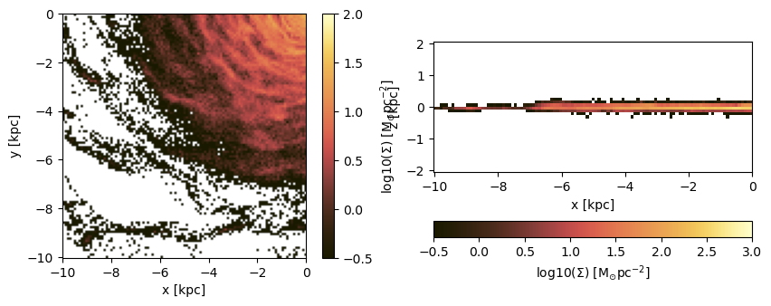


Project a specific spatial range and plot the axes of the map relative to the box-center (given by keyword: data_center):


```julia
proj_z = projection(particles, :sd, :Msol_pc2, lmax=9,
                    xrange=[-10.,0.], yrange=[-10.,0.], zrange=[-2.,2.], center=[:boxcenter], range_unit=:kpc,
                    verbose=false,
                    data_center=[24.,24.,24.], data_center_unit=:kpc)
proj_x = projection(particles, :sd, :Msol_pc2, lmax=9,
                    xrange=[-10.,0.], yrange=[-10.,0.], zrange=[-2.,2.], center=[:boxcenter], range_unit=:kpc,
                    verbose=false,
                    data_center=[24.,24.,24.], data_center_unit=:kpc,
                    direction = :x);
```


```julia
figure(figsize=(10, 3.5))
subplot(1,2,1)
im = imshow( log10.( permutedims(proj_z.maps[:sd])), cmap=cmap, aspect=proj_z.ratio, origin="lower", extent=proj_z.cextent, vmin=0, vmax=3)
xlabel("x [kpc]")
ylabel("y [kpc]")
cb = colorbar(im, label=L"\mathrm{log10(\Sigma) \ [M_{\odot} pc^{-2}]}")

subplot(1,2,2)
im = imshow( log10.( permutedims(proj_x.maps[:sd])), cmap=cmap, origin="lower", extent=proj_x.cextent, vmin=0, vmax=3)
xlabel("x [kpc]")
ylabel("z [kpc]")
cb = colorbar(im, label=L"\mathrm{log10(\Sigma) \ [M_{\odot} pc^{-2}]}",orientation="horizontal", pad=0.2);
```


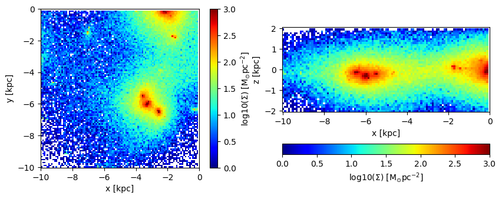


Plot the axes of the map relative to the map-center (given by keyword: data_center):


```julia
proj_z = projection(particles, :sd, :Msol_pc2, lmax=9,
                    xrange=[-10.,0.], yrange=[-10.,0.], zrange=[-2.,2.], center=[:boxcenter], range_unit=:kpc,
                    verbose=false,
                    data_center=[19.,19.,24.], data_center_unit=:kpc)
proj_x = projection(particles, :sd, :Msol_pc2, lmax=9,
                    xrange=[-10.,0.], yrange=[-10.,0.], zrange=[-2.,2.], center=[:boxcenter], range_unit=:kpc,
                    verbose=false,
                    data_center=[19.,19.,24.], data_center_unit=:kpc,
                    direction = :x);
```


```julia
figure(figsize=(10, 3.5))
subplot(1,2,1)
im = imshow( log10.( permutedims(proj_z.maps[:sd])), cmap=cmap, aspect=proj_z.ratio, origin="lower", extent=proj_z.cextent, vmin=0, vmax=3)
xlabel("x [kpc]")
ylabel("y [kpc]")
cb = colorbar(im, label=L"\mathrm{log10(\Sigma) \ [M_{\odot} pc^{-2}]}")

subplot(1,2,2)
im = imshow( log10.( permutedims(proj_x.maps[:sd])), cmap=cmap, origin="lower", extent=proj_x.cextent, vmin=0, vmax=3)
xlabel("x [kpc]")
ylabel("z [kpc]")
cb = colorbar(im, label=L"\mathrm{log10(\Sigma) \ [M_{\odot} pc^{-2}]}",orientation="horizontal", pad=0.2);
```


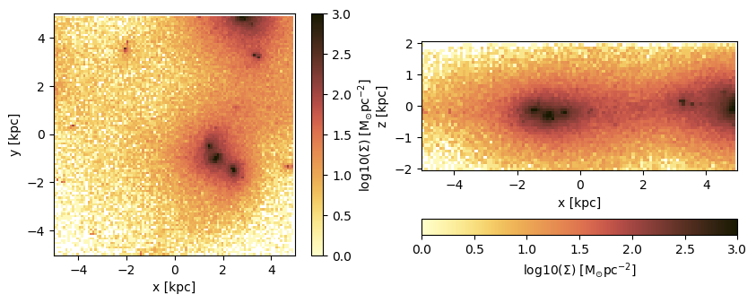


## Projections of Derived Kinematic Data

#### Use quantities in cartesian coordinates:

Project the following derived data
(mass weighted by default): The absolute value of the velocity :v, the velocity dispersion :σ in different directions and the kinetic energy :ekin. The Julia language supports Unicode characters and can be inserted by e.g. "\sigma + tab-key" leading to: **σ**.


```julia
proj_z = projection(particles, [:v, :σ, :σx, :σy, :σz, :ekin],
                    units=[:km_s,:km_s,:km_s,:km_s,:km_s,:erg],
                    lmax=9,
                    xrange=[-10.,10.], yrange=[-10.,10.], zrange=[-2.,2.],
                    center=[24.,24.,24.], range_unit=:kpc);
```

     [Mera]: 2020-02-18T23:11:45.881

    center: [0.5, 0.5, 0.5] ==> [24.0 [kpc] :: 24.0 [kpc] :: 24.0 [kpc]]

    domain:
    xmin::xmax: 0.2916667 :: 0.7083333  	==> 14.0 [kpc] :: 34.0 [kpc]
    ymin::ymax: 0.2916667 :: 0.7083333  	==> 14.0 [kpc] :: 34.0 [kpc]
    zmin::zmax: 0.4583333 :: 0.5416667  	==> 22.0 [kpc] :: 26.0 [kpc]

    Map data on given lmax: 9
    xrange: 150 364
    yrange: 150 364
    zrange: 235 279
    pixel-size: 93.75 [pc]


     100%|███████████████████████████████████████████████████| Time: 0:00:03


For the velocity dispersion additional maps are created to created the mass-weighted quantity:
E. g.: σx = sqrt( <vx^2> - < vx >^2 )


```julia
proj_z.maps
```


    DataStructures.SortedDict{Any,Any,Base.Order.ForwardOrdering} with 14 entries:
      :ekin => [2.4169e51 NaN … NaN NaN; NaN NaN … NaN NaN; … ; NaN NaN … NaN NaN; …
      :sd   => [0.00129258 0.0 … 0.0 0.0; 0.0 0.0 … 0.0 0.0; … ; 0.0 0.0 … 0.0 0.0;…
      :v    => [146.277 NaN … NaN NaN; NaN NaN … NaN NaN; … ; NaN NaN … NaN NaN; Na…
      :v2   => [4.97588 NaN … NaN NaN; NaN NaN … NaN NaN; … ; NaN NaN … NaN NaN; Na…
      :vx   => [1.22376 NaN … NaN NaN; NaN NaN … NaN NaN; … ; NaN NaN … NaN NaN; Na…
      :vx2  => [1.49758 NaN … NaN NaN; NaN NaN … NaN NaN; … ; NaN NaN … NaN NaN; Na…
      :vy   => [-1.84928 NaN … NaN NaN; NaN NaN … NaN NaN; … ; NaN NaN … NaN NaN; N…
      :vy2  => [3.41984 NaN … NaN NaN; NaN NaN … NaN NaN; … ; NaN NaN … NaN NaN; Na…
      :vz   => [-0.241781 NaN … NaN NaN; NaN NaN … NaN NaN; … ; NaN NaN … NaN NaN; …
      :vz2  => [0.058458 NaN … NaN NaN; NaN NaN … NaN NaN; … ; NaN NaN … NaN NaN; N…
      :σ    => [1.90735e-6 NaN … NaN NaN; NaN NaN … NaN NaN; … ; NaN NaN … NaN NaN;…
      :σx   => [0.0 NaN … NaN NaN; NaN NaN … NaN NaN; … ; NaN NaN … NaN NaN; NaN Na…
      :σy   => [0.0 NaN … NaN NaN; NaN NaN … NaN NaN; … ; NaN NaN … NaN NaN; NaN Na…
      :σz   => [1.72737e-7 NaN … NaN NaN; NaN NaN … NaN NaN; … ; NaN NaN … NaN NaN;…


```julia
proj_z.maps_unit
```


    DataStructures.SortedDict{Any,Any,Base.Order.ForwardOrdering} with 14 entries:
      :ekin => :erg
      :sd   => :standard
      :v    => :km_s
      :v2   => :standard
      :vx   => :standard
      :vx2  => :standard
      :vy   => :standard
      :vy2  => :standard
      :vz   => :standard
      :vz2  => :standard
      :σ    => :km_s
      :σx   => :km_s
      :σy   => :km_s
      :σz   => :km_s


```julia
usedmemory(proj_z);
```

    Memory used: 5.16 MB


```julia
figure(figsize=(10, 5.5))

subplot(2, 3, 1)
title("v [km/s]")
imshow( (permutedims(proj_z.maps[:v])  ), cmap=cmap2, origin="lower", extent=proj_z.cextent, vmax=300.)
colorbar()


subplot(2, 3, 2)
title("σ [km/s]")
imshow( (permutedims(proj_z.maps[:σ])  ), cmap=cmap2, origin="lower", extent=proj_z.cextent)
colorbar()


subplot(2, 3, 3)
title("Ekin [erg]")
imshow( log10.(permutedims(proj_z.maps[:ekin]) ), cmap=cmap2, origin="lower", extent=proj_z.cextent)
colorbar()


subplot(2, 3, 4)
title("σx [km/s]")
imshow( (permutedims(proj_z.maps[:σx])   ), cmap=cmap2, origin="lower", extent=proj_z.cextent)
colorbar()


subplot(2, 3, 5)
title("σy [km/s]")
imshow( (permutedims(proj_z.maps[:σy])  ), cmap=cmap2, origin="lower", extent=proj_z.cextent)
colorbar()


subplot(2, 3, 6)
title("σz [km/s]")
imshow( (permutedims(proj_z.maps[:σz])  ), cmap=cmap2, origin="lower", extent=proj_z.cextent)
colorbar();

```


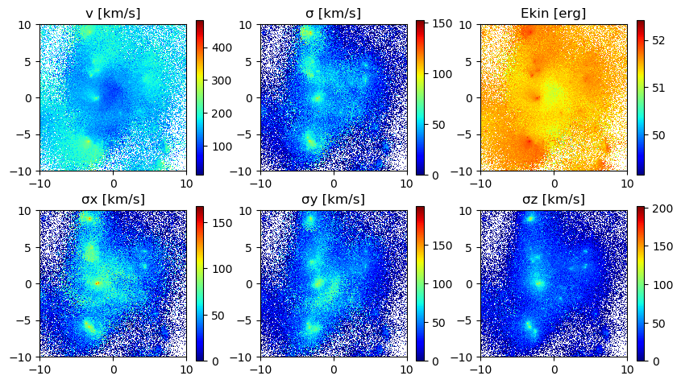


#### Use quantities in cylindrical coordinates:
#### Face-on disc (z-direction)
For the cylindrical or spherical components of a quantity, the center of the coordinate system is used (keywords: data_center = center default) and can be given with the keyword "data_center" and its units with "data_center_unit". Additionally, the quantities that are based on cartesian coordinates can be given.


```julia
proj_z = projection(particles, [:v, :σ, :σx, :σy, :ϕ, :r_cylinder, :vr_cylinder, :vϕ_cylinder, :σr_cylinder, :σϕ_cylinder],                    
                    units=[:km_s,:km_s,:km_s, :km_s, :standard, :kpc, :km_s, :km_s, :km_s, :km_s],
                    xrange=[-10.,10.], yrange=[-10.,10.], zrange=[-2.,2.],
                    center=[:boxcenter], range_unit=:kpc,
                    data_center=[24.,24.,24.], data_center_unit=:kpc);
```

     [Mera]: 2020-02-18T23:14:53.029

    center: [0.5, 0.5, 0.5] ==> [24.0 [kpc] :: 24.0 [kpc] :: 24.0 [kpc]]

    domain:
    xmin::xmax: 0.2916667 :: 0.7083333  	==> 14.0 [kpc] :: 34.0 [kpc]
    ymin::ymax: 0.2916667 :: 0.7083333  	==> 14.0 [kpc] :: 34.0 [kpc]
    zmin::zmax: 0.4583333 :: 0.5416667  	==> 22.0 [kpc] :: 26.0 [kpc]

    Map data on given lmax: 9
    xrange: 150 364
    yrange: 150 364
    zrange: 235 279
    pixel-size: 93.75 [pc]


     100%|███████████████████████████████████████████████████| Time: 0:00:01


```julia
proj_z.maps
```


    DataStructures.SortedDict{Any,Any,Base.Order.ForwardOrdering} with 18 entries:
      :r_cylinder   => [14.0096 13.9434 … 14.1205 14.1874; 13.9434 13.877 … 14.0549…
      :sd           => [0.00129258 0.0 … 0.0 0.0; 0.0 0.0 … 0.0 0.0; … ; 0.0 0.0 … …
      :v            => [146.277 NaN … NaN NaN; NaN NaN … NaN NaN; … ; NaN NaN … NaN…
      :v2           => [4.97588 NaN … NaN NaN; NaN NaN … NaN NaN; … ; NaN NaN … NaN…
      :vr_cylinder  => [29.3132 NaN … NaN NaN; NaN NaN … NaN NaN; … ; NaN NaN … NaN…
      :vr_cylinder2 => [0.199823 NaN … NaN NaN; NaN NaN … NaN NaN; … ; NaN NaN … Na…
      :vx           => [1.22376 NaN … NaN NaN; NaN NaN … NaN NaN; … ; NaN NaN … NaN…
      :vx2          => [1.49758 NaN … NaN NaN; NaN NaN … NaN NaN; … ; NaN NaN … NaN…
      :vy           => [-1.84928 NaN … NaN NaN; NaN NaN … NaN NaN; … ; NaN NaN … Na…
      :vy2          => [3.41984 NaN … NaN NaN; NaN NaN … NaN NaN; … ; NaN NaN … NaN…
      :vϕ_cylinder  => [142.43 NaN … NaN NaN; NaN NaN … NaN NaN; … ; NaN NaN … NaN …
      :vϕ_cylinder2 => [4.7176 NaN … NaN NaN; NaN NaN … NaN NaN; … ; NaN NaN … NaN …
      :σ            => [1.90735e-6 NaN … NaN NaN; NaN NaN … NaN NaN; … ; NaN NaN … …
      :σr_cylinder  => [0.0 NaN … NaN NaN; NaN NaN … NaN NaN; … ; NaN NaN … NaN NaN…
      :σx           => [0.0 NaN … NaN NaN; NaN NaN … NaN NaN; … ; NaN NaN … NaN NaN…
      :σy           => [0.0 NaN … NaN NaN; NaN NaN … NaN NaN; … ; NaN NaN … NaN NaN…
      :σϕ_cylinder  => [0.0 NaN … NaN NaN; NaN NaN … NaN NaN; … ; NaN NaN … NaN NaN…
      :ϕ            => [3.92699 3.92224 … 2.34837 2.34373; 3.93175 3.92699 … 2.3436…


```julia
proj_z.maps_unit
```


    DataStructures.SortedDict{Any,Any,Base.Order.ForwardOrdering} with 18 entries:
      :r_cylinder   => :kpc
      :sd           => :standard
      :v            => :km_s
      :v2           => :standard
      :vr_cylinder  => :km_s
      :vr_cylinder2 => :standard
      :vx           => :standard
      :vx2          => :standard
      :vy           => :standard
      :vy2          => :standard
      :vϕ_cylinder  => :km_s
      :vϕ_cylinder2 => :standard
      :σ            => :km_s
      :σr_cylinder  => :km_s
      :σx           => :km_s
      :σy           => :km_s
      :σϕ_cylinder  => :km_s
      :ϕ            => :radian


```julia
figure(figsize=(10, 8.5))

subplot(3, 3, 1)
title("Radius [kpc]")
imshow( permutedims(proj_z.maps[:r_cylinder]  ), cmap=cmap2, origin="lower", extent=proj_z.cextent)
colorbar()


subplot(3, 3, 2)
title("vr [km/s]")
imshow( permutedims(proj_z.maps[:vr_cylinder] ), cmap=cmap2, origin="lower", extent=proj_z.cextent, vmin=-200.,vmax=200.)
colorbar()


subplot(3, 3, 3)
title("vϕ [km/s]")
imshow( permutedims(proj_z.maps[:vϕ_cylinder]  ), cmap=cmap2, origin="lower", extent=proj_z.cextent)
colorbar()


subplot(3, 3, 4)
title("ϕ-angle")
imshow( (permutedims(proj_z.maps[:ϕ]) ), cmap=cmap2, origin="lower", extent=proj_z.cextent)
colorbar()


subplot(3, 3, 5)
title("σr [km/s]")
imshow( permutedims(proj_z.maps[:σr_cylinder]  ), cmap=cmap2, origin="lower", extent=proj_z.cextent)
colorbar()


subplot(3, 3, 6)
title("σϕ [km/s]")
imshow( permutedims(proj_z.maps[:σϕ_cylinder] ), cmap=cmap2, origin="lower", extent=proj_z.cextent)
colorbar()


subplot(3, 3, 7)
title("σ [km/s]")
imshow( (permutedims(proj_z.maps[:σ]) ), cmap=cmap2, origin="lower", extent=proj_z.cextent)
colorbar()


subplot(3, 3, 8)
title("σx [km/s]")
imshow( permutedims(proj_z.maps[:σx]  ), cmap=cmap2, origin="lower", extent=proj_z.cextent)
colorbar()


subplot(3, 3, 9)
title("σy [km/s]")
imshow( permutedims(proj_z.maps[:σy] ), cmap=cmap2, origin="lower", extent=proj_z.cextent)
colorbar();
```


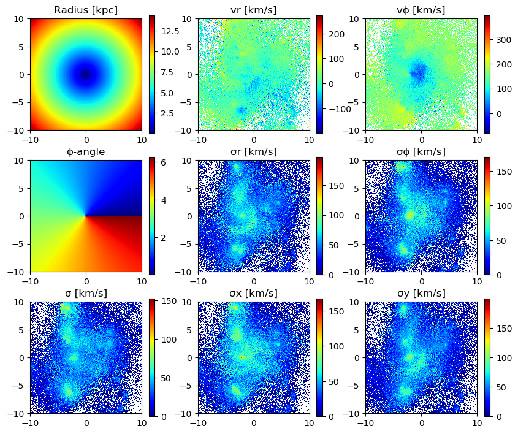


## Project on a Coarser Grid

The default is the projection on the maximum loaded grid level (always provided in the output). Choose a smaller level with the keyword *lmax* to project on a coarser grid in addition. Higher-resolution data is averaged within each coarser grid-cell (default: mass-weighted). By default, the data is assumed to be in the center of the simulation box.


```julia
proj_z = projection(particles,
                    [:v, :σ, :σx, :σy, :σz, :vr_cylinder, :vϕ_cylinder, :σr_cylinder, :σϕ_cylinder],
                    :km_s,
                    xrange=[-10.,10.], yrange=[-10.,10.], zrange=[-2.,2.],
                    center=[:boxcenter], range_unit=:kpc,
                    lmax=8);
```

     [Mera]: 2020-02-18T23:15:37.232

    center: [0.5, 0.5, 0.5] ==> [24.0 [kpc] :: 24.0 [kpc] :: 24.0 [kpc]]

    domain:
    xmin::xmax: 0.2916667 :: 0.7083333  	==> 14.0 [kpc] :: 34.0 [kpc]
    ymin::ymax: 0.2916667 :: 0.7083333  	==> 14.0 [kpc] :: 34.0 [kpc]
    zmin::zmax: 0.4583333 :: 0.5416667  	==> 22.0 [kpc] :: 26.0 [kpc]

    Map data on given lmax: 8
    xrange: 75 183
    yrange: 75 183
    zrange: 118 140
    pixel-size: 187.5 [pc]


     100%|███████████████████████████████████████████████████| Time: 0:00:01


The projection onto the maximum loaded grid is always provided:


```julia
proj_z.maps
```


    DataStructures.SortedDict{Any,Any,Base.Order.ForwardOrdering} with 19 entries:
      :sd           => [0.000323146 0.000323146 … 0.0 0.0; 0.000969439 0.000323146 …
      :v            => [146.277 156.41 … NaN NaN; 168.992 166.428 … NaN NaN; … ; Na…
      :v2           => [4.97588 5.6892 … NaN NaN; 6.6621 6.4413 … NaN NaN; … ; NaN …
      :vr_cylinder  => [29.3132 76.3408 … NaN NaN; 26.5929 6.80341 … NaN NaN; … ; N…
      :vr_cylinder2 => [0.199823 1.35529 … NaN NaN; 0.25831 0.010764 … NaN NaN; … ;…
      :vx           => [1.22376 0.610176 … NaN NaN; 1.49846 1.69991 … NaN NaN; … ; …
      :vx2          => [1.49758 0.372314 … NaN NaN; 2.33418 2.88971 … NaN NaN; … ; …
      :vy           => [-1.84928 -2.29076 … NaN NaN; -2.04837 -1.86716 … NaN NaN; ……
      :vy2          => [3.41984 5.24756 … NaN NaN; 4.22525 3.48629 … NaN NaN; … ; N…
      :vz           => [-0.241781 -0.263284 … NaN NaN; -0.187282 0.25555 … NaN NaN;…
      :vz2          => [0.058458 0.0693187 … NaN NaN; 0.102671 0.0653057 … NaN NaN;…
      :vϕ_cylinder  => [142.43 135.419 … NaN NaN; 164.297 165.443 … NaN NaN; … ; Na…
      :vϕ_cylinder2 => [4.7176 4.26459 … NaN NaN; 6.30112 6.36523 … NaN NaN; … ; Na…
      :σ            => [1.90735e-6 0.0 … NaN NaN; 9.45804 1.90735e-6 … NaN NaN; … ;…
      :σr_cylinder  => [0.0 0.0 … NaN NaN; 20.0894 8.42937e-8 … NaN NaN; … ; NaN Na…
      :σx           => [0.0 0.0 … NaN NaN; 19.5408 0.0 … NaN NaN; … ; NaN NaN … NaN…
      :σy           => [0.0 0.0 … NaN NaN; 11.246 1.9543e-6 … NaN NaN; … ; NaN NaN …
      :σz           => [1.72737e-7 0.0 … NaN NaN; 17.0492 0.0 … NaN NaN; … ; NaN Na…
      :σϕ_cylinder  => [0.0 0.0 … NaN NaN; 10.1009 0.0 … NaN NaN; … ; NaN NaN … NaN…


```julia
proj_z.maps_unit
```


    DataStructures.SortedDict{Any,Any,Base.Order.ForwardOrdering} with 19 entries:
      :sd           => :standard
      :v            => :km_s
      :v2           => :standard
      :vr_cylinder  => :km_s
      :vr_cylinder2 => :standard
      :vx           => :standard
      :vx2          => :standard
      :vy           => :standard
      :vy2          => :standard
      :vz           => :standard
      :vz2          => :standard
      :vϕ_cylinder  => :km_s
      :vϕ_cylinder2 => :standard
      :σ            => :km_s
      :σr_cylinder  => :km_s
      :σx           => :km_s
      :σy           => :km_s
      :σz           => :km_s
      :σϕ_cylinder  => :km_s


```julia
figure(figsize=(10, 8.5))

subplot(3, 3, 1)
title("|v| [km/s]")
imshow( permutedims(proj_z.maps[:v]  ), cmap=cmap2, origin="lower", extent=proj_z.cextent, vmax=300.)
colorbar()


subplot(3, 3, 2)
title("vr [km/s]")
imshow( permutedims(proj_z.maps[:vr_cylinder] ), cmap=cmap2, origin="lower", extent=proj_z.cextent, vmin=-200.,vmax=200.)
colorbar()


subplot(3, 3, 3)
title("vϕ [km/s]")
imshow( permutedims(proj_z.maps[:vϕ_cylinder]  ), cmap=cmap2, origin="lower", extent=proj_z.cextent)
colorbar()


subplot(3, 3, 4)
title("σz [km/s]")
imshow( (permutedims(proj_z.maps[:σz]) ), cmap=cmap2, origin="lower", extent=proj_z.cextent)
colorbar()


subplot(3, 3, 5)
title("σr [km/s]")
imshow( (permutedims(proj_z.maps[:σr_cylinder]  )), cmap=cmap2, origin="lower", extent=proj_z.cextent)
colorbar()


subplot(3, 3, 6)
title("σϕ [km/s]")
imshow( (permutedims(proj_z.maps[:σϕ_cylinder] )), cmap=cmap2, origin="lower", extent=proj_z.cextent)
colorbar()


subplot(3, 3, 7)
title("σ [km/s]")
imshow( (permutedims(proj_z.maps[:σ]) ), cmap=cmap2, origin="lower", extent=proj_z.cextent)
colorbar()


subplot(3, 3, 8)
title("σx [km/s]")
imshow( (permutedims(proj_z.maps[:σx]  )), cmap=cmap2, origin="lower", extent=proj_z.cextent)
colorbar()


subplot(3, 3, 9)
title("σy [km/s]")
imshow( (permutedims(proj_z.maps[:σy] )), cmap=cmap2, origin="lower", extent=proj_z.cextent)
colorbar();
```


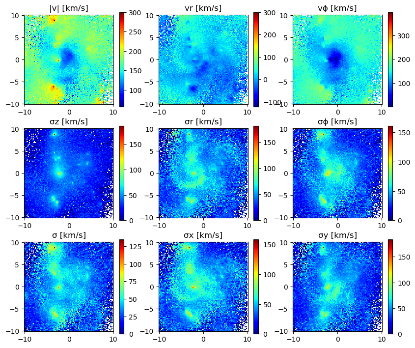


## Remap a Projected Data onto a Coarser Grid

Pass the object with the projected data to the function *remap* and the level of the coarser grid:


```julia
proj_zlmax = remap(proj_z, 6, weighting=:mass);
```


    remap from:
    level 8 => 6
    cellsize 187.5 [pc] => 750.0 [pc]
    pixels (108, 108) => (27, 27)


```julia
proj_zlmax.maps_lmax
```


    DataStructures.SortedDict{Any,Any,Base.Order.ForwardOrdering} with 19 entries:
      :sd           => [0.000323146 0.000646292 … 0.000969439 0.0; 0.000323146 0.00…
      :v            => [146.277 168.298 … 156.122 NaN; 139.301 147.989 … 163.056 Na…
      :v2           => [4.97588 6.59448 … 5.72437 NaN; 4.51262 5.41716 … 6.34405 Na…
      :vr_cylinder  => [29.3132 84.1136 … 12.6568 NaN; -65.7457 1.40056 … -13.4105 …
      :vr_cylinder2 => [0.199823 1.66491 … 1.15359 NaN; 1.0052 0.0947446 … 0.295219…
      :vx           => [1.22376 0.492592 … -1.53257 NaN; 2.0553 1.52317 … -1.57894 …
      :vx2          => [1.49758 0.249049 … 2.51795 NaN; 4.22424 2.55826 … 2.92281 N…
      :vy           => [-1.84928 -2.42313 … -1.35159 NaN; -0.536675 -1.55209 … -1.8…
      :vy2          => [3.41984 5.88813 … 3.07412 NaN; 0.28802 2.57923 … 3.41524 Na…
      :vz           => [-0.241781 -0.672377 … -0.170057 NaN; -0.0189591 -0.412132 ……
      :vz2          => [0.058458 0.457301 … 0.132298 NaN; 0.000359447 0.279663 … 0.…
      :vϕ_cylinder  => [142.43 138.647 … 133.136 NaN; 122.804 142.63 … 158.394 NaN;…
      :vϕ_cylinder2 => [4.7176 4.47227 … 4.43848 NaN; 3.50705 5.04275 … 6.04282 NaN…
      :σ            => [1.90735e-6 5.72296 … 15.5331 0.0; 0.0 37.3334 … 26.3214 0.0…
      :σr_cylinder  => [0.0 9.17629 … 69.2848 0.0; 0.0 20.1358 … 33.0096 0.0; … ; 0…
      :σx           => [0.0 5.24676 … 26.9716 0.0; 0.0 32.0052 … 42.9889 0.0; … ; 0…
      :σy           => [0.0 8.44153 … 73.2366 0.0; 0.0 27.0583 … 11.713 0.0; … ; 0.…
      :σz           => [1.72737e-7 4.73321 … 21.0841 0.0; 0.0 21.7301 … 4.72985 0.0…
      :σϕ_cylinder  => [0.0 2.88507 … 36.8894 0.0; 0.0 36.6195 … 29.9383 0.0; … ; 0…


```julia
figure(figsize=(10, 8.5))

subplot(3, 3, 1)
title("Radius [kpc]")
imshow( permutedims(proj_zlmax.maps_lmax[:v]  ), cmap=cmap2, origin="lower", extent=proj_zlmax.cextent)
colorbar()


subplot(3, 3, 2)
title("vr [km/s]")
imshow( permutedims(proj_zlmax.maps_lmax[:vr_cylinder] ), cmap=cmap2, origin="lower", extent=proj_zlmax.cextent, vmin=-150.,vmax=150.)
colorbar()


subplot(3, 3, 3)
title("vϕ [km/s]")
imshow( permutedims(proj_zlmax.maps_lmax[:vϕ_cylinder]  ), cmap=cmap2, origin="lower", extent=proj_zlmax.cextent)
colorbar()


subplot(3, 3, 4)
title("σz [km/s]")
imshow( permutedims(proj_zlmax.maps_lmax[:σz]) , cmap=cmap2, origin="lower", extent=proj_zlmax.cextent)
colorbar()


subplot(3, 3, 5)
title("σr [km/s]")
imshow( permutedims(proj_zlmax.maps_lmax[:σr_cylinder] ), cmap=cmap2, origin="lower", extent=proj_zlmax.cextent)
colorbar()


subplot(3, 3, 6)
title("σϕ [km/s]")
imshow( permutedims(proj_zlmax.maps_lmax[:σϕ_cylinder] ), cmap=cmap2, origin="lower", extent=proj_zlmax.cextent)
colorbar()


subplot(3, 3, 7)
title("σ [km/s]")
imshow( permutedims(proj_zlmax.maps_lmax[:σ]) , cmap=cmap2, origin="lower", extent=proj_zlmax.cextent)
colorbar()


subplot(3, 3, 8)
title("σx [km/s]")
imshow( permutedims(proj_zlmax.maps_lmax[:σx]), cmap=cmap2, origin="lower", extent=proj_zlmax.cextent)
colorbar()


subplot(3, 3, 9)
title("σy [km/s]")
imshow( permutedims(proj_zlmax.maps_lmax[:σy] ), cmap=cmap2, origin="lower", extent=proj_zlmax.cextent)
colorbar();
```


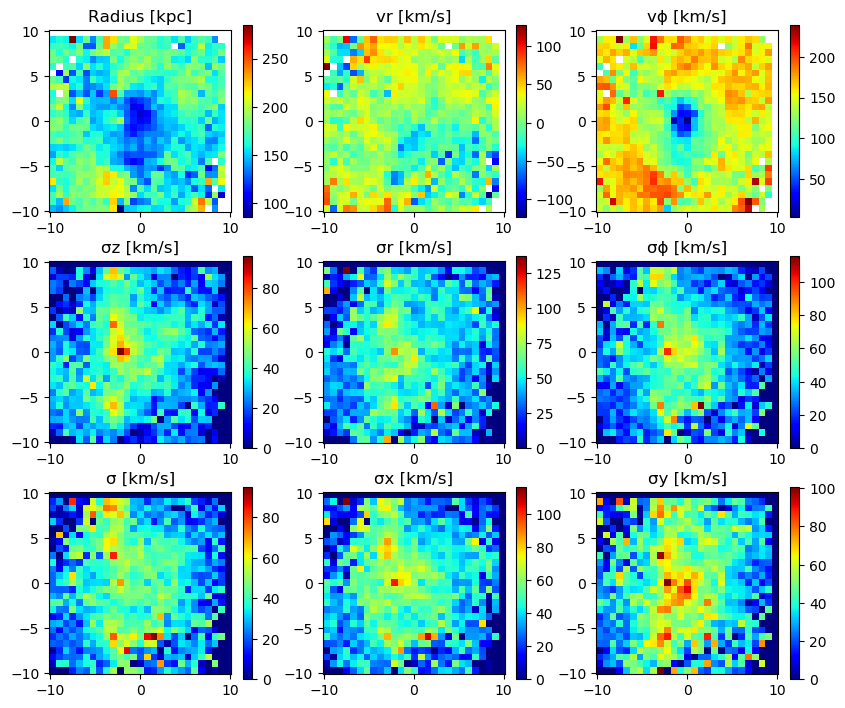


## Projection of the Birth/Age-Time

Project the average birth-time of the particles to the grid:


```julia
proj_z = projection(particles, :birth, :Myr,
                    lmax=6,  zrange=[0.45,0.55], center=[0.,0.,0.], verbose=false);
proj_x = projection(particles, :birth, :Myr,
                    lmax=6,  zrange=[0.45,0.55], center=[0.,0.,0.], direction=:x, verbose=false);
```


```julia
figure(figsize=(10, 3.5))
subplot(1,2,1)
im = imshow( log10.( permutedims(proj_z.maps[:birth])), cmap=cmap2, aspect=proj_z.ratio, origin="lower", extent=proj_z.cextent)
xlabel("x [kpc]")
ylabel("y [kpc]")
cb = colorbar(im, label=L"\mathrm{log10(Birth) \ [Myr]}")

subplot(1,2,2)
im = imshow( log10.( permutedims(proj_x.maps[:birth])), cmap=cmap2, origin="lower", extent=proj_x.cextent)
xlabel("x [kpc]")
ylabel("z [kpc]")
cb = colorbar(im, label=L"\mathrm{log10(Birth) \ [Myr]}",orientation="horizontal", pad=0.2);
```


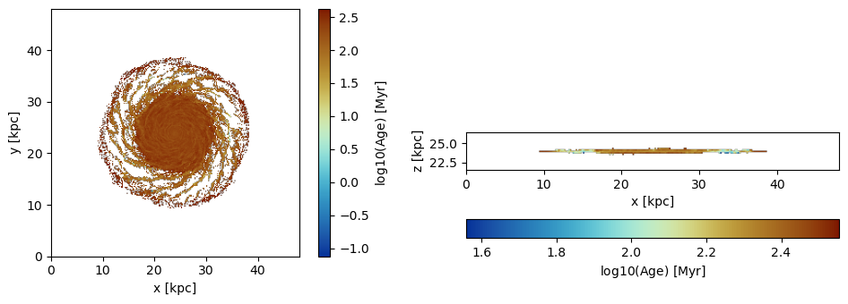


Project the average age of the particles to the grid. The age is taken relative to the loaded snapshot time by default.


```julia
proj_z = projection(particles, :age, :Myr,
                    lmax=6,  zrange=[0.45,0.55], center=[0.,0.,0.], verbose=false);
proj_x = projection(particles, :age, :Myr,
                    lmax=6,  zrange=[0.45,0.55], direction=:x,  center=[0.,0.,0.], verbose=false);
```

The reference time (code units) for the age calculation:


```julia
proj_z.ref_time
```


    39.9019537349027


```julia
figure(figsize=(10, 3.5))
subplot(1,2,1)
im = imshow( log10.( permutedims(proj_z.maps[:age])), cmap=cmap2, aspect=proj_z.ratio, origin="lower", extent=proj_z.cextent)
xlabel("x [kpc]")
ylabel("y [kpc]")
cb = colorbar(im, label=L"\mathrm{log10(Age) \ [Myr]}")

subplot(1,2,2)
im = imshow( log10.( permutedims(proj_x.maps[:age])), cmap=cmap2, origin="lower", extent=proj_x.cextent)
xlabel("x [kpc]")
ylabel("z [kpc]")
cb = colorbar(im, label=L"\mathrm{log10(Age) \ [Myr]}",orientation="horizontal", pad=0.2);
```


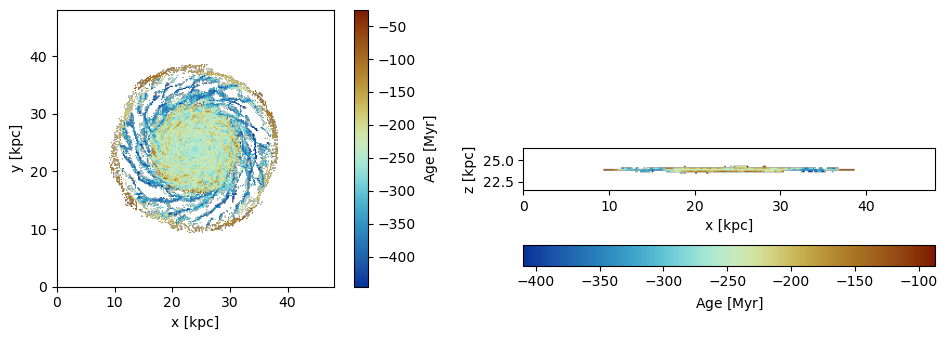


Project the average age of the particles relative to a given reference time:


```julia
proj_z = projection(particles, :age, :Myr, ref_time=0.,
                    lmax=6,  zrange=[0.45,0.55], center=[0.,0.,0.], verbose=false);
proj_x = projection(particles, :age, :Myr, ref_time = 0.,
                    lmax=6,  zrange=[0.45,0.55], center=[0.,0.,0.], direction=:x, verbose=false);
```

The reference time (code units) for the age calculation:


```julia
proj_z.ref_time
```


    0.0


```julia
figure(figsize=(10, 3.5))
subplot(1,2,1)
im = imshow( ( permutedims(proj_z.maps[:age])), cmap=cmap2, aspect=proj_z.ratio, origin="lower", extent=proj_z.cextent)
xlabel("x [kpc]")
ylabel("y [kpc]")
cb = colorbar(im, label=L"\mathrm{log10(Age) \ [Myr]}")

subplot(1,2,2)
im = imshow( ( permutedims(proj_x.maps[:age])), cmap=cmap2, origin="lower", extent=proj_x.cextent)
xlabel("x [kpc]")
ylabel("z [kpc]")
cb = colorbar(im, label=L"\mathrm{log10(Age) \ [Myr]}",orientation="horizontal", pad=0.2);
```


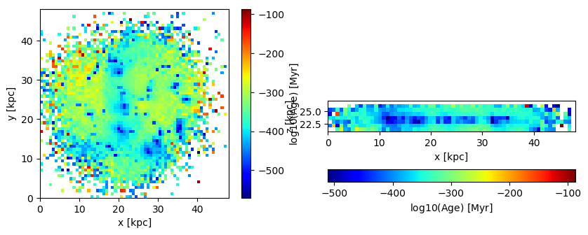


## Projection of Masked Data

Mask particles with ages higher than 500 Myr by creating a Bool-array where the smaller ages correspond to false entries:


```julia
mask = getvar(particles, :age, :Myr) .> 500. ;
```


```julia
proj_z = projection(particles, :age, :Myr, mask=mask,
                    lmax=6,  zrange=[0.45,0.55], center=[0.,0.,0.]);
proj_x = projection(particles, :age, :Myr, mask=mask,
                    lmax=6,  zrange=[0.45,0.55], center=[0.,0.,0.], direction=:x);
```

     [Mera]: 2020-02-18T23:14:17.09

    domain:
    xmin::xmax: 0.0 :: 1.0  	==> 0.0 [kpc] :: 48.0 [kpc]
    ymin::ymax: 0.0 :: 1.0  	==> 0.0 [kpc] :: 48.0 [kpc]
    zmin::zmax: 0.45 :: 0.55  	==> 21.6 [kpc] :: 26.4 [kpc]

    Map data on given lmax: 6
    xrange: 1 65
    yrange: 1 65
    zrange: 29 37
    pixel-size: 750.0 [pc]

    :mask provided by function

     [Mera]: 2020-02-18T23:14:24.262

    domain:
    xmin::xmax: 0.0 :: 1.0  	==> 0.0 [kpc] :: 48.0 [kpc]
    ymin::ymax: 0.0 :: 1.0  	==> 0.0 [kpc] :: 48.0 [kpc]
    zmin::zmax: 0.45 :: 0.55  	==> 21.6 [kpc] :: 26.4 [kpc]

    Map data on given lmax: 6
    xrange: 1 65
    yrange: 1 65
    zrange: 29 37
    pixel-size: 750.0 [pc]

    :mask provided by function


```julia
figure(figsize=(10, 3.5))
subplot(1,2,1)
im = imshow( log10.( permutedims(proj_z.maps[:age])), cmap=cmap2, aspect=proj_z.ratio, origin="lower", extent=proj_z.cextent)
xlabel("x [kpc]")
ylabel("y [kpc]")
cb = colorbar(im, label=L"\mathrm{log10(Age) \ [Myr]}")

subplot(1,2,2)
im = imshow( log10.( permutedims(proj_x.maps[:age])), cmap=cmap2, origin="lower", extent=proj_x.cextent)
xlabel("x [kpc]")
ylabel("z [kpc]")
cb = colorbar(im, label=L"\mathrm{log10(Age) \ [Myr]}",orientation="horizontal", pad=0.2);
```


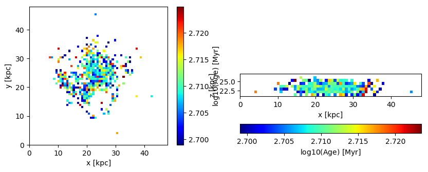


```julia

```
