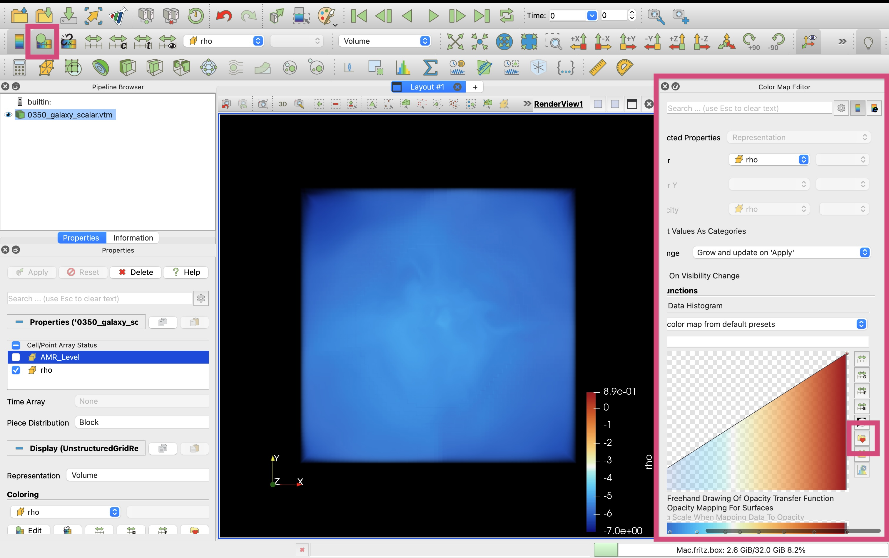
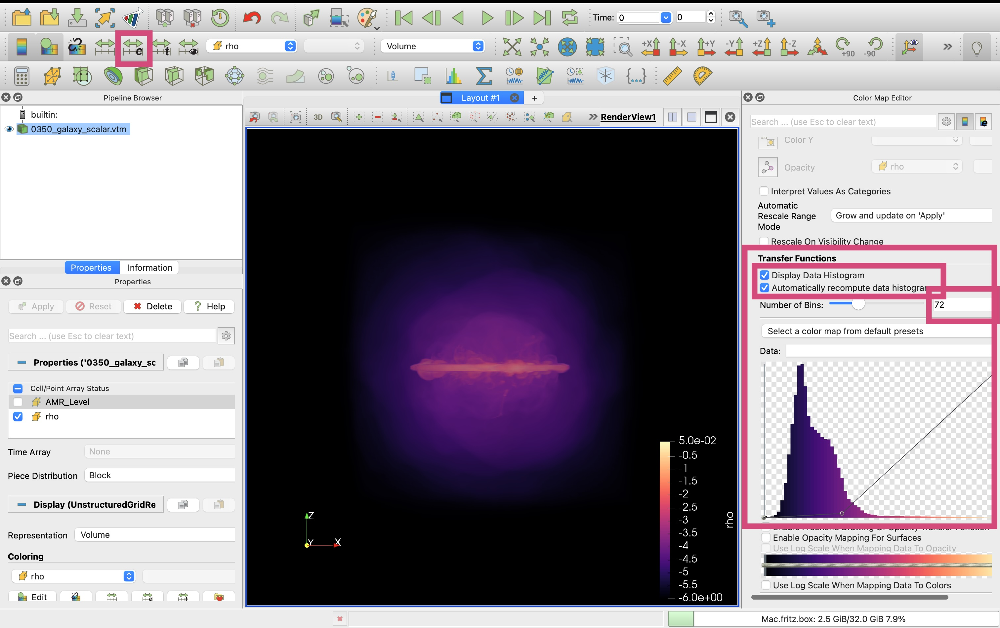
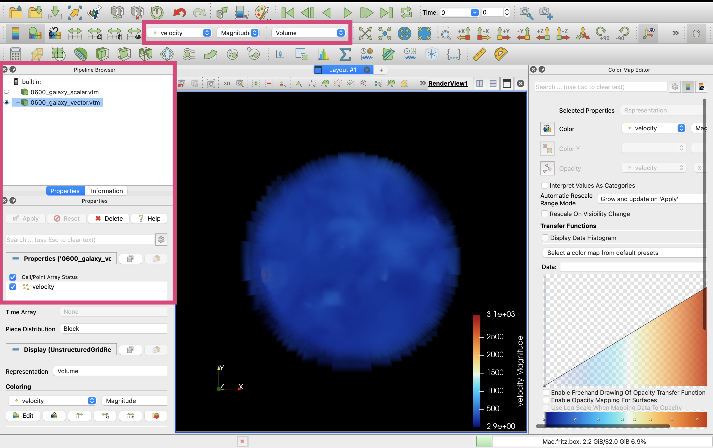
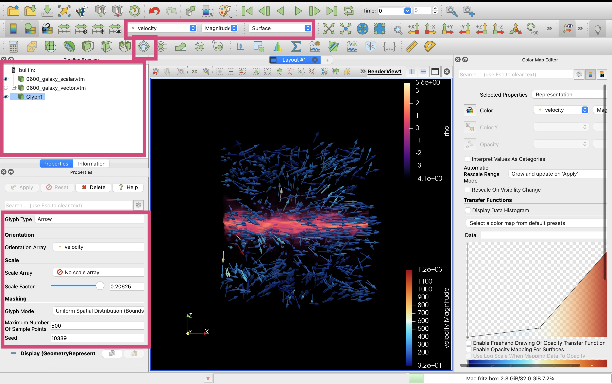

# 8. Hydro: Export Selected Variables to VTK 

## Simulation Overview & Load Hydro Data


```julia
using Mera
# use compressed Mera file
path = "/Volumes/FASTStorage/Simulations/Mera-Tests/AV5CDhr/";
info = infodata(600, path)
gas = loaddata(600, path, :hydro); # load full box
```

    [Mera]: 2025-06-28T15:06:54.435
    
    Use datatype: hydro
    Code: RAMSES
    output [600] summary:
    mtime: 2024-09-08T15:29:04
    ctime: 2024-09-10T11:23:16.230
    =======================================================
    simulation time: 891.71 [Myr]
    boxlen: 48.0 [kpc]
    ncpu: 5120
    ndim: 3
    -------------------------------------------------------
    amr:           true
    level(s): 6 - 13 --> cellsize(s): 750.0 [pc] - 5.86 [pc]
    -------------------------------------------------------
    hydro:         true
    hydro-variables:  7  --> (:rho, :vx, :vy, :vz, :p, :var6, :var7)
    hydro-descriptor: (:density, :velocity_x, :velocity_y, :velocity_z, :pressure, :scalar_00, :scalar_01)
    γ: 1.6667
    -------------------------------------------------------
    gravity:       true
    gravity-variables: (:epot, :ax, :ay, :az)
    -------------------------------------------------------
    particles:     true
    - Nstars:   1.353087e+06 
    particle-variables: 7  --> (:vx, :vy, :vz, :mass, :family, :tag, :birth)
    particle-descriptor: (:position_x, :position_y, :position_z, :velocity_x, :velocity_y, :velocity_z, :mass, :identity, :levelp, :family, :tag, :birth_time)
    -------------------------------------------------------
    rt:            false
    clumps:           false
    -------------------------------------------------------
    namelist-file: ("&COOLING_PARAMS", "&HYDRO_PARAMS", "&SF_PARAMS", "&AMR_PARAMS", "&BOUNDARY_PARAMS", "&OUTPUT_PARAMS", "&POISSON_PARAMS", "&INIT_PARAMS", "&RUN_PARAMS", "&FEEDBACK_PARAMS", "&REFINE_PARAMS")
    -------------------------------------------------------
    timer-file:       true
    compilation-file: true
    makefile:         true
    patchfile:        true
    =======================================================
    
    [Mera]: 2025-06-28T15:06:54.479
    
    Open Mera-file output_00600.jld2:
    
    domain:
    xmin::xmax: 0.0 :: 1.0  	==> 0.0 [kpc] :: 48.0 [kpc]
    ymin::ymax: 0.0 :: 1.0  	==> 0.0 [kpc] :: 48.0 [kpc]
    zmin::zmax: 0.0 :: 1.0  	==> 0.0 [kpc] :: 48.0 [kpc]
    
    Memory used for data table :8.63788466155529 GB
    -------------------------------------------------------
    


## Export Scalars

### Standard Export


```julia
# Export full box with lmax = 9 
# -> interpolating levels 13,12,11,10, down to 9

export_vtk(
    gas,                       # loaded data
    "output01/0600_galaxy";    # prefix for outputfiles; creates folder output01 (if not existing) 
    scalars=[:rho, :T],        # load density data in cm^-3 and temperature data in Kelvin 
    scalars_unit=[:nH, :K],
    scalars_log10=true,        # apply log10 on the scalars
    positions_unit=:kpc,       # cell positions in kpc (useful in Paraview for region selection)
    lmax=9                     
);
```

    [Mera]: 2025-06-28T15:07:40.866
    
    Available Threads: 1
    Created directory: output01
    Processing levels: [6, 7, 8, 9]
    Will interpolate levels [10, 11, 12, 13] down to 9
    Level 6
      wrote 0600_galaxy_L6.vtu (Size: 0.0 GB)
      ✓ Level 6 completed, memory cleaned
    Level 7
      wrote 0600_galaxy_L7.vtu (Size: 0.02 GB)
      ✓ Level 7 completed, memory cleaned
    Level 8
      wrote 0600_galaxy_L8.vtu (Size: 0.33 GB)
      ✓ Level 8 completed, memory cleaned
    Level 9
      Including higher levels for interpolation
      Interpolating down to level 9
      Unique coarse cells at level 9: 13663000 (out of max 134217728)
      → 13663000 coarse cells after interpolation
      wrote 0600_galaxy_L9.vtu (Size: 0.64 GB)
      ✓ Level 9 completed, memory cleaned
      Added block 'Level_6' to scalar VTM for 0600_galaxy_L6.vtu
      Added block 'Level_7' to scalar VTM for 0600_galaxy_L7.vtu
      Added block 'Level_8' to scalar VTM for 0600_galaxy_L8.vtu
      Added block 'Level_9' to scalar VTM for 0600_galaxy_L9.vtu
    Created scalar multiblock: 0600_galaxy_scalar.vtm
      Updating scalar VTM file to reference scalar VTU files...
        - Added reference to 0600_galaxy_L6.vtu in block 'Level_6' of scalar VTM
        - Added reference to 0600_galaxy_L7.vtu in block 'Level_7' of scalar VTM
        - Added reference to 0600_galaxy_L8.vtu in block 'Level_8' of scalar VTM
        - Added reference to 0600_galaxy_L9.vtu in block 'Level_9' of scalar VTM
      Updated scalar VTM file with references to scalar VTU files at: 0600_galaxy_scalar.vtm
    
    === Export Summary ===
    VTU files (scalars): 4
    Scalar VTM: 0600_galaxy_scalar.vtm
    Available scalars: rho, T, AMR_Level


```julia
readdir("output_part01")
```


    1-element Vector{String}:
     "0600_galaxy.vtu"


```julia
# => in Paraview open the vtu file to load all level data
```


```julia

```

### Export Maximum Number of Cells


```julia
# Export full box 
# -> limit the number of cells
# here: not reaching levels 11,12,13
export_vtk(
    gas,                       # loaded data
    "output03/0600_galaxy";    # prefix for outputfiles; creates folder output03 (if not existing) 
    scalars=[:rho, :T],        # load density data in cm^-3 and temperature data in Kelvin 
    scalars_unit=[:nH, :K],
    scalars_log10=true,        # apply log10 on the scalars
    positions_unit=:kpc,       # cell positions in kpc (useful in Paraview for region selection)

    lmax=10,
    max_cells=100_000          # (caps output if exceeded, prioritizing denser regions)
);
```

    [Mera]: 2025-06-28T16:04:43.533
    
    Available Threads: 1
    Processing levels: [6, 7, 8, 9, 10]
    Will interpolate levels [11, 12, 13] down to 10
    Level 6
      wrote 0600_galaxy_L6.vtu (Size: 0.0 GB)
      ✓ Level 6 completed, memory cleaned
    Level 7
      wrote 0600_galaxy_L7.vtu (Size: 0.02 GB)
      ✓ Level 7 completed, memory cleaned
    Level 8
      wrote 0600_galaxy_L8.vtu (Size: 0.33 GB)
      ✓ Level 8 completed, memory cleaned
    Level 9
      wrote 0600_galaxy_L9.vtu (Size: 0.54 GB)
      ✓ Level 9 completed, memory cleaned
    Level 10
      Including higher levels for interpolation
      Interpolating down to level 10
      Unique coarse cells at level 10: 6968288 (out of max 1073741824)
      Capping output cells to 100000 (from 6968288)
      → 100000 coarse cells after interpolation
      wrote 0600_galaxy_L10.vtu (Size: 0.0 GB)
      ✓ Level 10 completed, memory cleaned
      Added block 'Level_6' to scalar VTM for 0600_galaxy_L6.vtu
      Added block 'Level_7' to scalar VTM for 0600_galaxy_L7.vtu
      Added block 'Level_8' to scalar VTM for 0600_galaxy_L8.vtu
      Added block 'Level_9' to scalar VTM for 0600_galaxy_L9.vtu
      Added block 'Level_10' to scalar VTM for 0600_galaxy_L10.vtu
    Created scalar multiblock: 0600_galaxy_scalar.vtm
      Updating scalar VTM file to reference scalar VTU files...
        - Added reference to 0600_galaxy_L6.vtu in block 'Level_6' of scalar VTM
        - Added reference to 0600_galaxy_L7.vtu in block 'Level_7' of scalar VTM
        - Added reference to 0600_galaxy_L8.vtu in block 'Level_8' of scalar VTM
        - Added reference to 0600_galaxy_L9.vtu in block 'Level_9' of scalar VTM
        - Added reference to 0600_galaxy_L10.vtu in block 'Level_10' of scalar VTM
      Updated scalar VTM file with references to scalar VTU files at: 0600_galaxy_scalar.vtm
    
    === Export Summary ===
    VTU files (scalars): 5
    Scalar VTM: 0600_galaxy_scalar.vtm
    Available scalars: rho, T, AMR_Level


```julia
readdir("output03")
```


    6-element Vector{String}:
     "0600_galaxy_L10.vtu"
     "0600_galaxy_L6.vtu"
     "0600_galaxy_L7.vtu"
     "0600_galaxy_L8.vtu"
     "0600_galaxy_L9.vtu"
     "0600_galaxy_scalar.vtm"


```julia
# => in Paraview open the vtm file to load all level data
```

## Export Scalars and Vector


```julia
# Export full box with lmax = 9 
# scalar and vector in separate files
# -> interpolating levels 13,12,11,10, down to 9

export_vtk(
    gas,                       # loaded data
    "output04/0600_galaxy";    # prefix for outputfiles; creates folder output04 (if not existing) 
    scalars=[:rho],            # load density data in cm^-3 
    scalars_unit=[:nH],
    scalars_log10=true,        # apply log10 on the scalars
    positions_unit=:kpc,       # cell positions in kpc (useful in Paraview for region selection)
    lmax=9 ,

    vector=[:vx, :vy, :vz],    # velocity components and its units
    vector_unit=:km_s,
    vector_name="velocity"     # vector name recognized by Paraview
);
```

    [Mera]: 2025-06-28T15:35:19.707
    
    Available Threads: 1
    Created directory: output04
    Processing levels: [6, 7, 8, 9]
    Will interpolate levels [10, 11, 12, 13] down to 9
    Level 6
      wrote 0600_galaxy_L6.vtu (Size: 0.0 GB)
      wrote 0600_galaxy_vec_L6.vtu (Size: 0.0 GB)
      ✓ Level 6 completed, memory cleaned
    Level 7
      wrote 0600_galaxy_L7.vtu (Size: 0.01 GB)
      wrote 0600_galaxy_vec_L7.vtu (Size: 0.02 GB)
      ✓ Level 7 completed, memory cleaned
    Level 8
      wrote 0600_galaxy_L8.vtu (Size: 0.28 GB)
      wrote 0600_galaxy_vec_L8.vtu (Size: 0.41 GB)
      ✓ Level 8 completed, memory cleaned
    Level 9
      Including higher levels for interpolation
      Interpolating down to level 9
      Unique coarse cells at level 9: 13663000 (out of max 134217728)
      → 13663000 coarse cells after interpolation
      wrote 0600_galaxy_L9.vtu (Size: 0.55 GB)
      wrote 0600_galaxy_vec_L9.vtu (Size: 0.77 GB)
      ✓ Level 9 completed, memory cleaned
      Added block 'Level_6' to scalar VTM for 0600_galaxy_L6.vtu
      Added block 'Level_7' to scalar VTM for 0600_galaxy_L7.vtu
      Added block 'Level_8' to scalar VTM for 0600_galaxy_L8.vtu
      Added block 'Level_9' to scalar VTM for 0600_galaxy_L9.vtu
    Created scalar multiblock: 0600_galaxy_scalar.vtm
      Updating scalar VTM file to reference scalar VTU files...
        - Added reference to 0600_galaxy_L6.vtu in block 'Level_6' of scalar VTM
        - Added reference to 0600_galaxy_L7.vtu in block 'Level_7' of scalar VTM
        - Added reference to 0600_galaxy_L8.vtu in block 'Level_8' of scalar VTM
        - Added reference to 0600_galaxy_L9.vtu in block 'Level_9' of scalar VTM
      Updated scalar VTM file with references to scalar VTU files at: 0600_galaxy_scalar.vtm
      Added block 'vec_Level_6' to vector VTM for 0600_galaxy_vec_L6.vtu
      Added block 'vec_Level_7' to vector VTM for 0600_galaxy_vec_L7.vtu
      Added block 'vec_Level_8' to vector VTM for 0600_galaxy_vec_L8.vtu
      Added block 'vec_Level_9' to vector VTM for 0600_galaxy_vec_L9.vtu
    Created vector multiblock: 0600_galaxy_vector.vtm
      Updating vector VTM file to reference vector VTU files...
        - Added reference to 0600_galaxy_vec_L6.vtu in block 'vec_Level_6' of vector VTM
        - Added reference to 0600_galaxy_vec_L7.vtu in block 'vec_Level_7' of vector VTM
        - Added reference to 0600_galaxy_vec_L8.vtu in block 'vec_Level_8' of vector VTM
        - Added reference to 0600_galaxy_vec_L9.vtu in block 'vec_Level_9' of vector VTM
      Updated vector VTM file with references to vector VTU files at: 0600_galaxy_vector.vtm
    
    === Export Summary ===
    VTU files (scalars): 4
    Scalar VTM: 0600_galaxy_scalar.vtm
    VTU files (vector): 4
    Vector VTM: 0600_galaxy_vector.vtm
    Available scalars: rho, AMR_Level
    Available vector, named: velocity


```julia
readdir("output04")
```


    10-element Vector{String}:
     "0600_galaxy_L6.vtu"
     "0600_galaxy_L7.vtu"
     "0600_galaxy_L8.vtu"
     "0600_galaxy_L9.vtu"
     "0600_galaxy_scalar.vtm"
     "0600_galaxy_vec_L6.vtu"
     "0600_galaxy_vec_L7.vtu"
     "0600_galaxy_vec_L8.vtu"
     "0600_galaxy_vec_L9.vtu"
     "0600_galaxy_vector.vtm"


```julia
# => in Paraview open
# - the vtm file to load all level data
# - open "0350_galaxy_scalar.vtm" to load multi-level scalar data
# - open  "0350_galaxy_vector.vtm"to load mjulti-level vector data
# - or open both vtm files together
```

## Visualisation in Paraview

### Volume Rendering Density


```julia
# for a test on my laptop I use lmax=8 for the full box
# and lmax=9 for the galaxy region
```


```julia

```


```julia
# Export full box with lmax = 8 
# scalar and vector in separate files
# -> interpolating levels 13,12,11,10, 9 down to 8

export_vtk(
    gas,                       # loaded data
    "output05/0600_galaxy";    # prefix for outputfiles; creates folder output05 (if not existing) 
    scalars=[:rho],            # load density data in cm^-3 
    scalars_unit=[:nH],
    scalars_log10=true,        # apply log10 on the scalars
    positions_unit=:kpc,       # cell positions in kpc (useful in Paraview for region selection)
    lmax=8 ,

    vector=[:vx, :vy, :vz],    # velocity components and its units
    vector_unit=:km_s,
    vector_name="velocity"     # vector name recognized by Paraview
);
```

    [Mera]: 2025-06-28T15:45:52.426
    
    Available Threads: 1
    Created directory: output05
    Processing levels: [6, 7, 8]
    Will interpolate levels [9, 10, 11, 12, 13] down to 8
    Level 6
      wrote 0600_galaxy_L6.vtu (Size: 0.0 GB)
      wrote 0600_galaxy_vec_L6.vtu (Size: 0.0 GB)
      ✓ Level 6 completed, memory cleaned
    Level 7
      wrote 0600_galaxy_L7.vtu (Size: 0.01 GB)
      wrote 0600_galaxy_vec_L7.vtu (Size: 0.02 GB)
      ✓ Level 7 completed, memory cleaned
    Level 8
      Including higher levels for interpolation
      Interpolating down to level 8
      Unique coarse cells at level 8: 9517504 (out of max 16777216)
      → 9517504 coarse cells after interpolation
      wrote 0600_galaxy_L8.vtu (Size: 0.39 GB)
      wrote 0600_galaxy_vec_L8.vtu (Size: 0.55 GB)
      ✓ Level 8 completed, memory cleaned
      Added block 'Level_6' to scalar VTM for 0600_galaxy_L6.vtu
      Added block 'Level_7' to scalar VTM for 0600_galaxy_L7.vtu
      Added block 'Level_8' to scalar VTM for 0600_galaxy_L8.vtu
    Created scalar multiblock: 0600_galaxy_scalar.vtm
      Updating scalar VTM file to reference scalar VTU files...
        - Added reference to 0600_galaxy_L6.vtu in block 'Level_6' of scalar VTM
        - Added reference to 0600_galaxy_L7.vtu in block 'Level_7' of scalar VTM
        - Added reference to 0600_galaxy_L8.vtu in block 'Level_8' of scalar VTM
      Updated scalar VTM file with references to scalar VTU files at: 0600_galaxy_scalar.vtm
      Added block 'vec_Level_6' to vector VTM for 0600_galaxy_vec_L6.vtu
      Added block 'vec_Level_7' to vector VTM for 0600_galaxy_vec_L7.vtu
      Added block 'vec_Level_8' to vector VTM for 0600_galaxy_vec_L8.vtu
    Created vector multiblock: 0600_galaxy_vector.vtm
      Updating vector VTM file to reference vector VTU files...
        - Added reference to 0600_galaxy_vec_L6.vtu in block 'vec_Level_6' of vector VTM
        - Added reference to 0600_galaxy_vec_L7.vtu in block 'vec_Level_7' of vector VTM
        - Added reference to 0600_galaxy_vec_L8.vtu in block 'vec_Level_8' of vector VTM
      Updated vector VTM file with references to vector VTU files at: 0600_galaxy_vector.vtm
    
    === Export Summary ===
    VTU files (scalars): 3
    Scalar VTM: 0600_galaxy_scalar.vtm
    VTU files (vector): 3
    Vector VTM: 0600_galaxy_vector.vtm
    Available scalars: rho, AMR_Level
    Available vector, named: velocity


```julia
readdir("output05")
```


    8-element Vector{String}:
     "0600_galaxy_L6.vtu"
     "0600_galaxy_L7.vtu"
     "0600_galaxy_L8.vtu"
     "0600_galaxy_scalar.vtm"
     "0600_galaxy_vec_L6.vtu"
     "0600_galaxy_vec_L7.vtu"
     "0600_galaxy_vec_L8.vtu"
     "0600_galaxy_vector.vtm"


**Open Scalar vtm File**


```julia

```

**Select rho array, volume rendering and apply**


```julia

```

**Choose a suitable colormap**




```julia

```

**Select value range, opazity and visualize data histogram**




```julia

```

**Change orientation, value range**


```julia
# => save state
```

### Visualize Density & Vector


```julia
# extract a small region of the galaxy
gassub = subregion(gas, :cylinder, radius=1., height=1., range_unit=:kpc, center=[23.,23.,:bc]);
```

    [Mera]: 2025-06-28T15:51:50.842
    
    center: [0.4791667, 0.4791667, 0.5] ==> [23.0 [kpc] :: 23.0 [kpc] :: 24.0 [kpc]]
    
    domain:
    xmin::xmax: 0.4583333 :: 0.5  	==> 22.0 [kpc] :: 24.0 [kpc]
    ymin::ymax: 0.4583333 :: 0.5  	==> 22.0 [kpc] :: 24.0 [kpc]
    zmin::zmax: 0.4791667 :: 0.5208333  	==> 23.0 [kpc] :: 25.0 [kpc]
    
    Radius: 1.0 [kpc]
    Height: 1.0 [kpc]
    Memory used for data table :147.8594617843628 MB
    -------------------------------------------------------
    


```julia
# Export small region with all available AMR levels
# scalar and vector in separate files

export_vtk(
    gassub,                    # loaded data
    "output06/0600_galaxy";    # prefix for outputfiles; creates folder output06 (if not existing) 
    scalars=[:rho],            # load density data in cm^-3 
    scalars_unit=[:nH],
    scalars_log10=true,        # apply log10 on the scalars
    positions_unit=:kpc,       # cell positions in kpc (useful in Paraview for region selection)

    vector=[:vx, :vy, :vz],    # velocity components and its units
    vector_unit=:km_s,
    vector_name="velocity"     # vector name recognized by Paraview
);
```

    [Mera]: 2025-06-28T16:11:51.637
    
    Available Threads: 1
    Created directory: output06
    Processing levels: [10, 11, 12, 13]
    Level 10
      wrote 0600_galaxy_L10.vtu (Size: 0.0 GB)
      wrote 0600_galaxy_vec_L10.vtu (Size: 0.0 GB)
      ✓ Level 10 completed, memory cleaned
    Level 11
      wrote 0600_galaxy_L11.vtu (Size: 0.01 GB)
      wrote 0600_galaxy_vec_L11.vtu (Size: 0.02 GB)
      ✓ Level 11 completed, memory cleaned
    Level 12
      wrote 0600_galaxy_L12.vtu (Size: 0.02 GB)
      wrote 0600_galaxy_vec_L12.vtu (Size: 0.03 GB)
      ✓ Level 12 completed, memory cleaned
    Level 13
      wrote 0600_galaxy_L13.vtu (Size: 0.03 GB)
      wrote 0600_galaxy_vec_L13.vtu (Size: 0.04 GB)
      ✓ Level 13 completed, memory cleaned
      Added block 'Level_10' to scalar VTM for 0600_galaxy_L10.vtu
      Added block 'Level_11' to scalar VTM for 0600_galaxy_L11.vtu
      Added block 'Level_12' to scalar VTM for 0600_galaxy_L12.vtu
      Added block 'Level_13' to scalar VTM for 0600_galaxy_L13.vtu
    Created scalar multiblock: 0600_galaxy_scalar.vtm
      Updating scalar VTM file to reference scalar VTU files...
        - Added reference to 0600_galaxy_L10.vtu in block 'Level_10' of scalar VTM
        - Added reference to 0600_galaxy_L11.vtu in block 'Level_11' of scalar VTM
        - Added reference to 0600_galaxy_L12.vtu in block 'Level_12' of scalar VTM
        - Added reference to 0600_galaxy_L13.vtu in block 'Level_13' of scalar VTM
      Updated scalar VTM file with references to scalar VTU files at: 0600_galaxy_scalar.vtm
      Added block 'vec_Level_10' to vector VTM for 0600_galaxy_vec_L10.vtu
      Added block 'vec_Level_11' to vector VTM for 0600_galaxy_vec_L11.vtu
      Added block 'vec_Level_12' to vector VTM for 0600_galaxy_vec_L12.vtu
      Added block 'vec_Level_13' to vector VTM for 0600_galaxy_vec_L13.vtu
    Created vector multiblock: 0600_galaxy_vector.vtm
      Updating vector VTM file to reference vector VTU files...
        - Added reference to 0600_galaxy_vec_L10.vtu in block 'vec_Level_10' of vector VTM
        - Added reference to 0600_galaxy_vec_L11.vtu in block 'vec_Level_11' of vector VTM
        - Added reference to 0600_galaxy_vec_L12.vtu in block 'vec_Level_12' of vector VTM
        - Added reference to 0600_galaxy_vec_L13.vtu in block 'vec_Level_13' of vector VTM
      Updated vector VTM file with references to vector VTU files at: 0600_galaxy_vector.vtm
    
    === Export Summary ===
    VTU files (scalars): 4
    Scalar VTM: 0600_galaxy_scalar.vtm
    VTU files (vector): 4
    Vector VTM: 0600_galaxy_vector.vtm
    Available scalars: rho, AMR_Level
    Available vector, named: velocity


```julia
readdir("output06")
```


    10-element Vector{String}:
     "0600_galaxy_L10.vtu"
     "0600_galaxy_L11.vtu"
     "0600_galaxy_L12.vtu"
     "0600_galaxy_L13.vtu"
     "0600_galaxy_scalar.vtm"
     "0600_galaxy_vec_L10.vtu"
     "0600_galaxy_vec_L11.vtu"
     "0600_galaxy_vec_L12.vtu"
     "0600_galaxy_vec_L13.vtu"
     "0600_galaxy_vector.vtm"


**Load Scalar**


```julia

```

**Select rho data, volume rendering, color map, choose value range**


```julia

```

**Load Vector data**


```julia

```

**Select velocity data, magnitude volume rendering**




```julia

```

**Edge-on view, apply 3D Glyphs on vector data, choose array and number of sample points**




```julia

```

**Apply streamline tracer, point cloud and its size, number of points**


```julia
# => save state
```


```julia

```
