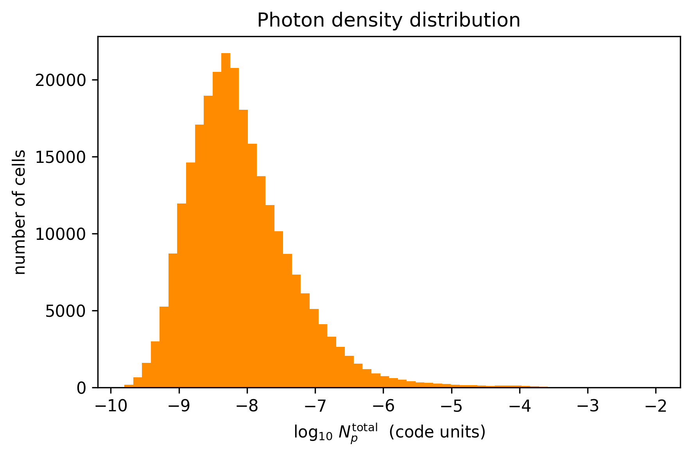
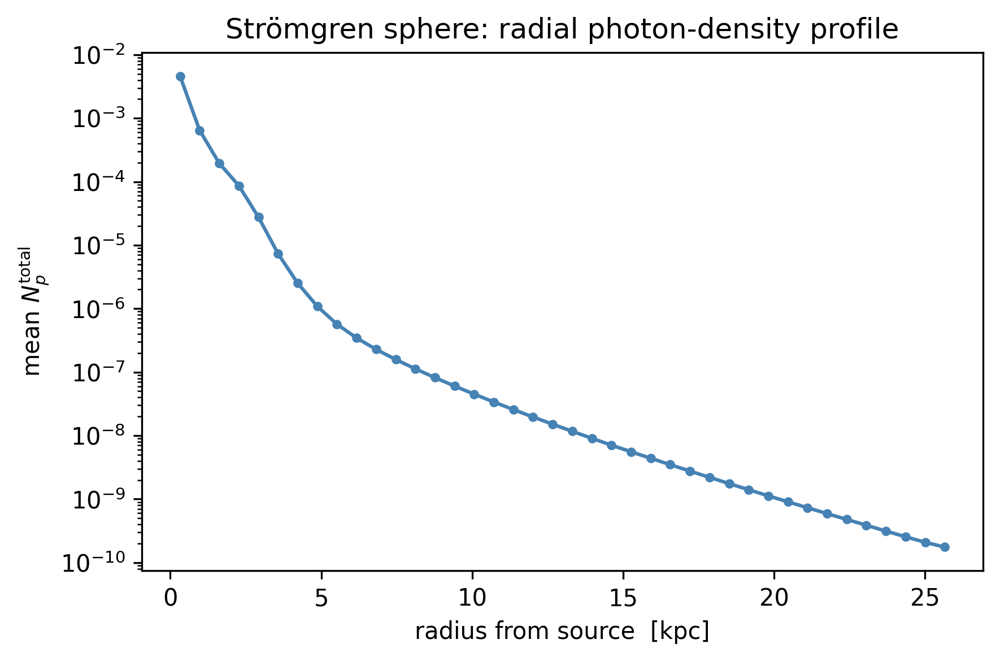
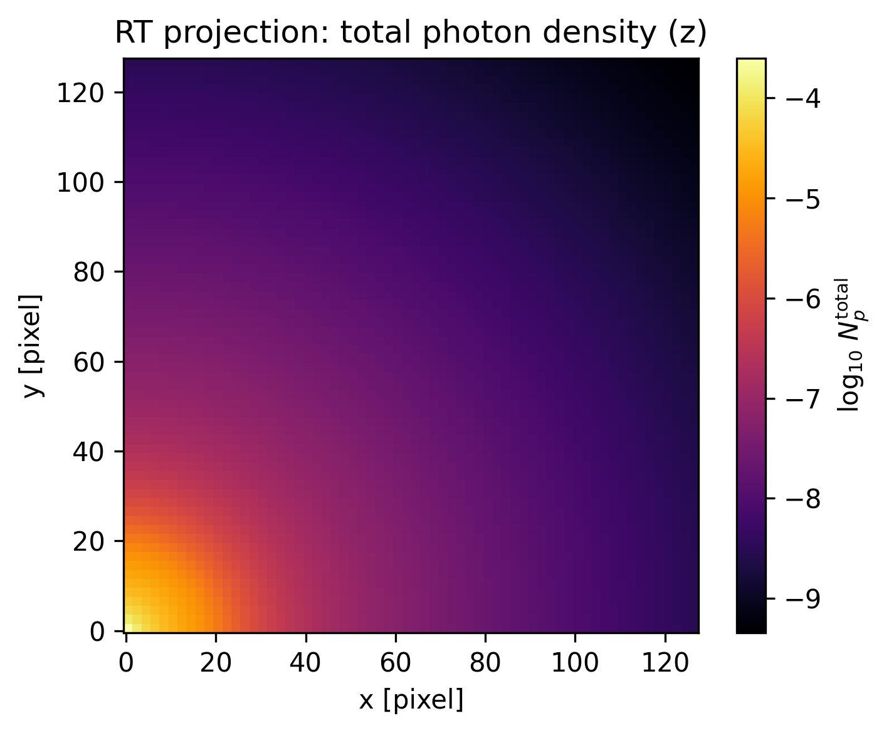

# 10. Radiative Transfer (RT)

RAMSES can run with **radiative transfer** (`RT=1`): each cell carries, per photon
group `g`, a photon number density `Np`g` and the photon flux `Fx`g`/`Fy`g`/`Fz`g`
(so `nvarrt = 4 · nGroups`). Mera reads these with `getrt`, analogous to `gethydro`.

This tutorial shows how to **open, inspect, getvar, plot, and select regions** of
RT data. (2D projection maps for RT are a work in progress.)

## Test simulation

The example uses the standard **RAMSES Strömgren-sphere RT test** (`stromgren.nml`,
shipped with RAMSES, here `ramses-2025.05`, `NGROUPS=3, NIONS=1`, AMR level 6→7): a
point source ionizing a uniform neutral medium — the classic RT benchmark. The
output was produced locally by running that namelist; it is not redistributed.

## Open and inspect

`getinfo` shows the RT block (number of photon groups, ionization fractions, …);
`getrt` loads the leaf-cells into an `RtDataType`.

```julia
using Mera
info = getinfo(3, "/Volumes/FASTStorage/Simulations/Mera-Tests/rt_stromgren");
```

```
[ Info: Precompiling Mera [02f895e8-fdb1-4346-8fe6-c721699f5126] (cache misses: include_dependency fsize change (6), wrong dep version loaded (4), wrong source (2), mismatched flags (6))
SYSTEM: caught exception of type :MethodError while trying to print a failed Task notice; giving up
*__   __ _______ ______   _______
|  |_|  |       |    _ | |   _   |
|       |    ___|   | || |  |_|  |
|       |   |___|   |_||_|       |
|       |    ___|    __  |       |
| ||_|| |   |___|   |  | |   _   |
|_|   |_|_______|___|  |_|__| |__|
[Mera]: 2026-06-02T09:43:35.264
Code: RAMSES
output [3] summary:
mtime: 2026-06-01T21:54:33.519
ctime: 2026-06-01T21:54:33.519
=======================================================
simulation time: 20.02 [Myr]
boxlen: 15.0 [kpc]
ncpu: 1
ndim: 3
cosmological:  false
-------------------------------------------------------
amr:           true
level(s): 6 - 7 --> cellsize(s): 234.38 [pc] - 117.19 [pc]
-------------------------------------------------------
hydro:         true
hydro-variables:
8  --> (:rho, :vx, :vy, :vz, :p, :var6, :var7, :var8)
hydro-descriptor: (:density, :velocity_x, :velocity_y, :velocity_z, :pressure, :scalar_00, :scalar_01, :scalar_02)
γ: 1.4
gravity:       false
particles:     false
-------------------------------------------------------
rt:            true
rt-variables: 12
nIons: ?
nGroups: 3
iIons: ?
-------------------------------------------------------
clumps:           false
-------------------------------------------------------
namelist-file: ("&COOLING_PARAMS", "&AMR_PARAMS", "&OUTPUT_PARAMS", "&BOUNDARY_PARAMS", "&RT_PARAMS", "&RT_GROUPS\t\t\t! Blackbody at T=1d5 Kelvin", "&UNITS_PARAMS", "&RUN_PARAMS", "&HYDRO_PARAMS", "&INIT_PARAMS", "&REFINE_PARAMS")
-------------------------------------------------------
timer-file:       true
compilation-file: true
makefile:         true
patchfile:        true
=======================================================
```

```julia
info.rt, info.nvarrt, info.rt_variable_list
```

```
(true, 12, [:Np1, :Fx1, :Fy1, :Fz1, :Np2, :Fx2, :Fy2, :Fz2, :Np3, :Fx3, :Fy3, :Fz3])
```

```julia
rt = getrt(info);
```

```
[Mera]: Get RT data: 2026-06-02T09:43:37.913
Key vars=(:level, :cx, :cy, :cz)
Using var(s)=(1, 2, 3, 4, 5, 6, 7, 8, 9, 10, 11, 12) = (:Np1, :Fx1, :Fy1, :Fz1, :Np2, :Fx2, :Fy2, :Fz2, :Np3, :Fx3, :Fy3, :Fz3)
domain:
xmin::xmax: 0.0 :: 1.0  	==> 0.0 [kpc] :: 15.0 [kpc]
ymin::ymax: 0.0 :: 1.0  	==> 0.0 [kpc] :: 15.0 [kpc]
zmin::zmax: 0.0 :: 1.0  	==> 0.0 [kpc] :: 15.0 [kpc]
📊 Processing Configuration:
   Total CPU files available: 1
   Files to be processed: 1
   Compute threads: 4
   GC threads: 4
Processing files: 100%|██████████████████████████████████████████████████| Time: 0:00:00 ( 0.59  s/it)
✓ File processing complete! Combining results...
✓ Data combination complete!
Final data size: 262144 cells, 12 variables
   Threading: 4 threads for 16 columns
   Max threads requested: 4
   Available threads: 4
   Using parallel processing with 4 threads
   Creating IndexedTable with 16 columns...
Memory used for data table :32.001564025878906
 MB
-------------------------------------------------------
```

```julia
rt.data
```

```
Table with 262144 rows, 16 columns:
Columns:
#   colname  type
────────────────────
1   level    Int64
2   cx       Int64
3   cy       Int64
4   cz       Int64
5   Np1      Float64
6   Fx1      Float64
7   Fy1      Float64
8   Fz1      Float64
9   Np2      Float64
10  Fx2      Float64
11  Fy2      Float64
12  Fz2      Float64
13  Np3      Float64
14  Fx3      Float64
15  Fy3      Float64
16  Fz3      Float64
```

## Variables with `getvar`

Raw RT variables (`:Np1`, `:Fx1`, …), the per-group **flux magnitude** `:Fmag`g`,
the **total** photon density `:Np_total`, and the usual geometry (`:x/:y/:z`,
`:cellsize`, `:r_sphere`, …) all work.

```julia
np_total = getvar(rt, :Np_total)
fmag1    = getvar(rt, :Fmag1)
(Np_total_max = maximum(np_total), Fmag1_max = maximum(fmag1))
```

```
(Np_total_max = 0.009354164109193559, Fmag1_max = 0.0005397420584191681)
```

## Plot: photon-density distribution

```julia
using PyPlot
rc("figure", dpi=300); rc("savefig", dpi=300)
figure(figsize=(6,4))
hist(log10.(np_total[np_total .> 0]), bins=60, color="darkorange")
xlabel(L"$\log_{10}\,N_p^{\rm total}$  (code units)"); ylabel("number of cells")
title("Photon density distribution"); tight_layout();
```



## Radial profile of the Strömgren sphere

The source sits at the box corner. Binning the total photon density by distance
from the source shows the radial fall-off / ionization front.

```julia
r  = getvar(rt, :r_sphere, :kpc, center=[0.,0.,0.])
np = getvar(rt, :Np_total)
nbins = 40; rmax = maximum(r)
edges = range(0, rmax, length=nbins+1)
centers = [(edges[i]+edges[i+1])/2 for i in 1:nbins]
prof = [ (m = (r .>= edges[i]) .& (r .< edges[i+1]); any(m) ? sum(np])/count(m) : 0.0) for i in 1:nbins ]
figure(figsize=(6,4))
plot(centers, prof, "-o", ms=3, color="steelblue")
yscale("log"); xlabel("radius from source  [kpc]"); ylabel(L"mean $N_p^{\rm total}$")
title("Strömgren sphere: radial photon-density profile"); tight_layout();
```



## Region selection (subregion / shellregion)

`subregion` and `shellregion` work on RT data like on hydro — useful for slices
and shells. Here: a sphere and a radial shell around the box center.

```julia
sub   = subregion(rt, :sphere, radius=5., center=[:bc], range_unit=:kpc)
shell = shellregion(rt, :sphere, radius=[3.,6.], center=[:bc], range_unit=:kpc)
(all_cells = length(rt.data), in_sphere = length(sub.data), in_shell = length(shell.data))
```

```
[Mera]: 2026-06-02T09:43:46.207
center: [0.5, 0.5, 0.5] ==> [7.5 [kpc] :: 7.5 [kpc] :: 7.5 [kpc]]
domain:
xmin::xmax: 0.1666672 :: 0.8333345  	==> 2.5 [kpc] :: 12.5 [kpc]
ymin::ymax: 0.1666672 :: 0.8333345  	==> 2.5 [kpc] :: 12.5 [kpc]
zmin::zmax: 0.1666672 :: 0.8333345  	==> 2.5 [kpc] :: 12.5 [kpc]
Radius: 5.0 [kpc]
Memory used for data table :5.523414611816406
 MB
-------------------------------------------------------
[Mera]: 2026-06-02T09:43:46.994
center: [0.5, 0.5, 0.5] ==> [7.5 [kpc] :: 7.5 [kpc] :: 7.5 [kpc]]
domain:
xmin::xmax: 0.1000005 :: 0.9000012  	==> 1.5 [kpc] :: 13.5 [kpc]
ymin::ymax: 0.1000005 :: 0.9000012  	==> 1.5 [kpc] :: 13.5 [kpc]
zmin::zmax: 0.1000005 :: 0.9000012  	==> 1.5 [kpc] :: 13.5 [kpc]
Inner radius: 3.0 [kpc]
Outer radius: 6.0 [kpc]
Radius diff: 3.0 [kpc]
Memory used for data table :8.088722229003906
 MB
-------------------------------------------------------
```

```
(all_cells = 262144, in_sphere = 45235, in_shell = 66250)
```

## Projection (2D maps)

`projection` works on RT data too. RT has no mass, so it defaults to
**volume-weighting**. Project the total photon density along z; a thin `zrange`
gives a slice.

```julia
proj = projection(rt, :Np_total, verbose=false, show_progress=false)
figure(figsize=(5,4))
imshow(log10.(permutedims(proj.maps[:Np_total]) .+ 1e-50), origin="lower", cmap="inferno")
colorbar(label=L"$\log_{10}\,N_p^{\rm total}$"); title("RT projection: total photon density (z)")
xlabel("x [pixel]"); ylabel("y [pixel]"); tight_layout();
```



## Summary

| call | result |
|---|---|
| `getrt(info)` | load RT leaf-cells → `RtDataType` |
| `getvar(rt, :Np1)` / `:Fx1` … | raw photon density / flux per group |
| `getvar(rt, :Fmag1)` | flux magnitude per group |
| `getvar(rt, :Np_total)` | total photon density (Σ groups) |
| `getvar(rt, :x/:r_sphere/:cellsize)` | geometry (shared with hydro) |
| `subregion` / `shellregion` | spatial selection / slices |

All shown above run on the `RtDataType` returned by `getrt`.
