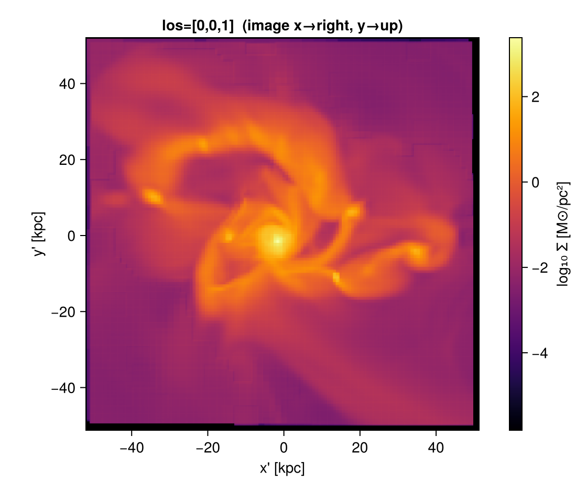
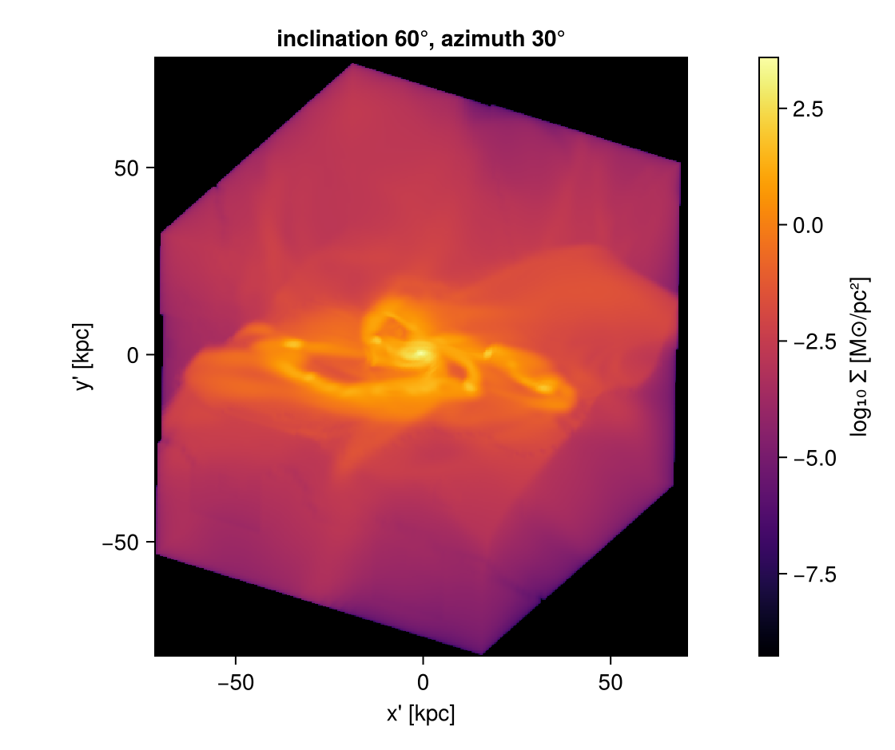
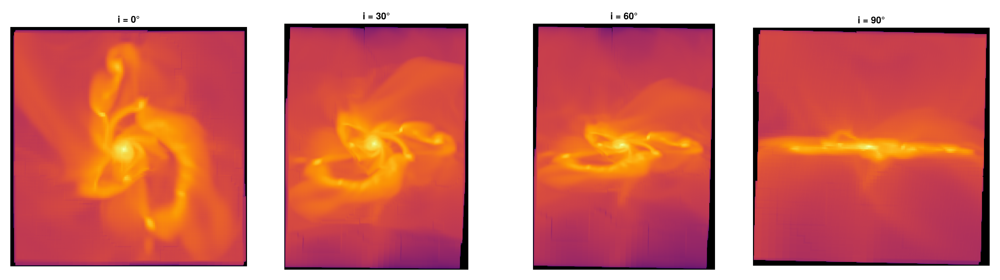
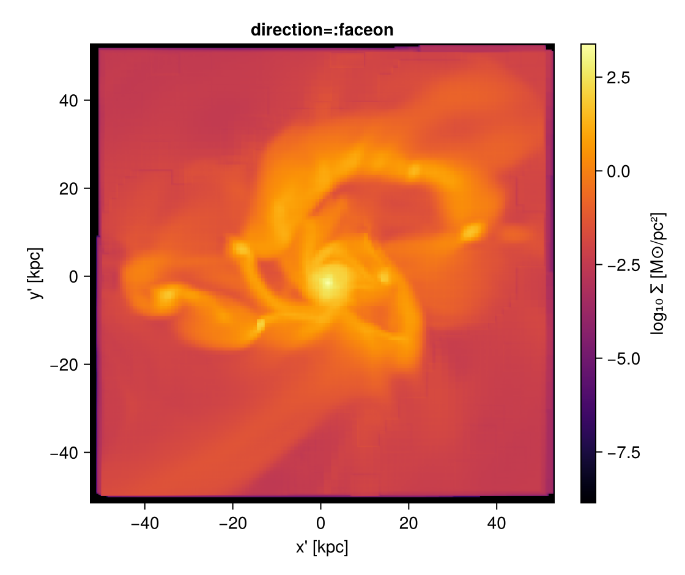
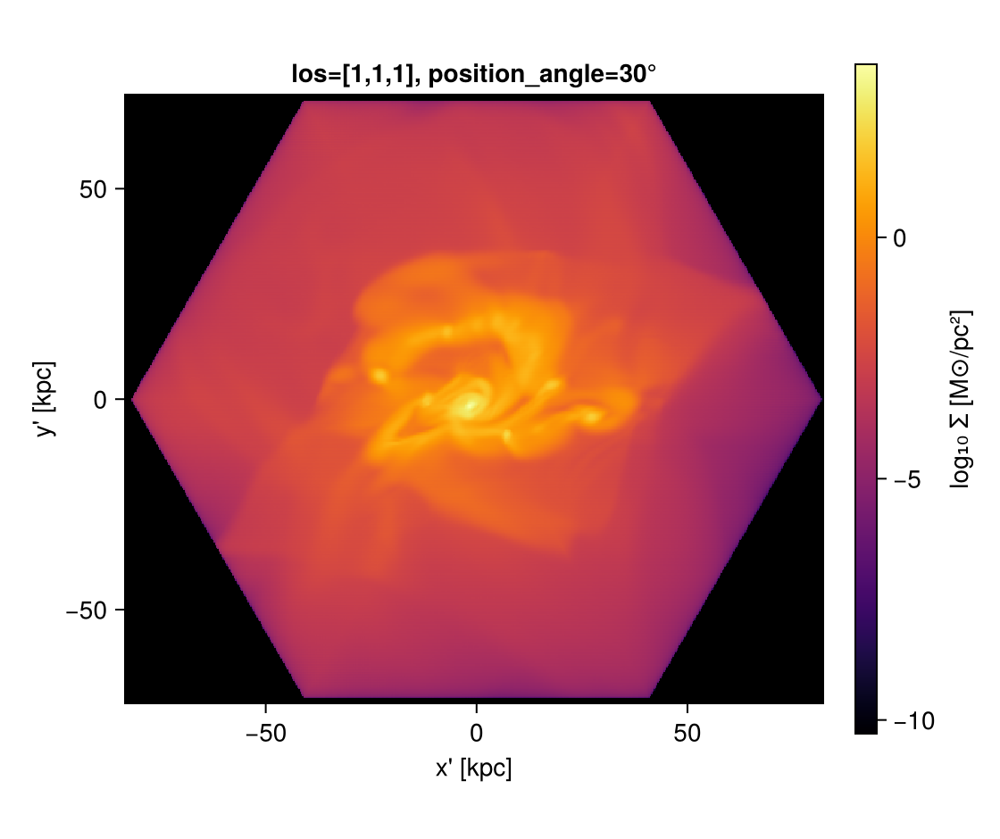
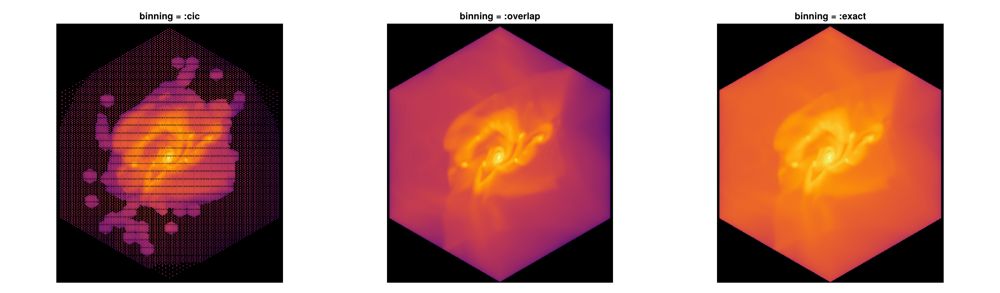
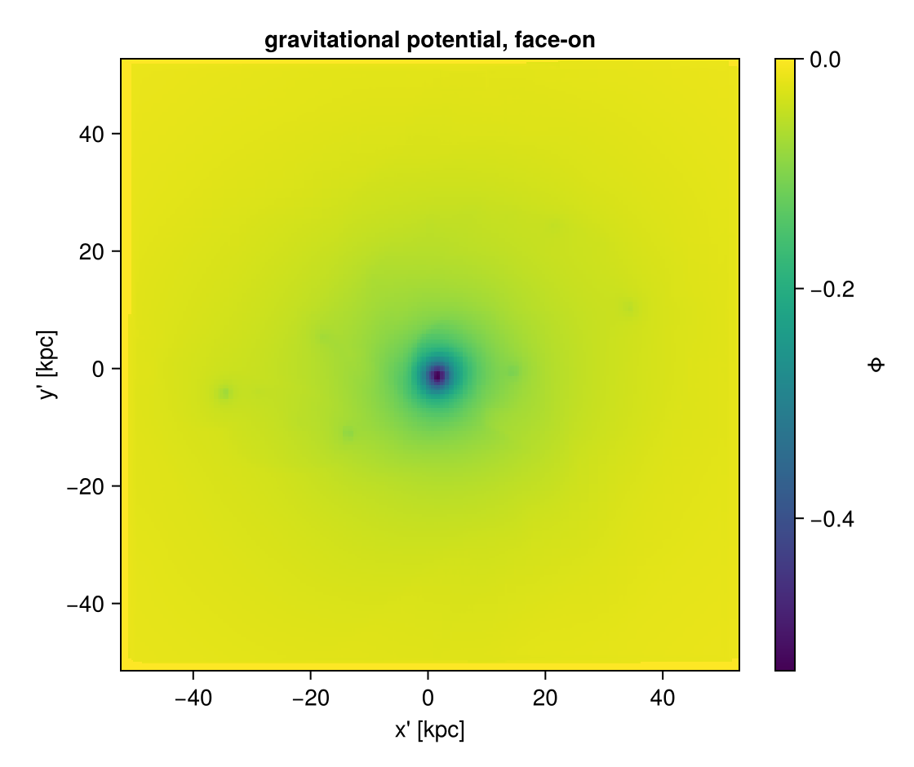
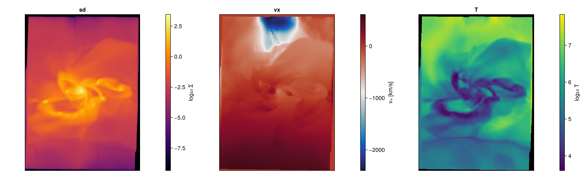

# Off-axis projection with Mera

Project hydro / RT / gravity / particle data along **any line of sight**, not just the box
axes. An off-axis projection is **orthographic**: the observer is at infinity, so all sightlines
are parallel; each cell is carried along the line of sight onto the image plane.

This notebook follows the [Off-axis Projection documentation](https://manuelbehrendt.github.io/Mera.jl/).
Pixel size is set physically with `pxsize=[size, :unit]` (preferred over `res`). Run the cells top
to bottom and change the numbers to play around.


```julia
# --- environment ---------------------------------------------------------
# These tutorials use the development version of Mera in this repository.
# Point Pkg at your Mera.jl checkout (adjust the path), or delete these two
# lines if Mera is already in your default environment.
using Pkg
Pkg.activate(expanduser("~/Documents/codes/github/Mera.jl"))

using Mera, CairoMakie
CairoMakie.activate!()
println("threads = ", Threads.nthreads())
```

      Activating 

    project at `~/Documents/codes/github/Mera.jl`


    [ Info: Precompiling Mera [02f895e8-fdb1-4346-8fe6-c721699f5126] (cache misses: wrong dep version loaded (12), mismatched flags (6))
    
    SYSTEM: caught exception of type :MethodError while trying to print a failed Task notice; giving up
    
    SYSTEM: caught exception of type :MethodError while trying to print a failed Task notice; giving up
    
    SYSTEM: caught exception of type :MethodError while trying to print a failed Task notice; giving up
    
    SYSTEM: caught exception of type :MethodError while trying to print a failed Task notice; giving up


    
    *__   __ _______ ______   _______ 
    |  |_|  |       |    _ | |   _   |
    |       |    ___|   | || |  |_|  |
    |       |   |___|   |_||_|       |
    |       |    ___|    __  |       |
    | ||_|| |   |___|   |  | |   _   |
    |_|   |_|_______|___|  |_|__| |__|
    


    
    SYSTEM: caught exception of type :MethodError while trying to print a failed Task notice; giving up
    
    SYSTEM: caught exception of type :MethodError while trying to print a failed Task notice; giving up
    [ Info: Precompiling CairoMakie [13f3f980-e62b-5c42-98c6-ff1f3baf88f0] (cache misses: wrong dep version loaded (18))


    
    SYSTEM: caught exception of type :MethodError while trying to print a failed Task notice; giving up


    [ Info: Precompiling PolynomialsMakieExt [6a4b1961-d857-5aa3-b7f6-fc7c46de29bb] (cache misses: wrong dep version loaded (18))


    
    SYSTEM: caught exception of type :MethodError while trying to print a failed Task notice; giving up


    threads = 4

    


## Load a galaxy

Set the path/output of a simulation you have. The examples below use the Mera test
galaxies; **change `BASE` to your own data directory**.


```julia
BASE = "/Volumes/FASTStorage/Simulations/Mera-Tests"   # <-- change me
info = getinfo(100, joinpath(BASE, "spiral_clumps"), verbose=false)
gas  = gethydro(info, verbose=false, show_progress=false)
```

      0.749615 seconds (3.91 M allocations: 303.434 MiB, 1.29% gc time, 102.12% compilation time)


    HydroDataType(Table with 590311 rows, 10 columns:
    Columns:
    #   colname  type
    ────────────────────
    1   level    Int64
    2   cx       Int64
    3   cy       Int64
    4   cz       Int64
    5   rho      Float64
    6   vx       Float64
    7   vy       Float64
    8   vz       Float64
    9   p        Float64
    10  metallicity Float64, InfoType(100, "/Volumes/FASTStorage/Simulations/Mera-Tests/spiral_clumps", FileNamesType("/Volumes/FASTStorage/Simulations/Mera-Tests/spiral_clumps/output_00100", "/Volumes/FASTStorage/Simulations/Mera-Tests/spiral_clumps/output_00100/info_00100.txt", "/Volumes/FASTStorage/Simulations/Mera-Tests/spiral_clumps/output_00100/amr_00100.", "/Volumes/FASTStorage/Simulations/Mera-Tests/spiral_clumps/output_00100/hydro_00100.", "/Volumes/FASTStorage/Simulations/Mera-Tests/spiral_clumps/output_00100/hydro_file_descriptor.txt", "/Volumes/FASTStorage/Simulations/Mera-Tests/spiral_clumps/output_00100/grav_00100.", "/Volumes/FASTStorage/Simulations/Mera-Tests/spiral_clumps/output_00100/part_00100.", "/Volumes/FASTStorage/Simulations/Mera-Tests/spiral_clumps/output_00100/part_file_descriptor.txt", "/Volumes/FASTStorage/Simulations/Mera-Tests/spiral_clumps/output_00100/rt_00100.", "/Volumes/FASTStorage/Simulations/Mera-Tests/spiral_clumps/output_00100/rt_file_descriptor.txt", "/Volumes/FASTStorage/Simulations/Mera-Tests/spiral_clumps/output_00100/info_rt_00100.txt", "/Volumes/FASTStorage/Simulations/Mera-Tests/spiral_clumps/output_00100/clump_00100.", "/Volumes/FASTStorage/Simulations/Mera-Tests/spiral_clumps/output_00100/timer_00100.txt", "/Volumes/FASTStorage/Simulations/Mera-Tests/spiral_clumps/output_00100/header_00100.txt", "/Volumes/FASTStorage/Simulations/Mera-Tests/spiral_clumps/output_00100/namelist.txt", "/Volumes/FASTStorage/Simulations/Mera-Tests/spiral_clumps/output_00100/compilation.txt", "/Volumes/FASTStorage/Simulations/Mera-Tests/spiral_clumps/output_00100/makefile.txt", "/Volumes/FASTStorage/Simulations/Mera-Tests/spiral_clumps/output_00100/patches.txt"), "RAMSES", Dates.DateTime("2023-05-12T22:47:36.638"), Dates.DateTime("2025-06-21T18:31:55.533"), 4, 3, 3, 7, 100.0, 9.9335244067439, 1.0, 1.0, 1.0, 0.0, 0.0, 0.045, 3.085677581282e21, 6.77025430198932e-23, 1.9890999999999996e42, 6.559266058737735e6, 4.70430312423675e14, 1.6667, true, 6, 8, 0, [:rho, :vx, :vy, :vz, :p, :metallicity], [:epot, :ax, :ay, :az], [:vx, :vy, :vz, :mass, :family, :tag, :birth, :metals], Symbol[], [:index, :lev, :parent, :ncell, :peak_x, :peak_y, :peak_z, Symbol("rho-"), Symbol("rho+"), :rho_av, :mass_cl, :relevance], Symbol[], DescriptorType(1, [:density, :velocity_x, :velocity_y, :velocity_z, :pressure, :metallicity], ["d", "d", "d", "d", "d", "d"], false, true, 1, [:position_x, :position_y, :position_z, :velocity_x, :velocity_y, :velocity_z, :mass, :identity, :levelp, :family, :tag, :birth_time, :metallicity], ["d", "d", "d", "d", "d", "d", "d", "i", "i", "b", "b", "d", "d"], false, true, [:epot, :ax, :ay, :az], false, false, 0, Dict{Any, Any}(), Dict{Any, Any}(), false, false, [:index, :lev, :parent, :ncell, :peak_x, :peak_y, :peak_z, Symbol("rho-"), Symbol("rho+"), :rho_av, :mass_cl, :relevance], false, false, Symbol[], false, false), true, true, true, false, true, false, true, Dict{Any, Any}("&COOLING_PARAMS" => Dict{Any, Any}("cooling" => ".true. ", "metal" => ".true. ", "z_ave" => "1."), "&SF_PARAMS" => Dict{Any, Any}("m_star " => " 1. ! in units mass_sph", "n_star " => " 1 ", "T2_star" => " 1e4 ", "eps_star " => " 0.02 !2%"), "&AMR_PARAMS" => Dict{Any, Any}("levelmax" => "7", "npartmax" => " 500000", "ngridmax" => " 100000 ", "boxlen" => "100. !kpc\t", "levelmin" => "3 ", "nexpand" => "1                      "), "&BOUNDARY_PARAMS" => Dict{Any, Any}("jbound_min" => " 0, 0,-1,+1,-1,-1", "kbound_max" => " 0, 0, 0, 0,-1,+1", "no_inflow" => ".true.", "bound_type" => " 2, 2, 2, 2, 2, 2    !2", "nboundary " => " 6", "ibound_max" => "-1,+1,+1,+1,+1,+1", "ibound_min" => "-1,+1,-1,-1,-1,-1", "jbound_max" => " 0, 0,-1,+1,+1,+1", "kbound_min" => " 0, 0, 0, 0,-1,+1"), "&OUTPUT_PARAMS" => Dict{Any, Any}("tend" => "10                 !Final time of the simulation", "delta_tout" => "0.1          !Time increment between outputs"), "&POISSON_PARAMS" => Dict{Any, Any}("gravity_type" => "-3       "), "&UNITS_PARAMS" => Dict{Any, Any}("units_density " => " 0.677025430198932E-22 ! 1e9 Msol/kpc^3", "units_time    " => " 0.470430312423675E+15 ! G", "units_length  " => " 0.308567758128200E+22 ! kpc"), "&RUN_PARAMS" => Dict{Any, Any}("pic" => ".true.", "nsubcycle" => "20*2 ", "clumpfind" => "true", "ncontrol" => "1                      !frequency of screen output", "poisson" => ".true.", "verbose" => ".false.", "nremap" => "5 !10", "nrestart" => "99", "hydro" => ".true."), "&CLUMPFIND_PARAMS" => Dict{Any, Any}("ivar_clump" => "1", "density_threshold" => "0.01"), "&FEEDBACK_PARAMS" => Dict{Any, Any}("t_sne" => "10. !10. !Myr", "eta_sn " => "0.2", "!delayed_cooling" => ".true.", "!t_diss " => " 1.\t!Myr", "f_ek" => "0.")…), true, true, Mera.FilesContentType(["#############################################################################", "# If you have problems with this makefile, contact Romain.Teyssier@gmail.com", "#############################################################################", "# Compilation time parameters", "NVECTOR = 64 #32", "NDIM = 3", "NPRE = 8", "NVAR = 6", "NENER = 0", "SOLVER = hydro"  …  "\t\$(F90) \$(FFLAGS) -c write_patch.f90 -o \$@", "%.o:%.F", "\t\$(F90) \$(FFLAGS) -c \$^ -o \$@ \$(LIBS_OBJ)", "%.o:%.f90", "\t\$(F90) \$(FFLAGS) -c \$^ -o \$@ \$(LIBS_OBJ)", "FORCE:", "#############################################################################", "clean:", "\trm -f *.o *.\$(MOD) *.i", "#############################################################################"], [" --------------------------------------------------------------------", "", "     minimum       average       maximum  standard dev        std/av       %   rmn   rmx  TIMER", "       0.388         0.392         0.397         0.004         0.009     0.7     4   1    refine                  ", "       0.507         2.917         5.424         1.783         0.611     5.5     1   3    particles               ", "       1.347         1.701         2.269         0.344         0.202     3.2     4   1    feedback                ", "      16.465        17.380        18.250         0.646         0.037    32.7     3   1    poisson                 ", "       3.399         4.081         4.713         0.478         0.117     7.7     3   1    rho                     ", "       0.529         0.541         0.550         0.008         0.014     1.0     1   3    courant                 ", "       0.079         0.091         0.098         0.007         0.081     0.2     3   2    hydro - set unew        ", "      15.304        18.454        22.169         2.656         0.144    34.8     3   4    hydro - godunov         ", "       1.796         5.559         8.199         2.596         0.467    10.5     4   3    hydro - rev ghostzones  ", "       0.109         0.132         0.142         0.013         0.100     0.2     3   2    hydro - set uold        ", "       0.057         0.088         0.122         0.023         0.262     0.2     1   4    hydro upload fine       ", "       1.073         1.312         1.474         0.161         0.122     2.5     3   4    cooling                 ", "       0.112         0.122         0.135         0.009         0.078     0.2     4   3    hydro - ghostzones      ", "       0.298         0.301         0.306         0.003         0.011     0.6     4   1    flag                    ", "      53.074     100.0    TOTAL"], ["/data2/mabe/MeraTest/Ramses/patch_2019_10version/add_list.f90", "!################################################################", "!################################################################", "!################################################################", "!################################################################", "subroutine add_list(ind_part,list2,ok,np)", "  use amr_commons", "  use pm_commons", "  implicit none", "  integer::np"  …  "     end do", "", "  end do", "  ! End loop over grid cells", "end subroutine tsc_cell", "#endif", "!###########################################################", "!###########################################################", "!###########################################################", "!###########################################################"]), true, true, true, 0, ScalesType002(0.0010000000000006482, 1.0000000000006481, 1000.0000000006482, 1.0000000000006482e6, 3261.5637769461323, 2.0626480623310105e23, 3.0856775812820004e16, 3.085677581282e19, 3.085677581282e21, 3.085677581282e22, 3.085677581282e25, 1.0000000000019446e-9, 1.0000000000019444, 1.0000000000019448e9, 1.0000000000019446e18, 3.469585750743794e10, 8.775571306099254e69, 2.9379989454983075e49, 2.9379989454983063e58, 2.9379989454983065e64, 2.937998945498306e67, 2.937998945498306e76, 0.9999999999980551, 0.9999999999980551, 6.77025430198932e-23, 999.9999999987034, 999.9999999987034, 0.20890821919226463, 0.014907037050462488, 14.907037050462488, 1.4907037050462488e7, 4.70430312423675e14, 4.70430312423675e17, 9.999999999999998e8, 9.999999999999998e8, 3.330598439436053e14, 1.0479261167570186e12, 1.9890999999999996e42, 65.59266058737735, 65592.66058737735, 6.559266058737735e6, 30.996344997059538, 8.557898117221824e55, 2.9128322630389308e-9, 517291.4494607442, 517291.4494607442, 680646.644027295, 680646.644027295, 2.9128322630389304e-9, 2.9128322630389304e-9, 2.109755819936081e7, 2.109755819936081e7, 3.1162135509683387e29, 1.2537844818309073e65, 6.198460374231122e71, 6.198460374231122e64, 2.109755819936081e7, 2.1097558199360812e8, 1.380649e-16, 4.0258946849746426e70, 4.0258946849746426e70, 4.0258946849746425e71, 0.00019132101231911184, 191.32101231911184, 191.32101231911184, 1.9132101231911187e-8, 5.341419875695069e67, 5.341419875695069e64, 5.341419875695069e61, 1.819163836006061e41, 4.752256624885217e7, 4.752256624885217e7, 3.4036771916893676e-65, 1.158501842524895e-120, 30.996344997059538, 0.09145663043618026, 6.1918464565599674e-24, 6.1918464565599674e-24, 0.6191846456559967, 619.1846456559967, 619184.6456559967, 1.2584832481461724e23, 1.2584832481461724e23, 1.3943119491905496e-8, 1.3943119491905495e-10, 1.3943119491905496e-13, 3.0984365782372897e-9, 4.302397122930886e13, 4.302397122930886e6, 4302.397122930886, 2.9128322630389304e-9, 8.557898117221824e55, 9.439846472322433e-31, 4.5186572882681335e-30, 3.085677581282e21, 1.9890999999999996e42, 4.70430312423675e14, 1.0, 6.8587767484e-314, 6.858776867e-314, 6.858776938e-314, 6.858776962e-314, 6.8587769855e-314, 6.858777033e-314, 6.8587770567e-314, 6.8587770804e-314, 6.858777104e-314, 6.858777128e-314, 6.858777199e-314, 6.8587772227e-314, 6.8587772464e-314, 4.302397122930886e13, 6.858777294e-314, 3.085677581282e21, 1.9890999999999996e42, 1.9890999999999996e42, 4.70430312423675e14, 8.557898117221824e55, 8.557898117221824e55, 1.0, 6.8587775784e-314, 6.858777602e-314, 1.3943119491905496e-8, 1.3943119491905496e-8, 1.3943119491905496e-8, 1.3943119491905496e-8, 1.3943119491905496e-8, 3.085677581282e21, 3.085677581282e21, 1.0, 1.0, 1.0, 57.29577951308232), GridInfoType(100000, 272, 3, 3, 3, 7, 6, 25604, [0.0, 1.152424e6, 3.83576e6, 9.850944e6, 1.6777216e7], Bool[0, 0, 0, 0]), PartInfoType(0.0, 0.6708241192497574, 0.0, 0, 39970, 413895, 0, 0, 0, 0, 0, 0, 0, 0, 0, 0, 0), CompilationInfoType("", "", "", "", ""), PhysicalUnitsType002(0.01495978707, 3.08567758128e24, 3.08567758128e21, 3.08567758128e18, 3.08567758128e15, 9.4607304725808e17, 1.9891e33, 1.9891e33, 5.9722e27, 1.89813e30, 6.96e10, 6.96e10, 9.1093837015e-28, 1.67262192369e-24, 1.67492749804e-24, 1.66e-24, 1.6605390666e-24, 6.02214076e23, 2.99792458e10, 6.6743e-8, 1.380649e-16, 1.380649e-16, 6.62607015e-27, 1.0545718176461565e-27, 5.670374419e-5, 6.6524587321e-25, 0.0072973525693, 8.314462618e7, 1.602176634e-12, 1.602176634e-9, 1.602176634e-6, 0.001602176634, 3.828e33, 3.828e33, 1.6605390666e-24, 86400.0, 3600.0, 60.0, 3.15576e16, 3.15576e13, 3.15576e7)), 3, 7, 100.0, [0.0, 1.0, 0.0, 1.0, 0.0, 1.0], [1, 2, 3, 4, 5, 6], Dict{Any, Any}(), 0.0, 0.0, ScalesType002(0.0010000000000006482, 1.0000000000006481, 1000.0000000006482, 1.0000000000006482e6, 3261.5637769461323, 2.0626480623310105e23, 3.0856775812820004e16, 3.085677581282e19, 3.085677581282e21, 3.085677581282e22, 3.085677581282e25, 1.0000000000019446e-9, 1.0000000000019444, 1.0000000000019448e9, 1.0000000000019446e18, 3.469585750743794e10, 8.775571306099254e69, 2.9379989454983075e49, 2.9379989454983063e58, 2.9379989454983065e64, 2.937998945498306e67, 2.937998945498306e76, 0.9999999999980551, 0.9999999999980551, 6.77025430198932e-23, 999.9999999987034, 999.9999999987034, 0.20890821919226463, 0.014907037050462488, 14.907037050462488, 1.4907037050462488e7, 4.70430312423675e14, 4.70430312423675e17, 9.999999999999998e8, 9.999999999999998e8, 3.330598439436053e14, 1.0479261167570186e12, 1.9890999999999996e42, 65.59266058737735, 65592.66058737735, 6.559266058737735e6, 30.996344997059538, 8.557898117221824e55, 2.9128322630389308e-9, 517291.4494607442, 517291.4494607442, 680646.644027295, 680646.644027295, 2.9128322630389304e-9, 2.9128322630389304e-9, 2.109755819936081e7, 2.109755819936081e7, 3.1162135509683387e29, 1.2537844818309073e65, 6.198460374231122e71, 6.198460374231122e64, 2.109755819936081e7, 2.1097558199360812e8, 1.380649e-16, 4.0258946849746426e70, 4.0258946849746426e70, 4.0258946849746425e71, 0.00019132101231911184, 191.32101231911184, 191.32101231911184, 1.9132101231911187e-8, 5.341419875695069e67, 5.341419875695069e64, 5.341419875695069e61, 1.819163836006061e41, 4.752256624885217e7, 4.752256624885217e7, 3.4036771916893676e-65, 1.158501842524895e-120, 30.996344997059538, 0.09145663043618026, 6.1918464565599674e-24, 6.1918464565599674e-24, 0.6191846456559967, 619.1846456559967, 619184.6456559967, 1.2584832481461724e23, 1.2584832481461724e23, 1.3943119491905496e-8, 1.3943119491905495e-10, 1.3943119491905496e-13, 3.0984365782372897e-9, 4.302397122930886e13, 4.302397122930886e6, 4302.397122930886, 2.9128322630389304e-9, 8.557898117221824e55, 9.439846472322433e-31, 4.5186572882681335e-30, 3.085677581282e21, 1.9890999999999996e42, 4.70430312423675e14, 1.0, 6.8587767484e-314, 6.858776867e-314, 6.858776938e-314, 6.858776962e-314, 6.8587769855e-314, 6.858777033e-314, 6.8587770567e-314, 6.8587770804e-314, 6.858777104e-314, 6.858777128e-314, 6.858777199e-314, 6.8587772227e-314, 6.8587772464e-314, 4.302397122930886e13, 6.858777294e-314, 3.085677581282e21, 1.9890999999999996e42, 1.9890999999999996e42, 4.70430312423675e14, 8.557898117221824e55, 8.557898117221824e55, 1.0, 6.8587775784e-314, 6.858777602e-314, 1.3943119491905496e-8, 1.3943119491905496e-8, 1.3943119491905496e-8, 1.3943119491905496e-8, 1.3943119491905496e-8, 3.085677581282e21, 3.085677581282e21, 1.0, 1.0, 1.0, 57.29577951308232))


A small helper to show a 2D map with physical axes and a colourbar (we will reuse it):


```julia
function showmap(M, ext_kpc; title="", clabel="log₁₀ Σ [M⊙/pc²]", logscale=true, cmap=:inferno, crange=nothing)
    A = logscale ? log10.(replace(M, 0.0=>NaN)) : Float64.(M)
    fig = Figure(size=(560,470))
    ax  = Axis(fig[1,1], aspect=DataAspect(), title=title, xlabel="x' [kpc]", ylabel="y' [kpc]")
    hm  = crange===nothing ?
        heatmap!(ax, range(ext_kpc[1],ext_kpc[2],length=size(A,1)), range(ext_kpc[3],ext_kpc[4],length=size(A,2)), A, colormap=cmap, nan_color=:black) :
        heatmap!(ax, range(ext_kpc[1],ext_kpc[2],length=size(A,1)), range(ext_kpc[3],ext_kpc[4],length=size(A,2)), A, colormap=cmap, nan_color=:black, colorrange=crange)
    Colorbar(fig[1,2], hm, label=clabel)
    fig
end
```


    showmap (generic function with 1 method)


## 0. The camera basis

Every off-axis view is just an orthonormal **camera basis** built from the line of sight: `w` (the viewing direction), and `right`/`up` spanning the image plane (image x = `right`, y = `up`), right-handed with `right × up = w`. Each cell is carried along `w` onto that plane. Everything below only changes how this basis is pointed — the basis travels on the returned map (`.los`, `.cam_right`, `.up`, `.center`, `.direction`).


```julia
cam = projection(gas, :sd, :Msol_pc2; los=[0,0,1], center=[:bc], binning=:overlap, range_unit=:kpc, pxsize=[0.3, :kpc])
println("line of sight   w     = ", round.(cam.los, digits=3))
println("camera right (image x)= ", round.(cam.cam_right, digits=3))
println("camera up    (image y)= ", round.(cam.up, digits=3))
println("projection centre     = ", round.(cam.center, digits=3), "   direction = ", cam.direction)
showmap(cam.maps[:sd], cam.extent .* gas.scale.kpc; title="los=[0,0,1]  (image x→right, y→up)")
```

    [Mera]: 2026-06-06T10:06:22.435
    


    center: [0.5, 0.5, 0.5] ==> [50.0 [kpc] :: 50.0 [kpc] :: 50.0 [kpc]]
    
    domain:
    xmin::xmax: 0.0 :: 1.0  	==> 0.0 [kpc] :: 100.0 [kpc]
    ymin::ymax: 0.0 :: 1.0  	==> 0.0 [kpc] :: 100.0 [kpc]
    zmin::zmax: 0.0 :: 1.0  	==> 0.0 [kpc] :: 100.0 [kpc]
    
    Selected var(s)=(:sd,) 


    Weighting      = :mass
    Off-axis LOS   = 

    [0.0, 0.0, 1.0]  (binning=:overlap)
    Effective resolution: 334^2  →  map size: 344 x 344
    


    line of sight   w     = 

    [0.0, 0.0, 1.0]
    camera right (image x)= [0.0, -1.0, 0.0]
    camera up    (image y)= [1.0, 0.0, -0.0]
    projection centre     = [0.5, 0.5, 0.5]   direction = offaxis


    

    


## 1. The everyday way: `inclination` & `azimuth`

Tilt the view away from a reference `axis` by **`inclination`** (0° = looking straight down the
axis, 90° = perpendicular) and rotate around it by **`azimuth`**. Angles are in **degrees**.

`axis` defaults to the box `:z` (assumes nothing — good for clouds/filaments). For a disk use
`axis=:angmom` (the object's own angular momentum **L**): then 0° = face-on, 90° = edge-on.


```julia
m = projection(gas, :sd, :Msol_pc2; inclination=60, azimuth=30, axis=:angmom,
               center=[:bc], binning=:overlap, range_unit=:kpc, pxsize=[0.3, :kpc])
showmap(m.maps[:sd], m.extent .* gas.scale.kpc; title="inclination 60°, azimuth 30°")
```

    [Mera]: 2026-06-06T10:06:37.431
    


    center: [0.5, 0.5, 0.5] ==> [50.0 [kpc] :: 50.0 [kpc] :: 50.0 [kpc]]
    
    domain:
    xmin::xmax: 0.0 :: 1.0  	==> 0.0 [kpc] :: 100.0 [kpc]
    ymin::ymax: 0.0 :: 1.0  	==> 0.0 [kpc] :: 100.0 [kpc]
    zmin::zmax: 0.0 :: 1.0  	==> 0.0 [kpc] :: 100.0 [kpc]
    
    Selected var(s)=(:sd,) 


    Weighting      = :mass
    Off-axis LOS   = [0.7427, -0.4216, -0.5202]  (binning=:overlap)
    Effective resolution: 334^2  →  map size: 473 x 533
    


    

    


### Face-on → edge-on sequence
Only the camera changes; the data do not.


```julia
fig = Figure(size=(1500,420))
for (k,i) in enumerate((0,30,60,90))
    p = projection(gas, :sd, :Msol_pc2; inclination=i, axis=:angmom, binning=:overlap,
                   center=[:bc], range_unit=:kpc, pxsize=[0.3, :kpc])
    A = log10.(replace(p.maps[:sd], 0.0=>NaN)); e = p.extent .* gas.scale.kpc
    ax = Axis(fig[1,k], aspect=DataAspect(), title="i = $(i)°")
    heatmap!(ax, range(e[1],e[2],length=size(A,1)), range(e[3],e[4],length=size(A,2)), A, colormap=:inferno, nan_color=:black)
    hidedecorations!(ax)
end
fig
```

    [Mera]: 2026-06-06T10:06:38.543
    


    center: [0.5, 0.5, 0.5] ==> [50.0 [kpc] :: 50.0 [kpc] :: 50.0 [kpc]]
    
    domain:
    xmin::xmax: 0.0 :: 1.0  	==> 0.0 [kpc] :: 100.0 [kpc]
    ymin::ymax: 0.0 :: 1.0  	==> 0.0 [kpc] :: 100.0 [kpc]
    zmin::zmax: 0.0 :: 1.0  	==> 0.0 [kpc] :: 100.0 [kpc]
    
    Selected var(s)=(:sd,) 


    Weighting      = :mass
    Off-axis LOS   = [-0.0144, 0.0222, -0.9997]  (binning=:overlap)
    Effective resolution: 334^2  →  map size: 347 x 351
    


    [Mera]: 2026-06-06T10:06:39.315
    


    center: [0.5, 0.5, 0.5] ==> [50.0 [kpc] :: 50.0 [kpc] :: 50.0 [kpc]]
    
    domain:
    xmin::xmax: 0.0 :: 1.0  	==> 0.0 [kpc] :: 100.0 [kpc]
    ymin::ymax: 0.0 :: 1.0  	==> 0.0 [kpc] :: 100.0 [kpc]
    zmin::zmax: 0.0 :: 1.0  	==> 0.0 [kpc] :: 100.0 [kpc]
    
    Selected var(s)=(:sd,) 
    Weighting      = :mass
    Off-axis LOS   = [0.4875, 0.0193, -0.8729]  (binning=:overlap)
    Effective resolution: 334^2  →  map size: 351 x 469
    


    [Mera]: 2026-06-06T10:06:39.706
    
    center: [0.5, 0.5, 0.5] ==> [50.0 [kpc] :: 50.0 [kpc] :: 50.0 [kpc]]
    
    domain:
    xmin::xmax: 0.0 :: 1.0  	==> 0.0 [kpc] :: 100.0 [kpc]
    ymin::ymax: 0.0 :: 1.0  	==> 0.0 [kpc] :: 100.0 [kpc]
    zmin::zmax: 0.0 :: 1.0  	==> 0.0 [kpc] :: 100.0 [kpc]
    
    Selected var(s)=(:sd,) 


    Weighting      = :mass
    Off-axis LOS   = [0.8588, 0.0114, -0.5123]  (binning=:overlap)
    Effective resolution: 334^2  →  map size: 351 x 474
    


    [Mera]: 2026-06-06T10:06:40.241
    
    center: [0.5, 0.5, 0.5] ==> [50.0 [kpc] :: 50.0 [kpc] :: 50.0 [kpc]]
    
    domain:
    xmin::xmax: 0.0 :: 1.0  	==> 0.0 [kpc] :: 100.0 [kpc]
    ymin::ymax: 0.0 :: 1.0  	==> 0.0 [kpc] :: 100.0 [kpc]
    zmin::zmax: 0.0 :: 1.0  	==> 0.0 [kpc] :: 100.0 [kpc]
    
    Selected var(s)=(:sd,) 


    Weighting      = :mass
    Off-axis LOS   = [0.9999, 0.0003, -0.0143]  (binning=:overlap)
    Effective resolution: 334^2  →  map size: 351 x 353
    


    

    


## 2. Other ways to choose the view

Give **exactly one** line-of-sight specifier (two raise an error, so a wrong figure can't slip
through). All are equivalent ways to point the camera:

| option | meaning |
|---|---|
| `inclination`, `azimuth`, `axis` | tilt from a reference axis (recommended) |
| `direction=:faceon` / `:edgeon`  | disk along / ⟂ to **L** (shortcut for `axis=:angmom`) |
| `los=[lx,ly,lz]`                 | explicit line-of-sight vector |
| `theta`, `phi`                   | spherical angles about the box axes |

Modifiers: `position_angle` rolls the image about the line of sight; `up=[..]` sets the camera up.

!!! note `:faceon`/`:edgeon`/`axis=:angmom` use **L**, computed about `center` — center on the
object so L is the true spin.


```julia
fo = projection(gas, :sd, :Msol_pc2, direction=:faceon, center=[:bc], binning=:overlap, range_unit=:kpc, pxsize=[0.3, :kpc])
showmap(fo.maps[:sd], fo.extent .* gas.scale.kpc; title="direction=:faceon")
```

    [Mera]: 2026-06-06T10:06:42.029
    


    center: [0.5, 0.5, 0.5] ==> [50.0 [kpc] :: 50.0 [kpc] :: 50.0 [kpc]]
    
    domain:
    xmin::xmax: 0.0 :: 1.0  	==> 0.0 [kpc] :: 100.0 [kpc]
    ymin::ymax: 0.0 :: 1.0  	==> 0.0 [kpc] :: 100.0 [kpc]
    zmin::zmax: 0.0 :: 1.0  	==> 0.0 [kpc] :: 100.0 [kpc]
    
    Selected var(s)=(:sd,) 


    Weighting      = :mass
    Off-axis LOS   = [-0.0144, 0.0222, -0.9997]  (binning=:overlap)
    Effective resolution: 334^2  →  map size: 351 x 347
    


    

    


```julia
# explicit vector + an image roll (position angle)
pr = projection(gas, :sd, :Msol_pc2, los=[1,1,1], position_angle=30, center=[:bc], binning=:overlap, range_unit=:kpc, pxsize=[0.3, :kpc])
showmap(pr.maps[:sd], pr.extent .* gas.scale.kpc; title="los=[1,1,1], position_angle=30°")
```

    [Mera]: 2026-06-06T10:06:42.897
    


    center: [0.5, 0.5, 0.5] ==> [50.0 [kpc] :: 50.0 [kpc] :: 50.0 [kpc]]
    
    domain:
    xmin::xmax: 0.0 :: 1.0  	==> 0.0 [kpc] :: 100.0 [kpc]
    ymin::ymax: 0.0 :: 1.0  	==> 0.0 [kpc] :: 100.0 [kpc]
    zmin::zmax: 0.0 :: 1.0  	==> 0.0 [kpc] :: 100.0 [kpc]
    
    Selected var(s)=(:sd,) 


    Weighting      = :mass
    Off-axis LOS   = [0.5774, 0.5774, 0.5774]  (binning=:overlap)
    Effective resolution: 334^2  →  map size: 552 x 482
    


    

    


## 3. Binning: how rotated cells land on pixels

Four deposit schemes (keyword `binning`): **`:overlap`** (the **default** — per-cell footprint
supersampling, `ns = ceil(cellsize/pixel)` sub-points per cube axis capped at `nmax=64`;
AMR-aligned, no moiré or holes, and usually *faster* than `:exact`), **`:exact`** (the analytic
box-spline footprint — the line-of-sight column integrated per pixel, the fidelity reference), and
two fast previews **`:cic`** (bilinear) / **`:ngp`** (nearest-pixel) that can **speckle/moiré on
coarse AMR cells**. **All four conserve the projected total.** The quantitative accuracy study
(holes, convergence) lives in notebook **13 — validation**; here we contrast a fast preview
(`:cic`) with the artifact-free default (`:overlap`) and the analytic reference (`:exact`) on the
same view. Raise `nmax` for fewer artifacts on very coarse cells (slower, ∝ `nmax³`).


```julia
fig = Figure(size=(1500,440))
for (k,b) in enumerate((:cic, :overlap, :exact))
    p = projection(gas, :sd, :Msol_pc2; los=[1,1,1], binning=b, center=[:bc], range_unit=:kpc, pxsize=[0.3, :kpc])
    A = log10.(replace(p.maps[:sd], 0.0=>NaN))
    ax = Axis(fig[1,k], aspect=DataAspect(), title="binning = :$(b)"); hidedecorations!(ax)
    heatmap!(ax, A, colormap=:inferno, nan_color=:black)
end
fig
```

    [Mera]: 2026-06-06T10:06:43.509
    
    center: [0.5, 0.5, 0.5] ==> [50.0 [kpc] :: 50.0 [kpc] :: 50.0 [kpc]]
    
    domain:
    xmin::xmax: 0.0 :: 1.0  	==> 0.0 [kpc] :: 100.0 [kpc]
    ymin::ymax: 0.0 :: 1.0  	==> 0.0 [kpc] :: 100.0 [kpc]
    zmin::zmax: 0.0 :: 1.0  	==> 0.0 [kpc] :: 100.0 [kpc]
    
    Selected var(s)=(:sd,) 


    Weighting      = :mass
    Off-axis LOS   = [0.5774, 0.5774, 0.5774]  (binning=:cic)
    Effective resolution: 334^2  →  map size: 482 x 552
    
    [Mera]: 2026-06-06T10:06:43.717
    


    center: [0.5, 0.5, 0.5] ==> [50.0 [kpc] :: 50.0 [kpc] :: 50.0 [kpc]]
    
    domain:
    xmin::xmax: 0.0 :: 1.0  	==> 0.0 [kpc] :: 100.0 [kpc]
    ymin::ymax: 0.0 :: 1.0  	==> 0.0 [kpc] :: 100.0 [kpc]
    zmin::zmax: 0.0 :: 1.0  	==> 0.0 [kpc] :: 100.0 [kpc]
    
    Selected var(s)=(:sd,) 
    Weighting      = :mass
    Off-axis LOS   = [0.5774, 0.5774, 0.5774]  (binning=:overlap)
    Effective resolution: 334^2  →  map size: 482 x 552
    


    [Mera]: 2026-06-06T10:06:44.172
    
    center: [0.5, 0.5, 0.5] ==> [50.0 [kpc] :: 50.0 [kpc] :: 50.0 [kpc]]
    
    domain:
    xmin::xmax: 0.0 :: 1.0  	==> 0.0 [kpc] :: 100.0 [kpc]
    ymin::ymax: 0.0 :: 1.0  	==> 0.0 [kpc] :: 100.0 [kpc]
    zmin::zmax: 0.0 :: 1.0  	==> 0.0 [kpc] :: 100.0 [kpc]
    
    Selected var(s)=(:sd,) 


    Weighting      = :mass
    Off-axis LOS   = [0.5774, 0.5774, 0.5774]  (binning=:exact)
    Effective resolution: 334^2  →  map size: 482 x 552
    


    

    


## 4. Gravity

The same view keywords drive the combined hydro+gravity interface — here the gravitational potential of the same galaxy, face-on.


```julia
grav = getgravity(info, lmax=gas.lmax, verbose=false, show_progress=false)
pe = projection(gas, grav, :epot; direction=:faceon, center=[:bc], binning=:overlap, range_unit=:kpc, pxsize=[0.3, :kpc])
showmap(pe.maps[:epot], pe.extent .* gas.scale.kpc; title="gravitational potential, face-on", clabel="Φ", logscale=false, cmap=:viridis)
```

      0.449511 seconds (1.62 M allocations: 165.754 MiB, 102.37% compilation time)
    [Mera]: 2026-06-06T10:06:50.512


    
    center: [0.5, 0.5, 0.5] ==> [50.0 [kpc] :: 50.0 [kpc] :: 50.0 [kpc]]
    
    domain:
    xmin::xmax: 0.0 :: 1.0  	==> 0.0 [kpc] :: 100.0 [kpc]
    ymin::ymax: 0.0 :: 1.0  	==> 0.0 [kpc] :: 100.0 [kpc]
    zmin::zmax: 0.0 :: 1.0  	==> 0.0 [kpc] :: 100.0 [kpc]
    
    Selected var(s)=(:epot, :sd) 

    
    Weighting      = :mass
    Off-axis LOS   = [-0.0144, 0.0222, -0.9997]  (binning=:overlap)
    Effective resolution: 334^2  →  map size: 351 x 347
    


    

    


## 5. Several quantities at once
One call returns a dictionary of 2D maps — here surface density, mass-weighted vₓ and temperature.


```julia
m = projection(gas, [:sd,:vx,:T], [:Msol_pc2,:km_s,:K]; inclination=35, axis=:angmom, center=[:bc], binning=:overlap, range_unit=:kpc, pxsize=[0.3, :kpc])
e = m.extent .* gas.scale.kpc; fig = Figure(size=(1450,440))
for (k,(v,cm,lab,lg)) in enumerate(((:sd,:inferno,"log₁₀ Σ",true),(:vx,:balance,"vₓ [km/s]",false),(:T,:viridis,"log₁₀ T",true)))
    A = lg ? log10.(replace(m.maps[v],0.0=>NaN)) : m.maps[v]
    ax = Axis(fig[1,2k-1], aspect=DataAspect(), title=String(v))
    hm = heatmap!(ax, range(e[1],e[2],length=size(A,1)), range(e[3],e[4],length=size(A,2)), A, colormap=cm, nan_color=:black)
    Colorbar(fig[1,2k], hm, label=lab); hidedecorations!(ax)
end
fig
```

    [Mera]: 2026-06-06T10:06:52.080
    
    center: [0.5, 0.5, 0.5] ==> [50.0 [kpc] :: 50.0 [kpc] :: 50.0 [kpc]]
    
    domain:
    xmin::xmax: 0.0 :: 1.0  	==> 0.0 [kpc] :: 100.0 [kpc]
    ymin::ymax: 0.0 :: 1.0  	==> 0.0 [kpc] :: 100.0 [kpc]
    zmin::zmax: 0.0 :: 1.0  	==> 0.0 [kpc] :: 100.0 [kpc]
    
    Selected var(s)=(:sd, :vx, :T) 


    Weighting      = :mass
    Off-axis LOS   = [0.5618, 0.0183, -0.8271]  (binning=:overlap)
    Effective resolution: 334^2  →  map size: 351 x 479
    


    

    


## Play around
- change `inclination`, `azimuth`, or set `los=[...]`;
- try `axis=:z` (box vertical) vs `axis=:angmom` (disk);
- compare `binning=:cic` (fast preview) with the `:overlap` default at small `pxsize`, and raise `nmax` for very coarse cells;
- the returned map stores the camera: `m.los`, `m.up`, `m.cam_right`, `m.center`, `m.direction`.

Next: **LOS cubes & kinematics** (`12_multi_LosCubes`) and **validation** (`13_multi_OffAxis_Validation`).
