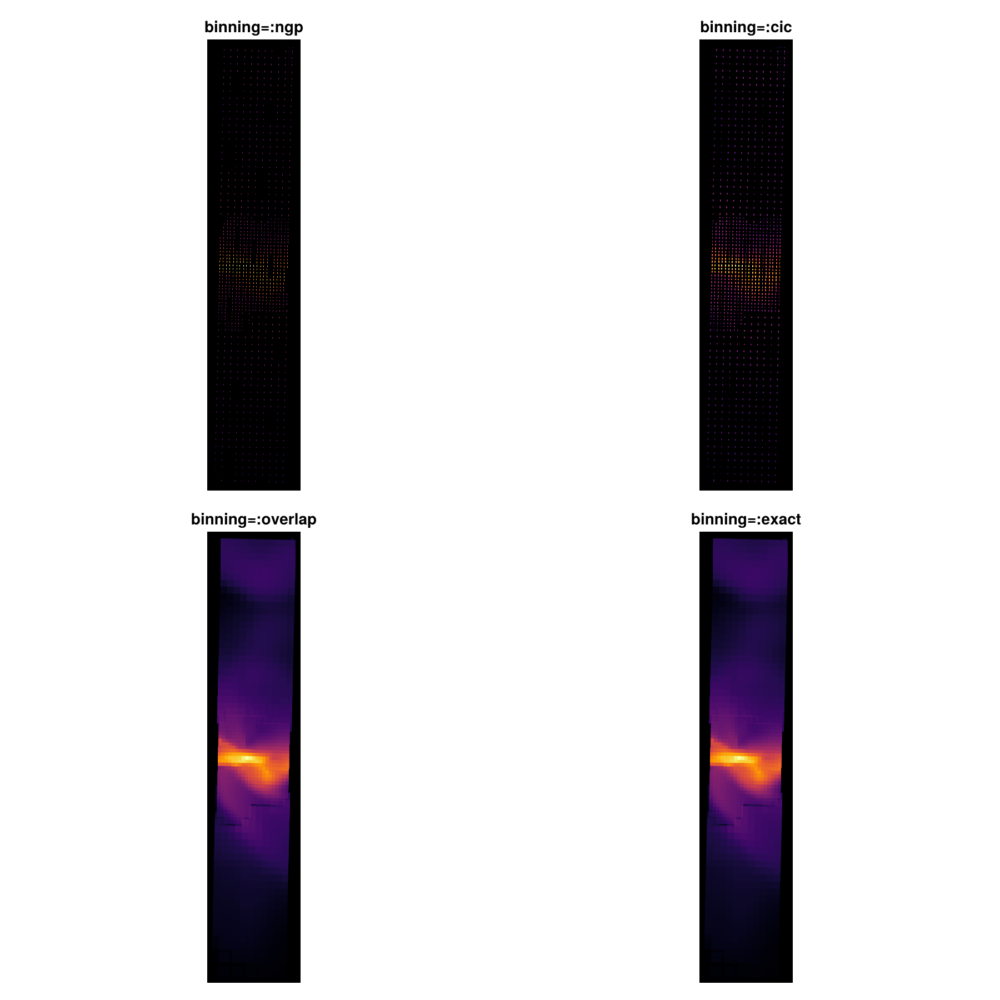
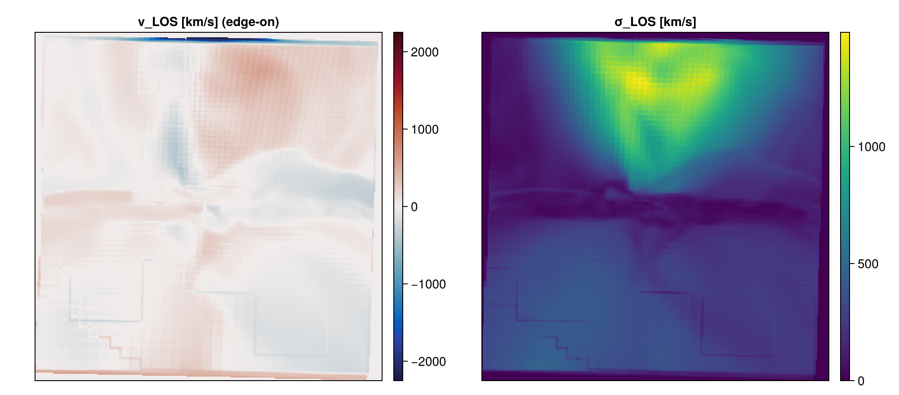
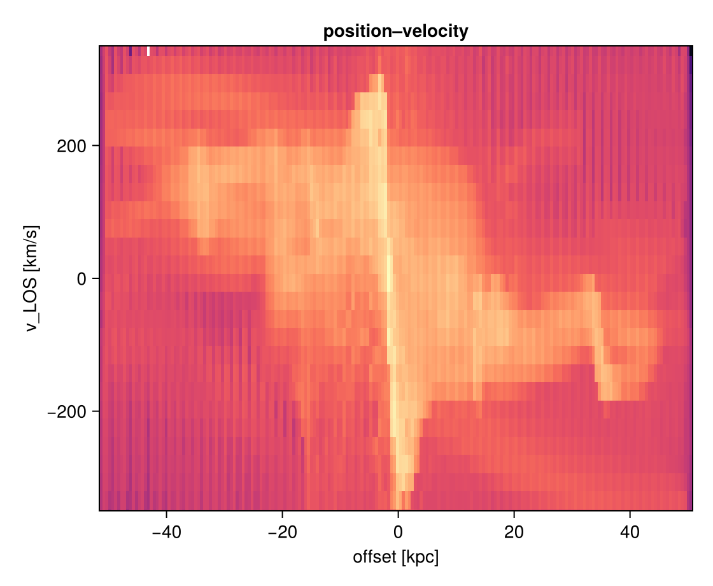
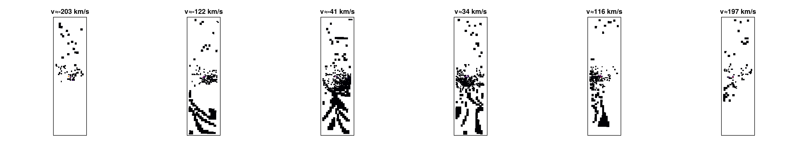
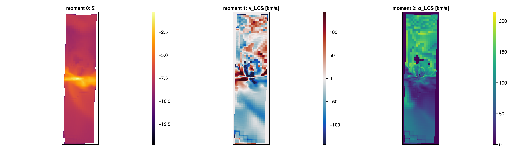
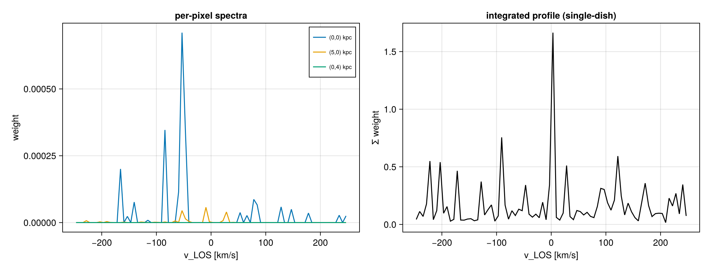
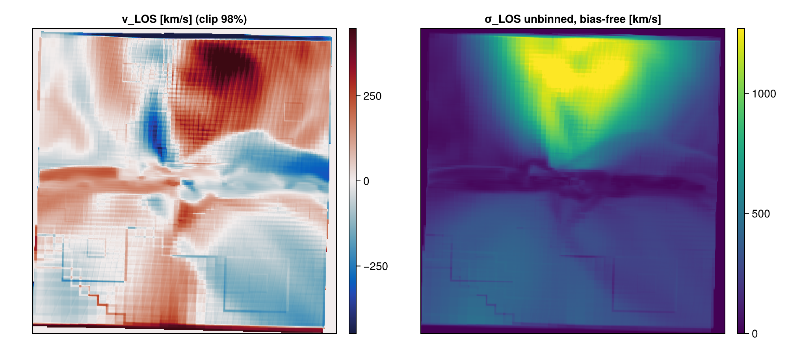
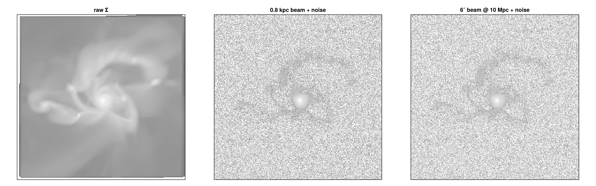

# Line-of-sight cubes, kinematics & mock observations

!!! tip "Run it yourself"
    This page is generated from the runnable notebook
    [`12_multi_LosCubes.ipynb`](https://github.com/ManuelBehrendt/Notebooks/blob/master/Mera-Docs/version_1/12_multi_LosCubes.ipynb)
    — every figure below comes from executing it on a real RAMSES AMR run (`spiral_clumps`).

A [`projection`](@ref) collapses each line of sight (LOS) to **one** weighted number per pixel. A
**LOS cube** keeps the whole sightline: it bins the cells along the LOS into a **position–position–
velocity (PPV)** cube (or position–position–*quantity*), exactly what a spectral-line data cube is.
From it you get velocity fields, dispersion maps, position–velocity diagrams, per-pixel spectra and
mock observations — all at any inclination/position-angle, on AMR data, mass-conserving.

```julia
using Mera, CairoMakie
info = getinfo(100, "/path/to/spiral_clumps")
gas  = gethydro(info)
```

## AMR deposition quality — the `binning` knob

Off-axis/LOS rendering rotates each AMR cell into the camera plane and deposits its footprint. How
that footprint is laid down is the `binning` kwarg, and it matters most where coarse and fine cells
meet. The ladder below is the same zoomed edge-on view at a pixel **finer than the coarse cells**:

```julia
for b in (:ngp, :cic, :overlap, :exact)
    projection(gas, :sd, :Msol_pc2; direction=:edgeon, center=[:bc],
               xrange=[-8,8], yrange=[-8,8], range_unit=:kpc, pxsize=[0.12,:kpc], binning=b)
end
```



- `:ngp` / `:cic` — fast previews; they deposit a coarse cell near its **centre**, leaving a sparse
  speckle with **holes** between cells (the "AMR not overlapping" artefact).
- **`:overlap`** (the default) — per-cell footprint supersampling; coarse cells that exceed the `nmax`
  cap now deposit a footprint-sized **top-hat** so the sub-cells *tile* the camera plane with no gaps,
  hole-free at any view angle, while fine cells keep the sharp ±1px deposit. Mass-conserving.
- `:exact` — analytic per-cell footprint integral; the fidelity reference (slower, no cap).

All four conserve total mass (`Σ pixel == msum`); only the **spatial** coverage differs. Use the
default `:overlap`; reach for `:exact` when you want the analytic reference.

## Velocity field & dispersion — `:vlos` / `:σlos`

The two basic kinematic observables, mass-weighted, at any orientation:

```julia
pv = projection(gas, :vlos, :km_s; direction=:edgeon, center=[:bc], binning=:overlap, range_unit=:kpc, pxsize=[0.3,:kpc])
ps = projection(gas, :σlos, :km_s; direction=:edgeon, center=[:bc], binning=:overlap, range_unit=:kpc, pxsize=[0.3,:kpc])
```



(Tip: a few hot/diffuse cells can carry extreme velocities, so clip the colour scale to a robust
percentile — e.g. `quantile(abs.(v), 0.98)` — rather than the raw extremum.)

## Position–velocity diagram — `position_velocity`

The classic long-slit / rotation-curve diagnostic — a 2-D histogram of (in-plane offset, `v_LOS`):

```julia
pvd = position_velocity(gas; direction=:edgeon, center=[:bc], range_unit=:kpc,
                        offset_unit=:kpc, v_unit=:km_s, nbins=200)
heatmap(pvd.offset, pvd.velocity, log10.(pvd.pv))
```



## The PPV cube & channel maps — `velocity_cube`

The cube is the parent of the PV and moment maps: each velocity channel lights up the gas moving at
that LOS velocity. Set `vrange` to the physical line so the channels span the rotation:

```julia
vc = velocity_cube(gas; direction=:edgeon, center=[:bc], binning=:overlap, vrange=[-250,250],
                   xrange=[-12,12], yrange=[-12,12], range_unit=:kpc, pxsize=[0.3,:kpc], nv=80)
ext = getextent(vc, :kpc)            # physical sky extent of the cube
```



## Moment maps — `velocity_moments`

`velocity_moments(vc)` returns the canonical observational triptych — moment 0 (column), moment 1
(`v_LOS`), moment 2 (`σ_LOS`) — which reproduce the direct `:vlos`/`:σlos` maps:

```julia
Σ, vlos, σlos = velocity_moments(vc)
```



## Spectra — `getspectrum` & `integrated_spectrum`

Pull the line profile of any sightline, or the disc-integrated single-dish profile:

```julia
v, I  = getspectrum(vc; x=5, y=0, range_unit=:kpc)   # one pixel's spectrum
vc_, Ig = integrated_spectrum(vc)                    # global double-horn profile
```



## Any quantity, and a bias-free dispersion

`los_cube` bins **any** field along the LOS (a per-sightline PDF of `T`, `cs`, …), and `los_component`
takes the LOS projection of **any** 3-vector (`(:vx,:vy,:vz)`, `(:ax,:ay,:az)`, `(:bx,:by,:bz)`). Its
`dispersion=true` map is the **unbinned** σ — free of the channel-width (Sheppard) bias a cube carries:

```julia
tc = los_cube(gas; quantity=:T, q_unit=:K, direction=:faceon, center=[:bc], binning=:overlap, pxsize=[0.4,:kpc], nbins=50)
Σt, meanT, dispT = los_moments(tc)
N  = column_integral(gas, :rho; direction=:faceon, center=[:bc], pxsize=[0.4,:kpc], binning=:exact)  # true ∫ρ dl
vmap = los_component(gas, (:vx,:vy,:vz); direction=:edgeon, center=[:bc], unit=:km_s, pxsize=[0.3,:kpc])
σmap = los_component(gas, (:vx,:vy,:vz); dispersion=true, direction=:edgeon, center=[:bc], unit=:km_s, pxsize=[0.3,:kpc])
```



## Mock observation — beam + noise

Turn a map into a realistic image: convolve with a beam (physical, or **angular at a distance**) and
add noise:

```julia
m    = projection(gas, :sd, :Msol_pc2; direction=:faceon, center=[:bc], pxsize=[0.25,:kpc])
obsP = mock_observe(m, :sd; beam_fwhm=0.8, beam_unit=:kpc, noise=maximum(m.maps[:sd])*3e-3, rng=MersenneTwister(1))
obsA = mock_observe(m, :sd; beam_fwhm=6.0, beam_unit=:arcsec, distance=10.0, distance_unit=:Mpc,
                    noise=maximum(m.maps[:sd])*3e-3, rng=MersenneTwister(1))   # 6″ beam for a source at 10 Mpc
```



## Save, reload & export

```julia
savecube(vc, "mycube"); vc2 = loadcube("mycube.jld2")   # full round-trip (provenance preserved)
# using FITSIO; savefits(vc, "mycube.fits")             # WCS + spectral axis → DS9/CASA/CARTA
```

## See also

- [`projection`](@ref), [`position_velocity`](@ref), [`velocity_cube`](@ref), [`los_cube`](@ref),
  [`los_component`](@ref), [`velocity_moments`](@ref), [`getspectrum`](@ref),
  [`integrated_spectrum`](@ref), [`column_integral`](@ref), [`mock_observe`](@ref),
  [`getextent`](@ref) — the LOS-cube API.
- [Off-axis projection](06_offaxis_Projection.md) — the camera/orientation conventions these share.
