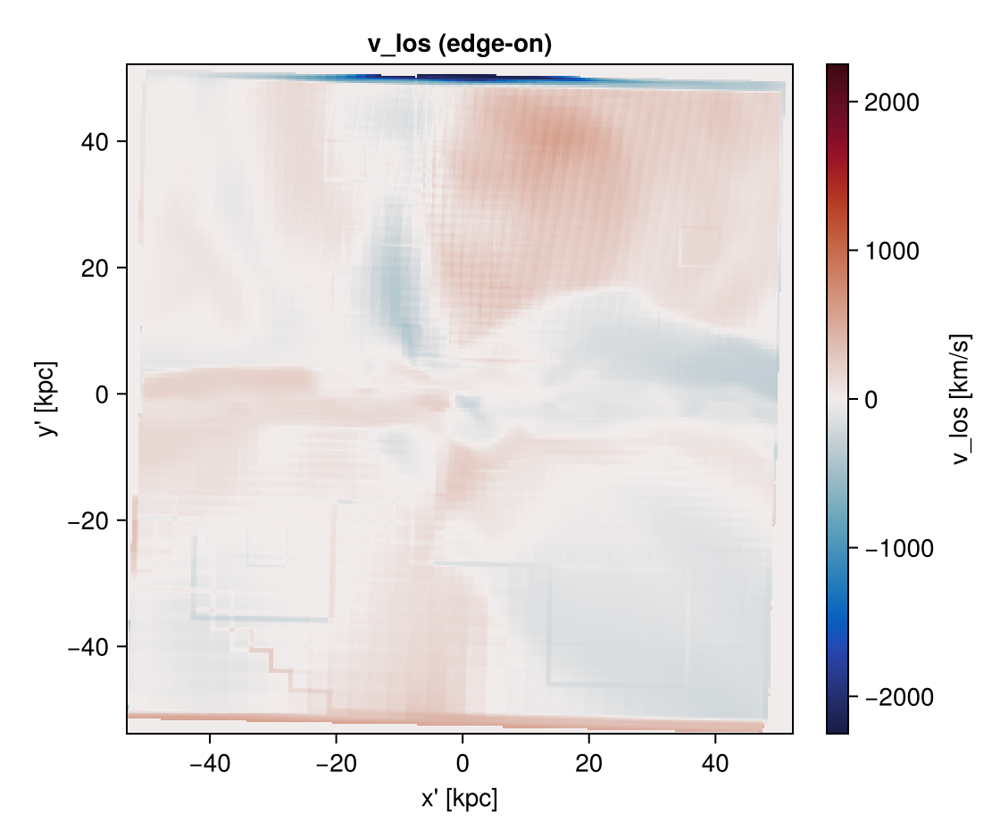
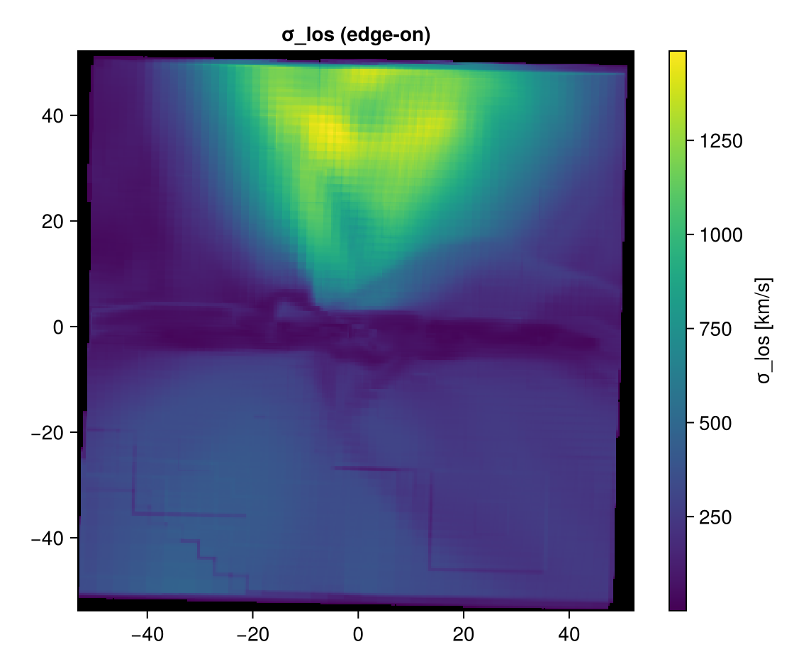
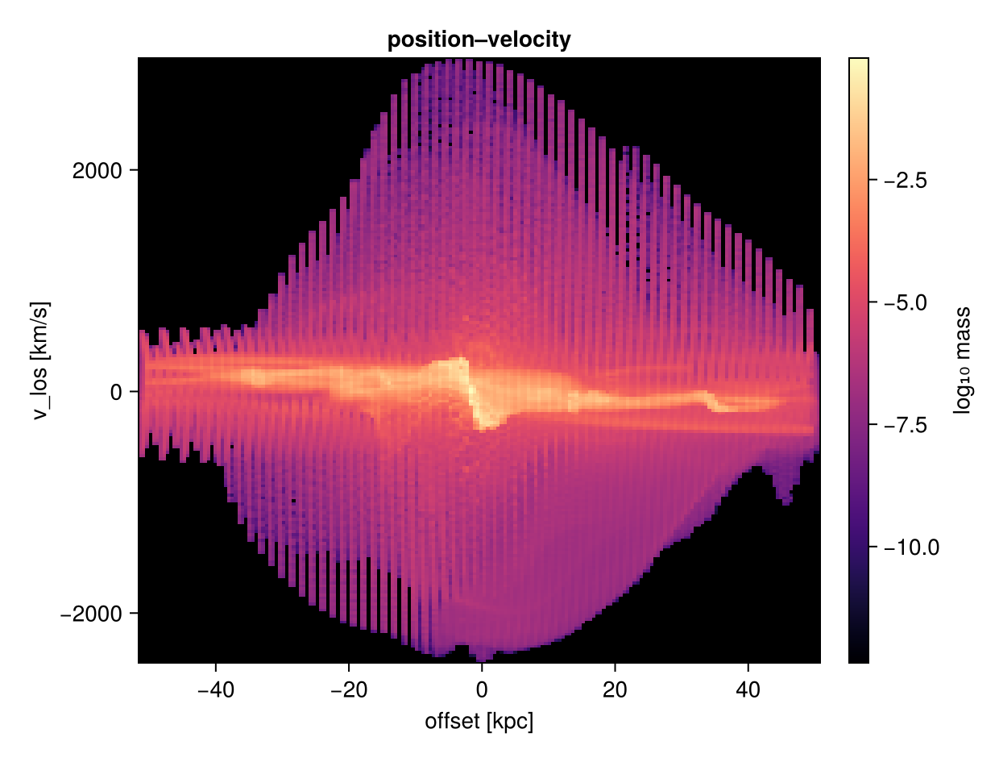
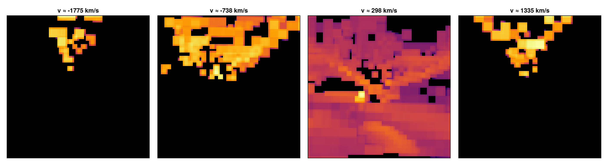
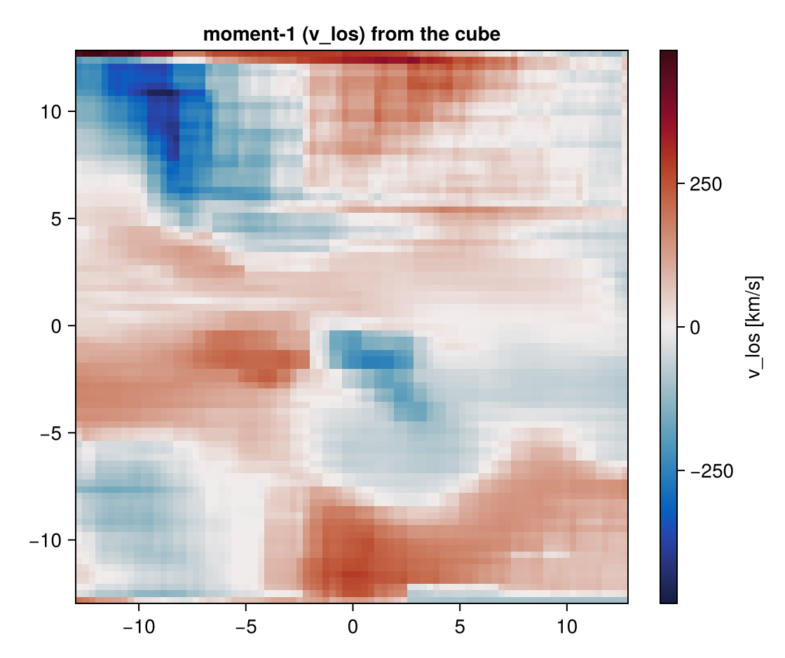
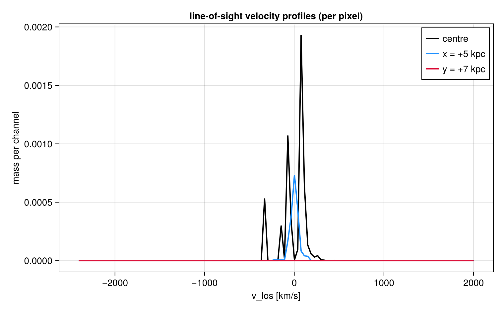
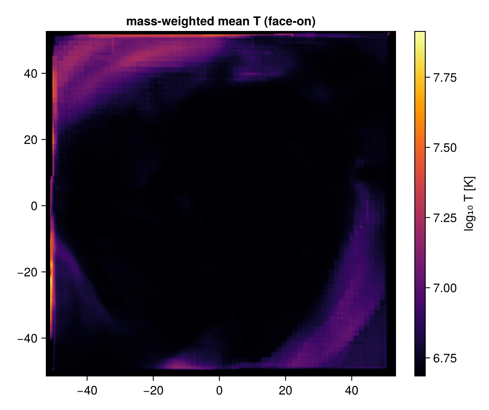
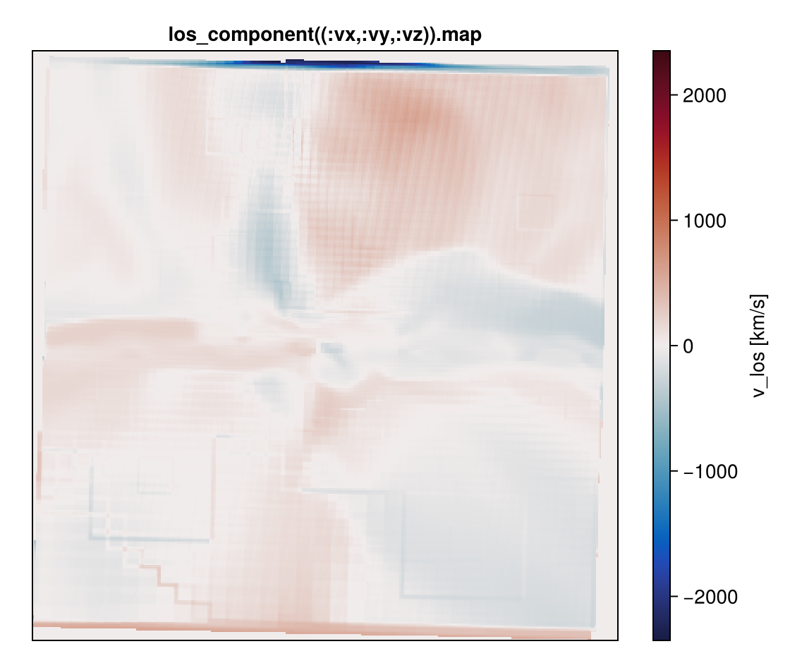
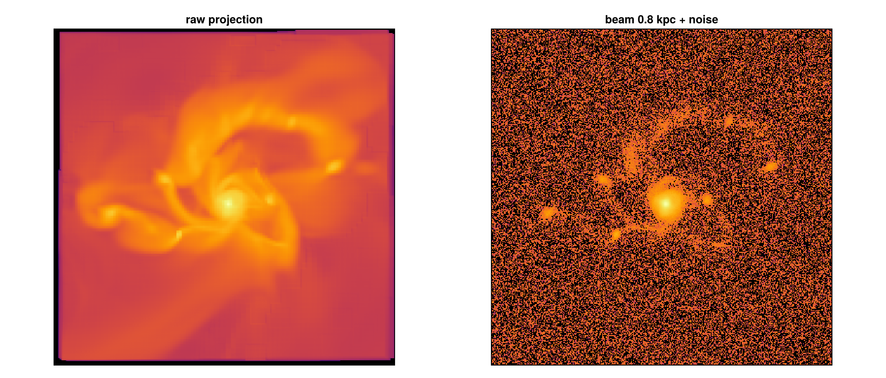

# Line-of-sight cubes, kinematics & mock observations

!!! tip "Run it yourself"
    This tutorial is also an executable **Jupyter notebook** — [open / download `12_multi_LosCubes.ipynb`](https://github.com/ManuelBehrendt/Notebooks/blob/master/Mera-Docs/version_1/12_multi_LosCubes.ipynb). The notebooks run end-to-end and double as part of Mera's test suite.


A projection gives **one** value per pixel (a sum or weighted average down the sightline).
Here we go further: the **distribution** of a quantity along each sightline (a per-pixel
spectrum), line-of-sight velocity fields, position–velocity diagrams, and beam+noise mock
images. Follows the *Kinematics and mock observations* section of the docs.

```julia
using Pkg
Pkg.activate(expanduser("~/Documents/codes/github/Mera.jl"))   # adjust to your Mera.jl
using Mera, CairoMakie
CairoMakie.activate!()
println("threads = ", Threads.nthreads())
```

```
  Activating
threads = 4
project at `~/Documents/codes/github/Mera.jl`
```

```julia
BASE = "/Volumes/FASTStorage/Simulations/Mera-Tests"   # <-- change me
info = getinfo(100, joinpath(BASE, "spiral_clumps"), verbose=false)
gas  = gethydro(info, verbose=false, show_progress=false)
```

```
  0.794820 seconds (3.91 M allocations: 303.291 MiB, 1.40% gc time, 98.84% compilation time)
```

```
HydroDataType(Table with 590311 rows, 10 columns:
Columns:
#   colname  type
────────────────────
1   level    Int64
2   cx       Int64
3   cy       Int64
4   cz       Int64
5   rho      Float64
6   vx       Float64
7   vy       Float64
8   vz       Float64
9   p        Float64
10  metallicity Float64, InfoType(100, "/Volumes/FASTStorage/Simulations/Mera-Tests/spiral_clumps", FileNamesType("/Volumes/FASTStorage/Simulations/Mera-Tests/spiral_clumps/output_00100", "/Volumes/FASTStorage/Simulations/Mera-Tests/spiral_clumps/output_00100/info_00100.txt", "/Volumes/FASTStorage/Simulations/Mera-Tests/spiral_clumps/output_00100/amr_00100.", "/Volumes/FASTStorage/Simulations/Mera-Tests/spiral_clumps/output_00100/hydro_00100.", "/Volumes/FASTStorage/Simulations/Mera-Tests/spiral_clumps/output_00100/hydro_file_descriptor.txt", "/Volumes/FASTStorage/Simulations/Mera-Tests/spiral_clumps/output_00100/grav_00100.", "/Volumes/FASTStorage/Simulations/Mera-Tests/spiral_clumps/output_00100/part_00100.", "/Volumes/FASTStorage/Simulations/Mera-Tests/spiral_clumps/output_00100/part_file_descriptor.txt", "/Volumes/FASTStorage/Simulations/Mera-Tests/spiral_clumps/output_00100/rt_00100.", "/Volumes/FASTStorage/Simulations/Mera-Tests/spiral_clumps/output_00100/rt_file_descriptor.txt", "/Volumes/FASTStorage/Simulations/Mera-Tests/spiral_clumps/output_00100/info_rt_00100.txt", "/Volumes/FASTStorage/Simulations/Mera-Tests/spiral_clumps/output_00100/clump_00100.", "/Volumes/FASTStorage/Simulations/Mera-Tests/spiral_clumps/output_00100/timer_00100.txt", "/Volumes/FASTStorage/Simulations/Mera-Tests/spiral_clumps/output_00100/header_00100.txt", "/Volumes/FASTStorage/Simulations/Mera-Tests/spiral_clumps/output_00100/namelist.txt", "/Volumes/FASTStorage/Simulations/Mera-Tests/spiral_clumps/output_00100/compilation.txt", "/Volumes/FASTStorage/Simulations/Mera-Tests/spiral_clumps/output_00100/makefile.txt", "/Volumes/FASTStorage/Simulations/Mera-Tests/spiral_clumps/output_00100/patches.txt"), "RAMSES", Dates.DateTime("2023-05-12T22:47:36.638"), Dates.DateTime("2025-06-21T18:31:55.533"), 4, 3, 3, 7, 100.0, 9.9335244067439, 1.0, 1.0, 1.0, 0.0, 0.0, 0.045, 3.085677581282e21, 6.77025430198932e-23, 1.9890999999999996e42, 6.559266058737735e6, 4.70430312423675e14, 1.6667, true, 6, 8, 0, [:rho, :vx, :vy, :vz, :p, :metallicity], [:epot, :ax, :ay, :az], [:vx, :vy, :vz, :mass, :family, :tag, :birth, :metals], Symbol[], [:index, :lev, :parent, :ncell, :peak_x, :peak_y, :peak_z, Symbol("rho-"), Symbol("rho+"), :rho_av, :mass_cl, :relevance], Symbol[], DescriptorType(1, [:density, :velocity_x, :velocity_y, :velocity_z, :pressure, :metallicity], ["d", "d", "d", "d", "d", "d"], false, true, 1, [:position_x, :position_y, :position_z, :velocity_x, :velocity_y, :velocity_z, :mass, :identity, :levelp, :family, :tag, :birth_time, :metallicity], ["d", "d", "d", "d", "d", "d", "d", "i", "i", "b", "b", "d", "d"], false, true, [:epot, :ax, :ay, :az], false, false, 0, Dict{Any, Any}(), Dict{Any, Any}(), false, false, [:index, :lev, :parent, :ncell, :peak_x, :peak_y, :peak_z, Symbol("rho-"), Symbol("rho+"), :rho_av, :mass_cl, :relevance], false, false, Symbol[], false, false), true, true, true, false, true, false, true, Dict{Any, Any}("&COOLING_PARAMS" => Dict{Any, Any}("cooling" => ".true. ", "metal" => ".true. ", "z_ave" => "1."), "&SF_PARAMS" => Dict{Any, Any}("m_star " => " 1. ! in units mass_sph", "n_star " => " 1 ", "T2_star" => " 1e4 ", "eps_star " => " 0.02 !2%"), "&AMR_PARAMS" => Dict{Any, Any}("levelmax" => "7", "npartmax" => " 500000", "ngridmax" => " 100000 ", "boxlen" => "100. !kpc\t", "levelmin" => "3 ", "nexpand" => "1                      "), "&BOUNDARY_PARAMS" => Dict{Any, Any}("jbound_min" => " 0, 0,-1,+1,-1,-1", "kbound_max" => " 0, 0, 0, 0,-1,+1", "no_inflow" => ".true.", "bound_type" => " 2, 2, 2, 2, 2, 2    !2", "nboundary " => " 6", "ibound_max" => "-1,+1,+1,+1,+1,+1", "ibound_min" => "-1,+1,-1,-1,-1,-1", "jbound_max" => " 0, 0,-1,+1,+1,+1", "kbound_min" => " 0, 0, 0, 0,-1,+1"), "&OUTPUT_PARAMS" => Dict{Any, Any}("tend" => "10                 !Final time of the simulation", "delta_tout" => "0.1          !Time increment between outputs"), "&POISSON_PARAMS" => Dict{Any, Any}("gravity_type" => "-3       "), "&UNITS_PARAMS" => Dict{Any, Any}("units_density " => " 0.677025430198932E-22 ! 1e9 Msol/kpc^3", "units_time    " => " 0.470430312423675E+15 ! G", "units_length  " => " 0.308567758128200E+22 ! kpc"), "&RUN_PARAMS" => Dict{Any, Any}("pic" => ".true.", "nsubcycle" => "20*2 ", "clumpfind" => "true", "ncontrol" => "1                      !frequency of screen output", "poisson" => ".true.", "verbose" => ".false.", "nremap" => "5 !10", "nrestart" => "99", "hydro" => ".true."), "&CLUMPFIND_PARAMS" => Dict{Any, Any}("ivar_clump" => "1", "density_threshold" => "0.01"), "&FEEDBACK_PARAMS" => Dict{Any, Any}("t_sne" => "10. !10. !Myr", "eta_sn " => "0.2", "!delayed_cooling" => ".true.", "!t_diss " => " 1.\t!Myr", "f_ek" => "0.")…), true, true, Mera.FilesContentType(["#############################################################################", "# If you have problems with this makefile, contact Romain.Teyssier@gmail.com", "#############################################################################", "# Compilation time parameters", "NVECTOR = 64 #32", "NDIM = 3", "NPRE = 8", "NVAR = 6", "NENER = 0", "SOLVER = hydro"  …  "\t\$(F90) \$(FFLAGS) -c write_patch.f90 -o \$@", "%.o:%.F", "\t\$(F90) \$(FFLAGS) -c \$^ -o \$@ \$(LIBS_OBJ)", "%.o:%.f90", "\t\$(F90) \$(FFLAGS) -c \$^ -o \$@ \$(LIBS_OBJ)", "FORCE:", "#############################################################################", "clean:", "\trm -f *.o *.\$(MOD) *.i", "#############################################################################"], [" --------------------------------------------------------------------", "", "     minimum       average       maximum  standard dev        std/av       %   rmn   rmx  TIMER", "       0.388         0.392         0.397         0.004         0.009     0.7     4   1    refine                  ", "       0.507         2.917         5.424         1.783         0.611     5.5     1   3    particles               ", "       1.347         1.701         2.269         0.344         0.202     3.2     4   1    feedback                ", "      16.465        17.380        18.250         0.646         0.037    32.7     3   1    poisson                 ", "       3.399         4.081         4.713         0.478         0.117     7.7     3   1    rho                     ", "       0.529         0.541         0.550         0.008         0.014     1.0     1   3    courant                 ", "       0.079         0.091         0.098         0.007         0.081     0.2     3   2    hydro - set unew        ", "      15.304        18.454        22.169         2.656         0.144    34.8     3   4    hydro - godunov         ", "       1.796         5.559         8.199         2.596         0.467    10.5     4   3    hydro - rev ghostzones  ", "       0.109         0.132         0.142         0.013         0.100     0.2     3   2    hydro - set uold        ", "       0.057         0.088         0.122         0.023         0.262     0.2     1   4    hydro upload fine       ", "       1.073         1.312         1.474         0.161         0.122     2.5     3   4    cooling                 ", "       0.112         0.122         0.135         0.009         0.078     0.2     4   3    hydro - ghostzones      ", "       0.298         0.301         0.306         0.003         0.011     0.6     4   1    flag                    ", "      53.074     100.0    TOTAL"], ["/data2/mabe/MeraTest/Ramses/patch_2019_10version/add_list.f90", "!################################################################", "!################################################################", "!################################################################", "!################################################################", "subroutine add_list(ind_part,list2,ok,np)", "  use amr_commons", "  use pm_commons", "  implicit none", "  integer::np"  …  "     end do", "", "  end do", "  ! End loop over grid cells", "end subroutine tsc_cell", "#endif", "!###########################################################", "!###########################################################", "!###########################################################", "!###########################################################"]), true, true, true, 0, ScalesType002(0.0010000000000006482, 1.0000000000006481, 1000.0000000006482, 1.0000000000006482e6, 3261.5637769461323, 2.0626480623310105e23, 3.0856775812820004e16, 3.085677581282e19, 3.085677581282e21, 3.085677581282e22, 3.085677581282e25, 1.0000000000019446e-9, 1.0000000000019444, 1.0000000000019448e9, 1.0000000000019446e18, 3.469585750743794e10, 8.775571306099254e69, 2.9379989454983075e49, 2.9379989454983063e58, 2.9379989454983065e64, 2.937998945498306e67, 2.937998945498306e76, 0.9999999999980551, 0.9999999999980551, 6.77025430198932e-23, 999.9999999987034, 999.9999999987034, 0.20890821919226463, 0.014907037050462488, 14.907037050462488, 1.4907037050462488e7, 4.70430312423675e14, 4.70430312423675e17, 9.999999999999998e8, 9.999999999999998e8, 3.330598439436053e14, 1.0479261167570186e12, 1.9890999999999996e42, 65.59266058737735, 65592.66058737735, 6.559266058737735e6, 30.996344997059538, 8.557898117221824e55, 2.9128322630389308e-9, 517291.4494607442, 517291.4494607442, 680646.644027295, 680646.644027295, 2.9128322630389304e-9, 2.9128322630389304e-9, 2.109755819936081e7, 2.109755819936081e7, 3.1162135509683387e29, 1.2537844818309073e65, 6.198460374231122e71, 6.198460374231122e64, 2.109755819936081e7, 2.1097558199360812e8, 1.380649e-16, 4.0258946849746426e70, 4.0258946849746426e70, 4.0258946849746425e71, 0.00019132101231911184, 191.32101231911184, 191.32101231911184, 1.9132101231911187e-8, 5.341419875695069e67, 5.341419875695069e64, 5.341419875695069e61, 1.819163836006061e41, 4.752256624885217e7, 4.752256624885217e7, 3.4036771916893676e-65, 1.158501842524895e-120, 30.996344997059538, 0.09145663043618026, 6.1918464565599674e-24, 6.1918464565599674e-24, 0.6191846456559967, 619.1846456559967, 619184.6456559967, 1.2584832481461724e23, 1.2584832481461724e23, 1.3943119491905496e-8, 1.3943119491905495e-10, 1.3943119491905496e-13, 3.0984365782372897e-9, 4.302397122930886e13, 4.302397122930886e6, 4302.397122930886, 2.9128322630389304e-9, 8.557898117221824e55, 9.439846472322433e-31, 4.5186572882681335e-30, 3.085677581282e21, 1.9890999999999996e42, 4.70430312423675e14, 1.0, 2.8868464775e-314, 2.8868464933e-314, 2.886846509e-314, 2.8868465645e-314, 2.3498711513e-314, 2.3886328937e-314, 2.3886328937e-314, 2.423425874e-314, 2.423425874e-314, 2.423425874e-314, 2.423425874e-314, 2.423425874e-314, 2.423425874e-314, 4.302397122930886e13, 2.3886328937e-314, 3.085677581282e21, 1.9890999999999996e42, 1.9890999999999996e42, 4.70430312423675e14, 8.557898117221824e55, 8.557898117221824e55, 1.0, 2.3886328937e-314, 2.423425874e-314, 1.3943119491905496e-8, 1.3943119491905496e-8, 1.3943119491905496e-8, 1.3943119491905496e-8, 1.3943119491905496e-8, 3.085677581282e21, 3.085677581282e21, 1.0, 1.0, 1.0, 57.29577951308232), GridInfoType(100000, 272, 3, 3, 3, 7, 6, 25604, [0.0, 1.152424e6, 3.83576e6, 9.850944e6, 1.6777216e7], Bool[0, 0, 0, 0]), PartInfoType(0.0, 0.6708241192497574, 0.0, 0, 39970, 413895, 0, 0, 0, 0, 0, 0, 0, 0, 0, 0, 0), CompilationInfoType("", "", "", "", ""), PhysicalUnitsType002(0.01495978707, 3.08567758128e24, 3.08567758128e21, 3.08567758128e18, 3.08567758128e15, 9.4607304725808e17, 1.9891e33, 1.9891e33, 5.9722e27, 1.89813e30, 6.96e10, 6.96e10, 9.1093837015e-28, 1.67262192369e-24, 1.67492749804e-24, 1.66e-24, 1.6605390666e-24, 6.02214076e23, 2.99792458e10, 6.6743e-8, 1.380649e-16, 1.380649e-16, 6.62607015e-27, 1.0545718176461565e-27, 5.670374419e-5, 6.6524587321e-25, 0.0072973525693, 8.314462618e7, 1.602176634e-12, 1.602176634e-9, 1.602176634e-6, 0.001602176634, 3.828e33, 3.828e33, 1.6605390666e-24, 86400.0, 3600.0, 60.0, 3.15576e16, 3.15576e13, 3.15576e7)), 3, 7, 100.0, [0.0, 1.0, 0.0, 1.0, 0.0, 1.0], [1, 2, 3, 4, 5, 6], Dict{Any, Any}(), 0.0, 0.0, ScalesType002(0.0010000000000006482, 1.0000000000006481, 1000.0000000006482, 1.0000000000006482e6, 3261.5637769461323, 2.0626480623310105e23, 3.0856775812820004e16, 3.085677581282e19, 3.085677581282e21, 3.085677581282e22, 3.085677581282e25, 1.0000000000019446e-9, 1.0000000000019444, 1.0000000000019448e9, 1.0000000000019446e18, 3.469585750743794e10, 8.775571306099254e69, 2.9379989454983075e49, 2.9379989454983063e58, 2.9379989454983065e64, 2.937998945498306e67, 2.937998945498306e76, 0.9999999999980551, 0.9999999999980551, 6.77025430198932e-23, 999.9999999987034, 999.9999999987034, 0.20890821919226463, 0.014907037050462488, 14.907037050462488, 1.4907037050462488e7, 4.70430312423675e14, 4.70430312423675e17, 9.999999999999998e8, 9.999999999999998e8, 3.330598439436053e14, 1.0479261167570186e12, 1.9890999999999996e42, 65.59266058737735, 65592.66058737735, 6.559266058737735e6, 30.996344997059538, 8.557898117221824e55, 2.9128322630389308e-9, 517291.4494607442, 517291.4494607442, 680646.644027295, 680646.644027295, 2.9128322630389304e-9, 2.9128322630389304e-9, 2.109755819936081e7, 2.109755819936081e7, 3.1162135509683387e29, 1.2537844818309073e65, 6.198460374231122e71, 6.198460374231122e64, 2.109755819936081e7, 2.1097558199360812e8, 1.380649e-16, 4.0258946849746426e70, 4.0258946849746426e70, 4.0258946849746425e71, 0.00019132101231911184, 191.32101231911184, 191.32101231911184, 1.9132101231911187e-8, 5.341419875695069e67, 5.341419875695069e64, 5.341419875695069e61, 1.819163836006061e41, 4.752256624885217e7, 4.752256624885217e7, 3.4036771916893676e-65, 1.158501842524895e-120, 30.996344997059538, 0.09145663043618026, 6.1918464565599674e-24, 6.1918464565599674e-24, 0.6191846456559967, 619.1846456559967, 619184.6456559967, 1.2584832481461724e23, 1.2584832481461724e23, 1.3943119491905496e-8, 1.3943119491905495e-10, 1.3943119491905496e-13, 3.0984365782372897e-9, 4.302397122930886e13, 4.302397122930886e6, 4302.397122930886, 2.9128322630389304e-9, 8.557898117221824e55, 9.439846472322433e-31, 4.5186572882681335e-30, 3.085677581282e21, 1.9890999999999996e42, 4.70430312423675e14, 1.0, 2.8868464775e-314, 2.8868464933e-314, 2.886846509e-314, 2.8868465645e-314, 2.3498711513e-314, 2.3886328937e-314, 2.3886328937e-314, 2.423425874e-314, 2.423425874e-314, 2.423425874e-314, 2.423425874e-314, 2.423425874e-314, 2.423425874e-314, 4.302397122930886e13, 2.3886328937e-314, 3.085677581282e21, 1.9890999999999996e42, 1.9890999999999996e42, 4.70430312423675e14, 8.557898117221824e55, 8.557898117221824e55, 1.0, 2.3886328937e-314, 2.423425874e-314, 1.3943119491905496e-8, 1.3943119491905496e-8, 1.3943119491905496e-8, 1.3943119491905496e-8, 1.3943119491905496e-8, 3.085677581282e21, 3.085677581282e21, 1.0, 1.0, 1.0, 57.29577951308232))
```

## 1. Line-of-sight velocity & dispersion

`:vlos = v·ŵ` (mass-weighted) and `:σlos` work at **any** angle (the axis-tied `:σx` do not).
Edge-on, `:vlos` shows the rotation (approaching/receding sides).

```julia
pv = projection(gas, :vlos, :km_s, direction=:edgeon, center=[:bc], binning=:overlap, range_unit=:kpc, pxsize=[0.3, :kpc])
e  = pv.extent .* gas.scale.kpc; vmax = maximum(abs.(extrema(pv.maps[:vlos])))
fig = Figure(size=(560,470))
ax = Axis(fig[1,1], aspect=DataAspect(), title="v_los (edge-on)", xlabel="x' [kpc]", ylabel="y' [kpc]")
hm = heatmap!(ax, range(e[1],e[2],length=size(pv.maps[:vlos],1)), range(e[3],e[4],length=size(pv.maps[:vlos],2)), pv.maps[:vlos], colormap=:balance, colorrange=(-vmax,vmax))
Colorbar(fig[1,2], hm, label="v_los [km/s]"); fig
```

```
[Mera]: 2026-06-06T10:07:13.593
center: [0.5, 0.5, 0.5] ==> [50.0 [kpc] :: 50.0 [kpc] :: 50.0 [kpc]]
domain:
xmin::xmax: 0.0 :: 1.0  	==> 0.0 [kpc] :: 100.0 [kpc]
ymin::ymax: 0.0 :: 1.0  	==> 0.0 [kpc] :: 100.0 [kpc]
zmin::zmax: 0.0 :: 1.0  	==> 0.0 [kpc] :: 100.0 [kpc]
Selected var(s)=(:vlos, :sd)
Weighting      = :mass
Off-axis LOS   =
[0.9999, 0.0003, -0.0143]  (binning=:overlap)
Effective resolution: 334^2  →  map size: 351 x 353
```



```julia
ps = projection(gas, :σlos, :km_s, direction=:edgeon, center=[:bc], binning=:overlap, range_unit=:kpc, pxsize=[0.3, :kpc])
e = ps.extent .* gas.scale.kpc; A = replace(ps.maps[:σlos], 0.0=>NaN)
fig = Figure(size=(560,470)); ax = Axis(fig[1,1], aspect=DataAspect(), title="σ_los (edge-on)")
hm = heatmap!(ax, range(e[1],e[2],length=size(A,1)), range(e[3],e[4],length=size(A,2)), A, colormap=:viridis, nan_color=:black)
Colorbar(fig[1,2], hm, label="σ_los [km/s]"); fig
```

```
[Mera]: 2026-06-06T10:07:29.084
center: [0.5, 0.5, 0.5] ==> [50.0 [kpc] :: 50.0 [kpc] :: 50.0 [kpc]]
domain:
xmin::xmax: 0.0 :: 1.0  	==> 0.0 [kpc] :: 100.0 [kpc]
ymin::ymax: 0.0 :: 1.0  	==> 0.0 [kpc] :: 100.0 [kpc]
zmin::zmax: 0.0 :: 1.0  	==> 0.0 [kpc] :: 100.0 [kpc]
Selected var(s)=(:σlos, :sd)
Weighting      = :mass
Off-axis LOS   = [0.9999, 0.0003, -0.0143]  (binning=:overlap)
Effective resolution: 334^2  →  map size: 351 x 353
```



## 2. Position–velocity (PV) diagram
`position_velocity` bins into (in-plane offset, v_los) — the classic rotation-curve diagnostic.

```julia
pvd = position_velocity(gas; direction=:edgeon, center=[:bc], range_unit=:kpc, offset_unit=:kpc, nbins=200, verbose=false)
oc = (pvd.offset[1:end-1].+pvd.offset[2:end])./2; vc = (pvd.velocity[1:end-1].+pvd.velocity[2:end])./2
P = log10.(replace(pvd.pv, 0.0=>NaN))
fig = Figure(size=(620,470)); ax = Axis(fig[1,1], title="position–velocity", xlabel="offset [kpc]", ylabel="v_los [km/s]")
hm = heatmap!(ax, oc, vc, P, colormap=:magma, nan_color=:black); Colorbar(fig[1,2], hm, label="log₁₀ mass"); fig
```



## 3. Velocity-channel cube — the per-pixel spectrum

`velocity_cube` returns a `LosCubeType` — a **position–position–velocity (PPV)** cube. `cube[i,j,k]`
is the deposited weight (mass by default) in sky pixel `(i,j)` and line-of-sight bin `k`, so
`cube[i,j,:]` is the velocity profile of pixel `(i,j)` (a mock HI/CO/Hα data-cube). The axes `x`,
`y` and `bins` are **edges** (length = the corresponding cube dimension + 1; `x`/`y` in code length
units), and the velocity edges are in `v_unit`. Different channels light up different parts of an
edge-on disk — rotation resolved in velocity.

```julia
vcu = velocity_cube(gas; direction=:edgeon, center=[:bc], binning=:overlap, xrange=[-12,12], yrange=[-12,12], range_unit=:kpc, pxsize=[0.3, :kpc], nv=120, verbose=false)
vcent = (vcu.velocity[1:end-1].+vcu.velocity[2:end])./2; nx,ny,nv = size(vcu.cube)
sel = round.(Int, range(0.15,0.85,length=4).*nv)
fig = Figure(size=(1400,380))
for (k,ch) in enumerate(sel)
    A = log10.(replace(vcu.cube[:,:,ch], 0.0=>NaN))
    ax = Axis(fig[1,k], aspect=DataAspect(), title="v ≈ $(round(Int,vcent[ch])) km/s"); hidedecorations!(ax)
    heatmap!(ax, A, colormap=:inferno, nan_color=:black)
end
fig
```



Its **moments** reproduce the Σ, v_los and σ_los maps (computed from the bin **centres**):

> **Discretization (Sheppard) caveat.** Because the moments use bin centres, the dispersion is
> biased high by ≈ Δ²/12 (Δ = channel width) — negligible once a line spans several channels, but
> use more `nv` / a tighter `vrange` for under-resolved lines. For an unbinned, bias-free per-pixel
> dispersion use `los_component(gas, (:vx,:vy,:vz); dispersion=true)`.

```julia
Σ, vlos, σlos = velocity_moments(vcu)
println("cube sums to ", round(sum(vcu.cube), sigdigits=5), "  (M⊙ code) ; columns ≥ 0: ", all(Σ .>= 0))
e = (vcu.x[1], vcu.x[end], vcu.y[1], vcu.y[end]) .* gas.scale.kpc
fig = Figure(size=(560,470)); ax = Axis(fig[1,1], aspect=DataAspect(), title="moment-1 (v_los) from the cube")
vmax = maximum(abs.(extrema(vlos)))
hm = heatmap!(ax, range(e[1],e[2],length=nx), range(e[3],e[4],length=ny), vlos, colormap=:balance, colorrange=(-vmax,vmax))
Colorbar(fig[1,2], hm, label="v_los [km/s]"); fig
```

```
cube sums to 17.719
  (M⊙ code) ; columns ≥ 0: true
```



## 4. The per-pixel spectrum — `getspectrum`

A cube *is* a spectrum per pixel. `getspectrum` pulls one out — by sky position (offset from the centre, in `range_unit`) or by pixel index — ready to plot as a line. Summing a spectrum over its channels gives that pixel's column (its moment-0 value). This is the synthetic emission-line profile along each sightline.

```julia
ij = argmax(Σ)                                  # the brightest pixel
fig = Figure(size=(760,470)); ax = Axis(fig[1,1], xlabel="v_los [km/s]", ylabel="mass per channel",
                                        title="line-of-sight velocity profiles (per pixel)")
for (off,lab,col) in ((( 0.0, 0.0),"centre",:black), (( 5.0,0.0),"x = +5 kpc",:dodgerblue), ((0.0, 7.0),"y = +7 kpc",:crimson))
    v, I = getspectrum(vcu; x=off[1], y=off[2], range_unit=:kpc)
    lines!(ax, v, I, label=lab, color=col, linewidth=2)
end
axislegend(ax, position=:rt); fig
```



## 5. The same cube for ANY quantity — `los_cube`

`velocity_cube` is `los_cube(...; quantity=:vlos)`. Bin by any scalar field (a per-pixel PDF),
or a vector's LOS component. Here: the **temperature distribution** along each sightline.

```julia
tc = los_cube(gas; quantity=:T, q_unit=:K, direction=:faceon, center=[:bc], binning=:overlap, range_unit=:kpc, pxsize=[0.3, :kpc], nbins=60, verbose=false)
Σ, meanT, dispT = los_moments(tc)
e = (tc.x[1], tc.x[end], tc.y[1], tc.y[end]) .* gas.scale.kpc; nx,ny,_ = size(tc.cube)
fig = Figure(size=(560,470)); ax = Axis(fig[1,1], aspect=DataAspect(), title="mass-weighted mean T (face-on)")
A = log10.(replace(meanT, 0.0=>NaN))
hm = heatmap!(ax, range(e[1],e[2],length=nx), range(e[3],e[4],length=ny), A, colormap=:inferno, nan_color=:black)
Colorbar(fig[1,2], hm, label="log₁₀ T [K]"); fig
```



**LOS component of an arbitrary vector** as a 2D map — `los_component`. e.g. velocity, or the
gravitational acceleration `(:ax,:ay,:az)`:

```julia
vmap = los_component(gas, (:vx,:vy,:vz); direction=:edgeon, center=[:bc], binning=:overlap, range_unit=:kpc, unit=:km_s, pxsize=[0.3, :kpc], verbose=false)
println("v_los map range = [", round(minimum(vmap.map),digits=1), ", ", round(maximum(vmap.map),digits=1), "] km/s")
fig = Figure(size=(560,470)); ax = Axis(fig[1,1], aspect=DataAspect(), title="los_component((:vx,:vy,:vz)).map")
vmax = maximum(abs.(extrema(vmap.map)))
hm = heatmap!(ax, vmap.map, colormap=:balance, colorrange=(-vmax,vmax)); Colorbar(fig[1,2], hm, label="v_los [km/s]"); hidedecorations!(ax); fig
```

```
v_los map range = [-2351.6
, 630.9] km/s
```



## 6. Mock observation — beam + noise
`mock_observe` convolves a map with a Gaussian beam (PSF) and adds noise.

```julia
m = projection(gas, :sd, :Msol_pc2, direction=:faceon, center=[:bc], range_unit=:kpc, pxsize=[0.3, :kpc])
raw = m.maps[:sd]
obs = mock_observe(m, :sd; beam_fwhm=0.8, beam_unit=:kpc, noise=maximum(raw)*3e-3)
e = m.extent .* gas.scale.kpc; fig = Figure(size=(1100,470))
for (k,(A,t)) in enumerate(((raw,"raw projection"),(obs,"beam 0.8 kpc + noise")))
    ax = Axis(fig[1,k], aspect=DataAspect(), title=t); hidedecorations!(ax)
    B = Float64.(A); B[B .<= 0] .= NaN   # noise can make pixels ≤ 0; mask before log
    heatmap!(ax, range(e[1],e[2],length=size(A,1)), range(e[3],e[4],length=size(A,2)), log10.(B), colormap=:inferno, nan_color=:black)
end
fig
```

```
[Mera]: 2026-06-06T10:07:36.963
center: [0.5, 0.5, 0.5] ==> [50.0 [kpc] :: 50.0 [kpc] :: 50.0 [kpc]]
domain:
xmin::xmax: 0.0 :: 1.0  	==> 0.0 [kpc] :: 100.0 [kpc]
ymin::ymax: 0.0 :: 1.0  	==> 0.0 [kpc] :: 100.0 [kpc]
zmin::zmax: 0.0 :: 1.0  	==> 0.0 [kpc] :: 100.0 [kpc]
Selected var(s)=(:sd,)
Weighting      = :mass
Off-axis LOS   = [-0.0144, 0.0222, -0.9997]  (binning=:overlap)
Effective resolution: 334^2  →  map size: 351 x 347
```



## 7. Save & reload a cube (JLD2)
Cubes are a `LosCubeType` and can be stored and reloaded with all metadata.

```julia
tmp = tempname()*".jld2"
savecube(tc, tmp)
tc2 = loadcube(tmp)
println("round-trip identical: ", tc2.cube == tc.cube && tc2.bins == tc.bins && tc2.quantity == tc.quantity)
rm(tmp, force=true)
```

```
Saved LOS cube (351, 346, 60) → /tmp/jl_tmpcube.jld2
Loaded LOS cube (351, 346, 60) ←
/tmp/jl_tmpcube.jld2
round-trip identical: true
```

## Play around
- `quantity=:rho`, `:cs`, `:machnumber`, … for other per-sightline PDFs;
- `quantity=(:ax,:ay,:az)` with `gravity` (combined interface) for LOS acceleration;
- change `nv`/`nbins`, `vrange`/`qrange`, the beam size and noise;
- build moment maps with `los_moments(cube)` / `velocity_moments(cube)`.
