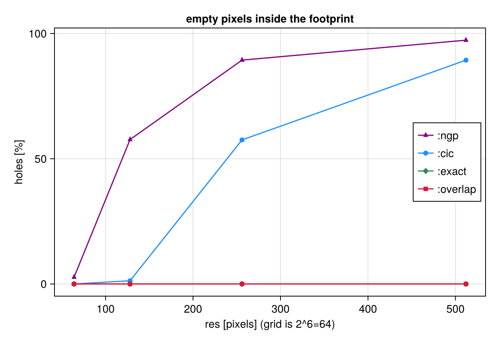
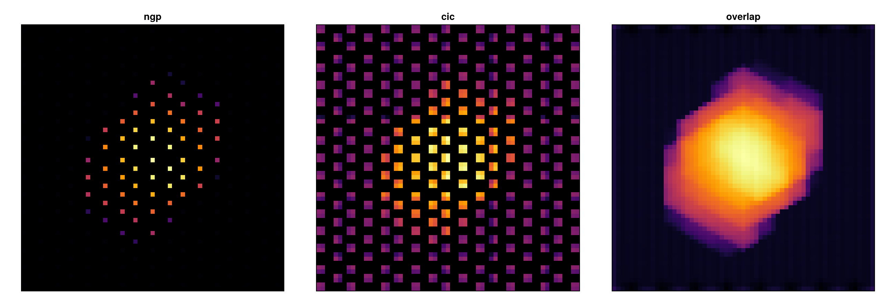
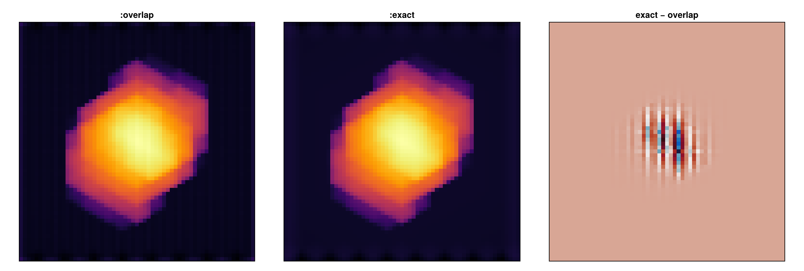

# Off-axis projection: validation & error analysis

!!! tip "Run it yourself"
    This tutorial is also an executable **Jupyter notebook** — [open / download `13_multi_OffAxis_Validation.ipynb`](https://github.com/ManuelBehrendt/Notebooks/blob/master/Mera-Docs/version_1/13_multi_OffAxis_Validation.ipynb). The notebooks run end-to-end and double as part of Mera's test suite.


Two questions every projection must answer: **does it conserve** (nothing lost), and **is it
accurate** (mass in the right place)? This notebook reproduces both, plus the parallel speed-up.
Follows the *Conservation proof* and *binning fidelity* docs.


```julia
using Pkg
Pkg.activate(expanduser("~/Documents/codes/github/Mera.jl"))   # adjust to your Mera.jl
using Mera, CairoMakie
CairoMakie.activate!()
println("threads = ", Threads.nthreads())
```

      Activating 

    threads = 4

    project at `~/Documents/codes/github/Mera.jl`


    


```julia
BASE = "/Volumes/FASTStorage/Simulations/Mera-Tests"   # <-- change me
info = getinfo(100, joinpath(BASE, "spiral_clumps"), verbose=false)
gas  = gethydro(info, verbose=false, show_progress=false)
part = getparticles(getinfo(1, joinpath(BASE,"spiral_ugrid"), verbose=false), verbose=false, show_progress=false)
```

      0.746716 seconds (3.91 M allocations: 303.307 MiB, 1.41% gc time, 99.59% compilation time)


    PartDataType(Table with 45470 rows, 12 columns:
    Columns:
    #   colname  type
    ────────────────────
    1   x        Float64
    2   y        Float64
    3   z        Float64
    4   id       Int32
    5   family   Int8
    6   tag      Int8
    7   vx       Float64
    8   vy       Float64
    9   vz       Float64
    10  mass     Float64
    11  birth    Float64
    12  metals   Float64, InfoType(1, "/Volumes/FASTStorage/Simulations/Mera-Tests/spiral_ugrid", FileNamesType("/Volumes/FASTStorage/Simulations/Mera-Tests/spiral_ugrid/output_00001", "/Volumes/FASTStorage/Simulations/Mera-Tests/spiral_ugrid/output_00001/info_00001.txt", "/Volumes/FASTStorage/Simulations/Mera-Tests/spiral_ugrid/output_00001/amr_00001.", "/Volumes/FASTStorage/Simulations/Mera-Tests/spiral_ugrid/output_00001/hydro_00001.", "/Volumes/FASTStorage/Simulations/Mera-Tests/spiral_ugrid/output_00001/hydro_file_descriptor.txt", "/Volumes/FASTStorage/Simulations/Mera-Tests/spiral_ugrid/output_00001/grav_00001.", "/Volumes/FASTStorage/Simulations/Mera-Tests/spiral_ugrid/output_00001/part_00001.", "/Volumes/FASTStorage/Simulations/Mera-Tests/spiral_ugrid/output_00001/part_file_descriptor.txt", "/Volumes/FASTStorage/Simulations/Mera-Tests/spiral_ugrid/output_00001/rt_00001.", "/Volumes/FASTStorage/Simulations/Mera-Tests/spiral_ugrid/output_00001/rt_file_descriptor.txt", "/Volumes/FASTStorage/Simulations/Mera-Tests/spiral_ugrid/output_00001/info_rt_00001.txt", "/Volumes/FASTStorage/Simulations/Mera-Tests/spiral_ugrid/output_00001/clump_00001.", "/Volumes/FASTStorage/Simulations/Mera-Tests/spiral_ugrid/output_00001/timer_00001.txt", "/Volumes/FASTStorage/Simulations/Mera-Tests/spiral_ugrid/output_00001/header_00001.txt", "/Volumes/FASTStorage/Simulations/Mera-Tests/spiral_ugrid/output_00001/namelist.txt", "/Volumes/FASTStorage/Simulations/Mera-Tests/spiral_ugrid/output_00001/compilation.txt", "/Volumes/FASTStorage/Simulations/Mera-Tests/spiral_ugrid/output_00001/makefile.txt", "/Volumes/FASTStorage/Simulations/Mera-Tests/spiral_ugrid/output_00001/patches.txt"), "RAMSES", Dates.DateTime("2023-05-11T10:35:31"), Dates.DateTime("2025-06-21T18:30:16.912"), 4, 3, 6, 6, 100.0, 0.0, 1.0, 1.0, 1.0, 0.0, 0.0, 0.045, 3.085677581282e21, 6.77025430198932e-23, 1.9890999999999996e42, 6.559266058737735e6, 4.70430312423675e14, 1.6667, true, 6, 8, 0, [:rho, :vx, :vy, :vz, :p, :metallicity], [:epot, :ax, :ay, :az], [:vx, :vy, :vz, :mass, :family, :tag, :birth, :metals], Symbol[], Symbol[], Symbol[], DescriptorType(1, [:density, :velocity_x, :velocity_y, :velocity_z, :pressure, :metallicity], ["d", "d", "d", "d", "d", "d"], false, true, 1, [:position_x, :position_y, :position_z, :velocity_x, :velocity_y, :velocity_z, :mass, :identity, :levelp, :family, :tag, :birth_time, :metallicity], ["d", "d", "d", "d", "d", "d", "d", "i", "i", "b", "b", "d", "d"], false, true, [:epot, :ax, :ay, :az], false, false, 0, Dict{Any, Any}(), Dict{Any, Any}(), false, false, Symbol[], false, false, Symbol[], false, false), true, true, true, false, false, false, true, Dict{Any, Any}("&COOLING_PARAMS" => Dict{Any, Any}("cooling" => ".true. ", "metal" => ".true. ", "z_ave" => "1."), "&SF_PARAMS" => Dict{Any, Any}("m_star " => " 1. ! in units mass_sph", "n_star " => " 1 ", "T2_star" => " 1e4 ", "eps_star " => " 0.02 !2%"), "&AMR_PARAMS" => Dict{Any, Any}("levelmax" => "6 !7", "npartmax" => " 500000", "ngridmax" => " 100000 ", "boxlen" => "100. !kpc\t", "levelmin" => "6 !3 ", "nexpand" => "1                      "), "&BOUNDARY_PARAMS" => Dict{Any, Any}("jbound_min" => " 0, 0,-1,+1,-1,-1", "kbound_max" => " 0, 0, 0, 0,-1,+1", "no_inflow" => ".true.", "bound_type" => " 2, 2, 2, 2, 2, 2    !2", "nboundary " => " 6", "ibound_max" => "-1,+1,+1,+1,+1,+1", "ibound_min" => "-1,+1,-1,-1,-1,-1", "jbound_max" => " 0, 0,-1,+1,+1,+1", "kbound_min" => " 0, 0, 0, 0,-1,+1"), "&OUTPUT_PARAMS" => Dict{Any, Any}("tend" => "10                 !Final time of the simulation", "delta_tout" => "0.1          !Time increment between outputs"), "&POISSON_PARAMS" => Dict{Any, Any}("gravity_type" => "-3       "), "&UNITS_PARAMS" => Dict{Any, Any}("units_density " => " 0.677025430198932E-22 ! 1e9 Msol/kpc^3", "units_time    " => " 0.470430312423675E+15 ! G", "units_length  " => " 0.308567758128200E+22 ! kpc"), "&RUN_PARAMS" => Dict{Any, Any}("pic" => ".true.", "nsubcycle" => "20*2 ", "clumpfind" => "true", "ncontrol" => "1                      !frequency of screen output", "poisson" => ".true.", "verbose" => ".false.", "nremap" => "5 !10", "nrestart" => "0", "hydro" => ".true."), "&CLUMPFIND_PARAMS" => Dict{Any, Any}("ivar_clump" => "1", "density_threshold" => "3"), "&FEEDBACK_PARAMS" => Dict{Any, Any}("t_sne" => "10. !10. !Myr", "eta_sn " => "0.2", "!delayed_cooling" => ".true.", "!t_diss " => " 1.\t!Myr", "f_ek" => "0.")…), true, true, Mera.FilesContentType(["#############################################################################", "# If you have problems with this makefile, contact Romain.Teyssier@gmail.com", "#############################################################################", "# Compilation time parameters", "NVECTOR = 64 #32", "NDIM = 3", "NPRE = 8", "NVAR = 6", "NENER = 0", "SOLVER = hydro"  …  "\t\$(F90) \$(FFLAGS) -c write_patch.f90 -o \$@", "%.o:%.F", "\t\$(F90) \$(FFLAGS) -c \$^ -o \$@ \$(LIBS_OBJ)", "%.o:%.f90", "\t\$(F90) \$(FFLAGS) -c \$^ -o \$@ \$(LIBS_OBJ)", "FORCE:", "#############################################################################", "clean:", "\trm -f *.o *.\$(MOD) *.i", "#############################################################################"], [" --------------------------------------------------------------------", "", "     minimum       average       maximum  standard dev        std/av       %   rmn   rmx  TIMER", "       0.000         0.000         0.000         0.000         0.421     0.3     1   4    coarse levels           ", "       0.001         0.001         0.001         0.000         0.017    99.7     1   4    particles               ", "       0.001     100.0    TOTAL"], ["/data2/mabe/MeraTest/Ramses/patch_2019_10version/add_list.f90", "!################################################################", "!################################################################", "!################################################################", "!################################################################", "subroutine add_list(ind_part,list2,ok,np)", "  use amr_commons", "  use pm_commons", "  implicit none", "  integer::np"  …  "     end do", "", "  end do", "  ! End loop over grid cells", "end subroutine tsc_cell", "#endif", "!###########################################################", "!###########################################################", "!###########################################################", "!###########################################################"]), true, true, true, 0, ScalesType002(0.0010000000000006482, 1.0000000000006481, 1000.0000000006482, 1.0000000000006482e6, 3261.5637769461323, 2.0626480623310105e23, 3.0856775812820004e16, 3.085677581282e19, 3.085677581282e21, 3.085677581282e22, 3.085677581282e25, 1.0000000000019446e-9, 1.0000000000019444, 1.0000000000019448e9, 1.0000000000019446e18, 3.469585750743794e10, 8.775571306099254e69, 2.9379989454983075e49, 2.9379989454983063e58, 2.9379989454983065e64, 2.937998945498306e67, 2.937998945498306e76, 0.9999999999980551, 0.9999999999980551, 6.77025430198932e-23, 999.9999999987034, 999.9999999987034, 0.20890821919226463, 0.014907037050462488, 14.907037050462488, 1.4907037050462488e7, 4.70430312423675e14, 4.70430312423675e17, 9.999999999999998e8, 9.999999999999998e8, 3.330598439436053e14, 1.0479261167570186e12, 1.9890999999999996e42, 65.59266058737735, 65592.66058737735, 6.559266058737735e6, 30.996344997059538, 8.557898117221824e55, 2.9128322630389308e-9, 517291.4494607442, 517291.4494607442, 680646.644027295, 680646.644027295, 2.9128322630389304e-9, 2.9128322630389304e-9, 2.109755819936081e7, 2.109755819936081e7, 3.1162135509683387e29, 1.2537844818309073e65, 6.198460374231122e71, 6.198460374231122e64, 2.109755819936081e7, 2.1097558199360812e8, 1.380649e-16, 4.0258946849746426e70, 4.0258946849746426e70, 4.0258946849746425e71, 0.00019132101231911184, 191.32101231911184, 191.32101231911184, 1.9132101231911187e-8, 5.341419875695069e67, 5.341419875695069e64, 5.341419875695069e61, 1.819163836006061e41, 4.752256624885217e7, 4.752256624885217e7, 3.4036771916893676e-65, 1.158501842524895e-120, 30.996344997059538, 0.09145663043618026, 6.1918464565599674e-24, 6.1918464565599674e-24, 0.6191846456559967, 619.1846456559967, 619184.6456559967, 1.2584832481461724e23, 1.2584832481461724e23, 1.3943119491905496e-8, 1.3943119491905495e-10, 1.3943119491905496e-13, 3.0984365782372897e-9, 4.302397122930886e13, 4.302397122930886e6, 4302.397122930886, 2.9128322630389304e-9, 8.557898117221824e55, 9.439846472322433e-31, 4.5186572882681335e-30, 3.085677581282e21, 1.9890999999999996e42, 4.70430312423675e14, 1.0, 5.0e-324, 0.0, 0.0, 5.0e-324, 0.0, 0.0, 5.0e-324, 5.0e-324, 5.0e-324, 0.0, 0.0, 0.0, 0.0, 4.302397122930886e13, 5.0e-324, 3.085677581282e21, 1.9890999999999996e42, 1.9890999999999996e42, 4.70430312423675e14, 8.557898117221824e55, 8.557898117221824e55, 1.0, 0.0, 0.0, 1.3943119491905496e-8, 1.3943119491905496e-8, 1.3943119491905496e-8, 1.3943119491905496e-8, 1.3943119491905496e-8, 3.085677581282e21, 3.085677581282e21, 1.0, 1.0, 1.0, 57.29577951308232), GridInfoType(100000, 0, 3, 3, 3, 6, 6, 13349, [0.0, 520176.0, 1.04888e6, 1.570528e6, 2.097152e6], Bool[0, 0, 0, 0]), PartInfoType(0.0, 0.6708241192497574, 0.0, 0, 39970, 5500, 0, 0, 0, 0, 0, 0, 0, 0, 0, 0, 0), CompilationInfoType("", "", "", "", ""), PhysicalUnitsType002(0.01495978707, 3.08567758128e24, 3.08567758128e21, 3.08567758128e18, 3.08567758128e15, 9.4607304725808e17, 1.9891e33, 1.9891e33, 5.9722e27, 1.89813e30, 6.96e10, 6.96e10, 9.1093837015e-28, 1.67262192369e-24, 1.67492749804e-24, 1.66e-24, 1.6605390666e-24, 6.02214076e23, 2.99792458e10, 6.6743e-8, 1.380649e-16, 1.380649e-16, 6.62607015e-27, 1.0545718176461565e-27, 5.670374419e-5, 6.6524587321e-25, 0.0072973525693, 8.314462618e7, 1.602176634e-12, 1.602176634e-9, 1.602176634e-6, 0.001602176634, 3.828e33, 3.828e33, 1.6605390666e-24, 86400.0, 3600.0, 60.0, 3.15576e16, 3.15576e13, 3.15576e7)), 6, 6, 100.0, [0.0, 1.0, 0.0, 1.0, 0.0, 1.0], [:x, :y, :z, :id, :family, :tag, :vx, :vy, :vz, :mass, :birth, :metals], Dict{Any, Any}(), ScalesType002(0.0010000000000006482, 1.0000000000006481, 1000.0000000006482, 1.0000000000006482e6, 3261.5637769461323, 2.0626480623310105e23, 3.0856775812820004e16, 3.085677581282e19, 3.085677581282e21, 3.085677581282e22, 3.085677581282e25, 1.0000000000019446e-9, 1.0000000000019444, 1.0000000000019448e9, 1.0000000000019446e18, 3.469585750743794e10, 8.775571306099254e69, 2.9379989454983075e49, 2.9379989454983063e58, 2.9379989454983065e64, 2.937998945498306e67, 2.937998945498306e76, 0.9999999999980551, 0.9999999999980551, 6.77025430198932e-23, 999.9999999987034, 999.9999999987034, 0.20890821919226463, 0.014907037050462488, 14.907037050462488, 1.4907037050462488e7, 4.70430312423675e14, 4.70430312423675e17, 9.999999999999998e8, 9.999999999999998e8, 3.330598439436053e14, 1.0479261167570186e12, 1.9890999999999996e42, 65.59266058737735, 65592.66058737735, 6.559266058737735e6, 30.996344997059538, 8.557898117221824e55, 2.9128322630389308e-9, 517291.4494607442, 517291.4494607442, 680646.644027295, 680646.644027295, 2.9128322630389304e-9, 2.9128322630389304e-9, 2.109755819936081e7, 2.109755819936081e7, 3.1162135509683387e29, 1.2537844818309073e65, 6.198460374231122e71, 6.198460374231122e64, 2.109755819936081e7, 2.1097558199360812e8, 1.380649e-16, 4.0258946849746426e70, 4.0258946849746426e70, 4.0258946849746425e71, 0.00019132101231911184, 191.32101231911184, 191.32101231911184, 1.9132101231911187e-8, 5.341419875695069e67, 5.341419875695069e64, 5.341419875695069e61, 1.819163836006061e41, 4.752256624885217e7, 4.752256624885217e7, 3.4036771916893676e-65, 1.158501842524895e-120, 30.996344997059538, 0.09145663043618026, 6.1918464565599674e-24, 6.1918464565599674e-24, 0.6191846456559967, 619.1846456559967, 619184.6456559967, 1.2584832481461724e23, 1.2584832481461724e23, 1.3943119491905496e-8, 1.3943119491905495e-10, 1.3943119491905496e-13, 3.0984365782372897e-9, 4.302397122930886e13, 4.302397122930886e6, 4302.397122930886, 2.9128322630389304e-9, 8.557898117221824e55, 9.439846472322433e-31, 4.5186572882681335e-30, 3.085677581282e21, 1.9890999999999996e42, 4.70430312423675e14, 1.0, 5.0e-324, 0.0, 0.0, 5.0e-324, 0.0, 0.0, 5.0e-324, 5.0e-324, 5.0e-324, 0.0, 0.0, 0.0, 0.0, 4.302397122930886e13, 5.0e-324, 3.085677581282e21, 1.9890999999999996e42, 1.9890999999999996e42, 4.70430312423675e14, 8.557898117221824e55, 8.557898117221824e55, 1.0, 0.0, 0.0, 1.3943119491905496e-8, 1.3943119491905496e-8, 1.3943119491905496e-8, 1.3943119491905496e-8, 1.3943119491905496e-8, 3.085677581282e21, 3.085677581282e21, 1.0, 1.0, 1.0, 57.29577951308232))


## 1. Conservation — mass is invariant under angle, pixel size and binning

For an extensive quantity the projected total must equal the geometry-independent ground truth
`sum(getvar(:mass))`, to ~machine precision, for every viewing angle and pixel size. This is a
partition-of-unity property of the deposit (Hockney & Eastwood 1988).


```julia
Mtot = sum(getvar(gas, :mass, :Msol))
relerr(a,b) = abs(a-b)/abs(b)
LOS  = [[0,0,1],[1,0,0],[1,1,1],[1,-2,0.5],[-2,1,3]]
RES  = [50,100,137,200,256]
worst = 0.0
for los in LOS, res in RES, b in (:cic,:overlap)
    p = projection(gas, :mass, :Msol; los=los, res=res, binning=b, verbose=false, show_progress=false)
    global worst = max(worst, relerr(sum(p.maps[:mass]), Mtot))
end
println("worst relative error over ", length(LOS), " angles × ", length(RES), " pixel sizes × {cic,overlap} = ", worst)
```

    worst relative error over 5

     angles × 5 pixel sizes × {cic,overlap} = 1.2637699992324175e-15


The same via the **physical** pixel size `pxsize=[size,:unit]` (not only `res`):


```julia
for px in (0.3,0.75,1.5), los in LOS
    p = projection(gas, :mass, :Msol; los=los, pxsize=[px,:kpc], binning=:overlap, verbose=false, show_progress=false)
    @assert relerr(sum(p.maps[:mass]), Mtot) < 1e-9
end
println("conserved for every physical pixel size too ✓")
```

    conserved for every physical pixel size too ✓


## 2. Accuracy — conservation is NOT sufficient

All binnings conserve the total, but they place the mass differently. `:cic`/`:ngp` deposit the
cell **centre**, so when pixels are smaller than cells they leave **holes**; `:overlap` fills the
footprint. We use a uniform-grid galaxy so 'pixels per cell' is exact.

*(This is the **only** place we use a second dataset: a uniform-grid companion run `spiral_ugrid`, because the 'pixels finer than cells' regime needs an exactly known cell size — only a uniform grid provides that. Everything else uses the same `spiral_clumps` galaxy.)*


```julia
ug = part === nothing ? nothing : gethydro(getinfo(1, joinpath(BASE,"spiral_ugrid"), verbose=false), verbose=false, show_progress=false)
los = [1.0,1,1]; holes(M,fp)=count(fp .& (M .== 0))/count(fp)
RES = [64,128,256,512]; hc=Float64[]; hn=Float64[]; he=Float64[]
for r in RES
    po = projection(ug, :sd, los=los, res=r, binning=:overlap, verbose=false, show_progress=false).maps[:sd]
    pc = projection(ug, :sd, los=los, res=r, binning=:cic,     verbose=false, show_progress=false).maps[:sd]
    pn = projection(ug, :sd, los=los, res=r, binning=:ngp,     verbose=false, show_progress=false).maps[:sd]
    pe = projection(ug, :sd, los=los, res=r, binning=:exact,   verbose=false, show_progress=false).maps[:sd]
    fp = po .> 0; push!(hc, 100holes(pc,fp)); push!(hn, 100holes(pn,fp)); push!(he, 100holes(pe,fp))
end
fig = Figure(size=(640,440)); ax = Axis(fig[1,1], title="empty pixels inside the footprint", xlabel="res [pixels] (grid is 2^6=64)", ylabel="holes [%]")
scatterlines!(ax, RES, hn, label=":ngp", color=:purple, marker=:utriangle)
scatterlines!(ax, RES, hc, label=":cic", color=:dodgerblue, marker=:circle)
scatterlines!(ax, RES, he, label=":exact", color=:seagreen, marker=:diamond)
scatterlines!(ax, RES, zeros(length(RES)), label=":overlap", color=:crimson, marker=:rect)
axislegend(ax, position=:rc); fig
```

      0.450457 seconds (1.74 M allocations: 128.779 MiB, 97.66% compilation time)


    

    


`:overlap` stays hole-free; `:cic`/`:ngp` degrade as the map out-resolves the data — and all
three still sum to the identical total. Side-by-side at high resolution:


```julia
fig = Figure(size=(1300,440)); zr=[-8.0,8.0]
for (k,b) in enumerate((:ngp,:cic,:overlap))
    p = projection(ug, :sd, :Msol_pc2; los=los, binning=b, center=[:bc], xrange=zr, yrange=zr, range_unit=:kpc, pxsize=[0.3, :kpc])
    A = log10.(replace(p.maps[:sd], 0.0=>NaN))
    ax = Axis(fig[1,k], aspect=DataAspect(), title=String(b)); hidedecorations!(ax)
    heatmap!(ax, A, colormap=:inferno, nan_color=:black)
end
fig
```

    [Mera]: 2026-06-06T10:08:39.162
    


    center: [0.5, 0.5, 0.5] ==> [50.0 [kpc] :: 50.0 [kpc] :: 50.0 [kpc]]
    
    domain:
    xmin::xmax: 0.42 :: 0.58  	==> 42.0 [kpc] :: 58.0 [kpc]
    ymin::ymax: 0.42 :: 0.58  	==> 42.0 [kpc] :: 58.0 [kpc]
    zmin::zmax: 0.0 :: 1.0  	==> 0.0 [kpc] :: 100.0 [kpc]
    
    Selected var(s)=(:sd,) 


    Weighting      = :mass
    Off-axis LOS   = 

    [0.5774, 0.5774, 0.5774]  (binning=:ngp)
    Effective resolution: 334^2  →  map size: 61 x 62
    
    [Mera]: 2026-06-06T10:08:43.262
    


    center: [0.5, 0.5, 0.5] ==> [50.0 [kpc] :: 50.0 [kpc] :: 50.0 [kpc]]
    
    domain:
    xmin::xmax: 0.42 :: 0.58  	==> 42.0 [kpc] :: 58.0 [kpc]
    ymin::ymax: 0.42 :: 0.58  	==> 42.0 [kpc] :: 58.0 [kpc]
    zmin::zmax: 0.0 :: 1.0  	==> 0.0 [kpc] :: 100.0 [kpc]
    
    Selected var(s)=(:sd,) 
    Weighting      = :mass
    Off-axis LOS   = [0.5774, 0.5774, 0.5774]  (binning=:cic)
    Effective resolution: 334^2  →  map size: 61 x 62
    
    [Mera]: 2026-06-06T10:08:43.298
    
    center: [0.5, 0.5, 0.5] ==> [50.0 [kpc] :: 50.0 [kpc] :: 50.0 [kpc]]
    
    domain:
    xmin::xmax: 0.42 :: 0.58  	==> 42.0 [kpc] :: 58.0 [kpc]
    ymin::ymax: 0.42 :: 0.58  	==> 42.0 [kpc] :: 58.0 [kpc]
    zmin::zmax: 0.0 :: 1.0  	==> 0.0 [kpc] :: 100.0 [kpc]
    
    Selected var(s)=(:sd,) 
    Weighting      = :mass
    Off-axis LOS   = [0.5774, 0.5774, 0.5774]  (binning=:overlap)
    Effective resolution: 334^2  →  map size: 61 x 62
    


    

    


### 2b. `:overlap` vs `:exact` — both footprint methods agree

`:overlap` (the **default**) approximates the projected cube footprint with `ns = ceil(cellsize/pixel)`
sub-points per axis (capped at `nmax`, default 64); `:exact` integrates the line-of-sight column (the
chord length through the cube) over each pixel **analytically** — the exact limit `:overlap` converges
to. Both are hole-free at any resolution and conserve the same total, so their maps agree closely (right
panel: their tiny difference). Because `:overlap` is hole-free **and usually *faster*** than `:exact`,
it is the recommended default; reach for `:exact` when you need the analytic per-pixel column itself or a
fidelity reference. Raise `nmax` for fewer artifacts on very coarse cells.


```julia
re = projection(ug, :sd, :Msol_pc2; los=los, binning=:exact,   center=[:bc], xrange=zr, yrange=zr, range_unit=:kpc, pxsize=[0.3, :kpc])
ro = projection(ug, :sd, :Msol_pc2; los=los, binning=:overlap, center=[:bc], xrange=zr, yrange=zr, range_unit=:kpc, pxsize=[0.3, :kpc])
@info "exact vs overlap" total_ratio=sum(re.maps[:sd])/sum(ro.maps[:sd]) L1diff=sum(abs.(re.maps[:sd].-ro.maps[:sd]))/sum(ro.maps[:sd])
fig = Figure(size=(1300,440))
for (k,(lab,M)) in enumerate(((":overlap", ro.maps[:sd]), (":exact", re.maps[:sd]),
                              ("exact − overlap", re.maps[:sd] .- ro.maps[:sd])))
    A  = k==3 ? M : log10.(replace(M, 0.0=>NaN))
    ax = Axis(fig[1,k], aspect=DataAspect(), title=lab); hidedecorations!(ax)
    heatmap!(ax, A, colormap=(k==3 ? :balance : :inferno), nan_color=:black)
end
fig
```

    [Mera]: 2026-06-06T10:08:43.603
    
    center: [0.5, 0.5, 0.5] ==> [50.0 [kpc] :: 50.0 [kpc] :: 50.0 [kpc]]
    
    domain:
    xmin::xmax: 0.42 :: 0.58  	==> 42.0 [kpc] :: 58.0 [kpc]
    ymin::ymax: 0.42 :: 0.58  	==> 42.0 [kpc] :: 58.0 [kpc]
    zmin::zmax: 0.0 :: 1.0  	==> 0.0 [kpc] :: 100.0 [kpc]
    
    Selected var(s)=(:sd,) 
    Weighting      = :mass
    Off-axis LOS   = [0.5774, 0.5774, 0.5774]  (binning=:exact)
    Effective resolution: 334^2  →  map size: 61 x 62
    
    [Mera]: 2026-06-06T10:08:43.686
    
    center: [0.5, 0.5, 0.5] ==> [50.0 [kpc] :: 50.0 [kpc] :: 50.0 [kpc]]
    
    domain:
    xmin::xmax: 0.42 :: 0.58  	==> 42.0 [kpc] :: 58.0 [kpc]
    ymin::ymax: 0.42 :: 0.58  	==> 42.0 [kpc] :: 58.0 [kpc]
    zmin::zmax: 0.0 :: 1.0  	==> 0.0 [kpc] :: 100.0 [kpc]
    
    Selected var(s)=(:sd,) 
    Weighting      = :mass
    Off-axis LOS   = [0.5774, 0.5774, 0.5774]  (binning=:overlap)
    Effective resolution: 334^2  →  map size: 61 x 62
    


    ┌ Info: exact vs overlap
    │   total_ratio = 0.9999999999999988
    └   L1diff = 0.04225247791659


    

    


## 3. Parallel speed-up of the accurate deposit
The `:overlap` deposit is thread-parallel. Start Julia with several threads (`julia -t N`);
`max_threads` caps the count for a call. (Speed-up is sub-linear because the per-cell `getvar`
setup is serial — an Amdahl ceiling.)


```julia
bench(p) = projection(gas, :sd, :Msol; los=[1,1,1], res=1024, binning=:overlap, max_threads=p, center=[:bc], verbose=false, show_progress=false)
bench(1)  # warm up
ps = filter(p->p<=Threads.nthreads(), [1,2,4])
tmin(p;n=3) = minimum(@elapsed(bench(p)) for _ in 1:n)
times = [tmin(p) for p in ps]; speedup = times[1] ./ times
for (p,t,s) in zip(ps,times,speedup); println("max_threads=", p, "  ", round(t,digits=3), " s   (", round(s,digits=2), "×)"); end
```

    max_threads=1

      8.353 s   (1.0×)
    max_threads=2  7.421 s   (1.13×)
    max_threads=4  5.668 s   (1.47×)


## 4. Kinematics oracle — the velocity axis is recovered correctly

Conservation and footprint accuracy say nothing about the *velocity*. Here the recovered line-of-sight velocity is checked against the analytic mass-weighted value computed straight from the cells with the same camera ŵ. A basis sign flip or a vx/vy swap would fail this.


```julia
pv = projection(gas, :vlos, :km_s, direction=:edgeon, center=[:bc], verbose=false, show_progress=false)
sd = projection(gas, :sd,          direction=:edgeon, center=[:bc], verbose=false, show_progress=false)
w  = pv.los
vx=getvar(gas,:vx,:km_s); vy=getvar(gas,:vy,:km_s); vz=getvar(gas,:vz,:km_s); mm=getvar(gas,:mass)
vlos_analytic = sum(mm .* (vx.*w[1] .+ vy.*w[2] .+ vz.*w[3])) / sum(mm)
vlos_map_mean = sum(pv.maps[:vlos] .* sd.maps[:sd]) / sum(sd.maps[:sd])
println("analytic ⟨v_los⟩ = ", round(vlos_analytic, digits=4), " km/s")
println("from the map     = ", round(vlos_map_mean, digits=4), " km/s")
println("relative error   = ", round(abs(vlos_map_mean - vlos_analytic)/abs(vlos_analytic), sigdigits=3))
```

    analytic ⟨v_los⟩ = 8.2057

     km/s
    from the map     = 8.2057 km/s
    relative error   = 1.73e-15


## 5. These guarantees are regression-tested

Everything in this notebook is locked by the CI test suite:

- **`test/33`** — data-free camera kinematics + the `:exact` box-spline deposit (exactness vs an analytic square-overlap to ~1e-16 and a chord oracle);
- **`test/34`** — conservation across angles × pixel sizes × `{:cic,:overlap,:exact}`;
- **`test/35`** — spatial fidelity (holes vs resolution; `:exact` hole-free; exact↔overlap);
- **`test/06`** off-axis testsets — the kinematics oracle, cubes, `getspectrum`, `column_integral`, `rotation_sequence`, and full `savecube`/`loadcube` round-trips.

## Takeaway
- **Conservation** (this notebook §1) is exact to ~10⁻¹⁶ for every angle, pixel size and binning;
- **Accuracy** (§2) is *not* the same thing — `:cic`/`:ngp` deposit cell centres and leave holes/moiré
  when pixels are finer than cells, while the **default `:overlap`** fills the footprint (hole-free at any
  resolution);
- `binning=:exact` (§2b) is the **analytic** footprint that `:overlap` converges to; since `:overlap` is
  hole-free and usually *faster*, use it as the default and reach for `:exact` when you need the analytic
  per-pixel column or a fidelity reference (`nmax` tunes the `:overlap` quality/speed cap);
- the accurate deposit **scales** with threads (§3).
