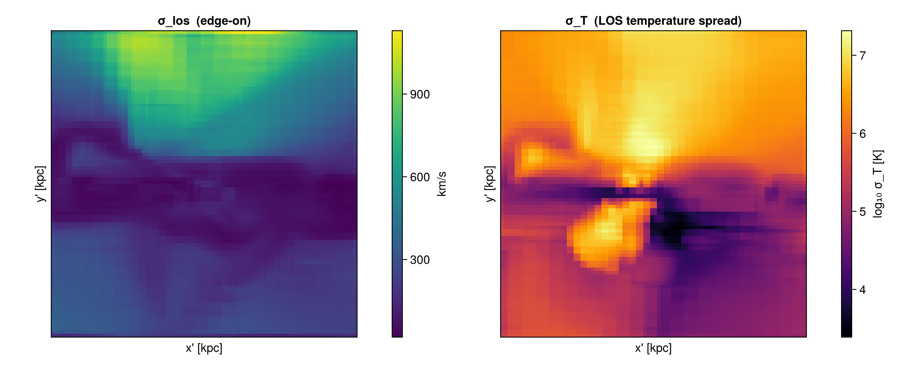
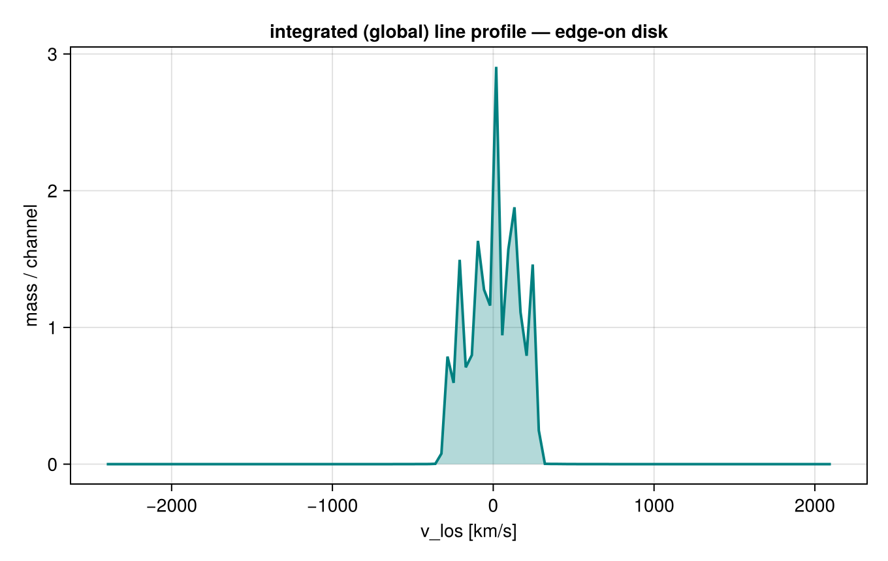
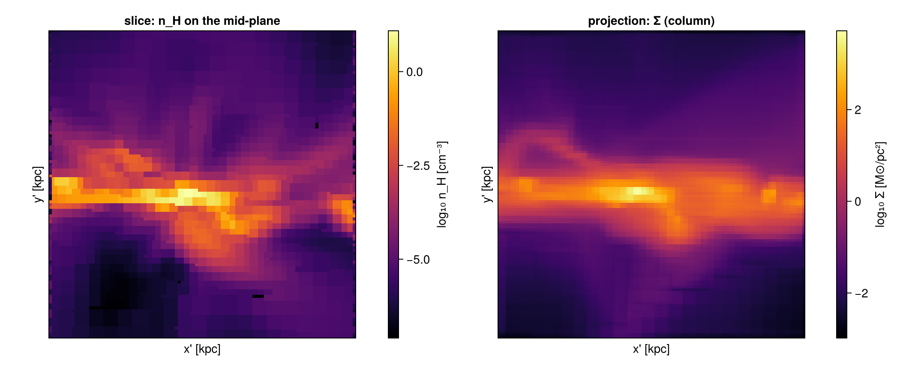
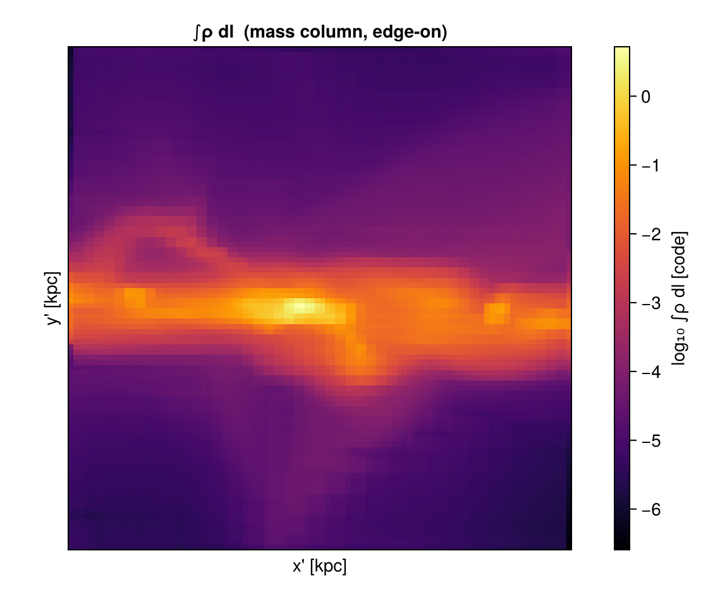
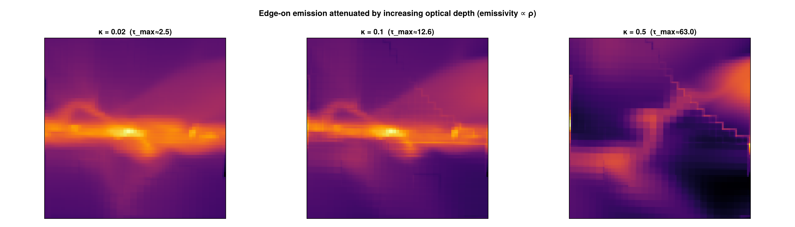
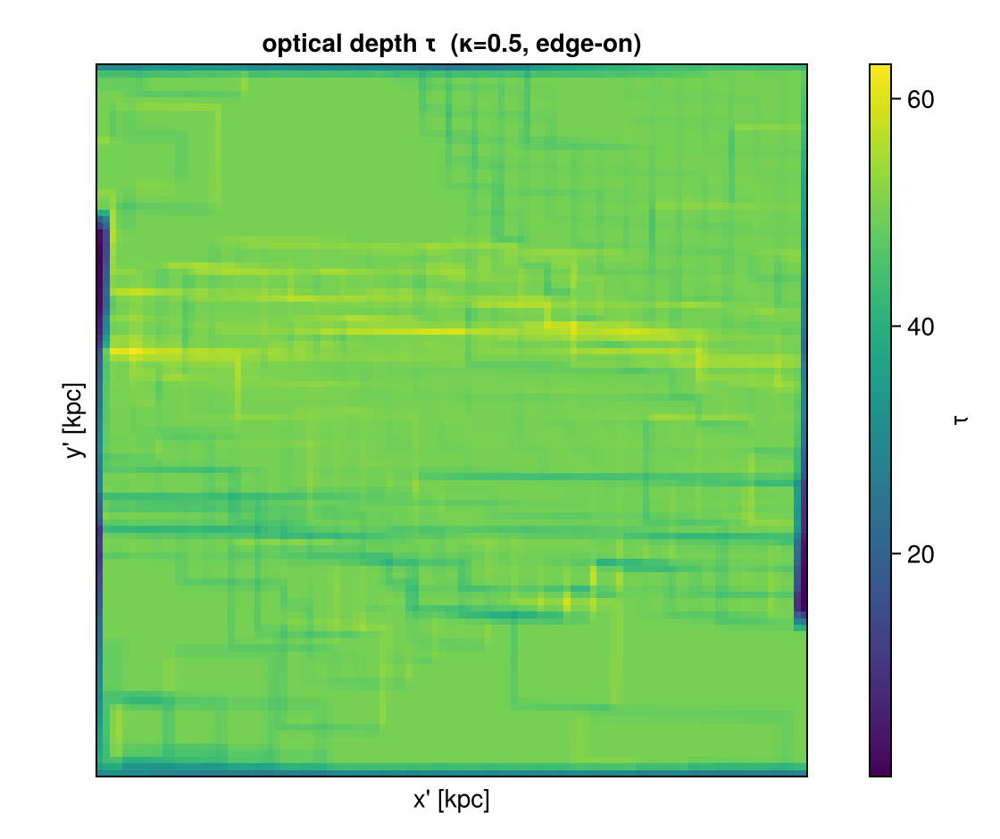
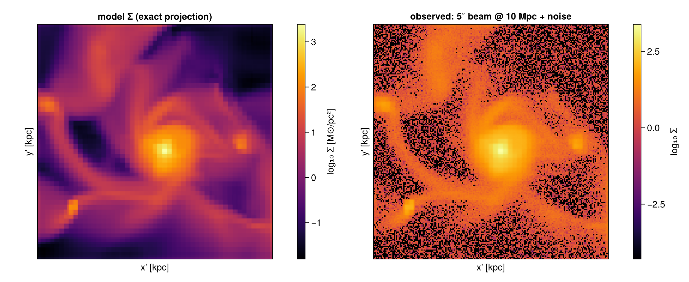

# Off-axis: advanced LOS features & mock observations

This tutorial walks through the line-of-sight analysis tools built on top of Mera's off-axis
projection — **velocity/field dispersion (`moment2`)**, the **integrated spectrum**, **off-axis
slices**, the **column integral**, **emission + absorption (`emission_map`)**, a telescope **beam
in angular units**, and **FITS export with a sky WCS**.

Run the cells top to bottom and change the numbers. We use **one galaxy** throughout
(`spiral_clumps`) and set pixel sizes physically with `pxsize=[size, :unit]`.

Prerequisite: the [off-axis projection tutorial](11_multi_OffAxisProjection.md).


```julia
# --- environment ---------------------------------------------------------
using Pkg
Pkg.activate(expanduser("~/Documents/codes/github/Mera.jl"))   # adjust to your Mera.jl checkout
using Mera, CairoMakie
CairoMakie.activate!()
println("threads = ", Threads.nthreads())
```

      Activating 

    threads = 4

    project at `~/Documents/codes/github/Mera.jl`


    


```julia
BASE = "/Volumes/FASTStorage/Simulations/Mera-Tests"   # <-- change me
gas  = gethydro(getinfo(100, joinpath(BASE, "spiral_clumps"), verbose=false), verbose=false, show_progress=false);
```

      0.739124 seconds (3.91 M allocations: 303.285 MiB, 1.39% gc time, 100.09% compilation time)


A small helper to show a 2D map with physical axes (reused below):


```julia
function showmap!(fig, pos, M, ext_kpc; title="", clabel="", cmap=:inferno, logscale=true, crange=nothing, divergent=false)
    A = logscale ? log10.(map(v -> v > 0 ? v : NaN, M)) : Float64.(M)
    ax = Axis(fig[pos...], aspect=DataAspect(), title=title, xlabel="x' [kpc]", ylabel="y' [kpc]")
    xs = range(ext_kpc[1], ext_kpc[2], length=size(A,1)); ys = range(ext_kpc[3], ext_kpc[4], length=size(A,2))
    hm = crange===nothing ? heatmap!(ax, xs, ys, A, colormap=cmap, nan_color=:black) :
                            heatmap!(ax, xs, ys, A, colormap=cmap, nan_color=:black, colorrange=crange)
    Colorbar(fig[pos[1], pos[2]+1], hm, label=clabel); hidedecorations!(ax, label=false)
    return ax
end;
```

## 1. Dispersion of any field — `moment2`

`moment2(obj, q)` is the weight-weighted line-of-sight **standard deviation** σ = √(⟨q²⟩−⟨q⟩²)
of a field `q`. For `q=:vlos` it is the velocity dispersion `σlos`; but it works for **any**
field — here the temperature dispersion along each edge-on sightline, next to the mean v_los.


```julia
win = (direction=:edgeon, center=[:bc], xrange=[-16,16], yrange=[-16,16], range_unit=:kpc, pxsize=[0.4,:kpc])
sv  = moment2(gas, :vlos, :km_s; win..., verbose=false)        # σ_los  (velocity dispersion)
sT  = moment2(gas, :T,    :K;    win..., verbose=false)        # σ_T    (temperature dispersion)
e   = [sv.x[1], sv.x[end], sv.y[1], sv.y[end]] .* gas.scale.kpc   # moment2/los_component give x,y edges
fig = Figure(size=(1050,430))
showmap!(fig, (1,1), sv.map, e; title="σ_los  (edge-on)", clabel="km/s", logscale=false, cmap=:viridis)
showmap!(fig, (1,3), sT.map, e; title="σ_T  (LOS temperature spread)", clabel="log₁₀ σ_T [K]")
fig
```


    

    


## 2. The global spectrum — `integrated_spectrum`

A velocity cube holds a spectrum per pixel; summing them over the map gives the **integrated
(global) line profile** — the single-dish HI/CO-style profile. (Summing the profile over the
channels returns the enclosed mass.)


```julia
vc = velocity_cube(gas; direction=:edgeon, center=[:bc], xrange=[-18,18], yrange=[-18,18],
                   range_unit=:kpc, pxsize=[0.4,:kpc], nv=120, verbose=false)
v, I = integrated_spectrum(vc)
println("∫ spectrum dv = ", round(sum(I), sigdigits=4), "  (code mass) = enclosed mass")
fig = Figure(size=(680,430)); ax = Axis(fig[1,1], xlabel="v_los [km/s]", ylabel="mass / channel",
                                        title="integrated (global) line profile — edge-on disk")
band!(ax, v, zero(I), I, color=(:teal,0.3)); lines!(ax, v, I, color=:teal, linewidth=2)
fig
```

    ∫ spectrum dv = 19.45

      (code mass) = enclosed mass


    

    


## 3. Off-axis slice (cutting plane) — `offaxis_slice`

`offaxis_slice` gives the field **on** the camera plane through the centre — a cut, not an
integral. Compare the mid-plane density (slice) with the surface density (projection) of the
same edge-on view. A slice is a nearest-cell sample (resolution-dependent), so use a projection
when you need a conserved quantity.


```julia
sl = offaxis_slice(gas, :rho, :nH; direction=:edgeon, center=[:bc], xrange=[-16,16], yrange=[-16,16],
                   range_unit=:kpc, pxsize=[0.3,:kpc], verbose=false)
pj = projection(gas, :sd, :Msol_pc2; direction=:edgeon, center=[:bc], xrange=[-16,16], yrange=[-16,16],
                range_unit=:kpc, pxsize=[0.3,:kpc], binning=:exact, verbose=false, show_progress=false)
fig = Figure(size=(1050,430)); es = sl.extent .* gas.scale.kpc; ep = pj.extent .* gas.scale.kpc
showmap!(fig, (1,1), sl.map, es; title="slice: n_H on the mid-plane", clabel="log₁₀ n_H [cm⁻³]")
showmap!(fig, (1,3), pj.maps[:sd], ep; title="projection: Σ (column)", clabel="log₁₀ Σ [M⊙/pc²]")
fig
```


    

    


## 4. Column integral — `column_integral`

`column_integral` is the path-length-weighted line integral `∫ q dl` (the geometric basis of a
column-density / optical-depth map): `q=:rho` gives the mass column (the same physical quantity
as `:sd`), and `τ = κ·∫ρ dl` for a grey opacity. With `binning=:exact` the chord length through
each cube is integrated per pixel analytically.


```julia
N = column_integral(gas, :rho; direction=:edgeon, center=[:bc], xrange=[-18,18], yrange=[-18,18],
                    range_unit=:kpc, pxsize=[0.4,:kpc], binning=:exact)
fig = Figure(size=(560,470)); e = N.extent .* gas.scale.kpc
showmap!(fig, (1,1), N.map, e; title="∫ρ dl  (mass column, edge-on)", clabel="log₁₀ ∫ρ dl [code]")
fig
```

    [Mera]: 2026-06-06T10:10:44.143
    


    center: [0.5, 0.5, 0.5] ==> [50.0 [kpc] :: 50.0 [kpc] :: 50.0 [kpc]]
    
    domain:
    xmin::xmax: 0.32 :: 0.68  	==> 32.0 [kpc] :: 68.0 [kpc]
    ymin::ymax: 0.32 :: 0.68  	==> 32.0 [kpc] :: 68.0 [kpc]
    zmin::zmax: 0.0 :: 1.0  	==> 0.0 [kpc] :: 100.0 [kpc]
    
    Selected var(s)=(:rho,) 


    Weighting      = :volume
    Off-axis LOS   = 

    [0.9999, 0.0003, -0.0143]  (binning=:exact)
    Effective resolution: 251^2  →  map size: 98 x 98
    


    

    


## 5. Emission + absorption — `emission_map`

`emission_map` solves the front-to-back radiative-transfer equation
`I = Σ S·(1−e^{−Δτ})·e^{−τ_front}` along each sightline, with `Δτ = κ·ℓ` and the **exact**
box-spline chord length `ℓ`. The emissivity is the source function times the opacity, so at
small `κ` the result is the optically-thin limit `I ≈ S·κL`, and as `κ` grows the **far side of
the disk is absorbed** and the near side dominates (a uniform slab of depth `L` gives exactly
`I = S(1−e^{−κL})`). Here the source function is the density (`source=:rho`).


```julia
win5 = (direction=:edgeon, center=[:bc], xrange=[-20,20], yrange=[-20,20], range_unit=:kpc, pxsize=[0.4,:kpc])
fig = Figure(size=(1500,430))
for (k,κ) in enumerate((0.02, 0.1, 0.5))
    em = emission_map(gas; kappa=κ, source=:rho, win5..., verbose=false)
    A = log10.(replace(em.map, 0.0=>NaN)); ee = em.extent .* gas.scale.kpc
    ax = Axis(fig[1,k], aspect=DataAspect(), title="κ = $(κ)  (τ_max≈$(round(maximum(em.tau),digits=1)))")
    heatmap!(ax, range(ee[1],ee[2],length=size(A,1)), range(ee[3],ee[4],length=size(A,2)), A, colormap=:inferno, nan_color=:black)
    hidedecorations!(ax)
end
Label(fig[0,:], "Edge-on emission attenuated by increasing optical depth (emissivity ∝ ρ)", fontsize=15, font=:bold)
fig
```


    

    


The optical-depth map `em.tau` (the `e^{−τ}` that attenuates emission from behind) for the most
opaque case — this is the quantity that makes the far side fade:


```julia
em = emission_map(gas; kappa=0.5, source=:rho, win5..., verbose=false)
fig = Figure(size=(560,470)); e = em.extent .* gas.scale.kpc
showmap!(fig, (1,1), em.tau, e; title="optical depth τ  (κ=0.5, edge-on)", clabel="τ", logscale=false, cmap=:viridis)
fig
```


    

    


## 6. A telescope beam in angular units — `mock_observe`

`mock_observe` convolves a map with a Gaussian beam. Beyond a physical beam (`:kpc`), it accepts
an **angular** beam (`:arcsec`) together with a source **`distance`** — the beam is `θ × distance`
physical (small-angle). Here a face-on disk observed with a 5″ beam at 10 Mpc (`distance=1e4, distance_unit=:kpc`).


```julia
m   = projection(gas, :sd, :Msol_pc2; direction=:faceon, center=[:bc], xrange=[-18,18], yrange=[-18,18],
                 range_unit=:kpc, pxsize=[0.2,:kpc], binning=:exact, verbose=false, show_progress=false)
obs = mock_observe(m, :sd; beam_fwhm=5.0, beam_unit=:arcsec, distance=1.0e4, distance_unit=:kpc, noise=2.0)
fig = Figure(size=(1050,430)); e = m.extent .* gas.scale.kpc
showmap!(fig, (1,1), m.maps[:sd], e; title="model Σ (exact projection)", clabel="log₁₀ Σ [M⊙/pc²]")
showmap!(fig, (1,3), obs, e; title="observed: 5″ beam @ 10 Mpc + noise", clabel="log₁₀ Σ")
fig
```


    

    


## 7. FITS export with a sky WCS — `savefits`

Maps and cubes export to **FITS** for DS9/CASA/CARTA/astropy. `savefits` is a package extension —
load `FITSIO` to enable it. With `wcs=:sky` and a `distance` it writes a celestial WCS
(`RA---TAN`/`DEC--TAN`) and, for cubes, a proper spectral axis (`VRAD`):

```julia
using FITSIO                                   # activates the FITS extension
# a map with a celestial WCS (5″/pix scale derives from pxsize and the distance)
savefits(m, :sd, "disk_sd"; wcs=:sky, distance=1.0e4, distance_unit=:kpc, sky_center=(150.0, 2.0))
# a velocity cube with celestial + spectral (VRAD) WCS — opens in CASA/CARTA/spectral-cube
savefits(vc, "disk_cube"; wcs=:sky, distance=1.0e4, distance_unit=:kpc)
```

For dependency-free storage use `savecube`/`loadcube` (JLD2). The default `wcs=:linear` writes a
camera-plane WCS in code units (no distance needed).

## Takeaway

- `moment2` — LOS dispersion of *any* field;
- `integrated_spectrum` — the global line profile of a cube;
- `offaxis_slice` — the field on a cutting plane (vs the conserved projection);
- `column_integral` — the line integral `∫ q dl` (mass column / optical-depth basis);
- `emission_map` — emission **with absorption** (e^{−τ}) using the exact chord length;
- `mock_observe` — physical *or* angular beam (with a distance) + noise;
- `savefits(…; wcs=:sky)` — celestial + spectral WCS, ready for CASA/CARTA/DS9.

All build on the conservative off-axis core; everything here is regression-tested
(`test/36_offaxis_features_tests.jl`).
