# Profiles & phase diagrams — a step-by-step guide

`profile`, `phase`, `profile3d`, `rotationcurve` and `profiletimeseries` are **general, weighted
reductions** over any Mera field — a *profile* bins by one quantity (often a **radius**) and reports
per-bin **statistics** of another; a *phase diagram* is a 2-D weighted histogram. They work on
**3-D data** (gas / gravity / particles) **and on projected 2-D maps**.

This tutorial builds them up one feature at a time, on **one galaxy**, and plots every concept.
Change the numbers and run along.

## 0. Setup — load the galaxy once

Load hydro, gravity and clumps from one snapshot, plus a companion run that carries **particles**
(dark matter + stars). Define a reusable physical **center**; profiles take a `center` in any length unit.


```julia
using Pkg
Pkg.activate(expanduser("~/Documents/codes/github/Mera.jl"))
using Mera, CairoMakie
CairoMakie.activate!()
BASE = "/Volumes/FASTStorage/Simulations/Mera-Tests"   # <-- change me
info  = getinfo(100, joinpath(BASE,"spiral_clumps"), verbose=false)
gas   = gethydro(info,  verbose=false, show_progress=false)
grav  = getgravity(info, lmax=gas.lmax, verbose=false, show_progress=false)
parts = getparticles(getinfo(1, joinpath(BASE,"spiral_ugrid"), verbose=false), verbose=false, show_progress=false)
ctr = [:bc]                         # box centre; e.g. [24.,24.,24.] with range_unit=:kpc also works
println("threads=", Threads.nthreads(), "  gas cells=", length(gas.data), "  particles=", length(parts.data))
```

      Activating 

    project at `~/Documents/codes/github/Mera.jl`


    [ Info: Precompiling Mera [02f895e8-fdb1-4346-8fe6-c721699f5126] (cache misses: wrong dep version loaded (14), mismatched flags (4))


    
    SYSTEM: caught exception of type :MethodError while trying to print a failed Task notice; giving up
    
    SYSTEM: caught exception of type :MethodError while trying to print a failed Task notice; giving up
    
    SYSTEM: caught exception of type :MethodError while trying to print a failed Task notice; giving up
    
    SYSTEM: caught exception of type :MethodError while trying to print a failed Task notice; giving up


    
    *__   __ _______ ______   _______ 

    
    SYSTEM: caught exception of type :MethodError while trying to print a failed Task notice; giving up
    
    SYSTEM: caught exception of type :MethodError while trying to print a failed Task notice; giving up


    
    |  |_|  |       |    _ | |   _   |
    |       |    ___|   | || |  |_|  |
    |       |   |___|   |_||_|       |
    |       |    ___|    __  |       |
    | ||_|| |   |___|   |  | |   _   |
    |_|   |_|_______|___|  |_|__| |__|
    Mera v1.8.0
    


    [ Info: Precompiling CairoMakie [13f3f980-e62b-5c42-98c6-ff1f3baf88f0] (cache misses: wrong dep version loaded (18))


    
    SYSTEM: caught exception of type :MethodError while trying to print a failed Task notice; giving up


    [ Info: Precompiling PolynomialsMakieExt [6a4b1961-d857-5aa3-b7f6-fc7c46de29bb] (cache misses: wrong dep version loaded (18))
    
    SYSTEM: caught exception of type :MethodError while trying to print a failed Task notice; giving up


      0.791117 seconds (3.92 M allocations: 303.658 MiB, 1.16% gc time, 101.43% compilation time)


      0.484409 seconds (1.62 M allocations: 169.833 MiB, 101.23% compilation time)


    threads=4

      gas cells=590311  particles=45470


## 1. The simplest profile — binning a quantity

With only a bin field, `profile` returns the **summed weight** per bin — e.g. the radial **mass
profile** M(R). The radius is measured about `center`; `nbins`, `xrange`, `scale` and units are
physical. `scale=:log` gives log-spaced bins (the low edge is clamped to the smallest positive
value; the top edge is inclusive). Set bins by **count** (`nbins`), by a **physical width**
(`binsize=0.5` in `xunit`, or `binsize=(500,:pc)` with its own unit; a dimensionless **dex** step
under `scale=:log`), or by fully custom `edges=` — `binsize`/`edges` override `nbins`. Returns `x`
(centres), `edges`, `count`, `sum` (Σweight), `sumw2`.


```julia
pl  = profile(gas, :r_cylinder; weight=:mass, nbins=50, xrange=(0,24), center=ctr, range_unit=:kpc, xunit=:kpc)
plg = profile(gas, :r_cylinder; weight=:mass, nbins=50, scale=:log, xrange=(0.3,24), center=ctr, range_unit=:kpc, xunit=:kpc)
pe  = profile(gas, :r_cylinder; weight=:mass, edges=[0.,2.,4.,8.,16.,24.], center=ctr, range_unit=:kpc, xunit=:kpc)
pbs = profile(gas, :r_cylinder; weight=:mass, binsize=(500,:pc), xrange=(0,24), center=ctr, range_unit=:kpc, xunit=:kpc)
println("binsize=(500,:pc) → bin width [kpc] = ", round(diff(pbs.edges)[1], digits=3), "  (", length(pbs.edges)-1, " bins)")
M(p) = p.sum .* gas.scale.Msol      # code mass -> Msol
fig = Figure(size=(1080,420))
ax1 = Axis(fig[1,1], xlabel="R [kpc]", ylabel="mass / bin [M⊙]", title="linear bins")
scatterlines!(ax1, pl.x, M(pl), color=:seagreen)
ax2 = Axis(fig[1,2], xscale=log10, yscale=log10, xlabel="R [kpc]", ylabel="mass / bin [M⊙]", title="log bins + custom edges")
o = M(plg) .> 0
lines!(ax2, plg.x[o], M(plg)[o], color=:dodgerblue, label="50 log bins")
stairs!(ax2, pe.x, max.(M(pe),1), color=:crimson, step=:center, label="custom edges")
axislegend(ax2, position=:rt); fig
```

    binsize=(500,:pc) → bin width [kpc] = 0.5

      (48 bins)


    

    


## 2. Per-bin statistics — a binned statistic is not a histogram

Give a **second field** `yvar` and each bin carries the weight-weighted **`mean`**, **`std`**,
**`sem`** (standard error on the mean, `std/√neff` with the Kish effective sample size `neff`),
**`min`/`max`**, **`median`** and a **`quantiles`** matrix at the requested `qlevels`. A custom
`statistic=f` (called `f(yview, wview)` if it accepts weights, else `f(yview)`) adds a `custom`
column. One figure makes the whole spread visible.


```julia
pT = profile(gas, :r_cylinder, :T; weight=:mass, unit=:K, nbins=35, xrange=(0,20), center=ctr, range_unit=:kpc, xunit=:kpc,
             quantiles=[0.16,0.5,0.84])
pC = profile(gas, :r_cylinder, :T; weight=:mass, unit=:K, nbins=35, xrange=(0,20), center=ctr, range_unit=:kpc, xunit=:kpc,
             statistic=(y,w)->sqrt(sum(w.*y.^2)/sum(w)))   # mass-weighted RMS -> pC.custom
ok = (pT.count .> 0) .& (pT.min .> 0) .& (pT.mean .> 0)
x=pT.x[ok]; mn=pT.min[ok]; mx=pT.max[ok]; q1=pT.quantiles[ok,1]; q3=pT.quantiles[ok,3]
mu=pT.mean[ok]; sd=pT.std[ok]; md_=pT.median[ok]; sem=pT.sem[ok]; rms=pC.custom[ok]; flo=minimum(mn)
fig = Figure(size=(760,500)); ax = Axis(fig[1,1], yscale=log10, xlabel="R [kpc]", ylabel="T [K]",
                                        title="temperature: mean, std, 16–84%, extrema, sem, custom RMS")
band!(ax, x, mn, mx, color=(:gray,0.15), label="min–max")
band!(ax, x, q1, q3, color=(:orange,0.30), label="16–84%")
band!(ax, x, max.(mu.-sd, flo), mu.+sd, color=(:dodgerblue,0.25), label="±std")
lines!(ax, x, md_, color=:black, linewidth=1.5, linestyle=:dash, label="median")
lines!(ax, x, mu, color=:dodgerblue, linewidth=2.5, label="mean")
lines!(ax, x, rms, color=:crimson, linewidth=2, label="custom RMS")
se = [i for i in 1:4:length(x) if mu[i]-sem[i] > 0]   # keep whiskers positive on the log axis
errorbars!(ax, x[se], mu[se], sem[se], color=:dodgerblue, whiskerwidth=6)
axislegend(ax, position=:rt, framevisible=false); fig
```


    
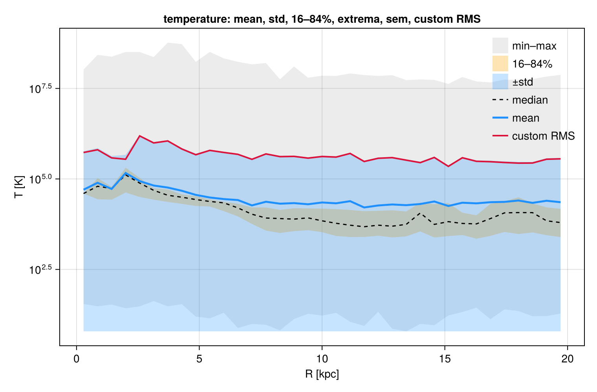
    


## 3. Density, enclosed mass & normalization (density PDF)

`geometry=:spherical` (shell `4/3·π·Δr³`) or `:cylindrical` (annulus `π·Δr²`) divides the binned
weight by the shell volume to give a physical **`density`** (`weight`-unit per `xunit`³, + `shell_volume`).
`cumulative=:forward` (or `:reverse`) adds `cumsum`/`cumcount` — the **enclosed mass** M(<r).
`normalize=:sum` gives per-bin `fraction` (Σ=1); `normalize=:pdf` gives a true probability density
`pdf` (∫=1). The canonical use is the **density PDF** — bin *by* density and normalize; the `weight`
then picks the **mass-weighted** vs **volume-weighted** ρ-PDF (they differ — the near-log-normal ISM
density distribution).


```julia
pr = profile(gas, :r_sphere; weight=:mass, geometry=:spherical, cumulative=:forward, scale=:log,
             xrange=(0.3,24), nbins=40, center=ctr, range_unit=:kpc, xunit=:kpc)
ρ = pr.density .* gas.scale.Msol; Menc = pr.cumsum .* gas.scale.Msol
dm = profile(gas, :rho; weight=:mass,   normalize=:pdf, scale=:log, unit=:nH, nbins=60)   # mass-weighted ρ-PDF
dv = profile(gas, :rho; weight=:volume, normalize=:pdf, scale=:log, unit=:nH, nbins=60)   # volume-weighted ρ-PDF
fig = Figure(size=(1500,420))
ax1 = Axis(fig[1,1], xscale=log10, yscale=log10, xlabel="r [kpc]", ylabel="ρ [M⊙/kpc³]", title="spherical density ρ(r)  (geometry)")
od = ρ .> 0; scatterlines!(ax1, pr.x[od], ρ[od], color=:crimson)
ax2 = Axis(fig[1,2], xscale=log10, xlabel="r [kpc]", ylabel="M(<r) [M⊙]", title="enclosed mass  (cumulative)")
lines!(ax2, pr.x, Menc, color=:navy, linewidth=2.5)
ax3 = Axis(fig[1,3], xscale=log10, yscale=log10, xlabel="n_H [cm⁻³]", ylabel="pdf [per linear n_H]", title="density PDF  (normalize=:pdf)")
om = dm.pdf .> 0; ov = dv.pdf .> 0
lines!(ax3, dm.x[om], dm.pdf[om], color=:crimson, linewidth=2.5, label="mass-weighted")
lines!(ax3, dv.x[ov], dv.pdf[ov], color=:teal,    linewidth=2.5, label="volume-weighted")
axislegend(ax3, position=:lt); fig
```


    

    


## 4. Many fields in one pass

Pass `yvar` as a **vector** to bin the data **once** and reduce several fields together — far cheaper
than one `profile` call per field. The per-field statistics live under `p.fields[:T]`, `p.fields[:rho]`,
in the order given by `p.yvars`.


```julia
pm = profile(gas, :r_cylinder, [:T, :rho]; weight=:mass, nbins=40, xrange=(0,20), center=ctr, range_unit=:kpc, xunit=:kpc)
println("reduced fields: ", pm.yvars)
T = pm.fields[:T].mean; nH = pm.fields[:rho].mean      # code units (one shared `unit` per call)
oT = isfinite.(T).&(T.>0); oR = isfinite.(nH).&(nH.>0)
fig = Figure(size=(760,460)); ax = Axis(fig[1,1], yscale=log10, xlabel="R [kpc]", ylabel="⟨T⟩ [code]", title="two fields, one pass: ⟨T⟩ and ⟨ρ⟩")
lines!(ax, pm.x[oT], T[oT], color=:orangered, linewidth=2.5)
ax2 = Axis(fig[1,1], yscale=log10, yaxisposition=:right, ylabel="⟨ρ⟩ [code]", ygridvisible=false)
hidexdecorations!(ax2); lines!(ax2, pm.x[oR], nH[oR], color=:teal, linewidth=2.5)
axislegend(ax, [LineElement(color=:orangered),LineElement(color=:teal)], ["⟨T⟩ (left)","⟨ρ⟩ (right)"], position=:rt); fig
```

    reduced fields: 

    [:T, :rho]


    
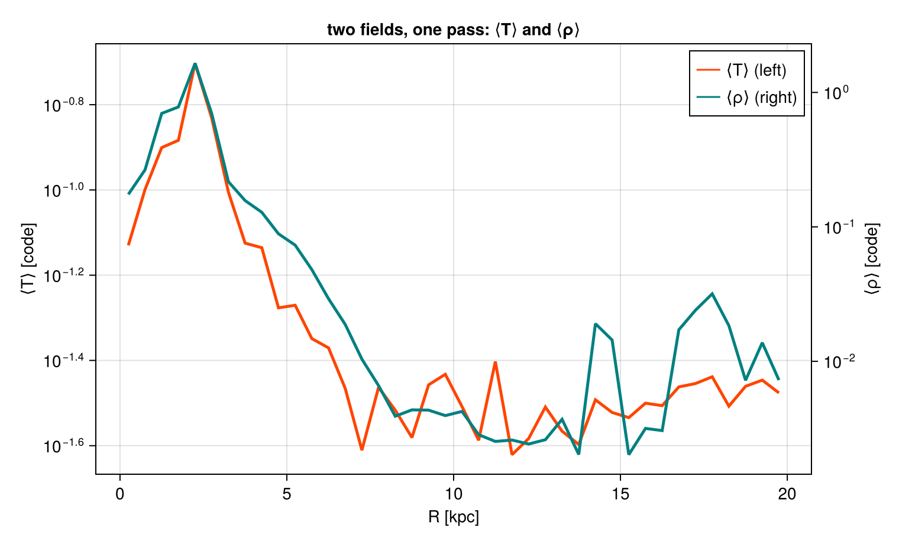
    


## 5. Weighting & components — mass vs volume vs none

`weight` is `:mass`, `:volume` (grid-only), `:none` (equal cells) or **any field**. Mass- and
volume-weighted means differ wherever density varies within a bin; `:none` is the unweighted mean.
Profiles work for every data type — but **gravity/RT carry no `:mass`** (use `:volume`/`:none`).
To combine components, profile each on **shared `edges`** (here gas vs DM vs stars enclosed mass).


```julia
ed = collect(range(0,20,length=41))
pmw = profile(gas, :r_sphere, :rho; weight=:mass,   unit=:nH, edges=ed, center=ctr, range_unit=:kpc, xunit=:kpc)
pvw = profile(gas, :r_sphere, :rho; weight=:volume, unit=:nH, edges=ed, center=ctr, range_unit=:kpc, xunit=:kpc)
pep = profile(grav, :r_sphere, :epot; weight=:volume, edges=ed, center=ctr, range_unit=:kpc, xunit=:kpc)  # gravity: no :mass
fig = Figure(size=(1080,430))
ax1 = Axis(fig[1,1], yscale=log10, xlabel="r [kpc]", ylabel="⟨n_H⟩ [cm⁻³]", title="weighting: mass vs volume (gas)")
o1=(pmw.mean.>0); o2=(pvw.mean.>0)
lines!(ax1, pmw.x[o1], pmw.mean[o1], color=:crimson, linewidth=2.5, label="mass-weighted")
lines!(ax1, pvw.x[o2], pvw.mean[o2], color=:teal,    linewidth=2.5, label="volume-weighted")
axislegend(ax1, position=:rt)
ax2 = Axis(fig[1,2], xlabel="r [kpc]", ylabel="⟨Φ⟩ [code]", title="gravity potential (weight=:volume; no :mass)")
og=isfinite.(pep.mean); lines!(ax2, pep.x[og], pep.mean[og], color=:slateblue, linewidth=2.5); fig
```


    
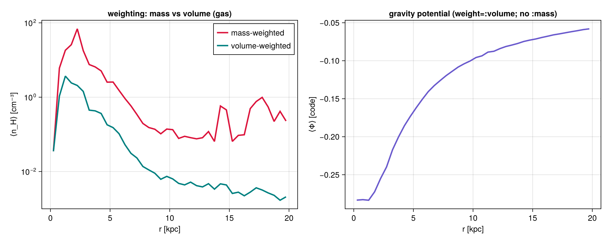
    


## 6. Rotation curve — who contributes how much

`rotationcurve` forms the enclosed mass M(<r) and returns the **dynamical** circular velocity
`v_circ = √(G·M(<r)/r)`. Run it per **component** — gas (optionally **masked**, e.g. cold gas only),
stars, dark matter — and they add **in quadrature**, `v_tot² = Σ v_i²`. The squared ratio
`(v_i/v_tot)²` is exactly each component's **fractional contribution** to the rotational support. This
is the dynamical mass decomposition (≠ the *kinematic* ⟨v_ϕ⟩ of §7).

**How `v_circ` is estimated:** the enclosed mass `M(<r)` is an *exact* direct sum of the binned masses;
`v_circ = √(G·M(<r)/r)` is then the **spherical** (shell-theorem) idealization — it assumes spherical
symmetry, so for a flattened disk it under-shoots at large R. The third panel overplots it against the
**exact** curve from the solved gravity field, `v = √(R·|a_R|)` with `a_R = getvar(grav, :ar_cylinder)`
(the true radial acceleration of all matter) — the dynamically rigorous rotation curve.


```julia
opts = (rvar=:r_cylinder, xunit=:kpc, center=ctr, range_unit=:kpc, nbins=50, xrange=(0.3,25))
rcg = rotationcurve(gas; opts...)                                  # all gas
cold = getvar(gas, :T, :K) .< 1e4                                  # a gas mask: cold gas (< 10⁴ K)
rcc = rotationcurve(gas; mask=cold, opts...)                       # cold-gas contribution
rcs = rotationcurve(parts; mask=getparticlemask(parts,:stars; verbose=false), opts...)
rcd = rotationcurve(parts; mask=getparticlemask(parts,:dm;    verbose=false), opts...)
vtot = sqrt.(rcg.v_circ.^2 .+ rcs.v_circ.^2 .+ rcd.v_circ.^2)       # spherical-estimate total
# EXACT curve from the solved gravity field: v = √(R·|a_R|), a_R = radial acceleration (all matter)
pa  = profile(grav, :r_cylinder, :ar_cylinder; weight=:volume, unit=:cm_s2, nbins=50, xrange=(0.3,25), center=ctr, range_unit=:kpc, xunit=:kpc)
Rcm = pa.x .* (Mera.getunit(info,:cm)/Mera.getunit(info,:kpc))
vexact = sqrt.(Rcm .* abs.(pa.mean)) ./ 1e5                        # km/s
fig = Figure(size=(1500,430))
ax1 = Axis(fig[1,1], xlabel="R [kpc]", ylabel="v_circ [km/s]", title="rotation curve by component")
lines!(ax1, rcd.x, rcd.v_circ, color=:navy,      linewidth=2, label="dark matter")
lines!(ax1, rcs.x, rcs.v_circ, color=:goldenrod, linewidth=2, label="stars")
lines!(ax1, rcg.x, rcg.v_circ, color=:seagreen,  linewidth=2, label="gas (all)")
lines!(ax1, rcc.x, rcc.v_circ, color=:seagreen,  linewidth=1.5, linestyle=:dot, label="gas (cold, masked)")
lines!(ax1, rcg.x, vtot, color=:black, linewidth=3, linestyle=:dash, label="total")
axislegend(ax1, position=:rb)
fd=(rcd.v_circ./vtot).^2; fs=(rcs.v_circ./vtot).^2; fg=(rcg.v_circ./vtot).^2
ax2 = Axis(fig[1,2], xlabel="R [kpc]", ylabel="(v_i / v_tot)²", title="fractional contribution to v²  (stacks to 1)")
band!(ax2, rcg.x, fill(0.0,length(rcg.x)), fd, color=(:navy,0.6), label="dark matter")
band!(ax2, rcg.x, fd, fd.+fs, color=(:goldenrod,0.6), label="stars")
band!(ax2, rcg.x, fd.+fs, fd.+fs.+fg, color=(:seagreen,0.6), label="gas")
axislegend(ax2, position=:rc)
ax3 = Axis(fig[1,3], xlabel="R [kpc]", ylabel="v_circ [km/s]", title="spherical estimate vs exact (from ∂Φ)")
lines!(ax3, rcg.x, vtot, color=:gray, linewidth=2.5, label="√(GM(<r)/r)  (spherical)")
lines!(ax3, pa.x, vexact, color=:crimson, linewidth=2.5, label="√(R·|a_R|)  (gravity, exact)")
axislegend(ax3, position=:rb); fig
```


    
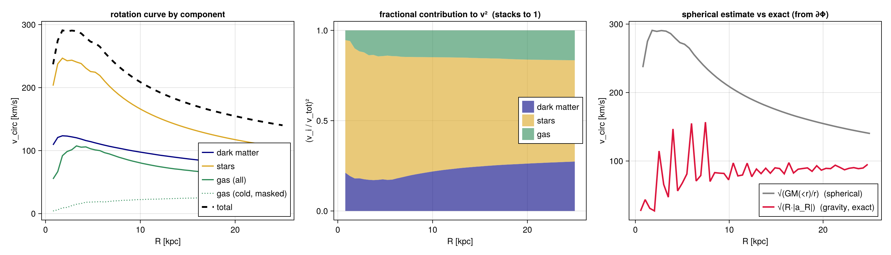
    


## 7. Velocity decomposition — rotation, inflow & dispersions

`getvar` splits each cell's velocity into orthonormal components about `center` (axis = z), with
`v_r² + v_ϕ² + v_z² = |v|²`:

| field | meaning | profile `mean` | profile `std` |
|---|---|---|---|
| `:vϕ_cylinder` | azimuthal = **rotation** | ⟨v_ϕ⟩(R) (signed) | σ_ϕ(R) |
| `:vr_cylinder` | **radial** in/outflow | ⟨v_R⟩(R) (±=out/in) | σ_R(R) |
| `:vz` | **vertical** | ⟨v_z⟩(R) | σ_z(R) |
| `:vr_sphere`,`:vθ_sphere`,`:vϕ_sphere` | spherical triplet | — | — |

The per-bin **`std`** is the *rest-frame* velocity **dispersion** (variance about the per-bin mean, so
net rotation does **not** inflate it). [`velocitydispersion`](@ref) returns σ_R/σ_ϕ/σ_z and the total
σ = √(σ_R²+σ_ϕ²+σ_z²) in one call — we overplot its total σ below.


```julia
vk = (weight=:mass, unit=:km_s, nbins=40, xrange=(0.3,20), center=ctr, range_unit=:kpc, xunit=:kpc)
vphi = profile(gas, :r_cylinder, :vϕ_cylinder; vk...)
vrad = profile(gas, :r_cylinder, :vr_cylinder; vk...)
vver = profile(gas, :r_cylinder, :vz;          vk...)
vd   = velocitydispersion(gas; nbins=40, xrange=(0.3,20), center=ctr, center_unit=:kpc)   # σ_R/σ_ϕ/σ_z + total
ok = vphi.count .> 0
fig = Figure(size=(1150,440))
ax1 = Axis(fig[1,1], xlabel="R [kpc]", ylabel="⟨v⟩ [km/s]", title="component curves (mass-weighted)")
lines!(ax1, vphi.x[ok], abs.(vphi.mean[ok]), color=:dodgerblue, linewidth=2.5, label="|⟨v_ϕ⟩|  rotation")
lines!(ax1, vrad.x[ok], vrad.mean[ok], color=:crimson, linewidth=2, label="⟨v_r⟩  radial (±=out/in)")
hlines!(ax1, [0.0], color=:gray, linestyle=:dot); axislegend(ax1, position=:rt)
ax2 = Axis(fig[1,2], xlabel="R [kpc]", ylabel="σ [km/s]", title="velocity dispersions (per-bin std)")
lines!(ax2, vphi.x[ok], vphi.std[ok], color=:dodgerblue, linewidth=2, label="σ_ϕ")
lines!(ax2, vrad.x[ok], vrad.std[ok], color=:crimson, linewidth=2, label="σ_r")
lines!(ax2, vver.x[ok], vver.std[ok], color=:seagreen, linewidth=2, label="σ_z")
lines!(ax2, vd.x[vd.count.>0], vd.sigma[vd.count.>0], color=:black, linestyle=:dash, linewidth=2, label="σ_tot (velocitydispersion)")
axislegend(ax2, position=:rt); fig
```


    
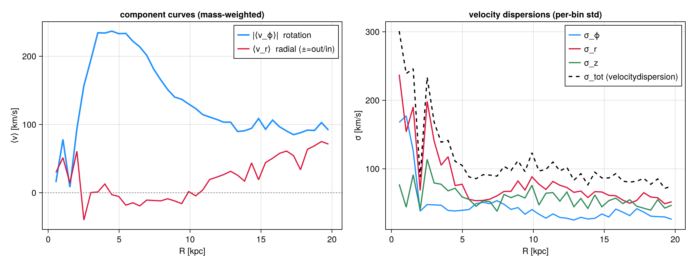
    


## 8. Selecting particles — `getparticlemask`

Build a boolean mask by **type / family / tag** and pass it as `mask=` to any profile call.
Named types: `:all`, `:dm`, `:stars`, `:clouds`, `:debris`, `:other`, `:tracer`, `:gas`; or a family
code `Int` / `Vector{Int}`, or a `NamedTuple` `(family=…, tag=…)`. New RAMSES format uses the
`:family`/`:tag` columns (DM=1, star=2, …); legacy uses `:birth` (only `:stars`/`:dm`).


```julia
m_st = getparticlemask(parts, :stars)            # prints the count
m_dm = getparticlemask(parts, :dm; verbose=false)
@assert getparticlemask(parts, 2; verbose=false) == m_st   # family code 2 == :stars
@assert getparticlemask(parts, (family=2,); verbose=false) == m_st
kw = (weight=:mass, nbins=30, xrange=(0,20), center=ctr, range_unit=:kpc, xunit=:kpc)
ps = profile(parts, :r_cylinder; mask=m_st, kw...); pd = profile(parts, :r_cylinder; mask=m_dm, kw...)
fig = Figure(size=(760,440)); ax = Axis(fig[1,1], yscale=log10, xlabel="R [kpc]", ylabel="mass / bin [M⊙]", title="stellar vs dark-matter radial mass profile")
sM = ps.sum .* parts.scale.Msol; dM = pd.sum .* parts.scale.Msol
scatterlines!(ax, ps.x[sM.>0], sM[sM.>0], color=:goldenrod, label="stars")
scatterlines!(ax, pd.x[dM.>0], dM[dM.>0], color=:navy, label="dark matter")
axislegend(ax, position=:rt); fig
```

    getparticlemask: selected 5500 / 45470 particles  (stars)


    
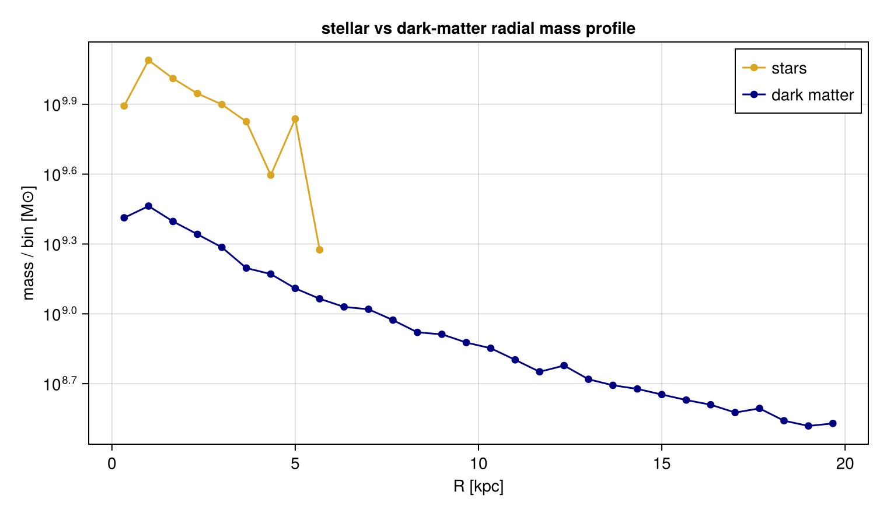
    


## 9. Profiles from a 2-D map — projected vs 3-D

`profile` also takes a **`projection` result**: bin the map pixels by image-plane radius `:r`
(a surface-brightness Σ(R)), by a coordinate `:x`/`:y`, or by **another map** (any map vs any map).
Weight by `:none`/`:area` or another map key (e.g. column density). A projected Σ(R) answers a
*different* question than a 3-D shell density (§3) — it integrates along the line of sight.


```julia
proj = projection(gas, [:sd, :vz], [:Msol_pc2, :km_s]; direction=:z, center=ctr, range_unit=:kpc,
                  pxsize=[0.2,:kpc], verbose=false, show_progress=false)
pSr = profile(proj, :sd;  xvar=:r, weight=:none, xunit=:kpc, nbins=30)             # Σ(R), source=:map
pVr = profile(proj, :vz;  xvar=:r, weight=:sd,   xunit=:kpc, nbins=30)             # column-weighted ⟨v_z⟩(R)
println("profile source = ", pSr.source)
fig = Figure(size=(1080,430))
ax1 = Axis(fig[1,1], yscale=log10, xlabel="R [kpc]", ylabel="Σ [M⊙/pc²]", title="surface density Σ(R) from the face-on map")
o=(pSr.median.>0); band!(ax1, pSr.x[o], max.(pSr.quantiles[o,1],1e-2), pSr.quantiles[o,3], color=(:teal,0.25), label="16–84%")
lines!(ax1, pSr.x[o], pSr.median[o], color=:teal, linewidth=2.5, label="median Σ"); axislegend(ax1, position=:rt)
ax2 = Axis(fig[1,2], xlabel="R [kpc]", ylabel="⟨v_z⟩ [km/s]", title="column-weighted ⟨v_z⟩(R)  (weight = :sd map)")
ov=isfinite.(pVr.mean); lines!(ax2, pVr.x[ov], pVr.mean[ov], color=:crimson, linewidth=2); fig
```

    profile source = map

    


    
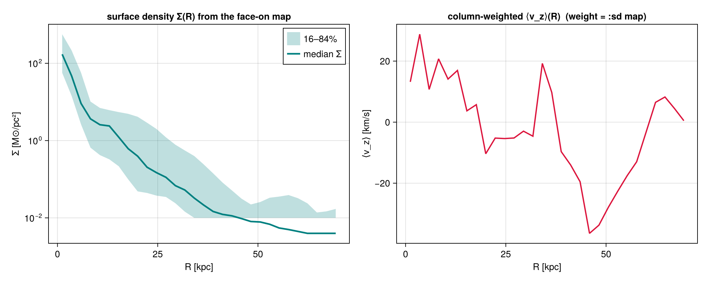
    


**The same works for off-axis maps.** Project **edge-on**, then profile the map: `:r` is measured
from the object centre even though the camera FOV isn't symmetric, so Σ(R) and the column-weighted
line-of-sight dispersion σ_los(R) come out correctly centred — the bridge from a mock image to a
radial profile (a face-on Σ(R) and an edge-on σ_los(R) are different physical projections).


```julia
pe = projection(gas, [:sd, :σlos], [:Msol_pc2, :km_s]; direction=:edgeon, center=ctr,
                range_unit=:kpc, pxsize=[0.2,:kpc], verbose=false, show_progress=false)
eS = profile(pe, :sd;   xvar=:r, weight=:none, xunit=:kpc, nbins=30)        # Σ(R), edge-on off-axis map
eD = profile(pe, :σlos; xvar=:r, weight=:sd,   xunit=:kpc, nbins=30)        # column-weighted σ_los(R)
fig = Figure(size=(1080,430))
ax1 = Axis(fig[1,1], yscale=log10, xlabel="R [kpc]", ylabel="Σ [M⊙/pc²]", title="edge-on Σ(R) from an OFF-AXIS map")
o=(eS.median.>0); lines!(ax1, eS.x[o], eS.median[o], color=:purple, linewidth=2.5)
ax2 = Axis(fig[1,2], xlabel="R [kpc]", ylabel="σ_los [km/s]", title="column-weighted σ_los(R)  (off-axis, weight=:sd)")
ov=isfinite.(eD.mean); lines!(ax2, eD.x[ov], eD.mean[ov], color=:darkorange, linewidth=2); fig
```


    
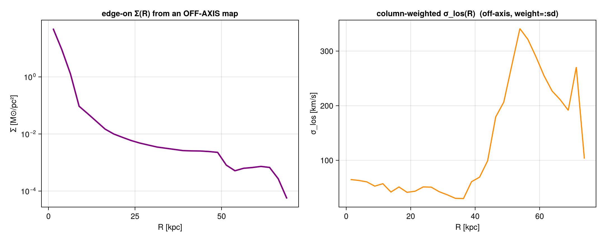
    


## 10. Phase diagrams — colour is a knob

`phase` is a 2-D weighted histogram of two fields — the classic mass-weighted **ρ–T** diagram. With
a third field `cvar` each cell is coloured by the per-cell weighted **mean**; `cstat` swaps that for
`:std`/`:median`/`:min`/`:max`/`:full` or a function. `normalize=:pdf` makes a 2-D PDF, and
`xedges`/`yedges` accept custom edges. Same ρ–T plane, four different colourings:


```julia
kw = (weight=:mass, nbins=(140,140), xscale=:log, yscale=:log, xunit=:nH, yunit=:K, center=ctr, range_unit=:kpc)
ph  = phase(gas, :rho, :T; kw...)
pcv = phase(gas, :rho, :T, :vϕ_cylinder; cstat=:mean, cunit=:km_s, kw...)
psd = phase(gas, :rho, :T, :vϕ_cylinder; cstat=:std,  cunit=:km_s, kw...)   # also :median/:min/:max/:full/callable
ppdf= phase(gas, :rho, :T; normalize=:pdf, kw...)
xc = log10.((ph.xedges[1:end-1].+ph.xedges[2:end])./2)
yc = log10.((ph.yedges[1:end-1].+ph.yedges[2:end])./2)
lg(M)=log10.(replace(M,0.0=>NaN)); fig=Figure(size=(1150,860))
for (k,(lab,M,cm,fn)) in enumerate((("mass (H)",ph.H,:magma,lg),("⟨v_ϕ⟩ [km/s]",pcv.mean,:balance,identity),
                                    ("σ(v_ϕ) [km/s]",psd.std,:viridis,identity),("PDF",ppdf.pdf,:magma,lg)))
    r=(k-1)÷2+1; c=2*((k-1)%2)+1
    ax=Axis(fig[r,c], xlabel="log₁₀ n_H [cm⁻³]", ylabel="log₁₀ T [K]", title=lab)
    A=fn(M); hm=heatmap!(ax, xc, yc, A, colormap=cm, nan_color=:black); Colorbar(fig[r,c+1], hm)
end
fig
```


    

    


## 11. 3-D profiles — `profile3d`

Bin by **three** fields at once: `H[i,j,k]` (a ρ–T–z mass cube). It generalizes `phase`, and
**marginalizing one axis reproduces the 2-D `phase`** exactly — a built-in consistency check
(`normalize=:pdf` is available too).


```julia
c3 = profile3d(gas, :rho, :T, :z; weight=:mass, nbins=(80,80,24), xscale=:log, yscale=:log,
               xunit=:nH, yunit=:K, center=ctr, range_unit=:kpc, zunit=:kpc)
ph2 = phase(gas, :rho, :T; weight=:mass, xedges=c3.xedges, yedges=c3.yedges, xunit=:nH, yunit=:K, center=ctr, range_unit=:kpc)
marg = dropdims(sum(c3.H, dims=3), dims=3)
println("max |marginal - phase| / max(phase) = ", maximum(abs.(marg .- ph2.H))/maximum(ph2.H))
xc = log10.((c3.xedges[1:end-1].+c3.xedges[2:end])./2)
yc = log10.((c3.yedges[1:end-1].+c3.yedges[2:end])./2)
lg(M)=log10.(replace(M,0.0=>NaN)); fv=filter(isfinite,lg(ph2.H)); cr=(minimum(fv), maximum(fv))
fig=Figure(size=(1100,440))
ax1=Axis(fig[1,1], xlabel="log₁₀ n_H", ylabel="log₁₀ T", title="profile3d cube, summed over z")
heatmap!(ax1, xc, yc, lg(marg), colormap=:magma, colorrange=cr, nan_color=:black)
ax2=Axis(fig[1,2], xlabel="log₁₀ n_H", ylabel="log₁₀ T", title="phase(:rho,:T)  — identical")
h=heatmap!(ax2, xc, yc, lg(ph2.H), colormap=:magma, colorrange=cr, nan_color=:black); Colorbar(fig[1,3],h,label="log₁₀ mass"); fig
```

    max |marginal - phase| / max(phase) = 3.7435778998461775e-17

    


    
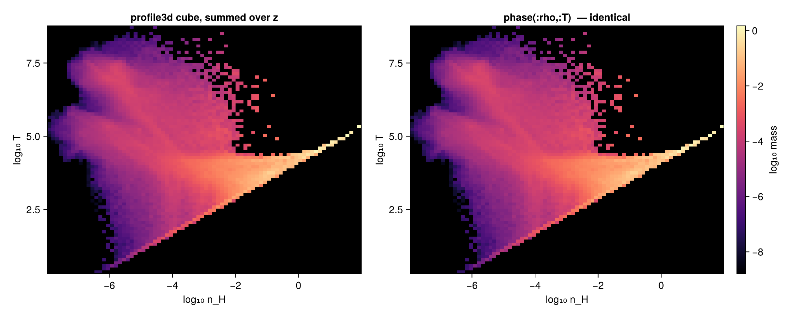
    


## 12. Profile evolution across snapshots — `profiletimeseries`

Stack a profile over many outputs into a **(nbins × n_snapshots)** matrix — a radius-vs-time map.
Give a loader `loadfn(output)->dataobject` and a **fixed radius axis** (`xrange`+`nbins` or `edges`)
so the columns align (otherwise it errors). Our galaxy is a single snapshot, so here we use a
**multi-snapshot run** to show the mechanics — the radial gas density over four outputs.


```julia
loadfn = out -> gethydro(getinfo(out, joinpath(BASE,"rt_stromgren"), verbose=false), verbose=false, show_progress=false)
ts = profiletimeseries(loadfn, 1:4, :r_sphere, :rho; field=:mean, time_unit=:Myr, weight=:mass, unit=:nH,
                       nbins=40, xrange=(0,0.5), center=[:bc], range_unit=:standard, xunit=:standard)
println("matrix ", size(ts.M), "  times[Myr]=", round.(ts.t, digits=3))
fig = Figure(size=(820,440)); ax = Axis(fig[1,1], xlabel="snapshot time [Myr]", ylabel="r [code]",
                                        title="radial ⟨n_H⟩(r, t) across snapshots  (profiletimeseries)")
hm = heatmap!(ax, ts.t, ts.x, log10.(replace(ts.M, 0.0=>NaN))', colormap=:thermal, nan_color=:black)
Colorbar(fig[1,2], hm, label="log₁₀ ⟨n_H⟩"); fig
```

      0.732503 seconds (11.29 M allocations: 713.552 MiB, 6.49% gc time, 44.21% compilation time)


      0.381988 seconds (9.45 M allocations: 626.368 MiB, 6.62% gc time)


      0.375587 seconds (9.45 M allocations: 626.368 MiB, 6.51% gc time)


      0.378610 seconds (9.45 M allocations: 626.368 MiB, 6.33% gc time)
    matrix 

    (40, 4)  times[Myr]=[0.0, 10.009, 20.018, 30.006]


    
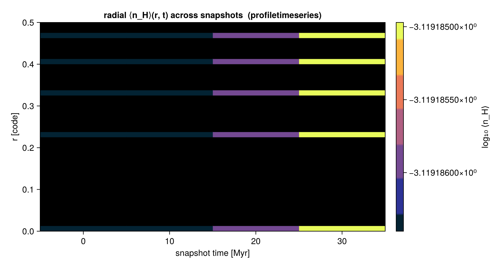
    


## 13. Distribution shape & uncertainties — moments, equal-count bins, bootstrap CIs

Three statistics upgrades, all opt-in and composable:

* **`skewness`** and (excess) **`kurtosis`** are always returned with a `yvar` — the asymmetry and
  tail-weight of each bin's distribution (a Gaussian gives both ≈ 0).
* **`scale=:equal`** places *quantile-spaced* edges so every bin holds about the same number of
  points — far steadier statistics where the disk thins out (vs fixed-width bins that empty out).
* **`bootstrap=N`** resamples each bin to add confidence intervals for the per-bin mean and median
  (`mean_ci`/`median_ci`, `nbins×2`) plus `median_se`; `ci=:percentile` (default), `:basic` or
  `:bca` (bias-corrected & accelerated). It is deterministic (seeded), so reruns match.


```julia
pe = profile(gas, :r_cylinder, :vz; weight=:mass, unit=:km_s, scale=:equal, nbins=18,
             center=ctr, range_unit=:kpc, xunit=:kpc, bootstrap=800, ci=:bca, confidence_level=0.95)
println("equal-count points/bin (min..max): ", extrema(pe.count), "  → nearly equal")
ok = pe.count .> 5
x = pe.x[ok]; mu = pe.mean[ok]; lo = pe.mean_ci[ok,1]; hi = pe.mean_ci[ok,2]
sk = pe.skewness[ok]; ku = pe.kurtosis[ok]
fig = Figure(size=(900,420))
ax1 = Axis(fig[1,1], xlabel="R [kpc]", ylabel="⟨v_z⟩ [km/s]", title="equal-count bins + BCa bootstrap 95% CI")
band!(ax1, x, lo, hi, color=(:dodgerblue,0.25), label="95% CI (bootstrap)")
lines!(ax1, x, mu, color=:dodgerblue, linewidth=2.5, label="⟨v_z⟩")
axislegend(ax1, position=:rt, framevisible=false)
ax2 = Axis(fig[1,2], xlabel="R [kpc]", ylabel="shape moment", title="shape of the v_z distribution per bin")
hlines!(ax2, [0.0], color=:gray, linestyle=:dash)
lines!(ax2, x, sk, color=:crimson, linewidth=2, label="skewness")
lines!(ax2, x, ku, color=:seagreen, linewidth=2, label="excess kurtosis")
axislegend(ax2, position=:rt, framevisible=false); fig
```

    equal-count points/bin (min..max): (

    32300, 33260)  → nearly equal


    
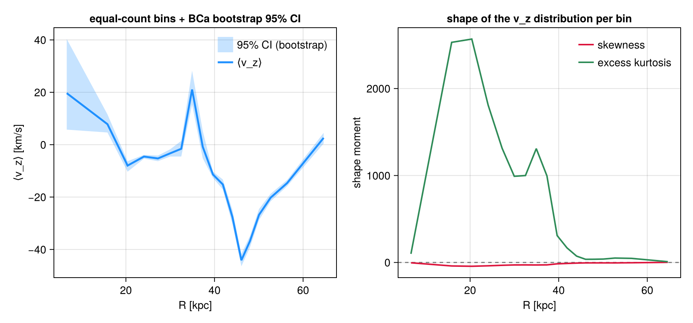
    


## Takeaway

Every feature above was **plotted**, not just described:

| feature | call | section |
|---|---|---|
| bin a quantity; log/custom `edges` | `profile(obj, x)` | §1 |
| per-bin mean/std/sem/quantiles/min/max/custom | `profile(obj, x, y; statistic=…)` | §2 |
| density / enclosed mass / fraction / pdf | `geometry`, `cumulative`, `normalize` | §3 |
| many fields in one pass | `profile(obj, x, [y1,y2])` → `.fields` | §4 |
| mass/volume/none/field weighting; components | `weight=…`, shared `edges` | §5 |
| rotation curve — gas (maskable) / stars / DM contributions to v_circ | `rotationcurve(obj; mask=…)` | §6 |
| velocity decomposition ⟨v_ϕ⟩/⟨v_r⟩ + σ_r/σ_ϕ/σ_z | `profile(obj, r, :vϕ_cylinder/:vr_cylinder/:vz)` | §7 |
| select particles by type/family/tag | `getparticlemask` | §8 |
| profile from a 2-D map (Σ(R), map-weighted) | `profile(m::DataMapsType, …)` | §9 |
| 2-D phase; colour by mean/std/…; PDF | `phase(obj, x, y[, c]; cstat, normalize)` | §10 |
| 3-D histogram; marginal == phase | `profile3d` | §11 |
| radius-vs-time evolution | `profiletimeseries` | §12 |
| distribution shape; equal-count bins; bootstrap CIs | `skewness`/`kurtosis`, `scale=:equal`, `bootstrap=N` | §13 |

Profiles & phase work on **gas, gravity, particles and projected maps** (`source=:data`
or `:map`). Everything here is regression-tested in the Mera test suite. For *line-of-sight*
distributions (per-pixel spectra, velocity cubes) see the [Off-axis Projection](06_offaxis_Projection.md) guide.
