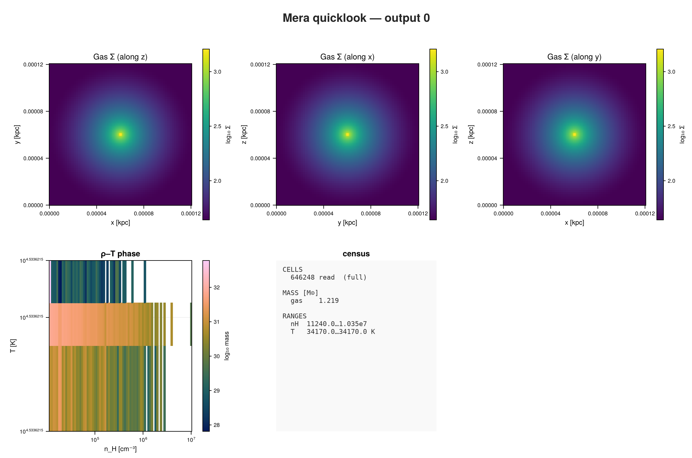
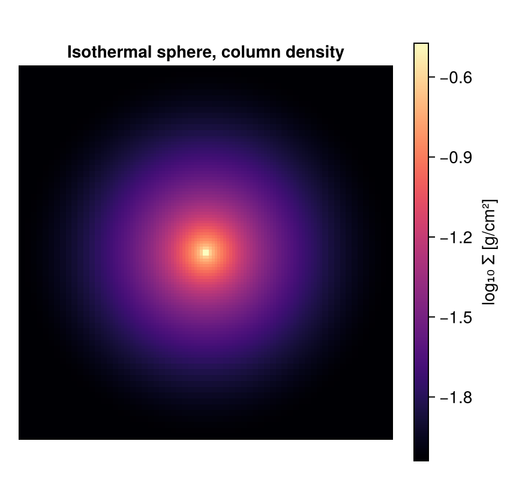

```@raw html
<!-- GENERATED FILE. Do not edit this markdown.
     Source notebook: 41_chombo_First_Inspection.ipynb
     Regenerate with: MERA_DIR=<repo checkout> ./render_docs.sh
     Any edit here is lost the next time the docs are rendered. -->
```

# Chombo (PLUTO-AMR): First Inspection

!!! tip "Run it yourself"
    This page is also an executable **Jupyter notebook**: [open / download `41_chombo_First_Inspection.ipynb`](https://github.com/ManuelBehrendt/Notebooks/blob/master/Mera-Docs/version_1.1/41_chombo_First_Inspection.ipynb). The notebooks run end-to-end and double as part of Mera's test suite.


Chombo is not a simulation code. It is an adaptive-mesh-refinement framework that supplies the
grid hierarchy and the HDF5 output several codes are built on, PLUTO's AMR mode among them. Mera
reads that layout, so a code writing Chombo output is readable whether or not Mera knows the code
itself.

The run here is a collapsing isothermal sphere: a dense core, refined where the gas is densest.

!!! note "You can download this snapshot"
    It is the `IsothermalSphere` sample from the yt project, so everything below is reproducible:

    ```bash
    curl -O https://yt-project.org/data/IsothermalSphere.tar.gz
    tar xzf IsothermalSphere.tar.gz
    ```

## 1. One call to see everything

`quicklook` reads the gas, projects it along each axis, builds a density-temperature diagram and
prints a summary. Unlike many formats, this one already stores its data in CGS, so there are no
unit constants to supply.

```julia
using Mera, CairoMakie

path = "/Volumes/FASTStorage/Simulations/Mera-Tests/CHOMBO/chombo_3d/IsothermalSphere"
ql = quicklook(0; path=path);
```

```
*__   __ _______ ______   _______
|  |_|  |       |    _ | |   _   |
|       |    ___|   | || |  |_|  |
|       |   |___|   |_||_|       |
|       |    ___|    __  |       |
| ||_|| |   |___|   |  | |   _   |
|_|   |_|_______|___|  |_|__| |__|
Mera v2.0.0-DEV | Julia 1.12.7 | 8 threads
[Mera]: quicklook output 0, reading gas: 2026-09-15T19:34:31.787
   1 CPU file(s), levels 5-7 of 7  (full resolution)
   projecting 3 gas map(s) [z, x, y] and the phase diagram from 646248 cells
┌─ Mera quicklook ── output 0 (CHOMBO) ───────────────
│ box        : 0.0001205 kpc      levels 5–7  (finest 0.0009413 pc)
│ grid       : ndim 3 · ncpu 1 · nvarh 6
│ time       : 0.0 Myr  (non-cosmological)
│ read       : 646248 cells  (full resolution)
│ gas mass   : 1.219 M⊙
│ nH range   : 11240.0 … 1.035e7 cm⁻³
│ T  range   : 34170.0 … 34170.0 K
└─ 7.29 s ──────────────────────────────────
[Mera]: quicklook output 0 finished: 2026-09-15T19:34:37.811
```

```julia
quicklookplot(ql)
```



A dense core in the middle of a small box. The numbers are physical straight away: about
1.2 solar masses inside 0.12 parsec.

## 2. The details: `getinfo`

```julia
info = getinfo(0, path);
```

```
Code: CHOMBO  (PLUTO-AMR / Orion format)
output: 0  time: 0.0 [code units]
AMR levels 5–7  boxlen = 3.71787206996e17
components: (density, X-momentum, Y-momentum, Z-momentum, X-magnfield, Y-magnfield, Z-magnfield, energy-density, gravitational-potential)
variables: (rho, vx, vy, vz, p, gpot)
-------------------------------------------------------
[Mera]: composition not recorded by this format; using X = 0.76, mu = 1.32 (RAMSES convention) for :nH and :T. Change with setcomposition!(info; X_frac=…, mu=…).
```

```julia
info.simcode, info.levelmin, info.levelmax, info.variable_list
```

```
("CHOMBO", 5, 7, [:rho, :vx, :vy, :vz, :p, :gpot])
```

Note the level range. This is a **refined** grid, not a uniform one, so cells exist at more than
one resolution. The box itself is small:

```julia
info.boxlen * info.scale.pc        # box size in parsec
```

```
0.12048802805955357
```

## 3. What else could be loaded?

```julia
capabilities(info)
```

```
2-element Vector{Symbol}:
 :info
 :hydro
```

Chombo files carry gas. This particular run also stored the gravitational potential, which shows
up as an ordinary variable rather than a separate data type.

## 4. Load the gas

```julia
gas = gethydro(info);
```

```
[Mera]: CHOMBO AMR → 646248 leaf cells, levels 5–7, vars rho, vx, vy, vz, p, gpot
```

## 5. What the data looks like

One table, one row per cell.

```julia
gas.data
```

```
Table with 646248 rows, 10 columns:
Columns:
#   colname  type
────────────────────
1   level    Int32
2   cx       Int32
3   cy       Int32
4   cz       Int32
5   rho      Float64
6   vx       Float64
7   vy       Float64
8   vz       Float64
9   p        Float64
10  gpot     Float64
```

Compared with a uniform grid there is one extra column: **`level`**. Each cell records which
refinement level it belongs to, and its position and size follow from that:

```
cell centre = (c - 0.5) * boxlen / 2^level
cell size   =             boxlen / 2^level
```

So the table holds cells of different sizes side by side, with no resampling onto a common grid.

```julia
amroverview(gas)
```

```
Counting...
```

```
Table with 3 rows, 3 columns:
level  cells   cellsize
─────────────────────────
5      0       1.16184e16
6      207272  5.80918e15
7      438976  2.90459e15
```

`amroverview` is the quickest way to see the refinement: how many cells sit at each level and
how big they are. Level 5 is the base grid and holds nothing here, because every one of its
cells was refined away. The finer cells are exactly half the size of the coarser ones, and most
of the data sits at the finest level, which is where the collapsing core is.

## 6. Physical quantities

Ask for anything by name, in any unit.

```julia
msum(gas, :Msol)                    # total gas mass
```

```
1.2192374338591871
```

```julia
extrema(getvar(gas, :rho, :nH))     # hydrogen number density, cm^-3
```

```
(11244.756676104671, 1.0351161344590483e7)
```

`:nH` converts a mass density to a hydrogen number density, which needs the hydrogen **mass
fraction**. No simulation format records it, so Mera starts from the RAMSES value, X = 0.76. If
your run assumes something else, say so once and everything downstream follows:

```julia
setcomposition!(info; X_frac=0.711, mu=0.614)   # for example, PLUTO defaults
```

The temperature here is flat, 25970 K per unit μ in every cell, because this is an *isothermal*
sphere. That is also why the phase diagram above is a single line rather than a cloud: the setup
fixes the temperature, so there is no thermal structure to show.

```julia
extrema(getvar(gas, :gpot))         # the stored gravitational potential
```

```
(-1.5574393185966113e9, -177954.43640389142)
```

## 7. A projection

Column density along z. Mera projects the refined cells directly: a cell contributes to the map
over the area it actually covers, so nothing is resampled onto a coarse grid first.

```julia
proj = projection(gas, :sd, :g_cm2, direction=:z);
size(proj.maps[:sd])
```

```
[Mera]: 2026-09-15T19:34:57.003
domain:
xmin::xmax: 0.0 :: 1.0  	==> 0.0 [mpc] :: 120.488 [mpc]
ymin::ymax: 0.0 :: 1.0  	==> 0.0 [mpc] :: 120.488 [mpc]
zmin::zmax: 0.0 :: 1.0  	==> 0.0 [mpc] :: 120.488 [mpc]
Selected var(s)=(:sd,)
Weighting      = :mass
Effective resolution: 128^2
Map size: 128 x 128
Pixel size: 0.941 [mpc]
Simulation min.: 0.941 [mpc]
Available threads: 8
Requested max_threads: 8
Variables: 1 (sd)
Processing mode: Sequential (single thread)
```

```
(128, 128)
```

```julia
fig = Figure(size=(430, 400))
ax  = Axis(fig[1,1]; title="Isothermal sphere, column density", aspect=DataAspect())
hidedecorations!(ax)
hm = heatmap!(ax, log10.(proj.maps[:sd]'); colormap=:magma)
Colorbar(fig[1,2], hm, label="log₁₀ Σ [g/cm²]")
fig
```



## Where to go next

The same five calls as on any other code: `quicklook`, `getinfo`, `gethydro`, `getvar`,
`projection`. The only thing that changed is that the cells come at more than one size, and
nothing downstream had to be told.

From here every tutorial on this site applies unchanged: sub-regions, profiles, phase diagrams,
movies and off-axis projections all work on this table.
