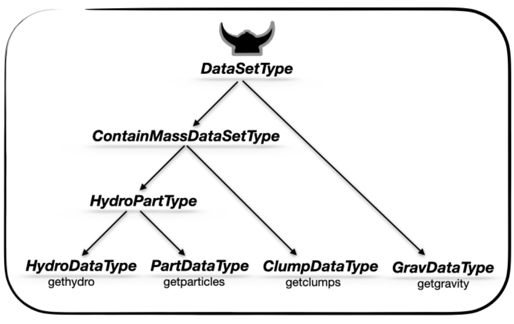

*MERA.jl's comprehensive API for high-performance astrophysical data analysis and computational workflows*

## Types
#### Abstract type hierarchies



- HydroMapsType <: DataMapsType
- PartMapsType  <: DataMapsType

#### List of types
```@index
Modules = [Mera]
Order = [:type]
```

## Functions
```@index
Modules = [Mera]
Order = [:function]
```

## Macros
```@autodocs
Modules = [Mera]
Order = [:macro]
```

## Documentation Types
```@autodocs
  Modules = [Mera]
  Order = [:type]
```

```@docs
Mera.MaskType
```

## Documentation Functions
```@autodocs
  Modules = [Mera]
  Order = [:function]
```
