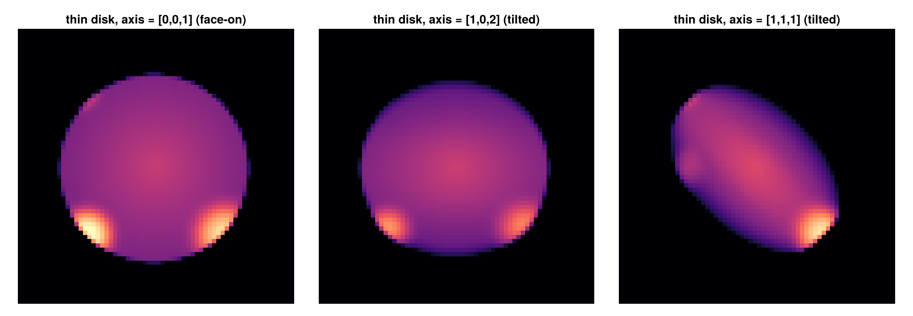
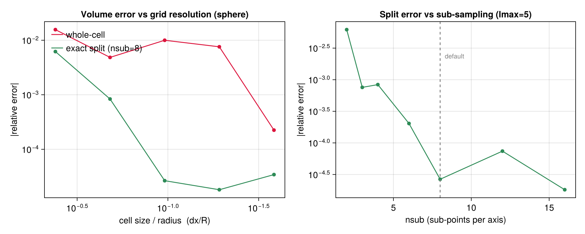
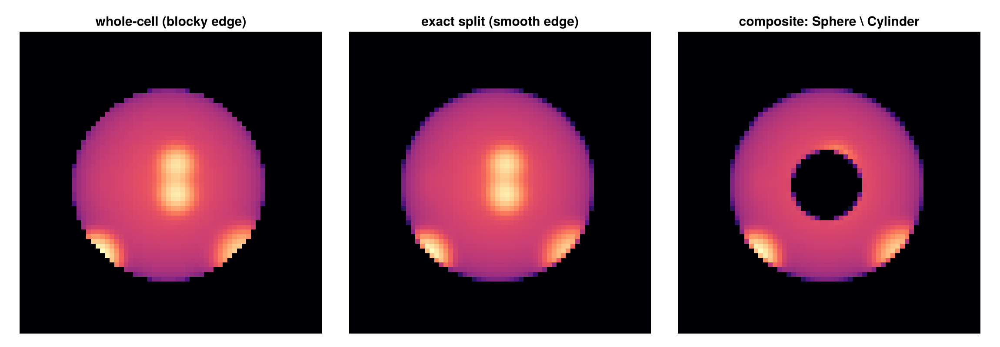

# Subregions API Reference

Functions for defining and working with spatial subregions using different geometric shapes.

## Exported Functions

### Main Subregion Functions
- [`subregion`](@ref) - Unified interface for all geometric subregions
- [`shellregion`](@ref) - Unified interface for all shell (hollow) regions

## Supported Geometric Shapes

### Cuboid/Box Regions
- **Usage**: `subregion(data, :cuboid, ...)`
- **Shape**: Box/rectangular regions defined by x, y, z ranges
- **Parameters**: `xrange`, `yrange`, `zrange`, `center`

### Cylindrical Regions  
- **Solid**: `subregion(data, :cylinder, ...)`
- **Shell**: `shellregion(data, :cylinder, ...)`
- **Shape**: Cylinder defined by radius and height
- **Parameters**: `radius`, `height`, `center`, `direction` (:x, :y, :z)

### Spherical Regions
- **Solid**: `subregion(data, :sphere, ...)`
- **Shell**: `shellregion(data, :sphere, ...)`
- **Shape**: Sphere defined by radius
- **Parameters**: `radius`, `center`
- **Shell Parameters**: `radius=[inner, outer]` for hollow shells

## Usage Examples

### Solid Regions
```julia
# Cuboid selection
subregion(data, :cuboid, xrange=[0.3, 0.7], yrange=[0.3, 0.7])

# Cylindrical selection  
subregion(data, :cylinder, radius=10., height=5., center=[24,24,24], range_unit=:kpc)

# Spherical selection
subregion(data, :sphere, radius=15., center=[24,24,24], range_unit=:kpc)
```

### Shell Regions
```julia
# Cylindrical shell (annular cylinder)
shellregion(data, :cylinder, radius=[5., 10.], height=2., range_unit=:kpc)

# Spherical shell (hollow sphere)
shellregion(data, :sphere, radius=[8., 12.], range_unit=:kpc)
```

## Coordinate Systems & Parameters

### Common Parameters
- **`center`**: Spatial center coordinates `[x, y, z]`
- **`range_unit`**: Units for spatial parameters (`:kpc`, `:pc`, `:Mpc`, `:standard`)
- **`inverse`**: Select region outside the specified geometry
- **`verbose`**: Control output verbosity

### Cuboid Parameters
- **`xrange`**, **`yrange`**, **`zrange`**: `[min, max]` ranges for each axis

### Cylindrical Parameters  
- **`radius`**: Cylinder radius (solid) or `[inner, outer]` (shell)
- **`height`**: Cylinder height (total height is 2×height)
- **`direction`**: Cylinder axis direction (`:x`, `:y`, `:z`)

### Spherical Parameters
- **`radius`**: Sphere radius (solid) or `[inner, outer]` (shell)

## Composable regions with exact cell splitting

Alongside the symbol API (`subregion(data, :sphere; …)`), `subregion` accepts a **region value
type** ([`Sphere`](@ref), [`Cuboid`](@ref), [`Cylinder`](@ref), [`SphericalShell`](@ref), [`CylindricalShell`](@ref)). With
`split=true` (the default for this form), cells straddling the region boundary are **clipped
exactly**: each kept cell carries a `:fraction ∈ (0,1]` equal to the volume fraction inside the
region, and [`getvar`](@ref)`(:mass)` / `(:volume)` / [`msum`](@ref) report the **exact in-region
totals** — a sphere of radius `R` returns `(4/3)πR³`, with no boundary over- or under-counting.

```julia
gas_in = subregion(gas, Sphere(20.0; center=[:bc], range_unit=:kpc))   # split=true
msum(gas_in, :Msol)        # exact enclosed mass (boundary cells weighted by their inside-fraction)

subregion(gas, Cuboid(xrange=[-10,10], yrange=[-10,10], zrange=[-2,2], range_unit=:kpc))
subregion(gas, SphericalShell(10.0, 20.0; range_unit=:kpc))
subregion(gas, CylindricalShell(3.0, 8.0, 4.0; range_unit=:kpc))   # value-type analogue of shellregion(:cylinder)
subregion(gas, Cylinder(15.0, 3.0; range_unit=:kpc); split=false)      # classic whole-cell selection
```

`split=false` reproduces the classic centre-inside, whole-cell selection (no `:fraction`).
`inverse=true` selects the complement. The region types ([`AbstractRegion`](@ref),
[`Sphere`](@ref), [`Cuboid`](@ref), [`Cylinder`](@ref), [`SphericalShell`](@ref)) are listed in
the [API reference](../api.md#Types).

The value-type form works on **all data types**: hydro, gravity and RT (AMR cells, with exact
volume splitting and a `:fraction` column), and particles — where it is a point-membership test
(particles are points, so `split`/`nsub` do not apply and no `:fraction` is attached).

```julia
subregion(particles, Sphere(20.0; range_unit=:kpc))                    # stars/DM inside a ball
subregion(particles, Sphere(20.0; range_unit=:kpc) \ Cylinder(5.0, 30.0; range_unit=:kpc))
subregion(gravity,   Sphere(20.0; range_unit=:kpc))                    # exact-split gravity cells
```

### Boolean combinations

Regions compose with the operators `∩` (intersection), `∪` (union), `\` (difference) and `!`
(complement) — each result is itself a region, so they nest. The children may even have
different centres.

```julia
subregion(gas, Sphere(20.0; range_unit=:kpc) \ Cylinder(5.0, 30.0; range_unit=:kpc))  # ball, cylinder drilled out
subregion(gas, Sphere(20.0; range_unit=:kpc) ∩ Cuboid(xrange=[-10,10], yrange=[-10,10], zrange=[-3,3], range_unit=:kpc))
subregion(gas, !Sphere(20.0; range_unit=:kpc))                                        # everything outside the ball
```

### Tilted cylinders / disks (arbitrary axis)

`Cylinder` takes an `axis` (any non-zero 3-vector, normalised internally) — its symmetry
direction — so you can select an inclined disk or cylinder, e.g. along a galaxy's spin vector.
The default `[0,0,1]` is the classic z-aligned cylinder; the volume is invariant under the
orientation. A thin cylinder is a disk:

```julia
subregion(gas, Cylinder(15.0, 1.0; axis=[1,0,2], range_unit=:kpc))      # a thin disk tilted in the x–z plane
subregion(gas, Cylinder(15.0, 5.0; axis=spin, range_unit=:kpc))         # cylinder along an arbitrary spin vector
```



*The same thin disk projected along z for three `axis` directions — face-on (a circle) and two
tilts (foreshortened ellipses).*

### Accuracy of the splitting

Exact splitting is dramatically more accurate than whole-cell selection, and converges with grid
resolution. For a sphere, the whole-cell volume error stays at the ~0.5–1.5 % level and is erratic
(it is a step function of which cell centres fall inside), while exact splitting (default
`nsub=8`) is 10–100× smaller and falls smoothly as the cells shrink:



`nsub` (per-axis sub-sampling of boundary cells, default `8`) trades cost for accuracy; the error
floor past `nsub≈8` is set by the grid resolution, not the sampling (right panel). Only boundary
cells are ever sub-sampled — interior/exterior cells are an O(1) corner test — so the cost is
modest. Cuboids are split analytically (exact, no sampling). The figure is reproduced by
`test/55_region_algebra_tests.jl` (a CI convergence test) and `docs/make_region_figures.jl`.

### Projections of split regions

The `:fraction` carries through to [`projection`](@ref) automatically: projection takes its mass
weight from `getvar(:mass)`, which honours `:fraction`, so a projection of a split subregion is
**exactly region-clipped** — boundary cells are dimmed by their inside-fraction (a smooth,
anti-aliased edge instead of a blocky one), and a `:sd` map integrates to the exact enclosed mass.

```julia
ball = subregion(gas, Sphere(20.0; range_unit=:kpc))                                  # split=true
projection(ball, :sd, :Msol_pc2; res=512)                                             # exact clipped Σ-map
projection(subregion(gas, Sphere(20.0; range_unit=:kpc) \ Cylinder(5.0, 40.0; range_unit=:kpc)), :sd, :Msol_pc2)
```



*Left → right: a sphere selected with whole cells (blocky edge), the same sphere with exact
splitting (smooth edge), and a composite `Sphere \ Cylinder` (a ball with a cylindrical hole).*

## Additional Analysis Functions

- [`getextent`](@ref) - Get spatial extent information  
- [`center_of_mass`](@ref) / [`com`](@ref) - Calculate center of mass
- [`getpositions`](@ref) - Extract position data
- [`getvelocities`](@ref) - Extract velocity data

## Data Type Support

All subregion functions support multiple data types through Julia's multiple dispatch:
- **HydroDataType**: Gas/fluid data with AMR support
- **PartDataType**: Particle/stellar data  
- **ClumpDataType**: Halo/clump data
- **GravDataType**: Gravitational field data

---
*For complete function documentation, see the [Complete API Reference](../api.md).*
