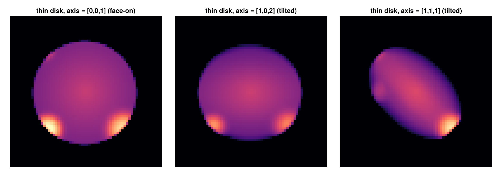
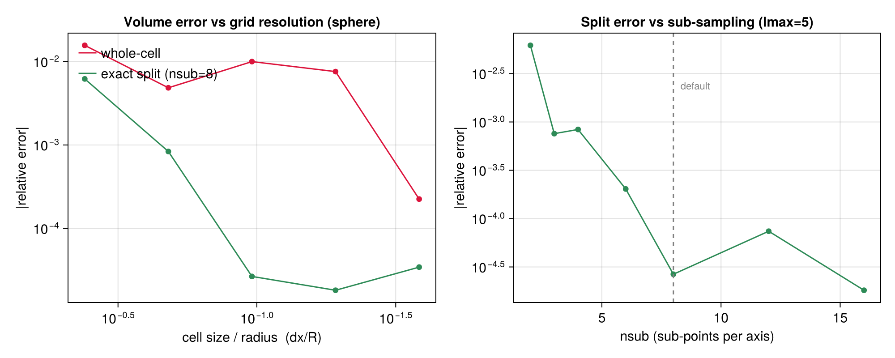
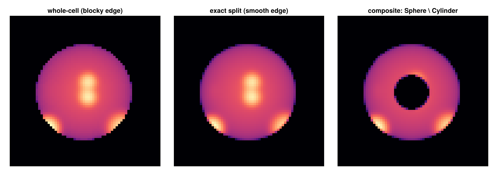

# Subregions API Reference

Functions for defining and working with spatial subregions using different geometric shapes.

## Which data types

Both functions dispatch on `DataSetType`, so they work on **every** data type Mera loads, not only
the four with tutorial pages. The tutorials cover hydro, gravity, particles and clumps; RT and
sinks are not written up but are supported by the same code.

| data type | `subregion` | `shellregion` | `cell=` | `:fraction` |
|---|---|---|---|---|
| hydro | yes | yes | yes | yes |
| gravity | yes | yes | yes | yes |
| RT | yes | yes | yes | yes |
| particles | yes | yes | ignored (points) | no |
| clumps | yes | yes | ignored (points) | no |
| sinks | yes | yes | ignored (points) | no |

`cell=` decides whether a cell on the border is included whole or by its centre, so it is
meaningful only for AMR cell data. Particles, clumps and sinks are points: they are in or out, and
the keyword is accepted and ignored.

`:fraction` is the better answer for cell data: the region value form,
`subregion(gas, Sphere(10.))`, gives each border cell the part of it that lies inside. The shape
symbols shown here (`:sphere`, `:cylinder`, `:cuboid`) keep the whole-or-nothing rule. See
**What the fraction is applied to** below.

### What the fraction is applied to

Only quantities that measure **how much** there is in a cell are scaled by the fraction: mass,
volume, and the energies built from them. A quantity that describes what the gas is *like* keeps
its value, because that value is the same whichever part of the cell you keep. Density,
temperature, potential and field strength are all of this second kind.

Everything follows from `:volume`. Hydro also scales `:mass`, because it is the only cell type
that carries a density. Magnetic energy is `0.5·B²·V`, so it is scaled through the volume, while
`:bmag` itself is not. RT has nothing to scale: `:Np_total`, `:rad_energy_density` and
`:photoionizations` are all per unit volume already. For an RT total, multiply by the volume
yourself and the fraction comes with it:

```julia
s = subregion(rt, Sphere(10.))
total_photons = sum(getvar(s, :Np_total) .* getvar(s, :volume))
```

!!! tip "Gravity energies: cut the hydro object the same way"
    `:gravitational_energy`, `:total_binding_energy` and `:Fg` are each a mass multiplied by a
    field quantity, the potential or the acceleration. Gravity carries no density, so the mass comes
    from the hydro object you pass in, and the fraction that matters is therefore the **hydro**
    object's. Cut both with the same region:

    ```julia
    R  = Sphere(10.)
    gs = subregion(grav, R)
    hs = subregion(gas,  R)        # same region, so the same boundary cells
    sum(getvar(gs, hs, :total_binding_energy))
    ```

    Mera refuses a hydro object that was cut a different way, or not cut at all. It compares the
    cell indices of both objects, not only how many there are, so a different cut is refused even
    when it holds the same number of cells. The error names what to fix.

!!! warning "Regions do not wrap at periodic boundaries"
    Neither function applies the minimum-image convention. A sphere or shell centred near a box
    face is clipped at the boundary rather than wrapped, silently: you get a partial region and a
    total that looks plausible. `getvar`'s `:r_sphere_periodic` / `:r_cylinder_periodic` exist for
    exactly this case on the quantity side, but there is no periodic region selector. On a run
    where the object of interest straddles a face, select by periodic radius instead.

## Exported Functions

### Main Subregion Functions
- [`subregion`](@ref): Unified interface for all geometric subregions
- [`shellregion`](@ref): Unified interface for all shell (hollow) regions

## Supported Geometric Shapes

### Cuboid/Box Regions
- **Usage**: `subregion(data, :cuboid, ...)`
- **Shape**: Box/rectangular regions defined by x, y, z ranges
- **Parameters**: `xrange`, `yrange`, `zrange`, `center`

### Cylindrical Regions  
- **Solid**: `subregion(data, :cylinder, ...)`
- **Shell**: `shellregion(data, :cylinder, ...)`
- **Shape**: Cylinder defined by radius and height
- **Parameters**: `radius`, `height`, `center`, `direction` (:x, :y, :z)

### Spherical Regions
- **Solid**: `subregion(data, :sphere, ...)`
- **Shell**: `shellregion(data, :sphere, ...)`
- **Shape**: Sphere defined by radius
- **Parameters**: `radius`, `center`
- **Shell Parameters**: `radius=[inner, outer]` for hollow shells

## Usage Examples

### Solid Regions
```julia
# Cuboid selection
subregion(data, :cuboid, xrange=[0.3, 0.7], yrange=[0.3, 0.7])

# Cylindrical selection  
subregion(data, :cylinder, radius=10., height=5., center=[24,24,24], range_unit=:kpc)

# Spherical selection
subregion(data, :sphere, radius=15., center=[24,24,24], range_unit=:kpc)
```

### Shell Regions
```julia
# Cylindrical shell (annular cylinder)
shellregion(data, :cylinder, radius=[5., 10.], height=2., range_unit=:kpc)

# Spherical shell (hollow sphere)
shellregion(data, :sphere, radius=[8., 12.], range_unit=:kpc)
```

## Coordinate Systems & Parameters

### Common Parameters
- **`center`**: Spatial center coordinates `[x, y, z]`
- **`range_unit`**: Units for spatial parameters (`:kpc`, `:pc`, `:Mpc`, `:standard`)
- **`inverse`**: Select region outside the specified geometry
- **`verbose`**: Control output verbosity

### Cuboid Parameters
- **`xrange`**, **`yrange`**, **`zrange`**: `[min, max]` ranges for each axis

### Cylindrical Parameters  
- **`radius`**: Cylinder radius (solid) or `[inner, outer]` (shell)
- **`height`**: Cylinder height (total height is 2×height)
- **`direction`**: Cylinder axis direction (`:x`, `:y`, `:z`)

### Spherical Parameters
- **`radius`**: Sphere radius (solid) or `[inner, outer]` (shell)

## Composable regions with exact cell splitting

*Reference for the value-type API. For the same material derived step by step on real data,
one sphere measured three ways, the mass ledger, and how exact "exact" is, see
[Get Subregions](../03_hydro_Get_Subregions.md).*

Alongside the symbol API (`subregion(data, :sphere; …)`), `subregion` accepts a **region value
type** ([`Sphere`](@ref), [`Cuboid`](@ref), [`Cylinder`](@ref), [`SphericalShell`](@ref), [`CylindricalShell`](@ref)). With
`split=true` (the default for this form), cells straddling the region boundary are **clipped
exactly**: each kept cell carries a `:fraction ∈ (0,1]` equal to the volume fraction inside the
region, and [`getvar`](@ref)`(:mass)` / `(:volume)` / [`msum`](@ref) report the **exact in-region
totals**, a sphere of radius `R` returns `(4/3)πR³`, with no boundary over- or under-counting.

```julia
gas_in = subregion(gas, Sphere(20.0; center=[:bc], range_unit=:kpc))   # split=true
msum(gas_in, :Msol)        # exact enclosed mass (boundary cells weighted by their inside-fraction)

subregion(gas, Cuboid(xrange=[-10,10], yrange=[-10,10], zrange=[-2,2], range_unit=:kpc))
subregion(gas, SphericalShell(10.0, 20.0; range_unit=:kpc))
subregion(gas, CylindricalShell(3.0, 8.0, 4.0; range_unit=:kpc))   # value-type analogue of shellregion(:cylinder)
subregion(gas, Cylinder(15.0, 3.0; range_unit=:kpc); split=false)      # classic whole-cell selection
```

`split=false` reproduces the classic centre-inside, whole-cell selection (no `:fraction`).
`inverse=true` selects the complement. The region types ([`AbstractRegion`](@ref),
[`Sphere`](@ref), [`Cuboid`](@ref), [`Cylinder`](@ref), [`SphericalShell`](@ref)) are listed in
the [API reference](../api.md#Types).

The value-type form works on **all data types**: hydro, gravity and RT (AMR cells, with exact
volume splitting and a `:fraction` column), and particles, where it is a point-membership test
(particles are points, so `split`/`nsub` do not apply and no `:fraction` is attached).

```julia
subregion(particles, Sphere(20.0; range_unit=:kpc))                    # stars/DM inside a ball
subregion(particles, Sphere(20.0; range_unit=:kpc) \ Cylinder(5.0, 30.0; range_unit=:kpc))
subregion(gravity,   Sphere(20.0; range_unit=:kpc))                    # exact-split gravity cells
```

### Boolean combinations

Regions compose with the operators `∩` (intersection), `∪` (union), `\` (difference) and `!`
(complement), each result is itself a region, so they nest. The children may even have
different centres.

```julia
subregion(gas, Sphere(20.0; range_unit=:kpc) \ Cylinder(5.0, 30.0; range_unit=:kpc))  # ball, cylinder drilled out
subregion(gas, Sphere(20.0; range_unit=:kpc) ∩ Cuboid(xrange=[-10,10], yrange=[-10,10], zrange=[-3,3], range_unit=:kpc))
subregion(gas, !Sphere(20.0; range_unit=:kpc))                                        # everything outside the ball
```

### Tilted cylinders, disks and shells (arbitrary axis)

`Cylinder` **and `CylindricalShell`** take an `axis`, their symmetry direction, so you can select
an inclined disk, cylinder or annulus. The default `[0,0,1]` is the classic z-aligned case, and the
volume does not depend on the orientation.

`axis` is **any non-zero 3-vector giving a direction in the simulation's own x, y, z frame**. Three
things do not matter, so you rarely have to tidy a vector before passing it:

- **Its length.** It is normalised internally, so `[0,0,1]` and `[0,0,7.3]` select the same cells.
- **Its sign.** It marks an axis, not a way up, so `[0,0,1]` and `[0,0,-1]` are the same region.
- **Its element type.** `[1,0,2]` and `[1.0,0.0,2.0]` behave identically.

It carries no units, because it is a direction: `range_unit` applies to the radius and height, never
to `axis`. Anything that yields a 3-vector will do, a hand-written direction, an eigenvector, a
field direction, or a measured angular momentum. A thin cylinder is a disk:

```julia
subregion(gas, Cylinder(15.0, 1.0; axis=[1,0,2], range_unit=:kpc))   # a thin disk, tilted in the x-z plane

# A disk aligned with the galaxy's own spin. `face_on` measures the angular momentum
# for you, and `.angmom` is the vector to hand to `axis`.
spin = face_on(gas).angmom
subregion(gas, Cylinder(15.0, 1.0; axis=spin, center=[:bc], range_unit=:kpc))
```



*The same thin disk projected along z for three `axis` directions, face-on (a circle) and two
tilts (foreshortened ellipses).*

A shell tilts the same way, which is what you want for an annulus in the plane of an inclined disk:

```julia
subregion(gas, CylindricalShell(5.0, 10.0, 4.0; axis=spin, center=[:bc], range_unit=:kpc))
```

Two shapes need no `axis`. `Sphere` and `SphericalShell` are the same in every orientation, so
tilting them would change nothing. `Cuboid` is **axis-aligned only**: its faces are always parallel
to the box axes. That is deliberate rather than an oversight, because an axis-aligned box is the one
shape whose inside-fraction is computed analytically, exact to machine precision, rather than by
sampling. For a tilted slab use a thin `Cylinder`, which gives the same selection with an
orientation.

### Accuracy of the splitting

Exact splitting is dramatically more accurate than whole-cell selection, and converges with grid
resolution. For a sphere, the whole-cell volume error stays at the ~0.5 to 1.5 % level and is erratic
(it is a step function of which cell centres fall inside), while exact splitting (default
`nsub=8`) is 10 to 100× smaller and falls smoothly as the cells shrink:



`nsub` (per-axis sub-sampling of boundary cells, default `8`) trades cost for accuracy; the error
floor past `nsub≈8` is set by the grid resolution, not the sampling (right panel). Only boundary
cells are ever sub-sampled, interior/exterior cells are an O(1) corner test, so the cost is
modest. Cuboids are split analytically (exact, no sampling). The figure is reproduced by
`test/55_region_algebra_tests.jl` (a CI convergence test) and `docs/make_region_figures.jl`.

### Projections of split regions

The `:fraction` carries through to [`projection`](@ref) automatically: projection takes its mass
weight from `getvar(:mass)`, which honours `:fraction`, so a projection of a split subregion is
**exactly region-clipped**: boundary cells are dimmed by their inside-fraction (a smooth,
anti-aliased edge instead of a blocky one), and a `:sd` map integrates to the exact enclosed mass.

```julia
ball = subregion(gas, Sphere(20.0; range_unit=:kpc))                                  # split=true
projection(ball, :sd, :Msol_pc2; pxsize=[100., :pc])                                  # exact clipped Σ-map
projection(subregion(gas, Sphere(20.0; range_unit=:kpc) \ Cylinder(5.0, 40.0; range_unit=:kpc)), :sd, :Msol_pc2)
```



*Left → right: a sphere selected with whole cells (blocky edge), the same sphere with exact
splitting (smooth edge), and a composite `Sphere \ Cylinder` (a ball with a cylindrical hole).*

## Additional Analysis Functions

- [`getextent`](@ref): Get spatial extent information  
- [`center_of_mass`](@ref) / [`com`](@ref): Calculate center of mass
- [`getpositions`](@ref): Extract position data
- [`getvelocities`](@ref): Extract velocity data

## Data Type Support

All subregion functions support multiple data types through Julia's multiple dispatch:
- **HydroDataType**: Gas/fluid data with AMR support
- **PartDataType**: Particle/stellar data  
- **ClumpDataType**: Halo/clump data
- **GravDataType**: Gravitational field data

---
*For complete function documentation: see the [Complete API Reference](../api.md).*

## Function Reference

```@docs
subregion
shellregion
@region
```
