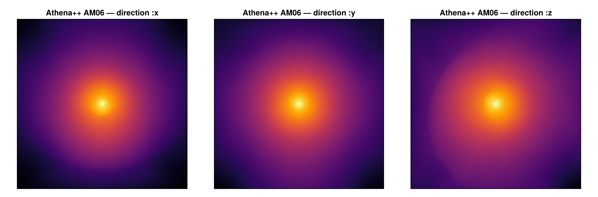
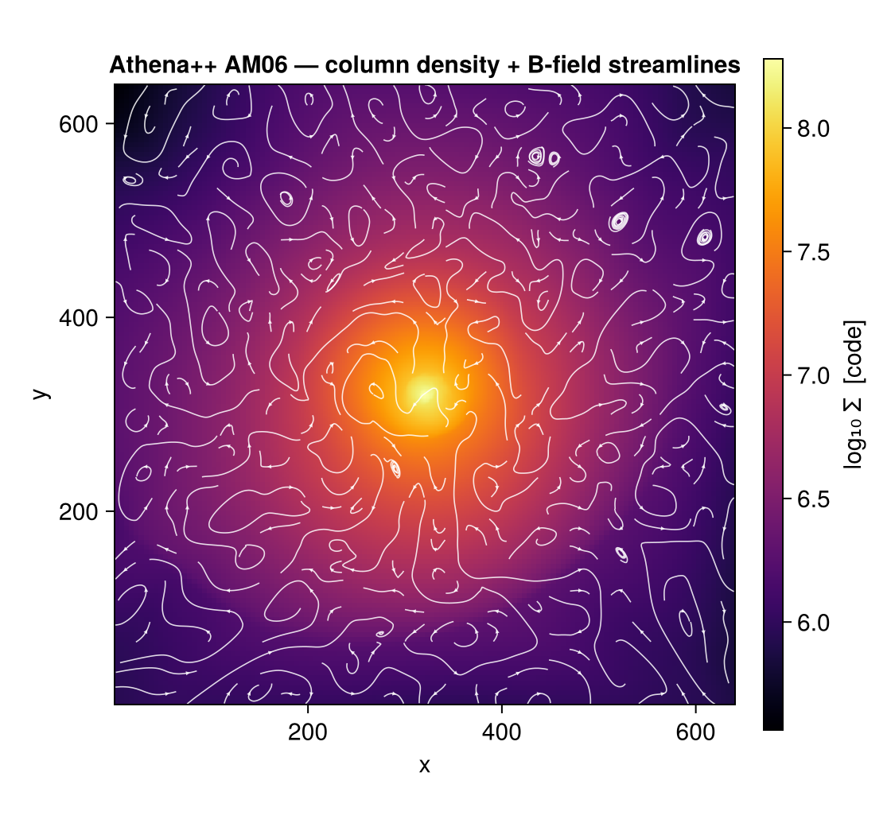
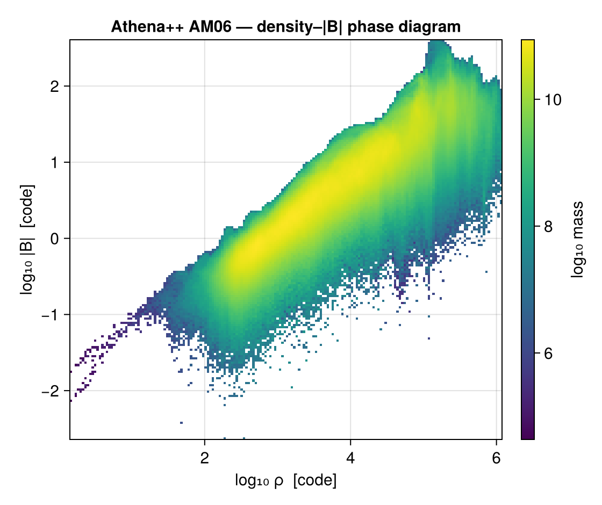
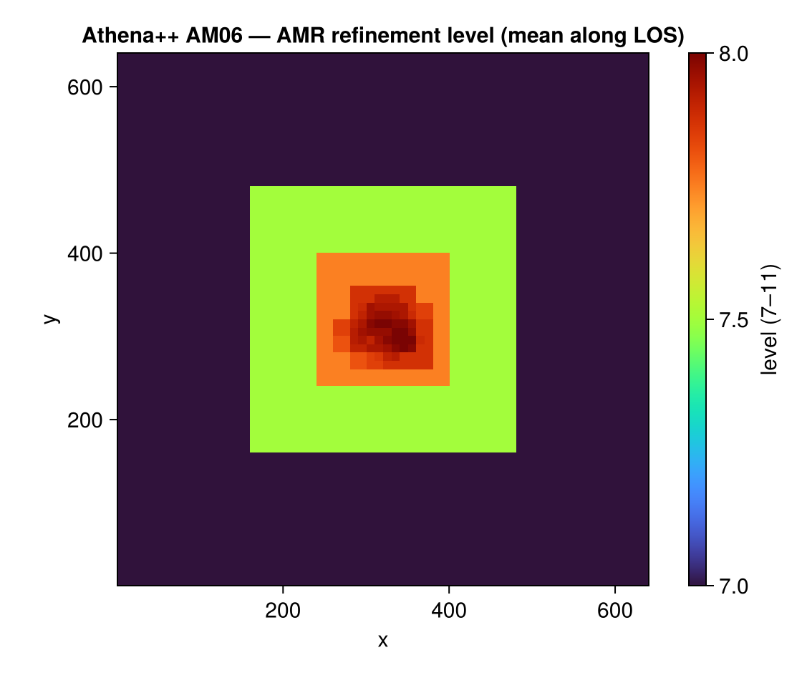

# Reading Athena++ data (experimental)

Mera's analysis layer is **code-blind**: it works on a generic uniform/AMR cell list, not on
RAMSES file formats. This page adds a **frontend for the [Athena++ code](https://www.athena-astro.app)**
that reads an Athena++ HDF5 snapshot (`.athdf`) into the same Mera structs — so [`getvar`](@ref),
[`projection`](@ref), [`subregion`](@ref), [`filterdata`](@ref), [`pdf`](@ref), [`clumpfind`](@ref)
and the rest run on Athena++ data unchanged.

!!! note "Scope"
    3-D Cartesian, hydro and cell-centred MHD fields. **AMR is supported** — each Athena++
    MeshBlock carries a level and a logical location, which map onto Mera's `level`/`cx,cy,cz`
    convention. The root grid must be a power of two per axis. Athena++ data are in **code
    units**; supply the run's CGS units for physical conversions (see below).

## Usage

The normal [`getinfo`](@ref) / [`gethydro`](@ref) entry points **auto-detect** Athena++ from the
`.athdf` file — nothing special to call:

```julia
using Mera
info = getinfo(5, "/path/to/athena/run")     # finds run/*.00005.athdf, simcode = "Athena++"
gas  = gethydro(info)                         # a HydroDataType in Mera's cell convention

# now the whole analysis layer works unchanged:
projection(gas, :sd, :Msol_pc2)
filterdata(gas, Above(:rho, 100, unit=:nH))
clumpfind(gas, ThresholdFoF(:rho; threshold=1e2, threshold_unit=:nH, linking_length=0.2))
```

You can also call the frontend explicitly with [`getinfo_athena`](@ref) / [`gethydro_athena`](@ref)
(e.g. to pass a direct `.athdf` path).

### Loading a spatial sub-region

`gethydro` honours the RAMSES **spatial-window** arguments `xrange`/`yrange`/`zrange` (with
`center` and `range_unit`), so you load only the part of the box you need:

```julia
# central 10 % box, fractions of the box relative to its centre
gas = gethydro(info; xrange=[-0.05, 0.05], yrange=[-0.05, 0.05], zrange=[-0.05, 0.05],
               center=[:bc], range_unit=:standard)
# or a physical window once units are set (see "Units" below)
gas = gethydro(info; xrange=[-200, 200], center=[:bc], range_unit=:pc)
```

This is the leaf-cell analogue of Athena++'s **own** reader and of yt — the upstream tools Mera's
selection mirrors (and is validated against), see [Reference readers](#Reference-readers) below.
Because Mera keeps the **leaf cells** (each point covered by exactly one cell at its finest level),
a spatial window is an *exact, hole-free* filter; the returned object records it in `gas.ranges`.
Resolution/level is chosen later at analysis time (`projection(…, res=)`), not at load — a level
cap would leave gaps, since no coarse data sits under a leaf.

!!! note "What is available per data type"
    Data is loaded per type, exactly as for RAMSES — but only what the code wrote exists: an
    Athena++ snapshot is **hydro + cell-centred MHD only** (no gravity/particles), so you call
    [`gethydro`](@ref) and there is nothing for `getgravity`/`getparticles` to read.

## Worked example: the yt AM06 sample

A good way to see the frontend on real data is the **AM06** snapshot from the
[yt sample-data collection](https://yt-project.org/data/) — a Cartesian **AMR MHD** run
(`128³` root grid + 4 refinement levels, 3424 MeshBlocks of `16³` = 14,024,704 cells, with both a
`prim` and a `B` dataset). `getinfo` auto-detects it from the `.athdf` file and prints the overview:

```julia
julia> info = getinfo(400, "/data/athena_AM06/AM06");

Code: Athena++
output: 400  time: 4000.0 [code units]
root grid: 128³ (level 7), MaxLevel 4 ⇒ levels 7:11, boxlen = 4000.0
MeshBlocks: 3424   variables: (rho, p, vx, vy, vz, bx, by, bz)
-------------------------------------------------------
```

The AMR hierarchy lands in `levelmin:levelmax = 7:11`, and the MHD fields appear as
`:bx,:by,:bz` alongside `:rho,:p,:vx,:vy,:vz`. Loading and projecting is then the ordinary
Mera workflow — here the log column density along each axis:

```julia
gas = gethydro(info)                              # 14,024,704 cells, in Mera's cell convention
projection(gas, :sd, res=512, center=[:bc], direction=:z)   # column density, face-on
```



### MHD analysis

Because the `B`-dataset is read into `:bx,:by,:bz`, the full magnetic [`getvar`](@ref) set
(`:bmag`, `:pmag`, `:beta`, `:v_alfven`, `:mach_alfven`/`:mach_fast`/`:mach_slow`) and vector
projections work on Athena++ data too.

**Magnetic-field streamlines** over the column density come from a vector projection of the
in-plane field. Note this is the **mass-weighted** field, so the streamlines trace field
*morphology*, not a flux-rigorous line integral (a small box-car smoother tidies the turbulent
field into clean lines):

!!! details "Show the CairoMakie code"
    ```julia
    using CairoMakie

    # separable box-car smoother (the projected field maps are dense, no NaN)
    function smooth2d(A, w)
        n1, n2 = size(A); tmp = similar(A); B = similar(A)
        for j in 1:n2, i in 1:n1
            s = 0.0; c = 0
            for di in -w:w; ii = i+di; (1<=ii<=n1) && (s += A[ii,j]; c += 1); end
            tmp[i,j] = s/c
        end
        for j in 1:n2, i in 1:n1
            s = 0.0; c = 0
            for dj in -w:w; jj = j+dj; (1<=jj<=n2) && (s += tmp[i,jj]; c += 1); end
            B[i,j] = s/c
        end
        return B
    end

    res = 640
    p  = projection(gas, [:sd, :bx, :by], res=res, center=[:bc], direction=:z)
    Σ  = p.maps[:sd]
    Bx = smooth2d(p.maps[:bx], 4);  By = smooth2d(p.maps[:by], 4)

    fig = Figure(size=(560, 520))
    ax  = Axis(fig[1,1]; title="AM06 — column density + B-field streamlines",
               xlabel="x", ylabel="y", aspect=DataAspect())
    hm  = heatmap!(ax, 1..res, 1..res, log10.(Σ .+ 1e-30); colormap=:inferno)
    # streamplot wants a function (x,y) → vector; index the (smoothed) field maps
    bfield(q) = (i = clamp(round(Int, q[1]), 1, res); j = clamp(round(Int, q[2]), 1, res); Point2f(Bx[i,j], By[i,j]))
    streamplot!(ax, bfield, 1..res, 1..res; colormap=[(:white, 0.85)], gridsize=(30,30),
                arrow_size=3.5, linewidth=0.8, density=1.6, stepsize=1.0, maxsteps=900)
    Colorbar(fig[1,2], hm, label="log₁₀ Σ  [code]")
    save("am06_bstream.png", fig, px_per_unit=2)
    ```



A **density–|B| phase diagram** is just `getvar` on the loaded cells plus a mass-weighted 2-D
histogram — and it recovers the expected flux-freezing scaling (|B| ∝ ρ^~2/3) across ~6 decades in
density, a real physics result extracted entirely through Mera's code-blind analysis layer:

!!! details "Show the CairoMakie code"
    ```julia
    ρ, B, m = getvar(gas, :rho), getvar(gas, :bmag), getvar(gas, :mass)   # code units
    lx, ly  = log10.(ρ), log10.(B .+ 1e-30); nb = 180
    xr = range(extrema(lx)...; length=nb+1);  yr = range(extrema(ly)...; length=nb+1)
    H  = zeros(nb, nb)
    for k in eachindex(lx)                       # mass-weighted 2-D histogram
        i = searchsortedlast(xr, lx[k]); j = searchsortedlast(yr, ly[k])
        (1 <= i <= nb && 1 <= j <= nb) && (H[i,j] += m[k])
    end
    H[H .== 0] .= NaN
    mids(r) = (r[1:end-1] .+ r[2:end]) ./ 2

    fig = Figure(size=(560, 470))
    ax  = Axis(fig[1,1]; title="AM06 — density–|B| phase diagram",
               xlabel="log₁₀ ρ  [code]", ylabel="log₁₀ |B|  [code]")
    hb  = heatmap!(ax, mids(xr), mids(yr), log10.(H); colormap=:viridis)
    Colorbar(fig[1,2], hb, label="log₁₀ mass")
    save("am06_phase.png", fig, px_per_unit=2)
    ```



### AMR refinement map

The cell `:level` is a projectable quantity, so a **volume-weighted mean level along the line of
sight** maps where the grid refines — for AM06 it draws the nested MeshBlock hierarchy as
concentric squares tightening onto the dense core (levels 7 → 11):

!!! details "Show the CairoMakie code"
    ```julia
    m = projection(gas, :level, res=512, center=[:bc], direction=:z, weighting=[:volume]).maps[:level]

    fig = Figure(size=(560, 470))
    ax  = Axis(fig[1,1]; title="AM06 — AMR refinement level (mean along LOS)",
               xlabel="x", ylabel="y", aspect=DataAspect())
    hm  = heatmap!(ax, m; colormap=:turbo)
    Colorbar(fig[1,2], hm, label="level (7–11)")
    save("am06_levels.png", fig, px_per_unit=2)
    ```



All figures on this page are regenerated from the fixture by `docs/make_reader_figures.jl`.

## Units

Athena++ writes data in code units and does not store CGS scale factors, so by default the run is
treated as dimensionless (`unit_* = 1`). Pass the run's CGS `unit_length` / `unit_density` /
`unit_velocity` for a dimensional run and every `getvar`/`projection` unit conversion becomes
physical:

```julia
# e.g. UNIT_LENGTH = 1 kpc, UNIT_DENSITY = m_p, UNIT_VELOCITY = 1 km/s
info = getinfo_athena(5, "/path/to/run"; unit_length=3.086e21, unit_density=1.67e-24, unit_velocity=1e5)
getvar(gethydro(info), :x, :kpc)              # now physically correct
```

## Variable names

Athena++ `VariableNames` are mapped to Mera's canonical symbols: `rho→:rho`, `press→:p`,
`vel1/2/3→:vx/:vy/:vz`, `Bcc1/2/3→:bx/:by/:bz` (and the conserved-variable names `dens`, `mom1…`,
`Etot`). Unmapped names pass through as-is.

## How it maps onto Mera's grid

The one thing that must be exactly right is the cell-coordinate encoding. A MeshBlock at Athena
level `L` with logical location `(l1,l2,l3)` and block size `(nx1,nx2,nx3)` contributes cells with

```
level = log2(RootGridSize) + L
cx    = l1·nx1 + a            # a = 1…nx1, 1-based index on the level-L cell lattice
```

(and likewise `cy`, `cz`) — the same 1-based level-lattice indexing the RAMSES/PLUTO readers use,
so off-axis projections, profiles, subregions and movies are all correct. This contract is
verified data-free in `test/57_athena_reader_tests.jl`, which synthesises tiny `.athdf` files and
checks that a value written at a known cell reads back at the right `(:level,:cx,:cy,:cz)`.

## Reference readers

This frontend is built to agree with — and is validated against — Athena++'s **own** tooling and
the wider community readers, which are the *origin* of the `.athdf` format and its selection
semantics:

- **`athena_read.py`** — the official reader shipped with Athena++ (`athena/vis/python/athena_read.py`),
  whose `athdf()` function reads a snapshot and supports a spatial window (`x1_min`/`x1_max`/…) and a
  level argument. Mera's load-time `xrange`/`yrange`/`zrange` is the leaf-cell analogue of that
  window. See the [Athena++ wiki](https://github.com/PrincetonUniversity/athena/wiki).
- **[yt](https://yt-project.org)** — its `athena_pp` frontend reads `.athdf` lazily through *data
  objects* (`ds.box`, `ds.sphere`, `ds.r[...]`), touching only the MeshBlocks a region intersects.
  Mera's spatial selection mirrors that region-selector behaviour on the leaf-cell list. The AM06
  sample used above comes from the [yt sample-data collection](https://yt-project.org/data/).

Athena++ data are dimensionless (code units) and carry no CGS factors, exactly as both readers
above assume — supply the run's units explicitly (see [Units](#Units)).
