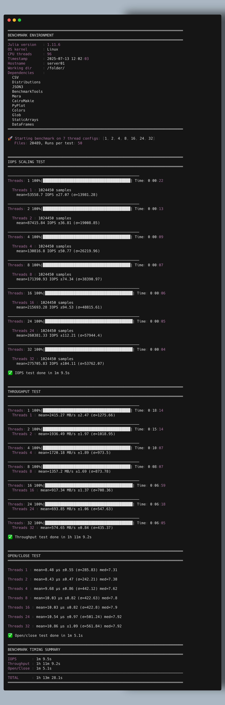
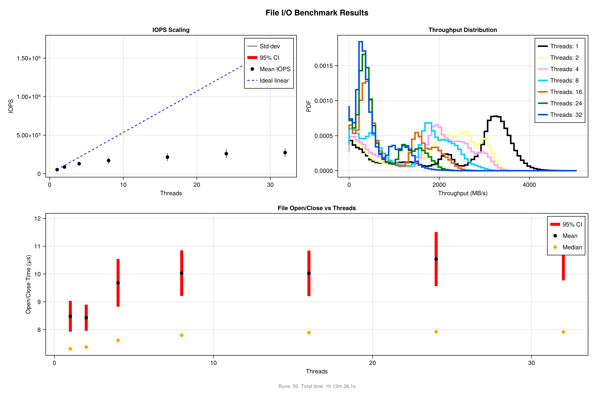
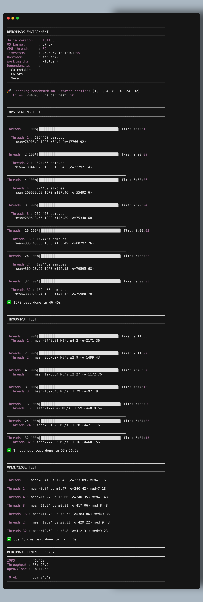
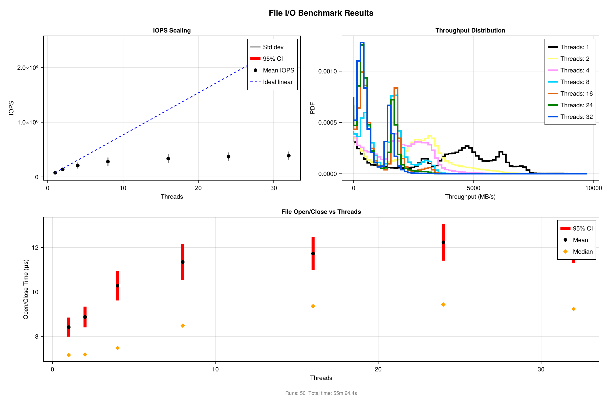

# Diagnosing Server File I/O Performance with MERA: 
*Understanding Natural Scalability Limits and Optimal Operating Points*

## Why Perform These Tests?

Server file I/O performance problems create cascading effects throughout your system: MERA programs process data more slowly, other users experience delays, and routine operations like file access and data persistence become inefficient. These benchmark tests help you identify optimal settings before performance issues impact production work, preventing scenarios where excessive thread usage creates bottlenecks rather than benefits.

## What These Tests Help You Determine


These diagnostic tests help you **find the right number of threads for reading files efficiently** before wasting system resources. The combined testing approach effectively identifies:

- **The optimal number of parallel tasks** that gives you the best performance without wasting computer resources
- **Storage limits** where adding more parallel tasks stops improving performance
- **Best performance settings** tailored to your specific storage type (traditional drives, SSDs, NVMe storage)

These tests work best for **applications that spend most of their time waiting for data** (like reading files from storage) rather than doing intensive calculations. When programs wait for storage operations, you can safely use **many more parallel processes** than the standard guideline of matching the number of processor cores. **However, these tests excel at finding the right number of threads to use efficiently without covering every aspect of storage performance.**


## Core Diagnostic Framework

These three tests work together to provide comprehensive insights for thread optimization:

### IOPS Test Under Concurrency

When MERA spawns multiple threads to read files in parallel, each thread executes its open→read→close sequence. If your storage system can only handle a limited number of these operations per second, threads will wait for storage instead of doing productive work. This test measures the maximum "file operations per second" your system supports, showing you how many threads you can run before overwhelming file opening and metadata operations.

### Sustained Throughput (MB/s) Test

Beyond counting operations, you need to understand how much data flows when multiple threads stream file contents simultaneously. High aggregate data rates indicate threads can work together without overwhelming your storage bandwidth. Sharp drops in throughput as you add threads reveal when your storage interface (disk connection or network filesystem) becomes the limiting factor rather than thread management overhead.

### Latency Variability Measurement

Even when your system shows good average performance, individual file operations can take very different amounts of time. When running multiple threads together, some finish their work quickly while others get delayed. The slowest threads hold up everything else when your program needs all threads to finish before moving forward.

By measuring not just the average time but also how much the timing varies (like checking the slowest 5% of operations), you can see how these timing inconsistencies will slow down your overall program.


## Understanding Normal Performance Patterns

Performance changes in multi-threaded file operations are both normal and expected. Multi-threaded workloads typically show diminishing returns due to fundamental storage system and filesystem limitations.

As thread count increases, performance naturally deviates from perfect scaling because:

- **Resource competition intensifies** - threads compete for shared filesystem locks, metadata structures, and disk scheduling queues

- **Context switching overhead** becomes significant when too many threads compete for limited system resources

- **Storage system saturation** occurs when thread count exceeds your storage hardware's parallel processing capabilities


## Identifying System Characteristics Through Thread Scaling

The progression from single-thread to multi-thread performance reveals distinct operational patterns that guide optimal thread selection:

- **Single-thread baseline** - shows how fast your system performs when only one task runs at a time

- **Optimal parallel performance** - finds the best number of simultaneous tasks where you get maximum speed without wasting resources

- **Too many threads breakdown** - shows when running too many tasks at once actually slows everything down


## Performance Distribution Analysis

Multi-modal throughput distributions provide powerful diagnostic insights. When benchmarks produce histograms with multiple distinct peaks, each peak represents a different operational state where specific bottlenecks dominate system behavior.

The typical three-peak pattern reveals:

- **Peak 1 (highest throughput)** - optimal sequential performance without thread interference effects
- **Peak 2 (moderate throughput)** - effective parallel operation at the identified concurrency sweet spot
- **Peak 3 (near-zero throughput)** - competition-induced performance collapse where additional threads become counterproductive

This distribution analysis directly maps to thread count optimization, helping identify the precise point where adding more threads transitions from beneficial parallelism to harmful resource competition.


## Benchmarking Framework and Examples

**Tip:** After running your tests, create a subfolder named with today's date (e.g., `benchmarks_20250726/`) and copy all generated result files (plots, CSVs, JSON, etc.) into it. To ensure full reproducibility, also copy the execution scripts (such as `run_test.jl`—downloadable as part of a zip file from GitHub—and the plotting routines, e.g., `io_performance_plots.jl`, which can also be downloaded from the repository), as well as any shell scripts and your `Project.toml` and `Manifest.toml` files into this folder. This preserves your results and the exact environment used for later reference.

### Basic Usage Example

```
cmd-line % julia +1.11 -t 32 run_test.jl
```
### Script:
```julia
# Load the benchmark framework
using Mera, CairoMakie, Colors # need to be installed by user

# Download the plotting routine at:
# https://github.com/ManuelBehrendt/Mera.jl/blob/master/src/benchmarks/IOperformance_viz.jl
include("IOperformance_viz.jl")


# Run comprehensive I/O diagnostics on your data directory (function included in Mera)
# Note: The many files in your provided folder are used for the benchmark
# Increase number of runs (repeated tests) for more robust statistics
results = run_benchmark(
            "/path/to/your/_data_folder/output_00250/"; 
            runs=50)

# Generate visualization suite
fig = plot_results(results)

# Save results for documentation
save("server_io_analysis.png", fig)
save("server_io_analysis.pdf", fig)
# display(fig) # display figure if you are, e.g. in a Jupyter notebook or on your laptop
```


### Server Examples

#### Server 1





#### Server 2





## Interpreting the Visualizations

### IOPS Scaling Chart (Left Panel)

**What to look for:**

- **Ideal performance line**: Shows what perfect performance would look like if adding threads always helped

- **Your actual performance curve**: Shows how your real system behaves and where it starts struggling

- **Performance plateau or drop**: The point where adding more threads stops helping or makes things slower

**What this tells you:** This chart shows when your storage system gets overwhelmed by too many parallel file operations.

### Throughput Distribution (Right Panel, Top)

**What to look for:**

- **Multiple peaks in the chart**: Different performance patterns your system shows

- **Width of each peak**: Shows how consistent (narrow) or variable (wide) your performance is

- **Position of peaks**: Shows the different speed levels your system operates at

**What the patterns mean:**

- **Single dominant peak**: Your system performs consistently across different thread counts

- **Two distinct peaks**: Clear transition between different operating modes

- **Three peaks pattern**: Shows your optimal single-thread speed, best parallel performance, and performance breakdown when overloaded

**What this tells you:** These patterns reveal the different "operating modes" of your storage system and help identify optimal thread count ranges.

### Open/Close Timing (Bottom Panel)

**What to look for:**

- **Error bars**: Show how much timing varies between individual file operations. Larger bars mean less predictable performance

- **Timing patterns as threads increase**: Shows whether file operations stay consistent or become more unpredictable with more parallel tasks

- **Overall trend**: Look for steady increases, sudden jumps, or leveling off

**What the patterns mean:**

- **Rising timing with more threads**: File system competition increases as threads compete for the same resources like locks and disk access

- **Rapidly expanding error bars**: Your system is reaching limits where thread competition creates unpredictable timing, making some operations much slower than others

**What this tells you:** Even when average performance looks acceptable, individual file operations can vary dramatically in timing. When running multiple threads together, the slowest operations hold up everything else if your program needs all threads to finish before proceeding.

**Practical guidance:** If you see large error bars or rapidly increasing timing variability at higher thread counts, it indicates you're approaching the point where additional threads become counterproductive for overall system performance.
