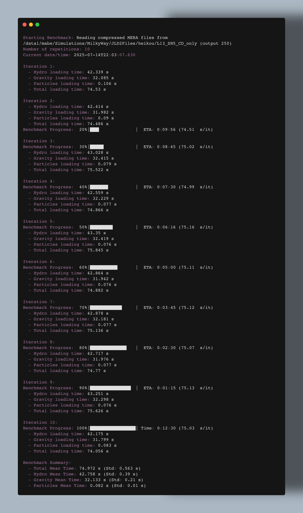

# Benchmark: Single-Threaded Reading Performance of Compressed MERA Files

This guide shows how to benchmark the reading speed of compressed MERA files using Mera.jl in single-threaded mode. On large-scale simulation data, reading a single MERA file is often several times faster than reading the original RAMSES files—even when the latter uses multi-threading. MERA files also provide significant disk space savings, freeing up resources for more simulations.


## Overview

Mera.jl enables efficient reading of RAMSES simulation files, which are often compressed to reduce storage requirements. This test benchmarks the reading of hydro, particle, and gravity components from a specified output, measuring timings and reporting average speeds.


## Prerequisites

Before running the test, ensure you have:

- **Julia** ≥ 1.10 (recommended)
- **Mera.jl** installed in your Julia environment
- **MERA files**: Access to compressed simulation outputs (e.g., `output_00250.jld2`)
- **Hardware**: Sufficient memory and storage (decompression may require extra RAM)


### Installation

Activate your Julia environment and install Mera.jl:

```julia
using Pkg
Pkg.activate(".")
Pkg.add("Mera")
```


## Example Benchmark Script: `runt_test.jl`

The following Julia script performs the single-threaded reading test. It loads simulation metadata, reads each component once, measures the time taken, and calculates reading speed in MB/s based on approximate file sizes.

down load file at... github
run in command line run_test.jl script in single threaded mode with your desired julia version


### Saving Output for Later Analysis

To save the screen output of your benchmark run for later review, pipe the output to a file in your benchmark folder. For example, on macOS or Linux:

If you use [juliaup](https://github.com/JuliaLang/juliaup) to manage Julia versions, you can specify the Julia version for the run. For example, to use Julia 1.10:

```bash
julia +1.11 -t 1 run_test.jl | tee benchmarks/benchmark_$(date +%Y-%m-%d).log
```

This will run the script with Julia 1.10 (or your chosen version), using a single thread, and store the output in a file named with today's date (e.g., `benchmark_2025-07-26.log`) inside the `benchmarks` folder. Adjust the folder name and Julia version as needed.


### Key Script Components

- **Metadata Loading**: Uses `infodata` to retrieve simulation details without verbose output.
- **Component Reading**: Calls `loaddata` for `:hydro`, `:particles`, and `:gravity` in sequence, timing each operation.
- **Speed Calculation**: Computes MB/s based on estimated file sizes.
- **Output**: Prints timings and speeds for each component, plus a total summary.


## Running the Test & Example Output

Run the script as described above. The output will look similar to:



---

## Interpreting the Results

In typical tests, parallel reading of the same data from RAMSES files (using multi-threading) may require much longer (e.g., >> 260 sec), while reading a compressed MERA file with a single thread can take as little as ~75 sec. This demonstrates the efficiency and speedup provided by the Mera format. Compare your results to multithreaded RAMSES reading to quantify your own gains.


## Comparative Analysis: Mera vs. RAMSES File Reading

### Speedup Comparison Example

Below is a template for comparing the reading speed of Mera files (single-threaded) to RAMSES files (even when using multi-threading):

| Simulation Name | File Type      | Threads Used | Read Time (s) | Speedup vs. RAMSES |
|-----------------|---------------|--------------|---------------|--------------------|
| ExampleSim      | RAMSES        | 16           | 260           | 1.0x (baseline)    |
| ExampleSim      | Mera (JLD2)   | 1            | 75            | 3.5x               |

**How to use:**
- Replace `ExampleSim` with your simulation name.
- Fill in the actual read times for both RAMSES and Mera files.
- Calculate speedup as `(RAMSES time) / (Mera time)`.

> **Interpretation:**
> In this example, reading the compressed Mera file with a single thread is 3.5 times faster than reading the original RAMSES files with 16 threads.

---

### Storage Reduction Example

Below is a template for showing the storage savings achieved by using compressed Mera files:

| Simulation Name | RAMSES File Size (GB) | Mera File Size (GB) | Reduction (%) |
|-----------------|----------------------|---------------------|---------------|
| ExampleSim      | 120                  | 32                  | 73%           |

**How to use:**
- Replace `ExampleSim` with your simulation name.
- Fill in the total size of the RAMSES and Mera files for the same output.
- Calculate reduction as `100 * (1 - (Mera size / RAMSES size))`.

> **Interpretation:**
> In this example, using compressed Mera files reduces storage requirements by 73% compared to the original RAMSES files.

