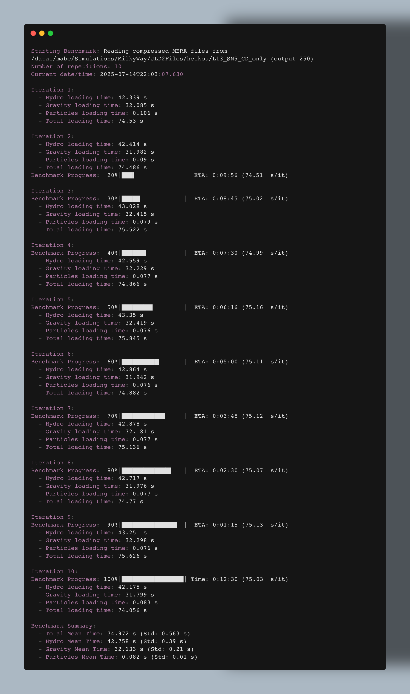
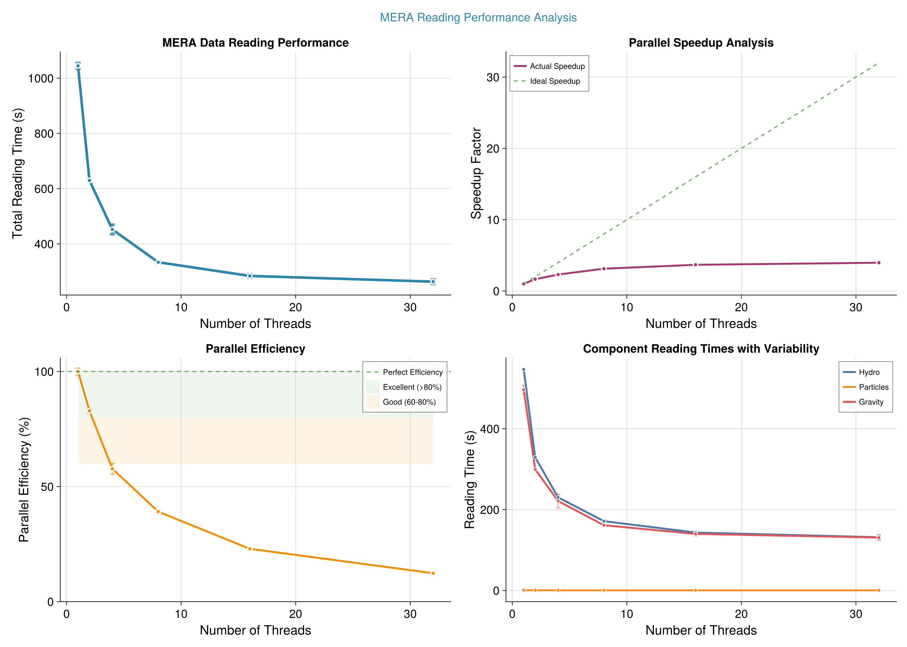

# Benchmark: Single-Threaded Reading Performance of Compressed MERA Files

This guide shows how to benchmark the reading speed of compressed MERA files using Mera.jl, and explains when the MERA format is fastest.

**Two effects, with different generality:**

- **Storage savings are universal.** A compressed MERA file is several times smaller than the original RAMSES output (measured: **~78% smaller / ~4.5× on a typical output**, see below), regardless of hardware.
- **Read-speed gains depend on the storage backend.** The MERA advantage scales with *file-open latency × number of files*. A RAMSES output is split into many files per component (one per CPU domain — often hundreds to thousands), so on **servers with networked or parallel filesystems (Lustre/GPFS/NFS) or slow disks**, opening all those small files dominates the cost and reading a single compressed MERA file is markedly faster — even versus multi-threaded RAMSES reading (see the [Server IO](../IO/IOperformance.md) and [Parallel RAMSES reading](../RAMSES_reading/ramses_reading.md) benchmarks). On a **fast local SSD/NVMe**, per-file open latency is negligible, so RAMSES reading is already fast and MERA reading is comparable (the JLD2 decompression cost roughly offsets the fewer-files benefit). Benchmark on *your* target storage to know which regime you are in.


## Overview

Mera.jl enables efficient reading of RAMSES simulation files, which are often compressed to reduce storage requirements. This test benchmarks the reading of hydro, particle, and gravity components from a specified output, measuring timings and reporting average speeds.


## Prerequisites

Before running the test, ensure you have:

- **Julia** ≥ 1.10 (recommended)
- **Mera.jl** installed in your Julia environment
- **MERA files**: Access to compressed simulation outputs (e.g., `output_00250.jld2`)
- **Hardware**: Sufficient memory and storage (decompression may require extra RAM)


### Installation

Activate your Julia environment and install Mera.jl:

```julia
using Pkg
Pkg.activate(".")
Pkg.add("Mera")
```


## Benchmark script: `run_test.jl`

The benchmark script loads simulation metadata, reads each component (`:hydro`, `:particles`, `:gravity`) once, measures the time taken, and reports reading speed in MB/s.

**Download it from the repository:**

```bash
curl -L -O https://github.com/ManuelBehrendt/Mera.jl/raw/master/src/benchmarks/JLD2_reading/downloads/run_test.jl
```

(or browse it [here](https://github.com/ManuelBehrendt/Mera.jl/blob/master/src/benchmarks/JLD2_reading/downloads/run_test.jl)).

Edit the simulation path and output number near the top of `run_test.jl`, then run it single-threaded with your chosen Julia version:

```bash
julia +1.12 -t 1 run_test.jl
```


### Saving Output for Later Analysis

To save the screen output of your benchmark run for later review, pipe the output to a file in your benchmark folder. For example, on macOS or Linux:

If you use [juliaup](https://github.com/JuliaLang/juliaup) to manage Julia versions, you can specify the Julia version for the run. For example, to use Julia 1.10:

```bash
julia +1.11 -t 1 run_test.jl | tee benchmarks/benchmark_$(date +%Y-%m-%d).log
```

This will run the script with Julia 1.10 (or your chosen version), using a single thread, and store the output in a file named with today's date (e.g., `benchmark_2025-07-26.log`) inside the `benchmarks` folder. Adjust the folder name and Julia version as needed.


### Key Script Components

- **Metadata Loading**: Uses `infodata` to retrieve simulation details without verbose output.
- **Component Reading**: Calls `loaddata` for `:hydro`, `:particles`, and `:gravity` in sequence, timing each operation.
- **Speed Calculation**: Computes MB/s based on estimated file sizes.
- **Output**: Prints timings and speeds for each component, plus a total summary.


## Running the Test & Example Output

Run the script as described above. The output will look similar to:



### Performance Overview

The following chart shows detailed performance comparisons across different simulation components:



---

## Measured results

Two complementary measurements are shown: a **server / networked-storage** case (where the MERA format's read-speed advantage is large) and a **fast local SSD** reproducible case (where storage savings remain large but read times converge). Always benchmark on your own target storage.

### Storage reduction (universal)

Same simulation output stored in both formats (`mw_L10`, output 300, hydro + gravity + particles):

| Output      | RAMSES (on disk) | MERA `.jld2` | Reduction | Factor |
|-------------|------------------|--------------|-----------|--------|
| output_00300 | 5.68 GB         | 1.27 GB      | **~78%**  | **~4.5× smaller** |

Reduction `= 100 × (1 − MERA/RAMSES)`. This holds independently of hardware and is the format's most robust benefit.

### Read speed — server vs local SSD

On a **server with networked/parallel storage**, reading the many small RAMSES files is latency-bound, and a single compressed MERA file is read several times faster — even compared with multi-threaded RAMSES reading. See the measured server scaling in [Server IO](../IO/IOperformance.md) and [Parallel RAMSES reading](../RAMSES_reading/ramses_reading.md).

On a **fast local SSD**, the per-file latency penalty is small, so the formats are comparable. Reference run on Apple M2 Pro, 12 cores, 32 GB RAM, macOS 26.2, Julia 1.12.3; `mw_L10` output 300 with ncpu = 640 → ~640 files/component; reading hydro + particles + gravity:

| Source / threads        | Read time | Peak RSS |
|-------------------------|-----------|----------|
| MERA `.jld2`, 1 thread  | 117 s     | 6.05 GB  |
| RAMSES, 1 thread        | 108 s     | 7.64 GB  |
| RAMSES, 8 threads       | 85 s      | 6.31 GB  |

!!! note "How these reference numbers were measured"
    Times are wall-clock for the full read with a **warm-up call first** (so first-call JIT compilation is excluded); **Peak RSS** is the process maximum resident set size from `/usr/bin/time -l`. These were obtained with an ad-hoc harness on the reference machine — the bundled `run_test.jl` in this guide currently reports wall-clock seconds only (no warm-up exclusion and no memory instrumentation). A single reproducible script that emits this full speed + memory table is planned; until then, treat the table as a reference measurement rather than a one-command reproducible artifact.

**How to read this:** on this local NVMe SSD the MERA file does **not** read faster than RAMSES — the format's read-speed win is specific to high-latency / many-file storage backends (servers). Compare equal resources (1 thread vs 1 thread: 117 s vs 108 s); the 8-thread RAMSES row is shown only to indicate multi-thread scaling, not as a like-for-like baseline. What *does* transfer to every machine is the **~78% storage reduction** and a modest **peak-memory** benefit (MERA-file reading peaked ~20% below single-threaded RAMSES here, 6.05 vs 7.64 GB — plausibly because it avoids many intermediate per-file parse buffers, though this has not been allocation-profiled).

> **Summary for choosing the MERA format:** always a large win for **storage**; a large **read-speed** win on servers / networked or slow storage with many files; roughly neutral for read speed on fast local SSDs. Reproduce the table above on your own target storage with the script in this guide.

