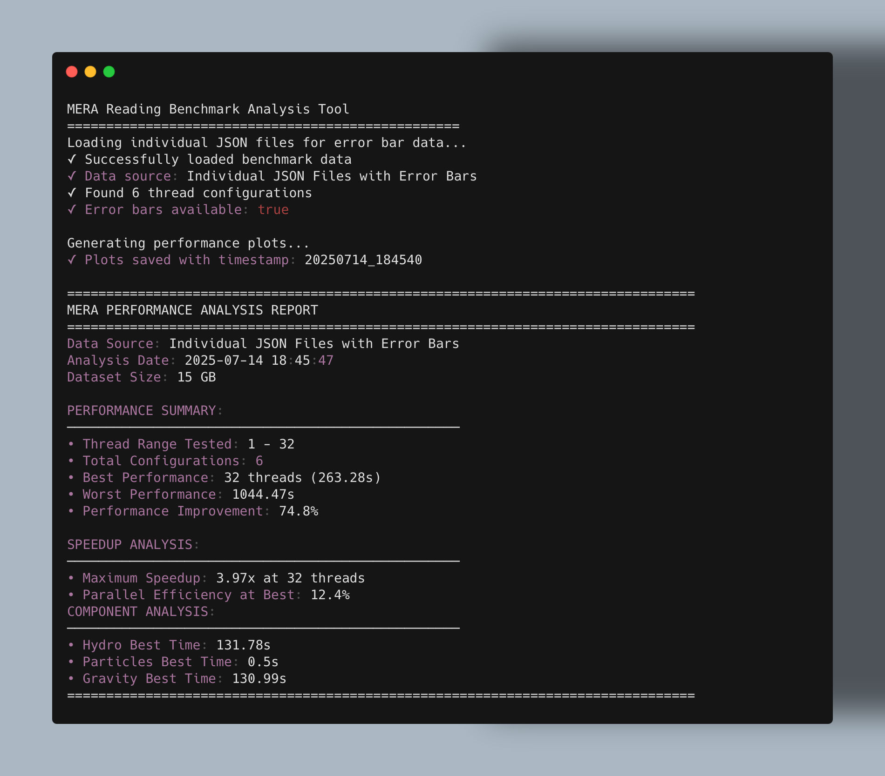

# Multi-Threaded RAMSES File Reading with Mera.jl: Performance Guide
# Prerequisites

**Note:** This guide provides instructions for both `juliaup` managed installations (with version specifiers like `julia +1.11`) and standard Julia installations. Simply use your preferred Julia invocation style, ensuring you have Julia 1.10 or higher for optimal benchmarking performance.

- **Julia version:** 1.10 or higher is required.
- **Operating System:** Linux, macOS, or Windows (tested on Linux/macOS).
- **Basic Julia knowledge:** Familiarity with the Julia REPL or Jupyter notebooks is helpful.


**Modern astrophysics simulations generate massive volumes of data that require efficient processing.**  
In simulations that run on multiple CPU cores—often producing numerous related output files—loading the resulting RAMSES files can become a significant bottleneck, slowing down your workflow.  
This guide demonstrates how to leverage multithreaded file loading in **Mera** to significantly accelerate your data analysis process.


## Quick Benefits Overview

- **Why multithreading helps**: While one CPU core waits for disk operations, other cores can start reading additional files simultaneously
- **What you measure**: total read time, memory cleanup (garbage collection) overhead, and result consistency
- **When to stop adding threads**: performance stops improving or memory cleanup takes more than 10-15% of total time
- **Hardware considerations**: Traditional drives work best with 4-8 threads; NVMe drives keep scaling much higher.


## Understanding Garbage Collection (GC) in Your Results


**What Garbage Collection Does**

Garbage collection is Julia's automatic system for freeing up memory that your programs no longer need. Think of it like an automatic cleanup service running in the background, removing data that's no longer being used so your system doesn't run out of memory space.

**How GC Works with Multiple Threads**

When running multiple threads to read files, each thread creates data in memory (like file contents and processing results). After processing, GC automatically cleans up this data. However, GC has overhead costs:

- **GC uses separate threads** from your file-reading threads

- **GC pauses can slow down your main work** when memory cleanup becomes intensive

- **Too many threads can overwhelm the GC system**, causing cleanup overhead to become a bottleneck

**Why This Matters for Your Thread Optimization**

Your benchmark results show GC time as a percentage of total execution time. This helps you understand:

- **Good performance**: GC time stays below 10-15% of total time

- **Warning signs**: When GC time rises significantly, you're approaching your system's threading limits

- **Optimal thread count**: The point where you get maximum file reading speed without triggering excessive memory management overhead


## Common Performance Barriers

- **Storage speed limits** - a single disk drive can only serve one request efficiently at a time

- **File system overhead** - opening thousands of small RAMSES files creates extra work for metadata operations

- **Memory pressure** - too many threads can trigger heavy garbage collection, stealing CPU cycles from actual work


## Hardware Requirements

**Minimum System Requirements:**
- **RAM**: 16 GB minimum (32 GB recommended for large simulations)
- **Storage**: 100 GB available space for test data and results
- **CPU**: Multi-core processor (4+ cores recommended for meaningful threading tests)
- **Julia**: Version 1.10 or higher

**Optimal Hardware Configurations:**
- **Traditional drives (HDD)**: Best performance with 4-8 threads
- **NVMe SSD drives**: Can efficiently scale to 32+ threads  
- **Server environments**: Network storage may limit optimal thread counts

## Setting Up Your Test Environment

### 1. Create a Clean Julia Project


Creating a dedicated Julia environment ensures reproducible results and clean dependency management. Start by creating a project directory and initializing the Julia package environment. You can do this in a terminal or in a Jupyter notebook cell (using the `;` shell escape):

```bash
mkdir ramses_reading
cd ramses_reading
julia --project=.
```

### 2. Install Required Packages


#### Download and unzip the test suite

```bash
# Using curl
curl -L -o RAMSES_reading_stats.zip https://github.com/ManuelBehrendt/Mera.jl/raw/master/src/benchmarks/RAMSES_reading/downloads/RAMSES_reading_stats.zip

# Using wget (alternative)
wget https://github.com/ManuelBehrendt/Mera.jl/raw/master/src/benchmarks/RAMSES_reading/downloads/RAMSES_reading_stats.zip -O RAMSES_reading_stats.zip
```

Unzip the downloaded file:

```bash
unzip RAMSES_reading_stats.zip
```

#### Install the required Julia packages

**Important:** Before running Julia code, always activate your project environment. In the Julia REPL or a Jupyter notebook cell, run:

```julia
using Pkg
Pkg.activate(".")
Pkg.add(["Mera", "CairoMakie", "Glob"])
Pkg.instantiate()  # Ensure all dependencies are properly installed
```

This approach creates `Project.toml` and `Manifest.toml` files that lock exact package versions, ensuring consistent results across different systems.

### 3. Project Structure

Your project directory should look like this:

```
ramses_reading/
├── Project.toml         # Dependency specifications
├── Manifest.toml        # Exact package versions (auto-generated)
├── run_test.sh          # Automated thread count testing (calls run_test.jl)
├── run_test.jl          # Core timing measurements
├── run_test_plots.jl    # Visualization of the measurements (outputs PNG)
└── RAMSES_reading_stats.zip  # Downloaded test suite
```


## Prepare the files and How the Benchmark Framework Works

### Core Timing Script (`run_test.jl`)

- Reads hydro, particle, and gravity files **default: ten times each** for statistical reliability
- Records total execution time, garbage collection overhead, and any errors
- Requires only two simple inputs:
  - **Simulation path**: Edit the `path` variable to point to your RAMSES output folder (see examples in the script)
  - **Output number**: Set `output_number = 250` to the snapshot number you want to benchmark


### Automated Test Runner (`run_test.sh`)

- Systematically tests different thread configurations from 1 to 64 threads
- Make sure the file is executable, otherwise run:
  ```bash
  chmod +x run_test.sh
  bash run_test.sh
  ```  

- Edit the thread configurations in `run_test.sh` to match your server's capabilities:
  ```bash
  configs=(
      "1:1"     # 1 compute thread, 1 GC thread
      "2:1"     # 2 compute threads, 1 GC thread
      "4:2"     # 4 compute threads, 2 GC threads
      "8:4"     # 8 compute threads, 4 GC threads
  )
  ```

- Results are saved as structured JSON files and summary CSV tables.

### Visualisation Engine (`run_test_plots.jl`)
After completing the benchmark, generate comprehensive performance visualizations using the analysis script:

- Combines most benchmark results into comprehensive reports
- Generates performance visualizations showing:
    - Total read time vs. thread count
    - Speed-up curves compared to single-threaded baseline
    - Component-specific timing breakdowns


## Running Your Performance Tests


```bash
chmod +x run_test.sh
bash run_test.sh      
```

After completing the benchmark, generate comprehensive performance visualizations using the visualisation script. You can run this in the Julia REPL or in a Jupyter notebook cell (with `;`):


```bash
# For juliaup managed installations
julia +1.11 --project=. run_test_plots.jl

# For standard Julia installations  
julia --project=. run_test_plots.jl
```

**Tip:** After your analysis is complete, you can organize your results by moving the generated CSV and JSON files to a dedicated folder named with the current date (e.g., `benchmarks_20250726/`). For completeness and reproducibility, also copy the plotting script (`run_test_plots.jl`) into this folder. This keeps your benchmark data and analysis scripts together and your project directory tidy.


## Understanding Your Results

### Performance Curve Analysis

| Chart Type | Key Indicators | Recommended Action |
| :-- | :-- | :-- |
| **Read Time vs. Threads** | Time drops sharply initially, then levels off | Choose thread count just before the curve flattens |
| **Speed-Up Comparison** | Gap between ideal and actual performance lines | Large gaps suggest tuning buffer sizes or GC threads |
| **GC Overhead Percentage** | Should remain under 10-15% | Higher values indicate thread count reduction needed |
| **Component Breakdown** | One component much slower than others | Investigate file sizes, compression, or format issues |

### Practical Optimization Guidelines

- **Start conservative**: Test 1, 2, 4, 8 threads first; only jump to 32+ on high-end NVMe storage systems
- **Monitor GC threads**: Many workloads perform well with 2:1 compute-to-GC ratios (e.g., 8 compute + 4 GC threads)
- **Reuse memory buffers**: Avoiding repeated allocations often reduces GC overhead by 50%+
- **Storage-specific limits**: Traditional drives hit performance walls around 4-8 threads due to seek overhead
- **Network storage considerations**: Limit threads to avoid saturating network bandwidth, causing requests to queue rather than execute


## Troubleshooting Common Issues

| Problem | Likely Cause | Solution |
| :-- | :-- | :-- |
| Performance **decreases** after 8 threads | Storage or network bandwidth saturation | Reduce to 4-8 threads |
| GC overhead **exceeds 15%** | Too many memory allocations | Reuse buffers, tune `GC_THREADS` setting |
| **Large timing variations** between runs | System interference from other processes | Run during low-activity periods |
| **"File not found" errors** | Incorrect simulation path | Verify path exists: `ls /your/simulation/path/` |
| **Out of memory errors** | Insufficient system RAM | Reduce thread count or use smaller test dataset |
| **Permission denied errors** | File access restrictions | Check file permissions: `chmod 755 run_test.sh` |
| **Package installation fails** | Network or dependency issues | Try `Pkg.resolve()` or restart Julia REPL |

### Advanced Troubleshooting

**Memory Profiling:**
```julia
# Monitor memory usage during benchmarks
using Profile, ProfileView
@profile run_reading_benchmark(250, path)
ProfileView.view()
```

**Performance Debugging:**
```julia 
# Enable verbose timing output
ENV["JULIA_DEBUG"] = "Mera"
run_reading_benchmark(250, path)
```


## Implementation and Maintenance

### Production Deployment

- **Document optimal settings** for your specific hardware configuration in team documentation
- **Set environment variables** (`JULIA_NUM_THREADS`, `JULIA_NUM_GC_THREADS`) for consistent behavior
- **Implement monitoring** to track performance over time and detect degradation


### Ongoing Optimization

- **Run regression tests** when hardware or simulation characteristics change
- **Share configurations** with collaborators using Project.toml/Manifest.toml for reproducible environments
- **Monitor system resources** (CPU utilization, memory usage, I/O wait times) during production workloads


### Contributing Back to the Community

- **Document unusual findings** in Mera.jl GitHub issues for community benefit
- **Submit performance improvements** as pull requests when you discover optimizations
- **Share benchmark results** that help others with similar hardware configurations


## Real-World Performance Validation

 Optimal thread configurations emerge from the interaction between your specific server hardware, simulation file characteristics, and system environment. Continuous benchmarking and performance monitoring ensure your computational resources serve your research goals most effectively.


## Real-World Server Example


The following example demonstrates benchmark execution and results from a production server running the complete test suite on a RAMSES simulation with output number 250.

AMR-Files:      10.85 GB 	<2.17 MB>/file
Hydro-Files:    25.46 GB 	<5.09 MB>/file
Gravity-Files:  17.82 GB 	<3.56 MB>/file
Particle-Files: 39.53 MB 	<7.9 KB>/file
Total Data Size: ~54.3 GB
### Terminal Output During Benchmark Execution


### Terminal Output During Analysis



### Plots After Analysis


### File Structure of the Simulation Used for Benchmarking

The following Julia code provides an overview of the disk usage for the selected simulation output:

```julia
using Mera

# Example: Point to your RAMSES simulation output folder
path = "/path/to/your/ramses/simulation/outputs/"
output_number = 250  # Adjust to your available snapshot

# Get information about the simulation
info = getinfo(output_number, path, verbose=false)

# Display storage overview
storageoverview(info)
```

```
Overview of the used disk space for output: [250]
------------------------------------------------------
AMR-Files:      10.85 GB   <2.17 MB>/file
Hydro-Files:    25.46 GB   <5.09 MB>/file
Gravity-Files:  17.82 GB   <3.56 MB>/file
Particle-Files: 39.53 MB   <7.9 KB>/file
Total:          54.3 GB    <3.46 MB>/file avg

mtime: 2024-06-06T10:26:39.133
ctime: 2024-06-06T17:13:46.723
```

---

## Expected Performance Ranges

### Typical Results by Hardware Configuration

**Traditional HDD Storage:**
- **1 thread**: Baseline performance (100% efficiency)
- **2-4 threads**: 1.5-2.5x speedup (75-90% efficiency)
- **8+ threads**: Diminishing returns (<50% efficiency)

**SSD Storage:**
- **1 thread**: Baseline performance  
- **2-8 threads**: 1.8-6x speedup (90-75% efficiency)
- **16+ threads**: 8-12x speedup (50-75% efficiency)

**NVMe/High-end Server Storage:**
- **1 thread**: Baseline performance
- **2-16 threads**: Near-linear scaling (80-95% efficiency)  
- **32+ threads**: 20-25x speedup (60-80% efficiency)

### Interpreting Your Results

**Excellent Performance Indicators:**
- Parallel efficiency >80% up to 8 threads
- GC overhead <10% of total time
- Consistent timing across multiple runs (low standard deviation)

**Performance Warning Signs:**
- Efficiency drops below 50% with <8 threads (storage bottleneck)
- GC overhead >15% (memory pressure)
- Large result variations (system interference)

**Optimization Recommendations:**
- **Peak efficiency achieved**: Your optimal thread count
- **Performance plateau**: Storage or network bandwidth limit reached
- **Performance degradation**: Reduce threads to avoid resource contention

## Summary & Checklist

### Pre-requisites Verification
- [ ] Julia 1.10+ is installed and accessible from command line
- [ ] Sufficient system memory (16+ GB for typical RAMSES simulations)
- [ ] RAMSES simulation data available locally with known output numbers

### Environment Setup  
- [ ] Project directory created and environment initialized
- [ ] Test suite downloaded **and unzipped**
- [ ] Project environment activated before running Julia code (`Pkg.activate(".")`)
- [ ] Required packages installed and tested (`Mera`, `CairoMakie`, `Glob`)

### Configuration and Execution
- [ ] Simulation path and output number configured in `run_test.jl`
- [ ] Thread configurations adjusted for your hardware in `run_test.sh`
- [ ] Benchmark scripts executed successfully
- [ ] Results visualized and interpreted using performance guidelines

### Results Analysis
- [ ] Performance curves analyzed for optimal thread count
- [ ] GC overhead monitored and kept within acceptable limits  
- [ ] Results documented for future reference and team sharing

If you completed all steps above, your benchmarking environment is ready and you can confidently analyze RAMSES file reading performance with Mera.jl!

