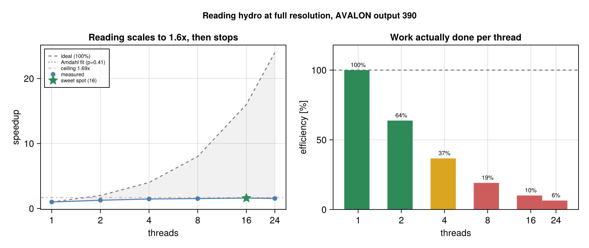
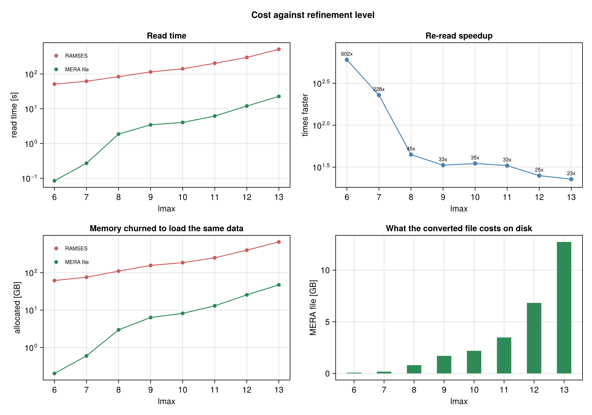

# Performance

Two things dominate the time in simulation analysis: **reading the data** and
**projecting it**. This page is the evidence for how Mera handles both, so you can
judge it on numbers rather than adjectives.

To measure your own machine instead, go to [Run Your Own Benchmarks](run_your_own.md).

!!! note "Where these numbers come from"
    Intel Xeon Gold 6534, 32 threads, 1511 GB RAM, btrfs, Julia 1.12.7, 24 compute and
    24 GC threads.

    The data is a production Milky-Way run from the AVALON simulation suite
    (Behrendt et al., in preparation), output 390: `ncpu = 5120`, 20489 files, 53.18 GB on
    disk, `levelmax = 13`, 5.9 pc finest cell. All three components converted. These are
    real research data at full resolution, not a synthetic case chosen to look good.

    The raw reports are in the repository under
    [`benchmark_results/server_L13_output390`](https://github.com/ManuelBehrendt/Mera.jl/tree/master/benchmark_results/server_L13_output390),
    one directory per refinement level, so every figure quoted here can be checked
    against the run that produced it.

    One machine, one simulation. **Ratios travel between machines, absolute times do
    not.** Every number below is produced by a function you can run yourself.

## Disk: a MERA file is 76% smaller

The most checkable claim first, because it needs no timing and does not depend on your
hardware at all. One `du` reproduces it.

| output 390, all components | RAMSES | MERA `.jld2` | |
|---|---:|---:|---|
| size on disk | 53.18 GB | 12.73 GB | **76% smaller, 4.2x** |

LZ4 compressed, hydro, gravity and particles on both sides, plus the AMR files the
RAMSES side needs to describe its grid.

The snapshot splits as hydro 24.94 GB (47%), gravity 17.52 GB (33%), AMR 10.66 GB (20%)
and particles 65 MB (0.1%), which is worth knowing before deciding what to convert.

## Projection: threads only pay when there is work per cell

A published null result, because it is the one most people get wrong.

| workload | 1 thread | 2 | 4 | 8 | speedup |
|---|---:|---:|---:|---:|---:|
| one variable, `:sd` | 1.56 s | 1.62 s | 1.58 s | 1.62 s | **0.96x**, flat |
| ten variables, one call | 21.0 s | 13.3 s | 13.3 s | 12.9 s | **1.63x** |

Live-heap delta about 1.1 GiB.

*`benchmark_projection_hydro(gas, [1,2,4,8], 3)`, session started with 8 Julia threads.*

**Giving a single light projection more threads does nothing.** There is too little
arithmetic per cell to cover the coordination cost, so it stays flat at every thread
count. Once there is real work per cell the picture changes, but note *where* the gain
appears: almost all of it arrives between 1 and 2 threads, then it flattens. Two
threads captures nearly all of what is available here.

The practical consequence is one line:

```julia
proj = projection(gas, [:sd, :T, :vx, :vy])    # one pass over the data, threads used
```

## Reading: convert once, then re-read far faster

`savedata` writes a MERA file holding the already-parsed table. Reading a RAMSES output
re-parses every per-CPU Fortran file and rebuilds the AMR tree, every single time.

Same snapshot, same three components, same data in memory at the end:

| getting hydro + gravity + particles into memory | time |
|---|---:|
| from the RAMSES output, 16 threads | 514.9 s |
| from the MERA file, warm | 22.7 s |

So about **23x faster**, and the conversion pays for itself after **1.1 re-reads**:
writing the file cost 27.6 s on top of one read it had to do anyway.

Memory is the larger effect, and the one that decides whether a read fits at all:

| | RAMSES | MERA file | |
|---|---:|---:|---|
| allocated getting there | 665.4 GB | 47.4 GB | **14x less churn** |
| peak resident memory | 115.2 GB | 60.2 GB | **1.9x lower** |
| garbage collection | 61.8 s | 1.6 s | |

Both paths finish holding the same data. The difference is what they churn through on the
way: RAMSES parsing needs buffers for every one of 20489 files, so it allocates 665 GB to
deliver a 53 GB snapshot and spends a minute collecting the result. That allocation, not
the data, is what presses a read against a node's memory limit.

### Threading helps reading, but only so far



Reading gains **1.61x from 1 to 16 threads** and then turns over: 24 threads is slower
than 16. Fitting Amdahl's law to the rising part gives a parallel fraction of 0.41, so
about **420 s of the 710 s single-thread read is irreducibly serial** and no thread count
can beat 1.69x. Sixteen threads already reaches 95% of that ceiling.

The efficiency panel is the same fact stated usefully: by 16 threads each thread is doing
10% of the work a single thread does. The threads past the sweet spot are not buying
speed, and on a shared node they are taking cores from other jobs.

Where the RAMSES time goes:

| component | time |
|---|---:|
| hydro | 448.0 s ± 7.0 s |
| gravity | 80.5 s ± 23.6 s |
| particles | 3.6 s ± 1.3 s |
| **total** | **532.0 s** |

*`benchmark_report(path, 390; runs=3)` at `lmax=13`, 16 threads, the sweet spot its own
sweep found. Gravity's spread is large because it is the component most exposed to other
load on a shared node.*

**This gap grows on a server, it does not shrink.** The cost Mera avoids is opening and
parsing 20489 files. On a parallel filesystem such as Lustre or GPFS, every one of those
opens is a round trip to a metadata server shared with every other user on the machine.
The measurement above is on local btrfs, so treat its ratio as a floor rather than a
ceiling.

### The speedup depends on how much you ask for

One number would be misleading. Measured across every refinement level of the same
snapshot:

| `lmax` | RAMSES read | MERA re-read | speedup | MERA file |
|---:|---:|---:|---:|---:|
| 6 | 51.1 s | 0.09 s | **602x** | 74.7 MB |
| 8 | 83.5 s | 1.87 s | 45x | 819 MB |
| 10 | 141.0 s | 4.04 s | 35x | 2.19 GB |
| 12 | 299.8 s | 11.98 s | 25x | 6.83 GB |
| 13 | 514.9 s | 22.69 s | **23x** | 12.73 GB |



The mechanism is visible in the shape rather than in the numbers. **RAMSES read cost is
dominated by parsing every one of the 20489 files whatever you asked for**, so its curve
is nearly flat across eight levels. The MERA path reads only what was requested, so its
curve falls by more than two orders of magnitude. The ratio between them is the gap
between those two lines, which is why it grows as the request narrows.

Which number applies to you depends on what you read. **Full resolution is the case a
published result rests on**, and there the honest figure is 23x. A reduced `lmax` is a
preview, or a region that is genuinely coarse anyway, and the very large numbers there are
real but describe that use.

### When converting pays, and when it does not

The measurement above is deliberately the **worst case for the MERA format's advantage
to be judged against**: the whole box, every level, which is the most expensive thing you
can ask RAMSES for. It is a ceiling on cost, not a typical workload, and whether it
describes yours depends on how you read.

**Full resolution is the normal case for a result you intend to publish.** The refinement
is where the physics is, so an analysis of a galaxy needs the levels that resolve it.
Reading at a reduced `lmax` is for a quick look, or for regions that are genuinely coarse
anyway, the low-density gas outside the galaxy in the run measured here.

**RAMSES can read part of a box; a MERA file is read whole.** RAMSES output is
decomposed along a Hilbert curve, so asking `gethydro` for a subregion opens only the CPU
files whose domains intersect it and never touches the rest. A MERA file holds one table:
[`loaddata`](@ref) accepts `xrange` and friends, but it reads everything stored and then
cuts in memory, and it has no `lmax` option.

That sounds like a limitation, and it stops being one as soon as you stop thinking of a
MERA file as a copy of the snapshot. **Make the file be the selection.** Use the RAMSES
partial read once, for exactly the data you keep coming back to, and save that:

```julia
# read once, cheaply: only the CPU files intersecting this region are opened
gas = gethydro(getinfo(250, "/path/to/sim"),
               xrange=[-10, 10], yrange=[-10, 10], zrange=[-2, 2],
               center=[:bc], range_unit=:kpc, lmax=11)

savedata(gas, "/scratch/merafiles", :write)      # a MERA file of just that selection

# from now on, every pass over that data is the fast path
gas = loaddata(250, "/scratch/merafiles", :hydro)
```

The two properties now work together rather than against each other: the partial read
keeps the one-off cost down, and the MERA file is small because it contains nothing you
did not ask for. "Loaded whole" is exactly what you want when the whole file is your
region of interest.

Nothing stops you keeping several of them, one per region, resolution or component, and
they are cheap to hold: the selection above is a fraction of the full-box file.

So the decision is about your access pattern, not about which format is faster:

| how you read | what to do |
|---|---|
| the whole box, or most of it, more than once | **convert.** This is what the numbers above measure |
| the same subregion many times | **save that subregion as its own MERA file**, as above |
| scattered small subregions of a large box, each once | RAMSES partial reads are competitive: they skip most files entirely |
| one pass over a snapshot you will not revisit | do not convert; you would pay the write for nothing |

The middle two rows are where most iterative analysis actually lives, and they are the
ones worth setting up deliberately.

If you read the same data more than once, convert it.

## Honest limits

- One machine, one simulation, one Julia version.
- The read comparison uses a 640-CPU snapshot. On a small output, the per-file parse
  cost that the MERA format avoids is a much smaller share of the total, so the
  advantage is smaller. It is a property of the file count, not a constant.
- The public test simulations cannot reproduce the read comparison. Every one of them is
  `ncpu = 8` with 34 to 48 files per output, so the effect being measured is essentially
  absent. They can show that the harness works and that the disk ratio holds.
- Projection scaling was measured at one resolution. Locating the crossover precisely
  would need a resolution by thread-count sweep.
- Peak RSS and Julia live-heap deltas measure different things. RSS covers the whole
  process including the loaded dataset; the live-heap delta covers only what the
  operation itself adds. They are reported separately and never mixed.
- A MERA file is read whole. `loaddata` takes a spatial range, but it reads the stored
  table and then cuts, so a small subregion of a large MERA file costs what the whole
  file costs. The practical answer is to save the selection as its own file rather than
  to carve one out of a full-box file; reading part of a large MERA file directly is a
  real gap.

## Next

- [Run Your Own Benchmarks](run_your_own.md), including what to do differently on a server
- [Multi-threading](../multi-threading/multi-threading_intro.md), for the thread budget
