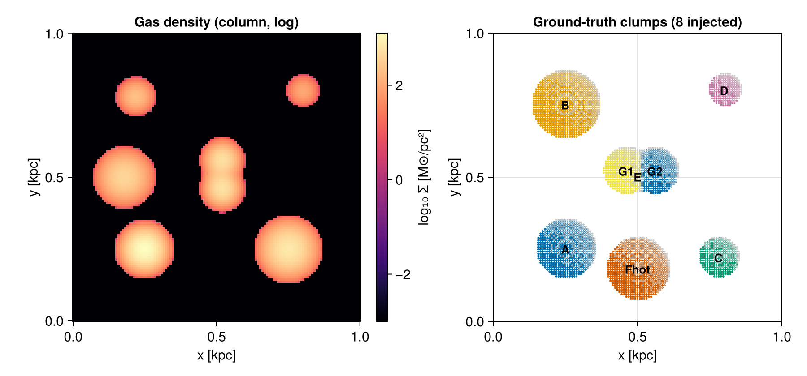
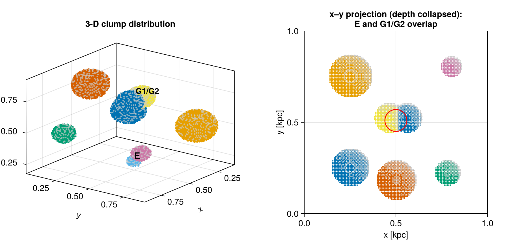
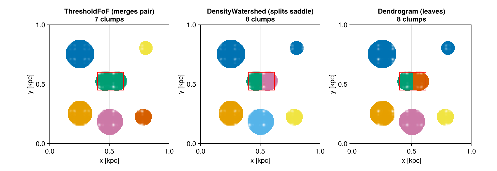
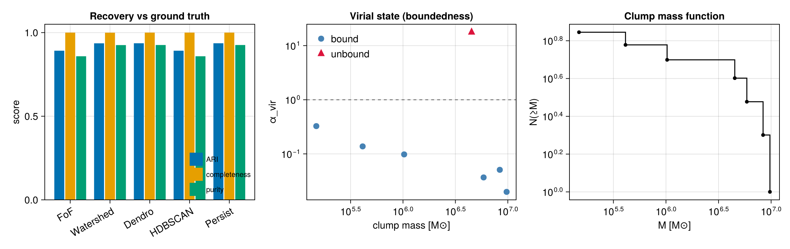
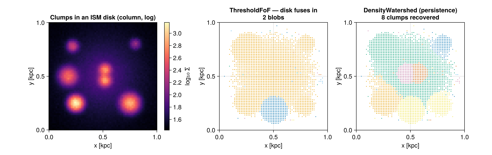

# Clump Finding — a synthetic, ground-truth example

This page is a self-contained, **data-free** worked example for the structure finder
([`clumpfind`](@ref)). It builds a small Mera simulation *from scratch* — a real
`HydroDataType` + `PartDataType` on a self-consistent unit system, no RAMSES files — whose
clump population is **known exactly**. Because the ground truth is known, every finder and
every feature can be both *exercised* and *scored* (Adjusted Rand Index, completeness,
purity, recovered mass, virial state). The same field drives the accuracy test
`test/54_clumpfind_synthetic_tests.jl`, which runs in CI on every platform.

[`synthetic_clumps`](@ref), [`save_synthetic_clumps`](@ref) and [`load_synthetic_clumps`](@ref)
are part of Mera (source: [`src/functions/synthetic_clumps.jl`](https://github.com/ManuelBehrendt/Mera.jl/blob/master/src/functions/synthetic_clumps.jl)).

## Get the data

The generator is deterministic, so you can either **regenerate** the identical field
locally or **download** the prebuilt dataset (≈1.8 MB, LZ4-compressed Mera/JLD2). Both need
only `using Mera`.

```julia
using Mera

# Option A — regenerate the identical field locally (no download):
F = synthetic_clumps()
gas, particles, truth = F.gas, F.particles, F.truth

# Option B — download the prebuilt dataset once (cached in `dir`), then load it:
D = load_synthetic_clumps(tempdir(); download=true)
gas, particles, truth = D.gas, D.particles, D.truth
```

The stored `gas` / `particles` are ordinary Mera data objects: every Mera verb
(`getvar`, `projection`, `clumpfind`, …) works on them unchanged. Write the file yourself
with `save_synthetic_clumps(dir)`.

## The field

Eight clumps are injected into a `128³` grid in a 1 kpc box (Gaussian gas overdensities;
matching particle bags; plus a two-component kinematic stream for the phase-space finder):

* **A–E** — five isolated, self-gravitating (cold) clumps spanning ~2 dex in mass — the
  bread-and-butter case and the mass-function spectrum.
* **Fhot** — a massive but *kinematically hot* clump (σ = 28 km/s): spatially obvious yet
  **gravitationally unbound** — the boundedness/virial test case.
* **G1 + G2** — two cores sharing one envelope, ~0.1 kpc apart — the **deblending /
  substructure** test case that single-threshold friends-of-friends cannot split.



*Left: the gas column density (note the G1+G2 "peanut" at centre). Right: the eight
injected ground-truth clumps, coloured by id.*

### The data and finders are fully 3-D

The figures above collapse the box along `z` for display, but the field is a genuine **3-D
volume** and every finder runs in three dimensions. The clumps sit at different depths — in
particular clump **E** (z ≈ 0.25) lies almost directly under the **G1/G2** pair (z ≈ 0.75),
so they overlap in the x–y projection yet are distinct in 3-D:



*Left: the clumps in the 3-D volume. Right: the x–y projection — E and G1/G2 (red circle)
land on the same sky position. A 3-D finder separates them by depth; a 2-D connected-component
search on the projection would merge them. `test/54` asserts exactly this.*

## Run every finder and score it

`clump_recovery` compares a finder's per-cell labelling against the known truth labels:

```julia
ll, thr = 2.0/2^7, 5.0
P    = Mera._make_points(gas, :rho; threshold=thr, threshold_unit=:standard)
tlab = [F.true_label(P.x[i], P.y[i], P.z[i]) for i in eachindex(P.x)]

for fdr in (ThresholdFoF(:rho;     threshold=thr, linking_length=ll),
            DensityWatershed(:rho; threshold=thr, linking_length=ll, persistence=30.0),
            Dendrogram(:rho;       threshold=thr, linking_length=ll, min_delta=30.0),
            PersistenceFinder(:rho;threshold=thr, linking_length=ll, persistence=30.0))
    flab, _ = Mera._label(fdr, P)
    r = clump_recovery(flab, tlab)
    println(rpad(nameof(typeof(fdr)),18), "  ARI=", round(r.ari,digits=3),
            "  completeness=", round(r.completeness,digits=3), "  purity=", round(r.purity,digits=3))
end
```

| Finder             | clumps | ARI   | completeness | purity | notes |
|--------------------|:------:|:-----:|:------------:|:------:|-------|
| `ThresholdFoF`     |   7    | 0.892 |    1.00      | 0.859  | merges the G1+G2 pair |
| `DensityWatershed` |   8    | 0.936 |    1.00      | 0.925  | splits the pair along the saddle |
| `Dendrogram`       |   8    | 0.936 |    1.00      | 0.926  | + full merge tree (`hierarchy=true`) |
| `PersistenceFinder`|   8    | 0.936 |    1.00      | 0.926  | prominence-pruned peaks |
| `HDBSCANFinder`    |   7    | 0.892 |    1.00      | 0.859  | density-adaptive, no threshold tuning |

All finders recover the isolated clumps with completeness 1.0; the deblending finders
additionally resolve the touching pair, which is the only difference in their score.

## Deblending the touching pair

The red box marks G1+G2. `ThresholdFoF` connects them into one clump; the density-aware
finders split them along the saddle:



```julia
near(c) = 0.40 < c.com[1] < 0.62 && 0.45 < c.com[2] < 0.60 && 0.68 < c.com[3] < 0.82
count(near, clumpfind(gas, ThresholdFoF(:rho; threshold=thr, linking_length=ll)).clumps)        # 1
count(near, clumpfind(gas, DensityWatershed(:rho; threshold=thr, linking_length=ll, persistence=30.0)).clumps)  # 2

# the same two cores appear as bound substructure of the single FoF clump:
csub = clumpfind(gas, :rho; threshold=thr, linking_length=ll, substructure=true)
any(get(c, :n_subclumps, 0) == 2 for c in csub.clumps)   # true
```

## Accuracy, boundedness and the mass function



*Left: recovery metrics per finder. Centre: with `boundedness=true` the six cold clumps
land at `α_vir ≪ 1` (bound) while the hot clump Fhot sits at `α_vir ≈ 18` (unbound) — the
finder labels it `bound=false`. Right: the recovered cumulative clump mass function.*

```julia
cat = clumpfind(gas, ThresholdFoF(:rho; threshold=thr, linking_length=ll);
                boundedness=true, egrav=:tree)
# the validator chain turns the virial state into a filter — drop the unbound clump:
bound = clumpfind(gas, ThresholdFoF(:rho; threshold=thr, linking_length=ll);
                  validators=[Bound(:tree), VirialBelow(2.0)])
bound.nclumps == cat.nclumps - 1     # Fhot removed
```

## Backgrounds & noise — telling clumps from the ISM floor

Real clumps don't sit on a flat floor; they're embedded in a structured, turbulent ISM. The
generator can place the same eight clumps in different environments via `synthetic_clumps`:

```julia
flat   = synthetic_clumps()                                   # flat floor (the default)
noisy  = synthetic_clumps(noise=0.35, lmax=6)                 # +35% log-normal density noise
galaxy = synthetic_clumps(background=:galaxy, noise=0.2, lmax=6)   # clumps inside an exp. ISM disk
```

* **Turbulent floor** — log-normal per-cell noise far below the threshold is simply rejected:
  the resolved clumps are still recovered and the floor produces **no spurious clumps**.
* **Structured disk** — when the diffuse ISM itself rises above the threshold, the choice of
  finder becomes decisive:



*Left: the eight clumps embedded in a smooth exponential disk. Centre: a fixed-threshold
`ThresholdFoF` connects the elevated disk and the clumps into **2 giant blobs** — only 2 of 8
clumps are detected. Right: `DensityWatershed` (and `Dendrogram`/`PersistenceFinder` with a
prominence/`min_delta` cut) reject the smooth floor by **density contrast** and recover all 8.*

```julia
gasg = galaxy.gas; thr, ll = 4.0, 2.0/2^6
peakpos(cat) = [c.peak_pos for c in cat.clumps]
ndet(cat) = count(t -> any(p -> sum((p .- t.pos).^2) < 0.05^2, peakpos(cat)), galaxy.truth)

ndet(clumpfind(gasg, ThresholdFoF(:rho; threshold=thr, linking_length=ll); min_members=20))       # 2/8 — disk fuses
ndet(clumpfind(gasg, DensityWatershed(:rho; threshold=thr, linking_length=ll, persistence=20.0); min_members=20))  # 8/8
```

The lesson: on a structured background, prefer a **density-contrast** finder
(`DensityWatershed`, `Dendrogram` with `min_delta`, `PersistenceFinder`, or `HDBSCANFinder`),
or raise the threshold above the local ISM — a single absolute threshold with friends-of-friends
will merge clumps into the floor. This is exactly what
`test/54_clumpfind_synthetic_tests.jl` asserts.

## When to use which finder

What this synthetic bench shows about each algorithm, and the situation it's the right tool for:

| Finder | Use it when… | On this bench |
|---|---|---|
| [`ThresholdFoF`](@ref) | clumps are **isolated islands** over a clear, flat background; you want the fastest, most robust connectivity finder | recovers the isolated clumps (ARI 0.89); **merges** the touching pair and **fuses** the ISM disk |
| [`DensityWatershed`](@ref) | touching clumps must be **split along their saddle**; you can set a `persistence` contrast | splits G1/G2; recovers 8/8 on the ISM disk |
| [`Dendrogram`](@ref) | you want the **multi-scale merge tree** (`hierarchy=true`), or leaves above a `min_delta` contrast | 8 leaves + tree; rejects the smooth floor |
| [`PersistenceFinder`](@ref) | you want **topologically robust** peaks, pruning low-prominence noise bumps | 8/8, prominence-pruned |
| [`HDBSCANFinder`](@ref) | clumps span a **wide density range** and you don't want to tune a single threshold | density-adaptive; needs `min_cluster_size`, sensitive on a heavy floor |
| [`GraphSegFinder`](@ref) | fast **multi-scale** segmentation / a deblender; granularity set by `scale` | scale-dependent segment count |
| [`PhaseSpaceFoF`](@ref) | populations **overlap in space but separate in velocity** (streams, shells, debris) | splits the ±120 km/s kinematic stream |

Add `boundedness=true` (or a [`Bound`](@ref) validator) to any of them to keep only
self-gravitating structures, and a [`validators`](clumpfind.md) chain to filter the catalog.

**Rules of thumb:** start with `ThresholdFoF`; reach for `DensityWatershed`/`Dendrogram`/
`PersistenceFinder` when clumps **touch** or sit on a **structured background**; use
`PhaseSpaceFoF` when the separation is **kinematic**; and always score new settings against a
known case — that's what `synthetic_clumps()` is for.

See [Clump Finding](clumpfind.md) for the full API, the seven finders, and the
gravitational-boundedness / validator details.
