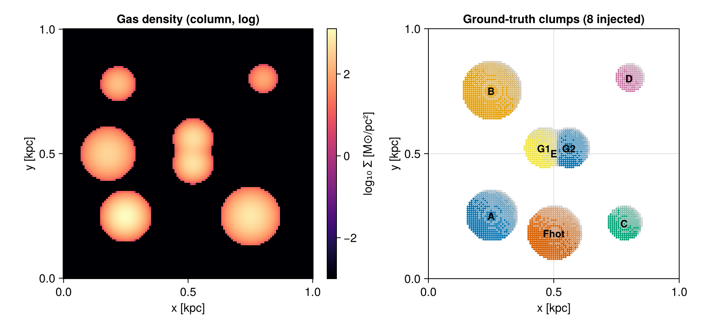
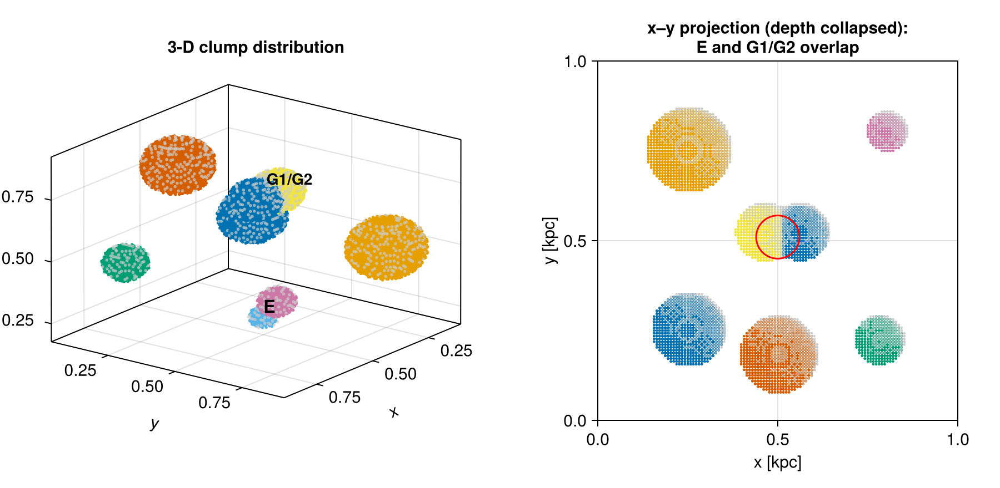
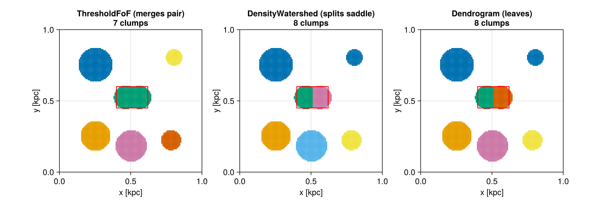
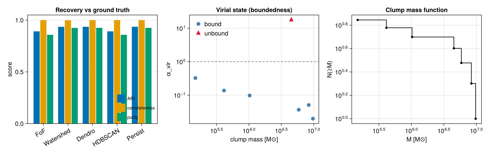
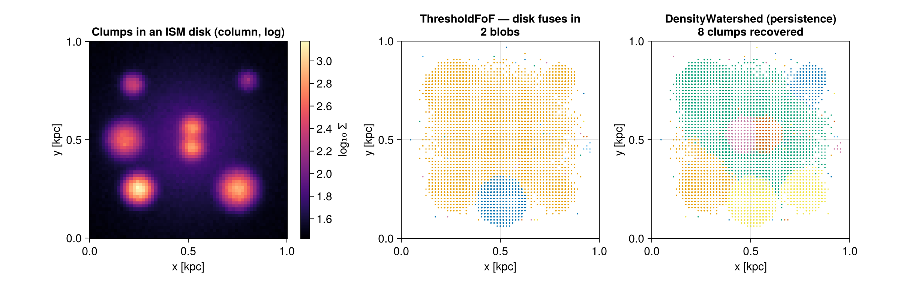
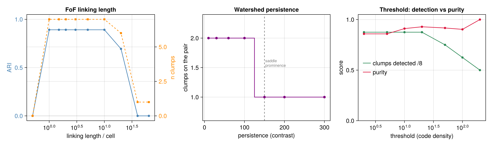

# Clump Finding — a synthetic, ground-truth example

!!! tip "Run it yourself"
    This page is also an executable **Jupyter notebook** — [open / download `clumpfind_synthetic.ipynb`](https://github.com/ManuelBehrendt/Notebooks/blob/master/Mera-Docs/version_1.1/clumpfind_synthetic.ipynb). The notebooks run end-to-end and double as part of Mera's test suite.

This page is a self-contained, **data-free** worked example for the structure finder
([`clumpfind`](@ref)). It builds a small Mera simulation *from scratch* — a real
`HydroDataType` + `PartDataType` on a self-consistent unit system, no RAMSES files — whose
clump population is **known exactly**. Because the ground truth is known, every finder and
every feature can be both *exercised* and *scored* (Adjusted Rand Index, completeness,
purity, recovered mass, virial state). The same field drives the accuracy test
`test/54_clumpfind_synthetic_tests.jl`, which runs in CI on every platform.

[`synthetic_clumps`](@ref), [`save_synthetic_clumps`](@ref) and [`load_synthetic_clumps`](@ref)
are part of Mera (source: [`src/functions/synthetic_clumps.jl`](https://github.com/ManuelBehrendt/Mera.jl/blob/master/src/functions/synthetic_clumps.jl)).

## Get the data

The generator is deterministic, so you can either **regenerate** the identical field
locally or **download** the prebuilt dataset (≈1.8 MB, LZ4-compressed Mera/JLD2). Both need
only `using Mera`.


```julia
using Mera

# Regenerate the identical field locally (deterministic — no download):
F = synthetic_clumps()
gas, particles, truth = F.gas, F.particles, F.truth

println("gas cells      : ", length(gas.data))
println("particles      : ", length(particles.data))
println("ground-truth clumps : ", length(truth))
```


```
*__   __ _______ ______   _______ 
```


```
|  |_|  |       |    _ | |   _   |
|       |    ___|   | || |  |_|  |
|       |   |___|   |_||_|       |
|       |    ___|    __  |       |
| ||_|| |   |___|   |  | |   _   |
|_|   |_|_______|___|  |_|__| |__|
Mera v1.8.0
```


```
gas cells      : 51514
```


```
particles      : 2438
ground-truth clumps : 8
```


```julia
# Option B — download the prebuilt dataset once (cached in `dir`), then load it:
D = load_synthetic_clumps(tempdir(); download=true)
gas, particles, truth = D.gas, D.particles, D.truth
```

The stored `gas` / `particles` are ordinary Mera data objects: every Mera verb
(`getvar`, `projection`, `clumpfind`, …) works on them unchanged. Write the file yourself
with `save_synthetic_clumps(dir)`.

## The field

Eight clumps are injected into a `128³` grid in a 1 kpc box (Gaussian gas overdensities;
matching particle bags; plus a two-component kinematic stream for the phase-space finder):

* **A–E** — five isolated, self-gravitating (cold) clumps spanning ~2 dex in mass — the
  bread-and-butter case and the mass-function spectrum.
* **Fhot** — a massive but *kinematically hot* clump (σ = 28 km/s): spatially obvious yet
  **gravitationally unbound** — the boundedness/virial test case.
* **G1 + G2** — two cores sharing one envelope, ~0.1 kpc apart — the **deblending /
  substructure** test case that single-threshold friends-of-friends cannot split.



*Left: the gas column density (note the G1+G2 "peanut" at centre). Right: the eight
injected ground-truth clumps, coloured by id.*

### The data and finders are fully 3-D

The figures above collapse the box along `z` for display, but the field is a genuine **3-D
volume** and every finder runs in three dimensions. The clumps sit at different depths — in
particular clump **E** (z ≈ 0.25) lies almost directly under the **G1/G2** pair (z ≈ 0.75),
so they overlap in the x–y projection yet are distinct in 3-D:



*Left: the clumps in the 3-D volume. Right: the x–y projection — E and G1/G2 (red circle)
land on the same sky position. A 3-D finder separates them by depth; a 2-D connected-component
search on the projection would merge them. `test/54` asserts exactly this.*


```julia
# inspect the injected ground truth
for t in truth
    println(rpad(string(t.id), 4), "  pos=", round.(t.pos, digits=3))
end
```

```
1     pos=
```


```
(0.25, 0.25, 0.5)
2     pos=(0.25, 0.75, 0.5)
3     pos=(0.78, 0.22, 0.5)
4     pos=(0.8, 0.8, 0.5)
5     pos=(0.5, 0.5, 0.25)
6     pos=(0.5, 0.18, 0.78)
7     pos=(0.46, 0.52, 0.75)
8     pos=(0.56, 0.52, 0.75)
```


## Run every finder and score it

`clump_recovery` compares a finder's per-cell labelling against the known truth labels. We
build the candidate points once, attach the true label of each, then label with each finder:


```julia
ll, thr = 2.0/2^7, 5.0
P    = Mera._make_points(gas, :rho; threshold=thr, threshold_unit=:standard)
tlab = [F.true_label(P.x[i], P.y[i], P.z[i]) for i in eachindex(P.x)]
println("candidate cells above threshold : ", length(P.x))
println("ground-truth clumps             : ", length(unique(filter(>(0), tlab))))
println()
println(rpad("finder", 18), rpad("clumps", 8), rpad("ARI", 8), rpad("completeness", 14), "purity")

for fdr in (ThresholdFoF(:rho;     threshold=thr, linking_length=ll),
            DensityWatershed(:rho; threshold=thr, linking_length=ll, persistence=30.0),
            Dendrogram(:rho;       threshold=thr, linking_length=ll, min_delta=30.0),
            PersistenceFinder(:rho;threshold=thr, linking_length=ll, persistence=30.0),
            HDBSCANFinder(:rho;    threshold=thr, linking_length=ll))
    flab, _ = Mera._label(fdr, P)
    r = clump_recovery(flab, tlab)
    println(rpad(string(nameof(typeof(fdr))), 18),
            rpad(length(unique(filter(>(0), flab))), 8),
            rpad(round(r.ari, digits=3), 8),
            rpad(round(r.completeness, digits=3), 14),
            round(r.purity, digits=3))
end
```

```
candidate cells above threshold : 51514
```


```
ground-truth clumps             : 8
```


```
finder            clumps  ARI     completeness  purity
ThresholdFoF      
```


```
7       0.953   1.0           0.927
DensityWatershed  
```


```
8       0.998   1.0           0.994
Dendrogram        
```


```
8       0.998   1.0           0.995
PersistenceFinder 
```


```
8       0.998   1.0           0.995
HDBSCANFinder     
```


```
7       0.953   1.0           0.927
```


| Finder             | clumps | ARI   | completeness | purity | notes |
|--------------------|:------:|:-----:|:------------:|:------:|-------|
| `ThresholdFoF`     |   7    | 0.953 |    1.00      | 0.927  | merges the G1+G2 pair |
| `DensityWatershed` |   8    | 0.998 |    1.00      | 0.994  | splits the pair along the saddle |
| `Dendrogram`       |   8    | 0.998 |    1.00      | 0.995  | + full merge tree (`hierarchy=true`) |
| `PersistenceFinder`|   8    | 0.998 |    1.00      | 0.995  | prominence-pruned peaks |
| `HDBSCANFinder`    |   7    | 0.953 |    1.00      | 0.927  | density-adaptive, no threshold tuning |

All finders recover the isolated clumps with completeness 1.0; the deblending finders
additionally resolve the touching pair, which is the only difference in their score.

## Deblending the touching pair

The red box marks G1+G2. `ThresholdFoF` connects them into one clump; the density-aware
finders split them along the saddle:




```julia
near(c) = 0.40 < c.com[1] < 0.62 && 0.45 < c.com[2] < 0.60 && 0.68 < c.com[3] < 0.82
n_fof = count(near, clumpfind(gas, ThresholdFoF(:rho; threshold=thr, linking_length=ll)).clumps)
n_ws  = count(near, clumpfind(gas, DensityWatershed(:rho; threshold=thr, linking_length=ll,
                                                    persistence=30.0)).clumps)
println("ThresholdFoF clumps near G1/G2     : ", n_fof, "   (merged)")
println("DensityWatershed clumps near G1/G2 : ", n_ws,  "   (split)")

# the same two cores appear as bound substructure of the single FoF clump:
csub = clumpfind(gas, :rho; threshold=thr, linking_length=ll, substructure=true)
println("a FoF clump with 2 bound subclumps : ",
        any(get(c, :n_subclumps, 0) == 2 for c in csub.clumps))
```

```
ThresholdFoF clumps near G1/G2     : 1
```


```
   (merged)
DensityWatershed clumps near G1/G2 : 2   (split)
a FoF clump with 2 bound subclumps : true
```


## Accuracy, boundedness and the mass function



*Left: recovery metrics per finder. Centre: with `boundedness=true` the six cold clumps
land at `α_vir ≪ 1` (bound) while the hot clump Fhot sits at `α_vir ≈ 18` (unbound) — the
finder labels it `bound=false`. Right: the recovered cumulative clump mass function.*


```julia
cat = clumpfind(gas, ThresholdFoF(:rho; threshold=thr, linking_length=ll);
                boundedness=true, egrav=:tree)
println("clumps (incl. unbound Fhot) : ", cat.nclumps)

bound = clumpfind(gas, ThresholdFoF(:rho; threshold=thr, linking_length=ll);
                  validators=[Bound(:tree), VirialBelow(2.0)])
println("clumps after virial filter  : ", bound.nclumps)
println("Fhot removed                : ", bound.nclumps == cat.nclumps - 1)
```

```
clumps (incl. unbound Fhot) : 7
```


```
clumps after virial filter  : 
```


```
6
Fhot removed                : true
```


## Backgrounds & noise — telling clumps from the ISM floor

Real clumps don't sit on a flat floor; they're embedded in a structured, turbulent ISM. The
generator can place the same eight clumps in different environments via `synthetic_clumps`:

```julia
flat   = synthetic_clumps()                                   # flat floor (the default)
noisy  = synthetic_clumps(noise=0.35, lmax=6)                 # +35% log-normal density noise
galaxy = synthetic_clumps(background=:galaxy, noise=0.2, lmax=6)   # clumps inside an exp. ISM disk
```

* **Turbulent floor** — log-normal per-cell noise far below the threshold is simply rejected:
  the resolved clumps are still recovered and the floor produces **no spurious clumps**.
* **Structured disk** — when the diffuse ISM itself rises above the threshold, the choice of
  finder becomes decisive:



*Left: the eight clumps embedded in a smooth exponential disk. Centre: a fixed-threshold
`ThresholdFoF` connects the elevated disk and the clumps into **2 giant blobs** — only 2 of 8
clumps are detected. Right: `DensityWatershed` (and `Dendrogram`/`PersistenceFinder` with a
prominence/`min_delta` cut) reject the smooth floor by **density contrast** and recover all 8.*


```julia
galaxy = synthetic_clumps(background=:galaxy, noise=0.2, lmax=6)
gasg = galaxy.gas
thr2, ll2 = 4.0, 2.0/2^6

peakpos(cat) = [c.peak_pos for c in cat.clumps]
ndet(cat) = count(t -> any(p -> sum((p .- t.pos).^2) < 0.05^2, peakpos(cat)), galaxy.truth)

n_fof = ndet(clumpfind(gasg, ThresholdFoF(:rho; threshold=thr2, linking_length=ll2);
                       min_members=20))
n_ws  = ndet(clumpfind(gasg, DensityWatershed(:rho; threshold=thr2, linking_length=ll2,
                                              persistence=20.0); min_members=20))
println("ThresholdFoF on ISM disk     : ", n_fof, "/8  (disk fuses)")
println("DensityWatershed on ISM disk : ", n_ws,  "/8  (contrast wins)")
```

```
ThresholdFoF on ISM disk     : 2/8  (disk fuses)
DensityWatershed on ISM disk : 8/8  (contrast wins)
```


The lesson: on a structured background, prefer a **density-contrast** finder
(`DensityWatershed`, `Dendrogram` with `min_delta`, `PersistenceFinder`, or `HDBSCANFinder`),
or raise the threshold above the local ISM — a single absolute threshold with friends-of-friends
will merge clumps into the floor. This is exactly what
`test/54_clumpfind_synthetic_tests.jl` asserts.

## Tuning — how the parameters behave

Because the ground truth is known, the bench doubles as a **tuning guide**: you can watch
recovery respond as you turn each knob. Sweeping the three most important parameters:



* **Linking length** (`ThresholdFoF`) — *left*. Below one cell nothing links (empty catalog);
  then a **wide stable plateau** (ARI ≈ 0.89, 7 clumps) that is forgiving of the exact value;
  then a **cliff** where clumps fuse and the partition collapses toward a single blob. Pick a
  value a few cells wide — well inside the plateau, far from the cliff.
* **Persistence / `min_delta`** (`DensityWatershed`, `Dendrogram`, `PersistenceFinder`) —
  *centre*. A pure contrast knob: below the **saddle prominence** (~150 here) the touching pair
  splits into two; above it they merge into one. Set it to the smallest peak-to-saddle contrast
  you want to call a separate clump.
* **Threshold** — *right*. The classic **detection-vs-purity trade-off**: raising it sharpens
  purity (clumps shed their diffuse envelopes) but **drops the low-mass clumps** entirely
  (detection falls). Lower to be complete, raise to be clean.


```julia
for ll3 in (1, 2, 5) .* (1/128)
    cat = clumpfind(F.gas, ThresholdFoF(:rho; threshold=5.0, linking_length=ll3))
    println("ll=", round(ll3, digits=4), "  -> ", cat.nclumps, " clumps")   # all ~ 7
end
```

```
ll=0.0078  -> 7 clumps
ll=0.0156
```


```
  -> 7 clumps
ll=0.0391
```


```
  -> 7 clumps
```


`test/54_clumpfind_synthetic_tests.jl` pins these trends (plateau, over-merge cliff, the
persistence split point, and the threshold dropout).

## One figure — the gas column density

Collapse the box along `z` for display (the field and every finder are genuinely 3-D). Note
the G1+G2 "peanut" near the centre.


```julia
using CairoMakie

sd = projection(gas, :sd, :Msol_pc2; direction=:z)
fig = Figure(size=(520, 460))
ax = Axis(fig[1,1]; title="Synthetic clump field (Sigma)", aspect=DataAspect())
hidedecorations!(ax)
heatmap!(ax, log10.(sd.maps[:sd]'); colormap=:inferno)
fig
```

```
[Mera]: 2026-08-02T20:42:37.852
```


```
domain:
```


```
xmin::xmax: 0.0 :: 1.0  	==> 0.0 [pc] :: 1000.0 [pc]
ymin::ymax: 0.0 :: 1.0  	==> 0.0 [pc] :: 1000.0 [pc]
zmin::zmax: 0.0 :: 1.0  	==> 0.0 [pc] :: 1000.0 [pc]
```


```
Selected var(s)=(:sd,) 
```


```
Weighting      = :mass
```


```
Effective resolution: 128^2
```


```
Map size: 128 x 128
Pixel size: 7.812 [pc]
Simulation min.: 7.812 [pc]
```


```
Available threads: 4
```


```
Requested max_threads: 4
Variables: 1 (sd)
Processing mode: Sequential (single thread)
```


<img width=520 height=460 style='object-fit: contain; height: auto;' src="data:image/png;base64, "/>


## When to use which finder

What this synthetic bench shows about each algorithm, and the situation it's the right tool for:

| Finder | Use it when… | On this bench |
|---|---|---|
| [`ThresholdFoF`](@ref) | clumps are **isolated islands** over a clear, flat background; you want the fastest, most robust connectivity finder | recovers the isolated clumps (ARI 0.95); **merges** the touching pair and **fuses** the ISM disk |
| [`DensityWatershed`](@ref) | touching clumps must be **split along their saddle**; you can set a `persistence` contrast | splits G1/G2; recovers 8/8 on the ISM disk |
| [`Dendrogram`](@ref) | you want the **multi-scale merge tree** (`hierarchy=true`), or leaves above a `min_delta` contrast | 8 leaves + tree; rejects the smooth floor |
| [`PersistenceFinder`](@ref) | you want **topologically robust** peaks, pruning low-prominence noise bumps | 8/8, prominence-pruned |
| [`HDBSCANFinder`](@ref) | clumps span a **wide density range** and you don't want to tune a single threshold | density-adaptive; needs `min_cluster_size`, sensitive on a heavy floor |
| [`GraphSegFinder`](@ref) | fast **multi-scale** segmentation / a deblender; granularity set by `scale` | scale-dependent segment count |
| [`PhaseSpaceFoF`](@ref) | populations **overlap in space but separate in velocity** (streams, shells, debris) | splits the ±120 km/s kinematic stream |

Add `boundedness=true` (or a [`Bound`](@ref) validator) to any of them to keep only
self-gravitating structures, and a [`validators`](clumpfind.md) chain to filter the catalog.

**Rules of thumb:** start with `ThresholdFoF`; reach for `DensityWatershed`/`Dendrogram`/
`PersistenceFinder` when clumps **touch** or sit on a **structured background**; use
`PhaseSpaceFoF` when the separation is **kinematic**; and always score new settings against a
known case — that's what `synthetic_clumps()` is for.

See [Clump Finding](clumpfind.md) for the full API, the seven finders, and the
gravitational-boundedness / validator details.
