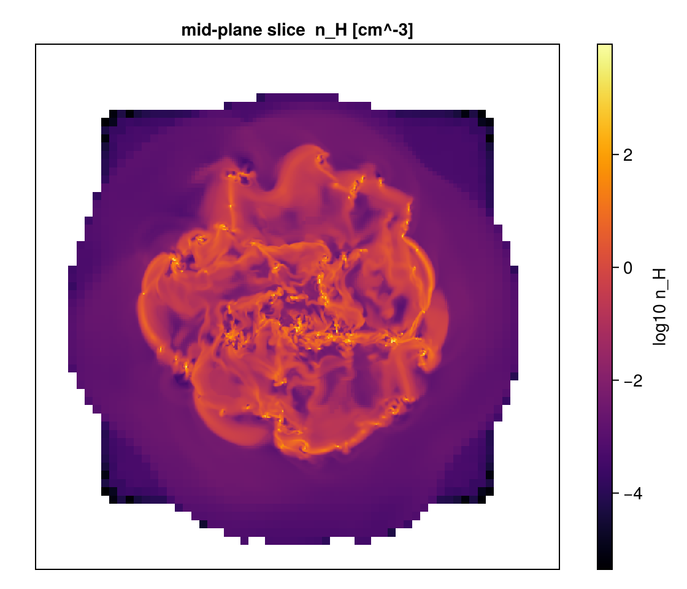

# Covering Grid / Fixed-Resolution Buffer

!!! tip "Run it yourself"
    This page is also an executable **Jupyter notebook** — [open / download `covering_grid.ipynb`](https://github.com/ManuelBehrendt/Notebooks/blob/master/Mera-Docs/version_1.1/covering_grid.ipynb). The notebooks run end-to-end and double as part of Mera's test suite.

`covering_grid` resamples the sparse AMR leaf cells onto a **dense, uniform `Nx×Ny×Nz`
array** at a chosen refinement level — every output cell sampled, *not* integrated (unlike
`projection`, which sums along a line of sight). `slice` is the 2-D, single-cell-thick version.

Use it to feed analyses that need a regular grid: power spectra, FFTs, structure functions,
volume rendering / VTK export, ML inputs, or `array`-style indexing.

> Works on **AMR cell** data only — hydro / gravity / RT. Not particles or clumps.
> A uniform grid can be far larger than the AMR data: **size it first** with
> `covering_grid_memory` (and `covering_grid` refuses to allocate past `max_bytes`).

This notebook runs on the `manu_sim_sf_L14` AMR snapshot (output 400), which spans
several refinement levels. Each cell prints real values.

```julia
using Mera
base = get(ENV, "MERA_TEST_DATA", "/Volumes/FASTStorage/Simulations/Mera-Tests")

info = getinfo(400, joinpath(base, "RAMSES/manu_sim_sf_L14"))
# lmax=10 keeps the load ~1-2 GB instead of ~10 GB. Nothing below needs more:
# the covering grid targets level 8, the sub-box and slice cap at 9.
gas  = gethydro(info, lmax=10);

println("AMR levels      : lmin ", gas.lmin, " … lmax ", gas.lmax)
println("AMR cells loaded: ", length(gas.data))
```


```
*__   __ _______ ______   _______ 
```


```
|  |_|  |       |    _ | |   _   |
|       |    ___|   | || |  |_|  |
|       |   |___|   |_||_|       |
|       |    ___|    __  |       |
| ||_|| |   |___|   |  | |   _   |
|_|   |_|_______|___|  |_|__| |__|
Mera v1.8.0
```


```
[Mera]: 2026-08-01T15:02:20.602
```


```
Code: RAMSES
output [400] summary:
mtime: 
```


```
2018-09-05T09:51:55
ctime: 2025-06-29T20:06:45.267
=======================================================
simulation time: 594.98 [Myr]
boxlen: 48.0 [kpc]
ncpu: 2048
ndim: 3
cosmological:  false
-------------------------------------------------------
amr:           true
level(s): 6 - 14 --> cellsize(s): 750.0 [pc] - 2.93 [pc]
-------------------------------------------------------
hydro:         true
hydro-variables:  
```


```
7  --> (:rho, :vx, :vy, :vz, :p, :passive_scalar_1, :passive_scalar_2)
hydro-descriptor: (:density, :velocity_x, :velocity_y, :velocity_z, :thermal_pressure, :passive_scalar_1, :passive_scalar_2)
γ: 1.6667
-------------------------------------------------------
gravity:       true
gravity-variables: (:epot, :ax, :ay, :az)
-------------------------------------------------------
particles:     true
- Npart:    5.091500e+05 
- Nstars:   5.066030e+05 
```


```
- Ndm:      2.547000e+03 
particle-variables: 5  --> (:vx, :vy, :vz, :mass, :birth)
-------------------------------------------------------
rt:            false
-------------------------------------------------------
clumps:           true
clump-variables: (:index, :lev, :parent, :ncell, :peak_x, :peak_y, :peak_z, Symbol("rho-"), Symbol("rho+"), :rho_av, :mass_cl, :relevance)
-------------------------------------------------------
namelist-file:    false
timer-file:       false
compilation-file: true
makefile:         true
patchfile:        true
=======================================================
```


```
[Mera]: Get hydro data: 2026-08-01T15:02:22.479
```


```
Key vars=(:level, :cx, :cy, :cz)
```


```
Using var(s)=(1, 2, 3, 4, 5, 6, 7) = (:rho, :vx, :vy, :vz, :p, :passive_scalar_1, :passive_scalar_2) 
```


```
domain:
```


```
xmin::xmax: 0.0 :: 1.0  	==> 0.0 [kpc] :: 48.0 [kpc]
ymin::ymax: 0.0 :: 1.0  	==> 0.0 [kpc] :: 48.0 [kpc]
zmin::zmax: 0.0 :: 1.0  	==> 0.0 [kpc] :: 48.0 [kpc]
```


```
📊 Processing Configuration:
```


```
   Total CPU files available: 2048
   Files to be processed: 2048
   Compute threads: 4
   GC threads: 4
```


Processing files:   0%|                                                  |  ETA: N/A (  N/A  s/it)


Processing files:   5%|██▌                                               |  ETA: 0:00:36 (18.71 ms/it)


Processing files:   5%|██▋                                               |  ETA: 0:00:35 (18.24 ms/it)


Processing files:   6%|██▉                                               |  ETA: 0:00:35 (17.99 ms/it)


Processing files:   6%|███▏                                              |  ETA: 0:00:34 (17.63 ms/it)


Processing files:   6%|███▎                                              |  ETA: 0:00:34 (17.83 ms/it)


Processing files:   7%|███▍                                              |  ETA: 0:00:34 (17.71 ms/it)


Processing files:   7%|███▋                                              |  ETA: 0:00:33 (17.48 ms/it)


Processing files:   8%|███▊                                              |  ETA: 0:00:33 (17.35 ms/it)


Processing files:   8%|████                                              |  ETA: 0:00:32 (17.05 ms/it)


Processing files:   8%|████▎                                             |  ETA: 0:00:31 (16.78 ms/it)


Processing files:   9%|████▍                                             |  ETA: 0:00:32 (16.97 ms/it)


Processing files:   9%|████▋                                             |  ETA: 0:00:31 (16.70 ms/it)


Processing files:  10%|█████                                             |  ETA: 0:00:30 (16.39 ms/it)


Processing files:  10%|█████▎                                            |  ETA: 0:00:29 (16.09 ms/it)


Processing files:  11%|█████▌                                            |  ETA: 0:00:29 (16.08 ms/it)


Processing files:  11%|█████▋                                            |  ETA: 0:00:29 (15.96 ms/it)


Processing files:  12%|█████▉                                            |  ETA: 0:00:28 (15.73 ms/it)


Processing files:  12%|██████▏                                           |  ETA: 0:00:28 (15.86 ms/it)


Processing files:  13%|██████▍                                           |  ETA: 0:00:28 (15.67 ms/it)


Processing files:  13%|██████▋                                           |  ETA: 0:00:28 (15.60 ms/it)


Processing files:  14%|██████▉                                           |  ETA: 0:00:27 (15.43 ms/it)


Processing files:  14%|███████▏                                          |  ETA: 0:00:27 (15.49 ms/it)


Processing files:  15%|███████▍                                          |  ETA: 0:00:27 (15.42 ms/it)


Processing files:  15%|███████▋                                          |  ETA: 0:00:27 (15.32 ms/it)


Processing files:  16%|███████▉                                          |  ETA: 0:00:26 (15.18 ms/it)


Processing files:  16%|████████                                          |  ETA: 0:00:26 (15.15 ms/it)


Processing files:  16%|████████▎                                         |  ETA: 0:00:26 (15.26 ms/it)


Processing files:  17%|████████▌                                         |  ETA: 0:00:26 (15.16 ms/it)


Processing files:  18%|████████▊                                         |  ETA: 0:00:25 (14.97 ms/it)


Processing files:  18%|█████████                                         |  ETA: 0:00:25 (14.85 ms/it)


Processing files:  19%|█████████▎                                        |  ETA: 0:00:25 (14.79 ms/it)


Processing files:  19%|█████████▌                                        |  ETA: 0:00:25 (14.84 ms/it)


Processing files:  19%|█████████▋                                        |  ETA: 0:00:25 (14.89 ms/it)


Processing files:  20%|█████████▊                                        |  ETA: 0:00:25 (14.95 ms/it)


Processing files:  20%|██████████                                        |  ETA: 0:00:24 (14.82 ms/it)


Processing files:  21%|██████████▎                                       |  ETA: 0:00:24 (14.97 ms/it)


Processing files:  21%|██████████▌                                       |  ETA: 0:00:24 (14.87 ms/it)


Processing files:  21%|██████████▊                                       |  ETA: 0:00:24 (14.84 ms/it)


Processing files:  22%|███████████                                       |  ETA: 0:00:24 (14.84 ms/it)


Processing files:  23%|███████████▎                                      |  ETA: 0:00:23 (14.67 ms/it)


Processing files:  23%|███████████▌                                      |  ETA: 0:00:23 (14.62 ms/it)


Processing files:  23%|███████████▊                                      |  ETA: 0:00:23 (14.60 ms/it)


Processing files:  24%|███████████▉                                      |  ETA: 0:00:23 (14.62 ms/it)


Processing files:  24%|████████████▏                                     |  ETA: 0:00:23 (14.63 ms/it)


Processing files:  25%|████████████▎                                     |  ETA: 0:00:23 (14.60 ms/it)


Processing files:  25%|████████████▌                                     |  ETA: 0:00:22 (14.57 ms/it)


Processing files:  25%|████████████▊                                     |  ETA: 0:00:22 (14.52 ms/it)


Processing files:  26%|█████████████                                     |  ETA: 0:00:22 (14.51 ms/it)


Processing files:  26%|█████████████▎                                    |  ETA: 0:00:22 (14.44 ms/it)


Processing files:  27%|█████████████▍                                    |  ETA: 0:00:22 (14.41 ms/it)


Processing files:  27%|█████████████▊                                    |  ETA: 0:00:21 (14.35 ms/it)


Processing files:  28%|█████████████▉                                    |  ETA: 0:00:21 (14.33 ms/it)


Processing files:  28%|██████████████▏                                   |  ETA: 0:00:21 (14.23 ms/it)


Processing files:  29%|██████████████▍                                   |  ETA: 0:00:21 (14.32 ms/it)


Processing files:  29%|██████████████▋                                   |  ETA: 0:00:21 (14.24 ms/it)


Processing files:  30%|██████████████▉                                   |  ETA: 0:00:20 (14.22 ms/it)


Processing files:  30%|███████████████▏                                  |  ETA: 0:00:20 (14.20 ms/it)


Processing files:  31%|███████████████▍                                  |  ETA: 0:00:20 (14.12 ms/it)


Processing files:  31%|███████████████▋                                  |  ETA: 0:00:20 (14.09 ms/it)


Processing files:  32%|███████████████▉                                  |  ETA: 0:00:20 (14.02 ms/it)


Processing files:  32%|████████████████▏                                 |  ETA: 0:00:19 (13.98 ms/it)


Processing files:  33%|████████████████▍                                 |  ETA: 0:00:19 (13.93 ms/it)


Processing files:  33%|████████████████▋                                 |  ETA: 0:00:19 (13.87 ms/it)


Processing files:  34%|████████████████▉                                 |  ETA: 0:00:19 (13.89 ms/it)


Processing files:  34%|█████████████████▏                                |  ETA: 0:00:19 (13.87 ms/it)


Processing files:  35%|█████████████████▎                                |  ETA: 0:00:19 (13.88 ms/it)


Processing files:  35%|█████████████████▌                                |  ETA: 0:00:19 (13.91 ms/it)


Processing files:  35%|█████████████████▊                                |  ETA: 0:00:18 (13.87 ms/it)


Processing files:  36%|██████████████████                                |  ETA: 0:00:18 (13.89 ms/it)


Processing files:  36%|██████████████████▎                               |  ETA: 0:00:18 (13.85 ms/it)


Processing files:  37%|██████████████████▌                               |  ETA: 0:00:18 (13.85 ms/it)


Processing files:  37%|██████████████████▋                               |  ETA: 0:00:18 (13.84 ms/it)


Processing files:  38%|███████████████████                               |  ETA: 0:00:18 (13.80 ms/it)


Processing files:  38%|███████████████████▏                              |  ETA: 0:00:17 (13.77 ms/it)


Processing files:  39%|███████████████████▍                              |  ETA: 0:00:17 (13.74 ms/it)


Processing files:  39%|███████████████████▋                              |  ETA: 0:00:17 (13.72 ms/it)


Processing files:  40%|███████████████████▉                              |  ETA: 0:00:17 (13.76 ms/it)


Processing files:  40%|████████████████████▏                             |  ETA: 0:00:17 (13.74 ms/it)


Processing files:  41%|████████████████████▍                             |  ETA: 0:00:17 (13.70 ms/it)


Processing files:  41%|████████████████████▋                             |  ETA: 0:00:16 (13.69 ms/it)


Processing files:  42%|████████████████████▉                             |  ETA: 0:00:16 (13.66 ms/it)


Processing files:  42%|█████████████████████▏                            |  ETA: 0:00:16 (13.63 ms/it)


Processing files:  43%|█████████████████████▍                            |  ETA: 0:00:16 (13.61 ms/it)


Processing files:  43%|█████████████████████▋                            |  ETA: 0:00:16 (13.60 ms/it)


Processing files:  44%|█████████████████████▉                            |  ETA: 0:00:16 (13.57 ms/it)


Processing files:  44%|██████████████████████▏                           |  ETA: 0:00:15 (13.55 ms/it)


Processing files:  45%|██████████████████████▍                           |  ETA: 0:00:15 (13.50 ms/it)


Processing files:  45%|██████████████████████▋                           |  ETA: 0:00:15 (13.48 ms/it)


Processing files:  46%|██████████████████████▉                           |  ETA: 0:00:15 (13.43 ms/it)


Processing files:  46%|███████████████████████▏                          |  ETA: 0:00:15 (13.41 ms/it)


Processing files:  47%|███████████████████████▍                          |  ETA: 0:00:15 (13.36 ms/it)


Processing files:  47%|███████████████████████▋                          |  ETA: 0:00:14 (13.33 ms/it)


Processing files:  48%|███████████████████████▉                          |  ETA: 0:00:14 (13.30 ms/it)


Processing files:  48%|████████████████████████▏                         |  ETA: 0:00:14 (13.29 ms/it)


Processing files:  49%|████████████████████████▍                         |  ETA: 0:00:14 (13.28 ms/it)


Processing files:  49%|████████████████████████▌                         |  ETA: 0:00:14 (13.28 ms/it)


Processing files:  50%|████████████████████████▊                         |  ETA: 0:00:14 (13.25 ms/it)


Processing files:  50%|█████████████████████████                         |  ETA: 0:00:14 (13.26 ms/it)


Processing files:  51%|█████████████████████████▎                        |  ETA: 0:00:13 (13.24 ms/it)


Processing files:  51%|█████████████████████████▌                        |  ETA: 0:00:13 (13.23 ms/it)


Processing files:  52%|█████████████████████████▊                        |  ETA: 0:00:13 (13.20 ms/it)


Processing files:  52%|██████████████████████████                        |  ETA: 0:00:13 (13.18 ms/it)


Processing files:  52%|██████████████████████████▎                       |  ETA: 0:00:13 (13.17 ms/it)


Processing files:  53%|██████████████████████████▌                       |  ETA: 0:00:13 (13.14 ms/it)


Processing files:  53%|██████████████████████████▊                       |  ETA: 0:00:13 (13.13 ms/it)


Processing files:  54%|███████████████████████████                       |  ETA: 0:00:12 (13.10 ms/it)


Processing files:  55%|███████████████████████████▎                      |  ETA: 0:00:12 (13.07 ms/it)


Processing files:  55%|███████████████████████████▌                      |  ETA: 0:00:12 (13.06 ms/it)


Processing files:  55%|███████████████████████████▊                      |  ETA: 0:00:12 (13.05 ms/it)


Processing files:  56%|████████████████████████████                      |  ETA: 0:00:12 (13.03 ms/it)


Processing files:  56%|████████████████████████████▎                     |  ETA: 0:00:12 (13.02 ms/it)


Processing files:  57%|████████████████████████████▌                     |  ETA: 0:00:11 (13.00 ms/it)


Processing files:  57%|████████████████████████████▊                     |  ETA: 0:00:11 (13.00 ms/it)


Processing files:  58%|█████████████████████████████                     |  ETA: 0:00:11 (12.97 ms/it)


Processing files:  59%|█████████████████████████████▎                    |  ETA: 0:00:11 (12.93 ms/it)


Processing files:  59%|█████████████████████████████▌                    |  ETA: 0:00:11 (12.91 ms/it)


Processing files:  60%|█████████████████████████████▊                    |  ETA: 0:00:11 (12.89 ms/it)


Processing files:  60%|██████████████████████████████                    |  ETA: 0:00:11 (12.87 ms/it)


Processing files:  61%|██████████████████████████████▎                   |  ETA: 0:00:10 (12.85 ms/it)


Processing files:  61%|██████████████████████████████▌                   |  ETA: 0:00:10 (12.84 ms/it)


Processing files:  61%|██████████████████████████████▊                   |  ETA: 0:00:10 (12.84 ms/it)


Processing files:  62%|██████████████████████████████▉                   |  ETA: 0:00:10 (12.85 ms/it)


Processing files:  62%|███████████████████████████████▏                  |  ETA: 0:00:10 (12.87 ms/it)


Processing files:  63%|███████████████████████████████▍                  |  ETA: 0:00:10 (12.87 ms/it)


Processing files:  63%|███████████████████████████████▋                  |  ETA: 0:00:10 (12.89 ms/it)


Processing files:  64%|███████████████████████████████▊                  |  ETA: 0:00:10 (12.88 ms/it)


Processing files:  64%|████████████████████████████████                  |  ETA: 0:00:10 (12.89 ms/it)


Processing files:  64%|████████████████████████████████▏                 |  ETA: 0:00:09 (12.93 ms/it)


Processing files:  65%|████████████████████████████████▍                 |  ETA: 0:00:09 (12.92 ms/it)


Processing files:  65%|████████████████████████████████▋                 |  ETA: 0:00:09 (12.93 ms/it)


Processing files:  66%|████████████████████████████████▊                 |  ETA: 0:00:09 (12.93 ms/it)


Processing files:  66%|█████████████████████████████████                 |  ETA: 0:00:09 (12.96 ms/it)


Processing files:  66%|█████████████████████████████████▏                |  ETA: 0:00:09 (12.95 ms/it)


Processing files:  67%|█████████████████████████████████▍                |  ETA: 0:00:09 (12.95 ms/it)


Processing files:  67%|█████████████████████████████████▋                |  ETA: 0:00:09 (12.96 ms/it)


Processing files:  68%|█████████████████████████████████▊                |  ETA: 0:00:09 (12.96 ms/it)


Processing files:  68%|██████████████████████████████████                |  ETA: 0:00:09 (12.96 ms/it)


Processing files:  68%|██████████████████████████████████▎               |  ETA: 0:00:08 (12.95 ms/it)


Processing files:  69%|██████████████████████████████████▌               |  ETA: 0:00:08 (12.92 ms/it)


Processing files:  69%|██████████████████████████████████▊               |  ETA: 0:00:08 (12.93 ms/it)


Processing files:  70%|██████████████████████████████████▉               |  ETA: 0:00:08 (12.92 ms/it)


Processing files:  70%|███████████████████████████████████▏              |  ETA: 0:00:08 (12.90 ms/it)


Processing files:  71%|███████████████████████████████████▍              |  ETA: 0:00:08 (12.88 ms/it)


Processing files:  71%|███████████████████████████████████▊              |  ETA: 0:00:08 (12.87 ms/it)


Processing files:  72%|████████████████████████████████████              |  ETA: 0:00:07 (12.85 ms/it)


Processing files:  72%|████████████████████████████████████▎             |  ETA: 0:00:07 (12.84 ms/it)


Processing files:  73%|████████████████████████████████████▌             |  ETA: 0:00:07 (12.82 ms/it)


Processing files:  73%|████████████████████████████████████▊             |  ETA: 0:00:07 (12.82 ms/it)


Processing files:  74%|█████████████████████████████████████             |  ETA: 0:00:07 (12.81 ms/it)


Processing files:  74%|█████████████████████████████████████▎            |  ETA: 0:00:07 (12.80 ms/it)


Processing files:  75%|█████████████████████████████████████▌            |  ETA: 0:00:07 (12.81 ms/it)


Processing files:  75%|█████████████████████████████████████▋            |  ETA: 0:00:06 (12.80 ms/it)


Processing files:  76%|██████████████████████████████████████            |  ETA: 0:00:06 (12.78 ms/it)


Processing files:  76%|██████████████████████████████████████▏           |  ETA: 0:00:06 (12.78 ms/it)


Processing files:  77%|██████████████████████████████████████▍           |  ETA: 0:00:06 (12.78 ms/it)


Processing files:  77%|██████████████████████████████████████▋           |  ETA: 0:00:06 (12.76 ms/it)


Processing files:  78%|██████████████████████████████████████▉           |  ETA: 0:00:06 (12.75 ms/it)


Processing files:  78%|███████████████████████████████████████▏          |  ETA: 0:00:06 (12.76 ms/it)


Processing files:  79%|███████████████████████████████████████▎          |  ETA: 0:00:06 (12.76 ms/it)


Processing files:  79%|███████████████████████████████████████▌          |  ETA: 0:00:05 (12.76 ms/it)


Processing files:  79%|███████████████████████████████████████▊          |  ETA: 0:00:05 (12.76 ms/it)


Processing files:  80%|███████████████████████████████████████▉          |  ETA: 0:00:05 (12.81 ms/it)


Processing files:  80%|████████████████████████████████████████▏         |  ETA: 0:00:05 (12.81 ms/it)


Processing files:  81%|████████████████████████████████████████▍         |  ETA: 0:00:05 (12.86 ms/it)


Processing files:  81%|████████████████████████████████████████▌         |  ETA: 0:00:05 (12.86 ms/it)


Processing files:  81%|████████████████████████████████████████▊         |  ETA: 0:00:05 (12.86 ms/it)


Processing files:  82%|█████████████████████████████████████████         |  ETA: 0:00:05 (12.86 ms/it)


Processing files:  82%|█████████████████████████████████████████▎        |  ETA: 0:00:05 (12.86 ms/it)


Processing files:  83%|█████████████████████████████████████████▌        |  ETA: 0:00:04 (12.84 ms/it)


Processing files:  83%|█████████████████████████████████████████▊        |  ETA: 0:00:04 (12.84 ms/it)


Processing files:  84%|█████████████████████████████████████████▉        |  ETA: 0:00:04 (12.85 ms/it)


Processing files:  84%|██████████████████████████████████████████▏       |  ETA: 0:00:04 (12.85 ms/it)


Processing files:  85%|██████████████████████████████████████████▎       |  ETA: 0:00:04 (12.89 ms/it)


Processing files:  85%|██████████████████████████████████████████▌       |  ETA: 0:00:04 (12.89 ms/it)


Processing files:  86%|██████████████████████████████████████████▊       |  ETA: 0:00:04 (12.87 ms/it)


Processing files:  86%|███████████████████████████████████████████       |  ETA: 0:00:04 (12.87 ms/it)


Processing files:  87%|███████████████████████████████████████████▍      |  ETA: 0:00:04 (12.86 ms/it)


Processing files:  87%|███████████████████████████████████████████▋      |  ETA: 0:00:03 (12.85 ms/it)


Processing files:  88%|███████████████████████████████████████████▉      |  ETA: 0:00:03 (12.84 ms/it)


Processing files:  88%|████████████████████████████████████████████▏     |  ETA: 0:00:03 (12.83 ms/it)


Processing files:  89%|████████████████████████████████████████████▍     |  ETA: 0:00:03 (12.83 ms/it)


Processing files:  89%|████████████████████████████████████████████▌     |  ETA: 0:00:03 (12.84 ms/it)


Processing files:  90%|████████████████████████████████████████████▊     |  ETA: 0:00:03 (12.83 ms/it)


Processing files:  90%|█████████████████████████████████████████████     |  ETA: 0:00:03 (12.83 ms/it)


Processing files:  90%|█████████████████████████████████████████████▎    |  ETA: 0:00:02 (12.82 ms/it)


Processing files:  91%|█████████████████████████████████████████████▌    |  ETA: 0:00:02 (12.81 ms/it)


Processing files:  92%|█████████████████████████████████████████████▉    |  ETA: 0:00:02 (12.79 ms/it)


Processing files:  92%|██████████████████████████████████████████████▏   |  ETA: 0:00:02 (12.80 ms/it)


Processing files:  93%|██████████████████████████████████████████████▎   |  ETA: 0:00:02 (12.81 ms/it)


Processing files:  93%|██████████████████████████████████████████████▌   |  ETA: 0:00:02 (12.79 ms/it)


Processing files:  94%|██████████████████████████████████████████████▊   |  ETA: 0:00:02 (12.79 ms/it)


Processing files:  94%|███████████████████████████████████████████████   |  ETA: 0:00:02 (12.79 ms/it)


Processing files:  94%|███████████████████████████████████████████████▎  |  ETA: 0:00:01 (12.78 ms/it)


Processing files:  95%|███████████████████████████████████████████████▌  |  ETA: 0:00:01 (12.77 ms/it)


Processing files:  96%|███████████████████████████████████████████████▊  |  ETA: 0:00:01 (12.76 ms/it)


Processing files:  96%|████████████████████████████████████████████████  |  ETA: 0:00:01 (12.75 ms/it)


Processing files:  96%|████████████████████████████████████████████████▎ |  ETA: 0:00:01 (12.76 ms/it)


Processing files:  97%|████████████████████████████████████████████████▍ |  ETA: 0:00:01 (12.76 ms/it)


Processing files:  97%|████████████████████████████████████████████████▋ |  ETA: 0:00:01 (12.77 ms/it)


Processing files:  98%|████████████████████████████████████████████████▉ |  ETA: 0:00:01 (12.76 ms/it)


Processing files:  98%|█████████████████████████████████████████████████▏|  ETA: 0:00:00 (12.76 ms/it)


Processing files:  99%|█████████████████████████████████████████████████▎|  ETA: 0:00:00 (12.78 ms/it)


Processing files:  99%|█████████████████████████████████████████████████▌|  ETA: 0:00:00 (12.77 ms/it)


Processing files:  99%|█████████████████████████████████████████████████▊|  ETA: 0:00:00 (12.77 ms/it)


Processing files:  99%|█████████████████████████████████████████████████▉|  ETA: 0:00:00 (12.80 ms/it)


Processing files: 100%|██████████████████████████████████████████████████| Time: 0:00:26 (12.82 ms/it)


```
✓ File processing complete! Combining results...
✓ Data combination complete!
```


```
Final data size: 4879946 cells, 7 variables
Creating Table from 4879946 cells with max 4 threads...
```


```
  Threading: 4 threads for 11 columns
  Max threads requested: 4
  Available threads: 4
  Using parallel processing with 4 threads
```


```
  Creating IndexedTable with 11 columns...
✓ Table created in 6.847 seconds
```


```
Memory used for data table :409.54250621795654
```


```
 MB
-------------------------------------------------------
```


```
AMR levels      : lmin 6 … lmax 10
AMR cells loaded: 4879946
```


## Estimate the memory first

`covering_grid_memory` returns a `NamedTuple` with `dims`, `ncells`, `bytes_per_array`,
`result_bytes`, `peak_bytes` (construction high-water mark) and the `blowup` factor
(output cells ÷ AMR cells) — so you can size a grid *before* building it.

```julia
# pick a modest target level so the uniform grid stays small
L = min(gas.lmax, 8)
mem = covering_grid_memory(gas, [:rho, :T]; lmax=L)

println("target level : ", L)
println("dims         : ", mem.dims)
println("ncells       : ", mem.ncells)
println("per array    : ", round(mem.bytes_per_array/1e6, digits=2), " MB")
println("result bytes : ", round(mem.result_bytes/1e6, digits=2), " MB")
println("peak build   : ", round(mem.peak_bytes/1e6, digits=2), " MB")
println("blow-up x    : ", mem.blowup)
```

```
covering_grid memory estimate:
```


```
  level 8  dims (256, 256, 256)  (16777216 cells × 2 var(s))
  per array : 134.2 MB
  result    : 268.4 MB
  peak build: 402.7 MB
  AMR cells : 4879946   blow-up ×3.438
target level : 8
dims         : 
```


```
(256, 256, 256)
ncells       : 16777216
per array    : 134.22 MB
result bytes : 268.44 MB
peak build   : 402.65 MB
blow-up x    : 3.437992141716322
```


## Build the 3-D grid

Pass the variables (and optional units). The result indexes like `cg[:rho]` → the dense array,
with `cg.cellsize` and `cg.extent` carrying the physical geometry.

```julia
cg = covering_grid(gas, [:rho, :T], [:nH, :K]; lmax=L)

println(cg)
println("rho array size : ", size(cg[:rho]))
println("cellsize       : ", round(cg.cellsize, sigdigits=4), " [", cg.pos_unit, "]")
println("extent         : ", round.(cg.extent, sigdigits=4))
println("n_H  extrema   : ", extrema(filter(!isnan, cg[:rho])))
println("T    extrema   : ", extrema(filter(!isnan, cg[:T])))
```

```
CoveringGridResult [covering_grid]  level 8  dims (256, 256, 256)
```


```
  vars: [:T, :rho]
  cellsize 0.1875 [standard]  extent [0.0, 48.0, 0.0, 48.0, 0.0, 48.0] [standard]
CoveringGridResult [covering_grid]  level 8  dims (256, 256, 256)
  vars: [:T, :rho]
  cellsize 0.1875 [standard]  extent [0.0, 48.0, 0.0, 48.0, 0.0, 48.0] [standard]
```


```
rho array size : (256, 256, 256)
cellsize       : 0.1875 [standard]
extent         : 
```


```
[0.0, 48.0, 0.0, 48.0, 0.0, 48.0]
n_H  extrema   : 
```


```
(-0.008466240027971665, 3045.6332385438423)
T    extrema   : 
```


```
(-6.486657006516816e10, 8.403483574667937e10)
```


### Restrict to a sub-box

Giving a `center` + `xrange`/`yrange`/`zrange` (in any unit) builds the grid only there — much
cheaper, so you can afford a finer `lmax`.

```julia
cgsub = covering_grid(gas, :rho; lmax=min(gas.lmax,9), center=[:bc],
                      xrange=[-0.2,0.2], yrange=[-0.2,0.2], zrange=[-0.1,0.1], range_unit=:kpc)

println("sub-box dims : ", cgsub.dims)
println("sub-box rho  : ", extrema(filter(!isnan, cgsub[:rho])))
```

```
CoveringGridResult [covering_grid]  level 9  dims (4, 4, 2)
```


```
  vars: [:rho]
  cellsize 0.09375 [standard]  extent [23.8, 24.2, 23.8, 24.2, 23.9, 24.1] [standard]
sub-box dims : (4, 4, 2)
sub-box rho  : (0.00017703226697282596, 0.00044784554337320054)
```


## 2-D slice (FRB)

`slice` is the single-cell-thick version: the same resampling, but only the requested layer is
built. `slice_pos` is in `slice_unit` (`:standard` ⇒ a fraction of the box), and `result.extent`
keeps all six bounds so you always know where the cut sits in 3-D.

```julia
sl = slice(gas, :rho, :nH; slice_axis=:z, slice_pos=0.5, lmax=min(gas.lmax,9))

println(sl)
println("slice axis  : ", sl.slice_axis)
println("slice dims  : ", size(sl[:rho]), "  (2-D)")
println("n_H extrema : ", extrema(filter(!isnan, sl[:rho])))
```

```
CoveringGridResult [slice(z)]  level 9  dims (512, 512)
```


```
  vars: [:rho]
  cellsize 0.09375 [standard]  extent [0.0, 48.0, 0.0, 48.0, 24.0, 24.09] [standard]
CoveringGridResult [slice(z)]  level 9  dims (512, 512)
  vars: [:rho]
  cellsize 0.09375 [standard]  extent [0.0, 48.0, 0.0, 48.0, 24.0, 24.09] [standard]
```


```
slice axis  : z
slice dims  : (512, 512)  (2-D)
n_H extrema : (-0.008446982515435507, 9010.145363667258)
```


### Plot the mid-plane slice

A uniform level-resampled `n_H` cut — coarse de-refined regions show up as larger uniform
blocks, NaN (outside the data) is left blank.

```julia
using CairoMakie

m = sl[:rho]
fig = Figure(size=(560, 480))
ax  = Axis(fig[1,1]; title="mid-plane slice  n_H [cm^-3]", aspect=DataAspect())
hidedecorations!(ax)
hm = heatmap!(ax, log10.(ifelse.(m .> 0, m, NaN))'; colormap=:inferno)
Colorbar(fig[1,2], hm, label="log10 n_H")
fig
```


```
[ Info: Mera v1.8.0
```





That is the whole covering-grid workflow: size it, build the dense 3-D array (whole box or a
sub-box), and take 2-D FRB slices — all volume-conservative resampling of the AMR leaves.
