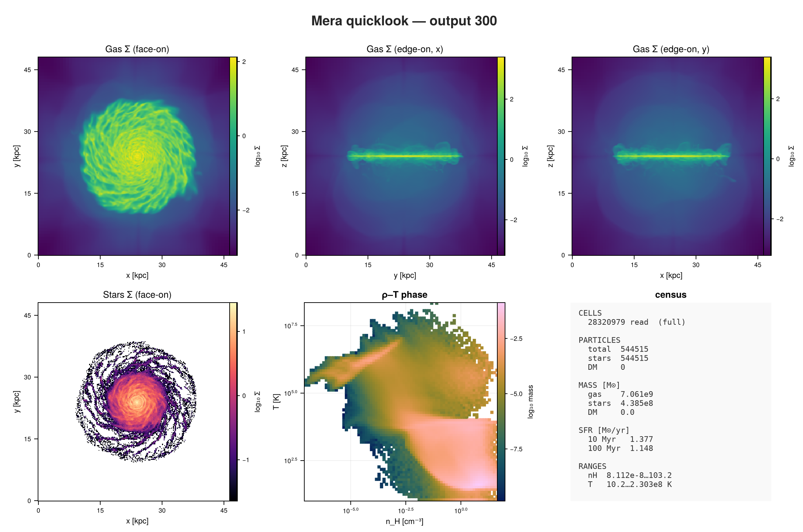

# First Look

The fastest way to get a feel for a RAMSES output — **one call, no prior setup required**.
[`quicklook`](@ref) reads the header for instant facts and does a single *budgeted* read, then prints
a compact text dashboard and returns the arrays.

```julia
using Mera

# point it at an output number + simulation directory
q = quicklook(300; path="/path/to/simulation")
```

That already prints the box size, refinement levels, finest cell, time/redshift, the cell & particle
census, component masses and the current star-formation rate — enough to understand a snapshot you have
never seen before.

## The visual dashboard

Load any Makie backend and call [`quicklookplot`](@ref) for a multi-panel figure:

```julia
using CairoMakie            # or GLMakie
fig = quicklookplot(q)
save("quicklook.png", fig)
```


*A cosmological zoom (yt sample). One call produces gas surface density along each axis (face-on + two
edge-on views), face-on stellar and dark-matter surface density when particles are present, the ρ–T
phase diagram, and a census of cell/particle counts, component masses and SFR. Axis units adapt to the
box size (kpc → Mpc), and colormaps are perceptually-uniform and colorblind-safe.*

The same call adapts to an isolated disk galaxy:



## What you get without knowing anything

- **Header facts (zero read)** — box, levels, finest cell, ncpu, fields, time/redshift, and the
  cell & particle census. Use `read=false` for a sub-second, header-only call.
- **A budgeted read** — only the coarse AMR levels are read when the full output would exceed `budget`
  cells, so even a huge run renders in seconds (the result is flagged `sampled` and labelled approximate).
- **Mass-conserving numbers** — gas/stellar/dark-matter mass and the current SFR (10/100 Myr windows).

## Next steps

- [Getting Started](00_multi_FirstSteps.md) — the guided tour of loading and analysing data.
- [Reports](report.md) — the composable form of this first look: add or replace cards
  (projections, phases, **radial profiles**, SFR, scalars …) and render to ascii / plot / file.
