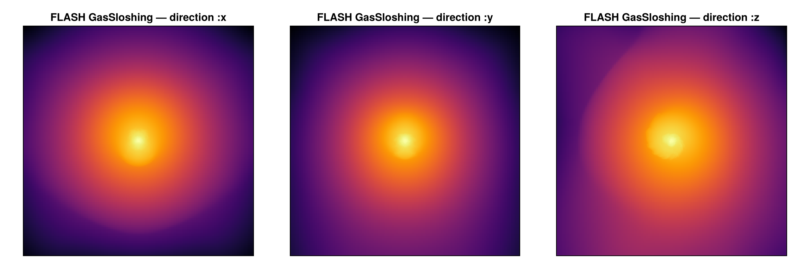

# Reading FLASH data (experimental)

Mera's analysis layer is **code-blind**: it works on a generic uniform/AMR cell list, not on
RAMSES file formats. This page adds a **frontend for the [FLASH code](https://flash.rochester.edu)**
that reads a FLASH HDF5 plot/checkpoint file into the same Mera structs — so [`getvar`](@ref),
[`projection`](@ref), [`subregion`](@ref), [`filterdata`](@ref), [`pdf`](@ref), [`clumpfind`](@ref)
and the rest run on FLASH data unchanged.

!!! note "Scope"
    3-D Cartesian, hydro and cell-centred MHD fields. FLASH uses **PARAMESH block-structured AMR**:
    a fixed `nxb×nyb×nzb` cell block per tree node, with a per-block refinement level, a physical
    bounding box, and a *node type* — only **leaf** blocks (`node type == 1`) carry real data and
    are loaded. The root grid (`nblockx·nxb` cells per axis) must be a power of two. FLASH data are
    usually **CGS**; the defaults treat code units as CGS (see [Units](#Units)).

## Usage

The normal [`getinfo`](@ref) / [`gethydro`](@ref) entry points **auto-detect** FLASH from the HDF5
file — which is typically extensionless, named `…_hdf5_plt_cnt_NNNN` (plot) or `…_hdf5_chk_NNNN`
(checkpoint):

```julia
using Mera
info = getinfo(150, "/path/to/flash/run")    # finds run/*_hdf5_plt_cnt_0150, simcode = "FLASH"
gas  = gethydro(info)                          # a HydroDataType in Mera's cell convention (leaf cells)

# the whole analysis layer works unchanged:
projection(gas, :sd, :Msol_pc2)
filterdata(gas, Above(:rho, 1e-26))
```

You can also call the frontend explicitly with [`getinfo_flash`](@ref) / [`gethydro_flash`](@ref).

### Loading a spatial sub-region

`gethydro` honours the RAMSES **spatial-window** arguments `xrange`/`yrange`/`zrange` (with
`center`/`range_unit`), reading **only the leaf blocks that intersect the box** (per-block HDF5
hyperslabs) — the same yt-style I/O pruning the Athena++/Chombo readers use:

```julia
gas = gethydro(info; xrange=[-0.1, 0.1], yrange=[-0.1, 0.1], zrange=[-0.1, 0.1],
               center=[:bc], range_unit=:standard)     # central 20 % box
```

Because Mera keeps the leaf cells, the window is an exact, hole-free filter; the returned object
records it in `gas.ranges`. Resolution/level is an analysis-time choice (`projection(…, res=)`).

!!! note "What is available per data type"
    Data is loaded per type, exactly as for RAMSES — a FLASH plot file is **hydro + cell-centred
    MHD only** here, so you call [`gethydro`](@ref); gravity/particles are not read in v1.

## Worked example: the yt GasSloshing sample

A good test on real data is the **GasSloshing** snapshot from the
[yt sample-data collection](https://yt-project.org/data/) — a 3-D galaxy-cluster gas-sloshing run
(`16³` root grid, PARAMESH levels 4–7, 16³-cell blocks, CGS units). `getinfo` auto-detects it and
prints the overview:

```julia
julia> info = getinfo(150, "/data/flash_gassloshing/GasSloshing");

Code: FLASH
output: 150  time: 1.1835e17 [code units]
root grid: 16³ (level 4), FLASH lrefine 4:7 ⇒ levels 7:10, boxlen = 7.40544e24
blocks: 2169 (16³ cells each)   variables: (rho, temp, p, gpot, divb, vx, vy, vz, bx, by, bz, magp)
-------------------------------------------------------
```

The PARAMESH hierarchy maps to `levelmin:levelmax = 7:10`; loading and projecting is then the
ordinary Mera workflow — here the log column density along each axis (the sloshing cold front shows
as the asymmetric central gas):

```julia
gas = gethydro(info)                              # ~7.8M leaf cells, in Mera's cell convention
projection(gas, :sd, res=512, center=[:bc], direction=:z)
```



## Units

FLASH writes data in **CGS** by default and does not store separate scale factors, so the defaults
(`unit_* = 1`) treat code units as CGS — `getvar`/`projection` conversions to `:kpc`/`:Msol`/… are
then already physical. For a run in scaled units, pass the CGS `unit_length`/`unit_density`/
`unit_velocity` (same convention as [`getinfo_athena`](@ref)):

```julia
info = getinfo_flash(150, "/path/to/run"; unit_length=3.086e21, unit_density=1.67e-24, unit_velocity=1e5)
```

## Variable names

FLASH `unknown names` are mapped to Mera's canonical symbols: `dens→:rho`, `pres→:p`,
`velx/y/z→:vx/:vy/:vz`, `magx/y/z→:bx/:by/:bz` (and `temp`, `gpot`, `ener→:Etot`, `eint`). Unmapped
names (e.g. `divb`, `magp`) pass through as-is.

## How it maps onto Mera's grid

FLASH refinement level `L` is 1-based (level 1 = the `nblockx·nxb`-per-axis root grid). A leaf block
at level `L` contributes cells with

```
level = log2(nblockx·nxb) + (L − 1)
cx    = round((block_xlo − xmin) / dx) + a     # a = 1…nxb, 1-based on the level-L cell lattice
```

(and likewise `cy`, `cz`, with `dx = boxlen / 2^level`) — the same 1-based level-lattice indexing
the RAMSES/PLUTO/Athena++ readers use. The mapping is verified two ways: a data-free contract test
(`test/58_flash_reader_tests.jl`) checks a value written at a known cell reads back at the right
`(:level,:cx,:cy,:cz)`, and on the real sample the leaf cells **tile the box exactly**
(`Σ cell volume = boxlen³`), proving there are no gaps or overlaps.

## Reference readers

This frontend is built to agree with FLASH's own tooling and the community readers, the *origin* of
the format and its selection semantics:

- **[yt](https://yt-project.org)** — its `flash` frontend reads FLASH HDF5 lazily through *data
  objects* (`ds.box`, `ds.sphere`, `ds.r[...]`), touching only the blocks a region intersects.
  Mera's spatial selection mirrors that on the leaf-cell list. The GasSloshing sample above comes
  from the [yt sample-data collection](https://yt-project.org/data/).
- **The FLASH user guide** ([output formats](https://flash.rochester.edu)) — defines the HDF5
  layout (`bounding box`, `refine level`, `node type`, `unknown names`, the runtime-parameter
  compounds) this reader parses.

FLASH data are CGS, as both assume — supply the run's units explicitly only if it used scaled units.

## See also

- [`getvar`](@ref), [`projection`](@ref), [`subregion`](@ref), [`pdf`](@ref) — the analysis that now runs on FLASH data.
- [Reading Athena++ data](athena_reader.md) / [Reading PLUTO data](pluto_reader.md) — the sibling multi-code readers.
