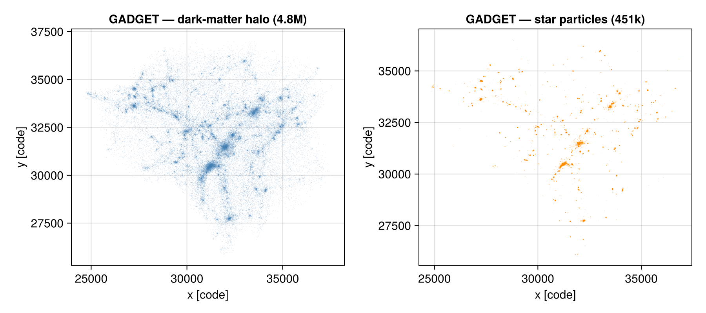

# Reading GADGET data (experimental)

Mera's analysis layer is **code-blind**, so a reader only has to fill the standard structs. This
page adds a **frontend for the [GADGET](https://wwwmpa.mpa-garching.mpg.de/gadget4/) HDF5 snapshot
format** — also written by **GIZMO, AREPO, SWIFT, EAGLE and IllustrisTNG** — so [`getvar`](@ref),
[`projection`](@ref), [`msum`](@ref), [`center_of_mass`](@ref) and the rest run on its **particles**
unchanged.

!!! note "Scope"
    GADGET is particle-based (no Eulerian grid), so this is a **particle** reader: it loads the
    `PartType*` groups into a Mera [`PartDataType`](@ref) via [`getparticles`](@ref). For **gas**
    (`PartType0`, e.g. AREPO/TNG) the cell fields present in the file are read as columns —
    `Density→:rho`, `InternalEnergy→:u`, `ElectronAbundance→:ne`, `GFM_Metallicity→:metallicity`,
    `StarFormationRate→:sfr` — and `:volume = mass/ρ` is derived; [`getvar`](@ref) adds `:T`, `:p`,
    `:cs` (temperature from `:u`+`:ne`, with a neutral-primordial μ fallback when `:ne` is absent).
    Base CGS units are read from the snapshot `Header`, and for cosmological runs the
    comoving→physical `a`/`h` factors are applied automatically. 3-D.

## Usage

`getinfo` / `getparticles` **auto-detect** GADGET from the HDF5 `Header` group:

```julia
using Mera
info = getinfo(200, "/path/to/gadget/run")   # finds snap…_200.hdf5, simcode = "GADGET"
part = getparticles(info)                      # a PartDataType (:x,:y,:z,:vx,:vy,:vz,:mass,:id,:family)

msum(part); center_of_mass(part); getvar(part, :vx)
```

`:family` is the GADGET particle type — **0** gas, **1** halo/DM, **2** disk, **3** bulge, **4**
stars, **5** boundary/BH. On a large snapshot, restrict to a subset with the frontend directly to
keep RAM bounded:

```julia
stars = getparticles_gadget(info; families=[4])      # just the star particles
dm    = getparticles_gadget(info; families=[1])      # just the dark matter
```

Masses come from each type's `Masses` dataset, or from `Header/MassTable` for types that store a
single per-type value (e.g. dark matter).

### Loading a spatial sub-region

`getparticles` honours the RAMSES **spatial-window** arguments `xrange`/`yrange`/`zrange` (with
`center`/`range_unit`). Particles outside the box are dropped **per type as they are read**, so a
sub-region of a huge snapshot never accumulates in memory:

```julia
# the central 20 % box (fractions of the box, relative to its centre)
part = getparticles(info; xrange=[-0.1, 0.1], yrange=[-0.1, 0.1], zrange=[-0.1, 0.1],
                    center=[:bc], range_unit=:standard)
```

The result equals a full load filtered by `getvar(:x)`, and the window is recorded in `part.ranges`.
Combine with `families=` (on the frontend) to load, say, only the stars in a region.

## Worked example: the yt GadgetDiskGalaxy sample

The [yt GadgetDiskGalaxy sample](https://yt-project.org/data/) is a `z ≈ 1.9` galaxy with ~11.9M
particles (4.3M gas, 4.8M DM, 2.3M disk, 451k stars). `getinfo` prints the overview:

```julia
julia> info = getinfo(200, "/data/gadget_diskgalaxy/GadgetDiskGalaxy");

Code: GADGET
output: 200  time: 0.34483  redshift: 1.9
boxlen = 64000.0
particles: 4334546 gas, 4786616 halo/DM, 2333848 disk, 450921 stars, 1149 bndry/BH  (total 11907080)
-------------------------------------------------------
```

and the particles plot directly — the dark-matter cosmic web and the star particles tracing the
forming galaxy:

```julia
dm = getparticles_gadget(info; families=[1]); st = getparticles_gadget(info; families=[4])
# scatter getvar(dm,:x) vs getvar(dm,:y), and the stars — or project with a finer lmax/res
```



## Gas analysis (AREPO / IllustrisTNG)

For **gas** (`PartType0`) the cell fields are read alongside the kinematics, so the full thermodynamic
analysis runs through the usual `getvar`/`projection` calls — in physical units:

```julia
info = getinfo(59, "/data/TNG/halo_59")          # IllustrisTNG cutout (AREPO)
gas  = getparticles(info; families=[0])           # PartType0 → :rho,:u,:ne,:metallicity,:sfr,:volume

getvar(gas, :rho, :g_cm3)                          # physical density (a/h applied for cosmological runs)
getvar(gas, :T)                                    # temperature [K] from :u (+ :ne when present)
getvar(gas, :metallicity)                          # mass-fraction metallicity

pdf(gas, :rho); profile(gas, :r_sphere, :T)        # PDFs / radial profiles on the gas
```

Maps come from the particle projection, which deposits each Voronoi cell at its position. **Extensive**
maps (surface density) are mass-conserving to machine precision (`Σ pixel·area == msum`); **intensive**
maps (temperature, metallicity) take a `weighting`:

```julia
projection(gas, :sd, :Msol_pc2)                          # surface density (mass-conserving)
projection(gas, :T, weighting=:mass)                     # mass-weighted  ⟨T⟩  (dense gas)
projection(gas, :T, weighting=:volume)                   # volume-weighted ⟨T⟩ (diffuse gas)
projection(gas, :sd, :Msol_pc2, weighting=:sph)          # SPH-kernel: smear each cell over its footprint
```

By default each Voronoi cell is deposited at its position (fast, mass-conserving). `weighting=:sph`
instead smears every cell over an **M4 cubic-spline kernel** sized from its `:volume`
(`h = α·(3V/4π)^⅓`, floored at one pixel), so the map resolves each cell's footprint instead of
speckling — still mass-conserving to machine precision (`Σ pixel·area == msum` for cells inside the
field; cells straddling the edge contribute only their in-field share). Comoving→physical `a`/`h`
is handled automatically for cosmological snapshots.

## Units

GADGET data is in **code units** (commonly length kpc/h, mass 10¹⁰ M⊙/h, velocity km/s, with `h`
the dimensionless Hubble parameter). The base CGS units are read from the `Header`
(`UnitLength/Mass/Velocity_in_*`), so `getvar(gas, :rho, :g_cm3)`, `getvar(part, :vx, :km_s)`, etc.
return physical quantities out of the box; the `unit_length`/`unit_density`/`unit_velocity` keywords
override them. Cosmological metadata (`Time` = scale factor, `Redshift`, `HubbleParam`,
`Omega0`/`OmegaLambda`) is read from the `Header`, and a run is treated as **cosmological** when
`OmegaLambda > 0`. For cosmological runs the **comoving→physical** factors are applied
automatically: positions ∝ `a/h`, density ∝ `h²/a³`, mass ∝ `1/h`, and velocities carry the `√a`
factor — so a code that returns physical values to `getvar` needs no manual `h`/`a` bookkeeping. (A
non-cosmological run, `OmegaLambda = 0`, is left untouched: `a = 1`, `Time` is a physical time.)

## How it maps onto Mera's structs

Each `PartTypeN` group has `Coordinates`/`Velocities` (`3×N`), `ParticleIDs`, and optionally
`Masses`. The reader concatenates the requested types into one [`PartDataType`](@ref) with columns
`(:x,:y,:z, :vx,:vy,:vz, :mass, :id, :family)` — positions in code units `[0, boxlen]`, exactly the
convention the RAMSES/PLUTO particle readers use, so the particle analysis works unchanged. The
mapping is verified data-free in `test/60_gadget_reader_tests.jl` (a synthesised GADGET file with a
`MassTable` fallback) and on the real GadgetDiskGalaxy sample.

## Reference readers

The GADGET HDF5 layout is shared and well-documented; this frontend agrees with the *origin* tools:

- **The GADGET snapshot specification** — the `Header` + `PartType*` group format (`Coordinates`/
  `Velocities`/`Masses`/`ParticleIDs`, `Header/MassTable`/`BoxSize`/…), documented in the
  [GADGET-4 guide](https://wwwmpa.mpa-garching.mpg.de/gadget4/) and reused by GIZMO, AREPO, SWIFT,
  EAGLE and IllustrisTNG.
- **[yt](https://yt-project.org)** — its particle frontends read the same format and select
  sub-volumes lazily via *data objects*; Mera's load-time window mirrors that on the particle list.
  The GadgetDiskGalaxy sample used above comes from the [yt sample-data collection](https://yt-project.org/data/).

## See also

- [Multi-code support](multicode.md) — the code-blind architecture and the other readers.
- [`getparticles`](@ref), [`getvar`](@ref), [`projection`](@ref) — the particle analysis that runs on GADGET data.
