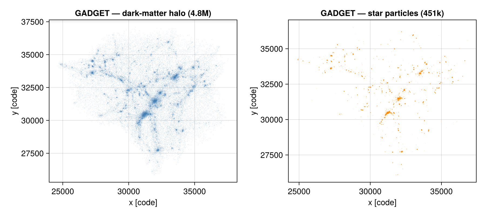

# Reading GADGET data (experimental)

!!! tip "Run it yourself"
    The GADGET particle load **and** the AREPO/IllustrisTNG gas-cell analysis below (physical
    `getvar(:rho/:T/:metallicity)`, PDFs/profiles, point and SPH-kernel maps on a real TNG halo) are
    exercised end-to-end in the runnable
    [`16_multi_OtherCodes.ipynb`](https://github.com/ManuelBehrendt/Notebooks/blob/master/Mera-Docs/version_1.1/16_multi_OtherCodes.ipynb)
    notebook, which also drives Mera's coverage.

Mera's analysis layer is **code-blind**, so a reader only has to fill the standard structs. This
page adds a **frontend for the [GADGET](https://wwwmpa.mpa-garching.mpg.de/gadget4/) HDF5 snapshot
format** — also written by **GIZMO, AREPO, SWIFT, EAGLE and IllustrisTNG** — so [`getvar`](@ref),
[`projection`](@ref), [`msum`](@ref), [`center_of_mass`](@ref) and the rest run on its **particles**
unchanged.

!!! tip "AREPO / IllustrisTNG"
    AREPO/TNG snapshots use this same format but are **auto-detected as AREPO** and get richer
    handling (gas-cell physics in physical units, comoving→physical `a`/`h`, Voronoi maps) — see the
    dedicated [AREPO page](arepo_reader.md).

!!! note "Scope"
    GADGET is particle-based (no Eulerian grid), so this is a **particle** reader: it loads the
    `PartType*` groups into a Mera [`PartDataType`](@ref) via [`getparticles`](@ref). For **gas**
    (`PartType0`, e.g. AREPO/TNG) the cell fields present in the file are read as columns —
    `Density→:rho`, `InternalEnergy→:u`, `ElectronAbundance→:ne`, `GFM_Metallicity→:metallicity`,
    `StarFormationRate→:sfr`, `NeutralHydrogenAbundance→:nh`, `Machnumber→:mach`, the `MagneticField`
    vector→`:bx,:by,:bz` (MHD, physical Gauss) — and `:volume = mass/ρ` is derived;
    [`getvar`](@ref) adds `:T`, `:p`, `:cs` (temperature from `:u`+`:ne`, with a neutral-primordial μ
    fallback when `:ne` is absent).
    `Potential→:gpot` is read for **every** family that carries it, not just gas — AREPO and
    IllustrisTNG write it in each `PartTypeN`, so `getparticles(info; families=[4])` returns a
    populated `:gpot` for the stars.

    Base CGS units are read from the snapshot `Header`, and for cosmological runs the
    comoving→physical `a`/`h` factors are applied automatically. 3-D.

## Usage

`getinfo` / `getparticles` **auto-detect** GADGET from the HDF5 `Header` group:

```julia
using Mera
info = getinfo(200, "/path/to/gadget/run")   # finds snap…_200.hdf5, simcode = "GADGET"
part = getparticles(info)                      # a PartDataType (:x,:y,:z,:vx,:vy,:vz,:mass,:id,:family)

msum(part); center_of_mass(part); getvar(part, :vx)
```

`:family` is the GADGET particle type — **0** gas, **1** halo/DM, **2** disk, **3** bulge, **4**
stars, **5** boundary/BH. On a large snapshot, restrict to a subset with the frontend directly to
keep RAM bounded:

```julia
stars = getparticles_gadget(info; families=[4])      # just the star particles
dm    = getparticles_gadget(info; families=[1])      # just the dark matter
```

Masses come from each type's `Masses` dataset, or from `Header/MassTable` for types that store a
single per-type value (e.g. dark matter).

### Loading a spatial sub-region

`getparticles` honours the RAMSES **spatial-window** arguments `xrange`/`yrange`/`zrange` (with
`center`/`range_unit`). Particles outside the box are dropped **per type as they are read**, so a
sub-region of a huge snapshot never accumulates in memory:

```julia
# the central 20 % box (fractions of the box, relative to its centre)
part = getparticles(info; xrange=[-0.1, 0.1], yrange=[-0.1, 0.1], zrange=[-0.1, 0.1],
                    center=[:bc], range_unit=:standard)
```

The result equals a full load filtered by `getvar(:x)`, and the window is recorded in `part.ranges`.
Combine with `families=` (on the frontend) to load, say, only the stars in a region.

### Selecting which columns are read

Gas cells carry many fields, and reading all of them is usually the dominant memory cost. `vars=`
limits the load to the ones you need:

```julia
gas = getparticles_gadget(info; families=[0], vars=[:rho, :u, :ne])   # + the base columns
```

The nine **base columns** (`:x, :y, :z, :vx, :vy, :vz, :mass, :id, :family`) always load — they
define the object. `vars` selects among the *stored* gas fields (`:rho, :u, :ne, :metallicity,
:sfr, :nh, :mach, :gpot, :bx, :by, :bz`) plus `:volume`, which is derived from `:rho` and pulls it
in automatically. Omit `vars` (or pass `:all`) for everything present.

Measured on a 16-chunk CAMELS snapshot, same rows each time:

| load | columns | memory | time |
|---|---|---|---|
| `vars=:all` (default) | 21 | 120.2 MB | 5.7 s |
| `vars=[:rho]` | 11 | 60.6 MB | 2.4 s |
| `vars=Symbol[]` | 9 | 50.6 MB | 1.5 s |

Derived quantities need their inputs: `getvar(:T)`, `:p` and `:cs` are computed from `:u` (and
`:T` uses `:ne` for the μ correction), so a load without `:u` raises a clear error naming what is
missing rather than failing later. An unknown symbol in `vars` is rejected immediately, listing
the valid ones.

!!! warning "`:T` is code units unless you ask for Kelvin"
    Like `:p`, `:cs` and RAMSES hydro `:T`, `getvar(gas, :T)` returns **code units** and the unit
    argument scales it: `getvar(gas, :T, :K)` for Kelvin. This matters most in filters, where the
    default is also code units:

    ```julia
    filterdata(gas, Above(:T, 1e5))              # 1e5 in CODE units — probably not what you meant
    filterdata(gas, Above(:T, 1e5; unit=:K))     # 1e5 K
    ```

    Earlier versions returned Kelvin from a bare `getvar(gas, :T)` on GADGET/AREPO gas and ignored
    the unit argument, which also made projected temperature maps a factor `scale.K` too hot. The
    convention is now consistent across data types, but a filter written against the old behaviour
    will silently select a different set of cells rather than fail.

### Halo membership: the group catalogue

A snapshot says where the gas is; the **group catalogue** says which halo it belongs to. In the
IllustrisTNG workflow membership comes from the halo finder, not from geometry — the reference
reader `illustris_python` has no spatial selection at all, only `loadHalo(id)`. Mera offers the
same idiom:

```julia
info = getinfo(33, "/path/to/TNG50-4")   # simcode = "AREPO"
gc   = getgroups(info)                    # the FoF catalogue, all chunks
gc.n                                      # number of groups
gc.GroupMassType[1, 1]                    # group 1, gas mass  [1e10 M⊙/h]

gas   = getparticles(info; families=[0], halo=0)   # exactly that group's cells
stars = getparticles(info; families=[4], halo=0)
```

The catalogue is found beside the snapshot (`basePath/groups_NNN/` next to `basePath/snapdir_NNN/`),
so pointing `getinfo` at the snapshot is enough. A **partial** catalogue is an error, not a short
answer: `getgroups` compares the groups it read against the header's `Ngroups_Total` and refuses if
they disagree — an incomplete download otherwise yields a perfectly plausible-looking mass function.

!!! note "Two conventions worth knowing"
    **No offsets file is needed.** `illustris_python` reads a separate
    `postprocessing/offsets/offsets_NNN.hdf5`, which the public API does not serve. It is
    unnecessary for FoF groups: the snapshot stores particles *ordered by group*, so a group's
    offset is the running sum of `GroupLenType`.

    **Wind particles are gas.** TNG stores them in `PartType4`, but the catalogue counts their mass
    as gas; they carry `GFM_StellarFormationTime < 0` (Mera's `:aform`). Counting them as stars
    leaves gas short and stars over *by the same amount*.

Both conventions are checked against the catalogue's own published masses. Recomputing
`GroupMassType` from the particles of TNG50-4 snapshot 33:

| halo | dark matter | gas | stars |
|---|---|---|---|
| 0 | 1.00000000 | 1.00000004 | 0.99999999 |
| 1 | 0.99999997 | 1.00000002 | 1.00000004 |
| 2 | 1.00000000 | 0.99999997 | 0.99999998 |

i.e. exact to float32 round-off. (Masses are in `1e10 M⊙/h`; convert with
`info.constants.Msol` and `info.H0/100`.)

### Mass-conserving maps: pick the pixel to suit the window

A projection deposits each cell over a stencil, so cells near the frame edge put part of that
stencil outside the map and the share is not deposited. The loss is a **boundary** effect and
shrinks as the pixel does — on a ±300 kpc window of the TNG halo:

| pixel | map | Σ(map)·pixarea / M(window) |
|---|---|---|
| 20 kpc | 31 × 31 | 0.9735 |
| 10 kpc | 61 × 61 | 0.9928 |
| 5 kpc | 121 × 121 | 0.9959 |

Nothing is wrong at 20 kpc — the missing 2.7 % is genuinely outside the frame — but if you need the
map to account for the window's mass, either use a pixel small compared with the window, or project
a frame **larger** than the region you care about and measure inside it. That is the same advice the
off-axis page gives for edge pixels, and it applies to every deposit mode.

### Multi-file (chunked) snapshots

Large runs split one snapshot across `snap_NNN.0.hdf5 … snap_NNN.K.hdf5`, usually inside a
`snapdir_NNN/` directory. Mera resolves the whole set and streams it **chunk by chunk**, so a
windowed load never holds more than one chunk at a time. Nothing extra is required — point
`getinfo` at the run directory, the `snapdir_NNN/`, or any single chunk (its siblings are gathered
automatically):

```julia
info = getinfo(24, "/path/to/run")                    # finds snapdir_024/, all 16 chunks
gas  = getparticles_gadget(info; families=[0])        # every chunk, one table
```

Two properties of real snapshots that this has to get right, and which single-file fixtures cannot
exercise:

- **A particle type may be absent from chunk 0.** Field discovery therefore scans forward until it
  finds a chunk that carries the type, rather than assuming chunk 0 is representative. (The
  reference reader `illustris_python` does the same.) Verified on a CAMELS snapshot whose
  `PartType1/4/5` appear only in later chunks — all load with their full counts.
- **Counts above 2³² are split across two header fields.** `NumPart_Total` is combined with
  `NumPart_Total_HighWord`, so a snapshot with 9.5 × 10⁹ gas cells reports that rather than the
  truncated low word.

The total is taken from the header, so for a full-box load the columns are sized once up front
instead of grown per chunk.

## Worked example: the yt GadgetDiskGalaxy sample

The [yt GadgetDiskGalaxy sample](https://yt-project.org/data/) is a `z ≈ 1.9` galaxy with ~11.9M
particles (4.3M gas, 4.8M DM, 2.3M disk, 451k stars). `getinfo` prints the overview:

```julia
julia> info = getinfo(200, "/data/gadget_diskgalaxy/GadgetDiskGalaxy");

Code: GADGET
output: 200  time: 0.34483  redshift: 1.9
boxlen = 64000.0
particles: 4334546 gas, 4786616 halo/DM, 2333848 disk, 450921 stars, 1149 bndry/BH  (total 11907080)
-------------------------------------------------------
```

and the particles plot directly — the dark-matter cosmic web and the star particles tracing the
forming galaxy:

```julia
dm = getparticles_gadget(info; families=[1]); st = getparticles_gadget(info; families=[4])
# scatter getvar(dm,:x) vs getvar(dm,:y), and the stars — or project with a finer lmax/res
```



## Gas analysis (AREPO / IllustrisTNG)

For **gas** (`PartType0`) the cell fields are read alongside the kinematics, so the full thermodynamic
analysis runs through the usual `getvar`/`projection` calls — in physical units:

```julia
info = getinfo(59, "/data/TNG/halo_59")          # IllustrisTNG cutout (AREPO)
gas  = getparticles(info; families=[0])           # PartType0 → :rho,:u,:ne,:metallicity,:sfr,:volume

getvar(gas, :rho, :g_cm3)                          # physical density (a/h applied for cosmological runs)
getvar(gas, :T, :K)                                # temperature [K] from :u (+ :ne when present)
                                                   # (omit the unit and you get code units)
getvar(gas, :metallicity)                          # mass-fraction metallicity

pdf(gas, :rho); profile(gas, :r_sphere, :T)        # PDFs / radial profiles on the gas
phase(gas, :rho, :T; xscale=:log, yscale=:log)     # mass-weighted ρ–T phase diagram
```

[`phase`](@ref) bins any two `getvar` quantities and sums the weight (mass by default), so the
usual density–temperature diagram is one call rather than a hand-rolled 2-D histogram — it
returns `xedges`, `yedges` and the `H` weight grid ready to hand to `heatmap`. Pass a third
field to get its per-bin weighted mean as well.

Maps come from the particle projection, which deposits each Voronoi cell at its position. **Extensive**
maps (surface density) are mass-conserving to machine precision (`Σ pixel·area == msum`); **intensive**
maps (temperature, metallicity) take a `weighting`:

```julia
projection(gas, :sd, :Msol_pc2)                          # surface density (mass-conserving)
projection(gas, :T, weighting=:mass)                     # mass-weighted  ⟨T⟩  (dense gas)
projection(gas, :T, weighting=:volume)                   # volume-weighted ⟨T⟩ (diffuse gas)
projection(gas, :sd, :Msol_pc2, weighting=:sph)          # SPH-kernel: smear each cell over its footprint
```

!!! note "Moving-mesh projection"
    AREPO is a **Voronoi moving-mesh** code — gas lives in irregular polyhedral cells, not on a grid
    and not as SPH particles. The default deposits each cell at its mesh-generating point (fast,
    mass-conserving, but it ignores the cell's extent and can speckle in sparse regions).
    `weighting=:sph` is the **moving-mesh conversion**: it smears every cell over an **M4
    cubic-spline kernel** sized from the cell volume (`h = α·(3V/4π)^⅓`, floored at one pixel),
    treating each Voronoi cell as an SPH-like blob ([Monaghan & Lattanzio
    1985](https://ui.adsabs.harvard.edu/abs/1985A%26A...149..135M)). It
    resolves each cell's footprint while staying mass-conserving to machine precision
    (`Σ pixel·area == msum` for cells inside the field; cells straddling the edge contribute only
    their in-field share). For a **genuinely cell-respecting** map, `weighting=:voronoi` (nearest
    generator: each line-of-sight sample is assigned to its nearest cell via a KD-tree, capped at the
    cell's effective radius) gives sharp, piecewise-constant cells — **intensive** quantities (`T`,
    metallicity) are *exact* (the column ratio cancels cell-volume errors); **surface density** is
    approximate (use `:sph`/`:mass` for conserving column mass). A fully Voronoi-exact renderer
    (analytic polyhedron–pixel clipping, as in AREPO's `ArepoVTK`) would be more faithful still but
    is rarely needed. Comoving→physical `a`/`h` is applied automatically for cosmological snapshots.

### What each scheme costs

The three schemes are not interchangeable in runtime. Measured on an AREPO zoom, 35.8 M gas
cells projected to a 513² map, single-threaded:

| `weighting` | time | |
|---|---:|---|
| `:mass` | 208 s | fast point deposition |
| `:sph` | 183 s | kernel smoothing — same cost bracket |
| `:voronoi` | **1907 s** | ~10× slower |

`:mass` and `:sph` cost about the same, so prefer `:sph` when you want a smooth map. `:voronoi`
is the outlier because its nearest-cell lookup runs per pixel against every cell. Reach for it
when you need a sharp, sampling-correct map of an *intensive* field (temperature, metallicity),
and stay on `:sph` while you are still iterating on the framing.

These were measured single-threaded. Particle projection is now threaded *inside* one map
(see [Multi-Threading](multi-threading/multi-threading_intro.md)): `:voronoi` splits the pixels
and scales well, while `:mass`/`:sph` split the particles and are memory-bandwidth bound, so
they gain roughly 2–4×. `max_threads=` caps it. A sub-volume or a coarser `pxsize` still helps.

!!! note "`:voronoi` on a cutout is not losing mass"
    Compare `sum(map) * pixsize^2` against [`msum`](@ref) on a sub-volume and `:voronoi` comes up
    a few percent short. That is a boundary effect, not a bug: `msum` counts the **whole** mass of
    every cell whose generator lies inside the region, including the part poking out through the
    boundary, while the map integrates only what is inside. So it scales with surface-over-volume
    and shrinks as the region grows — 4.2 %, 3.4 %, 1.8 %, 1.0 % for half-widths of 200, 400, 800
    and 1600 ckpc/h on an AREPO zoom. Sampling more finely (`nlos=`) converges to the same value
    rather than to 1, which is how you can tell it apart from a sampling error. `:mass` hides it
    because point deposition drops each cell's full mass at its generator. If you need an exact
    integral over a sub-volume, select a larger region than the one you measure.

!!! tip "Zooming on a halo: use `pxsize`, not `res`"
    `res` counts pixels **across the whole box** (`pixsize = boxlen/res`), so a windowed
    projection keeps only the pixels the window happens to cover. On a large box this bites
    hard: `res=512` over a ±1100 ckpc/h window works out to `pixsize = 146.5` and returns a
    **16×16** map — not the 512² the number suggests.

    Set the pixel size directly instead. `pxsize` dominates over `res`/`lmax`, and it is the
    only one of the three that means the same thing whatever the window:

    ```julia
    win = (center=[cx, cy, cz], range_unit=:kpc,
           xrange=[-R, R], yrange=[-R, R], zrange=[-R, R])
    projection(gas, :sd, :Msol_pc2; weighting=:sph, pxsize=[0.5, :kpc], win...)
    ```

## Units

GADGET data is in **code units** (commonly length kpc/h, mass 10¹⁰ M⊙/h, velocity km/s, with `h`
the dimensionless Hubble parameter). The base CGS units are read from the `Header`
(`UnitLength/Mass/Velocity_in_*`), so `getvar(gas, :rho, :g_cm3)`, `getvar(part, :vx, :km_s)`, etc.
return physical quantities out of the box; the `unit_length`/`unit_density`/`unit_velocity` keywords
override them. Cosmological metadata (`Time` = scale factor, `Redshift`, `HubbleParam`,
`Omega0`/`OmegaLambda`) is read from the `Header`, and a run is treated as **cosmological** when
`OmegaLambda > 0`. For cosmological runs the **comoving→physical** factors are applied
automatically: positions ∝ `a/h`, density ∝ `h²/a³`, mass ∝ `1/h`, and velocities carry the `√a`
factor — so a code that returns physical values to `getvar` needs no manual `h`/`a` bookkeeping. (A
non-cosmological run, `OmegaLambda = 0`, is left untouched: `a = 1`, `Time` is a physical time.)

## How it maps onto Mera's structs

Each `PartTypeN` group has `Coordinates`/`Velocities` (`3×N`), `ParticleIDs`, and optionally
`Masses`. The reader concatenates the requested types into one [`PartDataType`](@ref) with columns
`(:x,:y,:z, :vx,:vy,:vz, :mass, :id, :family)` — positions in code units `[0, boxlen]`, exactly the
convention the RAMSES/PLUTO particle readers use, so the particle analysis works unchanged. The
mapping is verified data-free in `test/60_gadget_reader_tests.jl` (a synthesised GADGET file with a
`MassTable` fallback) and on the real GadgetDiskGalaxy sample.

## Reference readers

The GADGET HDF5 layout is shared and well-documented; this frontend agrees with the *origin* tools:

- **The GADGET snapshot specification** — the `Header` + `PartType*` group format (`Coordinates`/
  `Velocities`/`Masses`/`ParticleIDs`, `Header/MassTable`/`BoxSize`/…), documented in the
  [GADGET-4 guide](https://wwwmpa.mpa-garching.mpg.de/gadget4/) and reused by GIZMO, AREPO, SWIFT,
  EAGLE and IllustrisTNG.
- **[yt](https://yt-project.org)** — its particle frontends read the same format and select
  sub-volumes lazily via *data objects*; Mera's load-time window mirrors that on the particle list.
  The GadgetDiskGalaxy sample used above comes from the [yt sample-data collection](https://yt-project.org/data/).

## See also

- [Multi-code support](multicode.md) — the code-blind architecture and the other readers.
- [`getparticles`](@ref), [`getvar`](@ref), [`projection`](@ref) — the particle analysis that runs on GADGET data.
