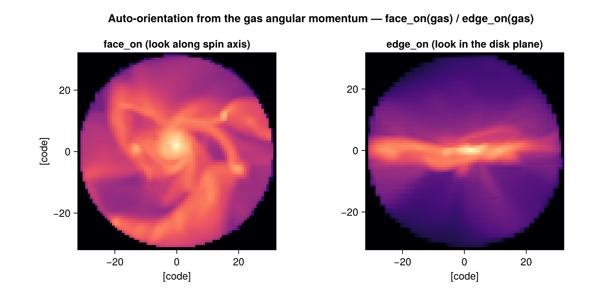

# Auto-Frame: centering & orientation

"Find the centre, then rotate to face-on / edge-on" is a ritual every disk-galaxy analysis
repeats by hand. [`center_of`](@ref) and [`face_on`](@ref) / [`edge_on`](@ref) do it from
the data: the centre from the mass distribution, the orientation from the **gas angular
momentum**. The result drops straight into [`projection`](@ref).



```julia
fr = face_on(gas)        # line of sight = the disk's spin axis
projection(gas, :sd; los=fr.los, up=fr.up, center=fr.center, range_unit=fr.center_unit)
```

## Finding the centre

[`center_of`](@ref) returns `[x, y, z]`:

```julia
center_of(gas)                    # mass-weighted centre of mass (default)
center_of(gas, method=:densest)   # position of the densest hydro cell
center_of(gas, unit=:kpc)         # in physical units
```

For `:standard` the result is a **box fraction (0–1)** — the convention that
[`projection`](@ref), [`subregion`](@ref) and `getvar(…; center=…)` expect — so it feeds
straight back into them.

## Orienting: face-on and edge-on

[`face_on`](@ref) and [`edge_on`](@ref) compute the net angular momentum **L** about the
centre and return a [`GalaxyFrame`](@ref):

- `face_on` → line of sight **along** the spin axis (look down on the disk).
- `edge_on` → line of sight **in** the disk plane, with the spin axis pointing up.

```julia
fr = face_on(gas)
fr.los       # unit vector the camera looks along
fr.up        # camera up vector
fr.center    # centre, in fr.center_unit
fr.angmom    # the net angular-momentum vector it was built from
```

Why it works without subtracting the bulk velocity: angular momentum measured about the
**centre of mass** cancels any net translation, because ``\sum_i m_i \mathbf{r}_i = 0``
there. (The same cancellation removes the Hubble flow in cosmological runs, since
``\mathbf{r} \times H\mathbf{r} = 0``.)

## Several galaxies, mergers, cosmological boxes

!!! warning "The bare call assumes one object"
    `face_on(gas)` / `center_of(gas)` use the **global** CoM and the **summed** angular
    momentum. In a box with many galaxies that is meaningless — the CoM lands between them
    and unrelated spins cancel. **Point the tool at the object** with a seed `center` plus
    an `aperture`; it then re-centres on the *local* CoM inside that sphere and measures
    only that object's spin:

    ```julia
    # the densest galaxy in the box (good first guess in a cosmological run)
    fr = face_on(gas; center=:densest, aperture=30, range_unit=:kpc)

    # a galaxy at a known/catalogued position (e.g. from a halo or clump finder)
    fr = face_on(gas; center=[x, y, z], aperture=30, range_unit=:kpc)
    ```

    Equivalently, cut the object out first and frame that:

    ```julia
    gal = subregion(gas, :sphere; center=[x,y,z], radius=30, range_unit=:kpc)
    fr  = face_on(gal)
    ```

    Because the spin is then taken about the **local** CoM, this is also the correct recipe
    for a merger progenitor and for any galaxy moving through a cosmological box. Choosing
    the `aperture` to enclose the disk (but not the neighbours) is the one judgement call.

## Options

| function | keyword | default | meaning |
|----------|---------|---------|---------|
| `center_of` | `method` | `:com` | `:com` (centre of mass) or `:densest` (densest hydro cell) |
| `center_of` | `unit` | `:standard` | output unit; `:standard` → box fraction, else physical |
| `center_of` | `mask` | `[false]` | restrict to masked cells/particles |
| `face_on`/`edge_on` | `center` | `:com` | `:com`, `:densest`, or an explicit `[x,y,z]` |
| `face_on`/`edge_on` | `aperture` | `nothing` | sphere radius (in `range_unit`) to isolate one object |
| `face_on`/`edge_on` | `range_unit` | `:standard` | unit of `center`/`aperture`/output centre |

Works on hydro and particle data (both carry mass and velocity → angular momentum).

## Method and references

**Aperture.** The `aperture` keyword is a sphere *radius* (in `range_unit`) around the seed
centre — the region within which the local centre and the spin axis are measured. The name
is borrowed from aperture photometry: only data inside the sphere contributes, which is what
isolates one object from its neighbours. `aperture=nothing` (the default) uses all the data,
which is correct only for an already-isolated object.

**Orientation.** `face_on` / `edge_on` take the net, mass-weighted angular momentum

```math
\mathbf{L} = \sum_i m_i\, \mathbf{r}_i \times \mathbf{v}_i
```

of the selected region about the centre, and use ``\hat{\mathbf{L}}`` as the spin axis (the
face-on line of sight); edge-on looks along a direction in the disc plane. This is the same
recipe the established simulation-analysis tools use — e.g. pynbody's
`angmom.faceon`/`sideon` and yt's angular-momentum / off-axis projection.

**Centring.** `:com` is the mass-weighted centre of mass; `:densest` is the density peak.
With a seed centre plus an `aperture`, the frame re-centres on the *local* CoM inside the
sphere — one iteration of the shrinking-sphere centre commonly used for haloes.

**Why no bulk-velocity subtraction.** Angular momentum about the centre of mass separates
into centre-of-mass and internal parts (König's theorem), so a net translation contributes
nothing about the CoM. The Hubble flow ``\mathbf{v} = H\mathbf{r}`` is parallel to
``\mathbf{r}``, so ``\mathbf{r} \times \mathbf{v} = 0`` — hence the recipe is also correct
in cosmological runs.

These are standard techniques in galaxy-simulation analysis rather than any single source;
the authoritative references for the ingredients:

- A. Pontzen, R. Roškar, G. Stinson, et al., *pynbody: Astrophysics Simulation Analysis for Python* (2013), Astrophysics Source Code Library, ascl:1305.002 — `faceon`/`sideon` orientation by angular momentum.
- M. J. Turk, B. D. Smith, J. S. Oishi, et al., "yt: A Multi-code Analysis Toolkit for Astrophysical Simulation Data", *ApJS* **192**, 9 (2011).
- C. Power, J. F. Navarro, A. Jenkins, et al., "The inner structure of ΛCDM haloes — I. A numerical convergence study", *MNRAS* **338**, 14 (2003) — iterative shrinking-sphere centre.
- V. Springel, N. Yoshida, S. D. M. White, "GADGET … and the SUBFIND algorithm", *MNRAS* **328**, 726 (2001) — density-peak substructure centres.
- J. Binney & S. Tremaine, *Galactic Dynamics*, 2nd ed. (Princeton University Press, 2008) — angular momentum and disc dynamics.
- H. Goldstein, C. Poole, J. Safko, *Classical Mechanics*, 3rd ed. (Addison-Wesley, 2002) — König's theorem (decomposition of angular momentum about the CoM).

## See also

- [`projection`](@ref) — consumes `los`/`up`/`center` for off-axis views.
- [`subregion`](@ref) — isolate one object before framing it.
- [`center_of_mass`](@ref), [`bulk_velocity`](@ref) — the underlying reductions.
- [Off-axis projection](06_offaxis_Projection.md) — the projection machinery the frame drives.
