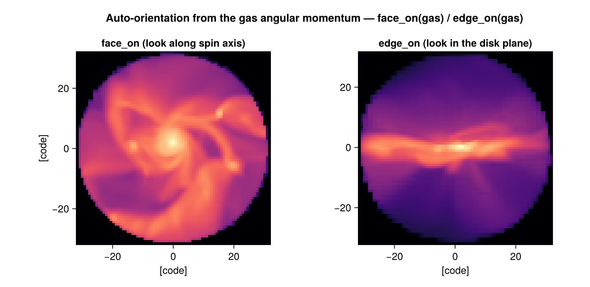
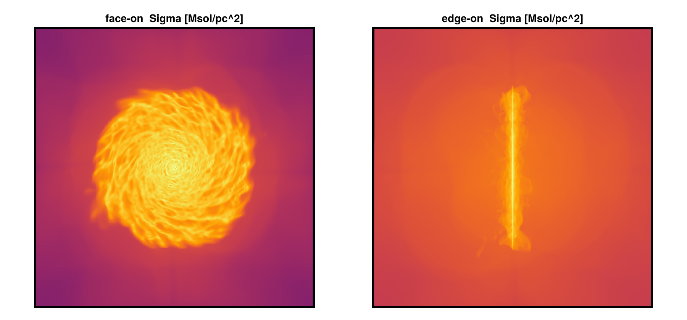

<!-- GENERATED FILE. Do not edit this markdown.
     Source notebook: galaxyframe.ipynb
     Regenerate with: MERA_DIR=<repo checkout> ./render_docs.sh
     Any edit here is lost the next time the docs are rendered. -->

# Auto-Frame: centering & orientation

!!! tip "Run it yourself"
    This page is also an executable **Jupyter notebook** — [open / download `galaxyframe.ipynb`](https://github.com/ManuelBehrendt/Notebooks/blob/master/Mera-Docs/version_1.1/galaxyframe.ipynb). The notebooks run end-to-end and double as part of Mera's test suite.


"Find the centre, then rotate to face-on / edge-on" is a ritual every disk-galaxy analysis
repeats by hand. [`center_of`](@ref) and [`face_on`](@ref) / [`edge_on`](@ref) do it from
the data: the centre from the mass distribution, the orientation from the **gas angular
momentum**. The result drops straight into [`projection`](@ref).



This notebook runs on the `mw_L10` disk-galaxy snapshot (output 300) — an isolated spiral, so
the bare `face_on(gas)` call is correct. Each cell prints the real frame it computed.

```julia
# Example-data root. Point this at your own simulation folder, or set the
# MERA_EXAMPLES environment variable; every path below is built from it.
MERA_EXAMPLES = get(ENV, "MERA_EXAMPLES", "/Volumes/FASTStorage/Simulations/Mera-Tests");

using Mera
info = getinfo(300, joinpath(MERA_EXAMPLES, "RAMSES/mw_L10"))
gas  = gethydro(info);

println("cells loaded : ", length(gas.data))
```

```
*__   __ _______ ______   _______
|  |_|  |       |    _ | |   _   |
|       |    ___|   | || |  |_|  |
|       |   |___|   |_||_|       |
|       |    ___|    __  |       |
| ||_|| |   |___|   |  | |   _   |
|_|   |_|_______|___|  |_|__| |__|
Mera v1.8.0
[Mera]: 2026-08-03T11:52:25.491
Code: RAMSES
output [300] summary:
mtime: 2023-04-09T05:34:09
ctime: 2025-06-21T18:31:24.020
=======================================================
simulation time: 445.89 [Myr]
boxlen: 48.0 [kpc]
ncpu: 640
ndim: 3
cosmological:  false
-------------------------------------------------------
amr:           true
level(s): 6 - 10 --> cellsize(s): 750.0 [pc] - 46.88 [pc]
-------------------------------------------------------
hydro:         true
hydro-variables:  7  --> (:rho, :vx, :vy, :vz, :p, :scalar_00, :scalar_01)
hydro-descriptor: (:density, :velocity_x, :velocity_y, :velocity_z, :pressure, :scalar_00, :scalar_01)
γ: 1.6667
-------------------------------------------------------
gravity:       true
gravity-variables: (:epot, :ax, :ay, :az)
-------------------------------------------------------
particles:     true
- Nstars:   5.445150e+05
particle-variables: 7  --> (:vx, :vy, :vz, :mass, :family, :tag, :birth)
particle-descriptor: (:position_x, :position_y, :position_z, :velocity_x, :velocity_y, :velocity_z, :mass, :identity, :levelp, :family, :tag, :birth_time)
-------------------------------------------------------
rt:            false
clumps:           false
-------------------------------------------------------
namelist-file: ("&COOLING_PARAMS", "&SF_PARAMS", "&AMR_PARAMS", "&BOUNDARY_PARAMS", "&OUTPUT_PARAMS", "&POISSON_PARAMS", "&RUN_PARAMS", "&FEEDBACK_PARAMS", "&HYDRO_PARAMS", "&INIT_PARAMS", "&REFINE_PARAMS")
-------------------------------------------------------
timer-file:       true
compilation-file: false
makefile:         true
patchfile:        true
=======================================================
[Mera]: Get hydro data: 2026-08-03T11:52:28.149
Key vars=(:level, :cx, :cy, :cz)
Using var(s)=(1, 2, 3, 4, 5, 6, 7) = (:rho, :vx, :vy, :vz, :p, :scalar_00, :scalar_01)
domain:
xmin::xmax: 0.0 :: 1.0  	==> 0.0 [kpc] :: 48.0 [kpc]
ymin::ymax: 0.0 :: 1.0  	==> 0.0 [kpc] :: 48.0 [kpc]
zmin::zmax: 0.0 :: 1.0  	==> 0.0 [kpc] :: 48.0 [kpc]
📊 Processing Configuration:
   Total CPU files available: 640
   Files to be processed: 640
   Compute threads: 4
   GC threads: 4
Processing files: 100%|██████████████████████████████████████████████████| Time: 0:00:18 (28.86 ms/it)
✓ File processing complete! Combining results...
✓ Data combination complete!
Final data size: 28320979 cells, 7 variables
Creating Table from 28320979 cells with max 4 threads...
  Threading: 4 threads for 11 columns
  Max threads requested: 4
  Available threads: 4
  Using parallel processing with 4 threads
  Creating IndexedTable with 11 columns...
✓ Table created in 42.044 seconds
Memory used for data table :2.321086215786636 GB
-------------------------------------------------------
cells loaded : 28320979
```

## Finding the centre

[`center_of`](@ref) returns `[x, y, z]`:

```julia
c_com     = center_of(gas)                    # mass-weighted CoM (box fraction)
c_densest = center_of(gas, method=:densest)   # densest hydro cell
c_kpc     = center_of(gas, unit=:kpc)         # CoM in physical units

println("center_of (:com,  fraction) : ", round.(c_com,     digits=5))
println("center_of (:densest)        : ", round.(c_densest, digits=5))
println("center_of (:com,  kpc)      : ", round.(c_kpc,     digits=4))
```

```
center_of (:com,  fraction) : [0.50001, 0.50046, 0.50044]
center_of (:densest)        : [0.49658, 0.50244, 0.50146]
center_of (:com,  kpc)      : [24.0003, 24.022, 24.0212]
```

For `:standard` the result is a **box fraction (0–1)** — the convention that
[`projection`](@ref), [`subregion`](@ref) and `getvar(…; center=…)` expect — so it feeds
straight back into them.

## Orienting: face-on and edge-on

[`face_on`](@ref) and [`edge_on`](@ref) compute the net angular momentum **L** about the
centre and return a [`GalaxyFrame`](@ref):

- `face_on` → line of sight **along** the spin axis (look down on the disk).
- `edge_on` → line of sight **in** the disk plane, with the spin axis pointing up.

```julia
fr = face_on(gas)

println(fr)                       # GalaxyFrame pretty-print
println()
println("los    : ", round.(fr.los,    digits=4))   # camera looks along this
println("up     : ", round.(fr.up,     digits=4))   # camera up
println("center : ", round.(fr.center, digits=5), "  [", fr.center_unit, "]")
println("angmom : ", round.(fr.angmom, sigdigits=4))
```

```
GalaxyFrame:
  center (standard) = [0.5, 0.5005, 0.5004]
  los  = [-0.0004, -0.0002, 1.0]
  up   = [-1.0, 0.0, -0.0004]
  |angmom| = 160.2
los    : [-0.0004, -0.0002, 1.0]
up     : [-1.0, 0.0, -0.0004]
center : [0.50001, 0.50046, 0.50044]  [standard]
angmom : [-0.06597, -0.03328, 160.2]
```

```julia
eo = edge_on(gas)

println(eo)
println()
println("edge-on los : ", round.(eo.los, digits=4))
println("edge-on up  : ", round.(eo.up,  digits=4))
# face-on and edge-on lines of sight are orthogonal:
println("los_faceon · los_edgeon = ", round(sum(fr.los .* eo.los), digits=6))
```

```
GalaxyFrame:
  center (standard) = [0.5, 0.5005, 0.5004]
  los  = [-0.0, 1.0, 0.0002]
  up   = [-0.0004, -0.0002, 1.0]
  |angmom| = 160.2
edge-on los : [-0.0, 1.0, 0.0002]
edge-on up  : [-0.0004, -0.0002, 1.0]
los_faceon · los_edgeon = -0.0
```

Why it works without subtracting the bulk velocity: angular momentum measured about the
**centre of mass** cancels any net translation, because ``\sum_i m_i \mathbf{r}_i = 0``
there. (The same cancellation removes the Hubble flow in cosmological runs, since
``\mathbf{r} \times H\mathbf{r} = 0``.)

## Drive a projection with the frame

Splat the frame's `los`/`up`/`center` into `projection` — face-on for morphology, edge-on for
the rotating disk.

```julia
using CairoMakie

p_face = projection(gas, :sd, :Msol_pc2; los=fr.los, up=fr.up,
                    center=fr.center, range_unit=fr.center_unit)
p_edge = projection(gas, :sd, :Msol_pc2; los=eo.los, up=eo.up,
                    center=eo.center, range_unit=eo.center_unit)

println("face-on Sigma extrema : ", extrema(p_face.maps[:sd]))
println("edge-on Sigma extrema : ", extrema(p_edge.maps[:sd]))

fig = Figure(size=(900, 420))
ax1 = Axis(fig[1,1]; title="face-on  Sigma [Msol/pc^2]", aspect=DataAspect()); hidedecorations!(ax1)
ax2 = Axis(fig[1,2]; title="edge-on  Sigma [Msol/pc^2]", aspect=DataAspect()); hidedecorations!(ax2)
heatmap!(ax1, log10.(p_face.maps[:sd]'); colormap=:inferno)
heatmap!(ax2, log10.(p_edge.maps[:sd]'); colormap=:inferno)
fig
```

```
[Mera]: 2026-08-03T11:53:58.646
center: [0.5000061, 0.5004579, 0.5004408] ==> [24.0 [kpc] :: 24.022 [kpc] :: 24.021 [kpc]]
domain:
xmin::xmax: 0.0 :: 1.0  	==> 0.0 [kpc] :: 48.0 [kpc]
ymin::ymax: 0.0 :: 1.0  	==> 0.0 [kpc] :: 48.0 [kpc]
zmin::zmax: 0.0 :: 1.0  	==> 0.0 [kpc] :: 48.0 [kpc]
Selected var(s)=(:sd,)
Weighting      = :mass
Off-axis LOS   = [-0.0004, -0.0002, 1.0]  (binning=:overlap)
Effective resolution: 1024^2  →  map size: 1038 x 1038
[Mera]: 2026-08-03T11:54:09.266
center: [0.5000061, 0.5004579, 0.5004408] ==> [24.0 [kpc] :: 24.022 [kpc] :: 24.021 [kpc]]
domain:
xmin::xmax: 0.0 :: 1.0  	==> 0.0 [kpc] :: 48.0 [kpc]
ymin::ymax: 0.0 :: 1.0  	==> 0.0 [kpc] :: 48.0 [kpc]
zmin::zmax: 0.0 :: 1.0  	==> 0.0 [kpc] :: 48.0 [kpc]
Selected var(s)=(:sd,)
Weighting      = :mass
Off-axis LOS   = [-0.0, 1.0, 0.0002]  (binning=:overlap)
Effective resolution: 1024^2  →  map size: 1038 x 1038
face-on Sigma extrema : (0.0, 200.81405317206742)
edge-on Sigma extrema : (0.0, 6539.3160386012305)
```



## Several galaxies, mergers, cosmological boxes

!!! warning "The bare call assumes one object"
    `face_on(gas)` / `center_of(gas)` use the **global** CoM and the **summed** angular
    momentum. In a box with many galaxies that is meaningless — the CoM lands between them
    and unrelated spins cancel. **Point the tool at the object** with a seed `center` plus
    an `aperture`; it then re-centres on the *local* CoM inside that sphere and measures
    only that object's spin:

    ```julia
    # the densest galaxy in the box (good first guess in a cosmological run)
    fr = face_on(gas; center=:densest, aperture=30, range_unit=:kpc)

    # a galaxy at a known/catalogued position (e.g. from a halo or clump finder)
    fr = face_on(gas; center=[x, y, z], aperture=30, range_unit=:kpc)
    ```

    Equivalently, cut the object out first and frame that:

    ```julia
    gal = subregion(gas, :sphere; center=[x,y,z], radius=30, range_unit=:kpc)
    fr  = face_on(gal)
    ```

    Because the spin is then taken about the **local** CoM, this is also the correct recipe
    for a merger progenitor and for any galaxy moving through a cosmological box. Choosing
    the `aperture` to enclose the disk (but not the neighbours) is the one judgement call.

`mw_L10` is isolated, so here we just demonstrate the aperture form locks onto the disk.

```julia
fr_ap = face_on(gas; center=:densest, aperture=30, range_unit=:kpc)

println(fr_ap)
println("aperture-framed center [kpc] : ", round.(fr_ap.center, digits=4))
```

```
GalaxyFrame:
  center (kpc) = [24.0003, 24.022, 24.0212]
  los  = [-0.0004, -0.0002, 1.0]
  up   = [-1.0, 0.0, -0.0004]
  |angmom| = 160.2
aperture-framed center [kpc] : [24.0003, 24.022, 24.0212]
```

## Options

| function | keyword | default | meaning |
|----------|---------|---------|---------|
| `center_of` | `method` | `:com` | `:com` (centre of mass) or `:densest` (densest hydro cell) |
| `center_of` | `unit` | `:standard` | output unit; `:standard` → box fraction, else physical |
| `center_of` | `mask` | `[false]` | restrict to masked cells/particles |
| `face_on`/`edge_on` | `center` | `:com` | `:com`, `:densest`, or an explicit `[x,y,z]` |
| `face_on`/`edge_on` | `aperture` | `nothing` | sphere radius (in `range_unit`) to isolate one object |
| `face_on`/`edge_on` | `range_unit` | `:standard` | unit of `center`/`aperture`/output centre |

Works on hydro and particle data (both carry mass and velocity → angular momentum).

## Method and references

**Aperture.** The `aperture` keyword is a sphere *radius* (in `range_unit`) around the seed
centre — the region within which the local centre and the spin axis are measured. The name
is borrowed from aperture photometry: only data inside the sphere contributes, which is what
isolates one object from its neighbours. `aperture=nothing` (the default) uses all the data,
which is correct only for an already-isolated object.

**Orientation.** `face_on` / `edge_on` take the net, mass-weighted angular momentum

```math
\mathbf{L} = \sum_i m_i\, \mathbf{r}_i \times \mathbf{v}_i
```

of the selected region about the centre, and use ``\hat{\mathbf{L}}`` as the spin axis (the
face-on line of sight); edge-on looks along a direction in the disc plane. This is the standard
angular-momentum recipe for orienting disc galaxies.

**Centring.** `:com` is the mass-weighted centre of mass; `:densest` is the density peak.
With a seed centre plus an `aperture`, the frame re-centres on the *local* CoM inside the
sphere — one iteration of the shrinking-sphere centre commonly used for haloes.

**Why no bulk-velocity subtraction.** Angular momentum about the centre of mass separates
into centre-of-mass and internal parts (König's theorem), so a net translation contributes
nothing about the CoM. The Hubble flow ``\mathbf{v} = H\mathbf{r}`` is parallel to
``\mathbf{r}``, so ``\mathbf{r} \times \mathbf{v} = 0`` — hence the recipe is also correct
in cosmological runs.

These are standard techniques in galaxy-simulation analysis rather than any single source;
the authoritative references for the ingredients:

- A. Pontzen, R. Roškar, G. Stinson, et al., *pynbody: Astrophysics Simulation Analysis for Python* (2013), Astrophysics Source Code Library, ascl:1305.002 — `faceon`/`sideon` orientation by angular momentum.
- M. J. Turk, B. D. Smith, J. S. Oishi, et al., "yt: A Multi-code Analysis Toolkit for Astrophysical Simulation Data", *ApJS* **192**, 9 (2011).
- C. Power, J. F. Navarro, A. Jenkins, et al., "The inner structure of ΛCDM haloes — I. A numerical convergence study", *MNRAS* **338**, 14 (2003) — iterative shrinking-sphere centre.
- V. Springel, N. Yoshida, S. D. M. White, "GADGET … and the SUBFIND algorithm", *MNRAS* **328**, 726 (2001) — density-peak substructure centres.
- J. Binney & S. Tremaine, *Galactic Dynamics*, 2nd ed. (Princeton University Press, 2008) — angular momentum and disc dynamics.
- H. Goldstein, C. Poole, J. Safko, *Classical Mechanics*, 3rd ed. (Addison-Wesley, 2002) — König's theorem (decomposition of angular momentum about the CoM).

## See also

- [`projection`](@ref) — consumes `los`/`up`/`center` for off-axis views.
- [`subregion`](@ref) — isolate one object before framing it.
- [`center_of_mass`](@ref), [`bulk_velocity`](@ref) — the underlying reductions.
- [Off-axis projection](06_offaxis_Projection.md) — the projection machinery the frame drives.
