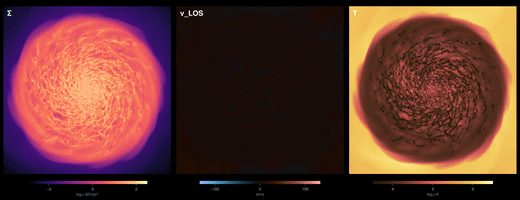

# Gallery and shared workflows

Complete recipes that do one thing end to end, written so you can point them at your own simulation
and run them. They live beside the tutorial notebooks, in the
[Notebooks repository](https://github.com/ManuelBehrendt/Notebooks/tree/master/Mera-Docs/version_1.1/gallery).

The tutorial pages on this site teach one function at a time. A gallery recipe is the other shape:
a whole workflow, start to finish, with the reasoning written down. Download it, change two lines,
run it.

## What is there

| recipe | what it makes |
|---|---|
| [A spun-coin movie of your own galaxy](https://github.com/ManuelBehrendt/Notebooks/blob/master/Mera-Docs/version_1.1/gallery/coin_flip_movie.ipynb) | a three-panel animation, surface density, line-of-sight velocity and temperature, with the camera tipping from face-on onto its edge, turning in place, tumbling like a spun coin and falling flat, as a seamless loop |

Each recipe changes the simulation path and the output number in one place near the top. Nothing
else in them is specific to the data they were written against.

## Share the workflow behind your paper

The most useful recipes are the ones that already exist: the analysis you wrote for a publication.
Putting it here does three things at once.

**It gives your work a second life.** A figure in a paper shows the result. The workflow that made
it shows how, and it keeps being read long after the paper stops being new. Link it from the paper
and cite your own work in the notebook.

**It lets people reproduce you.** Someone who can take your notebook, point it at their own
simulation and get the same kind of figure can check your method against their data instead of
guessing at it from a caption. That is worth more to your result than another paragraph of
description.

**It teaches.** Most of what is hard in an analysis never reaches the paper: which quantity to
weight by, why a frame has to be held fixed, what you tried first that did not work. A student
reading your notebook learns in an afternoon what took you a month.

Nothing here has to be polished or general. A recipe that does one thing, on one kind of data, with
the reasoning written down, is more useful than a framework nobody runs.

## Contributing one

Recipes from users are welcome. Open a
[pull request](https://github.com/ManuelBehrendt/Notebooks) adding a notebook to the `gallery`
folder, or post it in
[Discussions](https://github.com/ManuelBehrendt/Mera.jl/discussions) and it can be added for you.

What makes a recipe useful to someone else:

- **Two lines to change, at the top.** The path and the output number. If a reader has to hunt for
  what is specific to your data, they will not run it.
- **Explain the decisions, not the syntax.** Anyone can read a function call. Nobody can guess why
  a frame has to be held fixed until their own animation pulses.
- **Say what went wrong.** The traps you hit are the most valuable part of the write-up.
- **A short version at the end.** Once the choices are made, the argument bundles and the
  projection macros carry most of the plumbing. Showing the explained form and then the compact one
  teaches the concepts before the shorthand.
- **Runnable on data the reader can get**, their own simulation or one of the public test
  simulations from `download_testdata()`. A recipe that only runs on unpublished data is a
  showcase, and should say so.
- **State the cost**, memory and time, and how to try a cheap version first.

## See also

- [Pipelines](pipelines.md), the shorthands that make the compact version of a recipe short
- [Bundling Arguments](bundled_arguments.md), for reusing one selection across a whole workflow
- [Examples](https://github.com/ManuelBehrendt/Notebooks/tree/master/Mera-Docs/version_1.1), the
  tutorial notebooks behind every page on this site
