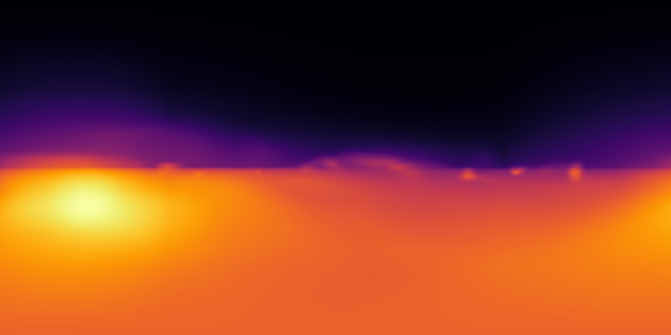
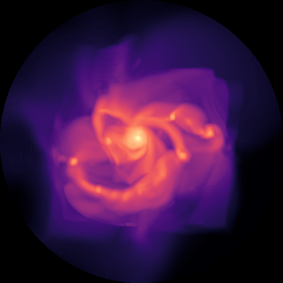
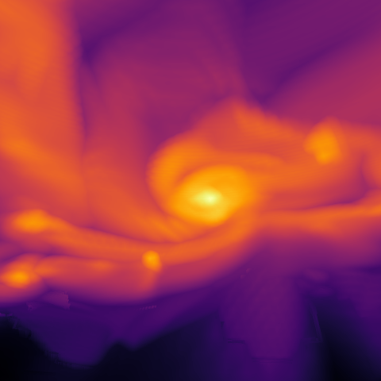
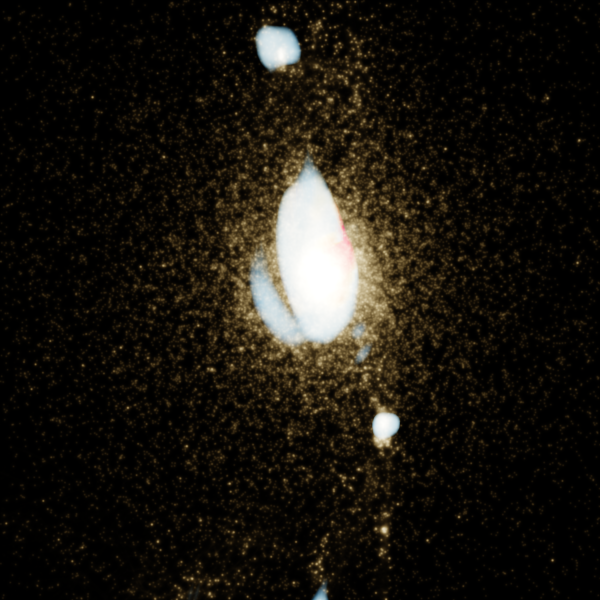
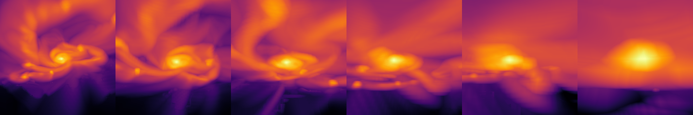
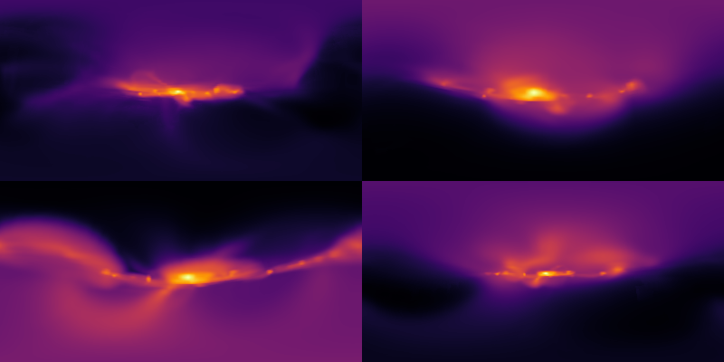

```julia
using Mera, CairoMakie   # immersive ray-caster is part of Mera; CairoMakie enables mp4 flythrough
CairoMakie.activate!()
println("threads = ", Threads.nthreads())
```

    [ Info: Precompiling Mera [02f895e8-fdb1-4346-8fe6-c721699f5126] (cache misses: include_dependency fsize change (6), wrong dep version loaded (2), wrong source (2), dep missing source (2))


    
    SYSTEM: caught exception of type :MethodError while trying to print a failed Task notice; giving up


    
    *__   __ _______ ______   _______ 

    
    |  |_|  |       |    _ | |   _   |
    |       |    ___|   | || |  |_|  |
    |       |   |___|   |_||_|       |
    |       |    ___|    __  |       |
    | ||_|| |   |___|   |  | |   _   |
    |_|   |_|_______|___|  |_|__| |__|
    Mera v1.8.0
    


    [ Info: Precompiling MeraMakieExt [defab1b5-6ec5-5409-a2f4-69ec619b2a0e] (cache misses: wrong dep version loaded (8))


    
    SYSTEM: caught exception of type :MethodError while trying to print a failed Task notice; giving up


    [ Info: Mera v1.8.0


    threads = 8

    


# Immersive 3-D visualisation (equirectangular, dome, fly-through, multi-tracer)

Mera's `projection` is **orthographic** (parallel rays). Immersive formats need a camera **at a
point** with rays fanning outward, so Mera's volume ray-caster
**ray-marches the AMR octree directly** — it does *not* resample to a uniform grid (that would be the
`(2^lmax)³` memory blow-up AMR exists to avoid). Each leaf is stored once in a per-level hash; each ray
steps by the **local cell size**, so cost scales like the simulation, not the box.

**De-blocking AMR.** Nearest-leaf sampling is piecewise-constant → coarse
cells look blocky. `render_view`/`render_scene` default to `smooth=true`: **cross-level trilinear**
reconstruction (interpolate the 8 surrounding leaf values at the local cell spacing, each looked up
finest→coarsest), plus `aa` supersampling. To zoom a large simulation,
pass a `subregion` to `amr_volume` first.


```julia
base = get(ENV, "MERA_TEST_DATA", "/Volumes/FASTStorage/Simulations/Mera-Tests")
info = getinfo(100, joinpath(base, "RAMSES/spiral_clumps"), verbose=false)
gas  = gethydro(info, verbose=false, show_progress=false)
vol  = amr_volume(gas, :rho, :nH)          # per-level leaf hash; NO uniform grid
c    = boxcenter(vol)                       # box centre, code units
```

    amr_volume: 590311 leaves, levels 5–7, boxlen 100.0 [code]  (no uniform grid — native AMR marching)


    (50.0, 50.0, 50.0)


## 1. Equirectangular 360° all-sky

An observer **at the galaxy centre** looking out in every direction. The 2:1 panorama is what VR
viewers, YouTube-360 and planetariums consume — the disk appears as a bright band, the poles empty.


```julia
img = render_view(vol, equirect_camera(c; forward=(1.,0.,0.)); res=420, mode=:emission, smooth=true, aa=2)
view_figure(img; colormap=:inferno)
```





## 2. Fisheye / dome master

Hemispherical projection for a planetarium dome — here looking down on the disk (`fov_deg=180`).


```julia
img = render_view(vol, fisheye_camera(c .+ (0,0,38), c; fov_deg=180); res=480, mode=:max, smooth=true, aa=2)
view_figure(img; colormap=:magma)
```





## 3. Perspective view (smooth, de-blocked)

`mode=:max` (maximum-intensity projection). `smooth=true` (cross-level trilinear) removes the AMR
blockiness; use `smooth=false` for a faster, blocky preview.


```julia
cam = perspective_camera(c .+ (28,18,22), c; fov_deg=55)
img = render_view(vol, cam; res=480, mode=:max, smooth=true, aa=2)
view_figure(img; colormap=:inferno)
```





## 4. Multiple tracers in one image — the "coloured-density" technique

The **coloured-density** technique: **opacity from one field, colour from another**.
Here a single gas channel takes its *opacity* from density (`:rho`) and its *hue* from temperature
(`color_by=:T`) — cold dense gas reads blue, hot gas red — instead of separate channels fighting. Add
**stars** as a particle channel. The HDR result is ACES filmic tone-mapped, then saturation-graded. The
value ranges (`vmin/vmax` for opacity, `color_vmin/vmax` for hue) and `opacity`/`gamma` are your dials.


```julia
# one coherent gas channel: opacity from density, colour from temperature
gas_ch = field_channel(gas, :rho, :nH; color_by=:T, color_unit=:K, colormap=:RdYlBu, reverse=true,
                       vmin=-0.5, vmax=2.3, color_vmin=3.5, color_vmax=6.5, opacity=12, gamma=1.4,
                       label="gas (ρ→opacity, T→colour)")
parts  = getparticles(info, verbose=false, show_progress=false)
stars  = points_channel(parts; weight=:mass, color=(1.0,0.85,0.6), size=0.8, opacity=0.18,
                        label="stars")   # filter=getvar(parts,:age,:Myr).<50 for young stars only

img = render_scene([gas_ch, stars], perspective_camera(c .+ (34,10,16), c; fov_deg=50);
                   res=600, aa=2, smooth=true, exposure=2.4, saturation=1.4)
save_scene(img, "/Users/mabe/code-github/Mera.jl/docs/src/assets/immersive/composite.png")
scene_figure(img)
```





## 5. Fly-through movies

`flythrough` interpolates the camera (Catmull–Rom) through `(position, target)` keyframes and records an
mp4. `kind=:perspective` is a normal fly-through; `:equirect` a moving 360° panorama; `:fisheye` a moving
dome. (Rendering is `smooth=true` by default; use `smooth=false`/lower `res` for faster previews.)


```julia
ASSET = "/Users/mabe/code-github/Mera.jl/docs/src/assets/immersive"; mkpath(ASSET)

kf_persp = [(c.+(40,30,34), c), (c.+(20,-25,16), c), (c.+(-22,-8,7), c), (c.+(-4,6,2.5), c)]
kf_equi  = [(c.+(-30,0,3), c.+(1,0,0)), (c.+(0,0,2), c.+(1,0,0)), (c.+(30,0,3), c.+(1,0,0))]

flythrough(vol, :perspective, kf_persp; nframes=72, res=420, mode=:max, framerate=20, fov_deg=58,
           filename=joinpath(ASSET, "flythrough_perspective.mp4"), verbose=false)
flythrough(vol, :equirect,    kf_equi;  nframes=48, res=300, mode=:emission, framerate=16,
           filename=joinpath(ASSET, "flythrough_equirect.mp4"), verbose=false)
println("wrote fly-through mp4s")
```

    wrote fly-through mp4s


**Frame strip of the perspective fly-in** (`flythrough_montage` renders frames along the same path
so the movie has a visible code→picture output here in the notebook):


```julia
flythrough_montage(vol, :perspective, kf_persp; nframes=6, res=240, mode=:max, fov_deg=58)
```





**Frame strip of the moving 360° equirectangular fly-through:**


```julia
flythrough_montage(vol, :equirect, kf_equi; nframes=4, cols=2, res=200, mode=:emission)
```





The full movies (mp4) are embedded in the rendered documentation page:

```@raw html
<video src="../assets/immersive/flythrough_perspective.mp4" autoplay loop muted playsinline width="480"></video>
```

```@raw html
<video src="../assets/immersive/flythrough_equirect.mp4" autoplay loop muted playsinline width="640"></video>
```
