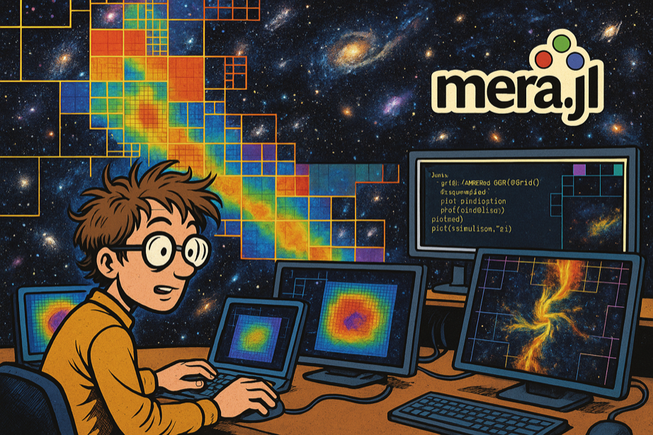

# MERA.jl

*High-performance RAMSES AMR + particle + gravity analysis in pure Julia with a unified, extensible API*

[](https://zenodo.org/badge/latestdoi/229728152)

**MERA** is a Julia package for high-performance analysis of large-scale astrophysical simulation data from RAMSES hydrodynamic code. Built entirely in Julia, it provides a unified API for AMR grids, N-body particles, and gravity data with native performance and extensive scientific functionality.



*Computational astrophysicist analyzing AMR simulation data with MERA.jl's powerful visualization and analysis capabilities*

## Why MERA for Computational Research?

**Julia Performance Advantage**: Compiled language speed for numerical computations while maintaining interactive development  
**RAMSES-Native Processing**: Direct binary file reading with optimized AMR algorithms and Hilbert space-filling curve support  
**AMR-Aware Analysis**: Proper handling of multi-resolution grids with correct level weighting  
**Reproducible Research Pipeline**: Complete environment management with Project.toml/Manifest.toml for computational reproducibility

## Quick Start: Choose Your Path

!!! note "5-Minute Demo"
    **See MERA in action immediately**
    ```julia
    using Mera
    info = getinfo(1, "path/sim")
    gas = gethydro(info)
    projection(gas, :rho)
    ```
    **[→ Get Started](00_multi_FirstSteps.md)**

!!! tip "For Scientists"
    **RAMSES expert, new to Julia?**
    - Native RAMSES support
    - Physics variables built-in  
    - Multi-threaded performance
    
    **[→ Scientific Workflows](01_hydro_First_Inspection.md)**

!!! info "For Programmers" 
    **Python/MATLAB user learning Julia?**
    - Migration guides
    - Performance comparisons
    - Ecosystem integration
    
    **[→ Migration Guide](quickreference/02_migrators.md)**

!!! tip "Quick Navigation"
    **Want to:** Make a density plot → [Projections](06_hydro_Projection.md) • Calculate stellar masses → [Basic Calculations](04_multi_Basic_Calculations.md) • Load specific regions → [Selections](02_hydro_Load_Selections.md) • Optimize performance → [Multi-Threading](multi-threading/multi-threading_intro.md)

!!! note "How to Cite MERA"
    If you use MERA in your research, please cite it using the DOI badge above. This supports continued development and helps other researchers discover the tool. Please also star the [GitHub repository](https://github.com/ManuelBehrendt/Mera.jl)!

## Installation & First Steps

### Quick Installation (2 minutes)
```julia
using Pkg
Pkg.add("Mera")
using Mera
```

**Requirements**: Julia 1.10+, 8GB+ RAM recommended  
**Platforms**: macOS (including Apple Silicon), Linux, Windows

### Your First MERA Analysis
```julia
# Load simulation metadata
info = getinfo(output=1, "/path/to/simulation")

# Load gas data  
gas = gethydro(info)

# Create density projection
proj = projection(gas, :rho, direction=:z)

# You're analyzing AMR data!
```

## Key Capabilities

- **Julia-Native Performance**: JIT compilation delivers native performance for numerical computations without Python overhead
- **Memory-Efficient AMR Processing**: Handle TB-scale simulations with selective loading and IndexedTables.jl backend
- **Multi-Threaded I/O Optimization**: Comprehensive benchmarking framework for optimal thread configuration
- **Extensive Physics Variables**: 70+ hydro and 30+ particle derived quantities (Jeans mass, Mach numbers, virial parameters)
- **Advanced AMR Projections**: Mass-conserving projections with proper AMR boundary handling
- **Professional Visualization Pipeline**: VTK export preserving AMR structure for ParaView/VisIt
- **Compressed Data Storage**: MERA-Files with LZ4/Zlib/Bzip2 compression for efficient time-series analysis
- **Publication-Grade Reproducibility**: Julia environment management ensuring identical computational setups
- **RAMSES-Native Integration**: Direct binary file reading with Hilbert space-filling curve support
- **Interactive Research Workflow**: REPL exploration + Jupyter integration + production scripting

## Why Julia + Multiple Dispatch?

MERA showcases Julia's **multiple dispatch** – the same function works differently based on data type, automatically choosing the correct method:

```julia
# One function name, different physics
getvar(gas_data, :mass)    # → Cell mass (density × volume)
getvar(particle_data, :mass) # → Particle mass (discrete values) 
getvar(clump_data, :mass)   # → Clump total mass (aggregated)

# Same analysis pattern, different data types
projection(gas, :rho)      # → Gas density projection
projection(particles, :age) # → Stellar age distribution
```

**Benefit**: Write analysis code once, works across all RAMSES data types automatically.


## Learning Path & Documentation

### 🟢 **Beginner Track** (Start here!)
| Section | Purpose | Time |
|---------|---------|------|
| **[First Steps](00_multi_FirstSteps.md)** | Installation, core concepts, first analysis | 20 min |
| **[Data Inspection](01_hydro_First_Inspection.md)** | Understand RAMSES data structure | 15 min |
| **[Basic Calculations](04_multi_Basic_Calculations.md)** | Units, statistics, physics variables | 25 min |

### 🟡 **Intermediate Track**
| Section | Purpose | Time |
|---------|---------|------|
| **[Load by Selection](02_hydro_Load_Selections.md)** | Efficient memory management | 20 min |
| **[Get Subregions](03_hydro_Get_Subregions.md)** | Spatial selections, coordinate systems | 25 min |
| **[Projections](06_hydro_Projection.md)** | 2D visualizations, publication plots | 30 min |
| **[MERA Files](07_multi_Mera_Files.md)** | Data compression and sharing | 15 min |

### 🔴 **Advanced Features**
| Section | Purpose | Best For |
|---------|---------|----------|
| **[Multi-Threading](multi-threading/multi-threading_intro.md)** | HPC optimization, parallel processing | Performance users |
| **[Volume Rendering](paraview/paraview_intro.md)** | 3D visualization with ParaView | Advanced visualization |
| **[Benchmarks](benchmarks/IO/IOperformance.md)** | Performance analysis and testing | System optimization |
| **[Advanced Testing](advanced_features/testing_guide.md)** | MERA's testing framework | Developers, contributors |

### 📚 **Reference Materials**
- **[Complete API](api.md)** - All functions and types
- **[Julia Migration](quickreference/02_migrators.md)** - From Python/MATLAB/IDL
- **[Examples](examples.md)** - Real-world workflows
- **[Troubleshooting](Miscellaneous.md)** - Common issues and solutions


## Community & Support

### 🤝 **Get Involved**
- **[GitHub Discussions](https://github.com/ManuelBehrendt/Mera.jl/discussions)** - Ask questions, share tips, get help
- **[Show & Tell](https://github.com/ManuelBehrendt/Mera.jl/discussions/categories/show-and-tell)** - Share your scientific results and visualizations
- **[Report Issues](https://github.com/ManuelBehrendt/Mera.jl/issues)** - Bug reports and feature requests

### 💡 **Quick Help**
- **REPL Help**: `?getinfo` for function docs, `methods(getinfo)` for available methods  
- **Tutorials**: [Jupyter notebooks](https://github.com/ManuelBehrendt/Notebooks/tree/master/Mera-Docs/version_1) and [RUM2023 materials](https://github.com/ManuelBehrendt/RUM2023)
- **Julia Ecosystem**: [Official docs](https://docs.julialang.org/) | [JuliaAstro](https://juliaastro.org/) | [Performance tips](https://docs.julialang.org/en/v1/manual/performance-tips/)

## Production Ready

- **Status**: Production-ready with active development and comprehensive testing
- **RAMSES Compatibility**: Versions stable-17.09 through stable-19.10, plus RAMSES 2025.05 (beta)
- **Testing**: Multi-platform CI/CD with extensive coverage ([see our testing approach](advanced_features/testing_guide.md))
- **Dependencies**: Full list in [Project.toml](https://github.com/ManuelBehrendt/Mera.jl/raw/master/Project.toml)

## Citation & License

### 📖 **How to Cite**
If you use MERA in your research, please cite it to support development:

[](https://zenodo.org/badge/latestdoi/229728152)

Click the badge for BibTeX format. Please also ⭐ the [GitHub repository](https://github.com/ManuelBehrendt/Mera.jl)!

### ⚖️ **License**
MIT License

Copyright (c) 2019 Manuel Behrendt

Permission is hereby granted, free of charge, to any person obtaining a copy
of this software and associated documentation files (the "Software"), to deal
in the Software without restriction, including without limitation the rights
to use, copy, modify, merge, publish, distribute, sublicense, and/or sell
copies of the Software, and to permit persons to whom the Software is
furnished to do so, subject to the following conditions:

The above copyright notice and this permission notice shall be included in all
copies or substantial portions of the Software.

THE SOFTWARE IS PROVIDED "AS IS", WITHOUT WARRANTY OF ANY KIND, EXPRESS OR
IMPLIED, INCLUDING BUT NOT LIMITED TO THE WARRANTIES OF MERCHANTABILITY,
FITNESS FOR A PARTICULAR PURPOSE AND NONINFRINGEMENT. IN NO EVENT SHALL THE
AUTHORS OR COPYRIGHT HOLDERS BE LIABLE FOR ANY CLAIM, DAMAGES OR OTHER
LIABILITY, WHETHER IN AN ACTION OF CONTRACT, TORT OR OTHERWISE, ARISING FROM,
OUT OF OR IN CONNECTION WITH THE SOFTWARE OR THE USE OR OTHER DEALINGS IN THE
SOFTWARE.
