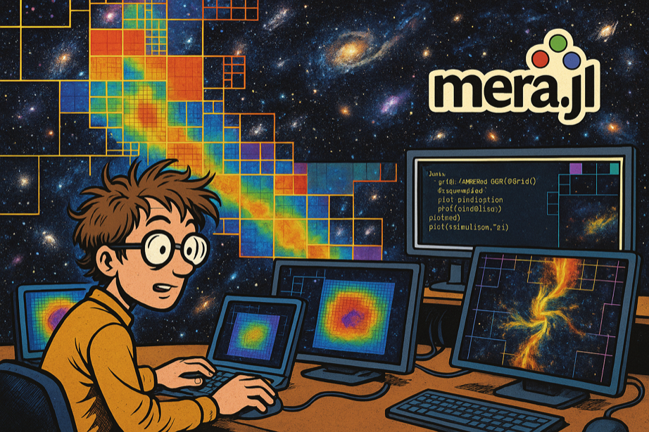

# MERA.jl

*High-performance analysis of astrophysical simulations in pure Julia — RAMSES natively and in full, plus AREPO, GADGET, PLUTO, Athena++, FLASH and Chombo through one unified API*

[](https://zenodo.org/badge/latestdoi/229728152)

**MERA** reads and analyzes astrophysical simulation output natively in Julia. Built for **RAMSES** — multi-resolution AMR grids, particles, gravity, clumps and radiative-transfer fields loaded into memory-efficient tables — and now reading **AREPO, GADGET, PLUTO, Athena++, FLASH** and **Chombo** through the same API. It computes 170+ physics-derived quantities on demand (across hydro, particles, gravity, RT and clumps) and provides conservation-correct projections, profiles, flux budgets and structure finding — all through one unified, multiple-dispatch API.

Coverage is deepest for RAMSES: it is the only code with dedicated `getgravity`, `getrt` and `getclumps` readers, because it writes those to separate files. Where another code stores the same physics inside its snapshot — Athena++ `phi`, FLASH `gpot`, Chombo `gravitational-potential`, Athena++ six-ray radiation — the reader maps it to the canonical field, so `getvar(gas, :gpot)` works there too. AREPO and GADGET add particles and FoF group catalogues (`getgroups`; subhalos are not read).

Frontends for other simulation codes — PLUTO, Chombo, Athena++, FLASH and the GADGET-HDF5
family (GADGET / AREPO / SWIFT / GIZMO) — are in active development on the `multicode` branch
and are not part of this release:

```julia
] add https://github.com/ManuelBehrendt/Mera.jl#multicode
```

They are newer and narrower than the RAMSES reader and tested mainly against synthetic
fixtures. Widening that is mostly reader work rather than core work, because the analysis layer
is code-blind, so [contributions and bug reports](https://github.com/ManuelBehrendt/Mera.jl/issues)
move it forward quickly.



*Computational astrophysicist analyzing AMR simulation data with MERA.jl's powerful visualization and analysis capabilities*

## Why MERA for Computational Research?

**Julia Performance Advantage**: Compiled language speed for numerical computations while maintaining interactive development  
**RAMSES-Native Processing**: Direct binary file reading with optimized AMR algorithms and Hilbert space-filling curve support  
**AMR-Aware Analysis**: Proper handling of multi-resolution grids with correct level weighting  
**Reproducible Research Pipeline**: Julia's environment files pin your package versions, and [`provenance`](provenance.md) records the Mera version, output and simulation code behind a result

## Quick Start: Choose Your Path

*Three ways in, depending on what you want right now: run something immediately
(below), jump to a task you already have in mind ([Quick Navigation](#Quick-Navigation)),
or work through it in order ([Learning Path](#Learning-Path-and-Documentation)).*

!!! note "Run something now — no data needed"
    `synthetic_clumps()` builds real Mera objects in memory, so this works on a fresh
    install with nothing downloaded:

    ```julia
    using Mera
    F   = synthetic_clumps()              # 51,514 gas cells + 2,438 particles, 8 known clumps
    gas = F.gas
    projection(gas, :sd, :Msol_pc2)       # a 128×128 surface-density map
    ```

    Everything else in these docs — `getvar`, `subregion`, `filterdata`, `profile`,
    `savedata` — works on `gas` exactly as it does on a real snapshot. Because the clump
    positions are known, this is also how [clump finding](clumpfind_synthetic.md) is scored
    against ground truth.

    Expect ~10 s on the first call: Julia compiles as it goes, and later calls are instant.

    **Keep going without a snapshot:** [Clump Finding](clumpfind_synthetic.md) scores a real
    analysis against known ground truth, and [Statistics](statistics.md) and
    [Uniform Grid](covering_grid.md) also run on synthetic data.

    **With a snapshot of your own:** [Get Started](00_multi_FirstSteps.md) ·
    [Coming from Other Tools](switching_to_mera.md). Both load a simulation output — set
    `ENV["MERA_EXAMPLES"]` to your simulation folder first, or grab one of the public RAMSES
    samples linked from [Cosmological Runs](09_multi_Cosmology.md).

!!! tip "Working with your own simulation"
    Point `getinfo` at an output folder and continue exactly as above:

    ```julia
    info = getinfo(300, "/path/to/simulation")   # reads output_00300
    gas  = gethydro(info)
    ```

    Every tutorial builds its paths from one variable, so you do not have to edit the cells.
    Point it at your own simulations and the examples run against them:

    ```julia
    ENV["MERA_EXAMPLES"] = "/path/to/your/simulations"   # before `using Mera`
    ```

    The fixtures that produced the outputs shown in the tutorials are not redistributed. For a
    public snapshot to follow along with, see the downloadable RAMSES samples linked from
    [Cosmological Runs](09_multi_Cosmology.md) and [Magnetic Fields](magnetic_fields.md).

!!! tip "For Scientists"
    **RAMSES expert, new to Julia?**
    - Native RAMSES support
    - Physics variables built-in  
    - Multi-threaded performance
    
    **[→ Scientific Workflows](01_hydro_First_Inspection.md)**

!!! info "Coming from another analysis tool"
    **Already analyse simulations elsewhere?**
    - Concept-to-verb mapping
    - One complete worked workflow
    - Differences to expect, stated honestly

    **[→ Coming from Other Tools](switching_to_mera.md)**

    New to Julia itself? **[→ Julia for Python/MATLAB/IDL users](quickreference/02_migrators.md)**

!!! tip "Quick Navigation"
    *If you already know what you want to compute.* For a guided order instead, see
    [Learning Path](#Learning-Path-and-Documentation) below.

    **Want to:** Make a density plot → [Projections](06_hydro_Projection.md) • Calculate stellar masses → [Basic Calculations](04_multi_Basic_Calculations.md) • Load specific regions → [Selections](02_hydro_Load_Selections.md) • Optimize performance → [Multi-Threading](multi-threading/multi-threading_intro.md)

!!! note "How to Cite MERA"
    If you use MERA in your research, please cite it using the DOI badge above. This supports continued development and helps other researchers discover the tool. Please also star the [GitHub repository](https://github.com/ManuelBehrendt/Mera.jl)!

## Installation & First Steps

### Quick Installation (2 minutes)
```julia
using Pkg
Pkg.add("Mera")
using Mera
```

Mera itself draws nothing. The tutorials plot with **CairoMakie**, and a few of the older
projection pages use **PyPlot**; neither is a Mera dependency, so add whichever you want
before running a page that plots:

```julia
Pkg.add("CairoMakie")   # what most tutorial figures use
Pkg.add("PyPlot")       # only the projection pages that import it
```

Mera's Makie support ships as a package extension: it activates by itself once a Makie
backend such as CairoMakie is loaded, with nothing further to install.

**Requirements**: Julia 1.10 or newer — **1.12+ recommended** — and 8GB+ RAM  
**Platforms**: macOS (including Apple Silicon), Linux, Windows  
**Tested on every push**: Julia 1.10 / 1.11 / 1.12 × Linux, macOS and Windows — nine jobs

Julia 1.10 is the minimum the package supports (`julia = "1.10"` in `Project.toml`) and stays in
CI so it keeps working. 1.12 is what we recommend running: the compiler is faster and the garbage
collector handles the large allocations of AMR and particle analysis better, which is most of what
Mera does. CI runners have no simulation data, so they exercise the data-free tiers — the
synthetic-HDF5 reader contracts, the reader registry, the IO layer and the mera-file round-trips —
while the full suite runs against real snapshots locally.

### About the data in these tutorials

The tutorial pages analyse research-scale RAMSES simulations, several gigabytes each, which are
not distributed. They are worked examples: read them to see what an analysis of real data looks
like, and adapt the code to your own outputs. Running a page unchanged will not work, because the
simulation it points at is not something you have.

If you want something you can run immediately, Mera publishes a small set of test simulations,
eleven of them, a few megabytes each. Every one carries either an analytic oracle, a law that
follows from its own setup, or is checked against reference values published by the RAMSES
developers. They ship with a getting-started example, and Mera's own test suite verifies the
package against them, so you can confirm an installation behaves correctly without a large
download. See [`testdata/README.md`](https://github.com/ManuelBehrendt/Mera.jl/blob/master/testdata/README.md)
in the repository for how to fetch them.

Two tutorial pages already use data you can obtain: the radiative-transfer page runs on one of the
published test simulations, and the cosmology page carries download instructions for the yt
project's public sample dataset.

### Your First MERA Analysis
```julia
# Load simulation metadata
info = getinfo(output=1, "/path/to/simulation")

# Load gas data  
gas = gethydro(info)

# Create density projection
proj = projection(gas, :rho, direction=:z)

# You're analyzing AMR data!
```

## Key Capabilities

- **Julia-Native Performance**: JIT compilation delivers native performance for numerical computations without Python overhead
- **Memory-Efficient AMR Processing**: Handle TB-scale simulations with selective loading and IndexedTables.jl backend
- **Multi-Threaded I/O Optimization**: Comprehensive benchmarking framework for optimal thread configuration
- **Extensive Physics Variables**: 82 hydro and 47 particle quantities, plus gravity, RT and clumps (Jeans mass, Mach numbers, virial parameters) — `getvar()` lists them all
- **Advanced AMR Projections**: Mass-conserving projections with proper AMR boundary handling
- **Professional Visualization Pipeline**: VTK export preserving AMR structure for ParaView/VisIt
- **Compressed Data Storage**: MERA-Files with LZ4/Zlib/Bzip2 compression for efficient time-series analysis
- **Publication-Grade Reproducibility**: pin versions with a `Project.toml`/`Manifest.toml` in your own analysis project, and record what produced each number with [`provenance`](provenance.md)
- **RAMSES-Native Integration**: Direct binary file reading with Hilbert space-filling curve support
- **Interactive Research Workflow**: REPL exploration + Jupyter integration + production scripting

## Why Julia + Multiple Dispatch?

MERA showcases Julia's **multiple dispatch** – the same function works differently based on data type, automatically choosing the correct method:

```julia
# One function name, different physics
getvar(gas_data, :mass)    # → Cell mass (density × volume)
getvar(particle_data, :mass) # → Particle mass (discrete values) 
getvar(clump_data, :mass)   # → Clump total mass (aggregated)

# Same analysis pattern, different data types
projection(gas, :rho)      # → Gas density projection
projection(particles, :age) # → Stellar age distribution
```

**Benefit**: Write analysis code once, works across all RAMSES data types automatically.


## Learning Path & Documentation

*The guided order, if you would rather build up than dive in. Each track assumes the one
before it.*

### 🟢 **Beginner Track** (Start here!)
| Section | Purpose | Time |
|---------|---------|------|
| **[First Steps](00_multi_FirstSteps.md)** | Installation, core concepts, first analysis | 20 min |
| **[Data Inspection](01_hydro_First_Inspection.md)** | Understand RAMSES data structure | 15 min |
| **[Basic Calculations](04_multi_Basic_Calculations.md)** | Units, statistics, physics variables | 25 min |

### 🟡 **Intermediate Track**
| Section | Purpose | Time |
|---------|---------|------|
| **[Load by Selection](02_hydro_Load_Selections.md)** | Efficient memory management | 20 min |
| **[Get Subregions](03_hydro_Get_Subregions.md)** | Spatial selections, coordinate systems | 25 min |
| **[Projections](06_hydro_Projection.md)** | 2D visualizations, publication plots | 30 min |
| **[MERA Files](07_multi_Mera_Files.md)** | Data compression and sharing | 15 min |

### 🔴 **Advanced Features**
| Section | Purpose | Best For |
|---------|---------|----------|
| **[Multi-Threading](multi-threading/multi-threading_intro.md)** | HPC optimization, parallel processing | Performance users |
| **[Volume Rendering](paraview/paraview_intro.md)** | 3D visualization with ParaView | Advanced visualization |
| **[Benchmarks](benchmarks/IO/IOperformance.md)** | Performance analysis and testing | System optimization |
| **[Advanced Testing](advanced_features/testing_guide.md)** | MERA's testing framework | Developers, contributors |

### 📚 **Reference Materials**
- **[Complete API](api.md)** - All functions and types
- **[Coming from Other Tools](switching_to_mera.md)** - Concept mapping and a worked workflow
- **[Julia for Python/MATLAB/IDL users](quickreference/02_migrators.md)** - Learning Julia the language
- **[Examples](examples.md)** - Real-world workflows
- **[Miscellaneous](Miscellaneous.md)** - Bundled arguments, verbose switches, misc features


## Community & Support

### 🤝 **Get Involved**
- **[GitHub Discussions](https://github.com/ManuelBehrendt/Mera.jl/discussions)** - Ask questions, share tips, get help
- **[Show & Tell](https://github.com/ManuelBehrendt/Mera.jl/discussions/categories/show-and-tell)** - Share your scientific results and visualizations
- **[Report Issues](https://github.com/ManuelBehrendt/Mera.jl/issues)** - Bug reports and feature requests

### 💡 **Quick Help**
- **REPL Help**: `?getinfo` for function docs, `methods(getinfo)` for available methods  
- **Tutorials**: [Jupyter notebooks](https://github.com/ManuelBehrendt/Notebooks/tree/master/Mera-Docs/version_1.1) and [RUM2023 materials](https://github.com/ManuelBehrendt/RUM2023)
- **Julia Ecosystem**: [Official docs](https://docs.julialang.org/) | [JuliaAstro](https://juliaastro.org/) | [Performance tips](https://docs.julialang.org/en/v1/manual/performance-tips/)

## Production Ready

- **Status**: Production-ready with active development and comprehensive testing
- **RAMSES Compatibility**: Versions stable-17.09 through stable-19.10, plus RAMSES 2025.05 (beta)
- **Testing**: Multi-platform CI/CD with extensive coverage ([see our testing approach](advanced_features/testing_guide.md))
- **Dependencies**: Full list in [Project.toml](https://github.com/ManuelBehrendt/Mera.jl/raw/master/Project.toml)

## Citation & License

### 📖 **How to Cite**
If you use MERA in your research, please cite it to support development:

[](https://zenodo.org/badge/latestdoi/229728152)

Click the badge for BibTeX format. Please also ⭐ the [GitHub repository](https://github.com/ManuelBehrendt/Mera.jl)!

### ⚖️ **License**
MIT License

Copyright (c) 2019 Manuel Behrendt

Permission is hereby granted, free of charge, to any person obtaining a copy
of this software and associated documentation files (the "Software"), to deal
in the Software without restriction, including without limitation the rights
to use, copy, modify, merge, publish, distribute, sublicense, and/or sell
copies of the Software, and to permit persons to whom the Software is
furnished to do so, subject to the following conditions:

The above copyright notice and this permission notice shall be included in all
copies or substantial portions of the Software.

THE SOFTWARE IS PROVIDED "AS IS", WITHOUT WARRANTY OF ANY KIND, EXPRESS OR
IMPLIED, INCLUDING BUT NOT LIMITED TO THE WARRANTIES OF MERCHANTABILITY,
FITNESS FOR A PARTICULAR PURPOSE AND NONINFRINGEMENT. IN NO EVENT SHALL THE
AUTHORS OR COPYRIGHT HOLDERS BE LIABLE FOR ANY CLAIM, DAMAGES OR OTHER
LIABILITY, WHETHER IN AN ACTION OF CONTRACT, TORT OR OTHERWISE, ARISING FROM,
OUT OF OR IN CONNECTION WITH THE SOFTWARE OR THE USE OR OTHER DEALINGS IN THE
SOFTWARE.
