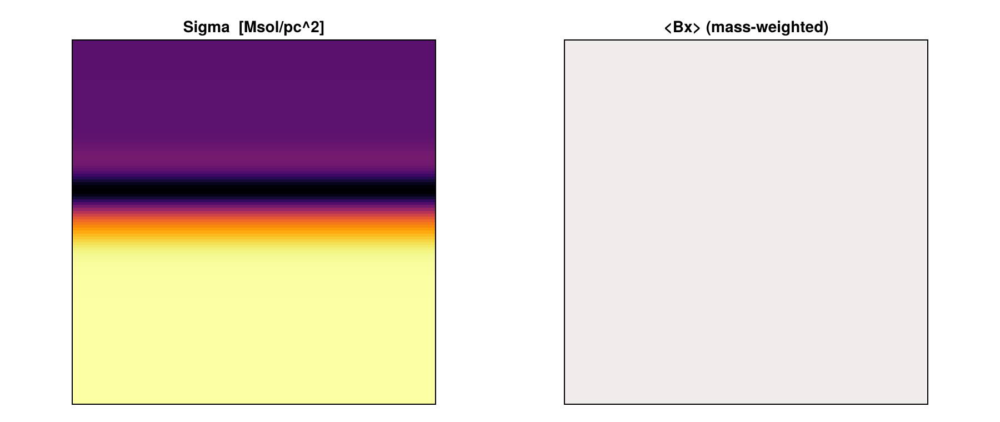

# Magnetic Fields (MHD)

!!! tip "Run it yourself"
    This page is also an executable **Jupyter notebook** — [open / download `magnetic_fields.ipynb`](https://github.com/ManuelBehrendt/Notebooks/blob/master/Mera-Docs/version_1.1/magnetic_fields.ipynb). The notebooks run end-to-end and double as part of Mera's test suite.

Mera reads **RAMSES MHD** (ideal magnetohydrodynamics) outputs and exposes the magnetic field for
analysis. RAMSES evolves **B** with a *constrained-transport* scheme, so the field is stored as the
**six face-centred components** `B_{x,y,z}_left` and `B_{x,y,z}_right` in the ordinary hydro files
(there are no separate magnetic-field files). The physically meaningful **cell-centred** field is the
average of the two opposing faces,

```math
B_i = \tfrac12\,(B_{i,\text{left}} + B_{i,\text{right}}), \qquad i\in\{x,y,z\}.
```

## How Mera detects and names MHD variables

In an MHD hydro file the variable order is

```
density, vx, vy, vz, B_x_left, B_y_left, B_z_left, B_x_right, B_y_right, B_z_right, [non-thermal], pressure, [scalars…]
```

so the thermal **pressure sits at index 11**, not 5 (index 5 is `B_x_left`). Mera handles this
automatically across RAMSES versions:

- **With a `hydro_file_descriptor.txt`** (post-2019 and 2025 outputs) Mera reads the variable names
  directly and maps them to its canonical symbols (`density→:rho`, `velocity_*→:vx/:vy/:vz`,
  `pressure→:p` at its true index, `B_*_{left,right}→:b*_{left,right}`).
- **Without a descriptor** (older outputs) Mera uses the community heuristic (matching `yt`): a 3-D run
  with `nvar ≥ 11` is treated as MHD (the constrained-transport module adds the three `B_right`
  components). A short `@info` line is printed when this heuristic is applied.

Either way you get canonical names and the cell-centred field `:bx`, `:by`, `:bz`.

!!! note "Ambiguous no-descriptor case"
```
Without a descriptor, a *hydro* run that happens to carry exactly six passive scalars also has
`nvar = 11` and would be read as MHD. Modern RAMSES writes the descriptor, which removes the
ambiguity; if you hit this, the columns are still available positionally (`:var6…`).
```


## A reproducible example (yt sample dataset)

The yt project hosts a small RAMSES MHD test (a 3-D MHD tube). Download and extract it:

```julia
# in a shell:
#   curl -LO https://yt-project.org/data/ramses_mhd_128.tar.gz
#   tar -xzf ramses_mhd_128.tar.gz
```

```julia
# Example-data root. Point this at your own simulation folder, or set the
# MERA_EXAMPLES environment variable; every path below is built from it.
MERA_EXAMPLES = get(ENV, "MERA_EXAMPLES", "/Volumes/FASTStorage/Simulations/Mera-Tests");

using Mera
base = get(ENV, "MERA_TEST_DATA", MERA_EXAMPLES)

# getinfo prints the MHD-layout note + the overview (note the magnetic-field line)
info = getinfo(27, joinpath(base, "RAMSES/ramses_mhd_128"));
```


```
*__   __ _______ ______   _______ 


|  |_|  |       |    _ | |   _   |
|       |    ___|   | || |  |_|  |
|       |   |___|   |_||_|       |
|       |    ___|    __  |       |
| ||_|| |   |___|   |  | |   _   |
|_|   |_|_______|___|  |_|__| |__|
Mera v1.8.0

[Mera]: 2026-08-03T12:09:04.380


[ Info: Mera: no hydro descriptor and nvarh=11 (≥11) on a 3D run — assuming a RAMSES MHD layout (B faces at 5–10, pressure at 11). If this is hydro with ≥6 passive scalars instead, the names are positional (:var6…).

Code: RAMSES
output [27] summary:
mtime: 2026-06-17T09:26:06.094
ctime: 2026-06-17T09:26:06.094
=======================================================
simulation time: 161.02 [ms]
boxlen: 2.0 [cm]
ncpu: 4
ndim: 3
cosmological:  false
-------------------------------------------------------
amr:           true
level of uniform grid: 7 --> cellsize(s): 156.25 [μm]
-------------------------------------------------------
hydro:         true
hydro-variables:  11

  --> (:rho, :vx, :vy, :vz, :bx_left, :by_left, :bz_left, :bx_right, :by_right, :bz_right, :p)
magnetic field:   true (MHD, constrained transport) --> cell-centred :bx, :by, :bz = ½(left+right)
γ: 1.6666667
gravity:       false
particles:     false
rt:            false
clumps:           false
namelist-file:    false
timer-file:       false
compilation-file: false
makefile:         false
patchfile:        false
=======================================================
```


```julia
gas = gethydro(info);

println("cells loaded         : ", length(gas.data))
println("thermal pressure   p : ", extrema(getvar(gas, :p)))
println("cell-centred Bx      : ", extrema(getvar(gas, :bx)))
println("cell-centred By      : ", extrema(getvar(gas, :by)))
println("cell-centred Bz      : ", extrema(getvar(gas, :bz)))
println("temperature  T [K]   : ", extrema(getvar(gas, :T, :K)))
```

```
[Mera]: Get hydro data: 2026-08-03T12:09:07.782


Key vars=(:cx, :cy, :cz)

Using var(s)=(1, 2, 3, 4, 5, 6, 7, 8, 9, 10, 11) = (:rho, :vx, :vy, :vz, :bx_left, :by_left, :bz_left, :bx_right, :by_right, :bz_right, :p) 

domain:


xmin::xmax: 0.0 :: 1.0  	==> 0.0 [cm] :: 2.0 [cm]
ymin::ymax: 0.0 :: 1.0  	==> 0.0 [cm] :: 2.0 [cm]
zmin::zmax: 0.0 :: 1.0  	==> 0.0 [cm] :: 2.0 [cm]

📊 Processing Configuration:

   Total CPU files available: 4
   Files to be processed: 4
   Compute threads: 4
   GC threads: 4


✓ File processing complete! Combining results...
✓ Data combination complete!

Final data size: 2097152 cells, 11 variables
Creating Table from 2097152 cells with max 4 threads...

  Threading: 4 threads for 14 columns

  Max threads requested: 4
  Available threads: 4
  Using parallel processing with 4 threads

  Creating IndexedTable with 14 columns...
✓ Table created in 4.328 seconds

Memory used for data table :224.00138664245605

 MB
-------------------------------------------------------

cells loaded         : 2097152
thermal pressure   p : 

(0.13653329586664678, 1.9999999999999998)
cell-centred Bx      : (1.0, 1.0)
cell-centred By      : (9.971840159730391e-27, 1.6525454539866162)
cell-centred Bz      : (0.0, 0.0)
temperature  T [K]   : 

(1.0812393953743894e-8, 3.1640344885858596e-8)
```


## Derived magnetic quantities

All of these are **built-in `getvar` quantities** computed from the cell-centred field — no manual
arithmetic needed — and each takes the units shown:

```julia
Bmag_uG = getvar(gas, :bmag, :muG)      # |B| in micro-Gauss
beta    = getvar(gas, :beta)            # plasma beta (dimensionless)
vA      = getvar(gas, :v_alfven, :km_s) # Alfven speed
mA      = getvar(gas, :mach_alfven)     # Alfvenic Mach number
mf      = getvar(gas, :mach_fast)       # fast magnetosonic Mach number

println("|B|   [muG]          : ", extrema(Bmag_uG))
println("plasma beta          : ", extrema(beta))
println("Alfven speed [km/s]  : ", extrema(vA))
println("Mach_alfven          : ", extrema(mA))
println("Mach_fast            : ", extrema(mf))
```

```
|B|   [muG]          : (

3.544907701811032e6, 6.84718581051191e6)
plasma beta          : (0.07401400537131442, 3.9999999999999996)
Alfven speed [km/s]  : (1.0e-5, 5.603087067452776e-5)
Mach_alfven          : (6.808121583990544e-27, 0.8753825660118536)
Mach_fast            : (3.270515795217101e-27, 0.835115020871922)
```


Almost no new units were needed: `B` reuses the field-strength scales (`:Gauss`, `:muG`, `:microG`,
`:nG`, `:Tesla`), magnetic pressure/energy-density reuse the pressure scales (`:Ba`, `:g_cm_s2`), the
Alfvén speed reuses the velocity scales (`:km_s`, `:cm_s`), and the magnetic energy reuses `:erg`.
(`:nG`, nanogauss, was added via a new `ScalesType003` so pre-existing mera files still load.)

The exact formulas (incl. the RAMSES code-unit convention `P_mag = B²/2` and the Alfvén-speed
conversion) are listed in
[How Quantities Are Computed](computation_reference.md#Magnetic-quantities).

## Projecting the magnetic field

The cell-centred components project like any other field — e.g. a mass-weighted map of `:bx`, or a
column-density map alongside it:

```julia
using CairoMakie

sd = projection(gas, :sd, :Msol_pc2; direction=:z)
bx = projection(gas, :bx;            direction=:z)   # mass-weighted <Bx>

fig = Figure(size=(900, 380))
ax1 = Axis(fig[1,1]; title="Sigma  [Msol/pc^2]", aspect=DataAspect()); hidedecorations!(ax1)
ax2 = Axis(fig[1,2]; title="<Bx> (mass-weighted)", aspect=DataAspect()); hidedecorations!(ax2)
heatmap!(ax1, log10.(sd.maps[:sd]'); colormap=:inferno)
heatmap!(ax2, bx.maps[:bx]';         colormap=:balance)
fig
```

```
[Mera]: 2026-08-03T12:09:32.078


domain:
xmin::xmax: 0.0 :: 1.0  	==> 0.0 [cm] :: 2.0 [cm]
ymin::ymax: 0.0 :: 1.0  	==> 0.0 [cm] :: 2.0 [cm]
zmin::zmax: 0.0 :: 1.0  	==> 0.0 [cm] :: 2.0 [cm]

Selected var(s)=(:sd,) 
Weighting      = :mass

Effective resolution: 128^2


Map size: 128 x 128
Pixel size: 156.25 [μm]
Simulation min.: 156.25 [μm]

Available threads: 4

Requested max_threads: 4
Variables: 1 (sd)
Processing mode: Sequential (single thread)
[Mera]: 2026-08-03T12:09:33.265


domain:
xmin::xmax: 0.0 :: 1.0  	==> 0.0 [cm] :: 2.0 [cm]
ymin::ymax: 0.0 :: 1.0  	==> 0.0 [cm] :: 2.0 [cm]
zmin::zmax: 0.0 :: 1.0  	==> 0.0 [cm] :: 2.0 [cm]

Selected var(s)=(:bx, :sd) 
Weighting      = :mass

Effective resolution: 128^2
Map size: 128 x 128
Pixel size: 156.25 [μm]
Simulation min.: 156.25 [μm]

Available threads: 4

Requested max_threads: 4
Variables: 2 (bx, sd)
Processing mode: Sequential (single thread)
```





On an MHD run the [first-look dashboard](report.md) does this for you: `quicklook(output)` adds a
face-on `|B|` panel and reports the `|B|` and plasma-β ranges automatically.

## Caveats

- Mera reads **ideal-MHD** RAMSES outputs (the constrained-transport `B` faces). Non-ideal terms
  (e.g. resistivity) are not separate fields.
- `:bx/:by/:bz` are the **cell-centred** average of the faces; the raw faces remain available as
  `:bx_left`, `:bx_right`, … if you need the divergence-free face representation.
- On a non-MHD run, `:bx/:by/:bz`, the derived quantities (`:bmag`, `:pmag`, `:beta`, `:v_alfven`,
  `:e_magnetic`) and the magnetosonic Mach numbers all error with a clear message.
