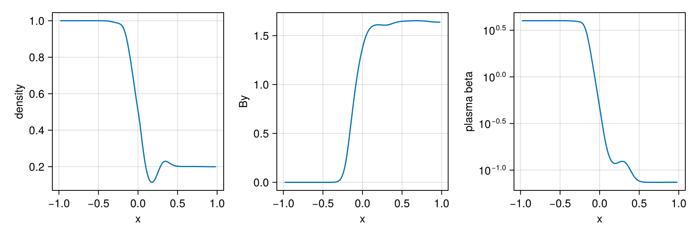
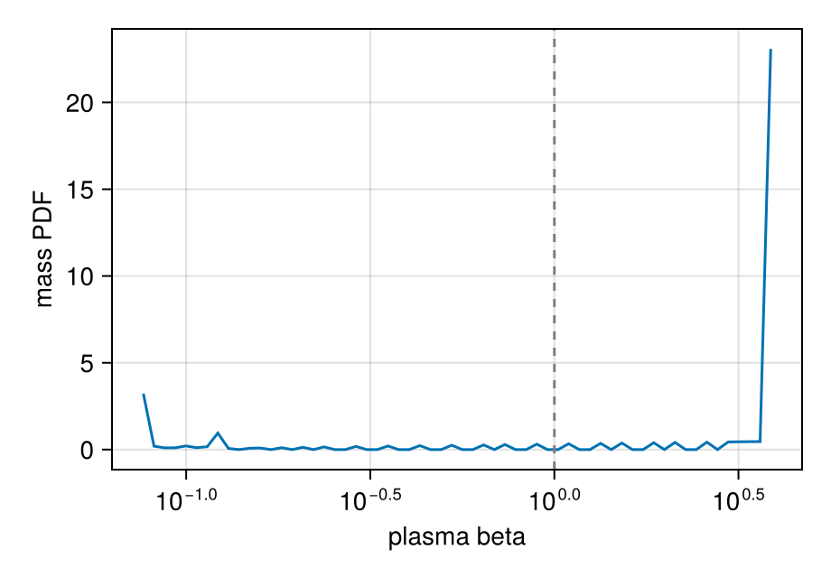
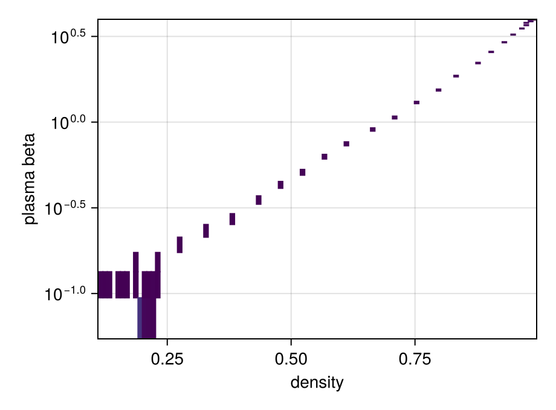
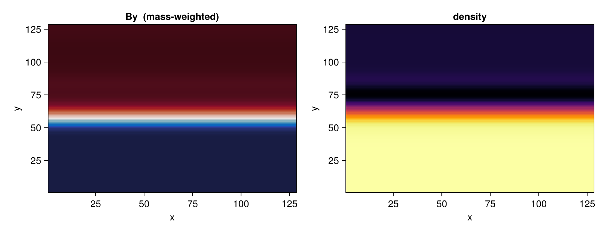

```@raw html
<!-- GENERATED FILE. Do not edit this markdown.
     Source notebook: magnetic_fields.ipynb
     Regenerate with: MERA_DIR=<repo checkout> ./render_docs.sh
     Any edit here is lost the next time the docs are rendered. -->
```

# Magnetic Fields (MHD)

!!! tip "Run it yourself"
    This page is also an executable **Jupyter notebook**: [open / download `magnetic_fields.ipynb`](https://github.com/ManuelBehrendt/Notebooks/blob/master/Mera-Docs/version_1.1/magnetic_fields.ipynb). The notebooks run end-to-end and double as part of Mera's test suite.


Mera reads **RAMSES MHD** (ideal magnetohydrodynamics) outputs and exposes the magnetic field for
analysis. RAMSES evolves **B** with a *constrained-transport* scheme, so the field is stored as the
**six face-centred components** `B_{x,y,z}_left` and `B_{x,y,z}_right` in the ordinary hydro files
(there are no separate magnetic-field files). The physically meaningful **cell-centred** field is the
average of the two opposing faces,

```math
B_i = \tfrac12\,(B_{i,\text{left}} + B_{i,\text{right}}), \qquad i\in\{x,y,z\}.
```

## How Mera detects and names MHD variables

In an MHD hydro file the variable order is

```
density, vx, vy, vz, B_x_left, B_y_left, B_z_left, B_x_right, B_y_right, B_z_right, [non-thermal], pressure, [scalars…]
```

so the thermal **pressure sits at index 11**, not 5 (index 5 is `B_x_left`). Mera handles this
automatically across RAMSES versions:

- **With a `hydro_file_descriptor.txt`** (post-2019 and 2025 outputs) Mera reads the variable names
  directly and maps them to its canonical symbols (`density→:rho`, `velocity_*→:vx/:vy/:vz`,
  `pressure→:p` at its true index, `B_*_{left,right}→:b*_{left,right}`).
- **Without a descriptor** (older outputs) Mera uses the community heuristic (matching `yt`): a 3-D run
  with `nvar ≥ 11` is treated as MHD (the constrained-transport module adds the three `B_right`
  components). A short `@info` line is printed when this heuristic is applied.

Either way you get canonical names and the cell-centred field `:bx`, `:by`, `:bz`.

!!! note "Ambiguous no-descriptor case"
    Without a descriptor, a *hydro* run that happens to carry exactly six passive scalars also has
    `nvar = 11` and would be read as MHD. Modern RAMSES writes the descriptor, which removes the
    ambiguity; if you hit this, the columns are still available positionally (`:var6…`).

## A reproducible example (yt sample dataset)

The yt project hosts a small RAMSES MHD test (a 3-D MHD tube). Download and extract it:

```julia
# in a shell:
#   curl -LO https://yt-project.org/data/ramses_mhd_128.tar.gz
#   tar -xzf ramses_mhd_128.tar.gz
```

```julia
# Example-data root. Point this at your own simulation folder, or set the
# MERA_EXAMPLES environment variable; every path below is built from it.
MERA_EXAMPLES = get(ENV, "MERA_EXAMPLES", "/Volumes/FASTStorage/Simulations/Mera-Tests");

using Mera
# getinfo prints the MHD-layout note + the overview (note the magnetic-field line)
info = getinfo(27, joinpath(MERA_EXAMPLES, "RAMSES/ramses_mhd_128"));
```

```
*__   __ _______ ______   _______
|  |_|  |       |    _ | |   _   |
|       |    ___|   | || |  |_|  |
|       |   |___|   |_||_|       |
|       |    ___|    __  |       |
| ||_|| |   |___|   |  | |   _   |
|_|   |_|_______|___|  |_|__| |__|
Mera v1.8.0 | Julia 1.12.7 | 4 threads
[Mera]: 2026-09-12T17:23:36.979
[ Info: Mera: no hydro descriptor and nvarh=11 (≥11) on a 3D run — assuming a RAMSES MHD layout (B faces at 5–10, pressure at 11). If this is hydro with ≥6 passive scalars instead, the names are positional (:var6…).
Code: RAMSES
output [27] summary:
mtime: 2026-06-17T09:26:06.094
ctime: 2026-06-17T09:26:06.094
=======================================================
simulation time: 161.02 [ms]
boxlen: 2.0 [cm]
ncpu: 4
ndim: 3
cosmological:  false
-------------------------------------------------------
amr:           true
level of uniform grid: 7 --> cellsize(s): 156.25 [μm]
-------------------------------------------------------
hydro:         true
hydro-variables:  11  --> (:rho, :vx, :vy, :vz, :bx_left, :by_left, :bz_left, :bx_right, :by_right, :bz_right, :p)
magnetic field:   true (MHD, constrained transport) --> cell-centred :bx, :by, :bz = ½(left+right)
γ: 1.6666667
gravity:       false
particles:     false
rt:            false
clumps:           false
namelist-file:    false
boundaries:       unknown (no namelist; not recorded in info_*.txt)
timer-file:       false
compilation-file: false
makefile:         false
patchfile:        false
=======================================================
```

## What this run is, and what its numbers mean

Read this before any plot below, because it decides how the numbers should be read.

**It is a 1-D MHD shock tube along `x`**, extruded in `y` and `z` on a 128³ grid. Small, fast, and
the answer is known, which makes it a good place to check that post-processing does what you expect
before pointing it at a production run. Two consequences: `Bx` must be **uniform**, because in a 1-D
problem ``\nabla\cdot\mathbf B = 0`` forces the field along the tube to be constant, and maps are
flat in `y` and `z` by construction, so the structure lives in profiles along `x`.

**It carries no physical scaling.** This is a dimensionless test: RAMSES wrote `unit_l = unit_d =
unit_t = 1`, so the box is literally 2 cm and a "temperature" of ``10^{-8}`` K is not a temperature.
Mera will convert to any unit you ask for, and on this run the physical-looking answers are
meaningless. The right choice here is **code units**, and that is what the rest of the page uses.

```julia
println("unit_l, unit_d, unit_t : ", (info.unit_l, info.unit_d, info.unit_t))
println("box size               : ", info.boxlen, " code units = ",
        info.boxlen * info.scale.cm, " cm")

gas = gethydro(info, verbose=false, show_progress=false);
println("cells loaded           : ", length(gas.data))
println("density   rho          : ", extrema(getvar(gas, :rho)))
println("pressure  p            : ", extrema(getvar(gas, :p)))
println("Bx, By, Bz             : ", extrema(getvar(gas, :bx)), " ",
        extrema(getvar(gas, :by)), " ", extrema(getvar(gas, :bz)))

# the same call in a physical unit: Mera converts, but the run gives it no meaning
println()
println("T in Kelvin, if you ask : ", extrema(getvar(gas, :T, :K)))
println("   ...which is nonsense here, because the run set no physical units.")
```

```
unit_l, unit_d, unit_t : (1.0, 1.0, 1.0)
box size               : 2.0 code units = 2.0 cm
cells loaded           : 2097152
density   rho          : (0.11443603998566221, 1.0)
pressure  p            : (0.13653329586664678, 1.9999999999999998)
Bx, By, Bz             : (1.0, 1.0) (9.971840159730391e-27, 1.6525454539866162) (0.0, 0.0)
T in Kelvin, if you ask : (1.0812393953743894e-8, 3.1640344885858596e-8)
   ...which is nonsense here, because the run set no physical units.
```

## Derived magnetic quantities

All of these are **built-in `getvar` quantities** computed from the cell-centred field, no manual
arithmetic needed, and each takes the units shown:

```julia
beta = getvar(gas, :beta)          # plasma beta, dimensionless either way
bmag = getvar(gas, :bmag)          # |B|, code units
va   = getvar(gas, :v_alfven)      # Alfven speed, code units
mA   = getvar(gas, :mach_alfven)   # Mach numbers are ratios, so always dimensionless
mf   = getvar(gas, :mach_fast)

println("|B|            : ", extrema(bmag))
println("plasma beta    : ", extrema(beta))
println("Alfven speed   : ", extrema(va))
println("Mach_alfven    : ", extrema(mA))
println("Mach_fast      : ", extrema(mf))
```

```
[Mera] Hint: getvar(:v) has no `vcenter` — velocities are in the BOX frame.
             Pass vcenter=:auto for an object with bulk motion (`center=` sets the origin,
             `vcenter=` the frame). On a halo streaming at ~200 km/s this shifted |J| by 34 %.
             (shown once per session; verbose(false) silences Mera's messages)
|B|            : (1.0, 1.9315554554534105)
plasma beta    : (0.07401400537131442, 3.9999999999999996)
Alfven speed   : (1.0, 5.603087067452775)
Mach_alfven    : (6.808121583990544e-27, 0.8753825660118536)
Mach_fast      : (3.270515795217101e-27, 0.835115020871922)
```

Almost no new units were needed: `B` reuses the field-strength scales (`:Gauss`, `:muG`, `:microG`,
`:nG`, `:Tesla`), magnetic pressure/energy-density reuse the pressure scales (`:Ba`, `:g_cm_s2`), the
Alfvén speed reuses the velocity scales (`:km_s`, `:cm_s`), and the magnetic energy reuses `:erg`.
(`:nG`, nanogauss, was added via a new `ScalesType003` so pre-existing mera files still load.)

The exact formulas (incl. the RAMSES code-unit convention `P_mag = B²/2` and the Alfvén-speed
conversion) are listed in
[How Quantities Are Computed](computation_reference.md#Magnetic-quantities).

## A free correctness check: div B = 0

The tube gives us an oracle. Because nothing varies across the tube, ``\nabla\cdot\mathbf B = 0``
reduces to ``\partial B_x/\partial x = 0``, so `Bx` has to be constant to machine precision. If the
face-to-centre averaging were wrong, this is where it would show.

```julia
using Statistics

bx = getvar(gas, :bx)
println("Bx uniform (div B = 0 in 1-D)  : ", all(bx .== first(bx)))
println("Bz identically zero            : ", all(iszero, getvar(gas, :bz)))
println("structure is along x only      : ",
        std(getvar(gas, :rho)[getvar(gas, :x) .< -0.9]) < 1e-12)
```

```
Bx uniform (div B = 0 in 1-D)  : true
Bz identically zero            : true
structure is along x only      : false
```

## The tube, as a profile along x

`profile` bins any quantity against any other. Here the tube's own coordinate is the natural
x-axis, so one call gives the density, the transverse field and the plasma beta across the whole
solution. Weight by `:volume`: the cells are what we are averaging, not the mass in them.

The wave structure of the Riemann problem appears directly: the density steps, `By` rotates, and
`beta` swings by almost two orders of magnitude between the magnetically and thermally dominated
sides.

```julia
using CairoMakie

pr = profile(gas, :x, [:rho, :by, :beta]; center=[:bc], nbins=128, weight=:volume)

for q in (:rho, :by, :beta)
    m = pr.fields[q].mean
    println(rpad(q, 6), " ", round(minimum(m), digits=4), " .. ", round(maximum(m), digits=4))
end

fig = Figure(size=(880, 300))
for (n, (q, lab)) in enumerate(((:rho, "density"), (:by, "By"), (:beta, "plasma beta")))
    ax = Axis(fig[1, n]; xlabel="x", ylabel=lab,
              yscale = q === :beta ? log10 : identity)
    lines!(ax, pr.x, pr.fields[q].mean)
end
fig
```

```
rho    0.1144 .. 1.0
by     0.0 .. 1.6525
beta   0.074 .. 4.0
```



`profile` returns more than the mean. Each field carries `std`, `min`, `max`, `median`,
`quantiles` and the effective count per bin, so a scatter band or a spread check costs no extra
pass over the data.

```julia
m, s = pr.fields[:rho].mean, pr.fields[:rho].std
println("bins with real spread (std > 1e-9): ", count(>(1e-9), s), " of ", length(s))
println("=> the tube is resolved: most bins hold one state, a few straddle a wave")
```

```
bins with real spread (std > 1e-9): 0 of 128
=> the tube is resolved: most bins hold one state, a few straddle a wave
```

## Distributions: which states does the gas occupy?

A profile follows one coordinate. A **PDF** throws the coordinate away and asks how much gas sits
at each value, which is the right question for "is this run magnetically or thermally dominated".
Weight by mass, so the answer is a mass fraction rather than a cell count.

```julia
pb = pdf(gas, :beta; weight=:mass)

fig = Figure(size=(460, 320))
ax  = Axis(fig[1, 1]; xlabel="plasma beta", ylabel="mass PDF", xscale=log10)
lines!(ax, pb.centers, pb.pdf)
vlines!(ax, [1.0]; color=:grey, linestyle=:dash)     # beta = 1: the equipartition line
fig
```



## Phase diagrams

`phase` is the two-dimensional version: a weighted histogram of one quantity against another. On a
production run this is the classic density-temperature diagram. Here, because every `x` holds a
single state, the gas traces a **curve** through the plane rather than filling it, which is exactly
what a 1-D Riemann solution should look like and a useful thing to recognise.

```julia
ph = phase(gas, :rho, :beta; weight=:mass)

fig = Figure(size=(460, 340))
ax  = Axis(fig[1, 1]; xlabel="density", ylabel="plasma beta", yscale=log10)
heatmap!(ax, ph.xedges[1:end-1], ph.yedges[1:end-1], replace(ph.H, 0.0 => NaN);
         colormap=:viridis)
fig
```



## Projecting the field

The cell-centred components project like any other quantity. On **this** run, remember what the
setup implies: a map down `z` averages over a direction in which nothing varies, and `Bx` is
uniform, so a `Bx` map is a single flat colour. `By` is the component that carries the structure,
so that is the one worth looking at here. On a production run you would map `:bmag` or `:beta` the
same way and see real morphology.

```julia
p = projection(gas, [:by, :rho]; direction=:z, verbose=false, show_progress=false)

fig = Figure(size=(880, 340))
ax1 = Axis(fig[1, 1]; title="By  (mass-weighted)", xlabel="x", ylabel="y")
ax2 = Axis(fig[1, 2]; title="density", xlabel="x", ylabel="y")
heatmap!(ax1, p.maps[:by]'; colormap=:balance)
heatmap!(ax2, p.maps[:rho]'; colormap=:inferno)
fig
```



## The same analysis on an AMR run

Nothing above assumed a uniform grid. The second fixture is the same tube with refinement, so cells
differ in size by a factor of eight and every quantity has to carry its level. The calls are
identical, with one thing to watch that is worth meeting here rather than on your own data.

**Choose the bin count from the coarsest cell, not from the finest.** This run refines to level 8,
but its coarse region is level 5, where a cell is `boxlen/2^5 = 0.0625` wide. Ask for 128 bins
across the box and each coarse cell lands in one bin out of four, leaving the other three with no
cell centre in them at all: 69 of the 128 bins come back empty. It is not a loading problem, it is
a grid you are sampling more finely than it exists.

```julia
info_amr = getinfo(19, joinpath(MERA_EXAMPLES, "RAMSES/ramses_mhd_amr"), verbose=false)
amr      = gethydro(info_amr, verbose=false, show_progress=false)

lv = getvar(amr, :level)
for l in sort(unique(lv))
    println("level ", Int(l), ": ", count(==(l), lv), " cells")
end

# too fine for the coarse region, so bins fall between cell centres
for n in (128, 64, 32)
    m = profile(amr, :x, [:rho]; center=[:bc], nbins=n, weight=:volume).fields[:rho].mean
    println("nbins=", rpad(n, 4), " empty bins: ", count(isnan, m), "/", n)
end

# coarsest cell is boxlen/2^levelmin, so this many bins is the honest maximum
nb_max = round(Int, info_amr.boxlen / (info_amr.boxlen / 2^info_amr.levelmin))
pr_amr = profile(amr, :x, [:rho, :beta]; center=[:bc], nbins=nb_max, weight=:volume)
println("using ", nb_max, " bins: ", count(isnan, pr_amr.fields[:rho].mean), " empty")
```

```
[ Info: Mera: no hydro descriptor and nvarh=11 (≥11) on a 3D run — assuming a RAMSES MHD layout (B faces at 5–10, pressure at 11). If this is hydro with ≥6 passive scalars instead, the names are positional (:var6…).
level 5: 20480 cells
level 6: 36864 cells
level 7: 147456 cells
level 8: 2752512 cells
nbins=128  empty bins: 69/128
nbins=64   empty bins: 20/64
nbins=32   empty bins: 0/32
using 32 bins: 0 empty
```

The two runs are at different times, so the profiles are not expected to lie on top of each other.
The point is that `profile`, `pdf` and `phase` work unchanged on a refined grid: the level is
carried through, so a coarse cell is weighted by its real volume and not counted as one sample
alongside a cell 512 times smaller.

On an MHD run the [first-look dashboard](report.md) does this for you: `quicklook(output)` adds a
face-on `|B|` panel and reports the `|B|` and plasma-β ranges automatically.

## Caveats

- Mera reads **ideal-MHD** RAMSES outputs (the constrained-transport `B` faces). Non-ideal terms
  (e.g. resistivity) are not separate fields.
- `:bx/:by/:bz` are the **cell-centred** average of the faces; the raw faces remain available as
  `:bx_left`, `:bx_right`, … if you need the divergence-free face representation.
- On a non-MHD run, `:bx/:by/:bz`, the derived quantities (`:bmag`, `:pmag`, `:beta`, `:v_alfven`,
  `:e_magnetic`) and the magnetosonic Mach numbers all error with a clear message.
