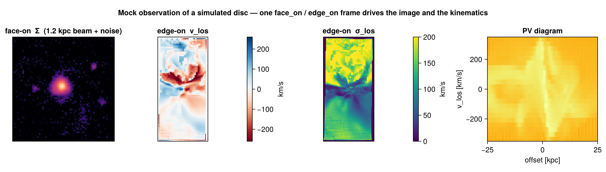

# Mock Observations (cookbook)

Mera ships a full mock-observation toolkit — beam/PSF convolution, velocity cubes and moment
maps, position–velocity diagrams, spectra, emission maps, and FITS export. This page ties
them together with the [auto-frame](galaxyframe.md): orient the galaxy **once**, then reuse
that frame to produce the image *and* the kinematics, exactly as a telescope would see them.



The rule of thumb the figure follows: **face-on for morphology, edge-on for kinematics**
(a disc's rotation is in its plane, so it shows up along the line of sight only when the disc
is tilted toward edge-on).

## Step 0 — orient once, reuse everywhere

[`face_on`](@ref) / [`edge_on`](@ref) return a frame whose `los`/`up`/`center` feed every
function below. Compute it once so the image and the kinematics share the same geometry:

```julia
using Mera
gas = gethydro(getinfo(100, "/data/Mera-Tests/spiral_clumps"))

fo = face_on(gas; aperture=0.3)     # disc spin axis (aperture isolates the disc)
eo = edge_on(gas; aperture=0.3)
view = (; center=fo.center, range_unit=fo.center_unit,
          xrange=[-0.22, 0.22], yrange=[-0.22, 0.22])   # zoom onto the disc
```

(For a crowded or cosmological box, give `face_on` a seed `center` + `aperture` so it locks
onto one object — see [Auto-Frame](galaxyframe.md).)

## Step 1 — a mock image (beam/PSF + noise)

Project the quantity, then convolve with a beam and add noise via [`mock_observe`](@ref):

```julia
pr  = projection(gas, :sd; los=fo.los, up=fo.up, view...)
img = mock_observe(pr, :sd; beam_fwhm=1.2, beam_unit=:kpc,          # a physical beam …
                   noise=0.004*maximum(pr.maps[:sd]), rng=MersenneTwister(1))
```

The beam can also be **angular** — give `beam_unit=:arcsec` (or `:arcmin`/`:deg`) together
with a source `distance`; the physical beam is then `θ × distance` (small-angle). Use Mera's
cosmology helpers for the angular-diameter distance of a redshifted source. A seeded `rng`
makes the noise reproducible.

## Step 2 — velocity field and dispersion (moment maps)

[`velocity_cube`](@ref) builds a spectral (velocity-channel) cube along the line of sight;
[`velocity_moments`](@ref) collapses it to the moment-0/1/2 maps `Σ`, `vlos`, `σlos`:

```julia
vc = velocity_cube(gas; los=eo.los, up=eo.up, view...,
                   nv=90, vrange=[-350, 350], v_unit=:km_s)
m  = velocity_moments(vc)        # m.Σ (column), m.vlos (rotation), m.σlos (dispersion)
```

`vrange` acts like a spectrometer bandwidth — windowing out high-velocity outliers. The
binned `σlos` is biased slightly high for under-resolved lines (Sheppard correction); for a
**bias-free** velocity or dispersion map of any vector, use
[`los_component`](@ref)`(gas, (:vx,:vy,:vz); dispersion=true)`, which accumulates the moments
from the continuous per-cell samples.

## Step 3 — position–velocity diagram

[`position_velocity`](@ref) bins mass into (offset along an in-plane axis, line-of-sight
velocity) — the classic long-slit / PV kinematic diagnostic:

```julia
pv = position_velocity(gas; los=eo.los, up=eo.up,
                       center=fo.center, range_unit=fo.center_unit,
                       nbins=160, offset_unit=:kpc, v_unit=:km_s)
# pv.offset, pv.velocity (bin edges), pv.pv (the nbins×nbins mass map)
```

## Step 4 — spectra and emission

- [`getspectrum`](@ref)`(vc; x=0, y=0)` returns the line-of-sight **spectrum** through a sky
  pixel (a synthetic emission-line profile from a velocity cube; a PDF from a `los_cube(:T)`).
- [`integrated_spectrum`](@ref)`(vc)` sums it over the whole map — the global line profile.
- [`emission_map`](@ref)`(gas; kappa, source)` makes an optical-depth-weighted emission map
  (an absorption/emission line image) rather than a plain column.

## Step 5 — export to FITS / cubes

- [`savefits`](@ref) writes a map or cube to **FITS with a WCS** (linear or sky), so it opens
  in DS9 / astropy / CASA. It is a package extension — `using FITSIO` first.
- [`savecube`](@ref) / `loadcube` round-trip a velocity cube via JLD2.

## See also

- [Auto-Frame](galaxyframe.md) — `face_on`/`edge_on` and the crowded-box recipe.
- [Off-axis projection](06_offaxis_Projection.md) — the projection engine and its view keywords.
- [LOS cubes & kinematics](12_multi_LosCubes.md) — the velocity-cube machinery in depth.
- [Time Series](timeseries.md) — wrap any of the above in a reducer to watch it evolve.
