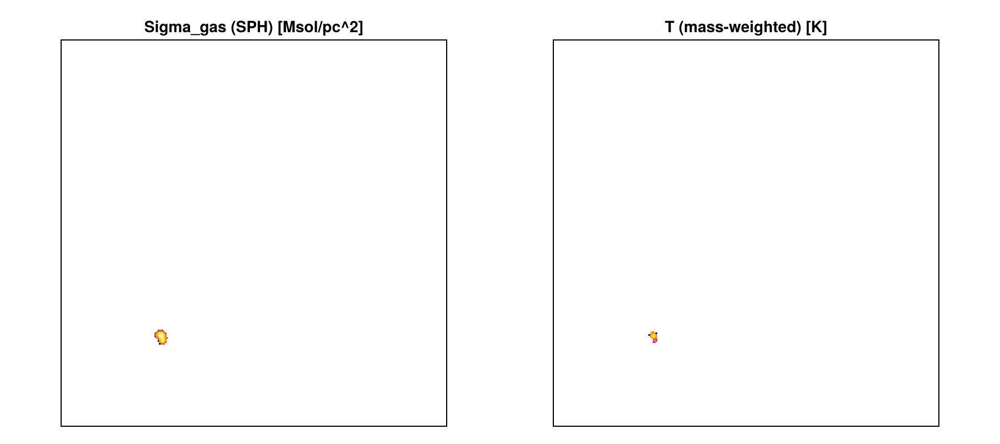

# Other Simulation Codes — Worked Examples

!!! note "Executed notebook"
    This page is the **executed** [`16_multi_OtherCodes`](https://github.com/ManuelBehrendt/Notebooks/blob/master/Mera-Docs/version_1/16_multi_OtherCodes.ipynb)
    notebook — real snapshots, real outputs. It loads PLUTO / Chombo / Athena++ / FLASH / GADGET and the
    AREPO/IllustrisTNG gas workflow end-to-end. See [Multi-code support](multicode.md) for the overview.

Mera began as a RAMSES tool, but its analysis layer is **code-blind** — it works on a generic
uniform/AMR cell list (or particle list), not on RAMSES file formats. So the *same* calls
(`getvar`, `projection`, `subregion`, `timeseries`, `savedata`, …) run on data from several codes:

| Code | grid / particles | what this notebook shows |
|---|---|---|
| **PLUTO** (uniform + Chombo-AMR) | grid | load, getvar |
| **Athena++** | AMR grid + MHD | MHD field, load-time sub-region |
| **FLASH** | AMR grid | a self-gravity potential field |
| **GADGET** (+ GIZMO/AREPO/SWIFT/TNG) | particles + **gas cells** | `getparticles`, gas ρ/T/Z, SPH maps |

It also covers self-gravity, chemistry and radiative-transfer fields, and converting any code to a
Mera file. See the [Multi-code support](https://manuelbehrendt.github.io/Mera.jl/stable/multicode/)
docs for the full reference.

> The test snapshots live under `MERA_TEST_DATA` (download the synthetic/sample data, or point the
> path at your own runs).


```julia
using Mera
base = get(ENV, "MERA_TEST_DATA", "/Volumes/FASTStorage/Simulations/Mera-Tests")
```

    [ Info: Precompiling Mera [02f895e8-fdb1-4346-8fe6-c721699f5126] (cache misses: include_dependency fsize change (4), dep missing source (4), mismatched flags (10))


    
    SYSTEM: caught exception of type :MethodError while trying to print a failed Task notice; giving up


    
    *__   __ _______ ______   _______ 

    
    |  |_|  |       |    _ | |   _   |
    |       |    ___|   | || |  |_|  |
    |       |   |___|   |_||_|       |
    |       |    ___|    __  |       |
    | ||_|| |   |___|   |  | |   _   |
    |_|   |_|_______|___|  |_|__| |__|
    Mera v1.8.0
    


    "/Volumes/FASTStorage/Simulations/Mera-Tests"


## PLUTO (uniform grid)

`getinfo` auto-detects the code from the directory's signature files and prints the same overview a
RAMSES snapshot would; `gethydro` then returns an ordinary `HydroDataType`.


```julia
info = getinfo(5, joinpath(base, "pluto_sedov3d"))   # auto-detects PLUTO
gas  = gethydro(info, verbose=false)
maximum(getvar(gas, :rho))                           # the usual analysis, unchanged
```

    [Mera]: 2026-06-25T23:01:30.449
    


    Code: PLUTO
    output: 5  time: 0.5 [code units]
    grid: 64³ uniform Cartesian, level 6, boxlen = 1.0
    variables: (rho, vx, vy, vz, p)
    -------------------------------------------------------


    4.040484204505616


## Chombo (PLUTO-AMR)

PLUTO's AMR output (the Chombo HDF5 format) loads as a Mera **AMR** object with a `:level` column.


```julia
gc = gethydro(getinfo(0, joinpath(base, "chombo_3d/IsothermalSphere"), verbose=false), verbose=false)
sort(unique(getvar(gc, :level)))                # the refinement levels present
```


    2-element Vector{Float64}:
     6.0
     7.0


## Athena++ (AMR MHD) + a load-time sub-region

Athena++ `.athdf` snapshots carry cell-centred MHD, so `:bx/:by/:bz` and derived `:bmag` work. The
spatial-window arguments load only part of the box (reading only the intersecting MeshBlocks).


```julia
ia = getinfo(5, joinpath(base, "athena_blast"))       # a self-built 3-D MHD blast
ga = gethydro(ia, verbose=false)
@show maximum(getvar(ga, :bmag));                    # magnetic field strength

# central 20% box — only the intersecting blocks are read
gsub = gethydro(ia; xrange=[-0.1,0.1], yrange=[-0.1,0.1], zrange=[-0.1,0.1],
                center=[:bc], range_unit=:standard, verbose=false)
length(gsub.data), length(ga.data)                   # sub-region ≪ full snapshot
```

    [Mera]: 2026-06-25T23:01:41.458
    


    Code: Athena++
    output: 5  time: 0.50111 [code units]
    root grid: 32³ (level 5), MaxLevel 2 ⇒ levels 5:7, boxlen = 2.0
    MeshBlocks: 148   variables: (rho, p, vx, vy, vz, bx, by, bz)
    -------------------------------------------------------
    maximum(getvar(ga, :bmag)) = 1.1211309571451635

    


    (15625, 606208)


## FLASH

FLASH plot files load as AMR hydro/MHD; a self-gravity potential (if present) appears as `:gpot`.


```julia
gf = gethydro(getinfo(150, joinpath(base, "flash_gassloshing/GasSloshing"), verbose=false), verbose=false)
:gpot in gf.info.variable_list
```


    true


## GADGET / GIZMO / AREPO / SWIFT / IllustrisTNG (particles)

GADGET HDF5 is particle-based, so it loads through `getparticles` into a `PartDataType`. `:family`
is the particle type (0 gas, 1 DM, 2 disk, 3 bulge, 4 stars, 5 BH); `families=` selects a subset.


```julia
ig = getinfo(200, joinpath(base, "gadget_diskgalaxy/GadgetDiskGalaxy"))
stars = getparticles_gadget(ig; families=[4])        # just the star particles
length(stars.data), msum(stars) > 0
```

    [Mera]: 2026-06-25T23:02:04.867
    


    Code: GADGET
    output: 200  time: 0.34483  redshift: 1.9
    boxlen = 64000.0
    particles: 4334546 gas, 4786616 halo/DM, 2333848 disk, 450921 stars, 1149 bndry/BH  (total 11907080)
    -------------------------------------------------------
    [Mera]: GADGET particles = 450921, families 4

      (x,y,z,vx,vy,vz,mass,id,family)


    (450921, true)


### AREPO / IllustrisTNG — gas-cell physics

For **gas** (`PartType0`) the Voronoi-cell fields are read too, so the full thermodynamic analysis
runs in **physical units** (comoving→physical *a*/*h* is applied automatically for cosmological
runs). Below: a real IllustrisTNG halo cutout.


```julia
it  = getinfo(59, joinpath(base, "arepo/TNGHalo/TNGHalo/halo_59.hdf5"))   # IllustrisTNG (AREPO)
gas = getparticles_gadget(it; families=[0])      # PartType0 gas → :rho,:u,:ne,:metallicity,:sfr,:volume + :T
println("gas cells   : ", length(gas.data))
println("rho [g/cm³] : ", extrema(getvar(gas, :rho, :g_cm3)))
println("T   [K]     : ", extrema(getvar(gas, :T)))
println("metallicity : ", extrema(getvar(gas, :metallicity)))
```

    [Mera]: 2026-06-25T23:02:06.313
    
    Code: AREPO
    output: 59  time: 1.0  redshift: 0.0
    boxlen = 205000.0
    particles: 4006794 gas, 5567314 halo/DM, 533034 stars  (total 10107142)
    -------------------------------------------------------
    [Mera]: GADGET particles = 4006794, families 0

      (x,y,z,vx,vy,vz,mass,id,family,rho,u,ne,metallicity,sfr,volume)
    gas cells   : 4006794
    rho [g/cm³] : 

    (1.3854807197342735e-30, 1.17827292777639e-22)
    T   [K]     : 

    (17.965557996942835, 1.2925814640761332e8)
    metallicity : (8.100937520794105e-8, 0.04447760060429573)


```julia
# the usual reductions run unchanged on AREPO gas, in physical units
n = length(gas.data)
println("median T [K]   : ", sort(getvar(gas, :T))[n ÷ 2])
println("median Z       : ", sort(getvar(gas, :metallicity))[n ÷ 2])
println("gas mass [Msol]: ", msum(gas, :Msol))
```

    median T [K]   : 1.436872560859919e7

    
    median Z       : 0.001993876649066806
    gas mass [Msol]: 4.6930995577059625e13


Gas maps come from the particle projection — point deposition (default) or `weighting=:sph`, which
smears each cell over an M4 kernel sized from its `:volume`. Both are mass-conserving.


```julia
using CairoMakie
c  = [sum(getvar(gas,:x)), sum(getvar(gas,:y)), sum(getvar(gas,:z))] ./ length(gas.data) ./ gas.boxlen
sd = projection(gas, :sd, :Msol_pc2, res=256, center=c, weighting=:sph)   # SPH surface density
Tm = projection(gas, :T,             res=256, center=c, weighting=:mass)   # mass-weighted ⟨T⟩
fig = Figure(size=(900, 400))
a1 = Axis(fig[1,1]; title="Sigma_gas (SPH) [Msol/pc^2]", aspect=DataAspect()); hidedecorations!(a1)
a2 = Axis(fig[1,2]; title="T (mass-weighted) [K]",        aspect=DataAspect()); hidedecorations!(a2)
heatmap!(a1, log10.(ifelse.(sd.maps[:sd] .> 0, sd.maps[:sd], NaN))'; colormap=:inferno)
heatmap!(a2, log10.(ifelse.(Tm.maps[:T]  .> 0, Tm.maps[:T],  NaN))'; colormap=:plasma)
fig
```

    [ Info: Precompiling MeraMakieExt [defab1b5-6ec5-5409-a2f4-69ec619b2a0e] (cache misses: wrong dep version loaded (18))


    
    SYSTEM: caught exception of type :MethodError while trying to print a failed Task notice; giving up


    [ Info: Mera v1.8.0


    [Mera]: 2026-06-25T23:02:24.117
    


    center: [0.2352905, 0.2634881, 0.3024498] ==> [71.205 [Mpc] :: 79.739 [Mpc] :: 91.53 [Mpc]]
    
    domain:
    xmin::xmax: 0.0 :: 1.0  	==> 0.0 [Mpc] :: 302.628 [Mpc]
    ymin::ymax: 0.0 :: 1.0  	==> 0.0 [Mpc] :: 302.628 [Mpc]
    zmin::zmax: 0.0 :: 1.0  	==> 0.0 [Mpc] :: 302.628 [Mpc]
    
    Effective resolution: 256^2
    Pixel size: 1.182 [Mpc]
    Simulation min.: 151.314 [Mpc]
    
    [Mera]: 2026-06-25T23:02:41.328


    
    center: [0.2352905, 0.2634881, 0.3024498] ==> [71.205 [Mpc] :: 79.739 [Mpc] :: 91.53 [Mpc]]
    
    domain:
    xmin::xmax: 0.0 :: 1.0  	==> 0.0 [Mpc] :: 302.628 [Mpc]
    ymin::ymax: 0.0 :: 1.0  	==> 0.0 [Mpc] :: 302.628 [Mpc]
    zmin::zmax: 0.0 :: 1.0  	==> 0.0 [Mpc] :: 302.628 [Mpc]
    
    Effective resolution: 256^2
    Pixel size: 1.182 [Mpc]
    Simulation min.: 151.314 [Mpc]
    





## Self-gravity, chemistry & radiative transfer

Where a code writes these fields, the reader maps them to **canonical names** — so the same
`getvar` call works across codes: `:gpot` (potential), `:xHI`/`:xH2`/`:xCO` (chemistry species),
`:Np1…:Np8` (radiation photon groups).


```julia
sg = gethydro(getinfo(2, joinpath(base, "athena_selfgravity"), verbose=false), verbose=false)
ch = gethydro(getinfo(5, joinpath(base, "athena_chemistry"),  verbose=false), verbose=false)
rt = gethydro(getinfo(5, joinpath(base, "athena_sixray"),     verbose=false), verbose=false)
(gpot = extrema(getvar(sg, :gpot)),
 xH2  = maximum(getvar(ch, :xH2)),                   # H2 fraction (PDR chemistry)
 Np1  = extrema(getvar(rt, :Np1)))                   # UV radiation field, attenuated by shielding
```


    (gpot = (-0.03948165848851204, 0.0446300245821476), xH2 = 0.4545285999774933, Np1 = (2.655466318130493, 7.641556739807129))


## Convert any code to a Mera file

`savedata`/`loaddata` round-trips **any** loaded object to Mera's portable JLD2 format — so a saved
series even feeds `timeseries(…; mera_files=true)`.


```julia
tmp = mktempdir()
savedata(ga, tmp; fmode=:write, verbose=false)
g2 = loaddata(5, tmp, :hydro; verbose=false)
length(g2.data) == length(ga.data) && getvar(g2, :rho) == getvar(ga, :rho)
```


    true


---
Every call above is identical to what you'd run on a RAMSES snapshot — that is the whole point of
the code-blind analysis layer. For per-code details (units, variable mapping, coordinate
conventions, reference readers) see the
[Other Simulation Codes](https://manuelbehrendt.github.io/Mera.jl/stable/multicode/) docs.
